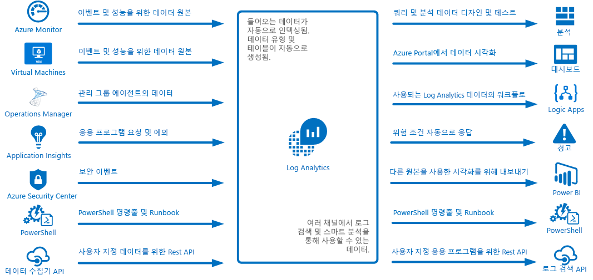
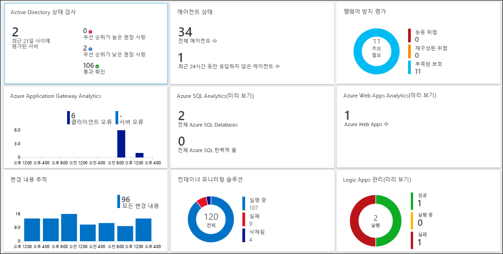
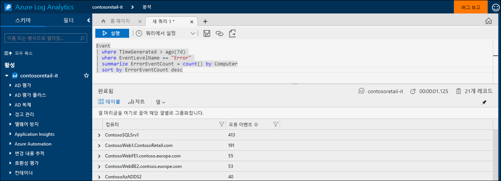
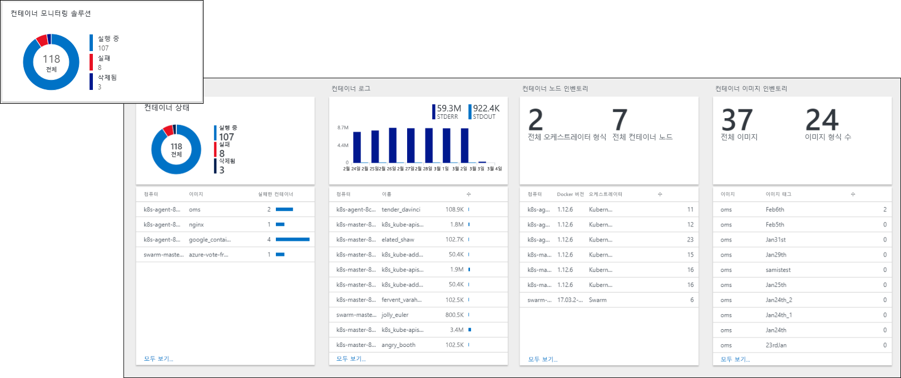
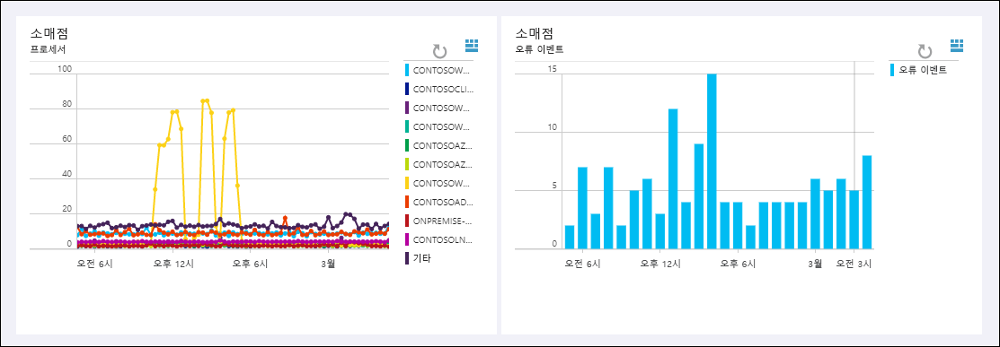
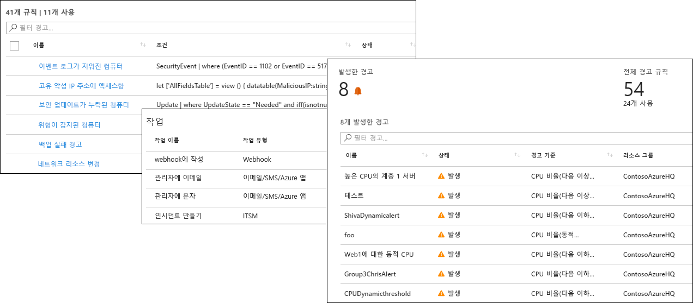
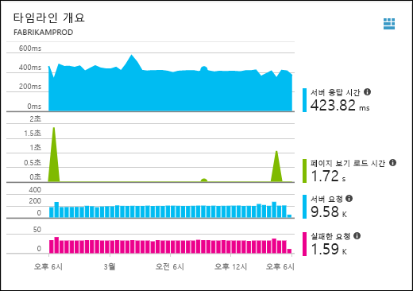
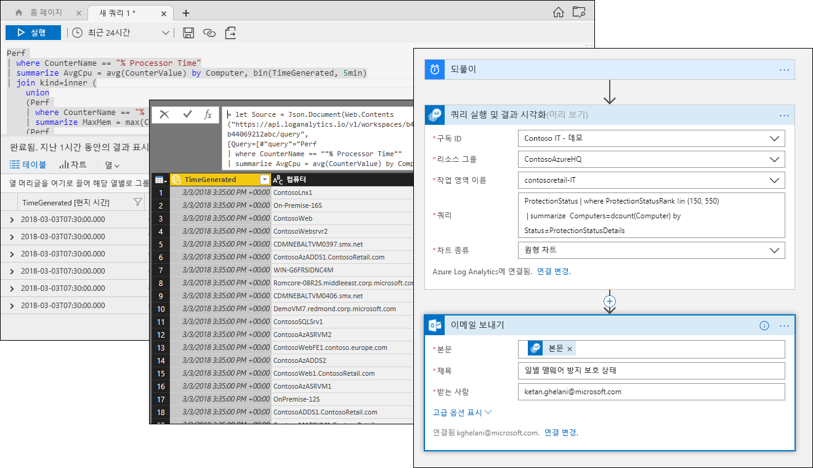

# Azure Log Analytics란?
Log Analytics는 다양한 원본에서 원격 분석 및 기타 데이터를 수집하고 응용 프로그램 및 리소스의 작업에 대한 통찰력을 제공하는 쿼리 언어 및 분석 엔진을 제공하여 Azure 관리에서 중심적인 역할을 수행합니다.  로그 검색 및 보기를 통해 Log Analytics 데이터와 직접 상호 작용하거나 Application Insights 또는 Azure Security Center 같은 Log Analytics에 데이터를 저장하는 다른 Azure 서비스에서 분석 도구를 사용할 수도 있습니다.  

Log Analytics는 최소한의 구성을 요구하며 이미 다른 Azure 서비스와 통합돼 있습니다.  컬렉션을 사용하여 작업 영역을 만들기만 하면 됩니다.  그런 다음, 작업 영역에 포함되고 다른 응용 프로그램에 추가 통찰력을 제공하는 논리를 포함하는 관리 솔루션을 사용할 가상 머신에 에이전트를 설치할 수 있습니다.  그 배후에서 데이터 형식은 데이터가 수집될 때 사전 정의되거나 자동으로 만들어집니다.

## 모니터링 역할

Azure에서 다양한 모니터링 서비스는 [Azure 응용 프로그램 및 리소스 모니터링](../monitoring-and-diagnostics/monitoring-overview.md)에 설명돼 있습니다.  Log Analytics는 다양한 원본에서 모니터링 데이터를 통합하고 통합 및 분석을 위해 강력한 쿼리 언어를 제공하여 중요한 역할을 수행합니다.  

그렇다 해도 Log Analytics는 Azure 리소스 모니터링에 국한되지 않습니다.  Log Analytics는 하이브리드 모니터링 환경을 만들기 위해 다른 클라우드 또는 온-프레미스의 리소스에서 데이터를 수집할 수 있으며 기존 에이전트에서 원격 분석을 수집하기 위해 System Center Operations Manager에 직접 연결할 수 있습니다.  로그 검색, 뷰 및 관리 솔루션과 같은 Log Analytics의 분석 도구는 전체 환경의 중앙 집중식 분석 능력을 제공하는 모든 수집된 데이터에 대해 작동합니다.

## 데이터 수집
Log Analytics는 다양한 원본에서 데이터를 수집합니다.  수집이 완료되면 데이터는 각 데이터 형식에 대해 별도 테이블로 구성되어 원본에 관계 없이 모든 데이터가 함께 분석되도록 합니다.

Log Analytics에 데이터를 수집하기 위한 메서드는 다음과 같습니다.

- Azure 리소스에서 수집하는 [로그 및 메트릭](../monitoring/monitoring-data-collection.md#types-of-monitoring-data)을 복사하려면 Azure Monitor를 구성합니다.
- [Azure Storage](log-analytics-azure-storage-iis-table.md)에 쓸 원격 분석을 수집합니다.
- [Windows](log-analytics-windows-agent.md) 및 [Linux](log-analytics-linux-agents.md) 가상 머신에서 에이전트는 구성하는 [데이터 소스](log-analytics-data-sources.md)에 따라 게스트 운영 체제 및 응용 프로그램에서 Log Analytics로 원격 분석을 전송합니다. 에이전트는 방화벽 액세스가 없거나 [System Center Operations Manager 관리 그룹](log-analytics-om-agents.md)을 통해 연결하지 못할 경우 [OMS 게이트웨이](log-analytics-oms-gateway.md)를 통해 직접 연결할 수 있습니다.
- [Application Insights](https://docs.microsoft.com/azure/application-insights/) 및 [Azure Security Center](https://docs.microsoft.com/azure/security-center/) 같은 Azure 서비스는 아무런 구성 없이 Log Analytics에 직접 데이터를 저장합니다.
- Log Analytics cmdlet를 사용하여 PowerShell 명령줄 또는 [Azure Automation Runbook](../automation/automation-runbook-types.md)에서 데이터를 작성합니다.
- 사용자 지정 요구 사항이 있는 경우 [HTTP 데이터 수집기 API](log-analytics-data-collector-api.md)를 사용하여 REST API 클라이언트에서 Log Analytics로 데이터를 작성하거나 [Azure Logic App](https://docs.microsoft.com/azure/logic-apps/)을 사용하여 사용자 지정 워크플로에서 데이터를 작성할 수 있습니다.

## 관리 솔루션에서 기능 추가
[관리 솔루션](log-analytics-add-solutions.md)은 특정 제품 또는 시나리오에 대해 미리 패키지된 논리를 제공합니다.  이 솔루션은 이미 수집된 처리 데이터 또는 Log Analytics에 추가 데이터를 수집할 수 있습니다.  이 솔루션에는 일반적으로 이 추가 데이터를 분석하도록 돕는 보기가 포함됩니다.  다양한 기능에 솔루션을 사용할 수 있으며 추가 솔루션을 지속적으로 추가합니다.  사용 가능한 솔루션을 쉽게 찾아서 Azure Marketplace의 [작업 영역에 추가](log-analytics-add-solutions.md)할 수 있습니다.  

## 쿼리 언어

Log Analytics는 데이터를 신속하게 검색하고 통합하고 분석하는 [풍부한 쿼리 언어](http://docs.loganalytics.io)를 포함합니다.  [로그 검색 또는 Advanced Analytics 포털](log-analytics-log-search-portals.md)을 사용하여 쿼리를 만들고 테스트한 다음, 이러한 도구를 사용하여 데이터를 직접 분석하거나 Power BI 또는 Excel 같은 다른 도구에 시각화, 경고 또는 내보내기를 사용하기 위해 쿼리를 저장할 수도 있습니다.

Log Analytics 쿼리 언어는 단순 로그 검색에 적합하지만 집계, 조인, 스마트 분석 같은 고급 기능도 포함합니다. 사용할 수 있는 [여러 자습서](https://docs.loganalytics.io/docs/Learn/Tutorials)를 사용하여 쿼리 언어를 빠르게 배울 수 있습니다.  [SQL](https://docs.loganalytics.io/docs/Learn/References/SQL-to-Azure-Log-Analytics) 및 [Splunk](https://docs.loganalytics.io/docs/Learn/References/Splunk-to-Azure-Log-Analytics)에 이미 익숙한 사용자에게는 특정 지침이 제공됩니다.

## Log Analytics 데이터를 시각화합니다.

[Log Analytics에서 보기](log-analytics-view-designer.md)는 로그 검색에서 데이터를 시각적으로 표시합니다.  각 보기에는 중요한 데이터를 요약한 목록 외에 막대형 차트 및 꺾은선형 차트 같은 시각화의 조합이 포함되어 있습니다.  [관리 솔루션](#add-functionality-with-management-solutions)은 특정 응용 프로그램에 대한 데이터를 요약하는 보기를 포함하며 Log Analytics 로그 검색에서 데이터를 표시하기 위해 자신만의 보기를 만들 수 있습니다.

Log Analytics 쿼리 결과를 [Azure 대시보드](../azure-portal/azure-portal-dashboards.md)에 고정해 다른 Azure 서비스에서 타일을 결합하게 할 수 있습니다.  Log Analytics 보기를 대시보드에 고정할 수도 있습니다.

## Log Analytics 데이터에서 경고 만들기

[Azure Alerts](../monitoring-and-diagnostics/monitoring-overview-unified-alerts.md)를 사용하여 사용자에게 중요한 Log Analytics 데이터의 조건을 미리 알려줍니다.  결과가 특정 기준과 일치하는 경우 쿼리는 예약된 간격과 만들어진 경고에 따라 자동으로 실행됩니다.  이렇게 하면 경고 조건에 대 한 대응을 위해 [작업 그룹](../monitoring-and-diagnostics/monitoring-action-groups.md)을 공유하여 거의 실시간 경고인 [Azure Monitor](../monitoring-and-diagnostics/monitoring-near-real-time-metric-alerts.md) 및 응용 프로그램 예외인 [Application Insights](../application-insights/app-insights-alerts.md) 같은 다른 원본과 Log Analytics의 경고를 결합할 수 있습니다.

## 다른 서비스에서 Log Analytics 데이터 사용하기
Application Insights 및 Azure Security Center 같은 Azure 서비스는 Log Analytics에 데이터를 저장합니다.  일반적으로 이러한 서비스에서 제공하는 풍부한 분석 도구와 상호 작용하지만 Log Analytics 쿼리를 사용하여 해당 데이터에 액세스하고 잠재적으로 다른 서비스의 데이터와 결합할 수 있습니다.  

예를 들어 Application Insights에서 다음 보기가 가능합니다.  오른쪽 위에 있는 아이콘을 클릭하면 그래프가 사용된 쿼리를 사용해 Log Analytics 분석 콘솔이 시작됩니다.

## Log Analytics 데이터 내보내기

Log Analytics는 데이터를 Azure 외부에서도 사용할 수 있습니다.  [Power BI](log-analytics-powerbi.md)를 구성해 예정된 간격으로 쿼리 결과를 가져오면 여러 소스의 데이터를 결합하고 웹 및 모바일 장치에서 보고서를 공유하는 등의 기능을 활용할 수 있습니다.  또한 [Log Search API](log-analytics-log-search-api.md)를 통해 Log Analytics 데이터를 활용하는 사용자 지정 솔루션을 빌드하거나 다른 시스템에 통합할 수 있습니다.

Azure에서 [Logic Apps](../logic-apps/logic-apps-overview.md)을 사용하여 Log Analytics 데이터를 기반으로 사용자 지정 워크플로를 만들 수 있습니다.  PowerShell에 기반한 더 복잡한 논리의 경우 [Azure Automation에서 Runbook](../automation/automation-runbook-types.md)을 사용할 수 있습니다.

## 다음 단계
- [Azure Vm에서 데이터를 수집](log-analytics-quick-collect-azurevm.md)하여 시작합니다.
- [단순 쿼리를 사용한 Log Analytics 데이터 분석 자습서](log-analytics-tutorial-viewdata.md)를 검토합니다.
* [사용 가능한 솔루션을 찾아서](log-analytics-add-solutions.md) Log Analytics에 기능을 추가합니다.

