# <a name="configure-proxy-and-firewall-settings-in-log-analytics"></a>Log Analytics에서 프록시 및 방화벽 설정 구성
OMS의 Log Analytics에 대한 프록시 및 방화벽 설정을 구성하는 데 필요한 작업은 Operations Manager를 사용할 때와 다르며, 해당 에이전트는 서버에 직접 연결되는 Microsoft Monitoring Agent입니다. 사용하는 에이전트 유형에 따라 다음 섹션을 검토하세요.

## <a name="configure-proxy-and-firewall-settings-with-the-microsoft-monitoring-agent"></a>Microsoft Monitoring Agent를 사용하여 프록시 및 방화벽 설정 구성
Microsoft Monitoring Agent를 사용하여 OMS 서비스에 연결하고 등록하려면 도메인 및 URL의 포트 번호에 대한 액세스 권한이 있어야 합니다. 에이전트와 OMS 서비스 간의 통신에 프록시 서버를 사용하는 경우 적절한 리소스에 액세스할 수 있는지 확인해야 합니다. 방화벽을 사용하여 인터넷에 대한 액세스를 제한하는 경우 OMS에 대한 액세스를 허용하도록 방화벽을 구성해야 합니다. 다음 표에는 OMS에 필요한 포트가 나와 있습니다.

| **에이전트 리소스** | **포트** | **HTTPS 검사 무시** |
| --- | --- | --- |
| \*.ods.opinsights.azure.com |443 |예 |
| \*.oms.opinsights.azure.com |443 |예 |
| \*.blob.core.windows.net |443 |예 |
| \*.azure-automation.net |443 |예 |
| ods.systemcenteradvisor.com |443 | |

제어판을 사용하여 Microsoft 모니터링 에이전트에 대한 프록시 설정을 구성하려면 다음 절차를 사용할 수 있습니다. 각 서버에 대한 절차를 사용해야 합니다. 많은 서버를 구성해야 하는 경우, 스크립트를 사용하여 보다 쉽게 이 프로세스를 자동화할 수 있습니다. 그럴 경우 다음 절차 [스크립트를 사용하여 Microsoft 모니터링 에이전트에 대한 프록시 설정을 구성하려면](#to-configure-proxy-settings-for-the-microsoft-monitoring-agent-using-a-script)을 참조하세요.

### <a name="to-configure-proxy-settings-for-the-microsoft-monitoring-agent-using-control-panel"></a>제어판을 사용하여 Microsoft Monitoring Agent에 대한 프록시 설정을 구성하려면
1. **제어판**을 엽니다.
2. **Microsoft Monitoring Agent**를 엽니다.
3. **프록시 설정** 탭을 클릭합니다.<br>  
   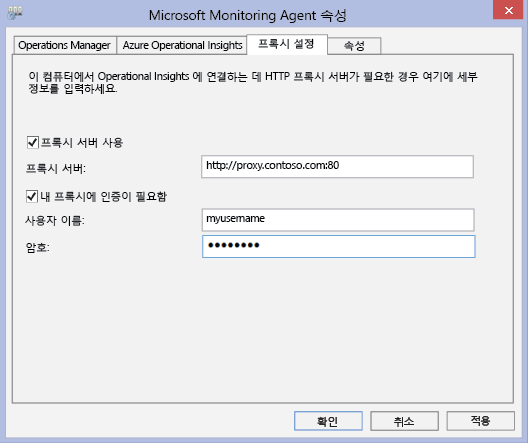
4. **프록시 서버 사용** 을 선택하고 URL과 포트 번호를 입력하고, 필요한 경우 표시된 예제와 비슷합니다. 프록시 서버에 인증이 필요한 경우 프록시 서버에 액세스 하려면 사용자 이름과 암호를 입력합니다.

서버에 직접 연결되는 각 에이전트에 대한 프록시 설정을 지정하기 위해 실행할 수 있는 PowerShell 스크립트를 만들려면 다음 절차를 사용하세요.

### <a name="to-configure-proxy-settings-for-the-microsoft-monitoring-agent-using-a-script"></a>스크립트를 사용하여 Microsoft 모니터링 에이전트에 대한 프록시 설정을 구성하려면
다음 샘플을 복사하여 사용자 환경에 특정한 정보로 업데이트하고 PS1 파일 이름 확장명으로 저장한 다음 OMS 서비스에 직접 연결되는 각 컴퓨터에서 스크립트를 실행합니다.

    param($ProxyDomainName="http://proxy.contoso.com:80", $cred=(Get-Credential))

    # First we get the Health Service configuration object.  We need to determine if we
    #have the right update rollup with the API we need.  If not, no need to run the rest of the script.
    $healthServiceSettings = New-Object -ComObject 'AgentConfigManager.MgmtSvcCfg'

    $proxyMethod = $healthServiceSettings | Get-Member -Name 'SetProxyInfo'

    if (!$proxyMethod)
    {
         Write-Output 'Health Service proxy API not present, will not update settings.'
         return
    }

    Write-Output "Clearing proxy settings."
    $healthServiceSettings.SetProxyInfo('', '', '')

    $ProxyUserName = $cred.username

    Write-Output "Setting proxy to $ProxyDomainName with proxy username $ProxyUserName."
    $healthServiceSettings.SetProxyInfo($ProxyDomainName, $ProxyUserName, $cred.GetNetworkCredential().password)


## <a name="configure-proxy-and-firewall-settings-with-operations-manager"></a>Operational Manager를 사용하여 프록시 및 방화벽 설정 구성
Operations Manager 관리 그룹에서 OMS 서비스에 연결하고 등록하려면 도메인 및 URL의 포트 번호에 대한 액세스 권한이 있어야 합니다. Operations Manager 관리 서버와 OMS 서비스 간의 통신에 프록시 서버를 사용하는 경우 적절한 리소스에 액세스할 수 있는지 확인해야 합니다. 방화벽을 사용하여 인터넷에 대한 액세스를 제한하는 경우 OMS에 대한 액세스를 허용하도록 방화벽을 구성해야 합니다. Operations Manager 관리 서버가 프록시 서버 뒤에 있지 않더라도 에이전트는 뒤에 있을 수 있습니다. 이 경우, 보안 및 로그 관리 솔루션 데이터가 OMS 웹 서비스로 보내지도록 허용하기 위해 에이전트가 구성된 방식과 동일하게 프록시 서버를 구성해야 합니다.

Operations Manager 에이전트가 OMS 서비스와 통신하려면, Operations Manager 인프라(에이전트 포함)은 올바른 프록시 설정과 버전이 있어야 합니다. Operations Manager 콘솔에서 에이전트에 대한 프록시 설정이 지정됩니다. 버전은 다음 중 하나여야 합니다.

* Operations Manager 2012 SP1 업데이트 롤업 7 이상
* Operations Manager 2012 R2 업데이트 롤업 3 이상

다음 표에는 이러한 작업과 관련된 포트가 나와 있습니다.

> [!NOTE]
> 다음 리소스 중 일부에는 둘 다 이전 버전의 OMS인 관리자와 Operational Insights가 언급되어 있습니다. 그러나 나열된 리소스는 나중에 변경될 예정입니다.
>
>

에이전트 리소스 및 포트 목록은 다음과 같습니다.<br>

| **에이전트 리소스** | **포트** |
| --- | --- |
| \*.ods.opinsights.azure.com |443 |
| \*.oms.opinsights.azure.com |443 |
| \*.blob.core.windows.net/\* |443 |
| ods.systemcenteradvisor.com |443 |

<br>
관리 서버 리소스 및 포트 목록은 다음과 같습니다.<br>

| **관리 서버 리소스** | **포트** | **HTTPS 검사 무시** |
| --- | --- | --- |
| service.systemcenteradvisor.com |443 | |
| \*.service.opinsights.azure.com |443 | |
| \*.blob.core.windows.net |443 |예 |
| data.systemcenteradvisor.com |443 | |
| ods.systemcenteradvisor.com |443 | |
| \*.ods.opinsights.azure.com |443 |예 |
| \*.azure-automation.net |443 |예 |

<br>
OMS 및 Operations Manager 콘솔 리소스와 포트 목록은 다음과 같습니다.<br>

| **OMS 및 Operations Manager 콘솔 리소스** | **포트** |
| --- | --- |
| service.systemcenteradvisor.com |443 |
| \*.service.opinsights.azure.com |443 |
| \*.live.com |포트 80 및 443 |
| \*.microsoft.com |포트 80 및 443 |
| \*.microsoftonline.com |포트 80 및 443 |
| \*.mms.microsoft.com |포트 80 및 443 |
| login.windows.net |포트 80 및 443 |

<br>

Operations Manager 관리 그룹을 OMS 서비스에 등록하려면 다음 절차를 사용하세요. 관리 그룹과 OMS 서비스 간에 통신 문제가 발생한 경우 유효성 검사 절차를 사용하여 OMS 서비스로의 데이터 통신 문제를 해결할 수 있습니다.

### <a name="to-request-exceptions-for-the-oms-service-endpoints"></a>OMS 서비스 끝점에 대한 예외를 요청하려면
1. 위에 제공된 첫 번째 표의 정보를 사용하여 방화벽을 통해 Operations Manager 관리 서버에 필요한 리소스에 액세스할 수 있는지 확인합니다.
2. 위에 제공된 두 번째 표의 정보를 사용하여 방화벽을 통해 OMS 및 Operations Manager의 운영 콘솔에 필요한 리소스에 액세스할 수 있는지 확인합니다.
3. Internet Explorer에서 프록시 서버를 사용하는 경우 올바르게 구성되고 작동하는지 확인합니다. 확인하려면 보안 웹 연결(HTTPS)을 엽니다(예: [https://bing.com](https://bing.com)). 브라우저에서 보안 웹 연결이 작동하지 않으면 Operations Manager 관리 콘솔이 클라우드의 웹 서비스와 작동하지 않는 것입니다.

### <a name="to-configure-the-proxy-server-in-the-operations-manager-console"></a>Operations Manager 콘솔에서 프록시 서버를 구성하려면
1. Operations Manager 콘솔을 열고 **관리** 작업 영역을 선택합니다.
2. **Operational Insights**를 확장하고 **Operational Insights 연결**을 선택합니다.<br>  
   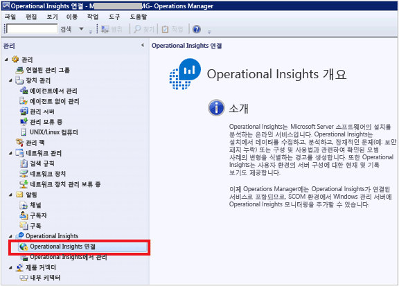
3. OMS 연결 보기에서 **프록시 서버 구성**을 클릭합니다.<br>  
   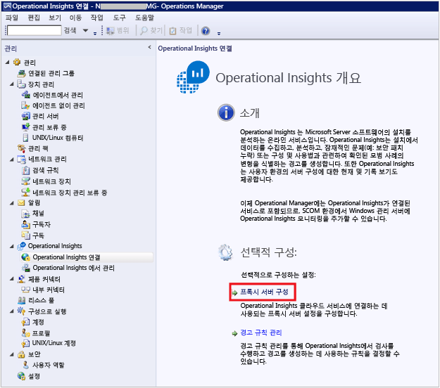
4. Operational Insights 설정 마법사: 프록시 서버에서 **프록시 서버를 사용하여 Operational Insights 웹 서비스에 액세스**를 선택하고 포트 번호와 함께 URL을 입력합니다(예: **http://myproxy:80**).<br>  
   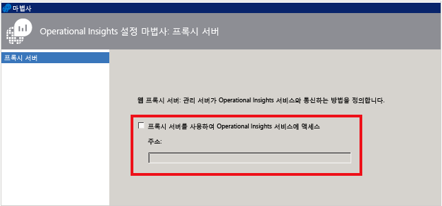

### <a name="to-specify-credentials-if-the-proxy-server-requires-authentication"></a>프록시 서버에 인증이 필요한 경우 자격 증명을 지정하려면
 프록시 서버 자격 증명 및 설정은 OMS에 보고하는 관리 대상 컴퓨터에 전파해야 합니다. 이 서버는 *Microsoft System Center Advisor 모니터링 서버 그룹*에 있어야 합니다. 자격 증명은 그룹에 있는 각 서버의 레지스트리에 암호화됩니다.

1. Operations Manager 콘솔을 열고 **관리** 작업 영역을 선택합니다.
2. **RunAs 구성**에서 **프로필**을 선택합니다.
3. **프로필 프록시로 시스템 센터 관리자 실행** 프로필을 엽니다.<br>  
   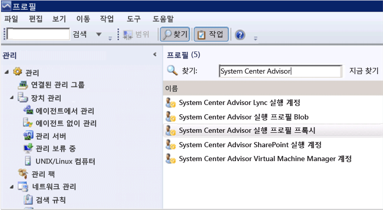
4. 실행 프로필 마법사에서 **추가** 를 클릭하여 실행 계정을 사용합니다. 새 실행 계정을 만들거나 기존 계정을 사용할 수 있습니다. 이 계정에는 프록시 서버를 통과할 수 있는 권한이 있어야 합니다.<br>   
   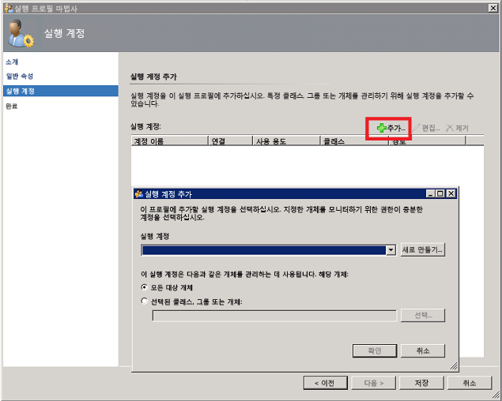
5. 관리할 계정을 설정하려면, **선택한 클래스, 그룹 또는 개체** 를 선택하여 개체 검색 상자를 엽니다.<br>  
   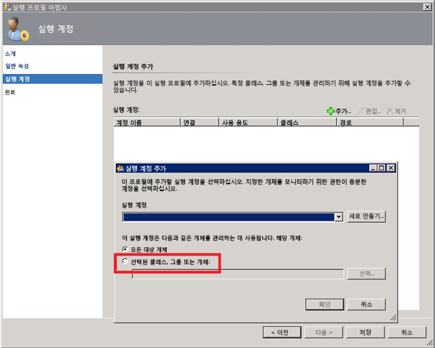
6. **Microsoft System Center Advisor 모니터링 서버 그룹**을 검색한 다음 선택합니다.<br>  
   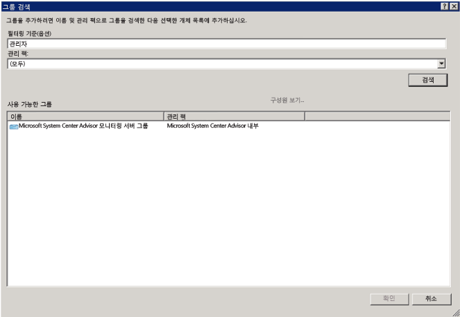
7. **확인** 을 클릭하여 계정으로 실행 추가 상자를 닫습니다.<br>  
   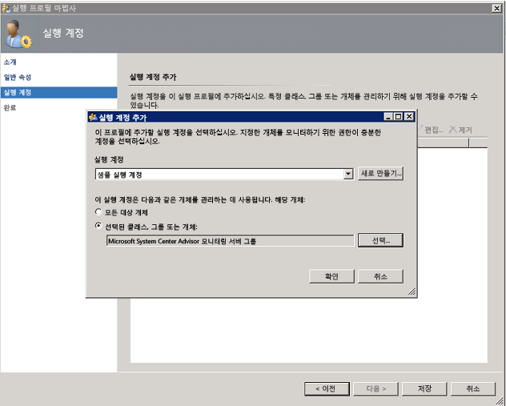
8. 마법사를 완료하고 변경 내용을 저장합니다.<br>  
   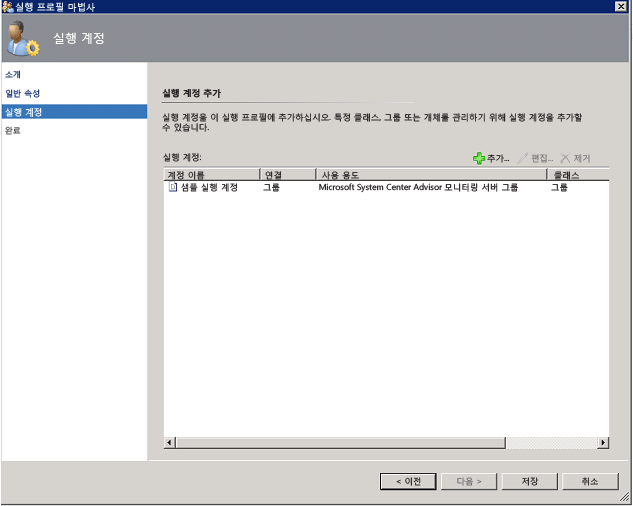

### <a name="to-validate-that-oms-management-packs-are-downloaded"></a>OMS 관리 팩이 다운로드되었는지 확인하려면
OMS에 솔루션을 추가한 경우 Operations Manager 콘솔의 **관리**아래에 관리 팩으로 표시됩니다. *System Center Advisor* 을 검색하여 신속하게 찾습니다.<br>  
   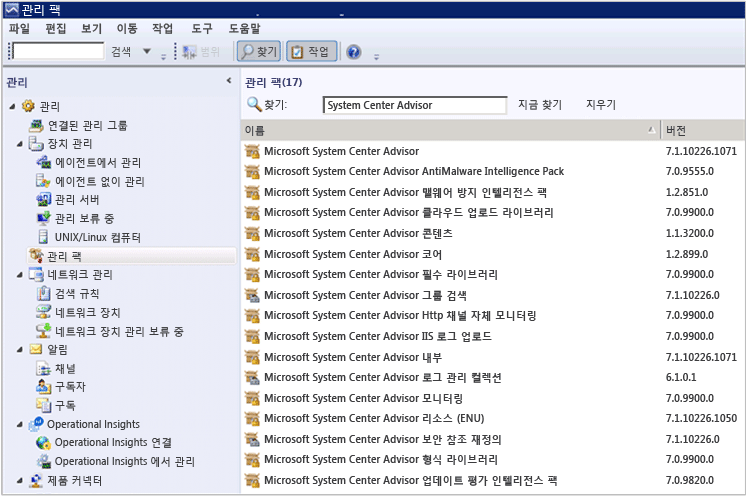  <br>  
또한 Operations Manager 관리 서버에서 다음 Windows PowerShell 명령을 사용하여 OMS 관리 팩을 확인할 수 있습니다.

   ```  
    Get-ScomManagementPack | where {$_.DisplayName -match 'Advisor'} | select Name,DisplayName,Version,KeyToken
   ```  

### <a name="to-validate-that-operations-manager-is-sending-data-to-the-oms-service"></a>Operations Manager에서 OMS 서비스로 데이터를 보내고 있는지 확인하려면
1. Operations Manager 관리 서버에서 성능 모니터(perfmon.exe)를 열고 **성능 모니터**를 선택합니다.
2. **추가**를 클릭하고 **상태 서비스 관리 그룹**을 선택합니다.
3. **HTTP**로 시작하는 모든 카운터를 추가합니다.<br>  
   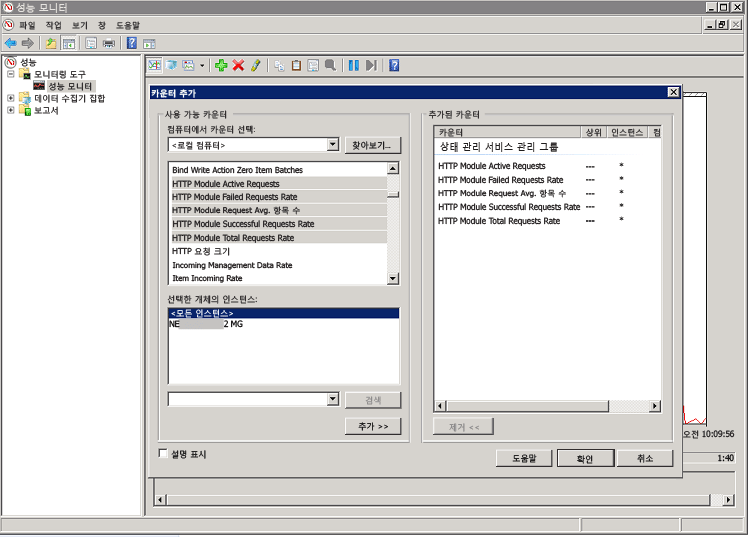
4. Operations Manager 구성이 적절한 경우 OMS에서 추가한 관리 팩 및 구성한 로그 수집 정책에 따라 이벤트 및 기타 데이터 항목에 대한 상태 서비스 관리 카운터 활동이 표시됩니다.<br>  
   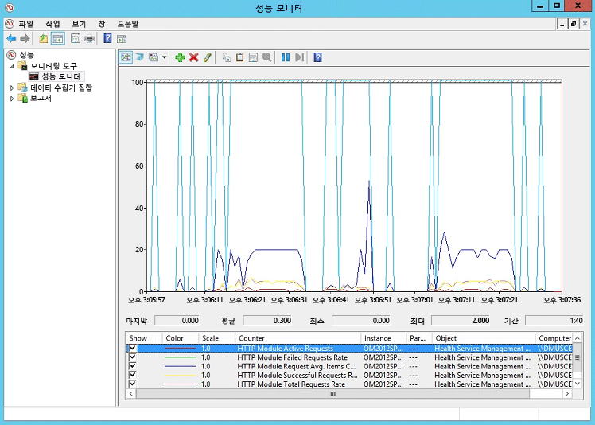

## <a name="next-steps"></a>다음 단계
* [솔루션 갤러리에서 Log Analytics 솔루션을 추가](log-analytics-add-solutions.md) 하여 기능을 추가하고 데이터를 수집합니다.
* [로그 검색](log-analytics-log-searches.md) 을 통해 솔루션에서 수집한 자세한 정보를 확인하는 방법을 알아봅니다.


<!--HONumber=Jan17_HO1-->


