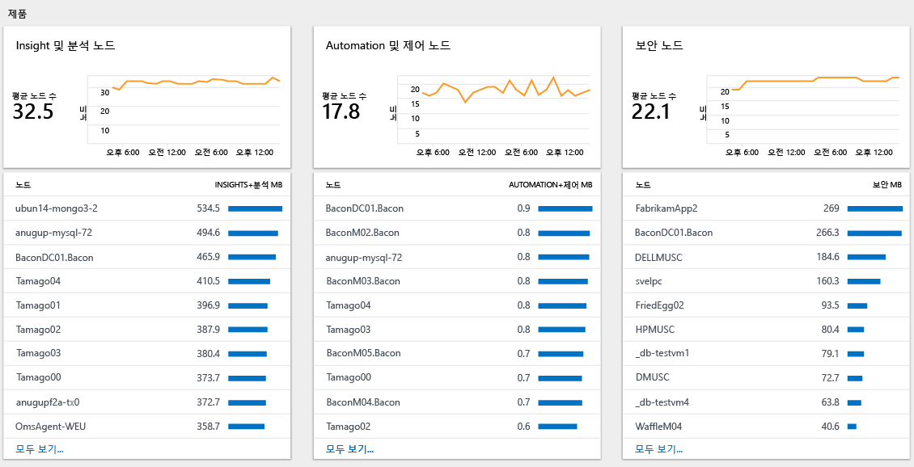

# Log Analytics에서 데이터 사용 현황 분석

> [!NOTE]
> 이 문서에서는 Application Insights에서 데이터 사용량을 분석하는 방법을 설명합니다.  관련 정보는 다음 문서를 참조하세요.
> - [Log Analytics에서 데이터 볼륨 및 보존을 제어하여 비용 관리](log-analytics-manage-cost-storage.md)에서는 데이터 보존 기간을 변경하여 비용을 제어하는 방법을 설명합니다.
> - [사용량 및 예상 비용 모니터링](../monitoring-and-diagnostics/monitoring-usage-and-estimated-costs.md)에서는 다른 가격 책정 모델에 대해 여러 Azure 모니터링 기능에서 사용량 및 예상 비용을 보는 방법을 설명합니다. 또한 가격 책정 모델을 변경하는 방법을 설명합니다.

Log Analytics는 데이터를 전송한 소스 및 전송되는 데이터의 다양한 형식과 같이 수집된 데이터의 양에 대한 정보를 포함합니다.  **Log Analytics 사용량** 대시보드를 사용하여 데이터 사용을 검토하고 분석할 수 있습니다. 대시보드는 각 솔루션에서 수집되는 데이터의 양 및 컴퓨터에서 전송한 데이터의 양을 표시합니다.

## 사용량 대시보드 이해
**Log Analytics 사용량** 대시보드에는 다음 정보가 표시됩니다.

- 데이터 볼륨
    - (현재 시간 범위에 기반) 시간에 따른 데이터 볼륨
    - 솔루션별 데이터 볼륨
    - 컴퓨터와 연결되지 않은 데이터
- 컴퓨터
    - 데이터를 전송하는 컴퓨터
    - 지난 24시간 동안 데이터가 없는 컴퓨터
- 제품
    - 이해 및 분석 노드
    - Automation 및 제어 노드
    - 보안 노드  
- 성능
    - 데이터 수집 및 인덱싱 소요 시간  
- 쿼리 목록

 
)

### 사용률 데이터를 작업하려면
1. [Azure Portal](https://portal.azure.com)에 로그인합니다.
2. Azure Portal에서 **모든 서비스**를 클릭합니다. 리소스 목록에서 **Log Analytics**를 입력합니다. 입력을 시작하면 입력한 내용을 바탕으로 목록이 필터링됩니다. **Log Analytics**를 선택합니다.       
3. Log Analytics 작업 영역 목록에서 작업 영역을 선택합니다.
4. 왼쪽 창의 목록에서 **사용량 및 예상 비용**을 선택합니다.
5. **사용량 및 예상 비용** 대시보드에서 **시간: 마지막 24시간**을 선택하고 시간 간격을 변경하여 시간 범위를 수정할 수 있습니다.     
6. 관심이 있는 영역을 표시하는 사용량 범주 블레이드를 확인합니다. [로그 검색](log-analytics-log-searches.md)에서 블레이드를 선택하고 더 자세히 보려는 항목을 클릭합니다.     
7. 로그 검색 대시보드에서 검색에서 반환되는 결과를 검토합니다.   

## 데이터 컬렉션이 예상보다 높은 경우 경고를 만듭니다.
이 섹션에서는 경고가 발생하는 경우를 설명합니다.
- 데이터 볼륨이 지정된 크기를 초과합니다.
- 데이터 볼륨이 지정된 크기를 초과할 것으로 예측됩니다.

검색 쿼리를 사용하는 Azure 경고 지원 [경고 로그](../monitoring-and-diagnostics/monitor-alerts-unified-log.md)입니다. 

최근 24시간 내에 수집된 데이터가 100GB를 초과하는 경우 다음 쿼리에 결과가 표시됩니다.

`union withsource = $table Usage | where QuantityUnit == "MBytes" and iff(isnotnull(toint(IsBillable)), IsBillable == true, IsBillable == "true") == true | extend Type = $table | summarize DataGB = sum((Quantity / 1024)) by Type | where DataGB > 100`

다음 쿼리는 간단한 수식을 사용하여 하루에 100GB를 초과하는 데이터가 전송되는 시기를 예측합니다. 

`union withsource = $table Usage | where QuantityUnit == "MBytes" and iff(isnotnull(toint(IsBillable)), IsBillable == true, IsBillable == "true") == true | extend Type = $table | summarize EstimatedGB = sum(((Quantity * 8) / 1024)) by Type | where EstimatedGB > 100`

다른 크기의 데이터 볼륨에 대해 경고하려면 쿼리의 100GB를 원하는 수로 변경합니다.

[새 로그 경고 만들기](../monitoring-and-diagnostics/monitor-alerts-unified-usage.md)에 설명한 단계를 사용하여 데이터 컬렉션이 예상보다 높은 경우 알림을 받을 수 있습니다.

첫 번째 쿼리에 대한 경고를 만들 때 즉, 24시간 내에 데이터가 100GB를 초과하는 경우 다음을 설정합니다.  

- **경고 조건 정의**는 리소스 대상으로 Log Analytics 작업 영역을 지정합니다.
- **경고 조건**은 다음을 지정합니다.
   - **신호 이름**은 **로그 검색 사용자 지정**을 선택합니다.
   - **쿼리 검색**을 `union withsource = $table Usage | where QuantityUnit == "MBytes" and iff(isnotnull(toint(IsBillable)), IsBillable == true, IsBillable == "true") == true | extend Type = $table | summarize DataGB = sum((Quantity / 1024)) by Type | where DataGB > 100`으로
   - **경고 논리**는 *결과 수*에 **기반**하고 **조건**은 *0*의 **임계값**을 *초과*합니다.
   - 사용량 데이터가 시간당 한 번만 업데이트되므로 **기간**은 *1440*분이고 **주파수 경고**는 *60*분마다입니다.
- **경고 세부 정보 정의**는 다음을 지정합니다.
   - **이름**을 *24시간 내에 100GB를 초과하는 데이터 볼륨*으로
   - **심각도**를 *경고*로

기존 또는 새 [작업 그룹](../monitoring-and-diagnostics/monitoring-action-groups.md)을 지정하거나 만들어서 로그 경고가 조건과 일치하는 경우 알려줍니다.

두 번째 쿼리에 대한 경고를 만들 때 즉, 24시간 내에 100GB를 초과하는 데이터가 예측되는 경우 다음을 설정합니다.

- **경고 조건 정의**는 리소스 대상으로 Log Analytics 작업 영역을 지정합니다.
- **경고 조건**은 다음을 지정합니다.
   - **신호 이름**은 **로그 검색 사용자 지정**을 선택합니다.
   - **쿼리 검색**을 `union withsource = $table Usage | where QuantityUnit == "MBytes" and iff(isnotnull(toint(IsBillable)), IsBillable == true, IsBillable == "true") == true | extend Type = $table | summarize EstimatedGB = sum(((Quantity * 8) / 1024)) by Type | where EstimatedGB > 100`으로
   - **경고 논리**는 *결과 수*에 **기반**하고 **조건**은 *0*의 **임계값**을 *초과*합니다.
   - 사용량 데이터가 시간당 한 번만 업데이트되므로 **기간**은 *180*분이고 **주파수 경고**는 *60*분마다입니다.
- **경고 세부 정보 정의**는 다음을 지정합니다.
   - **이름**을 *24시간 내에 100GB를 초과한다고 예측되는 데이터 볼륨*으로
   - **심각도**를 *경고*로

기존 또는 새 [작업 그룹](../monitoring-and-diagnostics/monitoring-action-groups.md)을 지정하거나 만들어서 로그 경고가 조건과 일치하는 경우 알려줍니다.

경고를 수신하는 경우 사용량이 예상보다 더 높은 원인을 해결하려면 다음 섹션의 단계를 사용합니다.

## 사용량이 예상보다 더 높은 원인 해결
사용량 대시보드를 통해 사용량(및 비용)이 예상보다 더 높은 원인을 쉽게 파악할 수 있습니다.

사용량이 높은 원인은 다음과 같습니다.
- 예상보다 많은 데이터가 Log Analytics에 전송
- 예상보다 많은 노드가 Log Analytics에 데이터 전송

### 예상보다 데이터가 많은지 확인 
사용량 페이지의 두 가지 주요 섹션에서 가장 많은 데이터를 수집하는 원인을 식별할 수 있습니다.

*시간에 따른 데이터 볼륨* 차트에서는 전송되는 데이터의 총 볼륨 및 가장 많은 데이터를 보내는 컴퓨터을 보여줍니다. 위쪽의 차트를 사용하면 전체 데이터 사용량이 증가하는지, 일정하게 유지되는지 또는 감소하는지를 확인할 수 있습니다. 컴퓨터 목록은 가장 많은 데이터를 보내는 10개의 컴퓨터를 표시합니다.

*솔루션별 데이터 볼륨* 차트에서는 각 솔루션에서 전송하는 데이터의 볼륨 및 가장 많은 데이터를 보내는 솔루션을 보여줍니다. 위쪽의 차트에서는 시간에 따라 각 솔루션에서 전송하는 데이터의 총 볼륨을 보여줍니다. 이 정보를 사용하면 솔루션이 동일한 양의 데이터에 대해 시간에 따라 더 많은 데이터를 보내는지, 아니면 적은 데이터를 보내는지를 식별할 수 있습니다. 솔루션의 목록은 가장 많은 데이터를 보내는 10개의 솔루션입니다. 

이러한 두 차트는 모든 데이터를 표시합니다. 데이터의 일부는 청구되고 일부는 무료입니다. 청구 가능한 데이터에만 초점을 맞추려면 검색 페이지에서 `IsBillable=true`를 포함하도록 쿼리를 수정합니다.  

*시간에 따른 데이터 볼륨* 차트를 확인합니다. 특정 컴퓨터에 가장 많은 데이터를 보내는 솔루션 및 데이터 형식을 보려면 컴퓨터의 이름을 클릭합니다. 목록에서 첫 번째 컴퓨터의 이름을 클릭합니다.

다음 스크린샷에서 *로그 관리/성능* 데이터 형식은 컴퓨터에 가장 많은 데이터를 보내고 있습니다.     

다음으로 *사용* 대시보드로 돌아가서 *솔루션별 데이터 볼륨* 차트를 확인합니다. 솔루션에 가장 많은 데이터를 전송하는 컴퓨터를 보려면 목록에서 솔루션의 이름을 클릭합니다. 목록에서 첫 번째 솔루션의 이름을 클릭합니다. 

다음 스크린샷에서 *mycon* 컴퓨터가 로그 관리 솔루션에 가장 많은 데이터를 보내는지 확인합니다.     

필요한 경우 솔루션이나 데이터 형식 내에서 큰 볼륨을 식별하려면 추가 분석을 수행합니다. 예제 쿼리는 다음과 같습니다.

+ **보안** 솔루션
  - `SecurityEvent | summarize AggregatedValue = count() by EventID`
+ **로그 관리** 솔루션
  - `Usage | where Solution == "LogManagement" and iff(isnotnull(toint(IsBillable)), IsBillable == true, IsBillable == "true") == true | summarize AggregatedValue = count() by DataType`
+ **성능** 데이터 형식
  - `Perf | summarize AggregatedValue = count() by CounterPath`
  - `Perf | summarize AggregatedValue = count() by CounterName`
+ **이벤트** 데이터 형식
  - `Event | summarize AggregatedValue = count() by EventID`
  - `Event | summarize AggregatedValue = count() by EventLog, EventLevelName`
+ **Syslog** 데이터 형식
  - `Syslog | summarize AggregatedValue = count() by Facility, SeverityLevel`
  - `Syslog | summarize AggregatedValue = count() by ProcessName`
+ **AzureDiagnostics** 데이터 형식
  - `AzureDiagnostics | summarize AggregatedValue = count() by ResourceProvider, ResourceId`

다음 단계를 사용하여 수집된 로그의 양을 줄입니다.

| 높은 데이터 볼륨의 소스 | 데이터 볼륨을 줄이는 방법 |
| -------------------------- | ------------------------- |
| 보안 이벤트            | [일반 또는 최소한의 보안 이벤트](https://blogs.technet.microsoft.com/msoms/2016/11/08/filter-the-security-events-the-oms-security-collects/)를 선택합니다.   보안 감사 정책을 변경하여 필요한 이벤트만을 수집합니다. 특히, 다음 항목에 대한 이벤트를 수집할 필요를 검토합니다.   - [감사 필터링 플랫폼](https://technet.microsoft.com/library/dd772749(WS.10).aspx)   - [감사 레지스트리](https://docs.microsoft.com/previous-versions/windows/it-pro/windows-server-2008-R2-and-2008/dd941614(v%3dws.10))  - [감사 파일 시스템](https://docs.microsoft.com/previous-versions/windows/it-pro/windows-server-2008-R2-and-2008/dd772661(v%3dws.10))  - [감사 커널 개체](https://docs.microsoft.com/previous-versions/windows/it-pro/windows-server-2008-R2-and-2008/dd941615(v%3dws.10))  - [감사 핸들 조작](https://docs.microsoft.com/previous-versions/windows/it-pro/windows-server-2008-R2-and-2008/dd772626(v%3dws.10))  - 이동식 저장소 감사 |
| 성능 카운터       | [성능 카운터 구성](log-analytics-data-sources-performance-counters.md)을 다음과 같이 변경합니다.   - 컬렉션의 빈도 감소   - 성능 카운터의 수 감소 |
| 이벤트 로그                 | [이벤트 로그 구성](log-analytics-data-sources-windows-events.md)을 다음과 같이 변경합니다.   - 수집된 이벤트 로그의 수 감소   - 필수 이벤트 수준만 수집 예를 들어 *정보* 수준 이벤트를 수집하지 않습니다. |
| syslog                     | [syslog 구성](log-analytics-data-sources-syslog.md)을 다음과 같이 변경합니다.   - 수집된 기능의 수 감소   - 필수 이벤트 수준만 수집 예를 들어 *정보* 및 *디버그* 수준 이벤트를 수집하지 않습니다. |
| AzureDiagnostics           | 다음 작업을 수행하도록 리소스 로그 컬렉션을 변경합니다.   - Log Analytics로 보내는 리소스 송신 로그의 수 축소   - 필요한 로그만 수집 |
| 솔루션을 사용하지 않는 컴퓨터의 솔루션 데이터 | [솔루션 대상](../operations-management-suite/operations-management-suite-solution-targeting.md)을 사용하여 필수 그룹의 컴퓨터에서 데이터를 수집합니다. |

### 예상보다 더 많은 노드가 있는지 확인합니다.
*노드당(Log Analytics)* 가격 책정 계층에 있는 경우 사용한 노드 및 솔루션의 수에 따라 요금이 청구됩니다. 사용 대시보드의 *제품* 섹션에서 사용 중인 각 제품의 노드 수를 볼 수 있습니다.     

**모두 표시...** 를 클릭하여 선택한 제품에 데이터를 전송하는 컴퓨터의 전체 목록을 볼 수 있습니다.

[솔루션 대상](../operations-management-suite/operations-management-suite-solution-targeting.md)을 사용하여 필수 그룹의 컴퓨터에서 데이터를 수집합니다.

## 다음 단계
* [Log Analytics에서 로그 검색](log-analytics-log-searches.md)을 참조하여 검색 언어를 사용하는 방법을 배울 수 있습니다. 사용 데이터에 대한 추가 분석을 수행하려면 검색 쿼리를 사용할 수 있습니다.
* [새 로그 경고 만들기](../monitoring-and-diagnostics/monitor-alerts-unified-usage.md)에 설명한 단계를 사용하여 검색 기준이 충족되는 경우 알림을 받을 수 있습니다.
* [솔루션 대상](../operations-management-suite/operations-management-suite-solution-targeting.md)을 사용하여 필수 그룹의 컴퓨터에서 데이터를 수집합니다.
* 효과적인 보안 이벤트 컬렉션 정책을 구성하려면 [Azure Security Center 필터링 정책](../security-center/security-center-enable-data-collection.md)을 검토합니다.
* [성능 카운터 구성](log-analytics-data-sources-performance-counters.md)을 변경합니다.
* 이벤트 컬렉션 설정을 수정하려면 [이벤트 로그 구성](log-analytics-data-sources-windows-events.md)을 검토합니다.
* syslog 컬렉션 설정을 수정하려면 [syslog 구성](log-analytics-data-sources-syslog.md)을 검토합니다.
