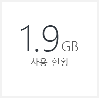
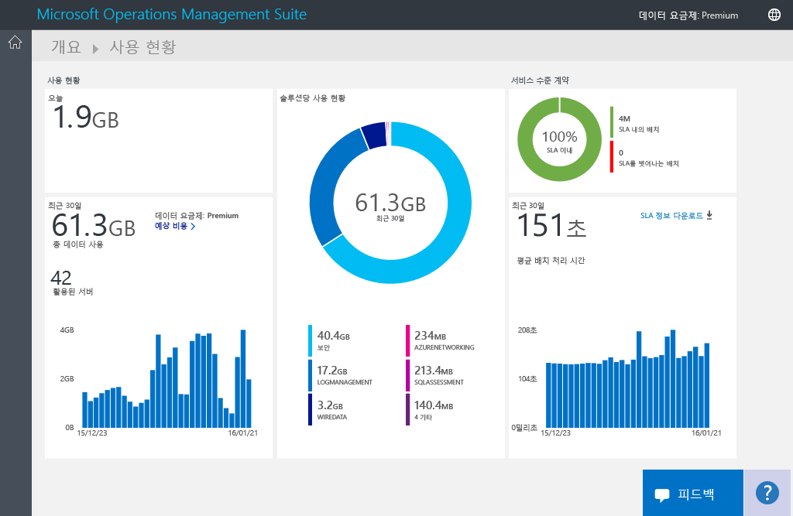
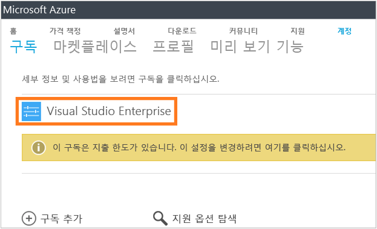
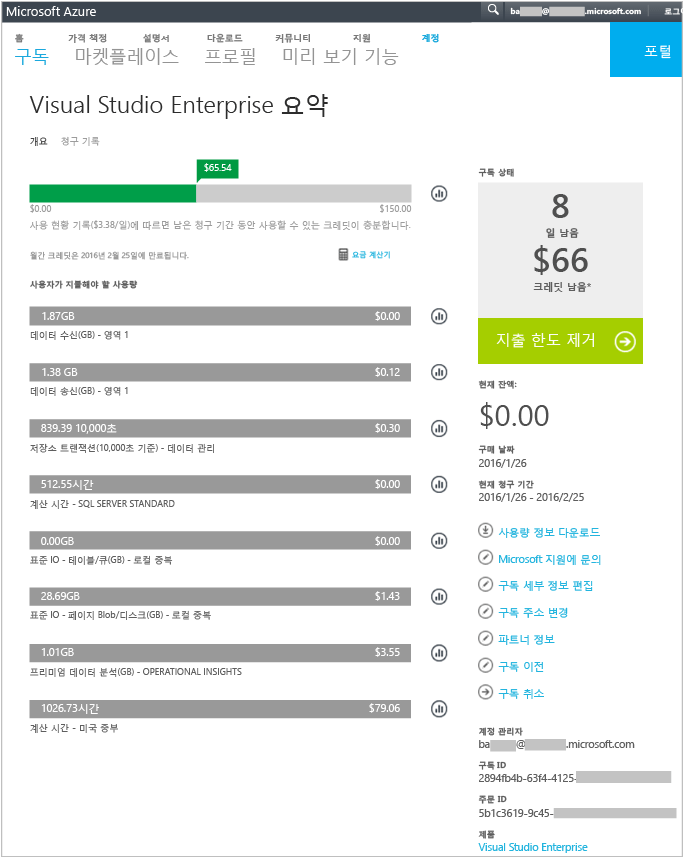
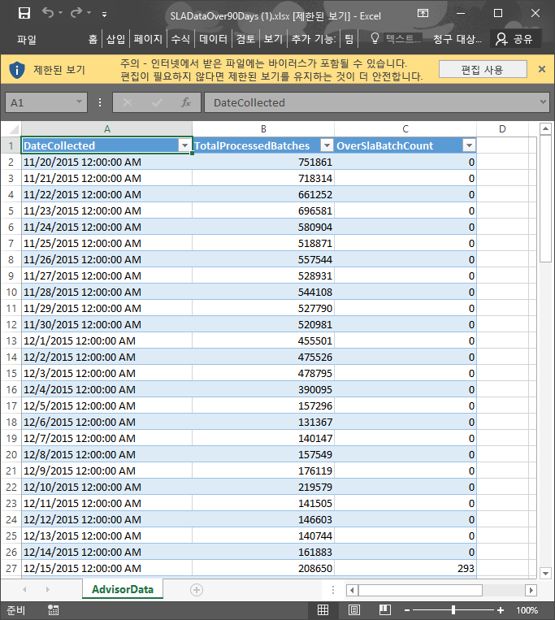

<properties
	pageTitle="Log Analytics에서 데이터 사용 현황 분석 | Microsoft Azure"
	description="Log Analytics에서 사용량 페이지를 사용하여 OMS 서비스로 전송되는 데이터의 양을 볼 수 있습니다."
	services="log-analytics"
	documentationCenter=""
	authors="bandersmsft"
	manager="jwhit"
	editor=""/>

<tags
	ms.service="log-analytics"
	ms.workload="na"
	ms.tgt_pltfrm="na"
	ms.devlang="na"
	ms.topic="article"
	ms.date="04/28/2016"
	ms.author="banders"/>

# Log Analytics에서 데이터 사용 현황 분석

OMS(Operations Management Suite)의 Log Analytics는 데이터를 수집하여 주기적으로 OMS 서비스에 보냅니다. **사용량** 페이지를 사용하여 OMS 서비스로 전송되는 데이터의 양을 볼 수 있습니다. **사용량** 페이지에는 솔루션에서 매일 전송되는 데이터의 양 및 서버에서 데이터를 보내는 빈도도 표시됩니다.

>[AZURE.NOTE] [OMS 웹 사이트](http://www.microsoft.com/oms)를 사용하여 만든 무료 계정이 있는 경우 매일 OMS 서비스로 전송할 수 있는 데이터 양이 500MB로 제한됩니다. 일일 한도에 도달한 경우 데이터 분석이 중지되고 다음 날이 시작될 때 재개됩니다.

OMS의 **개요** 대시보드에서 **사용량** 타일을 사용하여 사용량을 볼 수 있습니다.

일일 사용량 한도를 초과하거나 거의 한도에 도달한 경우, 선택적으로 솔루션을 제거하여 OMS 서비스에 보내는 데이터의 크기를 줄일 수 있습니다. 솔루션 제거에 대한 자세한 내용은 [솔루션 갤러리에서 Log Analytics 솔루션 추가](log-analytics-add-solutions.md)를 참조하세요.

**사용량** 페이지에는 다음 정보가 표시됩니다.

- 하루 평균 사용량
- 지난 30일 동안 각 솔루션의 데이터 사용량
- 지난 30일 동안 사용자 환경의 서버에서 OMS로 전송된 데이터의 양
- 데이터 요금제 가격 책정 계층 및 예상 비용
- OMS에서 데이터를 처리하는 데 걸리는 시간을 비롯한 SLA(서비스 수준 계약)에 대한 정보

## 사용률 데이터를 작업하려면

1. **개요** 페이지에서 **사용량** 타일을 클릭합니다.
2. **사용량** 페이지에서 염려되는 영역을 표시하는 사용량 범주를 나타냅니다.
3. 일일 업로드 할당량을 너무 많이 소비하는 솔루션이 있는 경우 해당 솔루션을 제거하는 것이 좋을 수 있습니다.

## 예상 비용 및 청구 정보를 보려면
1. **개요** 페이지에서 **사용량** 타일을 클릭합니다.
2. **사용량** 페이지의 **사용량** 아래에서 **예상 비용** 옆의 펼침 단추(**>**)를 클릭합니다.
3. 확장된 **데이터 계획** 정보에서 월별 예상 비용을 확인할 수 있습니다. 
4. 대금 청구 정보를 보려면 **내 청구서 보기**를 클릭하여 구독 정보를 확인합니다.
    - 구독 페이지에서 구독을 클릭하여 세부 정보 및 사용량 품목 목록을 확인합니다. 
    - 구독에 대한 요약 페이지에서 다양한 작업을 수행하여 구독을 관리하고 구독에 대한 보다 자세한 정보를 볼 수 있습니다. 

## SLA에 대한 데이터 배치를 보려면
1. **개요** 페이지에서 **사용량** 타일을 클릭합니다.
2. **서비스 수준 계약** 아래에서 **SLA 정보 다운로드**를 클릭합니다.
3. 검토할 수 있도록 Excel XLSX 파일이 다운로드됩니다. 

## 다음 단계

- 솔루션에서 수집한 자세한 정보를 보려면 [Log Analytics에서 로그 검색](log-analytics-log-searches.md)을 참조하세요.

<!---HONumber=AcomDC_0504_2016-->