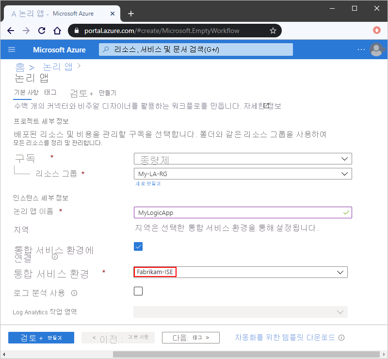

# ISE(통합 서비스 환경)를 사용하여 Azure Logic Apps에서 Azure Virtual Network 리소스에 액세스

> [!NOTE]
> 이 기능은 *비공개 미리 보기* 상태입니다. 액세스를 요청하려면 [여기서 참여 요청을 작성](https://aka.ms/iseprivatepreview)하세요.

논리 앱과 통합 계정이 [Azure 가상 네트워크](../virtual-network/virtual-networks-overview.md) 내의 VM(가상 머신) 및 기타 시스템이나 서비스와 같이 보호된 리소스에 액세스해야 하는 경우가 있습니다. 이러한 액세스를 설정하려면 논리 앱과 통합 계정의 위치로 사용하는 [ISE(*통합 서비스 환경*)를 만들](../logic-apps/connect-virtual-network-vnet-isolated-environment.md) 수 있습니다. 

ISE를 만들면 격리된 개인 Logic Apps 인스턴스가 Azure 가상 네트워크에 배포됩니다. 이 개인 인스턴스는 저장소 등의 전용 리소스를 사용하며 공용 “전역” Logic Apps 서비스와는 별도로 실행됩니다. 이처럼 인스턴스가 분리되므로 다른 Azure 테넌트가 앱 성능에 줄 수 있는 영향(["사용량이 많은 인접 항목" 효과](https://en.wikipedia.org/wiki/Cloud_computing_issues#Performance_interference_and_noisy_neighbors))를 줄일 수 있습니다. 

이 개요에서는 ISE를 만들어 논리 앱과 통합 계정이 Azure 가상 네트워크 내의 리소스에 직접 액세스할 수 있도록 하는 방법을 설명하고, ISE와 글로벌 Logic Apps 서비스 간의 차이점을 비교합니다.

## 격리 방식과 전역 방식 비교

Azure에서 ISE(통합 서비스 환경)를 만들 때는 환경의 *피어*로 Azure 가상 네트워크를 선택할 수 있습니다. Azure는 Logic Apps 서비스의 개인 인스턴스를 가상 네트워크에 배포하므로 전용 리소스에서 논리 앱을 만들고 실행할 수 있는 격리된 환경이 생성됩니다. 논리 앱을 만들 때는 이 환경을 앱의 위치로 선택할 수 있습니다. 그러면 논리 앱도 가상 네트워크의 리소스에 직접 액세스할 수 있게 됩니다.  

ISE의 논리 앱은 전역 Logic Apps 서비스와 같은 사용자 환경과 비슷한 기능을 제공합니다. 즉, 전역 Logic Apps 서비스에서 제공하는 것과 같은 기본 제공 기능 및 커넥터를 사용할 수 있을 뿐 아니라 ISE 버전을 제공하는 커넥터 중에서 선택할 수도 있습니다. 예를 들어 ISE에서 실행되는 버전을 제공하는 몇 가지 표준 커넥터는 다음과 같습니다.
 
* Azure Blob Storage, File Storage 및 Table Storage
* Azure 큐
* Azure Service Bus
* FTP
* SSH FTP(SFTP)
* SQL Server
* AS2, X12 및 EDIFACT

ISE 커넥터와 기타 커넥터의 차이는 트리거와 작업이 실행되는 위치입니다.

* ISE의 HTTP와 같은 기본 제공 트리거 및 작업을 사용하는 경우 해당 트리거와 작업은 항상 논리 앱과 같은 ISE에서 실행됩니다. 

* 두 버전을 제공하는 커넥터의 경우에는 ISE와 전역 Logic Apps 서비스에서 각각 하나의 버전이 실행됩니다.  

  **ISE** 레이블이 있는 커넥터는 항상 논리 앱과 같은 ISE에서 실행됩니다. **ISE** 레이블이 없는 커넥터는 전역 Logic Apps 서비스에서 실행됩니다. 

  

* ISE에서 구성하는 커넥터는 전역 Logic Apps 서비스에서도 사용할 수 있습니다. 

> [!IMPORTANT]
> ISE에서 실행되는 논리 앱, 기본 제공 작업 및 커넥터의 경우 사용량 기반 가격 책정 플랜이 아닌 다른 가격 책정 플랜을 사용합니다. 자세한 내용은 [Logic Apps 가격 책정](../logic-apps/logic-apps-pricing.md)을 참조하세요.

## 가상 네트워크 액세스를 위한 권한

ISE(통합 서비스 환경)를 만들 때는 환경의 *피어*로 Azure 가상 네트워크를 선택할 수 있습니다. 그러나 이 관계(*피어링*)는 ISE를 만들 때*만* 생성할 수 있습니다. 이 관계를 생성하면 ISE가 가상 네트워크의 리소스에 액세스할 수 있게 되므로 해당 ISE의 논리 앱이 가상 네트워크의 리소스에 직접 연결할 수 있습니다. ISE에 연결된 가상 네트워크에 있는 온-프레미스 시스템의 경우에는 논리 앱이 다음 항목 중 하나를 사용하여 해당 시스템에 직접 액세스할 수 있습니다. 

* SQL Server 등의 해당 시스템용 ISE 커넥터

* HTTP 동작 

* 사용자 지정 커넥터

가상 네트워크에 있지 않거나 ISE 커넥터가 없는 온-프레미스 시스템의 경우에도 [온-프레미스 데이터 게이트웨이를 설정 및 사용](../logic-apps/logic-apps-gateway-install.md)하고 나면 연결이 가능합니다.

환경의 피어로 Azure 가상 네트워크를 선택하려면 Azure Logic Apps 서비스에 대해 가상 네트워크에서 RBAC(역할 기반 액세스 제어) 권한을 설정해야 합니다. 이 작업을 수행하려면 Azure Logic Apps 서비스에 **네트워크 참여자** 및 **클래식 참여자** 역할을 할당해야 합니다. 피어링에 필요한 역할 권한에 대한 자세한 내용은 [가상 네트워크 피어링 만들기, 변경 또는 삭제의 권한 섹션](../virtual-network/virtual-network-manage-peering.md#permissions)을 참조하세요.

## ISE와의 통합 계정

ISE(통합 서비스 환경)에서 실행되는 논리 앱에 통합 계정을 사용할 수는 있지만, 해당 통합 계정은 연결된 논리 앱과 *같은 ISE*를사용해야 합니다. ISE의 논리 앱은 같은 ISE에 있는 통합 계정만 참조할 수 있습니다. 통합 계정을 만들 때는 통합 계정의 위치로 ISE를 선택할 수 있습니다.

## 지원 받기

* 질문이 있는 경우 <a href="https://social.msdn.microsoft.com/Forums/en-US/home?forum=azurelogicapps" target="_blank">Azure Logic Apps 포럼</a>을 방문해 보세요.
* 기능 아이디어를 제출하거나 투표하려면 <a href="https://aka.ms/logicapps-wish" target="_blank">Logic Apps 사용자 의견 사이트</a>를 방문하세요.

## 다음 단계

* [격리된 논리 앱에서 Azure 가상 네트워크에 연결](../logic-apps/connect-virtual-network-vnet-isolated-environment.md)하는 방법 알아보기
* [Azure Virtual Network](../virtual-network/virtual-networks-overview.md)에 대해 자세히 알아보기
* [Azure 서비스에 대한 가상 네트워크 통합](../virtual-network/virtual-network-for-azure-services.md)에 대해 알아보기
