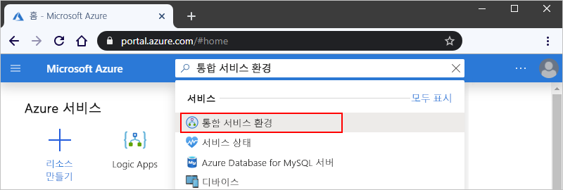
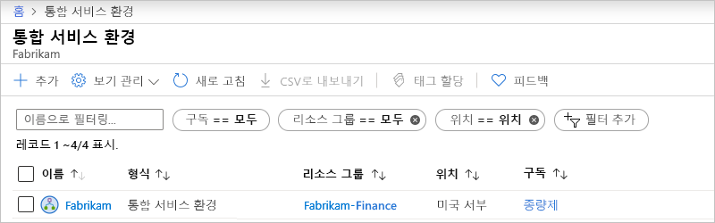
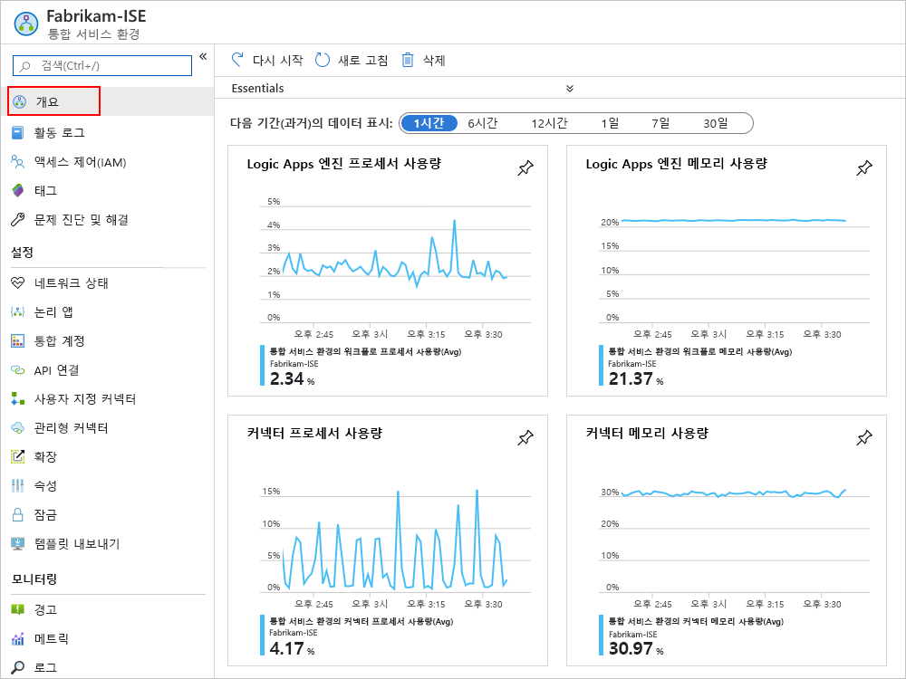
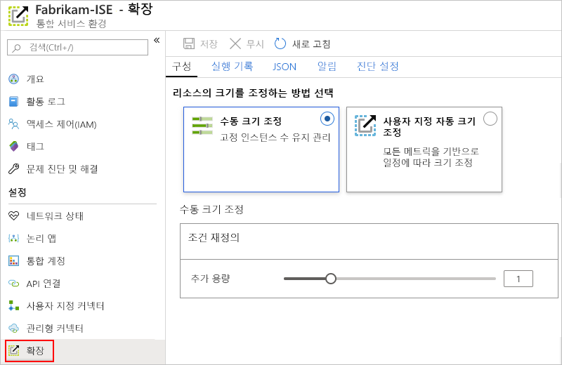
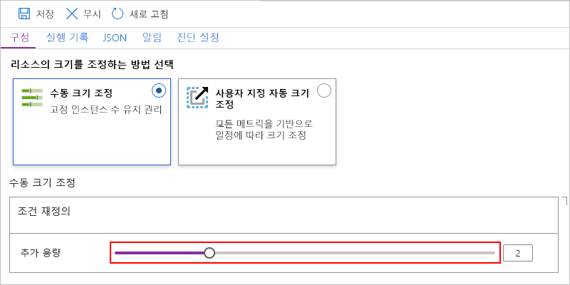
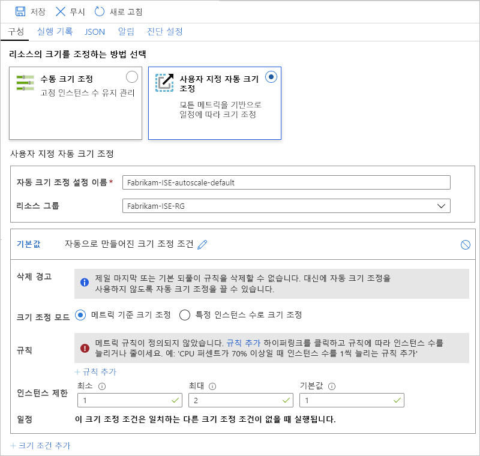

# Azure Logic Apps에서 ISE (통합 서비스 환경) 관리

이 문서에서는 [ISE (통합 서비스 환경)](../logic-apps/connect-virtual-network-vnet-isolated-environment-overview.md)에 대 한 관리 작업을 수행 하는 방법을 보여 줍니다. 예를 들면 다음과 같습니다.

* ISE에서 논리 앱, 연결, 통합 계정 및 커넥터와 같은 리소스를 관리 합니다.
* ISE의 네트워크 상태를 확인 합니다.
* 용량을 추가 하거나 ISE를 다시 시작 하거나 ISE를 삭제 하려면이 항목의 단계를 따르세요. ISE에 이러한 아티팩트를 추가 하려면 [통합 서비스 환경에 아티팩트 추가](../logic-apps/add-artifacts-integration-service-environment-ise.md)를 참조 하세요.

## ISE 보기

1. [Azure Portal](https://portal.azure.com)에 로그인합니다.

1. 포털의 검색 상자에 "integration service environment"를 입력 한 다음 **Integration Service environment**를 선택 합니다.

   

1. 결과 목록에서 통합 서비스 환경을 선택 합니다.

   

1. 다음 섹션을 계속 진행 하 여 ISE에서 논리 앱, 연결, 커넥터 또는 통합 계정을 찾습니다.

## 네트워크 상태 확인

ISE 메뉴의 **설정**에서 **네트워크 상태**를 선택 합니다. 이 창에는 서브넷의 상태 및 다른 서비스에 대 한 아웃 바운드 종속성이 표시 됩니다.

## 논리 앱 관리

ISE에 있는 논리 앱을 보고 관리할 수 있습니다.

1. ISE 메뉴의 **설정**아래에서 **논리 앱**을 선택 합니다.

   

1. ISE에서 더 이상 필요 하지 않은 논리 앱을 제거 하려면 해당 논리 앱을 선택한 다음 **삭제**를 선택 합니다. 삭제를 확인 하려면 **예**를 선택 합니다.

> [!NOTE]
> 자식 논리 앱을 삭제 하 고 다시 만드는 경우 부모 논리 앱을 다시 저장 해야 합니다. 다시 만들어진 자식 앱은 다른 메타 데이터를 포함 합니다.
> 자식을 다시 만든 후 부모 논리 앱을 다시 저장 하지 않으면 자식 논리 앱에 대 한 호출이 실패 하 고 "권한 없음" 오류가 표시 됩니다. 이 동작은 통합 계정에서 아티팩트를 사용 하거나 Azure 함수를 호출 하는 것과 같은 부모-자식 논리 앱에 적용 됩니다.

## API 연결 관리

ISE에서 실행 되는 논리 앱에서 만든 연결을 보고 관리할 수 있습니다.

1. ISE 메뉴의 **설정**에서 **API 연결**을 선택 합니다.

   

1. ISE에서 더 이상 필요 하지 않은 연결을 제거 하려면 해당 연결을 선택한 다음 **삭제**를 선택 합니다. 삭제를 확인 하려면 **예**를 선택 합니다.

## ISE 커넥터 관리

ISE에 배포 된 API 커넥터를 보고 관리할 수 있습니다.

1. ISE 메뉴의 **설정**에서 **관리 되는 커넥터**를 선택 합니다.

   

1. ISE에서 사용 하지 않으려는 커넥터를 제거 하려면 해당 커넥터를 선택한 다음 **삭제**를 선택 합니다. 삭제를 확인 하려면 **예**를 선택 합니다.

## 사용자 지정 커넥터 관리

ISE에 배포한 사용자 지정 커넥터를 보고 관리할 수 있습니다.

1. ISE 메뉴의 **설정**에서 **사용자 지정 커넥터**를 선택 합니다.

   

1. ISE에서 더 이상 필요 하지 않은 사용자 지정 커넥터를 제거 하려면 해당 커넥터를 선택한 다음 **삭제**를 선택 합니다. 삭제를 확인 하려면 **예**를 선택 합니다.

## 통합 계정 관리

1. ISE 메뉴의 **설정**에서 **통합 계정**을 선택 합니다.

   

1. 더 이상 필요 하지 않을 때 ISE에서 통합 계정을 제거 하려면 해당 통합 계정을 선택한 다음 **삭제**를 선택 합니다.

## ISE 용량 추가

프리미엄 ISE 기본 단위는 고정 용량을 가지 므로 더 많은 처리량이 필요한 경우 생성 중 또는 나중에 확장 단위를 추가할 수 있습니다. 개발자 SKU에는 배율 단위를 추가 하는 기능이 포함 되어 있지 않습니다.

1. [Azure Portal](https://portal.azure.com)에서 ISE로 이동 합니다.

1. Ise에 대 한 사용 현황 및 성능 메트릭을 검토 하려면 ISE 메뉴에서 **개요**를 선택 합니다.

   

1. **설정**아래에서 **Scale out**을 선택 합니다. **구성** 창에서 다음 옵션을 선택 합니다.

   * [**수동 크기 조정**](#manual-scale): 사용 하려는 처리 단위 수를 기준으로 크기를 조정 합니다.
   * [**사용자 지정 자동 크기 조정**](#custom-autoscale): 다양 한 조건에서 선택 하 고 해당 조건에 맞는 임계값 조건을 지정 하 여 성능 메트릭에 따라 크기를 조정 합니다.

   

### 수동 크기 조정

1. **수동 크기 조정**을 선택한 후 **용량을 추가**하려면 사용할 배율 단위 수를 선택 합니다.

   

1. 완료되면 **저장**을 선택합니다.

### 사용자 지정 자동 크기 조정

1. **사용자 지정 자동 크기 조정**을 선택한 후 **자동 크기 조정 설정 이름**에 설정에 대 한 이름을 제공 하 고 필요에 따라 설정이 속한 Azure 리소스 그룹을 선택 합니다.

   

1. **기본** 조건의 경우 **메트릭 기반 크기 조정** 또는 **특정 인스턴스 수에**대 한 크기 조정 중 하나를 선택 합니다.

   * 인스턴스 기반을 선택 하는 경우 처리 단위의 수를 0에서 10 사이의 값으로 입력 합니다.

   * 메트릭 기반을 선택 하는 경우 다음 단계를 수행 합니다.

     1. **규칙** 섹션에서 **규칙 추가**를 선택 합니다.

     1. 규칙 **크기 조정** 창에서 규칙을 트리거할 때 사용할 조건 및 작업을 설정 합니다.

     1. **인스턴스 제한**의 경우 다음 값을 지정 합니다.

        * **최소**: 사용할 최소 처리 단위 수
        * **최대값**: 사용할 최대 처리 단위 수
        * **기본값**: 리소스 메트릭을 읽는 동안 문제가 발생 하 고 현재 용량이 기본 용량 보다 낮은 경우 자동 크기 조정은 기본 처리 단위 수로 확장 됩니다. 그러나 현재 용량이 기본 용량을 초과 하는 경우 자동 크기 조정이 확장 되지 않습니다.

1. 다른 조건을 추가 하려면 **크기 조정 조건 추가**를 선택 합니다.

1. 자동 크기 조정 설정에 대 한 작업이 완료 되 면 변경 내용을 저장 합니다.

## ISE 다시 시작

DNS 서버 또는 DNS 서버 설정을 변경 하는 경우 ISE에서 해당 변경 내용을 선택할 수 있도록 ISE를 다시 시작 해야 합니다. 프리미엄 SKU ISE를 다시 시작 하면 중복성 및 구성 요소를 재활용 하는 동안 한 번에 다시 시작 하는 경우 가동 중지 시간이 발생 하지 않습니다. 그러나 중복성이 없기 때문에 개발자 SKU ISE에는 가동 중지 시간이 발생 합니다. 자세한 내용은 [ISE sku](../logic-apps/connect-virtual-network-vnet-isolated-environment-overview.md#ise-level)를 참조 하세요.

1. [Azure Portal](https://portal.azure.com)에서 ISE로 이동 합니다.

1. ISE 메뉴에서 **개요**를 선택 합니다. 개요 도구 모음에서를 **다시 시작**합니다.

   

## ISE 삭제

더 이상 필요 하지 않은 ISE를 삭제 하거나 ISE를 포함 하는 Azure 리소스 그룹을 삭제 하기 전에 이러한 항목이 삭제를 차단할 수 있으므로 azure 가상 네트워크 또는 이러한 리소스를 포함 하는 Azure 리소스 그룹에 대 한 정책 또는 잠금이 없는지 확인 하세요.

ISE를 삭제 한 후 Azure 가상 네트워크 또는 서브넷을 삭제 하기 전에 최대 9 시간까지 기다려야 할 수 있습니다.

## 다음 단계

* [통합 서비스 환경에 리소스 추가](../logic-apps/add-artifacts-integration-service-environment-ise.md)