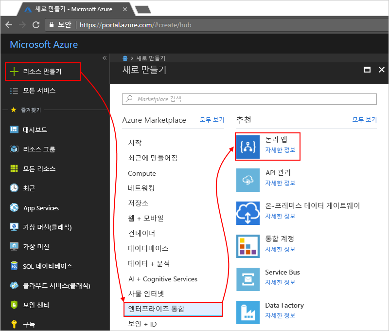

# Azure Monitor 로그를 사용하여 논리 앱 모니터링

모니터링 하 고 논리 앱에 대 한 다양 한 디버깅 정보를 설정 [Azure Monitor 로그](../log-analytics/log-analytics-overview.md) 논리 앱을 만들 때. Azure Monitor 로그는 진단 로깅 및 Azure portal에서 Logic Apps 관리 솔루션을 설치할 때 논리 앱에 대 한 모니터링을 제공 합니다. 이 솔루션은 상태, 실행 시간, 다시 제출 상태 및 상관 관계 ID와 같은 특정 세부 정보를 사용하여 논리 앱 실행에 대한 집계 정보를 제공합니다. 이 문서에서는 Azure Monitor 로그 런타임 이벤트를 확인 하 고 논리 앱에 대 한 데이터를 실행 하도록 설정 하는 방법을 보여 줍니다.

기존 논리 앱에 대 한 Azure Monitor 로그를 켜려면 다음이 단계를 수행 [Azure Monitor 로그로 논리 앱 런타임 데이터를 보내고 진단 로깅을 켜서](../logic-apps/logic-apps-monitor-your-logic-apps.md#azure-diagnostics)합니다.

> [!NOTE]
> 이 페이지에서는 [2019년 1월에 사용 중지](../azure-monitor/platform/oms-portal-transition.md)되고 대신 Azure Log Analytics로 해당 단계를 대체하는 Microsoft OMS(Operations Management Suite)를 사용하여 이러한 작업을 수행하는 방법에 대한 단계를 설명했습니다. 

[!INCLUDE [azure-monitor-log-analytics-rebrand](../../includes/azure-monitor-log-analytics-rebrand.md)]

## 필수 조건

시작하기 전에 Log Analytics 작업 영역이 필요합니다. [Log Analytics 작업 영역을 만드는 방법](../azure-monitor/learn/quick-create-workspace.md)을 알아봅니다. 

## 논리 앱을 만들 때 진단 로깅 켜기

1. [Azure Portal](https://portal.azure.com)에서 논리 앱을 만듭니다. **리소스 만들기** > **통합** > **Logic App**을 선택합니다.

   

1. **논리 앱 만들기** 아래에서 표시된 것처럼 다음과 같은 작업을 수행합니다.

   1. 논리 앱의 이름을 입력하고 Azure 구독을 선택합니다. 

   1. Azure 리소스 그룹을 만들거나 선택합니다.

   1. **Log Analytics**를 **켜기**로 설정합니다. 

   1. Log Analytics 작업 영역 목록에서 논리 앱 실행에 대한 데이터를 보내려는 작업 영역을 선택합니다. 

      

      이 단계를 마치면 Azure에서 Log Analytics 작업 영역에 연결된 논리 앱이 만들어집니다. 
      또한 이 단계에서 작업 영역에 Logic Apps 관리 솔루션이 자동으로 설치됩니다.

   1. 작업을 완료하면 **만들기**를 선택합니다.

1. 논리 앱 실행을 보려면 [다음 단계로 계속 진행합니다](#view-logic-app-runs-oms).

## Logic Apps 관리 솔루션 설치

논리 앱을 만들 때 Azure Monitor 로그 이미 설정한 경우이 단계를 건너뜁니다. Logic Apps 관리 솔루션이 이미 설치되어 있습니다.

1. [Azure Portal](https://portal.azure.com)에서 **모든 서비스**를 선택합니다. 검색 상자에서 "로그 분석"을 찾고 **Log Analytics**를 선택합니다.

   

1. **Log Analytics** 아래에서 Log Analytics 작업 영역을 찾고 선택합니다. 

   

1. **Log Analytics 시작** > **솔루션 모니터링 구성** 아래에서 **솔루션 보기**를 선택합니다.

   

1. 개요 페이지에서 **관리 솔루션** 목록을 여는 **추가**를 선택합니다. 해당 목록에서 **Logic Apps 관리**를 선택합니다. 

   

   솔루션을 찾을 수 없는 경우 목록의 맨 아래에서 솔루션이 나타날 때까지 **추가 로드**를 선택합니다.

1. **만들기**를 선택하고 솔루션을 설치하려는 Log Analytics 작업 영역을 확인한 후 **만들기**를 다시 선택합니다.   

   

   기존 작업 영역을 사용하지 않으려는 경우 이번에 새 작업 영역을 만들 수도 있습니다.

   완료되면 Logic Apps 관리 솔루션이 개요 페이지에 표시됩니다. 

## 논리 앱 실행 정보 보기

논리 앱 실행 후 **Logic Apps 관리** 타일에서 해당 논리 앱 실행의 상태 및 수를 확인할 수 있습니다. 

1. Log Analytics 작업 영역으로 이동하여 개요 페이지를 엽니다. **Logic Apps 관리**를 선택합니다. 

   

   여기에서 논리 앱 실행은 이름이나 실행 상태로 그룹화됩니다. 
   이 페이지는 논리 앱 실행에 대한 작업 또는 트리거의 오류에 대한 세부 정보도 표시합니다.

   
   
1. 특정 논리 앱 또는 상태에 대한 모든 실행을 보려면 논리 앱 또는 상태에 대한 행을 선택합니다.

   특정 논리 앱에 대한 모든 실행을 보여 주는 예제는 다음과 같습니다.

   

   이 페이지에는 이러한 고급 옵션이 있습니다.

   * **추적된 속성:**

     이 열에서는 논리 앱에 대해 작업별로 그룹화되어 추적된 속성을 보여줍니다. 추적된 속성을 보려면 **보기**를 선택합니다. 
     추적된 속성을 검색하려면 열 필터를 사용합니다.
   
     

     추적된 속성이 새로 추가되어 처음으로 표시되는 데 10-15분 정도 걸릴 수 있습니다. [논리 앱에 추적된 속성을 추가하는 방법](logic-apps-monitor-your-logic-apps.md#azure-diagnostics-event-settings-and-details)을 알아보세요.

   * **다시 제출:** 실패했거나 성공했거나 계속 실행 중인 하나 이상의 논리 앱 실행을 다시 제출할 수 있습니다. 다시 제출하려는 실행에 대한 확인란을 선택하고 **다시 제출**을 선택합니다. 

     

1. 이러한 결과를 필터링하기 위해 클라이언트와 서버 쪽 필터링을 모두 수행할 수 있습니다.

   * **클라이언트 쪽 필터**: 각 열에 대해 원하는 필터를 선택합니다. 예를 들면 다음과 같습니다.

     

   * **서버 쪽 필터**: 특정 시간 창을 선택하거나 표시되는 실행 횟수를 제한하려면 페이지 맨 위에 있는 범위 컨트롤을 사용합니다. 기본적으로 1,000개 레코드가 한 번에 나타납니다.
   
     
 
1. 특정 실행에 대한 모든 작업 및 관련 세부 정보를 보려면 해당 논리 앱 실행에 대한 행을 선택합니다.

   다음은 특정 논리 앱 실행에 대한 모든 작업을 보여 주는 예입니다.

   
   
1. 결과 페이지에서 결과 뒤에 있는 쿼리를 보거나 모든 결과를 보려면 [로그 검색] 페이지가 열리는 **모든 참조**를 선택합니다.
   
   
   
   [로그 검색] 페이지에서 다음을 수행합니다.

   * 테이블에서 조회 결과를 보려면 **테이블**을 선택합니다.

   * 검색 창에서 쿼리 문자열을 편집하여 쿼리를 변경할 수 있습니다. 
   향상된 경험을 위해 **고급 분석**을 선택합니다.

     
     
     Log analytics 페이지에서 쿼리를 업데이트 하 고 테이블의 결과 볼 수 있습니다. 이 쿼리는 [Kusto 쿼리 언어](https://aka.ms/LogAnalyticsLanguageReference)를 사용하여 서로 다른 결과를 보려는 경우 편집할 수 있습니다. 

     

## 다음 단계

* [B2B 메시지 모니터링](../logic-apps/logic-apps-monitor-b2b-message.md)