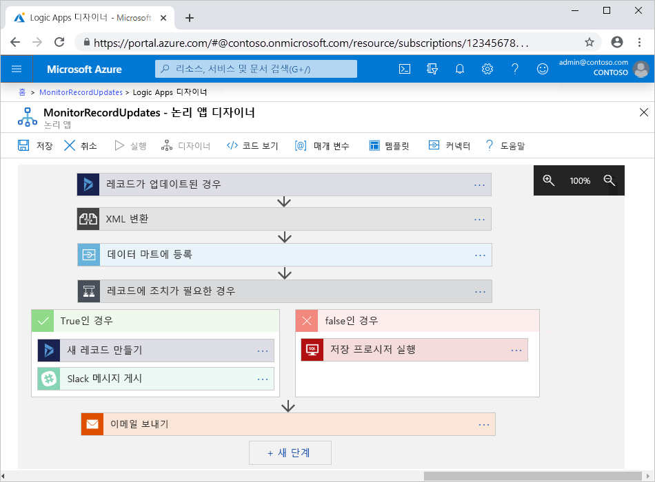

# Azure Logic Apps란?

[Azure Logic Apps](https://azure.microsoft.com/services/logic-apps)는 앱, 데이터, 서비스 및 시스템을 통합하는 자동화된 [*워크플로*](#logic-app-concepts)를 만들고 실행할 수 있는 클라우드 기반 플랫폼입니다. 이 플랫폼을 사용하면 엔터프라이즈 및 B2B(Business-to-Business) 시나리오를 위한 확장성이 뛰어난 통합 솔루션을 신속하게 개발할 수 있습니다. [Azure Integration Services](https://azure.microsoft.com/product-categories/integration/)의 멤버인 Logic Apps는 클라우드, 온-프레미스, 하이브리드 환경에서 레거시, 최신 및 최첨단 시스템을 연결하는 방법을 간소화합니다.

다음 목록에서는 Logic Apps 서비스를 사용하여 자동화할 수 있는 작업, 비즈니스 프로세스 및 워크로드의 몇 가지 예를 설명합니다.

* 특정 이벤트가 발생할 때(예: 새 파일이 업로드될 때) Office 365를 사용하여 이메일 알림을 예약하고 보내기.
* 온-프레미스 시스템과 클라우드 서비스에서 고객 주문 라우팅 및 처리.
* 업로드된 파일을 SFTP 또는 FTP 서버에서 Azure Storage로 이동.
* 트윗을 모니터링하고, 감정을 분석하고, 검토가 필요한 항목에 대한 경고 또는 작업 만들기.

> [!VIDEO https://channel9.msdn.com/Blogs/Azure/Introducing-Azure-Logic-Apps/player]

선택하고 만드는 논리 앱 리소스 종류에 따라 논리 앱이 다중 테넌트, 단일 테넌트 또는 전용 통합 서비스 환경에서 실행됩니다. 예를 들어 단일 테넌트 기반 논리 앱을 컨테이너화할 때 앱을 컨테이너로 배포하고 Azure Functions가 실행할 수 있는 모든 위치에서 실행할 수 있습니다. 자세한 내용은 [논리 앱의 리소스 종류 및 호스트 환경의 차이점](#resource-environment-differences)을 참조하세요.

다양한 데이터 원본에서 실시간으로 안전하게 작업에 액세스하고 실행하려면 [400개가 넘게 증가하고 있는 Azure 커넥터 에코시스템](/connectors/connector-reference/connector-reference-logicapps-connectors)의 [*관리형 커넥터*](#logic-app-concepts)를 선택하여 워크플로에서 사용할 수 있습니다. 예를 들면 다음과 같습니다.

* Azure 서비스(예: Blob Storage 및 Service Bus)
* Office 365 서비스(예: Outlook, Excel 및 SharePoint)
* 데이터베이스 서버(예: SQL 및 Oracle)
* 엔터프라이즈 시스템(예: SAP 및 IBM MQ)
* 파일 공유(예: FTP 및 SFTP)

서비스 엔드포인트와 통신하거나, 사용자 고유의 코드를 실행하거나, 워크플로를 구성하거나, 데이터를 조작하려면 Logic Apps 서비스 내에서 기본적으로 실행되는 [*기본 제공*](#logic-app-concepts) 트리거 및 작업을 사용하면 됩니다. 예를 들어 기본 제공 트리거에는 요청, HTTP 및 되풀이가 포함됩니다. 기본 제공 작업에는 조건, For each, JavaScript 코드 실행과 함께 Azure 함수, 웹앱 또는 Azure에서 호스팅되는 API 앱 및 기타 Logic Apps 워크플로를 호출하는 작업이 포함됩니다.

B2B 통합 환경에는 [BizTalk Server](/biztalk/core/introducing-biztalk-server)의 기능이 Logic Apps에 포함됩니다. B2B(Business-to-Business) 아티팩트를 정의하려면 이러한 아티팩트가 저장되는 [*통합 계정*](#logic-app-concepts)을 만듭니다. 이 계정을 논리 앱에 연결하면 워크플로에서 이러한 B2B 아티팩트를 사용하고 EDI(전자 데이터 교환) 및 EAI(Enterprise Application Integration) 표준을 준수하는 메시지를 교환할 수 있습니다.

워크플로에서 앱, 데이터, 서비스 및 시스템에 액세스하고 작업하는 방법에 대한 자세한 내용은 다음 문서를 살펴보세요.

* [Azure Logic Apps용 커넥터](../connectors/apis-list.md)
* [Azure Logic Apps용 관리형 커넥터](../connectors/built-in.md)
* [Azure Logic Apps용 기본 제공 트리거 및 작업](../connectors/managed.md)
* [Azure Logic Apps를 사용한 B2B 엔터프라이즈 통합 솔루션](logic-apps-enterprise-integration-overview.md)

## 주요 용어

* *논리 앱*: 워크플로를 개발하려는 경우에 만들 Azure 리소스입니다. 시나리오의 요구 사항 및 솔루션 요구 사항에 따라 다중 테넌트 Azure Logic Apps, 단일 테넌트 Azure Logic Apps 또는 ISE(통합 서비스 환경)에서 실행되는 논리 앱을 만들 수 있습니다. 자세한 내용은 [논리 앱의 리소스 종류 및 호스트 환경의 차이점](#resource-environment-differences)을 참조하세요.

* *워크플로*: 단일 트리거로 시작해서 하나 이상의 작업을 수행하는 작업 또는 프로세스를 정의하는 일련의 단계입니다.

* *트리거*: 각 워크플로를 시작하고 워크플로에서 작업을 실행하기 전에 충족해야 하는 조건을 지정하는 첫 번째 단계입니다. 예를 들어 받은 편지함에 이메일을 받거나 스토리지 계정에서 새 파일이 검색되는 트리거 이벤트를 이용할 수 있습니다.

* *작업*: 트리거 뒤에 오며 워크플로에서 일부 작업을 실행하는 각 후속 단계입니다.

* *기본 제공 트리거 또는 작업*: 워크플로 일정 또는 구조를 제어하고, 사용자 고유의 코드를 실행하고, 데이터를 관리 또는 조작하고, 워크플로의 다른 작업을 수행할 수 있게 해주는 기본적으로 실행되는 Logic Apps 작업입니다. 대부분의 기본 제공 작업은 서비스 또는 시스템과 연결되어 있지 않습니다. 또한 대부분의 경우 먼저 워크플로와의 연결을 만들고 ID를 인증할 필요가 없습니다. 하지만 기본 제공 작업은 Azure Functions, Azure API Management, Azure App Services 등 자주 사용되는 몇 가지 서비스, 시스템, 프로토콜에도 사용할 수 있습니다.

  예를 들어 되풀이 트리거를 사용하면 거의 모든 워크플로를 일정에 따라 시작할 수 있습니다. 또는 요청 트리거를 사용하면 호출될 때까지 워크플로를 대기시킬 수 있습니다. 자세한 내용은 [Azure Logic Apps용 기본 제공 트리거 및 작업](../connectors/built-in.md)을 참조하세요.

* *관리형 커넥터:* 워크플로에서 특정 앱, 데이터, 서비스 또는 시스템에 액세스할 수 있도록 미리 빌드된 트리거 및 동작을 제공하는 REST API에 대한 미리 빌드된 프록시 또는 래퍼입니다. 대부분의 관리형 커넥터는 먼저 워크플로와 연결을 만들고 ID를 인증해야만 사용할 수 있습니다.

  예를 들어 트리거로 워크플로를 시작하거나, Azure Blob Storage, Office 365, Salesforce 또는 SFTP 서버와 연동하는 동작을 추가할 수 있습니다. 관리형 커넥터는 Microsoft에서 호스트하고 유지 관리합니다. 자세한 내용은 [Azure Logic Apps용 관리형 커넥터](../connectors/managed.md)를 참조하세요.

* *통합 계정*: 워크플로에서 사용할 B2B 아티팩트를 정의하고 저장하려는 경우에 만드는 Azure 리소스입니다. 이 계정을 논리 앱에 연결하면 워크플로에서 이러한 B2B 아티팩트를 사용하고 EDI(전자 데이터 교환) 및 EAI(Enterprise Application Integration) 표준을 준수하는 메시지를 교환할 수 있습니다.

  예를 들어 거래 업체, 계약, 스키마, 맵 및 기타 B2B 아티팩트를 정의할 수 있습니다. 이러한 아티팩트를 사용하고 AS2, EDIFACT, X12, RosettaNet 등의 프로토콜을 통해 메시지를 교환하는 워크플로를 만들 수 있습니다. 자세한 내용은 [B2B 엔터프라이즈 통합을 위한 통합 계정 만들기 및 관리](logic-apps-enterprise-integration-create-integration-account.md)를 참조하세요.

## 논리 앱의 작동 원리

논리 앱에서 각 워크플로는 항상 단일 [트리거](#logic-app-concepts)로 시작합니다. 트리거는 특정 이벤트가 발생하거나 데이터가 특정 기준을 충족하는 등 특정 조건이 충족될 때 작동합니다. 대부분의 트리거에는 워크플로의 실행 빈도를 제어하는 [예약 기능](../logic-apps/concepts-schedule-automated-recurring-tasks-workflows.md)이 포함되어 있습니다. 트리거 이후에는 하나 이상의 [작업](#logic-app-concepts)이 워크플로를 통해 이동하는 데이터를 처리, 취급 또는 변환하는 작업을 실행하거나 워크플로를 다음 단계로 진행시키는 작업을 실행합니다.

예를 들어 다음 워크플로는 **레코드가 업데이트될 때** 로 명명된 기본 제공 조건이 있는 Dynamics 트리거로 시작합니다. 작업에는 XML 변환, 데이터를 업데이트하는 웹앱 호출, 수행할 작업을 제어하는 조건 평가, 결과와 함께 이메일 알림 보내기 등이 포함됩니다. 트리거에서 조건을 충족하는 이벤트를 탐지하면 트리거가 작동하고 워크플로의 작업이 실행되기 시작합니다. 트리거가 작동할 때마다 Logic Apps 서비스는 작업을 실행하는 워크플로 인스턴스를 만듭니다.

Azure Portal, Visual Studio Code 또는 Visual Studio에서 Logic Apps 디자이너를 사용하면 워크플로를 시각적으로 만들 수 있습니다. 또한 각 워크플로에는 JSON(JavaScript Object Notation)을 사용하여 기술된 기본 정의도 있습니다. 원하는 경우 이 JSON 정의를 변경하여 워크플로를 편집할 수 있습니다. 일부 만들기 및 관리 작업에서는 Logic Apps가 Azure PowerShell 및 Azure CLI 명령 지원을 제공합니다. 자동 배포의 경우 Logic Apps가 Azure Resource Manager 템플릿을 지원합니다.

## 리소스 종류 및 호스트 환경의 차이점

논리 앱 워크플로를 만들려면 시나리오, 솔루션 요구 사항, 원하는 기능 및 워크플로를 실행하려는 환경에 따라 **논리 앱** 리소스 종류를 선택합니다.

다음 표에는 원래 **논리 앱(소비)** 리소스 종류와 **논리 앱(표준)** 리소스 종류 간의 차이점이 간략하게 요약되어 있습니다. 또한 *단일 테넌트* 모델과 *다중 테넌트* 및 *ISE(통합 서비스 환경)* 모델의 논리 앱 워크플로 배포, 호스팅 및 실행 방법도 비교합니다.

[!INCLUDE [Logic app resource type and environment differences](../../includes/logic-apps-resource-environment-differences-table.md)]

## Logic Apps를 사용하는 이유

Logic Apps 통합 플랫폼은 미리 빌드된 Microsoft 관리형 API 커넥터 및 기본 제공 작업을 제공하므로 앱, 데이터, 서비스, 시스템을 보다 쉽고 빠르게 연결하고 통합할 수 있습니다. 리소스에 액세스하는 방법을 파악하는 것이 아니라 솔루션의 비즈니스 논리 및 기능을 설계하고 구현하는 데 집중할 수 있습니다.

일반적으로 코드를 작성할 필요가 없습니다. 그러나 코드를 작성해야 하는 경우 [Azure Functions](../azure-functions/functions-overview.md)를 사용하여 코드 조각을 만들고 워크플로에서 해당 코드를 실행할 수 있습니다. [**인라인 코드** 작업](logic-apps-add-run-inline-code.md)을 사용하여 워크플로에서 실행되는 코드 조각을 만들 수도 있습니다. 워크플로가 Azure 서비스, 사용자 지정 앱 또는 다른 솔루션의 이벤트와 상호 작용해야 하는 경우 [Azure Event Grid](../event-grid/overview.md)를 사용하여 이벤트를 모니터링, 라우팅, 게시할 수 있습니다.

Logic Apps는 Microsoft Azure를 통해 완벽하게 관리되므로 솔루션의 호스팅, 크기 조정, 관리, 모니터링, 유지 관리에 대해 걱정할 필요가 없습니다. 이러한 기능을 사용하여 ["서버리스" 앱 및 솔루션](../logic-apps/logic-apps-serverless-overview.md)을 만들 때 비즈니스 논리 및 기능에만 집중할 수 있습니다. 이러한 서비스는 요구 사항을 충족하고, 신속하게 통합되고, 코드를 거의 또는 전혀 사용하지 않고 강력한 클라우드 앱을 빌드할 수 있도록 자동으로 스케일링됩니다.

다른 기업에서 Logic Apps를 다른 Azure 서비스 및 Microsoft 제품과 결합하여 민첩성을 개선하고 핵심 비즈니스에 더욱 집중할 수 있게 된 비결을 알아보려면 다음 [고객 스토리](https://aka.ms/logic-apps-customer-stories)를 확인하세요.

다음 섹션에서는 Logic Apps의 기능 및 이점에 대한 자세한 정보를 제공합니다.

#### 사용하기 쉬운 도구를 사용하여 시각적으로 워크플로 만들기 및 편집

Logic Apps의 시각적 디자인 도구를 사용하여 시간을 절약하고 복잡한 프로세스를 간소화합니다. Azure Portal, Visual Studio Code 또는 Visual Studio에서 Logic Apps 디자이너를 사용하여 처음부터 끝까지 워크플로를 만듭니다. 단지 트리거로 워크플로를 시작하고, [커넥터 갤러리](/connectors/connector-reference/connector-reference-logicapps-connectors)에서 작업을 원하는 만큼 추가합니다.

다중 테넌트 기반 논리 앱을 만드는 경우 [템플릿 갤러리에서 워크플로를 생성](../logic-apps/logic-apps-create-logic-apps-from-templates.md)하면 더 빠르게 시작할 수 있습니다. 이러한 템플릿은 SaaS(Software as a Service) 앱에 대한 간단한 연결부터 고급 B2B 솔루션 및 "재미를 위한" 템플릿까지 일반적인 워크플로 패턴에 사용할 수 있습니다.

#### 여러 환경에 걸쳐 다양한 시스템 연결

설명하기는 쉽지만 코드로 구현하기는 어려운 패턴 및 프로세스가 있습니다. Logic Apps 플랫폼은 클라우드, 온-프레미스, 하이브리드 환경에 걸쳐 다양한 시스템을 원활하게 연결하는 데 도움이 됩니다. 예를 들어 클라우드 마케팅 솔루션을 온-프레미스 요금 청구 시스템에 연결하거나 Azure Service Bus를 사용하여 API 및 시스템의 메시지를 중앙 집중화할 수 있습니다. Logic Apps는 이러한 시나리오에 다시 사용할 수 있고 다시 구성할 수 있는 솔루션을 전달하는 빠르고 안정적이며 일관된 방법을 제공합니다.

#### 한 번 작성, 반복해서 다시 사용

여러 환경 및 지역에서 [논리 앱 배포를 설정 및 자동화](../logic-apps/logic-apps-azure-resource-manager-templates-overview.md)할 수 있도록 논리 앱을 Azure Resource Manager 템플릿으로 만듭니다.

#### 엔터프라이즈 통합 및 B2B 시나리오에 대한 고급 지원

기업 및 조직에서는 EDIFACT, AS2, X12, RosettaNet 등과 같이 산업 표준이지만 서로 다른 메시지 프로토콜 및 형식을 사용하여 서로 전자적으로 통신합니다. Logic Apps에서 지원하는 [엔터프라이즈 통합 기능](../logic-apps/logic-apps-enterprise-integration-overview.md)을 사용하여 거래 업체에서 사용하는 메시지 형식을 조직의 시스템에서 해석하고 처리할 수 있는 형식으로 변환하는 워크플로를 만들 수 있습니다. Logic Apps는 암호화 및 디지털 서명을 사용하여 이러한 교환을 원활하고 안전하게 처리합니다.

현재 시스템 및 서비스로 작은 규모로 시작한 다음, 필요한 만큼 증분 방식으로 확장할 수 있습니다. 준비가 완료되면 Logic Apps 플랫폼으로 이러한 기능 및 기타 기능을 제공하여 보다 성숙한 통합 시나리오를 구현하고 그에 맞게 강화할 수 있습니다.

* [Microsoft BizTalk Server](/biztalk/core/introducing-biztalk-server), [Azure Service Bus](../service-bus-messaging/service-bus-messaging-overview.md), [Azure Functions](../azure-functions/functions-overview.md), [Azure API Management](../api-management/api-management-key-concepts.md) 등을 통합하고 구축합니다.
* [EDIFACT](../logic-apps/logic-apps-enterprise-integration-edifact.md), [AS2](../logic-apps/logic-apps-enterprise-integration-as2.md), [X12](../logic-apps/logic-apps-enterprise-integration-x12.md), [RosettaNet](logic-apps-enterprise-integration-rosettanet.md) 프로토콜을 사용하여 메시지를 교환합니다.
* [XML 메시지](../logic-apps/logic-apps-enterprise-integration-xml.md) 및 [플랫 파일](../logic-apps/logic-apps-enterprise-integration-flatfile.md)을 처리합니다.
* [거래 업체](../logic-apps/logic-apps-enterprise-integration-partners.md), [계약](../logic-apps/logic-apps-enterprise-integration-agreements.md), [변환 맵](../logic-apps/logic-apps-enterprise-integration-maps.md), [유효성 검사 스키마](../logic-apps/logic-apps-enterprise-integration-schemas.md) 등과 같은 B2B 아티팩트를 저장하고 관리하는 [통합 계정](./logic-apps-enterprise-integration-create-integration-account.md)을 만듭니다.

예를 들어 Microsoft BizTalk Server를 사용하는 경우 워크플로는 [BizTalk Server 커넥터](../connectors/managed.md#on-premises-connectors)를 사용하여 BizTalk Server와 통신할 수 있습니다. 그런 다음, [통합 계정 커넥터](../connectors/managed.md#integration-account-connectors)를 사용하여 워크플로에서 BizTalk와 비슷한 작업을 확장하거나 수행할 수 있습니다. 다른 방향으로 이동하면 [Logic Apps용 Microsoft BizTalk Server 어댑터](https://www.microsoft.com/download/details.aspx?id=54287)를 사용하여 BizTalk Server가 워크플로와 통신할 수 있습니다. BizTalk Server에서 [BizTalk Server 어댑터를 설정하고 사용](/biztalk/core/logic-app-adapter)하는 방법을 알아보세요.

#### 기본 제공 확장성

원하는 코드를 실행하는 데 적합한 커넥터를 사용할 수 없는 경우 [Azure Functions](../azure-functions/functions-overview.md)를 사용하여 워크플로에서 사용자 고유의 코드 조각을 만들고 호출할 수 있습니다. 또는 워크플로에서 호출할 수 있는 사용자 고유의 [API](../logic-apps/logic-apps-create-api-app.md) 및 [사용자 지정 커넥터](../logic-apps/custom-connector-overview.md)를 만듭니다.

#### Azure 가상 네트워크 내 리소스에 액세스

논리 앱 워크플로는 [*ISE(통합 서비스 환경)*](../logic-apps/connect-virtual-network-vnet-isolated-environment-overview.md)를 만들 때 [Azure 가상 네트워크](../virtual-network/virtual-networks-overview.md) 내에 있는 VM(가상 머신) 및 기타 시스템이나 서비스와 같이 보호된 리소스에 액세스할 수 있습니다. ISE는 전용 리소스를 사용하고 글로벌 다중 테넌트 Azure Logic Apps 서비스와 별도로 실행되는 Azure Logic Apps 서비스의 전용 인스턴스입니다.

사용자 고유의 전용 인스턴스에서 논리 앱을 실행하면 다른 Azure 테넌트가 앱 성능에 줄 수 있는 영향(["사용량이 많은 인접 항목" 효과](https://en.wikipedia.org/wiki/Cloud_computing_issues#Performance_interference_and_noisy_neighbors)로 알려짐)을 줄일 수 있습니다. ISE는 다음과 같은 이점도 제공합니다.

* 다중 테넌트 서비스의 논리 앱에서 공유되는 고정 IP 주소와는 별개의 고정 IP 주소입니다. 대상 시스템과 통신하도록 단일 공용, 정적 및 예측 가능한 아웃바운드 IP 주소를 설정할 수도 있습니다. 이렇게 하면 해당 대상 시스템에서 각 ISE에 대한 방화벽 허용 설정을 추가로 구성할 필요가 없습니다.

* 실행 지속 시간, 스토리지 보존, 처리량, HTTP 요청 및 응답 시간 제한, 메시지 크기 및 사용자 지정 커넥터 요청에 대한 제한이 증가합니다. 자세한 내용은 [Azure Logic Apps에 대한 제한 및 구성](../logic-apps/logic-apps-limits-and-config.md)을 참조하세요.

ISE를 만들 때 Azure는 해당 ISE를 Azure 가상 네트워크에 *삽입* 하거나 배포합니다. 그런 다음, 액세스해야 하는 논리 앱 및 통합 계정의 위치로 이 ISE를 사용할 수 있습니다. ISE 만들기에 대한 자세한 내용은 [Azure Logic Apps에서 Azure 가상 네트워크에 연결](../logic-apps/connect-virtual-network-vnet-isolated-environment.md)을 참조하세요.

#### 가격 책정 옵션

기능 및 실행 위치(다중 테넌트, 단일 테넌트, 통합 서비스 환경)에 따라 달라지는 각 논리 앱 유형의 [가격 책정 모델](../logic-apps/logic-apps-pricing.md)은 서로 다릅니다. 예를 들어 다중 테넌트 기반 논리 앱은 소비 가격 책정을 사용하고, 통합 서비스 환경의 논리 앱은 고정 가격 책정을 사용합니다. Logic Apps에 대한 [가격 책정 및 계량](../logic-apps/logic-apps-pricing.md)에 대해 자세히 알아보세요.

## Logic Apps가 Functions, WebJobs 및 Power Automate와 다른 점은 무엇일까요?

이러한 모든 서비스는 다양한 시스템을 연결하고 함께 가져오는 데 도움이 됩니다. 서비스마다 고유의 장점과 이점이 있으므로, 확장 가능하고 모든 기능을 갖춘 통합 시스템을 신속하게 빌드하는 가장 좋은 방법은 기능을 결합하는 것입니다. 자세한 내용은 [Logic Apps, Functions, WebJobs 및 Power Automate 중에서 선택](../azure-functions/functions-compare-logic-apps-ms-flow-webjobs.md)을 참조하세요.

## 시작

Azure Logic Apps를 시작하려면 먼저 Azure 구독이 필요합니다. 구독이 없는 경우 [Azure 체험 계정에 등록](https://azure.microsoft.com/free/)합니다. Azure 구독이 있는 경우 이 빠른 시작의 지침에 따라 RSS 피드를 통해 웹 사이트의 새 콘텐츠를 모니터링하다가 새 콘텐츠가 나타나면 이메일을 보내는 [첫 번째 논리 앱을 만들어 봅니다](../logic-apps/quickstart-create-first-logic-app-workflow.md).

## 기타 리소스

다음 소개 비디오를 시청하여 Logic Apps 플랫폼에 대해 자세히 알아보세요.

> [!VIDEO https://channel9.msdn.com/Shows/Azure-Friday/Go-serverless-Enterprise-integration-with-Azure-Logic-Apps/player]
>
> [!VIDEO https://channel9.msdn.com/Shows/Azure-Friday/Connect-and-extend-your-mainframe-to-the-cloud-with-Logic-Apps/player]

## 다음 단계

* [빠른 시작: 첫 번째 논리 앱 워크플로 만들기](../logic-apps/quickstart-create-first-logic-app-workflow.md)