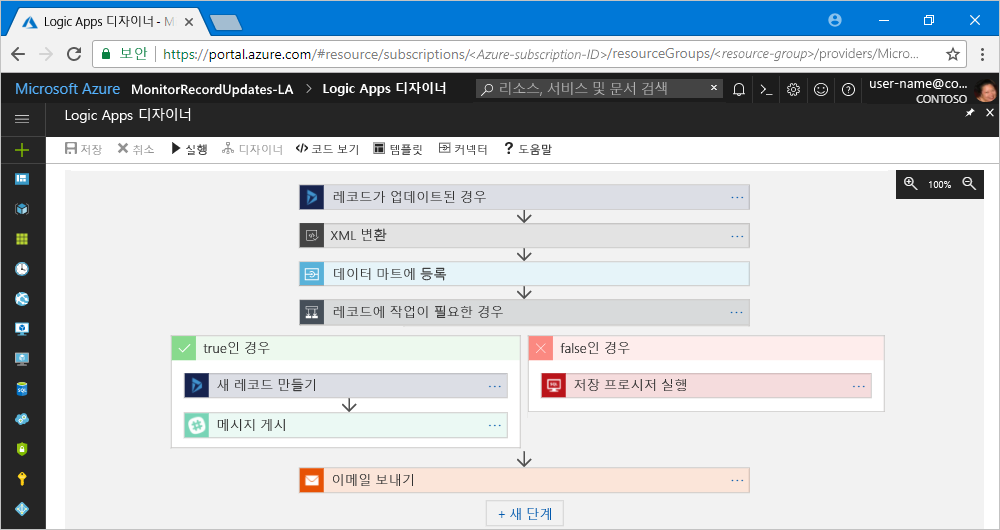

# Azure Logic Apps란?

[Azure Logic Apps](https://azure.microsoft.com/services/logic-apps)는 회사 또는 조직에서 앱, 데이터, 시스템 및 서비스를 통합해야 할 때 작업, 비즈니스 프로세스 및 [워크플로](#logic-app-concepts)를 예약, 자동화 및 오케스트레이션하는 데 유용한 클라우드 서비스입니다. Logic Apps는 클라우드, 온-프레미스 또는 둘 모두 중 어디에 있든 간에 앱 [통합](https://azure.microsoft.com/product-categories/integration/), 데이터 통합, 시스템 통합, EAI(엔터프라이즈 애플리케이션 통합), B2B(기업 간) 통신을 위한 확장성 있는 솔루션을 설계하고 구축하는 방법을 간소화합니다.

예를 들어 다음은 논리 앱으로 자동화할 수 있는 몇 가지 워크로드의 예입니다.

* 온-프레미스 시스템 및 클라우드 서비스의 주문 처리 및 라우팅.
* 다양한 시스템, 앱 및 서비스에서 이벤트가 발생하면 Office 365에서 이메일 알림 전송.
* 업로드된 파일을 SFTP 또는 FTP 서버에서 Azure Storage로 이동. 
* 특정 주체에 대한 트윗을 모니터링하고, 감성을 분석하고, 검토할 항목에 대한 경고 또는 작업 만들기.

Azure Logic Apps을 사용하여 엔터프라이즈 통합 솔루션을 빌드하려는 경우 Azure Service Bus, Functions 및 Storage와 같은 Azure 서비스, SQL, Office 365, Dynamics, BizTalk, Salesforce, SAP, Oracle DB, 파일 공유를 비롯한 [200개가 넘는 커넥터](../connectors/apis-list.md)가 있고 지금도 계속 커넥터가 추가되는 갤러리에서 적합한 항목을 선택할 수 있습니다. [커넥터](#logic-app-concepts)는 데이터를 실시간으로 안전하게 액세스 및 처리하는 논리 앱을 만들 수 있는 [트리거](#logic-app-concepts), [작업](#logic-app-concepts) 또는 둘 모두를 제공합니다.

> [!VIDEO https://channel9.msdn.com/Blogs/Azure/Introducing-Azure-Logic-Apps/player]

## Logic Apps의 작동 원리 

모든 논리 앱 워크플로는 특정 이벤트가 발생하거나 사용 가능한 새 데이터가 특정 기준을 충족할 때 실행되는 트리거를 통해 시작됩니다. Logic Apps의 커넥터에서 제공되는 많은 트리거에는 워크로드가 주기적으로 실행되는 빈도를 사용자가 지정할 수 있는 기본적인 일정 예약 기능이 포함됩니다. 더 복잡한 일정 예약 또는 고급 되풀이의 경우 되풀이 트리거를 모든 워크플로에서 첫 번째 단계로 사용할 수 있습니다. [일정 기반 워크플로](../logic-apps/concepts-schedule-automated-recurring-tasks-workflows.md)에 대해 자세히 알아보세요.

트리거가 실행될 때마다 Logic Apps 엔진은 워크플로의 작업을 실행하는 논리 앱 인스턴스를 만듭니다. 또한 이러한 작업에는 조건부 명령문, 전환 명령문, 루프, 분기 등의 데이터 변환 및 흐름 컨트롤이 포함될 수 있습니다. 예를 들어 이 논리 앱은 "레코드가 업데이트되는 경우"라고 하는 기본 제공 기준을 사용하는 Dynamics 365 트리거를 통해 시작됩니다. 트리거가 이 조건과 일치하는 이벤트를 발견하면 트리거가 실행되고 워크플로의 작업을 실행합니다. 여기서, 이러한 작업에는 XML 변환, 데이터 업데이트, 분기, 의사 결정 분기 및 이메일 알림이 포함됩니다.

브라우저를 통해 Azure Portal 에서 또는 Visual Studio에서 사용할 수 있는 Logic Apps 디자이너를 사용하여 논리 앱을 시각적으로 빌드할 수 있습니다. 더 많은 사용자 지정 논리 앱을 원하는 경우 "코드 보기" 편집기에서 작업하여 JSON(JavaScript Object Notation)에서 논리 앱 정의를 만들거나 편집하면 됩니다. 선별된 작업에 Azure PowerShell 명령 및 Azure Resource Manager 템플릿을 사용할 수도 있습니다. 논리 앱은 Azure의 클라우드에 배포되어 실행됩니다. 자세한 소개는 [Azure Enterprise Integration Services를 사용하여 규모에 맞는 클라우드 애플리케이션 실행](https://channel9.msdn.com/Events/Connect/2017/T119/) 비디오를 시청하세요.

## Logic Apps를 사용하는 이유

기업이 점차 디지털로 전환하는 요즘, 미리 빌드된 API를 Microsoft 관리 커넥터로 제공하는 논리 앱을 사용하면 기존 시스템과 현대식 첨단 시스템을 보다 간편하고 신속하게 연결할 수 있습니다. 사용자는 앱의 비즈니스 논리 및 기능에 집중할 수 있습니다. 앱의 빌드, 호스팅, 크기 조정, 관리, 유지 관리 및 모니터링에 대해 걱정할 필요가 없습니다. Logic Apps가 사용자 대신 이러한 문제를 처리합니다. 뿐만 아니라, 사용량 [가격 책정 모델](../logic-apps/logic-apps-pricing.md)에 따라 사용한 만큼만 요금을 지불하면 됩니다. 

대부분의 경우 코드를 작성할 필요가 없습니다. 코드를 작성해야 하는 경우에도 [Azure Functions](../azure-functions/functions-overview.md)로 코드를 만들고 논리 앱에서 요청 시 해당 코드를 실행할 수 있습니다. 또한 논리 앱이 Azure 서비스, 사용자 지정 앱 또는 기타 솔루션의 이벤트와 상호 작용해야 하는 경우 [Azure Event Grid](../event-grid/overview.md)를 논리 앱과 함께 사용하여 이벤트를 모니터링, 라우팅 및 게시할 수 있습니다.

Logic Apps, Functions 및 Event Grid는 솔루션의 빌드, 호스팅, 크기 조정, 관리, 모니터링 및 유지 관리에 대해 걱정할 필요가 없는 Microsoft Azure를 통해 완벽하게 관리됩니다. ["서버 없는" 앱 및 솔루션](../logic-apps/logic-apps-serverless-overview.md)을 만드는 기능이 제공되므로 비즈니스 논리에만 집중할 수 있습니다. 이러한 서비스는 요구 사항을 충족하고, 신속하게 통합되고, 최소의 코드로 강력한 클라우드 앱을 빌드할 수 있도록 자동으로 크기가 조정됩니다. 뿐만 아니라, 사용량 [가격 책정 모델](../logic-apps/logic-apps-pricing.md)에 따라 사용한 만큼만 요금을 지불하면 됩니다. 

기업에서 Logic Apps를 다른 Azure 서비스 및 Microsoft 제품과 결합하여 민첩성을 개선하고 핵심 비즈니스에 더욱 집중할 수 있게 된 비결을 알아보려면 다음 [고객 스토리](https://aka.ms/logic-apps-customer-stories)를 살펴보세요.

Logic Apps의 기능 및 장점에 대한 자세한 내용은 다음과 같습니다.

### 사용하기 쉬운 도구를 사용하여 워크플로를 시각적으로 빌드

시각적 디자인 도구로 시간을 절약하고 복잡한 프로세스를 간소화합니다. Azure Portal에서 브라우저를 통해 또는 Visual Studio에서 Logic Apps 디자이너를 사용하여 논리 앱을 처음부터 끝까지 빌드합니다. 트리거로 워크플로를 시작하고, [커넥터 갤러리](../connectors/apis-list.md)에서 작업을 원하는 만큼 추가합니다.

### 논리 앱 템플릿으로 더 빠르게 시작

[템플릿 갤러리](../logic-apps/logic-apps-create-logic-apps-from-templates.md)에서 미리 정의된 워크플로를 선택하여 자주 사용되는 솔루션을 보다 신속하게 만듭니다. SaaS(software-as-a-service) 앱을 위한 간단한 연결부터 고급 B2B 솔루션 및 "재미를 위한" 템플릿까지 다양한 템플릿이 제공됩니다. [미리 빌드된 템플릿으로 논리 앱 만들기](../logic-apps/logic-apps-create-logic-apps-from-templates.md)에 대해 알아보세요.

### 서로 다른 환경의 서로 다른 시스템을 연결

설명하기는 쉽지만 코드로 구현하기는 어려운 패턴 및 워크플로가 있습니다. 논리 앱을 사용하면 온-프레미스 및 클라우드 환경의 서로 다른 시스템을 원활하게 연결할 수 있습니다. 예를 들어 클라우드 마케팅 솔루션을 온-프레미스 요금 청구 시스템에 연결하거나 Enterprise Service Bus를 사용하여 API 및 시스템의 메시지를 중앙 집중화할 수 있습니다. 논리 앱은 이러한 시나리오에 다시 사용할 수 있고 다시 구성할 수 있는 솔루션을 전달하는 빠르고 안정적이고 일관적인 방법을 제공합니다.

### 엔터프라이즈 통합 및 B2B 시나리오에 대한 고급 지원

기업 및 조직에서는 EDIFACT, AS2 및 X12처럼 산업 표준이지만 서로 다른 메시지 프로토콜 및 형식을 사용하여 서로 전자적으로 통신합니다. [EIP(엔터프라이즈 통합 팩)](../logic-apps/logic-apps-enterprise-integration-overview.md)의 기능을 사용하면 파트너가 사용하는 메시지 형식을 조직의 시스템에서 해석 및 처리가 가능한 형식으로 변환하는 논리 앱을 빌드할 수 있습니다. Logic Apps는 암호화 및 디지털 서명을 사용하여 이러한 교환을 원활하고 안전하게 처리합니다.

현재 시스템 및 서비스로 작게 시작한 후 필요한 만큼 증분 방식으로 확장하면 됩니다. 준비가 완료되면 Logic Apps 및 EIP로 이러한 기능 및 기타 기능을 제공하여 보다 성숙한 통합 시나리오를 구현하고 그에 맞게 강화할 수 있습니다.

* 다음 제품 및 서비스 빌드:

  * [Microsoft BizTalk Server](https://docs.microsoft.com/biztalk/core/introducing-biztalk-server)
  * [Azure Service Bus](../service-bus-messaging/service-bus-messaging-overview.md)
  * [Azure Functions](../azure-functions/functions-overview.md)
  * [Azure API Management](../api-management/api-management-key-concepts.md)

* [XML 메시지](../logic-apps/logic-apps-enterprise-integration-xml.md) 처리
* [플랫 파일](../logic-apps/logic-apps-enterprise-integration-flatfile.md) 처리
* [EDIFACT](../logic-apps/logic-apps-enterprise-integration-edifact.md), [AS2](../logic-apps/logic-apps-enterprise-integration-as2.md) 및 [X12](../logic-apps/logic-apps-enterprise-integration-x12.md) 프로토콜을 사용하여 메시지 교환
* [통합 계정](../logic-apps/logic-apps-enterprise-integration-accounts.md)으로 이러한 B2B 아티팩트 등을 한 장소에 저장 및 관리:

  * [파트너](../logic-apps/logic-apps-enterprise-integration-partners.md)
  * [규약](../logic-apps/logic-apps-enterprise-integration-agreements.md) 
  * [XML 변환 맵](../logic-apps/logic-apps-enterprise-integration-maps.md)
  * [XML 유효성 검사 스키마](../logic-apps/logic-apps-enterprise-integration-schemas.md)
   
예를 들어 Microsoft BizTalk Server를 사용하는 경우 논리 앱은 [BizTalk Server 커넥터](../connectors/apis-list.md#on-premises-connectors)를 사용하여 BizTalk Server와 통신할 수 있습니다. 그런 다음, 엔터프라이즈 통합 팩에 제공되는 [통합 계정 커넥터](../connectors/apis-list.md#integration-account-connectors)를 포함하면 논리 앱에서 BizTalk와 같은 작업을 수행하거나 확장할 수 있습니다. 

다른 방향으로 이동하여 [Logic Apps용 Microsoft BizTalk Server 어댑터](https://www.microsoft.com/download/details.aspx?id=54287)를 사용하면 BizTalk Server를 논리 앱에 연결하고 통신할 수 있습니다. BizTalk Server에서 [BizTalk Server 어댑터를 설정하고 사용](https://docs.microsoft.com/biztalk/core/logic-app-adapter)하는 방법을 알아보세요.

### 한 번 작성, 반복해서 다시 사용

논리 앱을 템플릿으로 만들면 여러 환경 및 지역에서 [앱을 배포하고 다시 구성](../logic-apps/logic-apps-create-deploy-template.md)할 수 있습니다.

### 기본 제공 확장성

사용자 지정 코드를 실행하는 데 사용할 또는 실행하는 데 필요한 커넥터를 찾을 수 없는 경우 [Azure Functions](../azure-functions/functions-overview.md)를 통해 요청 시 사용자 고유의 코드 조각을 만들고 호출하여 논리 앱을 확장할 수 있습니다. 논리 앱에서 호출할 수 있는 사용자 고유의 [API](../logic-apps/logic-apps-create-api-app.md) 및 [사용자 지정 커넥터](../logic-apps/custom-connector-overview.md)를 만듭니다.

### 사용한 만큼만 요금 지불
  
이전에 App Service 계획을 통해 만든 논리 앱을 사용하지 않는 이상, Logic Apps는 사용량 기반 [가격 책정 및 계량](../logic-apps/logic-apps-pricing.md)을 사용합니다.

다음 소개 비디오를 시청하여 Logic Apps에 대해 자세히 알아보세요.

* [Logic Apps과 통합 - 제로에서 히어로까지](https://channel9.msdn.com/Events/Build/2017/C9R17)
* [Microsoft Azure Logic Apps를 사용한 엔터프라이즈 통합](https://channel9.msdn.com/Events/Ignite/Microsoft-Ignite-Orlando-2017/BRK2188)
* [Logic Apps로 고급 비즈니스 프로세스 빌드](https://channel9.msdn.com/Events/Ignite/Microsoft-Ignite-Orlando-2017/BRK3179)

## 주요 용어

* **워크플로**: 비즈니스 프로세스를 일련의 단계로 시각화, 디자인, 빌드, 자동화 및 배포합니다.

* **관리형 커넥터**: 논리 앱에서 데이터, 서비스 및 시스템에 액세스해야 합니다. 데이터에 연결, 액세스 및 작업하도록 디자인된 미리 빌드된 Microsoft 관리 커넥터를 사용할 수 있습니다. [Azure Logic Apps용 커넥터](../connectors/apis-list.md)를 참조하세요.

* **트리거**: 다양한 Microsoft 관리형 커넥터에서 이벤트 또는 새 데이터가 지정된 조건을 충족할 때 실행되는 트리거를 제공합니다. 예를 들어 이벤트가 이메일을 받거나 Azure Storage 계정에서 변경 내용을 감지할 수 있습니다. 트리거가 실행될 때마다 Logic Apps 엔진은 워크플로를 실행하는 논리 앱 인스턴스를 만듭니다.

* **작업**: 작업은 트리거 후 발생하는 모든 단계입니다. 각 작업은 일반적으로 관리 커넥터, 사용자 지정 API 또는 사용자 지정 커넥터에 의해 정의된 작업에 매핑됩니다.

* **엔터프라이즈 통합 팩**: 고급 통합 시나리오를 위해 BizTalk Server의 기능이 Logic Apps에 포함됩니다. 엔터프라이즈 통합 팩은 논리 앱이 유효성 검사, 변환 등을 쉽게 수행할 수 있도록 도와주는 커넥터를 제공합니다.

## Logic Apps가 Functions, WebJobs 및 Flow와 다른 점은 무엇일까요?

이 모든 서비스는 서로 다른 시스템을 서로 "연결"할 수 있게 도와줍니다. 서비스마다 고유의 장점과 이점이 있으므로, 확장 가능하고 모든 기능을 갖춘 통합 시스템을 신속하게 빌드하는 가장 좋은 방법은 기능을 결합하는 것입니다. 자세한내 용은 [Flow, Logic Apps, Functions 및 WebJobs 중에서 선택](../azure-functions/functions-compare-logic-apps-ms-flow-webjobs.md)을 참조하세요.

## 시작하기 

Logic Apps는 Microsoft Azure에 호스팅되는 여러 서비스 중 하나입니다. 따라서 시작하려면 Azure 구독이 필요합니다. 구독이 없는 경우 [Azure 체험 계정에 등록](https://azure.microsoft.com/free/)합니다. 

Azure 구독이 있는 경우 이 빠른 시작의 지침에 따라 RSS 피드를 통해 웹 사이트의 새 콘텐츠를 모니터링하다가 새 콘텐츠가 나타나면 이메일을 보내는 [첫 번째 논리 앱을 만들어 봅니다](../logic-apps/quickstart-create-first-logic-app-workflow.md).

## 다음 단계

* [일정 기반 논리 앱으로 트래픽 확인](../logic-apps/tutorial-build-schedule-recurring-logic-app-workflow.md)
* [Azure를 사용하는 무서버 솔루션](../logic-apps/logic-apps-serverless-overview.md)에 대해 자세히 알아보기
* [엔터프라이즈 통합 팩으로 B2B 통합](../logic-apps/logic-apps-enterprise-integration-overview.md)에 대해 자세히 알아보기
