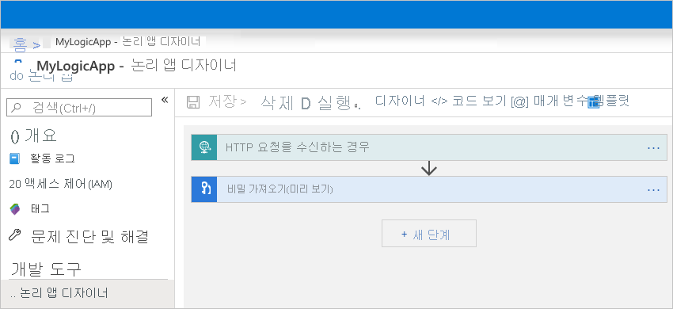
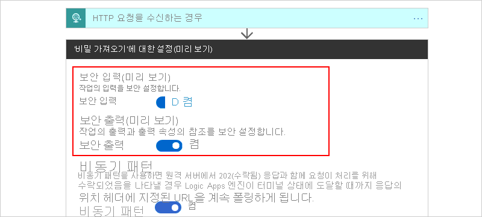
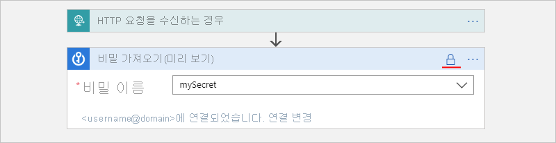
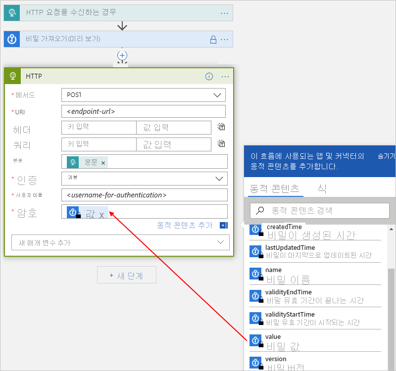
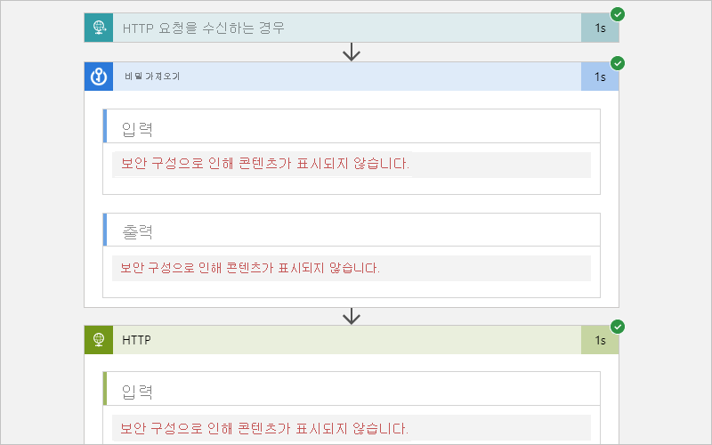
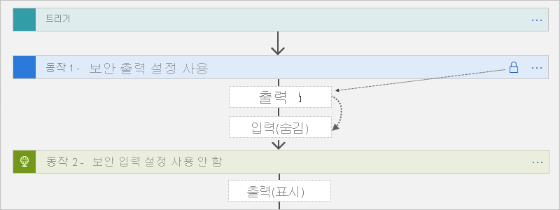
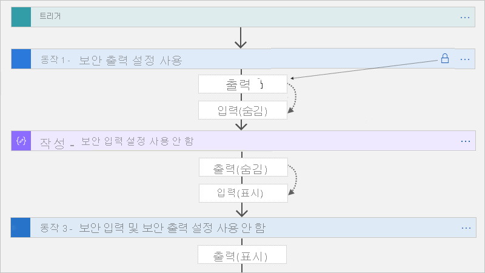
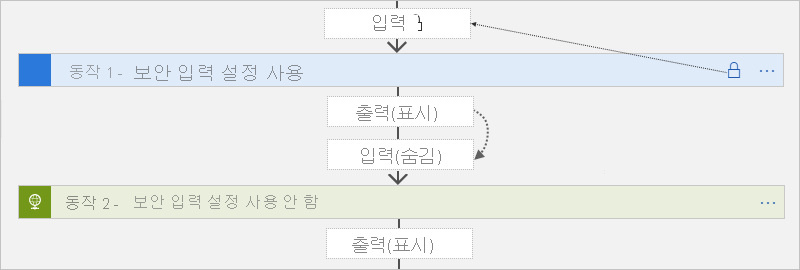
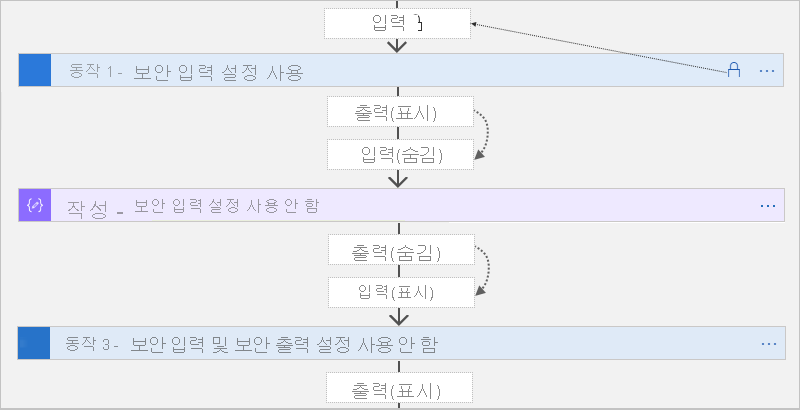

# <a name="secure-access-and-data-in-azure-logic-apps"></a>Azure Logic Apps에서 액세스 및 데이터 보호

Azure Logic Apps에서 중요 한 데이터 액세스 및 보호를 제어 하려면 다음 영역에 대 한 보안을 설정할 수 있습니다.

* [요청 기반 트리거에 대 한 액세스](#secure-triggers)
* [논리 앱 작업에 대 한 액세스](#secure-operations)
* [실행 기록 입력 및 출력에 대 한 액세스](#secure-run-history)
* [매개 변수 입력에 액세스](#secure-action-parameters)
* [논리 앱에서 호출 되는 서비스 및 시스템에 액세스](#secure-outbound-requests)

<a name="secure-triggers"></a>

## <a name="access-to-request-based-triggers"></a>요청 기반 트리거에 대 한 액세스

논리 앱에서 요청 기반 트리거를 사용 하 여 [요청](../connectors/connectors-native-reqres.md) 또는 [Webhook](../connectors/connectors-native-webhook.md) 트리거와 같은 들어오는 호출 또는 요청을 수신 하는 경우 권한 있는 클라이언트만 논리 앱을 호출할 수 있도록 액세스를 제한할 수 있습니다. 논리 앱에서 수신 하는 모든 요청은 TLS (전송 계층 보안)를 사용 하 여 암호화 되 고 보호 됩니다 (이전에는 SSL (SSL(Secure Sockets Layer)), 프로토콜).

이 트리거 형식에 대 한 액세스를 보호 하는 데 도움이 될 수 있는 옵션은 다음과 같습니다.

* [공유 액세스 서명 생성](#sas)
* [Azure Active Directory 오픈 인증 사용 (Azure AD OAuth)](#enable-oauth)
* [인바운드 IP 주소 제한](#restrict-inbound-ip-addresses)
* [Azure Active Directory 오픈 인증 (Azure AD OAuth) 또는 기타 보안 추가](#add-authentication)

<a name="sas"></a>

### <a name="generate-shared-access-signatures-sas"></a>SAS (공유 액세스 서명) 생성

논리 앱의 모든 요청 끝점에는 끝점의 URL에 [SAS (공유 액세스 서명)](https://docs.microsoft.com/rest/api/storageservices/constructing-a-service-sas) 가 있으며,이는 다음 형식을 따릅니다.

`https://<request-endpoint-URI>sp=<permissions>sv=<SAS-version>sig=<signature>`

각 URL에는 `sp` 다음 `sv` `sig` 표에 설명 된 대로, 및 쿼리 매개 변수가 포함 됩니다.

| 쿼리 매개 변수 | 설명 |
|-----------------|-------------|
| `sp` | 사용할 수 있는 HTTP 메서드에 대 한 사용 권한을 지정 합니다. |
| `sv` | 서명을 생성 하는 데 사용할 SAS 버전을 지정 합니다. |
| `sig` | 트리거에 대 한 액세스를 인증 하는 데 사용할 서명을 지정 합니다. 이 서명은 모든 URL 경로 및 속성에 대 한 암호 액세스 키와 함께 SHA256 알고리즘을 사용 하 여 생성 됩니다. 노출 되거나 게시 되지 않은 경우이 키는 암호화 된 상태로 유지 되 고 논리 앱에 저장 됩니다. 논리 앱은 암호 키로 만들어진 유효한 서명을 포함하는 트리거에 권한을 부여합니다. |
|||

SAS를 사용 하 여 액세스를 보호 하는 방법에 대 한 자세한 내용은이 항목의 다음 섹션을 참조 하십시오.

* [액세스 키 다시 생성](#access-keys)
* [만료 콜백 URL 만들기](#expiring-urls)
* [주 또는 보조 키를 사용하여 URL 만들기](#primary-secondary-key)

<a name="access-keys"></a>

#### <a name="regenerate-access-keys"></a>액세스 키 다시 생성

언제 든 지 새 보안 액세스 키를 생성 하려면 Azure REST API 또는 Azure Portal를 사용 합니다. 이전 키를 사용 하는 이전에 생성 된 모든 Url은 무효화 되 고 더 이상 논리 앱을 트리거할 수 있는 권한이 없습니다. 다시 생성 후에 검색 하는 Url은 새 액세스 키로 서명 됩니다.

1. [Azure Portal](https://portal.azure.com)에서 다시 생성 하려는 키를 포함 하는 논리 앱을 엽니다.

1. 논리 앱 메뉴의 **설정**에서 **액세스 키**를 선택합니다.

1. 다시 생성 하려는 키를 선택 하 고 프로세스를 완료 합니다.

<a name="expiring-urls"></a>

#### <a name="create-expiring-callback-urls"></a>만료 콜백 URL 만들기

다른 당사자와 요청 기반 트리거의 끝점 URL을 공유 하는 경우 특정 키를 사용 하 고 만료 날짜가 있는 콜백 Url을 생성할 수 있습니다. 이렇게 하면 키를 원활 하 게 롤링 하거나 특정 시간 범위에 따라 논리 앱을 트리거하는 액세스를 제한할 수 있습니다. URL의 만료 날짜를 지정 하려면 [Logic Apps REST API](https://docs.microsoft.com/rest/api/logic/workflowtriggers)를 사용 합니다. 예를 들면 다음과 같습니다.

```http
POST /subscriptions/<Azure-subscription-ID>/resourceGroups/<Azure-resource-group-name>/providers/Microsoft.Logic/workflows/<workflow-name>/triggers/<trigger-name>/listCallbackUrl?api-version=2016-06-01
```

본문에서 `NotAfter` JSON 날짜 문자열을 사용 하 여 속성을 포함 합니다. 이 속성은 `NotAfter` 날짜 및 시간까지만 유효한 콜백 URL을 반환합니다.

<a name="primary-secondary-key"></a>

#### <a name="create-urls-with-primary-or-secondary-secret-key"></a>기본 또는 보조 비밀 키로 URL 만들기

요청 기반 트리거에 대 한 콜백 Url을 생성 하거나 나열 하는 경우 URL에 서명 하는 데 사용할 키를 지정할 수 있습니다. 특정 키로 서명 된 URL을 생성 하려면 [Logic Apps REST API](https://docs.microsoft.com/rest/api/logic/workflowtriggers)를 사용 합니다. 예를 들면 다음과 같습니다.

```http
POST /subscriptions/<Azure-subscription-ID>/resourceGroups/<Azure-resource-group-name>/providers/Microsoft.Logic/workflows/<workflow-name>/triggers/<trigger-name>/listCallbackUrl?api-version=2016-06-01
```

본문에서는 속성 `KeyType`을 `Primary` 또는 `Secondary`로서 포함합니다. 이 속성은 지정 된 보안 키로 서명 된 URL을 반환 합니다.

<a name="enable-oauth"></a>

### <a name="enable-azure-active-directory-oauth"></a>Azure Active Directory OAuth 사용

논리 앱이 요청 트리거로 시작 하는 경우 요청 트리거에 대 한 인바운드 호출에 대 한 권한을 부여 하기 위해 [Azure Active Directory Open Authentication](../active-directory/develop/about-microsoft-identity-platform.md) (Azure AD OAuth)을 사용 하도록 설정할 수 있습니다. 이 인증을 사용 하도록 설정 하기 전에 다음 사항을 검토 하십시오.

* 논리 앱은 최대 권한 부여 정책 수로 제한 됩니다. 각 권한 부여 정책에는 최대 개수의 [클레임](../active-directory/develop/developer-glossary.md#claim)도 있습니다. 자세한 내용은 [Azure Logic Apps에 대 한 제한 및 구성](../logic-apps/logic-apps-limits-and-config.md#authentication-limits)을 참조 하세요.

* 권한 부여 정책에는 적어도 **Issuer** `https://sts.windows.net/` AZURE AD 발급자 ID로 시작 하는 값을 가진 발급자 클레임이 포함 되어야 합니다.

* 논리 앱에 대 한 인바운드 호출은 Azure AD OAuth 또는 [SAS (공유 액세스 서명)](#sas)중 하나의 권한 부여 체계를 사용할 수 있습니다.

* OAuth 토큰은 요청 트리거에 대해서만 지원 됩니다.

* OAuth 토큰에는 [전달자 유형](../active-directory/develop/active-directory-v2-protocols.md#tokens) 인증 스키마만 지원 됩니다.

Azure AD OAuth를 사용 하도록 설정 하려면 다음 단계를 수행 하 여 논리 앱에 하나 이상의 권한 부여 정책을 추가 합니다.

1. [Azure Portal](https://portal.microsoft.com)에서 논리 앱 디자이너에서 논리 앱을 찾아서 엽니다.

1. 논리 앱 메뉴의 **설정**에서 **권한 부여**를 선택 합니다. 권한 부여 창이 열리면 **정책 추가**를 선택 합니다.

   

1. 요청 트리거에 대 한 각 인바운드 호출로 제공 되는 인증 토큰에서 논리 앱에 필요한 [클레임 유형](../active-directory/develop/developer-glossary.md#claim) 및 값을 지정 하 여 권한 부여 정책에 대 한 정보를 제공 합니다.

   

   | 속성 | 필수 | 설명 |
   |----------|----------|-------------|
   | **정책 이름** | 예 | 권한 부여 정책에 사용 하려는 이름입니다. |
   | **클레임** | 예 | 논리 앱이 인바운드 호출을 허용 하는 클레임 유형 및 값입니다. 사용 가능한 클레임 유형은 다음과 같습니다. <p><p>- **발행** <br>- **그룹** <br>- **제목** <br>- **JWT id** (JSON Web Token id) <p><p>최소한 **클레임** 목록에는 Azure AD 발급자 ID로 시작 하는 값이 있는 **발급자** 클레임이 포함 되어야 합니다 `https://sts.windows.net/` . 이러한 클레임 유형에 대 한 자세한 내용은 [AZURE AD 보안 토큰의 클레임](../active-directory/azuread-dev/v1-authentication-scenarios.md#claims-in-azure-ad-security-tokens)을 참조 하세요. 사용자 고유의 클레임 유형 및 값을 지정할 수도 있습니다. |
   |||

1. 다른 클레임을 추가 하려면 다음 옵션 중에서 선택 합니다.

   * 다른 클레임 유형을 추가 하려면 **표준 클레임 추가**를 선택 하 고, 클레임 유형을 선택 하 고, 클레임 값을 지정 합니다.

   * 사용자 고유의 클레임을 추가 하려면 **사용자 지정 클레임 추가**를 선택 하 고 사용자 지정 클레임 값을 지정 합니다.

1. 다른 권한 부여 정책을 추가 하려면 **정책 추가**를 선택 합니다. 이전 단계를 반복 하 여 정책을 설정 합니다.

1. 완료되면 **저장**을 선택합니다.

이제 논리 앱은 인바운드 요청에 대 한 권한을 부여 하기 위해 Azure AD OAuth를 사용 하도록 설정 됩니다. 논리 앱이 인증 토큰을 포함 하는 인바운드 요청을 수신 하는 경우 Azure Logic Apps는 토큰의 클레임을 각 권한 부여 정책의 클레임과 비교 합니다. 토큰의 클레임과 하나 이상의 정책에 있는 모든 클레임 사이에 일치 하는 항목이 있으면 인바운드 요청에 대 한 권한 부여가 성공 합니다. 토큰은 권한 부여 정책에 지정 된 수보다 많은 클레임을 가질 수 있습니다.

예를 들어 논리 앱에 발급자와 대상 이라는 두 가지 클레임 유형이 필요한 권한 부여 정책이 있다고 가정 합니다. 이 샘플 디코딩된 [액세스 토큰](../active-directory/develop/access-tokens.md) 에는 다음과 같은 클레임 형식이 모두 포함 됩니다.

```json
{
   "aud": "https://management.core.windows.net/",
   "iss": "https://sts.windows.net/<Azure-AD-issuer-ID>/",
   "iat": 1582056988,
   "nbf": 1582056988,
   "exp": 1582060888,
   "_claim_names": {
      "groups": "src1"
   },
   "_claim_sources": {
      "src1": {
         "endpoint": "https://graph.windows.net/7200000-86f1-41af-91ab-2d7cd011db47/users/00000-f433-403e-b3aa-7d8406464625d7/getMemberObjects"
    }
   },
   "acr": "1",
   "aio": "AVQAq/8OAAAA7k1O1C2fRfeG604U9e6EzYcy52wb65Cx2OkaHIqDOkuyyr0IBa/YuaImaydaf/twVaeW/etbzzlKFNI4Q=",
   "amr": [
      "rsa",
      "mfa"
   ],
   "appid": "c44b4083-3bb0-00001-b47d-97400853cbdf3c",
   "appidacr": "2",
   "deviceid": "bfk817a1-3d981-4dddf82-8ade-2bddd2f5f8172ab",
   "family_name": "Sophia Owen",
   "given_name": "Sophia Owen (Fabrikam)",
   "ipaddr": "167.220.2.46",
   "name": "sophiaowen",
   "oid": "3d5053d9-f433-00000e-b3aa-7d84041625d7",
   "onprem_sid": "S-1-5-21-2497521184-1604012920-1887927527-21913475",
   "puid": "1003000000098FE48CE",
   "scp": "user_impersonation",
   "sub": "KGlhIodTx3XCVIWjJarRfJbsLX9JcdYYWDPkufGVij7_7k",
   "tid": "72f988bf-86f1-41af-91ab-2d7cd011db47",
   "unique_name": "SophiaOwen@fabrikam.com",
   "upn": "SophiaOwen@fabrikam.com",
   "uti": "TPJ7nNNMMZkOSx6_uVczUAA",
   "ver": "1.0"
}
```

<a name="restrict-inbound-ip"></a>

### <a name="restrict-inbound-ip-addresses"></a>인바운드 IP 주소 제한

SAS (공유 액세스 서명)와 함께 논리 앱을 호출할 수 있는 클라이언트를 구체적으로 제한할 수 있습니다. 예를 들어 Azure API Management를 사용 하 여 요청 끝점을 관리 하는 경우 API Management 인스턴스의 IP 주소 에서만 요청을 수락 하도록 논리 앱을 제한할 수 있습니다.

#### <a name="restrict-inbound-ip-ranges-in-azure-portal"></a>Azure Portal에서 인바운드 IP 범위 제한

1. [Azure Portal](https://portal.azure.com)에서 논리 앱 디자이너에서 논리 앱을 엽니다.

1. 논리 앱의 메뉴에 있는 **설정** 아래에서 **워크플로 설정**을 선택합니다.

1. **액세스 제어 구성**  >  **허용 인바운드 IP 주소**에서 **특정 ip 범위**를 선택 합니다.

1. **트리거에 대한 IP 범위**에서 트리거가 허용하는 IP 주소 범위를 지정합니다.

   올바른 IP 범위는 *x.x.x.x/x* 또는 *x.x.x.x-x.x.x.x* 형식을 사용합니다.

논리 앱이 중첩 된 논리 앱 으로만 트리거하도록 하려면 **허용 된 인바운드 IP 주소** 목록에서 **다른 Logic Apps만**선택 합니다. 이 옵션은 논리 앱 리소스에 빈 배열을 씁니다. 이렇게 하면 Logic Apps 서비스 (부모 논리 앱)의 호출만 중첩 된 논리 앱을 트리거할 수 있습니다.

> [!NOTE]
> IP 주소에 관계 없이 Azure REST API 또는 API Management를 통해 `/triggers/<trigger-name>/run`을 사용하여 요청 기반 트리거가 있는 논리 앱을 계속 실행할 수 있습니다. 그러나이 시나리오에서는 여전히 Azure REST API에 대 한 [인증이](../active-directory/develop/authentication-scenarios.md) 필요 합니다. 모든 이벤트는 Azure 감사 로그에 표시 됩니다. 액세스 제어 정책을 적절 하 게 설정 해야 합니다.

#### <a name="restrict-inbound-ip-ranges-in-azure-resource-manager-template"></a>Azure Resource Manager 템플릿에서 인바운드 IP 범위 제한

[리소스 관리자 템플릿을 사용 하 여 논리 앱에 대 한 배포를 자동화](../logic-apps/logic-apps-azure-resource-manager-templates-overview.md)하는 경우 섹션을 사용 *x.x.x.x/x* 하 고 *x.x.x.x-x.x.x.x* `accessControl` `triggers` 논리 앱의 리소스 정의에 및 섹션을 포함 하 여 x. x. x. x. x. x. x 형식으로 IP 범위를 지정할 수 있습니다. `actions` 예를 들면 다음과 같습니다.

```json
{
   "$schema": "https://schema.management.azure.com/schemas/2015-01-01/deploymentTemplate.json#",
   "contentVersion": "1.0.0.0",
   "parameters": {},
   "variables": {},
   "resources": [
      {
         "name": "[parameters('LogicAppName')]",
         "type": "Microsoft.Logic/workflows",
         "location": "[parameters('LogicAppLocation')]",
         "tags": {
            "displayName": "LogicApp"
         },
         "apiVersion": "2016-06-01",
         "properties": {
            "definition": {
               <workflow-definition>
            },
            "parameters": {
            },
            "accessControl": {
               "triggers": {
                  "allowedCallerIpAddresses": [
                     {
                        "addressRange": "192.168.12.0/23"
                     }
                  ]
               },
               "actions": {
                  "allowedCallerIpAddresses:" : []
               }
            },
            "endpointsConfiguration": {}
         }
      }
   ],
   "outputs": {}
}
```

<a name="add-authentication"></a>

### <a name="add-azure-active-directory-open-authentication-or-other-security"></a>Azure Active Directory 오픈 인증 또는 기타 보안 추가

논리 앱에 더 많은 [인증](../active-directory/develop/authentication-scenarios.md) 프로토콜을 추가 하려면 [Azure API Management](../api-management/api-management-key-concepts.md) 서비스를 사용 하는 것이 좋습니다. 이 서비스를 사용 하면 논리 앱을 API로 노출 하 고 모든 끝점에 대 한 다양 한 모니터링, 보안, 정책 및 설명서를 제공할 수 있습니다. API Management는 논리 앱에 대 한 공용 또는 개인 끝점을 노출할 수 있습니다. 이 끝점에 대 한 액세스 권한을 부여 하려면 해당 끝점에 대 한 액세스 권한을 부여 하기 위해 [Azure Active Directory Open Authentication](#azure-active-directory-oauth-authentication) (Azure AD OAuth), [클라이언트 인증서](#client-certificate-authentication)또는 기타 보안 표준을 사용할 수 있습니다. API Management는 요청을 받으면 논리 앱에 요청을 보내고 필요한 변환 또는 제한을 수행합니다. 논리 앱만 API Management 트리거할 수 있도록 논리 앱의 인바운드 IP 범위 설정을 사용할 수 있습니다.

<a name="secure-operations"></a>

## <a name="access-to-logic-app-operations"></a>논리 앱 작업에 대 한 액세스

특정 사용자나 그룹만 논리 앱 관리, 편집 및 보기와 같은 특정 작업을 실행 하도록 허용할 수 있습니다. 해당 권한을 제어 하려면 azure 구독의 구성원에 사용자 지정 또는 기본 제공 역할을 할당할 수 있도록 [AZURE RBAC (역할 기반 Access Control)](../role-based-access-control/role-assignments-portal.md) 를 사용 합니다.

* [논리 앱 참가자](../role-based-access-control/built-in-roles.md#logic-app-contributor): 논리 앱을 관리할 수 있지만 해당 앱에 대 한 액세스를 변경할 수는 없습니다.

* [논리 앱 운영자](../role-based-access-control/built-in-roles.md#logic-app-operator): 논리 앱을 읽고 사용 하거나 사용 하지 않도록 설정할 수 있지만 편집 하거나 업데이트할 수는 없습니다.

다른 사람이 논리 앱을 변경하거나 삭제하지 못하게 하려면 [Azure 리소스 잠금](../azure-resource-manager/management/lock-resources.md)을 사용할 수 있습니다. 이 기능을 통해 다른 사용자가 프로덕션 리소스를 변경 하거나 삭제할 수 없습니다.

<a name="secure-run-history"></a>

## <a name="access-to-run-history-data"></a>실행 기록 데이터에 대 한 액세스

논리 앱을 실행 하는 동안 TLS (Transport Layer Security) 및 [rest](../security/fundamentals/encryption-atrest.md)를 사용 하 여 전송 하는 동안 모든 데이터가 [암호화](../security/fundamentals/encryption-overview.md#encryption-of-data-in-transit) 됩니다. 논리 앱의 실행이 완료 되 면 각 동작에 대 한 상태, 기간, 입력 및 출력과 함께 실행 된 단계를 포함 하 여 해당 실행에 대 한 기록을 볼 수 있습니다. 이 풍부한 정보는 논리 앱이 실행 되는 방법 및 발생 하는 문제 해결을 시작할 수 있는 위치에 대 한 통찰력을 제공 합니다.

논리 앱의 실행 기록을 볼 때 Logic Apps는 액세스를 인증 한 다음 각 실행에 대 한 요청 및 응답의 입력 및 출력에 대 한 링크를 제공 합니다. 그러나 암호, 비밀, 키 또는 기타 중요 한 정보를 처리 하는 작업의 경우 다른 사용자가 해당 데이터를 보고 액세스 하지 못하도록 하는 것이 좋습니다. 예를 들어 논리 앱이 HTTP 작업을 인증할 때 사용할 [Azure Key Vault](../key-vault/general/overview.md) 에서 비밀을 가져오는 경우 해당 비밀을 뷰에서 숨깁니다.

논리 앱의 실행 기록에서 입력 및 출력에 대 한 액세스를 제어 하기 위해 다음 옵션을 사용할 수 있습니다.

* [IP 주소 범위를 기준으로 액세스를 제한](#restrict-ip)합니다.

  이 옵션은 특정 IP 주소 범위의 요청을 기반으로 실행 기록에 대 한 액세스를 보호 하는 데 도움이 됩니다.

* [난독 처리를 사용 하 여 실행 기록의 데이터를 보호](#obfuscate)합니다.

  많은 트리거와 작업에서 논리 앱의 실행 기록에서 입력, 출력 또는 둘 다의 보안을 유지할 수 있습니다.

<a name="restrict-ip"></a>

### <a name="restrict-access-by-ip-address-range"></a>IP 주소 범위를 통한 액세스 제한

특정 IP 주소 범위의 요청만 해당 데이터를 볼 수 있도록 논리 앱의 실행 기록에서 입력 및 출력에 대 한 액세스를 제한할 수 있습니다. 예를 들어 모든 사용자가 입력 및 출력에 액세스 하는 것을 차단 하려면 IP 주소 범위 (예:)를 지정 `0.0.0.0-0.0.0.0` 합니다. 관리자 권한이 있는 사용자만 논리 앱의 데이터에 "just-in-time" 액세스를 제공 하는이 제한을 제거할 수 있습니다. 논리 앱 배포에 사용 하는 Azure Resource Manager 템플릿 또는 Azure Portal를 사용 하 여 제한할 IP 범위를 지정할 수 있습니다.

#### <a name="restrict-ip-ranges-in-azure-portal"></a>Azure Portal에서 IP 범위 제한

1. Azure Portal의 Logic Apps 디자이너에서 논리 앱을 엽니다.

1. 논리 앱의 메뉴에 있는 **설정** 아래에서 **워크플로 설정**을 선택합니다.

1. **액세스 제어 구성**  >  **허용 인바운드 IP 주소**에서 **특정 ip 범위**를 선택 합니다.

1. **콘텐츠의 IP 범위**에서 입력 및 출력의 콘텐츠에 액세스할 수 있는 IP 주소 범위를 지정합니다. 

   올바른 IP 범위는 *x.x.x.x/x* 또는 *x.x.x.x-x.x.x.x* 형식을 사용합니다.

#### <a name="restrict-ip-ranges-in-azure-resource-manager-template"></a>Azure Resource Manager 템플릿에서 IP 범위 제한

[리소스 관리자 템플릿을 사용 하 여 논리 앱에 대 한 배포를 자동화](../logic-apps/logic-apps-azure-resource-manager-templates-overview.md)하는 경우 `accessControl` 논리 앱의 리소스 정의에서 섹션과 섹션을 사용 하 여 IP 범위를 지정할 수 있습니다 `contents` . 예를 들면 다음과 같습니다.

``` json
{
   "$schema": "https://schema.management.azure.com/schemas/2015-01-01/deploymentTemplate.json#",
   "contentVersion": "1.0.0.0",
   "parameters": {},
   "variables": {},
   "resources": [
      {
         "name": "[parameters('LogicAppName')]",
         "type": "Microsoft.Logic/workflows",
         "location": "[parameters('LogicAppLocation')]",
         "tags": {
            "displayName": "LogicApp"
         },
         "apiVersion": "2016-06-01",
         "properties": {
            "definition": {<workflow-definition>},
            "parameters": {},
            "accessControl": {
               "contents": {
                  "allowedCallerIpAddresses": [
                     {
                        "addressRange": "192.168.12.0/23"
                     },
                     {
                        "addressRange": "2001:0db8::/64"
                     }
                  ]
               }
            }
         }
      }
   ],
   "outputs": {}
}
```

<a name="obfuscate"></a>

### <a name="secure-data-in-run-history-by-using-obfuscation"></a>난독 처리를 사용 하 여 실행 기록의 데이터 보호

많은 트리거와 작업에는 논리 앱의 실행 기록에서 입력, 출력 또는 둘 다를 보호 하기 위한 설정이 있습니다. 이러한 설정을 사용 하 여이 데이터의 보안을 유지 하기 전에 [다음 사항을 검토](#obfuscation-considerations)하십시오.

#### <a name="secure-inputs-and-outputs-in-the-designer"></a>디자이너에서 입력 및 출력 보안

1. [Azure Portal](https://portal.azure.com)에서 논리 앱 디자이너에서 논리 앱을 엽니다.

   

1. 중요 한 데이터를 보호 하려는 트리거 또는 작업에서 줄임표 (**...**) 단추를 선택한 다음 **설정**을 선택 합니다.

   

1. **보안 입력**, **보안 출력**또는 둘 다를 설정 합니다. 완료되면 **완료**를 선택합니다.

   

   이제 작업 또는 트리거가 제목 표시줄에 잠금 아이콘을 표시 합니다.

   

   이전 작업의 보안 출력을 나타내는 토큰에도 잠금 아이콘이 표시 됩니다. 예를 들어 동적 콘텐츠 목록에서 작업에 사용할 출력을 선택 하면 해당 토큰에 잠금 아이콘이 표시 됩니다.

   

1. 논리 앱을 실행 한 후에는 해당 실행에 대 한 기록을 볼 수 있습니다.

   1. 논리 앱의 **개요** 창에서 보려는 실행을 선택 합니다.

   1. **논리 앱 실행** 창에서 검토 하려는 작업을 확장 합니다.

      입력과 출력을 모두 모호 하 게 선택한 경우 이러한 값은 이제 숨김 상태로 표시 됩니다.

      

<a name="secure-data-code-view"></a>

#### <a name="secure-inputs-and-outputs-in-code-view"></a>코드 보기에서 입력 및 출력 보안

기본 트리거 또는 작업 정의에서 `runtimeConfiguration.secureData.properties` 다음 값 중 하나 또는 모두를 사용 하 여 배열을 추가 하거나 업데이트 합니다.

* `"inputs"`: 실행 기록의 입력을 보호 합니다.
* `"outputs"`: 실행 기록의 출력을 보호 합니다.

이러한 설정을 사용 하 여이 데이터의 보안을 유지 하는 경우 고려해 야 할 몇 가지 [고려 사항은](#obfuscation-considerations) 다음과 같습니다.

```json
"<trigger-or-action-name>": {
   "type": "<trigger-or-action-type>",
   "inputs": {
      <trigger-or-action-inputs>
   },
   "runtimeConfiguration": {
      "secureData": {
         "properties": [
            "inputs",
            "outputs"
         ]
      }
   },
   <other-attributes>
}
```

<a name="obfuscation-considerations"></a>

#### <a name="considerations-when-securing-inputs-and-outputs"></a>입력 및 출력을 보호할 때의 고려 사항

* 트리거 또는 작업에서 입력 또는 출력을 숨기는 경우 Logic Apps는 보안 데이터를 Azure Log Analytics에 보내지 않습니다. 또한 모니터링에 대해 [추적 된 속성](../logic-apps/monitor-logic-apps-log-analytics.md#extend-data) 을 해당 트리거나 작업에 추가할 수 없습니다.

* [워크플로 기록을 처리 하는 LOGIC APPS API](https://docs.microsoft.com/rest/api/logic/) 는 보안 출력을 반환 하지 않습니다.

* 입력을 사용 하거나 명시적으로 출력 하는 작업의 출력을 보호 하려면 해당 작업에서 수동으로 **보안 출력** 을 설정 합니다.

* 실행 기록이 해당 데이터를 모호 하 게 만들 수 있는 다운스트림 작업에서 **보안 입력** 또는 **보안 출력** 을 설정 해야 합니다.

  **보안 출력 설정**

  트리거 또는 작업에서 수동으로 **보안 출력** 을 설정 하는 경우 실행 기록에서 이러한 출력을 Logic Apps 숨깁니다. 다운스트림 작업에서 이러한 보안 출력을 입력으로 명시적으로 사용 하는 경우 Logic Apps 실행 기록에서이 작업의 입력을 숨기 지만 작업의 **보안 입력** 설정을 *사용 하도록 설정 하지는 않습니다* .

  

  작성, 구문 분석 JSON 및 응답 작업에는 **보안 입력** 설정만 있습니다. 설정 하면이 작업의 출력도 숨겨집니다. 이러한 작업에서 업스트림 보안 출력을 입력으로 명시적으로 사용 하는 경우 Logic Apps 이러한 작업의 입력 및 출력을 숨길 수 있지만 이러한 작업의 **보안 입력** 설정은 *사용 하지 않습니다* . 다운스트림 작업에서 작성, 구문 분석 JSON 또는 응답 작업의 숨겨진 출력을 입력으로 명시적으로 사용 하는 경우 *이 다운스트림 작업의 입력 또는 출력을 숨기지*Logic Apps.

  

  **보안 입력 설정**

  트리거 또는 작업에서 수동으로 **보안 입력** 을 설정 하는 경우 실행 기록에서 이러한 입력을 숨길 Logic Apps. 다운스트림 작업에서 해당 트리거나 작업에서 표시 되는 출력을 입력으로 명시적으로 사용 하는 경우, Logic Apps 실행 기록에서이 다운스트림 작업의 입력을 숨길 수 있지만이 작업에서 **보안 입력** 을 *사용 하도록 설정 하지* 않고이 작업의 출력을 숨기지 않습니다.

  

  작성, 구문 분석 JSON 및 응답 작업에서 보안 된 Logic Apps 입력이 있는 트리거나 작업의 표시 되는 출력을 명시적으로 사용 하는 경우 이러한 작업의 입력 및 출력을 숨길 수 있지만 이러한 작업의 **보안 입력** 설정을 *사용 하지 않습니다* . 다운스트림 작업에서 작성, 구문 분석 JSON 또는 응답 작업의 숨겨진 출력을 입력으로 명시적으로 사용 하는 경우 *이 다운스트림 작업의 입력 또는 출력을 숨기지*Logic Apps.

  

<a name="secure-action-parameters"></a>

## <a name="access-to-parameter-inputs"></a>매개 변수 입력에 액세스

여러 환경에 걸쳐 배포 하는 경우 해당 환경에 따라 달라 지는 워크플로 정의의 값을 매개 변수화 하는 것이 좋습니다. 이렇게 하면 [Azure Resource Manager 템플릿을](../azure-resource-manager/templates/overview.md) 사용 하 여 논리 앱을 배포 하 고, 보안 매개 변수를 정의 하 여 중요 한 데이터를 보호 하 고, [매개 변수 파일](../azure-resource-manager/templates/parameter-files.md)을 사용 하 여 [템플릿의 매개 변수](../azure-resource-manager/templates/template-parameters.md) 를 통해 해당 데이터를 별도의 입력으로 전달 하 여 하드 코드 된 데이터를 방지할 수 있습니다.

예를 들어 [Azure Active Directory 오픈 인증](#azure-active-directory-oauth-authentication) (Azure AD OAuth)을 사용 하 여 HTTP 작업을 인증 하는 경우 인증에 사용 되는 클라이언트 ID 및 클라이언트 암호를 허용 하는 매개 변수를 정의 하 고 모호 해질 수 있습니다. 논리 앱에서 이러한 매개 변수를 정의 하려면 `parameters` 논리 앱의 워크플로 정의에서 섹션을 사용 하 고 배포용 리소스 관리자 템플릿을 사용 합니다. 논리 앱을 편집 하거나 실행 기록을 볼 때 표시 하지 않으려는 매개 변수 값을 안전 하 게 보호 하려면 또는 형식을 사용 하 여 매개 변수를 정의 하 `securestring` `secureobject` 고 필요에 따라 인코딩을 사용 합니다. 이 형식의 매개 변수는 리소스 정의와 함께 반환 되지 않으며 배포 후 리소스를 볼 때 액세스할 수 없습니다. 런타임 중에 이러한 매개 변수 값에 액세스 하려면 `@parameters('<parameter-name>')` 워크플로 정의 내에서 식을 사용 합니다. 이 식은 런타임에만 계산 되며 [워크플로 정의 언어](../logic-apps/logic-apps-workflow-definition-language.md)에 의해 설명 됩니다.

> [!NOTE]
> 요청 헤더 또는 본문에서 매개 변수를 사용 하는 경우 논리 앱의 실행 기록과 나가는 HTTP 요청을 볼 때 해당 매개 변수가 표시 될 수 있습니다. 또한 콘텐츠 액세스 정책도 적절 하 게 설정 해야 합니다. [난독 처리](#obfuscate) 를 사용 하 여 실행 기록에서 입력 및 출력을 숨길 수도 있습니다. 권한 부여 헤더는 입력 또는 출력을 통해 볼 수 없습니다. 따라서 권한 부여 헤더에 비밀이 사용되면 해당 비밀을 검색할 수 없습니다.

자세한 내용은이 항목의 다음 섹션을 참조 하십시오.

* [워크플로 정의의 보안 매개 변수](#secure-parameters-workflow)
* [난독 처리를 사용 하 여 실행 기록의 데이터 보호](#obfuscate)

[리소스 관리자 템플릿을 사용 하 여 논리 앱에 대 한 배포를 자동화](../logic-apps/logic-apps-azure-resource-manager-templates-overview.md)하는 경우 및 유형을 사용 하 여 배포 시 평가 되는 보안 [템플릿 매개 변수](../azure-resource-manager/templates/template-parameters.md)를 정의할 수 있습니다 `securestring` `secureobject` . 템플릿 매개 변수를 정의 하려면 템플릿의 최상위 `parameters` 섹션을 사용 합니다 .이 섹션은 별도 이며 워크플로 정의 `parameters` 섹션과 다릅니다. 템플릿 매개 변수에 대 한 값을 제공 하려면 별도의 [매개 변수 파일](../azure-resource-manager/templates/parameter-files.md)을 사용 합니다.

예를 들어, 비밀을 사용 하는 경우 배포 시 [Azure Key Vault](../key-vault/general/overview.md) 에서 해당 비밀을 검색 하는 보안 템플릿 매개 변수를 정의 하 고 사용할 수 있습니다. 그런 다음 매개 변수 파일에서 키 자격 증명 모음 및 암호를 참조할 수 있습니다. 자세한 내용은 다음 항목을 참조하세요.

* [Azure Key Vault를 사용 하 여 배포 시 중요 한 값 전달](../azure-resource-manager/templates/key-vault-parameter.md)
* 이 항목의 뒷부분에 [Azure Resource Manager 템플릿의 보안 매개 변수](#secure-parameters-deployment-template)

<a name="secure-parameters-workflow"></a>

### <a name="secure-parameters-in-workflow-definitions"></a>워크플로 정의의 보안 매개 변수

논리 앱의 워크플로 정의에서 중요 한 정보를 보호 하려면 논리 앱을 저장 한 후이 정보가 표시 되지 않도록 보안 매개 변수를 사용 합니다. 예를 들어, HTTP 작업에는 사용자 이름 및 암호를 사용 하는 기본 인증이 필요 하다 고 가정 합니다. 워크플로 정의에서 `parameters` 섹션은 `basicAuthPasswordParam` `basicAuthUsernameParam` 형식을 사용 하 여 및 매개 변수를 정의 합니다 `securestring` . 그런 다음 작업 정의가 섹션에서 이러한 매개 변수를 참조 합니다 `authentication` .

```json
"definition": {
   "$schema": "https://schema.management.azure.com/providers/Microsoft.Logic/schemas/2016-06-01/workflowdefinition.json#",
   "actions": {
      "HTTP": {
         "type": "Http",
         "inputs": {
            "method": "GET",
            "uri": "https://www.microsoft.com",
            "authentication": {
               "type": "Basic",
               "username": "@parameters('basicAuthUsernameParam')",
               "password": "@parameters('basicAuthPasswordParam')"
            }
         },
         "runAfter": {}
      }
   },
   "parameters": {
      "basicAuthPasswordParam": {
         "type": "securestring"
      },
      "basicAuthUsernameParam": {
         "type": "securestring"
      }
   },
   "triggers": {
      "manual": {
         "type": "Request",
         "kind": "Http",
         "inputs": {
            "schema": {}
         }
      }
   },
   "contentVersion": "1.0.0.0",
   "outputs": {}
}
```

<a name="secure-parameters-deployment-template"></a>

### <a name="secure-parameters-in-azure-resource-manager-templates"></a>Azure Resource Manager 템플릿의 보안 매개 변수

논리 앱에 대 한 [리소스 관리자 템플릿에](../logic-apps/logic-apps-azure-resource-manager-templates-overview.md) 는 여러 `parameters` 섹션이 있습니다. 암호, 키, 암호 및 기타 중요 한 정보를 보호 하려면 또는 형식을 사용 하 여 템플릿 수준 및 워크플로 정의 수준에서 보안 매개 변수를 정의 `securestring` `secureobject` 합니다. 그런 다음 [Azure Key Vault](../key-vault/general/overview.md) 에 이러한 값을 저장 하 고 [매개 변수 파일](../azure-resource-manager/templates/parameter-files.md) 을 사용 하 여 키 자격 증명 모음 및 암호를 참조할 수 있습니다. 그런 다음 템플릿에서 해당 정보를 검색 합니다. 자세한 내용은 [Azure Key Vault를 사용 하 여 배포 시 중요 한 값 전달](../azure-resource-manager/templates/key-vault-parameter.md)을 참조 하세요.

이러한 섹션에 대 한 자세한 내용은 `parameters` 다음과 같습니다.

* 템플릿의 최상위 수준에서 `parameters` 섹션은 *배포*시 템플릿이 사용 하는 값에 대 한 매개 변수를 정의 합니다. 예를 들어 이러한 값에는 특정 배포 환경에 대 한 연결 문자열이 포함 될 수 있습니다. 그런 다음이 값을 별도의 [매개 변수 파일](../azure-resource-manager/templates/parameter-files.md)에 저장 하면 이러한 값을 보다 쉽게 변경할 수 있습니다.

* 논리 앱의 리소스 정의 내에서 워크플로 정의 외부에 있는 `parameters` 섹션은 워크플로 정의의 매개 변수에 대 한 값을 지정 합니다. 이 섹션에서는 템플릿 매개 변수를 참조 하는 템플릿 식을 사용 하 여 이러한 값을 할당할 수 있습니다. 이러한 식은 배포 시 평가 됩니다.

* 워크플로 정의 내에서 섹션은 `parameters` 런타임에 논리 앱이 사용 하는 매개 변수를 정의 합니다. 그런 다음 런타임에 평가 되는 워크플로 정의 식을 사용 하 여 논리 앱의 워크플로 내에서 이러한 매개 변수를 참조할 수 있습니다.

이 예제 템플릿에는 형식을 사용 하는 여러 보안 매개 변수 정의가 포함 되어 `securestring` 있습니다.

| 매개 변수 이름 | Description |
|----------------|-------------|
| `TemplatePasswordParam` | 워크플로 정의의 매개 변수에 전달 되는 암호를 수락 하는 템플릿 매개 변수입니다. `basicAuthPasswordParam` |
| `TemplateUsernameParam` | 워크플로 정의의 매개 변수에 전달 되는 사용자 이름을 허용 하는 템플릿 매개 변수입니다. `basicAuthUserNameParam` |
| `basicAuthPasswordParam` | HTTP 작업의 기본 인증에 대 한 암호를 허용 하는 워크플로 정의 매개 변수 |
| `basicAuthUserNameParam` | HTTP 작업의 기본 인증에 대 한 사용자 이름을 허용 하는 워크플로 정의 매개 변수 |
|||

```json
{
   "$schema": "https://schema.management.azure.com/schemas/2015-01-01/deploymentTemplate.json#",
   "contentVersion": "1.0.0.0",
   "parameters": {
      "LogicAppName": {
         "type": "string",
         "minLength": 1,
         "maxLength": 80,
         "metadata": {
            "description": "Name of the Logic App."
         }
      },
      "TemplatePasswordParam": {
         "type": "securestring"
      },
      "TemplateUsernameParam": {
         "type": "securestring"
      },
      "LogicAppLocation": {
         "type": "string",
         "defaultValue": "[resourceGroup().location]",
         "allowedValues": [
            "[resourceGroup().location]",
            "eastasia",
            "southeastasia",
            "centralus",
            "eastus",
            "eastus2",
            "westus",
            "northcentralus",
            "southcentralus",
            "northeurope",
            "westeurope",
            "japanwest",
            "japaneast",
            "brazilsouth",
            "australiaeast",
            "australiasoutheast",
            "southindia",
            "centralindia",
            "westindia",
            "canadacentral",
            "canadaeast",
            "uksouth",
            "ukwest",
            "westcentralus",
            "westus2"
         ],
         "metadata": {
            "description": "Location of the Logic App."
         }
      }
   },
   "variables": {},
   "resources": [
      {
         "name": "[parameters('LogicAppName')]",
         "type": "Microsoft.Logic/workflows",
         "location": "[parameters('LogicAppLocation')]",
         "tags": {
            "displayName": "LogicApp"
         },
         "apiVersion": "2016-06-01",
         "properties": {
            "definition": {
               "$schema": "https://schema.management.azure.com/providers/Microsoft.Logic/schemas/2016-0601/workflowdefinition.json#",
               "actions": {
                  "HTTP": {
                     "type": "Http",
                     "inputs": {
                        "method": "GET",
                        "uri": "https://www.microsoft.com",
                        "authentication": {
                           "type": "Basic",
                           "username": "@parameters('basicAuthUsernameParam')",
                           "password": "@parameters('basicAuthPasswordParam')"
                        }
                     },
                  "runAfter": {}
                  }
               },
               "parameters": {
                  "basicAuthPasswordParam": {
                     "type": "securestring"
                  },
                  "basicAuthUsernameParam": {
                     "type": "securestring"
                  }
               },
               "triggers": {
                  "manual": {
                     "type": "Request",
                     "kind": "Http",
                     "inputs": {
                        "schema": {}
                     }
                  }
               },
               "contentVersion": "1.0.0.0",
               "outputs": {}
            },
            "parameters": {
               "basicAuthPasswordParam": {
                  "value": "[parameters('TemplatePasswordParam')]"
               },
               "basicAuthUsernameParam": {
                  "value": "[parameters('TemplateUsernameParam')]"
               }
            }
         }
      }
   ],
   "outputs": {}
}
```

<a name="secure-outbound-requests"></a>

## <a name="access-to-services-and-systems-called-from-logic-apps"></a>논리 앱에서 호출 되는 서비스 및 시스템에 액세스

논리 앱에서 호출 또는 요청을 수신 하는 끝점을 보호 하는 데 도움이 되는 몇 가지 방법은 다음과 같습니다.

* 아웃 바운드 요청에 인증을 추가 합니다.

  Http, HTTP + Swagger 또는 Webhook와 같은 아웃 바운드 호출을 수행 하는 HTTP 기반 트리거 또는 작업을 사용 하 여 작업 하는 경우 논리 앱에서 보낸 요청에 인증을 추가할 수 있습니다. 예를 들어 다음 인증 유형을 선택할 수 있습니다.

  * [기본 인증](#basic-authentication)

  * [클라이언트 인증서 인증](#client-certificate-authentication)

  * [Active Directory OAuth 인증](#azure-active-directory-oauth-authentication)

  * [관리 ID 인증](#managed-identity-authentication)
  
  자세한 내용은이 항목의 뒷부분에 있는 [아웃 바운드 호출에 인증 추가](#add-authentication-outbound) 를 참조 하세요.

* 논리 앱 IP 주소에서 액세스를 제한 합니다.

  논리 앱의 끝점에 대 한 모든 호출은 논리 앱의 영역을 기반으로 하는 지정 된 특정 IP 주소에서 시작 됩니다. 이러한 IP 주소의 요청만 수락하는 필터링을 추가할 수 있습니다. 이러한 IP 주소를 가져오려면 [Azure Logic Apps에 대 한 제한 및 구성](logic-apps-limits-and-config.md#configuration)을 참조 하세요.

* 온-프레미스 시스템에 대 한 연결 보안 강화

  Azure Logic Apps는 보다 안전 하 고 신뢰할 수 있는 온-프레미스 통신을 제공 하기 위해 이러한 서비스와의 통합을 제공 합니다.

  * 온-프레미스 데이터 게이트웨이

    Azure Logic Apps의 많은 관리 커넥터는 파일 시스템, SQL, SharePoint, DB2 등의 온-프레미스 시스템에 대 한 보안 연결을 용이 하 게 합니다. 게이트웨이는 Azure Service Bus를 통해 암호화된 채널에서 온-프레미스 원본의 데이터를 보냅니다. 모든 트래픽은 게이트웨이 에이전트에서 보호 되는 아웃 바운드 트래픽으로 발생 합니다. [온-프레미스 데이터 게이트웨이 작동 방식](logic-apps-gateway-install.md#gateway-cloud-service)을 알아보세요.

  * Azure API Management을 통해 연결

    [Azure API Management](../api-management/api-management-key-concepts.md)는 보안 프록시를 위한 사이트 간 가상 사설망 및 ExpressRoute 통합과 온-프레미스 시스템에 대한 통신 등의 온-프레미스 연결 옵션을 제공합니다. 논리 앱 디자이너의 논리 앱 워크플로에서 온-프레미스 시스템에 빠르게 액세스할 수 있는 API Management에 의해 노출 되는 API를 선택할 수 있습니다.

<a name="add-authentication-outbound"></a>

## <a name="add-authentication-to-outbound-calls"></a>아웃 바운드 호출에 인증 추가

HTTP 및 HTTPS 끝점은 다양 한 종류의 인증을 지원 합니다. 이러한 끝점에 액세스 하는 아웃 바운드 호출 또는 요청을 만드는 데 사용 하는 트리거 또는 작업에 따라 다양 한 인증 유형 범위에서 선택할 수 있습니다. 논리 앱이 처리 하는 중요 한 정보의 보안을 유지 하기 위해 필요에 따라 보안 매개 변수를 사용 하 고 데이터를 인코딩합니다. 매개 변수 사용 및 보안에 대 한 자세한 내용은 [매개 변수 입력에 액세스](#secure-action-parameters)를 참조 하세요.

> [!NOTE]
> 논리 앱 디자이너에서 인증 유형을 지정할 수 있는 일부 트리거와 작업에서 **authentication** 속성을 숨길 수 있습니다. 이러한 경우 속성이 표시 되도록 하려면 트리거 또는 작업에서 **새 매개 변수 추가** 목록을 열고 **인증**을 선택 합니다. 자세한 내용은 [관리 되는 id를 사용 하 여 액세스 인증](../logic-apps/create-managed-service-identity.md#authenticate-access-with-identity)을 참조 하세요.

| 인증 유형 | 지원 요소 |
|---------------------|--------------|
| [기본](#basic-authentication) | Azure API Management, Azure 앱 Services, HTTP, HTTP + Swagger, HTTP Webhook |
| [클라이언트 인증서](#client-certificate-authentication) | Azure API Management, Azure 앱 Services, HTTP, HTTP + Swagger, HTTP Webhook |
| [Active Directory OAuth](#azure-active-directory-oauth-authentication) | Azure API Management, Azure 앱 Services, Azure Functions, HTTP, HTTP + Swagger, HTTP Webhook |
| [미처리](#raw-authentication) | Azure API Management, Azure 앱 Services, Azure Functions, HTTP, HTTP + Swagger, HTTP Webhook |
| [관리 id](#managed-identity-authentication) | Azure API Management, Azure 앱 Services, Azure Functions, HTTP, HTTP + Swagger, HTTP Webhook |
|||

<a name="basic-authentication"></a>

### <a name="basic-authentication"></a>기본 인증

[기본](../active-directory-b2c/secure-rest-api.md) 옵션을 사용할 수 있는 경우 다음과 같은 속성 값을 지정 합니다.

| 속성 (디자이너) | Property(JSON) | 필수 | Value | 설명 |
|---------------------|-----------------|----------|-------|-------------|
| **인증** | `type` | 예 | 기본 | 사용할 인증 유형입니다. |
| **사용자 이름** | `username` | 예 | <*사용자 이름*>| 대상 서비스 엔드포인트에 대한 액세스를 인증하는 사용자 이름입니다. |
| **암호** | `password` | 예 | <*암호*> | 대상 서비스 엔드포인트에 대한 액세스를 인증하는 암호입니다. |
||||||

[보안 매개 변수](#secure-action-parameters) 를 사용 하 여 [배포 자동화를 위한 Azure Resource Manager 템플릿](../logic-apps/logic-apps-azure-resource-manager-templates-overview.md)등의 중요 한 정보를 처리 하 고 보안을 유지 하는 경우 식을 사용 하 여 런타임에 이러한 매개 변수 값에 액세스할 수 있습니다. 이 예제 HTTP 동작 정의는로 인증을 지정 하 `type` `Basic` 고 [parameters () 함수](../logic-apps/workflow-definition-language-functions-reference.md#parameters) 를 사용 하 여 매개 변수 값을 가져옵니다.

```json
"HTTP": {
   "type": "Http",
   "inputs": {
      "method": "GET",
      "uri": "@parameters('endpointUrlParam')",
      "authentication": {
         "type": "Basic",
         "username": "@parameters('userNameParam')",
         "password": "@parameters('passwordParam')"
      }
  },
  "runAfter": {}
}
```

<a name="client-certificate-authentication"></a>

### <a name="client-certificate-authentication"></a>클라이언트 인증서 인증

[클라이언트 인증서](../active-directory/authentication/active-directory-certificate-based-authentication-get-started.md) 옵션을 사용할 수 있는 경우 다음과 같은 속성 값을 지정 합니다.

| 속성 (디자이너) | Property(JSON) | 필수 | Value | 설명 |
|---------------------|-----------------|----------|-------|-------------|
| **인증** | `type` | 예 | **클라이언트 인증서** <br>또는 <br>`ClientCertificate` | TLS/SSL 클라이언트 인증서에 사용할 인증 유형입니다. <p><p>**참고**: 자체 서명 된 인증서는 지원 되지만 TLS/SSL에 대 한 자체 서명 된 인증서는 지원 되지 않습니다. HTTP 커넥터는 중간 TLS/SSL 인증서를 지원 하지 않습니다. |
| **Pfx** | `pfx` | 예 | <*인코드된 .pfx-파일-콘텐츠*> | PFX(개인 정보 교환) 파일의 base64로 인코딩된 콘텐츠 <p><p>PFX 파일을 b a s e 64로 인코딩된 형식으로 변환 하려면 다음 단계를 수행 하 여 PowerShell을 사용할 수 있습니다. <p>1. 인증서 콘텐츠를 변수에 저장 합니다. <p>   `$pfx_cert = get-content 'c:\certificate.pfx' -Encoding Byte` <p>2. 함수를 사용 하 여 인증서 콘텐츠를 변환 하 `ToBase64String()` 고 해당 콘텐츠를 텍스트 파일에 저장 합니다. <p>   `[System.Convert]::ToBase64String($pfx_cert) | Out-File 'pfx-encoded-bytes.txt'` |
| **암호** | `password`| 아니요 | <*암호-pfx-파일*> | PFX 파일에 액세스하기 위한 암호 |
|||||

[보안 매개 변수](#secure-action-parameters) 를 사용 하 여 [배포 자동화를 위한 Azure Resource Manager 템플릿](../logic-apps/logic-apps-azure-resource-manager-templates-overview.md)등의 중요 한 정보를 처리 하 고 보안을 유지 하는 경우 식을 사용 하 여 런타임에 이러한 매개 변수 값에 액세스할 수 있습니다. 이 예제 HTTP 동작 정의는로 인증을 지정 하 `type` `ClientCertificate` 고 [parameters () 함수](../logic-apps/workflow-definition-language-functions-reference.md#parameters) 를 사용 하 여 매개 변수 값을 가져옵니다.

```json
"HTTP": {
   "type": "Http",
   "inputs": {
      "method": "GET",
      "uri": "@parameters('endpointUrlParam')",
      "authentication": {
         "type": "ClientCertificate",
         "pfx": "@parameters('pfxParam')",
         "password": "@parameters('passwordParam')"
      }
   },
   "runAfter": {}
}
```

클라이언트 인증서 인증을 사용 하 여 서비스를 보호 하는 방법에 대 한 자세한 내용은 다음 항목을 참조 하세요.

* [Azure에서 클라이언트 인증서 인증을 사용 하 여 Api에 대 한 보안 향상 API Management](../api-management/api-management-howto-mutual-certificates-for-clients.md)
* [Azure에서 클라이언트 인증서 인증을 사용 하 여 백 엔드 서비스에 대 한 보안 향상 API Management](../api-management/api-management-howto-mutual-certificates.md)
* [클라이언트 인증서를 사용 하 여 RESTfuL 서비스에 대 한 보안 향상](../active-directory-b2c/secure-rest-api.md)
* [애플리케이션 인증을 위한 인증서 자격 증명](../active-directory/develop/active-directory-certificate-credentials.md)
* [Azure App Service의 코드에서 TLS/SSL 인증서 사용](../app-service/configure-ssl-certificate-in-code.md)

<a name="azure-active-directory-oauth-authentication"></a>

### <a name="azure-active-directory-open-authentication"></a>Azure Active Directory 오픈 인증

요청 트리거에서 논리 앱에 대 한 [AZURE ad 권한 부여 정책을 설정한](#enable-oauth) 후에 들어오는 호출을 인증 하는 데 [Azure Active Directory Open AUTHENTICATION](../active-directory/develop/about-microsoft-identity-platform.md) (azure ad OAuth)을 사용할 수 있습니다. 선택할 수 있는 **Active Directory OAuth** 인증 유형을 제공 하는 다른 모든 트리거 및 작업의 경우 다음과 같은 속성 값을 지정 합니다.

| 속성 (디자이너) | Property(JSON) | 필수 | Value | 설명 |
|---------------------|-----------------|----------|-------|-------------|
| **인증** | `type` | 예 | **Active Directory OAuth** <br>또는 <br>`ActiveDirectoryOAuth` | 사용할 인증 유형입니다. Logic Apps 현재 [OAuth 2.0 프로토콜](../active-directory/develop/v2-overview.md)을 따릅니다. |
| **Authority** | `authority` | 아니요 | <*URL-토큰-발급자*> | 인증 토큰을 제공 하는 인증 기관에 대 한 URL입니다. 이 값은 기본적으로 `https://login.windows.net`입니다. |
| **테넌트** | `tenant` | 예 | <*테 넌 트-ID*> | Azure AD 테넌트의 테넌트 ID |
| **그룹** | `audience` | 예 | <*리소스 권한 부여*> | 권한 부여에 사용할 리소스(예: `https://management.core.windows.net/`) |
| **클라이언트 ID** | `clientId` | 예 | <*클라이언트 ID*> | 권한 부여를 요청하는 앱에 대한 클라이언트 ID |
| **자격 증명 유형** | `credentialType` | 예 | 인증서 <br>또는 <br>비밀 | 클라이언트에서 권한 부여를 요청 하는 데 사용 하는 자격 증명 형식입니다. 이 속성 및 값은 논리 앱의 기본 정의에 표시 되지 않지만 선택한 자격 증명 유형에 대해 표시 되는 속성을 결정 합니다. |
| **비밀** | `secret` | 예, 하지만 "비밀" 자격 증명 형식에만 해당 | <*클라이언트-비밀*> | 권한 부여를 요청하는 클라이언트 비밀 |
| **Pfx** | `pfx` | 예, 하지만 "인증서" 자격 증명 형식에만 해당 | <*인코드된 .pfx-파일-콘텐츠*> | PFX(개인 정보 교환) 파일의 base64로 인코딩된 콘텐츠 |
| **암호** | `password` | 예, 하지만 "인증서" 자격 증명 형식에만 해당 | <*암호-pfx-파일*> | PFX 파일에 액세스하기 위한 암호 |
|||||

[보안 매개 변수](#secure-action-parameters) 를 사용 하 여 [배포 자동화를 위한 Azure Resource Manager 템플릿](../logic-apps/logic-apps-azure-resource-manager-templates-overview.md)등의 중요 한 정보를 처리 하 고 보안을 유지 하는 경우 식을 사용 하 여 런타임에 이러한 매개 변수 값에 액세스할 수 있습니다. 이 예제 HTTP 동작 정의에서는 인증을로 지정 하 `type` `ActiveDirectoryOAuth` 고, 자격 증명 형식을로 지정 하 `Secret` 고 [parameters () 함수](../logic-apps/workflow-definition-language-functions-reference.md#parameters) 를 사용 하 여 매개 변수 값을 가져옵니다.

```json
"HTTP": {
   "type": "Http",
   "inputs": {
      "method": "GET",
      "uri": "@parameters('endpointUrlParam')",
      "authentication": {
         "type": "ActiveDirectoryOAuth",
         "tenant": "@parameters('tenantIdParam')",
         "audience": "https://management.core.windows.net/",
         "clientId": "@parameters('clientIdParam')",
         "credentialType": "Secret",
         "secret": "@parameters('secretParam')"
     }
   },
   "runAfter": {}
}
```

<a name="raw-authentication"></a>

### <a name="raw-authentication"></a>원시 인증

**Raw** 옵션을 사용할 수 있는 경우 [OAuth 2.0 프로토콜](https://oauth.net/2/)을 따르지 않는 [인증 체계](https://iana.org/assignments/http-authschemes/http-authschemes.xhtml) 를 사용 해야 하는 경우이 인증 유형을 사용할 수 있습니다. 이 형식을 사용 하 여 나가는 요청과 함께 보내는 인증 헤더 값을 수동으로 만들고 트리거 또는 작업에서 해당 헤더 값을 지정 합니다.

예를 들어 [OAuth 1.0 프로토콜](https://tools.ietf.org/html/rfc5849)을 따르는 HTTPS 요청에 대 한 샘플 헤더는 다음과 같습니다.

```text
Authorization: OAuth realm="Photos",
   oauth_consumer_key="dpf43f3p2l4k3l03",
   oauth_signature_method="HMAC-SHA1",
   oauth_timestamp="137131200",
   oauth_nonce="wIjqoS",
   oauth_callback="http%3A%2F%2Fprinter.example.com%2Fready",
   oauth_signature="74KNZJeDHnMBp0EMJ9ZHt%2FXKycU%3D"
```

원시 인증을 지 원하는 트리거 또는 작업에서 다음 속성 값을 지정 합니다.

| 속성 (디자이너) | Property(JSON) | 필수 | Value | 설명 |
|---------------------|-----------------|----------|-------|-------------|
| **인증** | `type` | 예 | Raw | 사용할 인증 유형입니다. |
| **값** | `value` | 예 | <*권한 부여 헤더-값*> | 인증에 사용할 인증 헤더 값입니다. |
||||||

[보안 매개 변수](#secure-action-parameters) 를 사용 하 여 [배포 자동화를 위한 Azure Resource Manager 템플릿](../logic-apps/logic-apps-azure-resource-manager-templates-overview.md)등의 중요 한 정보를 처리 하 고 보안을 유지 하는 경우 식을 사용 하 여 런타임에 이러한 매개 변수 값에 액세스할 수 있습니다. 이 예제 HTTP 동작 정의는 인증을 `type` 로 지정 하 `Raw` 고 [parameters () 함수](../logic-apps/workflow-definition-language-functions-reference.md#parameters) 를 사용 하 여 매개 변수 값을 가져옵니다.

```json
"HTTP": {
   "type": "Http",
   "inputs": {
      "method": "GET",
      "uri": "@parameters('endpointUrlParam')",
      "authentication": {
         "type": "Raw",
         "value": "@parameters('authHeaderParam')"
      }
   },
   "runAfter": {}
}
```

<a name="managed-identity-authentication"></a>

### <a name="managed-identity-authentication"></a>관리 ID 인증

[관리 id](../active-directory/managed-identities-azure-resources/overview.md) 옵션을 사용할 수 있는 경우 논리 앱은 로그인 하지 않고 다른 Azure Active Directory (Azure AD) 테 넌 트의 리소스에 대 한 액세스를 인증 하기 위해 시스템이 할당 한 id 또는 수동으로 만들어진 *단일* 사용자 할당 id를 사용할 수 있습니다. Azure는 사용자를 위해이 id를 관리 하 고 암호를 제공 하거나 회전할 필요가 없기 때문에 자격 증명을 보호 하는 데 도움이 됩니다. [AZURE AD 인증에 대 한 관리 되는 id를 지 원하는 azure 서비스](../active-directory/managed-identities-azure-resources/services-support-managed-identities.md#azure-services-that-support-azure-ad-authentication)에 대해 자세히 알아보세요.

1. 논리 앱이 관리 되는 id를 사용 하기 전에 [Azure Logic Apps에서 관리 되는 id를 사용 하 여 Azure 리소스에 대 한 액세스 인증](../logic-apps/create-managed-service-identity.md)의 단계를 따르세요. 이러한 단계는 논리 앱에서 관리 id를 사용 하도록 설정 하 고 대상 Azure 리소스에 대 한 id의 액세스를 설정 합니다.

1. Azure 함수에서 관리 id를 사용 하려면 먼저 [azure 함수에 대해 인증을 사용 하도록 설정](../logic-apps/logic-apps-azure-functions.md#enable-authentication-for-azure-functions)합니다.

1. 관리 id를 사용 하려는 트리거 또는 작업에서 다음 속성 값을 지정 합니다.

   | 속성 (디자이너) | Property(JSON) | 필수 | Value | 설명 |
   |---------------------|-----------------|----------|-------|-------------|
   | **인증** | `type` | 예 | **관리 ID** <br>또는 <br>`ManagedServiceIdentity` | 사용할 인증 유형입니다. |
   | **관리 ID** | `identity` | 예 | * **시스템 할당 관리 Id** <br>또는 <br>`SystemAssigned` <p><p>* <*사용자에 게 할당 된 id 이름*> | 사용할 관리 되는 id입니다. |
   | **그룹** | `audience` | 예 | <*대상-리소스 ID*> | 액세스 하려는 대상 리소스의 리소스 ID입니다. <p>예를 들어는 `https://storage.azure.com/` 모든 저장소 계정에 대해 인증에 대 한 [액세스 토큰](../active-directory/develop/access-tokens.md) 을 사용할 수 있습니다. 그러나 `https://fabrikamstorageaccount.blob.core.windows.net` 특정 저장소 계정에 대 한 루트 서비스 URL을 지정할 수도 있습니다. <p>**참고**: 일부 트리거 또는 작업에서 **대상** 속성을 숨길 수 있습니다. 이 속성을 표시 하려면 트리거 또는 작업에서 **새 매개 변수 추가** 목록을 열고 **대상 그룹**을 선택 합니다. <p><p>**중요**:이 대상 리소스 ID가 필요한 후행 슬래시를 포함 하 여 Azure AD에 필요한 값과 *정확 하 게 일치* 하는지 확인 합니다. 따라서 `https://storage.azure.com/` 모든 Azure Blob Storage 계정에 대 한 리소스 ID는 후행 슬래시가 필요 합니다. 그러나 특정 저장소 계정에 대 한 리소스 ID는 후행 슬래시가 필요 하지 않습니다. 이러한 리소스 Id를 찾으려면 [AZURE AD를 지 원하는 azure 서비스](../active-directory/managed-identities-azure-resources/services-support-managed-identities.md#azure-services-that-support-azure-ad-authentication)를 참조 하세요. |
   |||||

   [보안 매개 변수](#secure-action-parameters) 를 사용 하 여 [배포 자동화를 위한 Azure Resource Manager 템플릿](../logic-apps/logic-apps-azure-resource-manager-templates-overview.md)등의 중요 한 정보를 처리 하 고 보안을 유지 하는 경우 식을 사용 하 여 런타임에 이러한 매개 변수 값에 액세스할 수 있습니다. 이 예제 HTTP 동작 정의는로 인증을 지정 하 `type` `ManagedServiceIdentity` 고 [parameters () 함수](../logic-apps/workflow-definition-language-functions-reference.md#parameters) 를 사용 하 여 매개 변수 값을 가져옵니다.

   ```json
   "HTTP": {
      "type": "Http",
      "inputs": {
         "method": "GET",
         "uri": "@parameters('endpointUrlParam')",
         "authentication": {
            "type": "ManagedServiceIdentity",
            "identity": "SystemAssigned",
            "audience": "https://management.azure.com/"
         },
      },
      "runAfter": {}
   }
   ```

## <a name="next-steps"></a>다음 단계

* [Azure Logic Apps에 대 한 배포 자동화](../logic-apps/logic-apps-azure-resource-manager-templates-overview.md)  
* [논리 앱 모니터링](../logic-apps/monitor-logic-apps-log-analytics.md)  
* [논리 앱 오류 및 문제 진단](../logic-apps/logic-apps-diagnosing-failures.md)  
* [논리 앱 배포 자동화](../logic-apps/logic-apps-azure-resource-manager-templates-overview.md)
