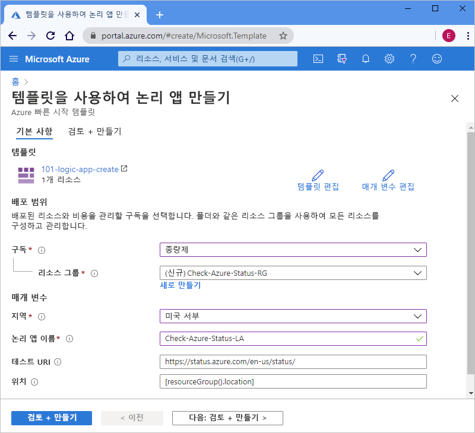

# <a name="quickstart-create-and-deploy-a-logic-app-workflow-by-using-an-arm-template"></a>빠른 시작: ARM 템플릿을 사용하여 논리 앱 워크플로 만들기 및 배포

[Azure Logic Apps](../logic-apps/logic-apps-overview.md)는 [수백 개의 커넥터](/connectors/connector-reference/connector-reference-logicapps-connectors) 중에서 선택하여 데이터, 앱, 클라우드 기반 서비스 및 온-프레미스 시스템을 통합하는 자동화된 워크플로를 만들고 실행하는 데 도움이 되는 클라우드 서비스입니다. 이 빠른 시작에서는 ARM 템플릿(Azure Resource Manager 템플릿)을 배포하여 시간별 일정에 따라 Azure의 상태를 확인하는 기본 논리 앱을 만드는 프로세스에 중점을 둡니다. 

[!INCLUDE [About Azure Resource Manager](../../includes/resource-manager-quickstart-introduction.md)]

환경이 필수 구성 요소를 충족하고 ARM 템플릿 사용에 익숙한 경우 **Azure에 배포** 단추를 선택합니다. 그러면 Azure Portal에서 템플릿이 열립니다.

[](https://portal.azure.com/#create/Microsoft.Template/uri/https%3a%2f%2fraw.githubusercontent.com%2fAzure%2fazure-quickstart-templates%2fmaster%2f101-logic-app-create%2fazuredeploy.json)

## <a name="prerequisites"></a>필수 구성 요소

Azure 구독이 아직 없는 경우 시작하기 전에 [Azure 체험 계정을 만듭니다](https://azure.microsoft.com/free/?WT.mc_id=A261C142F).

## <a name="review-the-template"></a>템플릿 검토

이 빠른 시작에서는 [**논리 앱 만들기**](https://azure.microsoft.com/resources/templates/101-logic-app-create/) 템플릿을 사용합니다. 이 템플릿은 [Azure 빠른 시작 템플릿 갤러리](https://azure.microsoft.com/resources/templates)에서 찾을 수 있지만, 너무 길므로 여기서는 표시할 수 없습니다. 대신 템플릿 갤러리에서 빠른 시작 템플릿의 ["azuredeploy.json 파일"](https://github.com/Azure/azure-quickstart-templates/blob/master/101-logic-app-create/azuredeploy.json)을 검토할 수 있습니다.

빠른 시작 템플릿은 1시간마다 실행되도록 설정된 되풀이 트리거 및 Azure에 대한 상태를 반환하는 URL을 호출하는 HTTP [*기본 제공* 작업](../connectors/apis-list.md#connector-types)을 사용하는 논리 앱 워크플로를 만듭니다. 기본 제공 작업은 Azure Logic Apps 플랫폼의 기본 작업입니다.

이 템플릿에서 만드는 Azure 리소스는 다음과 같습니다.

* [**Microsoft.Logic/workflows**](/azure/templates/microsoft.logic/workflows) - 논리 앱에 대한 워크플로를 만듭니다.

Azure Logic Apps용 빠른 시작 템플릿을 추가로 찾으려면 갤러리에서 [Microsoft.Logic](https://azure.microsoft.com/resources/templates/?resourceType=Microsoft.Logic) 템플릿을 검토하세요.

<a name="deploy-template"></a>

## <a name="deploy-the-template"></a>템플릿 배포

빠른 시작 템플릿을 배포하는 데 사용하려는 옵션을 따릅니다.

| 옵션 | Description |
|--------|-------------|
| [Azure Portal](../logic-apps/quickstart-create-deploy-azure-resource-manager-template.md?tabs=azure-portal#deploy-template) | Azure 환경에서 필수 구성 요소를 충족하고 ARM 템플릿 사용에 익숙한 경우 다음 단계를 통해 Azure에 직접 로그인하여 Azure Portal에서 빠른 시작 템플릿을 열 수 있습니다. 자세한 내용은 [ARM 템플릿 및 Azure Portal을 사용하여 리소스 배포](../azure-resource-manager/templates/deploy-portal.md)를 참조하세요. |
| [Azure CLI](../logic-apps/quickstart-create-deploy-azure-resource-manager-template.md?tabs=azure-cli#deploy-template) | Azure CLI(Azure 명령줄 인터페이스)는 Azure 리소스를 만들고 관리하는 명령 세트입니다. 이러한 명령을 실행하려면 Azure CLI 버전 2.6 이상이 필요합니다. CLI 버전을 확인하려면 `az --version`을 입력합니다. 자세한 내용은 다음 항목을 참조하세요. <p><p>- [Azure CLI란?](/cli/azure/what-is-azure-cli?view=azure-cli-latest) <br>- [Azure CLI 시작](/cli/azure/get-started-with-azure-cli?view=azure-cli-latest) |
| [Azure PowerShell](../logic-apps/quickstart-create-deploy-azure-resource-manager-template.md?tabs=azure-powershell#deploy-template) | Azure PowerShell은 Azure Resource Manager 모델을 사용하여 Azure 리소스를 관리하는 cmdlet 세트를 제공합니다. 자세한 내용은 다음 항목을 참조하세요. <p><p>- [Azure PowerShell 개요](/powershell/azure/azurerm/overview) <br>- [Azure PowerShell Az 모듈 소개](/powershell/azure/new-azureps-module-az) <br>- [Azure PowerShell 시작](/powershell/azure/get-started-azureps) |
| [Azure 리소스 관리 REST API](../logic-apps/quickstart-create-deploy-azure-resource-manager-template.md?tabs=rest-api#deploy-template) | Azure는 서비스 리소스에 대한 액세스를 만들거나, 검색하거나, 업데이트하거나 삭제하는 데 사용하는 HTTP 작업(메서드)을 지원하는 서비스 엔드포인트인 REST(Representational State Transfer) API를 제공합니다. 자세한 내용은 [Azure REST API 시작](/rest/api/azure/)을 참조하세요. |
|||

<a name="deploy-azure-portal"></a>

#### <a name="portal"></a>[포털](#tab/azure-portal)

1. 다음 이미지를 선택하여 Azure 계정으로 로그인하고, Azure Portal에서 빠른 시작 템플릿을 엽니다.

   [](https://portal.azure.com/#create/Microsoft.Template/uri/https%3a%2f%2fraw.githubusercontent.com%2fAzure%2fazure-quickstart-templates%2fmaster%2f101-logic-app-create%2fazuredeploy.json)

1. 포털의 **템플릿을 사용하여 논리 앱 만들기** 페이지에서 다음 값을 입력하거나 선택합니다.

   | 속성 | 값 | Description |
   |----------|-------|-------------|
   | **구독** | <*Azure-subscription-name*> | 사용할 Azure 구독의 이름입니다. |
   | **리소스 그룹** | <*Azure-resource-group-name*> | 신규 또는 기존 Azure 리소스 그룹의 이름입니다. 이 예에서는 `Check-Azure-Status-RG`를 사용합니다. |
   | **지역** | <*Azure-region*> | 논리 앱을 사용하는 Azure 데이터 센터 지역입니다. 이 예에서는 `West US`를 사용합니다. |
   | **논리 앱 이름** | <*logic-app-name*> | 논리 앱에 사용할 이름입니다. 이 예에서는 `Check-Azure-Status-LA`를 사용합니다. |
   | **테스트 URI** | <*test-URI*> | 특정 일정에 따라 호출할 서비스의 URI입니다. 이 예에서는 Azure 상태 페이지인 `https://status.azure.com/en-us/status/`를 사용합니다. |
   | **위치** |  <*Azure-region-for-all-resources*> | 기본값과 다른 경우 모든 리소스에 사용할 Azure 지역입니다. 이 예에서는 리소스 그룹 위치인 `[resourceGroup().location]`(기본값)을 사용합니다. |
   ||||

   이 예에서 사용된 값을 사용하여 페이지를 찾는 방법은 다음과 같습니다.

   

1. 완료되면 **검토 + 만들기**를 선택합니다.

1. [배포된 리소스 검토](#review-deployed-resources)의 단계를 계속 진행합니다.

#### <a name="cli"></a>[CLI](#tab/azure-cli)

```azurecli-interactive
read -p "Enter a project name name to use for generating resource names:" projectName &&
read -p "Enter the location, such as 'westus':" location &&
templateUri="https://raw.githubusercontent.com/Azure/azure-quickstart-templates/master/101-logic-app-create/azuredeploy.json" &&
resourceGroupName="${projectName}rg" &&
az group create --name $resourceGroupName --location "$location" &&
az deployment group create --resource-group $resourceGroupName --template-uri  $templateUri &&
echo "Press [ENTER] to continue ..." &&
read
```

자세한 내용은 다음 항목을 참조하세요.

* [Azure CLI: az deployment group](/cli/azure/deployment/group)
* [ARM 템플릿 및 Azure CLI를 사용하여 리소스 배포](../azure-resource-manager/templates/deploy-cli.md)

#### <a name="powershell"></a>[PowerShell](#tab/azure-powershell)

```azurepowershell-interactive
$projectName = Read-Host -Prompt "Enter a project name to use for generating resource names"
$location = Read-Host -Prompt "Enter the location, such as 'westus'"
$templateUri = "https://raw.githubusercontent.com/Azure/azure-quickstart-templates/master/101-logic-app-create/azuredeploy.json"

$resourceGroupName = "${projectName}rg"

New-AzResourceGroup -Name $resourceGroupName -Location "$location"
New-AzResourceGroupDeployment -ResourceGroupName $resourceGroupName -TemplateUri $templateUri

Read-Host -Prompt "Press [ENTER] to continue ..."
```

자세한 내용은 다음 항목을 참조하세요.

* [Azure PowerShell: New-AzResourceGroup](/powershell/module/az.resources/new-azresourcegroup)
* [Azure PowerShell: New-AzResourceGroupDeployment](/powershell/module/az.resources/new-azresourcegroupdeployment)
* [ARM 템플릿 및 Azure PowerShell을 사용하여 리소스 배포](../azure-resource-manager/templates/deploy-powershell.md)

#### <a name="rest-api"></a>[REST API](#tab/rest-api)

1. 기존 Azure 리소스 그룹을 사용하지 않으려면 리소스 관리 REST API에 보내는 요청에 대한 다음 구문을 수행하여 새 리소스 그룹을 만듭니다.

   ```http
   PUT https://management.azure.com/subscriptions/{subscriptionId}/resourcegroups/{resourceGroupName}?api-version=2019-10-01
   ```

   | 값 | Description |
   |-------|-------------|
   | `subscriptionId`| 사용하려는 Azure 구독의 GUID입니다. |
   | `resourceGroupName` | 만들 Azure 리소스 그룹의 이름입니다. 이 예에서는 `Check-Azure-Status-RG`를 사용합니다. |
   |||

   예를 들면 다음과 같습니다.

   ```http
   PUT https://management.azure.com/subscriptions/xxxxXXXXxxxxXXXXX/resourcegroups/Check-Azure-Status-RG?api-version=2019-10-01
   ```

   자세한 내용은 다음 항목을 참조하세요.

   * [Azure REST API 참조 - Azure REST API를 호출하는 방법](/rest/api/azure/)
   * [리소스 관리 REST API: 리소스 그룹 - 만들기 또는 업데이트](/rest/api/resources/resourcegroups/createorupdate)

1. 빠른 시작 템플릿을 리소스 그룹에 배포하려면 리소스 관리 REST API에 보내는 요청에 대한 다음 구문을 수행합니다.

   ```http
   PUT https://management.azure.com/subscriptions/{subscriptionId}/resourcegroups/{resourceGroupName}/providers/Microsoft.Resources/deployments/{deploymentName}?api-version=2019-10-01
   ```

   | 값 | Description |
   |-------|-------------|
   | `subscriptionId`| 사용하려는 Azure 구독의 GUID입니다. |
   | `resourceGroupName` | 사용할 Azure 리소스 그룹의 이름입니다. 이 예에서는 `Check-Azure-Status-RG`를 사용합니다. |
   | `deploymentName` | 배포에 사용할 이름입니다. 이 예에서는 `Check-Azure-Status-LA`를 사용합니다. |
   |||

   예를 들면 다음과 같습니다.

   ```http
   PUT https://management.azure.com/subscriptions/xxxxXXXXxxxxXXXXX/resourcegroups/Check-Azure-Status-RG/providers/Microsoft.Resources/deployments/Check-Azure-Status-LA?api-version=2019-10-01
   ```

   자세한 내용은 [리소스 관리 REST API: 배포 - 만들기 또는 업데이트](/rest/api/resources/deployments/createorupdate)를 참조하세요.

1. 배포에 사용할 값(예: Azure 지역), 빠른 시작 템플릿에 대한 링크 및 배포에 사용할 빠른 시작 템플릿의 값이 포함된 [매개 변수 파일](../azure-resource-manager/templates/template-parameters.md)에 대한 링크를 제공하려면 리소스 관리 REST API에 보내는 요청 본문에 대한 다음 구문을 수행합니다.

   ```json
   {
      "location": "{Azure-region}",
      "properties": {
         "templateLink": {
            "uri": "{quickstart-template-URL}",
            "contentVersion": "1.0.0.0"
         },
         "parametersLink": {
            "uri": "{quickstart-template-parameter-file-URL}",
            "contentVersion": "1.0.0.0"
         },
         "mode": "Incremental"
      }
   }
   ```

   | 속성 | 값 | Description |
   |----------|-------|-------------|
   | `location`| <*Azure-region*> | 배포에 사용할 Azure 지역입니다. 이 예에서는 `West US`를 사용합니다. |
   | `templateLink` : `uri` | <*quickstart-template-URL*> | 배포에 사용할 빠른 시작 템플릿에 대한 URL 위치입니다. <p><p>`https://raw.githubusercontent.com/Azure/azure-quickstart-templates/master/101-logic-app-create/azuredeploy.json`입니다. |
   | `parametersLink` : `uri` | <*quickstart-template-parameter-file-URL*> | 배포에 사용할 빠른 시작 템플릿의 매개 변수 파일에 대한 URL 위치입니다. <p><p>`https://raw.githubusercontent.com/Azure/azure-quickstart-templates/master/101-logic-app-create/azuredeploy.parameters.json` <p><p>Resource Manager 매개 변수 파일에 대한 자세한 내용은 다음 항목을 참조하세요. <p><p>- [Resource Manager 매개 변수 파일 만들기](../azure-resource-manager/templates/parameter-files.md) <br>- [자습서: 매개 변수 파일을 사용하여 ARM 템플릿 배포](../azure-resource-manager/templates/template-tutorial-use-parameter-file.md) |
   | `mode` | <*deployment-mode*> | 증분 업데이트 또는 전체 업데이트를 실행합니다. 이 예에서는 `Incremental`(기본값)을 사용합니다. 자세한 내용은 [Azure Resource Manager 배포 모드](../azure-resource-manager/templates/deployment-modes.md)를 참조하세요. |
   |||

   예를 들면 다음과 같습니다.

   ```json
   {
      "location": "West US",
      "properties": {
         "templateLink": {
            "uri": "https://raw.githubusercontent.com/Azure/azure-quickstart-templates/master/101-logic-app-create/azuredeploy.json",
            "contentVersion": "1.0.0.0"
         },
         "parametersLink": {
            "uri": "https://raw.githubusercontent.com/Azure/azure-quickstart-templates/master/101-logic-app-create/azuredeploy.parameters.json",
            "contentVersion": "1.0.0.0"
         },
         "mode": "Incremental"
      }
   }
   ```

자세한 내용은 다음 항목을 참조하세요.

* [리소스 관리 REST API](/rest/api/resources/)
* [ARM 템플릿 및 Resource Manager REST API를 사용하여 리소스 배포](../azure-resource-manager/templates/deploy-rest.md)

---

<a name="review-deployed-resources"></a>

## <a name="review-deployed-resources"></a>배포된 리소스 검토

논리 앱을 보려면 Azure Portal을 사용하거나, Azure CLI 또는 Azure PowerShell을 사용하여 만든 스크립트를 실행하거나, Logic App REST API를 사용할 수 있습니다.

### <a name="portal"></a>[포털](#tab/azure-portal)

1. Azure Portal 검색 상자에서 논리 앱의 이름(이 예에서는 `Check-Azure-Status-LA`)을 입력합니다. 결과 목록에서 논리 앱을 선택합니다.

1. Azure Portal에서 논리 앱(이 예에서는 `Check-Azure-Status-RG`)을 찾아서 선택합니다.

1. Logic Apps 디자이너가 열리면 빠른 시작 템플릿에서 만든 논리 앱을 검토합니다.

1. 논리 앱을 테스트하려면 디자이너 도구 모음에서 **실행**을 선택합니다.

### <a name="cli"></a>[CLI](#tab/azure-cli)

```azurecli-interactive
echo "Enter your logic app name:" &&
read logicAppName &&
az logic workflow show --name $logicAppName &&
echo "Press [ENTER] to continue ..."
```

자세한 내용은 [Azure CLI: az logic workflow show](/cli/azure/ext/logic/logic/workflow?view=azure-cli-latest#ext-logic-az-logic-workflow-show)를 참조하세요.

### <a name="powershell"></a>[PowerShell](#tab/azure-powershell)

```azurepowershell-interactive
$logicAppName = Read-Host -Prompt "Enter your logic app name"
Get-AzLogicApp -Name $logicAppName
Write-Host "Press [ENTER] to continue..."
```

자세한 내용은 [Azure PowerShell: Get-AzLogicApp](/powershell/module/az.logicapp/get-azlogicapp)을 참조하세요.

### <a name="rest-api"></a>[REST API](#tab/rest-api)

```http
GET https://management.azure.com/subscriptions/{subscriptionId}/resourceGroups/{resourceGroupName}/providers/Microsoft.Logic/workflows/{workflowName}?api-version=2016-06-01
```

| 값 | Description |
|-------|-------------|
| `subscriptionId`| 빠른 시작 템플릿을 배포한 Azure 구독에 대한 GUID입니다. |
| `resourceGroupName` | 빠른 시작 템플릿을 배포한 Azure 리소스 그룹의 이름입니다. 이 예에서는 `Check-Azure-Status-RG`를 사용합니다. |
| `workflowName` | 배포한 논리 앱의 이름입니다. 이 예에서는 `Check-Azure-Status-LA`를 사용합니다. |
|||

예를 들면 다음과 같습니다.

```http
GET https://management.azure.com/subscriptions/xxxxXXXXxxxxXXXXX/resourceGroups/Check-Azure-Status-RG/providers/Microsoft.Logic/workflows/Check-Azure-Status-LA?api-version=2016-06-01
```

자세한 내용은 [Logic Apps REST API: 워크플로 - 가져오기](/rest/api/logic/workflows/get)를 참조하세요.

---

## <a name="clean-up-resources"></a>리소스 정리

후속 빠른 시작 및 자습서를 계속 사용하려는 경우 이러한 리소스를 유지하는 것이 좋습니다. 논리 앱이 더 이상 필요하지 않으면 Azure Portal, Azure CLI, Azure PowerShell 또는 리소스 관리 REST API를 사용하여 리소스 그룹을 삭제합니다.

### <a name="portal"></a>[포털](#tab/azure-portal)

1. Azure Portal에서 삭제하려는 리소스 그룹(이 예에서는 `Check-Azure-Status-RG`)을 찾아서 선택합니다.

1. 아직 선택하지 않은 경우 리소스 그룹 메뉴에서 **개요**를 선택합니다. 개요 페이지에서 **리소스 그룹 삭제**를 선택합니다.

1. 확인하려면 리소스 그룹의 이름을 입력합니다.

자세한 내용은 [리소스 그룹 삭제](../azure-resource-manager/management/delete-resource-group.md?tabs=azure-portal#delete-resource-group)를 참조하세요.

### <a name="cli"></a>[CLI](#tab/azure-cli)

```azurecli-interactive
echo "Enter your resource group name:" &&
read resourceGroupName &&
az group delete --name $resourceGroupName &&
echo "Press [ENTER] to continue ..."
```

자세한 내용은 [Azure CLI: az group delete](/cli/azure/group?view=azure-cli-latest#az-group-delete)를 참조하세요.

### <a name="powershell"></a>[PowerShell](#tab/azure-powershell)

```azurepowershell-interactive
$resourceGroupName = Read-Host -Prompt "Enter the resource group name"
Remove-AzResourceGroup -Name $resourceGroupName
Write-Host "Press [ENTER] to continue..."
```

자세한 내용은 [Azure PowerShell: Remove-AzResourceGroup](/powershell/module/azurerm.resources/remove-azurermresourcegroup)을 참조하세요.

### <a name="rest-api"></a>[REST API](#tab/rest-api)

```http
DELETE https://management.azure.com/subscriptions/{subscriptionId}/resourcegroups/{resourceGroupName}?api-version=2019-10-01
```

| 값 | Description |
|-------|-------------|
| `subscriptionId`| 빠른 시작 템플릿을 배포한 Azure 구독에 대한 GUID입니다. |
| `resourceGroupName` | 빠른 시작 템플릿을 배포한 Azure 리소스 그룹의 이름입니다. 이 예에서는 `Check-Azure-Status-RG`를 사용합니다. |
|||

예를 들면 다음과 같습니다.

```http
GET https://management.azure.com/subscriptions/xxxxXXXXxxxxXXXXX/resourceGroups/Check-Azure-Status-RG?api-version=2019-10-01
```

자세한 내용은 [리소스 관리 REST API: 리소스 그룹 - 삭제](/rest/api/resources/resourcegroups/delete)를 참조하세요.

---

## <a name="next-steps"></a>다음 단계

> [!div class="nextstepaction"]
> [자습서: 첫 번째 ARM 템플릿 만들기 및 배포](../azure-resource-manager/templates/template-tutorial-create-first-template.md)
