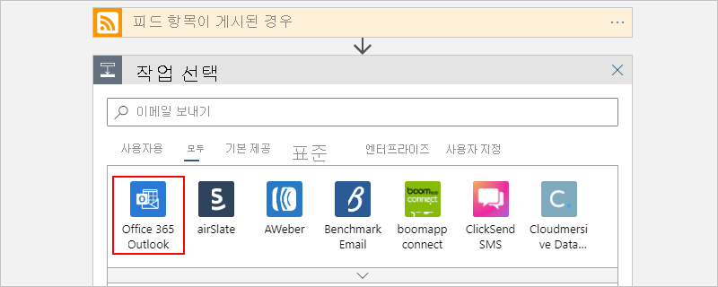
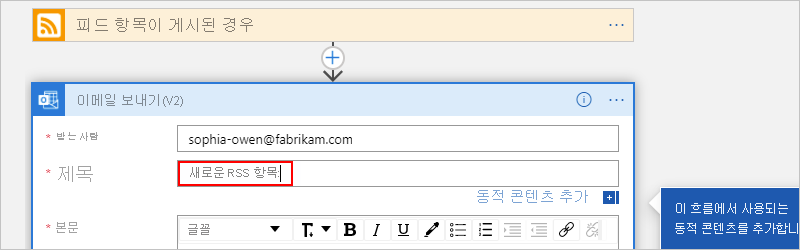
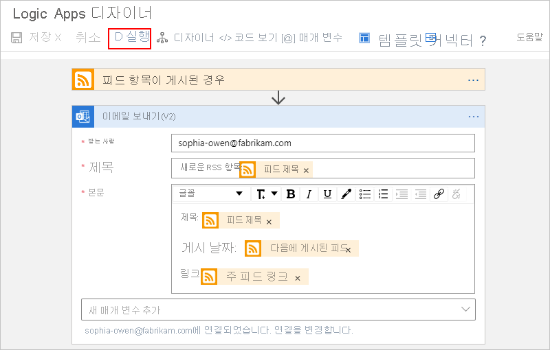

# 빠른 시작: 첫 번째 Logic Apps 워크플로 만들기 - Azure Portal

이 빠른 시작에서는 [Azure Portal](https://portal.azure.com)을 통해 [Azure Logic Apps](logic-apps-overview.md)에서 첫 번째 워크플로를 빌드하는 방법에 대해 설명합니다. 또한 이 소개 가이드에서는 새 논리 앱을 만들고, 트리거 및 작업을 논리 앱에 추가하고, 논리 앱을 테스트하는 방법을 포함하여 Logic Apps 서비스의 기본 개념에 대해서도 설명합니다. 이 빠른 시작에 따라 RSS 피드를 정기적으로 확인하고 새 항목에 대한 이메일 알림을 보내는 논리 앱 예제를 빌드합니다. 다음 스크린샷에서는 이 논리 앱 예제의 개략적인 워크플로를 보여 줍니다.

다른 인터페이스와 앱을 통해 첫 번째 논리 앱을 만들고 관리하는 방법을 알아보려면 다음과 같은 다른 Logic Apps 빠른 시작을 참조하세요. 

* [Azure CLI(Azure 명령줄 인터페이스)를 사용하여 논리 앱 만들기 및 관리](quickstart-logic-apps-azure-cli.md)
* [Visual Studio Code에서 논리 앱 만들기 및 관리](quickstart-create-logic-apps-visual-studio-code.md)
* [Visual Studio에서 논리 앱 만들기 및 관리](quickstart-create-logic-apps-with-visual-studio.md)

## 사전 요구 사항

* Azure 구독 없는 경우 [Azure 체험 계정에 가입](https://azure.microsoft.com/free/?WT.mc_id=A261C142F)하세요.
* Logic Apps에서 지원하는 서비스의 이메일 계정(예: Office 365 Outlook 또는 Outlook.com) 지원되는 다른 이메일 공급자의 경우 [커넥터 목록을 검토](/connectors/)하세요.

    > [!IMPORTANT]
    > [Gmail 커넥터](/connectors/gmail/)를 사용하는 경우 G Suite 계정만 Logic Apps에서 이 커넥터를 제한 없이 사용할 수 있습니다. 소비자 Gmail 계정이 있는 경우 [Gmail 커넥터 인증에 사용할 Google 클라이언트 앱을 만들지](/connectors/gmail/#authentication-and-bring-your-own-application) 않는 한 특정 Google 승인 서비스에서만 이 커넥터를 사용할 수 있습니다. 자세한 내용은 [Azure Logic Apps의 Google 커넥터에 대한 데이터 보안 및 개인정보처리방침](../connectors/connectors-google-data-security-privacy-policy.md)을 참조하세요.

## 논리 앱 만들기

1. Azure 계정 자격 증명을 사용하여 [Azure Portal](https://portal.azure.com)에 로그인합니다.

1. Azure Portal 검색 상자에 `logic apps`를 입력하고, **Logic Apps** 를 선택합니다.

   

1. **Logic Apps** 페이지에서 **추가** 를 선택합니다.

   

1. **논리 앱** 창에서 논리 앱에 대한 기본 세부 정보와 설정을 제공합니다. 이 논리 앱 예제의 목적을 위해 새 [리소스 그룹](../azure-resource-manager/management/overview.md#terminology)을 만듭니다.
    
   | 속성 | 값 | Description |
   |----------|-------|-------------|
   | **이름** | <*logic-app-name*> | 지역에서 고유해야 하는 논리 앱의 이름입니다. 이름에는 문자, 숫자, 하이픈(`-`), 밑줄(`_`), 괄호(`(`, `)`) 및 마침표(`.`)만 포함될 수 있습니다. 이 예제에서는 “My-First-Logic-App”을 사용합니다. |
   | **구독** | <*Azure-subscription-name*> | Azure 구독의 이름입니다. |
   | **리소스 그룹** | <*Azure-resource-group-name*> | 논리 앱을 만들 [Azure 리소스 그룹](../azure-resource-manager/management/overview.md#terminology)의 이름입니다. 리소스 그룹의 이름은 지역에서 고유해야 합니다. 이 예제에서는 “My-First-LA-RG”를 사용합니다. |
   | **위치** | <*Azure-region*> | 논리 앱 정보를 저장할 Azure 지역입니다. 이 예제에서는 “미국 서부”를 사용합니다. |
   | **Log Analytics** | 해제 | 진단 로깅에 대한 설정이며, 기본적으로 **해제** 입니다. 이 예제에서는 **해제** 설정을 유지합니다. |
   ||||

   

1. 준비가 되면 **검토 + 만들기** 를 선택합니다. 입력한 세부 정보를 확인하고 **만들기** 를 선택합니다.

1. Azure가 앱을 성공적으로 배포하면 **리소스로 이동** 을 선택합니다. 또는 검색 상자에 이름을 입력하여 논리 앱을 찾아 선택할 수 있습니다.

   

   Logic Apps 디자이너가 열리고 소개 비디오 및 많이 사용되는 트리거가 포함된 페이지를 보여줍니다. **템플릿** 아래에서 **빈 논리 앱** 을 선택합니다.

   

다음으로 [트리거를 논리 앱에 추가](#add-rss-trigger)합니다.

## RSS 트리거 추가

모든 논리 앱은 특정 이벤트가 발생하거나 특정 조건이 충족될 때 실행되는 [트리거](../logic-apps/logic-apps-overview.md#how-do-logic-apps-work)로 시작해야 합니다. 트리거에서 새 항목을 찾을 때마다 해당 트리거가 실행되며 Logic Apps 엔진에서 워크플로를 시작하고 실행하는 논리 앱 인스턴스를 만듭니다. 트리거에서 새 항목을 찾지 못하면 해당 트리거가 실행되지 않고 이 검사에서 인스턴스를 만들거나 워크플로를 실행하지 않습니다.

이 빠른 시작 예제에서는 [논리 앱을 만든](#create-your-logic-app) 후 RSS 피드에서 새 항목을 확인하여 새 항목이 있을 때 실행되는 트리거를 추가합니다. 또한 [자동 승인 기반 워크플로 만들기](tutorial-process-mailing-list-subscriptions-workflow.md) 자습서와 같이 여러 형식의 트리거를 사용하여 논리 앱을 만들 수도 있습니다.

1. **논리 앱 디자이너** 의 검색 상자에서 **모두** 를 선택합니다.

1. RSS 커넥터를 찾으려면 검색 상자에 `rss`를 입력합니다. **트리거** 목록에서 **피드 항목이 게시된 경우** RSS 트리거를 선택합니다.

   

1. 트리거에 대한 RSS 피드 URL을 제공합니다. 그런 다음, 간격과 빈도를 설정하여 트리거의 일정을 정의합니다.

   | 속성 | 값 | Description |
   | -------- | ----- | ----------- |
   | **RSS 피드 URL** | <*RSS-feed-URL*> | 모니터링하려는 RSS 피드의 URL입니다. 이 예제에서는 `https://feeds.a.dj.com/rss/RSSMarketsMain.xml`에 있는 Wall Street Journal의 RSS 피드를 사용합니다. 그러나 이 예제의 목적을 위해 HTTP 권한 부여가 필요하지 않은 RSS 피드를 사용할 수 있습니다. 자주 게시되는 RSS 피드를 선택합니다. 그러면 나중에 논리 앱을 쉽게 테스트할 수 있습니다. |
   | **간격** | 1 | RSS 피드 확인 사이에 대기하는 간격(숫자)입니다. 이 예제에서는 1분 간격을 사용합니다. |
   | **빈도** | Minute | RSS 피드 확인 사이의 각 간격에 대한 시간 단위입니다. 이 예제에서는 1분 간격을 사용합니다. |
   ||||

   

1. 지금은 제목 표시줄 내부를 클릭하여 트리거의 세부 정보를 접습니다.

   

1. 디자이너 도구 모음에서 **저장** 을 선택하여 논리 앱을 저장합니다.

이제 논리 앱이 라이브 상태이지만 RSS 피드를 확인하는 것 이외의 다른 작업은 수행하지 않습니다. 다음으로 트리거가 실행될 때 수행되는 작업을 정의하는 [작업을 추가](#add-email-action)합니다.

## "메일 보내기" 작업 추가

[논리 앱에 대한 트리거가 추가](#add-rss-trigger)되면 논리 앱에서 RSS 피드를 확인하고 새 항목을 표시할 때 응답을 결정하는 [작업](../logic-apps/logic-apps-overview.md#logic-app-concepts)을 추가해야 합니다. 또한 [Logic Apps, Azure Functions 및 Azure Storage를 사용하여 이메일 처리](/tutorial-process-email-attachments-workflow.md) 자습서와 같이 훨씬 더 복잡한 작업이 포함된 논리 앱을 만들 수도 있습니다.

> [!NOTE]
> 이 예제에서는 Office 365 Outlook을 이메일 서비스로 사용합니다. 논리 앱에서 지원되는 다른 이메일 서비스를 사용하는 경우 사용자 인터페이스가 다르게 보일 수 있습니다. 그러나 다른 이메일 서비스에 연결하기 위한 기본 개념은 동일하게 유지됩니다.

1. **피드 항목이 게시된 경우** 트리거 아래에서 **새 단계** 를 선택합니다.

   

1. **작업 선택** 및 검색 상자 아래에서 **모두** 를 선택합니다.

1. 이 작업을 제공하는 커넥터를 찾을 수 있도록 검색 상자에 `send an email`을 입력합니다. 작업 목록을 특정 앱 또는 서비스로 필터링하려면 먼저 해당 앱 또는 서비스를 선택합니다.

   예를 들어 Microsoft 회사 또는 학교 계정을 사용 중이고 Office 365 Outlook을 사용하려는 경우에는 **Office 365 Outlook** 을 선택합니다. 또는 개인 Microsoft 계정을 사용하는 경우 Outlook.com을 선택하면 됩니다. 이 예제에서는 Office 365 Outlook을 사용하여 진행합니다.

   

   이제 사용하려는 작업(예: `send an email`)을 보다 쉽게 찾아서 선택할 수 있습니다.

   

1. 선택한 이메일 커넥터에서 ID를 인증하라는 메시지가 표시되면 지금 해당 단계를 완료합니다. 이 예제가 작동하려면 논리 앱과 이메일 서비스 간의 연결을 만들어야 합니다. 

    > [!NOTE]
    > 이 예제에서는 Office 365 Outlook 커넥터에 대한 수동 인증을 보여 줍니다. 그러나 다른 커넥터는 다른 인증 유형을 지원할 수 있습니다.
    > 사용 사례에 따라 다른 방식으로 논리 앱에 대한 인증을 처리할 수도 있습니다. 예를 들어 Azure Resource Manager 템플릿을 배포에 사용하는 경우 연결 세부 정보와 같이 자주 변경되는 입력에 대한 보안을 향상시키기 위해 매개 변수화할 수 있습니다. 자세한 내용은 다음 항목을 참조하세요.
   > * [배포용 템플릿 매개 변수](../logic-apps/logic-apps-azure-resource-manager-templates-overview.md#template-parameters)
   > * [OAuth 연결 권한 부여](../logic-apps/logic-apps-deploy-azure-resource-manager-templates.md#authorize-oauth-connections)
   > * [관리 ID를 사용하여 액세스 인증](../logic-apps/create-managed-service-identity.md)
   > * [논리 앱 배포를 위한 연결 인증](../logic-apps/logic-apps-azure-resource-manager-templates-overview.md#authenticate-connections)

1. **이메일 보내기** 작업에서 이메일 알림에 포함할 정보를 지정합니다.

   1. **받는 사람** 상자에 받는 사람의 이메일 주소를 입력합니다. 이 예제에서는 이메일 주소를 사용합니다.

        > [!NOTE]
        > **받는 사람** 상자 및 Logic Apps 디자이너의 다른 특정 입력 상자 내부를 클릭하면 **동적 콘텐츠 추가** 목록이 표시됩니다. 이 예제에서는 이후 단계에서 동적 콘텐츠를 사용합니다. **동적 콘텐츠 추가** 목록에는 현재 작업에 대한 입력으로 사용할 수 있는 이전 단계의 사용 가능한 모든 출력이 표시됩니다.

   1. **제목** 상자에서 이메일 알림의 제목을 입력합니다. 이 예제에서는 후행 공백이 포함된 `New RSS item: ` 텍스트를 입력합니다.

      

   1. **동적 콘텐츠 추가** 목록에서 **피드 항목이 게시된 경우** 트리거에서 출력되는 **피드 제목** 을 선택합니다. 이메일 알림은 이 출력을 사용하여 RSS 항목의 제목을 가져옵니다.

      

      > [!TIP]
      > 동적 콘텐츠 목록에서 **피드 항목이 게시된 경우** 트리거의 출력이 표시되지 않으면 작업의 헤더 옆에 있는 **자세히 보기** 를 선택합니다.
      > 
      > 

      작업이 완료되면 전자 메일 제목이 다음 예제와 같이 표시됩니다.

      

      디자이너에 "For each" 루프가 표시되면 배열에 대한 토큰(예: **categories-Item** 토큰)을 선택한 것입니다. 이러한 종류의 토큰에 대해 디자이너는 해당 토큰을 참조하는 작업 주변에 이 루프를 자동으로 추가합니다. 그렇게 하면 논리 앱이 각 배열 항목에 대해 동일한 작업을 수행합니다. 루프를 제거하려면 루프의 제목 표시줄에서 **줄임표** ( **...** )를 선택한 다음, **삭제** 를 선택합니다.

   1. **본문** 상자에서 이메일 본문에 대한 콘텐츠를 입력합니다. 이 예제에서 콘텐츠에는 각각에 대한 설명 텍스트가 있는 세 가지 속성이 포함되어 있습니다. 즉, `Title:`에는 **피드 제목** 속성, `Date published:`에는 **피드 게시 날짜** 속성 및 `Link:`에는 **기본 피드 링크** 속성이라는 설명 텍스트가 있습니다. 편집 상자에서 빈 줄을 추가하려면 Shift + Enter 키를 누릅니다.

      | 속성 | Description |
      |----------|-------------|
      | **피드 제목** | 항목의 제목 |
      | **다음에 게시된 피드** | 항목의 게시 날짜 및 시간 |
      | **주 피드 링크** | 항목의 URL |
      |||

      

1. 논리 앱을 저장합니다. 디자이너 메뉴에서 **저장** 을 선택합니다.

다음으로 [논리 앱이 작동하는지 테스트](#test-logic-app)합니다.

## 논리 앱 실행

논리 앱 예제가 만들어지면 워크플로가 올바르게 구성되었는지 확인합니다. 논리 앱에서 지정된 일정에 따라 RSS 피드를 확인할 때까지 기다릴 수 있습니다. 또는 다음 스크린샷과 같이 Logic Apps 디자이너 도구 모음에서 **실행** 을 선택하여 논리 앱을 수동으로 실행할 수 있습니다. 

RSS 피드에 새 항목이 있는 경우 논리 앱은 새 항목 각각에 전자 메일을 보냅니다. 그렇지 않은 경우 논리 앱에서 RSS 피드를 다시 확인하기 위해 다음 간격까지 기다립니다. 

다음 스크린샷에서는 이 논리 앱 예제의 이메일 알림 샘플을 보여 줍니다. 이메일에는 디자이너에서 선택한 각 RSS 피드 항목에 대한 세부 정보 및 각 항목에 대해 추가된 설명 텍스트가 포함됩니다.

논리 앱에서 예상대로 알림 이메일을 받지 못하는 경우 다음을 수행합니다.

* 메시지가 잘못 필터링된 경우 이메일 계정의 정크 또는 스팸 폴더를 확인합니다.
* 사용 중인 RSS 피드에서 마지막 예약 또는 수동 확인 이후 항목을 게시했는지 확인합니다.

## 리소스 정리

이 논리 앱 샘플 테스트가 완료되면 이 예제를 위해 만든 리소스 그룹을 삭제하여 논리 앱 및 관련 리소스를 정리합니다.

> [!NOTE]
> [논리 앱을 삭제](manage-logic-apps-with-azure-portal.md#delete-logic-apps)하면 새 실행이 인스턴스화되지 않습니다. 모든 진행 중 및 보류 중인 실행이 취소됩니다. 수천 개의 실행이 있다면 취소를 완료하는 데 상당한 시간이 소요될 수 있습니다.

1. Azure 검색 상자에 `resource groups`을 입력한 다음, **리소스 그룹** 을 선택합니다.

   

1. 해당하는 논리 앱의 리소스 그룹을 찾아서 선택합니다. **개요** 창에서 **리소스 그룹 삭제** 를 선택합니다.

   

1. 확인 창이 표시되면 리소스 그룹 이름을 입력하고 **삭제** 를 선택합니다.

   

## 다음 단계

이 빠른 시작에서는 Azure Portal에서 RSS 피드를 통해 일정에 따라 업데이트를 확인하고 각 새 피드 항목에 대한 이메일 알림을 보내는 첫 번째 논리 앱을 만들었습니다. 

Logic Apps에서 고급 일정 기반 워크플로를 만드는 방법을 알아보려면 다음 자습서를 참조하세요.

> [!div class="nextstepaction"]
> [일정 기반 논리 앱으로 트래픽 확인](../logic-apps/tutorial-build-schedule-recurring-logic-app-workflow.md)
