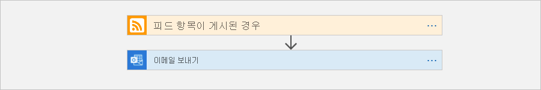
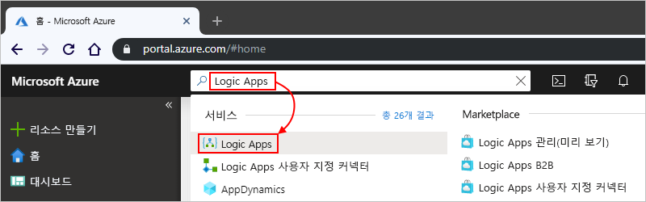
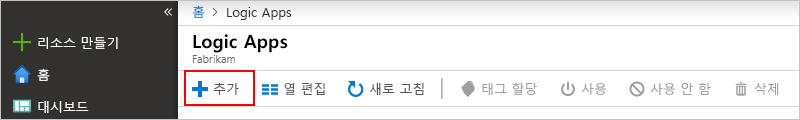
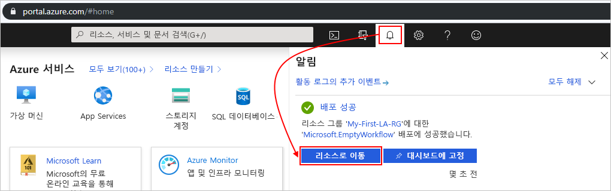
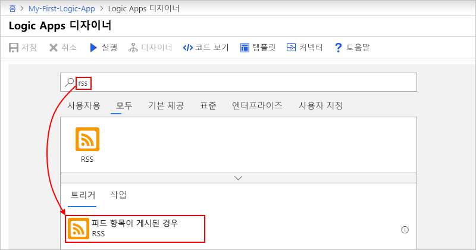
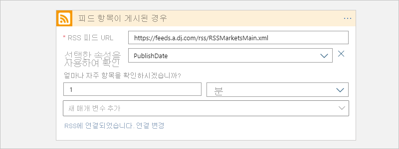
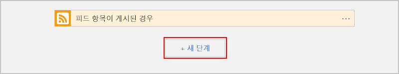

# 빠른 시작: Azure Logic Apps를 사용하여 첫 번째 워크플로 만들기 - Azure Portal

이 빠른 시작에서는 [Azure Logic Apps](../logic-apps/logic-apps-overview.md)를 사용하여 첫 번째 워크플로를 빌드하는 방법 외의 기본적인 일반 개념(예: 빈 논리 앱 만들기, 트리거와 작업 추가, 논리 앱 테스트 등)을 소개합니다. 이 빠른 시작에서는 새 항목에 대한 웹 사이트의 RSS 피드를 주기적으로 확인하는 논리 앱을 빌드합니다. 새 항목이 있으면 논리 앱에서 각 항목에 대한 이메일을 보냅니다. 여기까지 모두 마치면 논리 앱이 이 워크플로와 비슷하게 보입니다.

이 시나리오의 경우 Azure 구독 또는 Office 365 Outlook, Outlook.com 또는 Gmail과 같이 Azure Logic Apps에서 지원되는 서비스의 이메일 계정인 [체험 Azure 계정에 등록](https://azure.microsoft.com/free/)이 필요합니다. 지원되는 메일 서비스는 [여기의 커넥터 목록을 검토하세요](https://docs.microsoft.com/connectors/). 이 예제에서 논리 앱은 Office 365 Outlook 계정을 사용합니다. 다른 메일 서비스를 사용하는 경우 전체적인 일반 단계는 동일하지만 사용자 인터페이스는 약간 다를 수 있습니다.

> [!IMPORTANT]
> Gmail 커넥터를 사용하려는 경우 G Suite 비즈니스 계정만 논리 앱에서 제한 없이 이 커넥터를 사용할 수 있습니다. Gmail 소비자 계정이 있는 경우 특정 Google 승인 서비스에서만 이 커넥터를 사용하거나 [Gmail 커넥터 인증에 사용할 Google 클라이언트 앱을 만들](https://docs.microsoft.com/connectors/gmail/#authentication-and-bring-your-own-application) 수 있습니다. 자세한 내용은 [Azure Logic Apps의 Google 커넥터에 대한 데이터 보안 및 개인정보처리방침](../connectors/connectors-google-data-security-privacy-policy.md)을 참조하세요.

## Azure Portal에 로그인

Azure 계정 자격 증명을 사용하여 [Azure Portal](https://portal.azure.com)에 로그인합니다.

## 논리 앱 만들기

1. Azure 홈페이지의 검색 상자에서 **Logic Apps**를 찾아 선택합니다.

   

1. **Logic Apps** 페이지에서 **추가**를 선택합니다.

   

1. 여기에 표시된 것처럼 **논리 앱** 창에서 논리 앱에 대한 정보를 제공합니다. 완료되면 **만들기**를 선택합니다.

   

   | 속성 | 값 | Description |
   |----------|-------|-------------|
   | **이름** | <*logic-app-name*> | 문자, 숫자, 하이픈(`-`), 밑줄(`_`), 괄호(`(`, `)`) 및 마침표(`.`)만 포함할 수 있는 논리 앱 이름입니다. 이 예제에서는 “My-First-Logic-App”을 사용합니다. 

**참고**: 논리 앱의 이름은 지역마다 고유해야 합니다. |
   | **구독** | <*Azure-subscription-name*> | Azure 구독 이름 |
   | **리소스 그룹** | <*Azure-resource-group-name*> | 관련 리소스를 구성하는 데 사용되는 [Azure 리소스 그룹](../azure-resource-manager/management/overview.md)의 이름입니다. 이 예제에서는 “My-First-LA-RG”를 사용합니다. 

**참고**: 리소스 그룹의 이름은 지역마다 고유해야 합니다. |
   | **위치** | <*Azure-region*> | 논리 앱 정보를 저장할 지역입니다. 이 예제에서는 “미국 서부”를 사용합니다. |
   | **Log Analytics** | 꺼짐 | 진단 로깅에 대한 설정을 **끄기**로 유지합니다. |
   ||||

1. Azure가 앱을 배포한 후 Azure 도구 모음에서 배포된 논리 앱에 대해 **알림** > **리소스로 이동**을 선택합니다.

   

   또는 검색 상자에 이름을 입력하여 논리 앱을 찾아 선택할 수 있습니다.

   Logic Apps 디자이너가 열리고 소개 비디오 및 많이 사용되는 트리거가 포함된 페이지를 보여줍니다. **템플릿** 아래에서 **빈 논리 앱**을 선택합니다.

   

다음으로, 새 RSS 피드 항목이 나타나면 실행되는 [트리거](../logic-apps/logic-apps-overview.md#logic-app-concepts)를 추가합니다. 모든 논리 앱은 특정 이벤트가 발생하거나 특정 조건이 충족할 때 실행되는 트리거를 통해 시작되어야 합니다. 트리거가 발생될 때마다 Azure Logic Apps 엔진은 워크플로를 시작하고 실행하는 논리 앱 인스턴스를 만듭니다.

## RSS 트리거 추가

1. **논리 앱 디자이너**의 검색 상자에서 **모두**를 선택합니다.

1. 검색 상자에 `rss`를 입력하여 RSS 커넥터를 찾습니다. 트리거 목록에서 **피드 항목이 게시된 경우** 트리거를 선택합니다.

   

1. 다음에 나온 설명과 같이 트리거에 대한 이 정보를 제공합니다.

   

   | 속성 | 값 | Description |
   |----------|-------|-------------|
   | **RSS 피드 URL** | `http://feeds.reuters.com/reuters/topNews` | 모니터링하려는 RSS 피드에 대한 링크 |
   | **간격** | 1 | 검사 간에 대기하는 간격의 수 |
   | **빈도** | Minute | 검사 간 간격의 시간 단위  |
   ||||

   간격과 빈도는 논리 앱의 트리거에 대한 일정을 정의합니다. 이 논리 앱은 1분마다 피드를 확인합니다.

1. 지금은 트리거 세부 정보를 축소하려면 트리거의 제목 표시줄 내부를 클릭합니다.

   

1. 논리 앱을 저장합니다. 디자이너 도구 모음에서 **저장**을 선택합니다.

이제 논리 앱이 라이브 상태이지만 RSS 피드를 확인하는 것 이외에 아무 것도 수행하지 않습니다. 따라서 트리거가 실행되면 응답하는 작업을 추가해 보겠습니다.

## "메일 보내기" 작업 추가

이제 RSS 피드에 새 항목이 표시되면 메일을 보내는 [작업](../logic-apps/logic-apps-overview.md#logic-app-concepts)을 추가합니다.

1. **피드 항목이 게시된 경우** 트리거 아래에서 **새 단계**를 선택합니다.

   

1. **작업 선택** 및 검색 상자 아래에서 **모두**를 선택합니다.

1. 검색 상자에 `send an email`을 입력하여 이 작업을 제공하는 커넥터를 찾습니다. 작업 목록에서 원하는 메일 공급자에 대해 "메일 보내기" 작업을 선택합니다. 이 예제에서는 **메일 보내기** 작업이 있는 Office 365 Outlook 커넥터를 사용합니다.

   

   특정 앱 또는 서비스에 대한 작업 목록을 필터링하기 위해 먼저 앱 또는 서비스를 선택할 수 있습니다.

   * Azure 회사 또는 학교 계정에서 Office 365 Outlook을 선택합니다.
   * Microsoft 개인 계정에서 Outlook.com을 선택합니다.

1. 선택한 메일 커넥터에서 ID를 인증하라는 메시지를 표시하는 경우 해당 단계를 완료하여 논리 앱과 메일 서비스 간에 연결을 만듭니다.

   > [!NOTE]
   > 이 특정 예제에서는 ID를 수동으로 인증합니다. 그러나 인증을 요구하는 커넥터는 지원하는 인증 유형에 따라 달라집니다. 또한 인증을 처리하는 방법을 설정하는 옵션도 제공됩니다. 예를 들어, 배포에 Azure Resource Manager 템플릿을 사용하는 경우 연결 정보와 같이 자주 또는 쉽게 변경하려는 입력에 대한 매개 변수를 지정하고 보안을 향상시킬 수 있습니다. 자세한 내용은 다음 항목을 참조하세요.
   >
   > * [배포용 템플릿 매개 변수](../logic-apps/logic-apps-azure-resource-manager-templates-overview.md#template-parameters)
   > * [OAuth 연결 권한 부여](../logic-apps/logic-apps-deploy-azure-resource-manager-templates.md#authorize-oauth-connections)
   > * [관리 ID를 사용하여 액세스 인증](../logic-apps/create-managed-service-identity.md)
   > * [논리 앱 배포를 위한 연결 인증](../logic-apps/logic-apps-azure-resource-manager-templates-overview.md#authenticate-connections)

1. **이메일 보내기** 작업에서 이메일에 포함할 데이터를 지정합니다.

   1. **받는 사람** 상자에 받는 사람의 이메일 주소를 입력합니다. 메일 주소를 사용하여 테스트할 수 있습니다.

      지금은 나타나는 **동적 콘텐츠 추가** 목록을 무시합니다. 일부 편집 상자 내부를 클릭하면 이 목록이 나타나고 워크플로에 입력으로 포함할 수 있는 이전 단계의 사용 가능한 매개 변수가 표시됩니다.

   1. **제목** 상자에 `New RSS item: ` 텍스트를 입력하고 후행 공백을 하나 둡니다.

      

   1. **동적 콘텐츠 추가** 목록에서 RSS 항목 제목을 포함할 **피드 제목**을 선택합니다.

      

      작업이 완료되면 전자 메일 제목이 다음 예제와 같이 표시됩니다.

      

      디자이너에 "For each" 루프가 나타나면 배열에 대한 토큰을 선택한 것입니다(예: **categories-Item** 토큰). 이러한 종류의 토큰에 대해 디자이너는 해당 토큰을 참조하는 작업 주변에 이 루프를 자동으로 추가합니다. 그렇게 하면 논리 앱이 각 배열 항목에 대해 동일한 작업을 수행합니다. 루프를 제거하려면 루프의 제목 표시줄에서 **줄임표**( **...** )를 선택한 다음, **삭제**를 선택합니다.

   1. **본문** 상자에서 이 텍스트를 입력하고, 이메일 본문에 대해 다음 토큰을 선택합니다. 편집 상자에서 빈 줄을 추가하려면 Shift + Enter 키를 누릅니다.

      

      | 속성 | Description |
      |----------|-------------|
      | **피드 제목** | 항목의 제목 |
      | **다음에 게시된 피드** | 항목의 게시 날짜 및 시간 |
      | **주 피드 링크** | 항목의 URL |
      |||

1. 논리 앱을 저장합니다.

다음으로, 논리 앱을 테스트합니다.

## 논리 앱 실행

수동으로 논리 앱을 시작하려면 디자이너 도구 모음에서 **실행**을 선택합니다. 또는 논리 앱이 지정된 일정에 따라(1분마다) RSS 피드를 확인할 때까지 기다립니다. RSS 피드에 새 항목이 있는 경우 논리 앱은 새 항목 각각에 전자 메일을 보냅니다. 그렇지 않으면, 논리 앱이 다시 확인하기 전에 다음 간격 때까지 대기합니다. 전자 메일을 받지 못한 경우 정크 메일 폴더를 확인합니다.

예를 들어 이 논리 앱이 보내는 샘플 이메일은 다음과 같습니다.

기술적으로 트리거가 RSS 피드를 확인하고 새 항목을 찾는 경우 해당 트리거가 실행되고 Azure Logic Apps 엔진이 워크플로에서 동작을 실행하는 논리 앱 워크플로 인스턴스를 만듭니다. 트리거가 새 항목을 찾지 못하면 해당 트리거는 실행되지 않고 워크플로 인스턴스화도 "건너뜁니다".

축하합니다. Azure Portal을 사용하여 첫 번째 논리 앱을 성공적으로 빌드하고 실행했습니다.

## 리소스 정리

이 샘플이 더 이상 필요 없으면 논리 앱 및 관련 리소스가 포함된 리소스 그룹을 삭제합니다.

1. 주 Azure 메뉴에서 **리소스 그룹**을 선택한 다음, 논리 앱의 리소스 그룹을 선택합니다. **개요** 창에서 **리소스 그룹 삭제**를 선택합니다.

   

1. 확인 창이 표시되면 리소스 그룹 이름을 입력하고 **삭제**를 선택합니다.

   

> [!NOTE]
> 논리 앱을 삭제하면 새 실행이 인스턴스화되지 않습니다. 모든 진행 중 및 보류 중인 실행이 취소됩니다. 수천 개의 실행이 있다면 취소를 완료하는 데 상당한 시간이 소요될 수 있습니다.

## 다음 단계

이 빠른 시작에서는 지정한 일정에 따라(1분마다) RSS 업데이트를 확인하고, 업데이트가 있으면 작업(이메일 보내기)을 수행하는 첫 번째 논리 앱을 만들었습니다. 더욱 자세한 내용을 보려면 고급 일정 기반 워크플로를 만드는 이 자습서를 계속 진행하세요.

> [!div class="nextstepaction"]
> [일정 기반 논리 앱으로 트래픽 확인](../logic-apps/tutorial-build-schedule-recurring-logic-app-workflow.md)
