# <a name="quickstart-create-your-first-automated-workflow-with-azure-logic-apps---azure-portal"></a>빠른 시작: Azure Logic Apps를 사용하여 첫 번째 자동화된 워크플로 만들기 - Azure Portal

이 빠른 시작에서는 [Azure Logic Apps](../logic-apps/logic-apps-overview.md)를 사용하여 첫 번째 자동화 워크플로를 빌드하는 방법을 소개합니다. 이 문서에서는 새 항목에 대한 웹 사이트의 RSS 피드를 주기적으로 확인하는 논리 앱을 만듭니다. 새 항목이 있으면 논리 앱에서 각 항목에 대한 이메일을 보냅니다. 여기까지 모두 마치면 논리 앱이 이 워크플로와 비슷하게 보입니다.

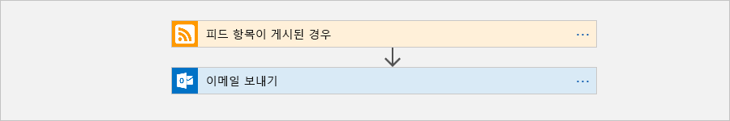

이 빠른 시작을 수행하려면 Office 365 Outlook, Outlook.com 또는 Gmail처럼 Logic Apps에서 지원되는 공급자의 이메일 계정이 필요합니다. 다른 공급자에 대한 내용은 [여기서 커넥터 목록을 검토하세요](https://docs.microsoft.com/connectors/). 이 논리 앱은 Office 365 Outlook 계정을 사용합니다. 다른 이메일 계정을 사용하는 경우 전체 단계는 동일하지만 UI가 약간 다를 수 있습니다. 

또한 Azure 구독이 없는 경우 <a href="https://azure.microsoft.com/free/" target="_blank">Azure 체험 계정에 등록</a>합니다.

## <a name="sign-in-to-the-azure-portal"></a>Azure Portal에 로그인

Azure 계정 자격 증명을 사용하여 <a href="https://portal.azure.com" target="_blank">Azure Portal</a>에 로그인합니다.

## <a name="create-your-logic-app"></a>논리 앱 만들기 

1. Azure 주 메뉴에서 **리소스 만들기** > **통합** > **논리 앱**을 선택합니다.

   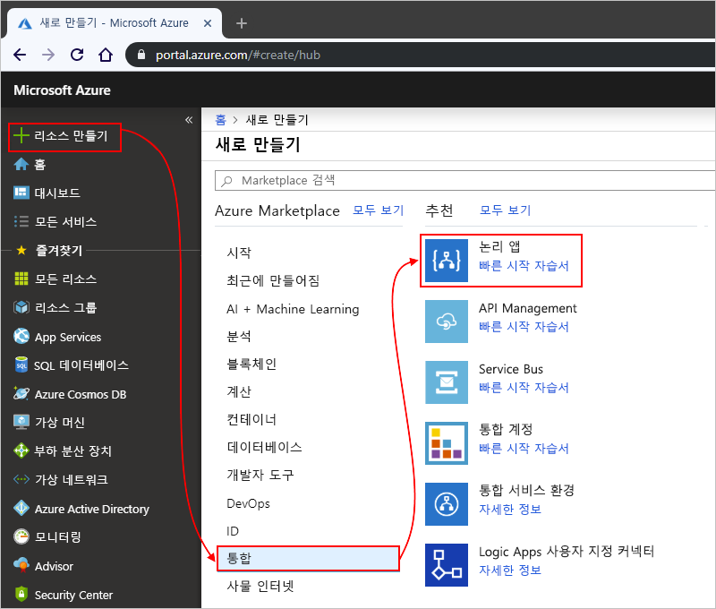

3. 여기에 보이는 것처럼 **논리 앱 만들기** 아래에서 논리 앱에 대한 정보를 제공합니다. 완료되면 **대시보드에 고정** > **만들기**를 선택합니다.

   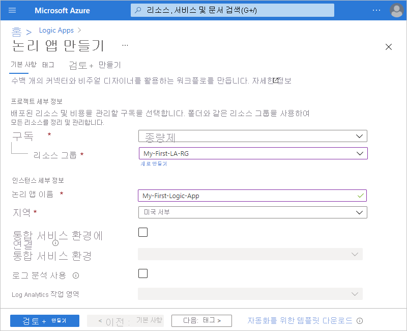

   | 자산 | 값 | 설명 | 
   |----------|-------|-------------| 
   | **Name** | MyFirstLogicApp | 논리 앱의 이름 | 
   | **구독** | <*your-Azure-subscription-name*> | Azure 구독의 이름 | 
   | **리소스 그룹** | My-First-LA-RG | 관련 리소스를 구성하는 데 사용된 [Azure 리소스 그룹](../azure-resource-manager/resource-group-overview.md)의 이름 | 
   | **위치**: | 미국 서부 | 논리 앱 정보를 저장할 지역 | 
   | **Log Analytics** | 꺼짐 | 진단 로깅에 대한 설정을 **끄기**로 유지합니다. | 
   |||| 

3. Azure가 논리 앱을 배포하면 Logic Apps 디자이너가 열리고 소개 비디오 및 많이 사용되는 트리거가 포함된 페이지를 보여줍니다. **템플릿** 아래에서 **빈 Logic App**을 선택합니다.

   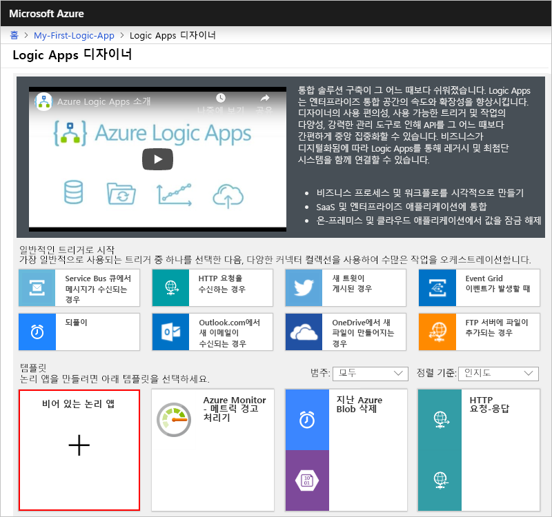

다음으로, 새 RSS 피드 항목이 나타나면 실행되는 [트리거](../logic-apps/logic-apps-overview.md#logic-app-concepts)를 추가합니다. 모든 논리 앱은 특정 이벤트가 발생하거나 특정 조건이 충족할 때 실행되는 트리거를 통해 시작되어야 합니다. 트리거가 발생될 때마다 Logic Apps 엔진은 워크플로를 시작하고 실행하는 논리 앱 인스턴스를 만듭니다.

<a name="add-rss-trigger"></a>

## <a name="check-rss-feed-with-a-trigger"></a>트리거로 RSS 피드 확인

1. 디자이너에서 검색 상자에 "rss"를 입력합니다. **RSS - 피드 항목이 게시되는 경우** 트리거를 선택합니다.

   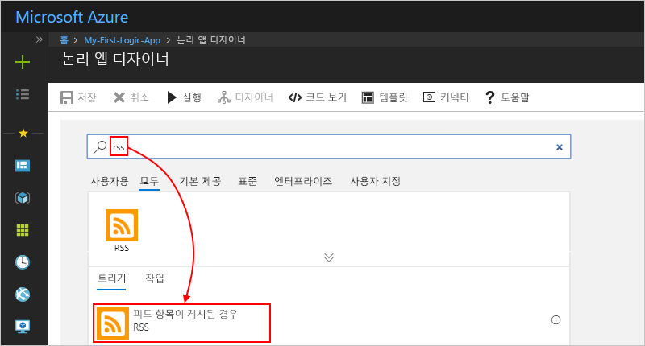

2. 그림의 설명과 같이 트리거에 대한 이 정보를 제공합니다. 

   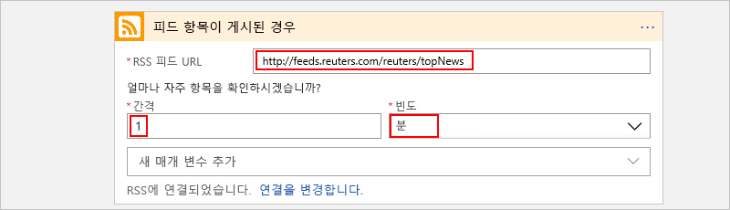

   | 자산 | 값 | 설명 | 
   |----------|-------|-------------| 
   | **RSS 피드 URL** | ```http://feeds.reuters.com/reuters/topNews``` | 모니터링하려는 RSS 피드에 대한 링크 | 
   | **간격** | 1 | 검사 간에 대기하는 간격의 수 | 
   | **Frequency(빈도)** | 분 | 검사 간 간격의 시간 단위  | 
   |||| 

   간격과 빈도는 논리 앱의 트리거에 대한 일정을 정의합니다. 
   이 논리 앱은 1분마다 피드를 확인합니다.

3. 지금은 트리거 세부 정보를 숨기려면 트리거의 제목 표시줄 내부를 클릭합니다.

   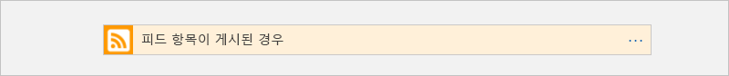

4. 논리 앱을 저장합니다. 디자이너 도구 모음에서 **저장**을 선택합니다. 

이제 논리 앱이 라이브 상태이지만 RSS 피드를 확인하는 것 이외에 아무 것도 수행하지 않습니다. 따라서 트리거가 실행되면 응답하는 작업을 추가해 보겠습니다.

## <a name="send-email-with-an-action"></a>작업을 통해 이메일 전송

이제 RSS 피드에 새 항목이 표시되면 이메일을 보내는 [작업](../logic-apps/logic-apps-overview.md#logic-app-concepts)을 추가합니다. 

1. **피드 항목이 게시된 경우** 트리거에서 **+ 새 단계** > **작업 추가**를 선택합니다.

   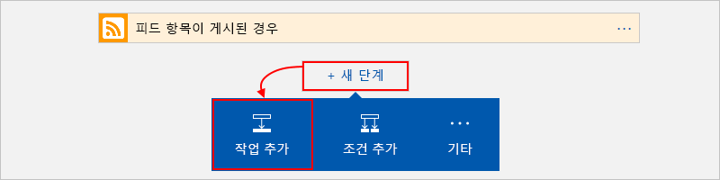

2. **작업 선택** 아래에서 "이메일 보내기"를 필터로 입력합니다. 작업 목록에서 원하는 이메일 공급자에 대한 "이메일 보내기" 작업을 선택합니다. 

   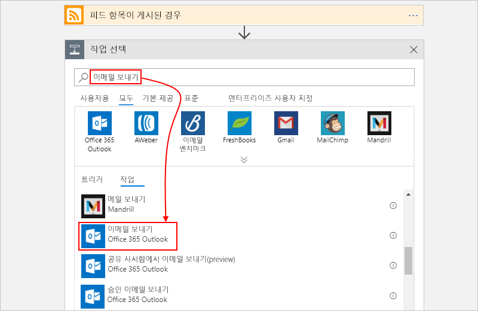

   특정 앱 또는 서비스에 대한 작업 목록을 필터링하기 위해 먼저 앱 또는 서비스를 선택할 수 있습니다.

   * Azure 회사 또는 학교 계정에서 Office 365 Outlook을 선택합니다. 
   * Microsoft 개인 계정에서 Outlook.com을 선택합니다.

3. 자격 증명을 입력하라는 메시지가 나타나면 Logic Apps가 이메일 계정에 대한 연결을 만들 수 있도록 이메일 계정에 로그인합니다.

4. **이메일 보내기** 작업에서 이메일에 포함할 데이터를 지정합니다. 

   1. **받는 사람** 상자에 받는 사람의 이메일 주소를 입력합니다. 
   자신의 이메일 주소를 사용하여 테스트할 수 있습니다.

      지금은 나타나는 **동적 콘텐츠 추가** 목록을 무시합니다. 
      일부 편집 상자 내부를 클릭하면 이 목록이 나타나고 워크플로에 입력으로 포함할 수 있는 이전 단계의 사용 가능한 매개 변수가 표시됩니다. 

   2. **제목** 상자에 ```New RSS item: ``` 텍스트를 입력하고 후행 공백을 하나 둡니다.

      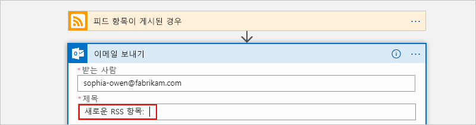
 
   3. **동적 콘텐츠 추가** 목록에서 RSS 항목 제목을 포함할 **피드 제목**을 선택합니다.

      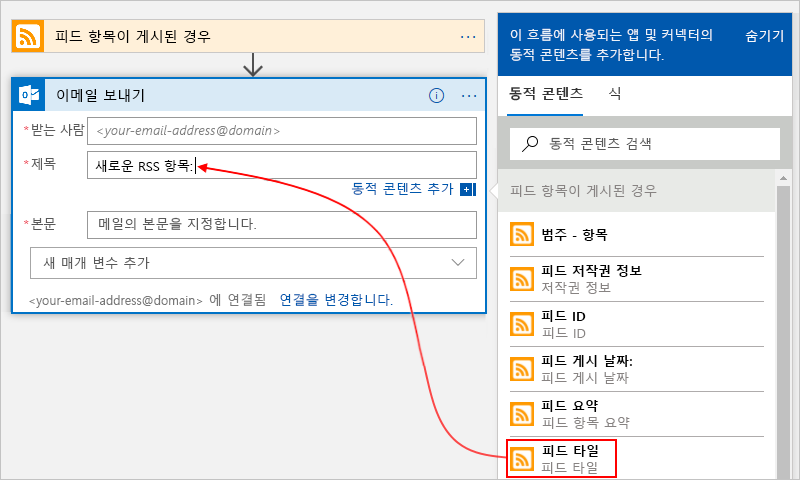

      작업이 완료되면 전자 메일 제목이 다음 예제와 같이 표시됩니다.

      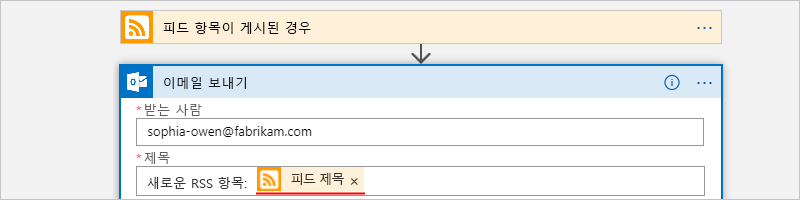

      디자이너에 "For each" 루프가 나타나면 배열에 대한 토큰을 선택한 것입니다(예: **categories-Item** 토큰). 
      이러한 종류의 토큰에 대해 디자이너는 해당 토큰을 참조하는 작업 주변에 이 루프를 자동으로 추가합니다. 
      그렇게 하면 논리 앱이 각 배열 항목에 대해 동일한 작업을 수행합니다. 
      루프를 제거하려면 루프의 제목 표시줄에서 **줄임표**(**...**)를 선택하고 **삭제**를 선택합니다.

   4. **본문** 상자에서 이 텍스트를 입력하고, 이메일 본문에 대해 다음 토큰을 선택합니다. 
   편집 상자에서 빈 줄을 추가하려면 Shift + Enter 키를 누릅니다. 

      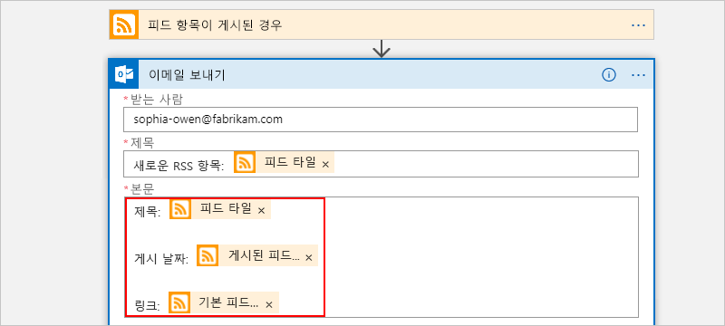

      | 자산 | 설명 | 
      |----------|-------------| 
      | **피드 제목** | 항목의 제목 | 
      | **다음에 게시된 피드** | 항목의 게시 날짜 및 시간 | 
      | **주 피드 링크** | 항목의 URL | 
      ||| 
   
5. 논리 앱을 저장합니다.

다음으로, 논리 앱을 테스트합니다.

## <a name="run-your-logic-app"></a>논리 앱 실행

수동으로 논리 앱을 실행하려면 디자이너 도구 모음에서 **실행**을 선택합니다. 또는 논리 앱이 지정된 일정에 따라(1분마다) RSS 피드를 확인할 때까지 기다립니다. RSS 피드에 새 항목이 있는 경우 논리 앱은 새 항목 각각에 전자 메일을 보냅니다. 그렇지 않으면, 논리 앱이 다시 확인하기 전에 다음 간격 때까지 대기합니다. 

예를 들어 이 논리 앱이 보내는 샘플 이메일은 다음과 같습니다. 전자 메일을 받지 못한 경우 정크 메일 폴더를 확인합니다.

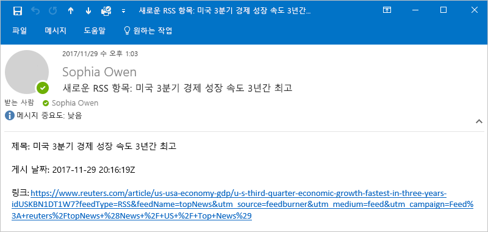

기술적으로 트리거가 RSS 피드를 확인하고 새 항목을 찾는 경우 해당 트리거가 실행되고 Logic Apps 엔진이 워크플로에서 동작을 실행하는 논리 앱 워크플로 인스턴스를 만듭니다.
트리거가 새 항목을 찾지 못하면 해당 트리거는 실행되지 않고 워크플로 인스턴스화도 "건너뜁니다".

축하합니다. Azure Portal을 사용하여 첫 번째 논리 앱을 성공적으로 빌드하고 실행했습니다!

## <a name="clean-up-resources"></a>리소스 정리

이 샘플이 더 이상 필요 없으면 논리 앱 및 관련 리소스가 포함된 리소스 그룹을 삭제합니다. 

1. 주 Azure 메뉴에서 **리소스 그룹**으로 이동하여 논리 앱의 리소스 그룹을 선택합니다. **개요** 페이지에서 **리소스 그룹 삭제**를 선택합니다. 

   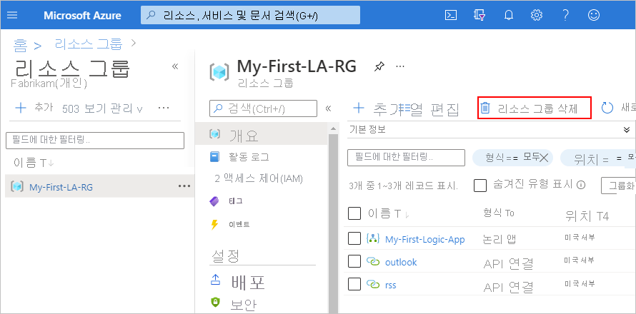

2. 리소스 그룹 이름을 입력하여 확인하고, **삭제**를 선택합니다.

   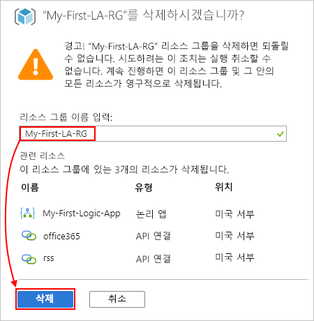

## <a name="get-support"></a>지원 받기

* 질문이 있는 경우 [Azure Logic Apps 포럼](https://social.msdn.microsoft.com/Forums/en-US/home?forum=azurelogicapps)을 방문해 보세요.
* 기능 아이디어를 제출하거나 투표하려면 [Logic Apps 사용자 의견 사이트](http://aka.ms/logicapps-wish)를 방문하세요.

## <a name="next-steps"></a>다음 단계

이 빠른 시작에서는 지정한 일정에 따라(1분마다) RSS 업데이트를 확인하고, 업데이트가 있으면 작업(이메일 보내기)을 수행하는 첫 번째 논리 앱을 만들었습니다. 더욱 자세한 내용을 보려면 고급 일정 기반 워크플로를 만드는 이 자습서를 계속 진행하세요.

> [!div class="nextstepaction"]
> [일정 기반 논리 앱으로 트래픽 확인](../logic-apps/tutorial-build-schedule-recurring-logic-app-workflow.md)
