# 빠른 시작: Azure Logic Apps를 사용하여 작업, 프로세스 및 워크플로 만들기 및 자동화 - Visual Studio

[Azure Logic Apps](../logic-apps/logic-apps-overview.md) 및 Visual Studio를 사용하여 기업 및 조직에서 앱, 데이터, 시스템 및 서비스를 통합하는 작업 및 프로세스를 자동화하도록 워크플로를 만들 수 있습니다. 이 빠른 시작에서는 Visual Studio에서 논리 앱을 만들고 클라우드에서 <a href="https://docs.microsoft.com/azure/guides/developer/azure-developer-guide" target="_blank">Azure</a>에 해당 앱을 배포하여 이러한 워크플로를 디자인하고 빌드할 수 있는 방법을 보여줍니다. <a href="https://portal.azure.com" target="_blank">Azure Portal</a>에서 이러한 작업을 수행할 수 있다고 해도 Visual Studio를 사용하면 소스 제어에 논리 앱을 추가하고 다른 버전을 게시하고 다른 배포 환경에 대한 Azure Resource Manager 템플릿을 만들 수 있습니다. 

Azure Logic Apps을 처음 사용하며 단지 기본 개념만 필요한 경우 대신 [Azure Portal에서 논리 앱을 만들기 위한 빠른 시작](../logic-apps/quickstart-create-first-logic-app-workflow.md)을 시도합니다. Logic Apps 디자이너는 Azure Portal 및 Visual Studio에서 비슷하게 작동합니다. 

여기서는 Visual Studio를 사용하여 Azure Portal 빠른 시작과 동일한 논리 앱을 만듭니다. 이 논리 앱은 웹 사이트의 RSS 피드를 모니터링하고 해당 사이트에 게시된 각 새 항목에 대해 이메일을 발송합니다. 여기까지 모두 마치면 논리 앱이 이 고수준의 워크플로와 비슷하게 보입니다.

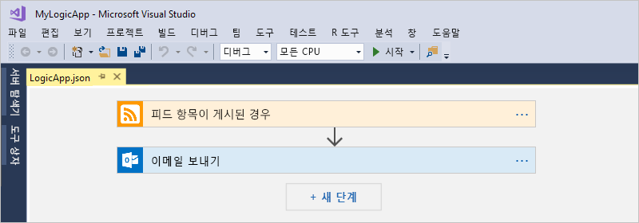

시작하기 전에 이러한 항목이 있는지 확인합니다.

* Azure 구독이 없는 경우 <a href="https://azure.microsoft.com/free/" target="_blank">무료 Azure 계정에 등록</a>합니다.

* 다음 도구가 없으면 다운로드하여 설치합니다. 

  * <a href="https://www.visualstudio.com/downloads" target="_blank">Visual Studio 2017 또는 Visual Studio 2015 - Community Edition 이상</a>. 
  이 빠른 시작에서는 무료로 제공되는 Visual Studio Community 2017을 사용합니다.

  * <a href="https://azure.microsoft.com/downloads/" target="_blank">.NET용 Microsoft Azure SDK(2.9.1 이상)</a> 및 <a href="https://github.com/Azure/azure-powershell#installation" target="_blank">Azure PowerShell</a>. 
  <a href="https://docs.microsoft.com/dotnet/azure/dotnet-tools?view=azure-dotnet">Azure SDK for .NET</a>에 대해 자세히 알아보세요.

  * <a href="https://marketplace.visualstudio.com/items?itemName=VinaySinghMSFT.AzureLogicAppsToolsforVisualStudio-18551" target="_blank">Visual Studio 2017용 Azure Logic Apps 도구</a> 또는 <a href="https://marketplace.visualstudio.com/items?itemName=VinaySinghMSFT.AzureLogicAppsToolsforVisualStudio" target="_blank">Visual Studio 2015 버전</a>
  
    Visual Studio Marketplace에서 직접 Azure Logic Apps 도구를 다운로드해 설치하거나 <a href="https://docs.microsoft.com/visualstudio/ide/finding-and-using-visual-studio-extensions" target="_blank">Visual Studio 내에서 이 확장을 설치하는 방법</a>을 알아볼 수 있습니다. 
    설치를 완료하면 Visual Studio를 다시 시작해야 하는지 확인합니다.

* Office 365 Outlook, Outlook.com, Gmail 등 Logic Apps에서 지원하는 이메일 계정입니다. 다른 공급자에 대한 내용은 <a href="https://docs.microsoft.com/connectors/" target="_blank">여기서 커넥터 목록을 검토하세요</a>. 이 논리 앱은 Office 365 Outlook을 사용합니다. 다른 공급자를 사용하는 경우 전체 단계는 동일하지만 UI가 약간 다를 수 있습니다.

* 포함된 논리 앱 디자이너를 사용하는 동안 웹에 액세스

  디자이너가 Azure에서 리소스를 만들고 논리 앱의 커넥터에서 속성 및 데이터를 읽기 위해서는 인터넷 연결이 필요합니다. 
  예를 들어, Dynamics CRM Online 커넥터를 사용하는 경우 디자이너는 사용 가능한 사용자 지정 및 기본 속성에 대한 CRM 인스턴스를 확인합니다.

## Azure 리소스 그룹 프로젝트 만들기

시작하려면 [Azure 리소스 그룹 프로젝트](../azure-resource-manager/vs-azure-tools-resource-groups-deployment-projects-create-deploy.md)를 만듭니다. [Azure 리소스 그룹 및 리소스](../azure-resource-manager/resource-group-overview.md)에 대해 자세히 알아봅니다.

1. Visual Studio를 시작하고 Azure 계정으로 로그인합니다.

2. **파일** 메뉴에서 **새로 만들기** > **프로젝트**를 선택합니다. (키보드: Ctrl+Shift+N)

   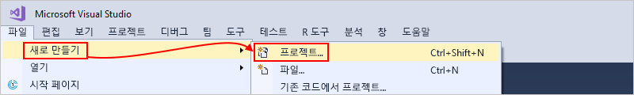

3. **설치됨** 아래에서 **Visual C#** 또는 **Visual Basic**을 선택합니다. **클라우드** > **Azure 리소스 그룹**을 선택합니다. 예를 들어 프로젝트 이름을 지정합니다.

   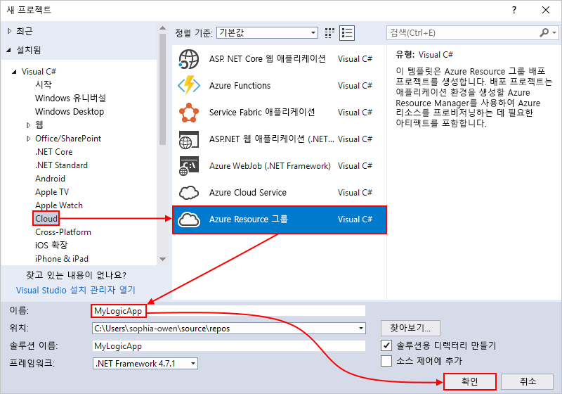

4. **Logic App** 템플릿을 선택합니다. 

   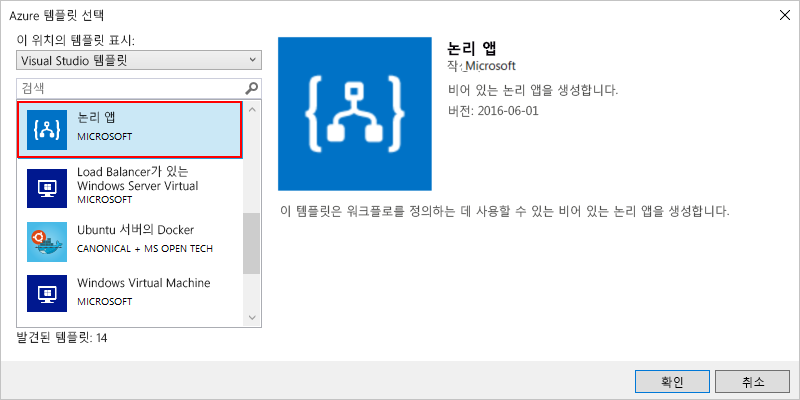

   Visual Studio에서 프로젝트를 만든 후 솔루션 탐색기가 열리고 솔루션이 표시됩니다. 

   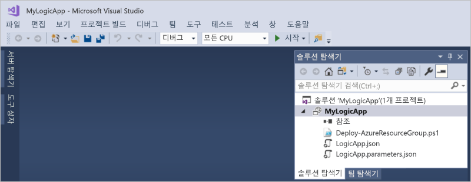

   솔루션에서 **LogicApp.json** 파일은 논리 앱에 대한 정의를 저장할 뿐 아니라 사용자가 배포를 위해 Azure Resource Manager 템플릿을 설정할 수도 있습니다.

## 빈 논리 앱을 만들기

Azure 리소스 그룹 프로젝트를 만든 후 **빈 논리 앱** 템플릿에서 시작한 논리 앱을 만들고 빌드합니다.

1. 솔루션 탐색기에서 **LogicApp.json** 파일에 대한 바로 가기 메뉴를 엽니다. **Logic Apps 디자이너를 사용하여 열기**를 선택합니다. (키보드: Ctrl+L)

   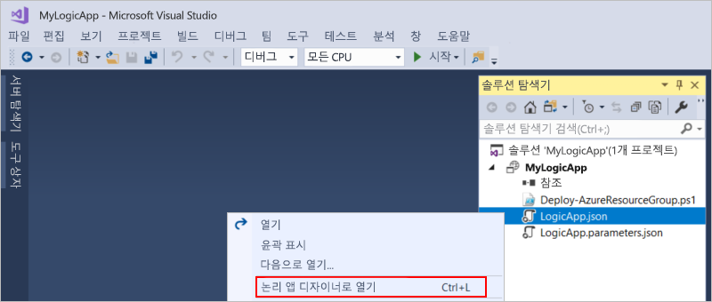

2. **구독**에 대해서는 사용할 Azure 구독을 선택합니다. **리소스 그룹**에 대해서는 **새로 만들기...** 를 선택해 새 Azure 리소스 그룹을 만듭니다. 

   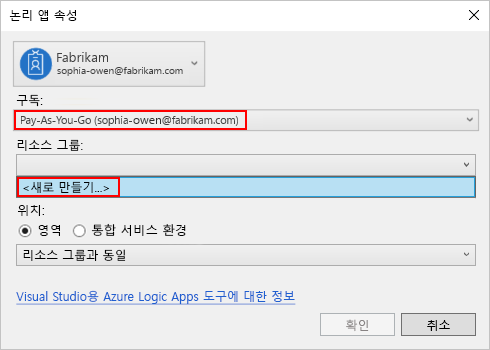

   Visual Studio는 논리 앱과 연결된 리소스 및 연결을 만들고 배포하기 위한 Azure 구독 및 리소스 그룹이 있어야 합니다. 

   | 설정 | 예제 값 | 설명 | 
   | ------- | ------------- | ----------- | 
   | 사용자 프로필 목록 | Contoso   jamalhartnett@contoso.com | 기본적으로 로그인하는 데 사용되는 계정 | 
   | **구독** | Pay-As-You-Go   (jamalhartnett@contoso.com) | Azure 구독 및 연결된 계정에 대한 이름 |
   | **리소스 그룹** | MyLogicApp-RG   (미국 서부) | 논리 앱에 대한 리소스를 저장하고 배포하기 위한 Azure 리소스 그룹 및 위치 | 
   | **위치**: | MyLogicApp-RG2   (미국 서부) | 리소스 그룹 위치를 사용하지 않으려면 다른 위치 |
   ||||

3. Logic Apps 디자이너가 열리고 소개 비디오 및 많이 사용되는 트리거가 포함된 페이지를 보여줍니다. 비디오 및 트리거를 거꾸로 스크롤합니다. **템플릿** 아래에서 **빈 논리 앱**을 선택합니다.

   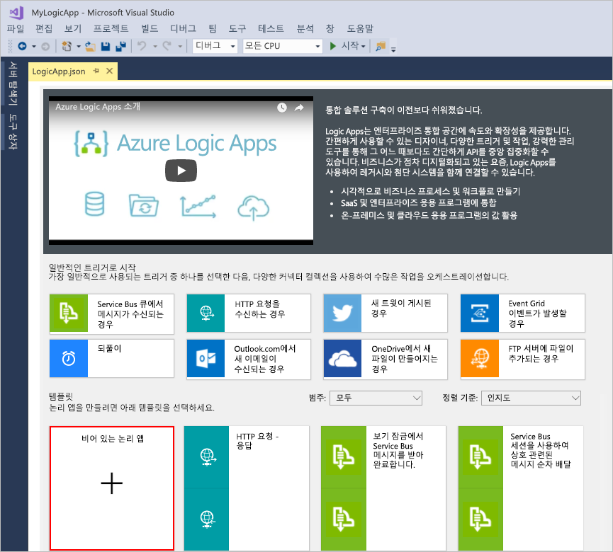

## 논리 앱 워크플로 빌드

다음으로, 새 RSS 피드 항목이 나타나면 실행되는 [트리거](../logic-apps/logic-apps-overview.md#logic-app-concepts)를 추가합니다. 모든 논리 앱은 특정 조건을 충족할 경우 발행하는 트리거로 시작해야 합니다. 트리거가 발생될 때마다 Logic Apps 엔진은 워크플로를 실행하는 논리 앱 인스턴스를 만듭니다.

1. Logic App 디자이너에서 검색 상자에 "rss"를 입력합니다. 이 트리거를 선택할 시기: **피드 항목이 게시되는 경우**

   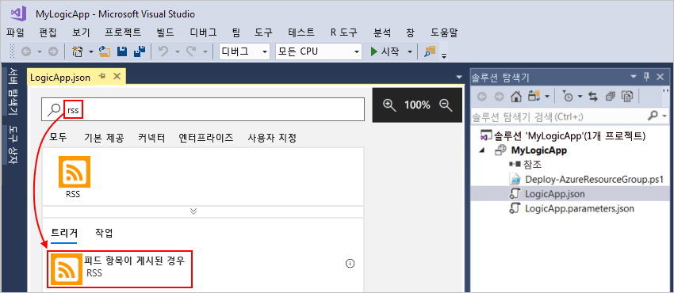

   트리거가 이제 디자이너에 표시됩니다.

   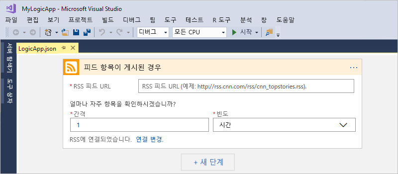

2. 논리 앱 빌드를 완료하려면 [Azure Portal 빠른 시작](../logic-apps/quickstart-create-first-logic-app-workflow.md#add-rss-trigger)에서 워크플로 단계를 따른 다음, 이 아티클을 반환합니다.

   완료 시 논리 앱은 다음 예와 같습니다. 

   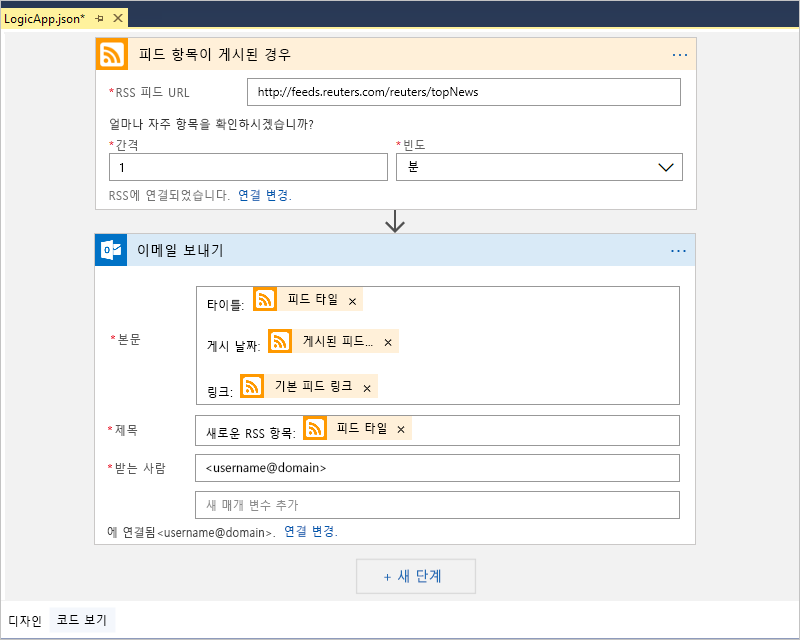

3. 논리 앱을 저장하려면 Visual Studio 솔루션을 저장합니다. (키보드: Ctrl + S)

이제, 논리 앱을 테스트하기 전에 Azure에 앱을 배포합니다.

## Azure에 논리 앱 배포

논리 앱을 실행하기 전에 먼저 몇 단계가 걸리는 Visual Studio에서 Azure에 앱을 배포합니다.

1. 프로젝트 바로 가기 메뉴의 솔루션 탐색기에서 **배포** > **새로 만들기**를 선택합니다. 메시지가 표시되면 Azure 계정으로 로그인합니다.

   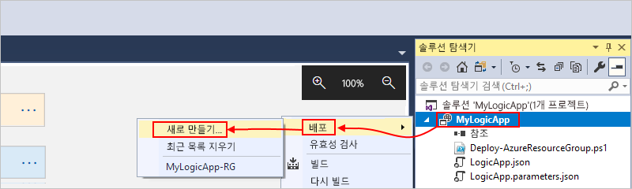

2. 이 배포에 대해서는 Azure 구독, 리소스 그룹 및 다른 기본 설정을 유지합니다. 준비가 되면 **배포**를 선택합니다. 

   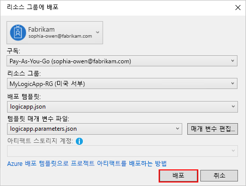

3. 예를 들어 **매개 변수 편집** 상자가 나타나는 경우 배포 시 사용할 논리 앱에 대한 리소스 이름을 제공한 다음, 설정을 저장 합니다.

   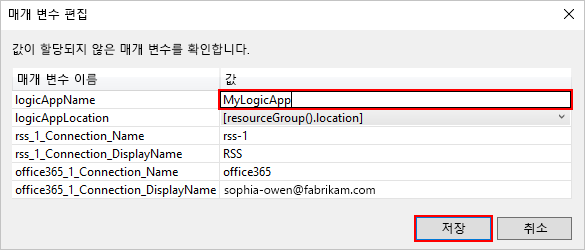

   배포가 시작되면 Visual Studio **출력** 창에 앱의 배포 상태가 표시됩니다. 
   상태가 표시되지 않으면 **출력 표시** 목록을 연 다음, Azure 리소스 그룹을 선택 합니다.

   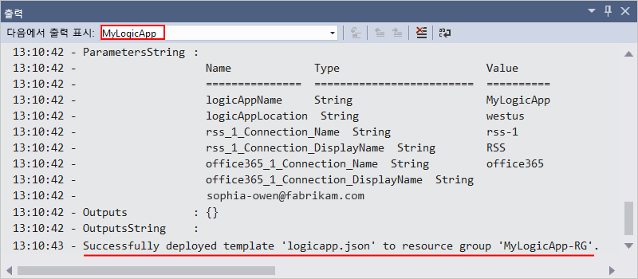

   사용자가 선택한 커넥터에 입력이 필요한 경우 백그라운드에 PowerShell 창이 열리고 필요한 암호 또는 비밀 키를 요청할 수 있습니다. 이 정보를 입력한 후에 배포가 계속됩니다.
   
   
   
   배포가 완료되면 논리 앱은 Azure Portal에 상존하며 지정된 일정(1분마다)에 따라 RSS 피드를 확인합니다. 
   RSS 피드에 새 항목이 있는 경우 논리 앱은 새 항목 각각에 전자 메일을 보냅니다. 
   그렇지 않으면, 논리 앱이 다시 확인하기 전에 다음 간격 때까지 대기합니다. 

   예를 들어 이 논리 앱이 보내는 샘플 이메일은 다음과 같습니다. 
   전자 메일을 받지 못한 경우 정크 메일 폴더를 확인합니다. 

   

   기술적으로 트리거가 RSS 피드를 확인하고 새 항목을 찾는 경우 해당 트리거가 실행되고 Logic Apps 엔진이 워크플로에서 동작을 실행하는 논리 앱 워크플로 인스턴스를 만듭니다.
   트리거가 새 항목을 찾지 못하면 해당 트리거는 실행되지 않고 워크플로 인스턴스화도 "건너뜁니다".

축하합니다. Visual Studio를 사용하여 논리 앱을 성공적으로 빌드하고 배포했습니다. 논리 앱을 관리하고 해당 실행 기록을 검토하려면 [Visual Studio를 사용하여 논리 앱 관리](../logic-apps/manage-logic-apps-with-visual-studio.md)를 참조합니다.

## 리소스 정리

더 이상 필요 없으면 논리 앱 및 관련 리소스가 포함된 리소스 그룹을 삭제하세요.

1. 논리 앱을 만드는 데 사용된 동일한 계정으로 <a href="https://portal.azure.com" target="_blank">Azure Portal</a>에 로그인합니다. 

2. Azure 기본 메뉴에서 **리소스 그룹**을 선택합니다.
논리 앱의 리소스 그룹을 선택하고 **개요**를 선택합니다.

3. **개요** 페이지에서 **리소스 그룹 삭제**를 선택합니다. 리소스 그룹 이름을 입력하여 확인하고, **삭제**를 선택합니다.

   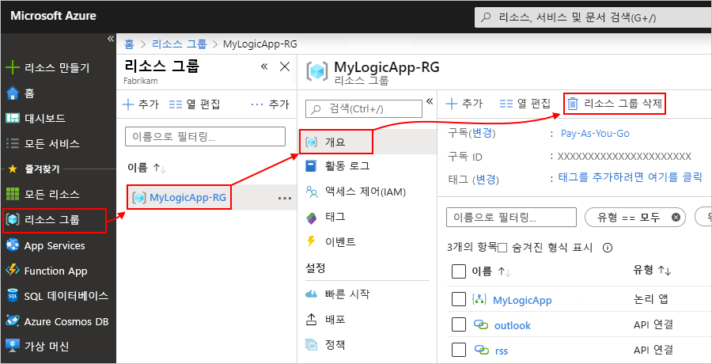

4. 로컬 컴퓨터에서 Visual Studio 솔루션을 삭제합니다.

## 지원 받기

* 질문이 있는 경우 <a href="https://social.msdn.microsoft.com/Forums/en-US/home?forum=azurelogicapps" target="_blank">Azure Logic Apps 포럼</a>을 방문해 보세요.
* 기능 아이디어를 제출하거나 투표하려면 <a href="https://aka.ms/logicapps-wish" target="_blank">Logic Apps 사용자 의견 사이트</a>를 방문하세요.

## 다음 단계

이 아티클에서는 Visual Studio를 사용하여 논리 앱을 빌드하고 배포하고 실행했습니다. Visual Studio를 사용하여 논리 앱에 대한 고급 배포를 관리하고 수행하는 방법을 자세히 알아보려면 이 아티클을 참조합니다.

> [!div class="nextstepaction"]
> * [Visual Studio에서 논리 앱 관리](../logic-apps/manage-logic-apps-with-visual-studio.md)
> * [Visual Studio를 사용하여 논리 앱에 배포 템플릿 만들기](../logic-apps/logic-apps-create-deploy-template.md)
