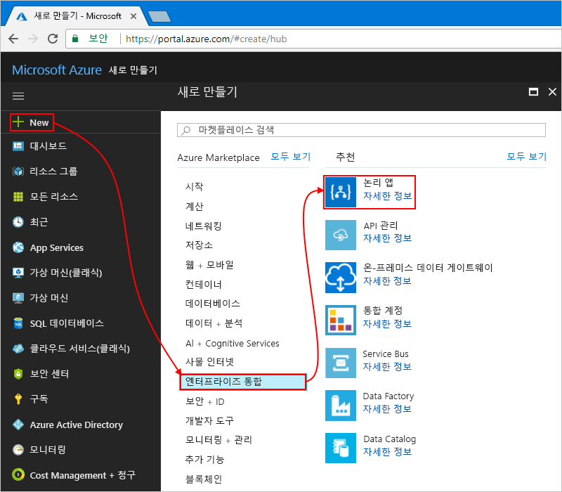

# <a name="process-emails-and-attachments-with-azure-logic-apps"></a>Azure Logic Apps로 이메일 및 첨부 파일 처리

Azure Logic Apps를 사용하면 워크플로를 자동화하고 Azure 서비스, Microsoft 서비스, 기타 SaaS(software-as-a-service) 앱 및 온-프레미스 시스템의 데이터를 통합할 수 있습니다. 이 자습서에서는 수신 이메일 및 첨부 파일을 처리하는 [논리 앱](../logic-apps/logic-apps-overview.md)을 빌드하는 방법을 보여줍니다. 이 논리 앱은 이러한 콘텐츠를 처리하고, Azure 저장소에 콘텐츠를 저장하고, 해당 콘텐츠를 검토하라는 알림을 보냅니다. 

이 자습서에서는 다음 방법에 대해 알아봅니다.

> [!div class="checklist"]
> * 저장된 이메일 및 첨부 파일을 확인할 수 있도록 [Azure 저장소](../storage/common/storage-introduction.md) 및 Storage 탐색기를 설정합니다.
> * 이메일에서 HTML을 제거하는 [Azure 함수](../azure-functions/functions-overview.md)를 만듭니다. 이 자습서에는 이 함수에 사용할 수 있는 코드가 포함되어 있습니다.
> * 빈 논리 앱을 만듭니다.
> * 이메일의 첨부 파일을 모니터링하는 트리거를 추가합니다.
> * 이메일에 첨부 파일이 있는지 확인하는 조건을 추가합니다.
> * 이메일에 첨부 파일이 있으면 Azure 함수를 호출하는 작업을 추가합니다.
> * 이메일 및 첨부 파일에 대한 저장소 BLOB을 만드는 작업을 추가합니다.
> * 이메일 알림을 보내는 작업을 추가합니다.

여기까지 모두 마치면 논리 앱이 이 워크플로와 비슷하게 보입니다.


Azure 구독이 아직 없는 경우 시작하기 전에 <a href="https://azure.microsoft.com/free/" target="_blank">Azure 체험 계정에 등록합니다</a>. 

## <a name="prerequisites"></a>필수 조건

* Office 365 Outlook, Outlook.com, Gmail 등 Logic Apps에서 지원되는 이메일 공급자의 이메일 계정. 다른 공급자에 대한 내용은 [여기서 커넥터 목록을 검토하세요](https://docs.microsoft.com/connectors/).

  이 논리 앱은 Office 365 Outlook 계정을 사용합니다. 
  다른 이메일 계정을 사용하는 경우 일반적인 단계는 동일하지만 UI가 약간 다르게 표시될 수 있습니다.

* <a href="https://storageexplorer.com/" target="_blank">체험판 Microsoft Azure Storage 탐색기</a>를 다운로드하여 설치합니다. 이 도구를 사용하여 저장소 컨테이너가 올바르게 설정되었는지 확인할 수 있습니다.

## <a name="sign-in-to-azure-portal"></a>Azure Portal에 로그인

Azure 계정 자격 증명을 사용하여 <a href="https://portal.azure.com" target="_blank">Azure Portal</a>에 로그인합니다.

## <a name="set-up-storage-to-save-attachments"></a>첨부 파일을 저장하도록 저장소 설정

수신 이메일 및 첨부 파일을 [Azure 저장소 컨테이너](../storage/common/storage-introduction.md)에 BLOB으로 저장할 수 있습니다. 

1. 저장소 컨테이너를 만들기 전에 다음 설정을 사용하여 [저장소 계정을 만듭니다](../storage/common/storage-create-storage-account.md#create-a-storage-account).

   | 설정 | 값 | 설명 | 
   |---------|-------|-------------| 
   | **Name** | attachmentstorageacct | 저장소 계정의 이름 | 
   | **배포 모델** | 리소스 관리자 | 리소스 배포를 관리하기 위한 [배포 모델](../azure-resource-manager/resource-manager-deployment-model.md) | 
   | **계정 종류** | 범용 가상 컴퓨터 | [저장소 계정 유형](../storage/common/storage-introduction.md#types-of-storage-accounts) | 
   | **위치**: | 미국 서부 | 저장소 계정에 대한 정보를 저장할 지역 | 
   | **복제** | LRS(로컬 중복 저장소) | 이 설정은 데이터가 복사, 저장, 관리 및 동기화되는 방식을 지정합니다. [복제](../storage/common/storage-introduction.md#replication)를 참조하세요. | 
   | **성능** | Standard | 이 설정은 지원되는 데이터 형식 및 데이터를 저장하기 위한 미디어를 지정합니다. [저장소 계정 유형](../storage/common/storage-introduction.md#types-of-storage-accounts)을 참조하세요. | 
   | **보안 전송 필요** | 사용 안 함 | 이 설정은 연결의 요청에 필요한 보안을 지정합니다. [보안 전송 필요](../storage/common/storage-require-secure-transfer.md)를 참조하세요. | 
   | **구독** | <*your-Azure-subscription-name*> | Azure 구독의 이름 | 
   | **리소스 그룹** | LA-Tutorial-RG | 관련 리소스를 구성하고 관리하는 데 사용되는 [Azure 리소스 그룹](../azure-resource-manager/resource-group-overview.md)의 이름. <p>**참고:** 리소스 그룹은 특정 지역 내에 있습니다. 일부 지역에서 이 자습서의 항목을 사용할 수 없을 수도 있지만, 가능하면 동일한 지역을 사용해 보세요. | 
   | **가상 네트워크 구성** | 사용 안 함 | 이 자습서에서는 **사용 안 함** 설정을 유지합니다. | 
   |||| 

   저장소 계정을 만들려면 [Azure PowerShell](../storage/common/storage-quickstart-create-storage-account-powershell.md) 또는 [Azure CLI](../storage/common/storage-quickstart-create-storage-account-cli.md)를 사용할 수도 있습니다.

2. Azure가 저장소 계정을 배포한 후에는 저장소 계정의 액세스 키를 가져옵니다.

   1. 저장소 계정 메뉴의 **설정** 아래에서 **액세스 키**를 선택합니다. 

   2. 저장소 계정 이름과 **key1**을 복사한 다음, 이러한 값을 안전한 곳에 저장합니다.

      

   저장소 계정의 액세스 키를 가져오려면 [Azure PowerShell](https://docs.microsoft.com/powershell/module/azurerm.storage/get-azurermstorageaccountkey) 또는 [Azure CLI](https://docs.microsoft.com/cli/azure/storage/account/keys?view=azure-cli-latest.md#az_storage_account_keys_list)를 사용할 수도 있습니다. 

3. 이메일 첨부 파일에 대한 Blob 저장소 컨테이너를 만듭니다.
   
   1. 저장소 계정 메뉴에서 **개요**를 선택합니다. 
   **서비스** 아래에서 **Blob**을 선택합니다.

      

   2. **컨테이너** 페이지가 열리면 도구 모음에서 **컨테이너**를 선택합니다. 

   3. **새 컨테이너** 아래에서 컨테이너 이름으로 "attachments"를 입력합니다. 
   **공용 액세스 수준** 아래에서 **컨테이너(컨테이너와 Blob에 대한 익명 읽기 액세스)** 를 선택한 다음, **확인**을 선택합니다.

      여기까지 마쳤으면 Azure Portal에서 저장소 계정의 저장소 컨테이너를 찾을 수 있습니다.

      

   저장소 컨테이너를 만들려면 [Azure PowerShell](https://docs.microsoft.com/powershell/module/azure.storage/new-azurestoragecontainer) 또는 [Azure CLI](https://docs.microsoft.com/cli/azure/storage/container?view=azure-cli-latest#az_storage_container_create)를 사용할 수도 있습니다. 

다음으로, Storage 탐색기를 저장소 계정에 연결합니다.

## <a name="set-up-storage-explorer"></a>Storage 탐색기 설정

이제 Storage 탐색기를 저장소 계정에 연결하여 논리 앱에서 첨부 파일을 Blob으로 저장소 컨테이너에 올바르게 저장하는지 확인할 수 있습니다.

1. Microsoft Azure Storage 탐색기를 엽니다. 

   Storage 탐색기에서 저장소 계정에 대한 연결을 묻는 메시지를 표시합니다. 

2. **Azure Storage에 연결** 창에서 **저장소 계정 이름 및 키 사용**을 선택하고 **다음**을 선택합니다. 

   

   > [!TIP]
   > 메시지가 표시되지 않으면 Storage 탐색기 도구 모음에서 **계정 추가**를 선택합니다.

3. **계정 이름** 아래에서 저장소 계정 이름을 제공합니다. **계정 키** 아래에서 이전에 저장한 액세스 키를 제공합니다. **다음**을 선택합니다.

4. 연결 정보를 확인한 다음, **연결**을 선택합니다. 

   Storage 탐색기에서 연결을 만들고, 탐색기 창의 **(Local and Attached)(로컬 및 첨부)** > **저장소 계정** 아래에 저장소 계정이 표시됩니다. 

5. **저장소 계정** 아래에서 Blob 저장소 컨테이너를 찾으려면 저장소 계정(여기서는 **attachmentstorageacct**), **Blob 컨테이너**(**attachments** 컨테이너가 있음)를 차례로 확장합니다. 예를 들면 다음과 같습니다. 

   

다음으로, 수신 이메일에서 HTML을 제거하는 [Azure 함수](../azure-functions/functions-overview.md)를 만듭니다.

## <a name="create-function-to-clean-html"></a>HTML을 정리하는 함수 만들기

이제 다음 단계에서 제공하는 코드 조각을 사용하여 수신 이메일에서 HTML을 제거하는 Azure 함수를 만듭니다. 이렇게 하면 이메일 콘텐츠를 좀 더 깨끗하게 정리하고 보다 쉽게 처리할 수 있습니다. 그런 후 논리 앱에서 이 함수를 호출할 수 있습니다.

1. 함수를 만들기 전에 다음 설정을 사용하여 [함수 앱을 만듭니다](../azure-functions/functions-create-function-app-portal.md).

   | 설정 | 값 | 설명 | 
   | ------- | ----- | ----------- | 
   | **앱 이름** | CleanTextFunctionApp | 전역적으로 고유하고 설명이 포함된 함수 앱 이름 | 
   | **구독** | <*your-Azure-subscription-name*> | 이전에 사용한 동일한 Azure 구독 | 
   | **리소스 그룹** | LA-Tutorial-RG | 이전에 사용한 동일한 Azure 리소스 그룹 | 
   | **호스팅 계획** | 소비 계획 | 이 설정은 계산 성능처럼 함수 앱을 실행하기 위한 리소스를 할당하고 크기를 조정하는 방법을 결정합니다. [호스팅 계획 비교](../azure-functions/functions-scale.md)를 참조하세요. | 
   | **위치**: | 미국 서부 | 이전에 사용한 동일한 지역 | 
   | **Storage** | cleantextfunctionstorageacct | 함수 앱에 대한 저장소 계정을 만듭니다. 소문자와 숫자만 사용할 수 있습니다. <p>**참고:** 이 저장소 계정은 함수 앱을 포함하며, 이전에 이메일 첨부 파일용으로 만든 저장소 계정과 다릅니다. | 
   | **Application Insights** | 꺼짐 | [Application Insights](../application-insights/app-insights-overview.md)를 통해 응용 프로그램 모니터링을 사용하도록 설정하지만, 이 자습서에서는 **해제** 설정을 선택합니다. | 
   |||| 

   배포 후 함수 앱이 자동으로 열리지 않으면 <a href="https://portal.azure.com" target="_blank">Azure Portal</a>에서 앱을 찾습니다. Azure 주 메뉴에서 **함수 앱**을 선택하고 해당 함수 앱을 선택합니다. 

   

   Azure 메뉴에 **함수 앱**이 표시되지 않으면 **모든 서비스**로 대신 이동합니다. 검색 상자에서 **함수 앱**을 찾아 선택합니다. 자세한 내용은 [함수 만들기](../azure-functions/functions-create-first-azure-function.md)를 참조하세요.

   그렇지 않으면 Azure에서 다음과 같이 함수 앱을 자동으로 엽니다.

   

   함수 앱을 만들려면 [Azure CLI](../azure-functions/functions-create-first-azure-function-azure-cli.md) 또는 [PowerShell 및 Resource Manager 템플릿](../azure-resource-manager/resource-group-template-deploy.md)을 사용할 수도 있습니다.

2. **함수 앱** 아래에서 **CleanTextFunctionApp**을 확장하고 **함수**를 선택합니다. 함수 도구 모음에서 **새 함수**를 선택합니다.

   

3. **아래 템플릿 선택 또는 빠른 시작으로 이동**아래에서 **시나리오** 목록을 열고 **Core**를 선택합니다. **HTTP 트리거** 템플릿에서 **C#** 을 선택합니다.

   

   > [!NOTE]
   > 이 예제에서는 C# 샘플 코드를 제공하므로 C#을 몰라도 예제를 따를 수 있습니다.

4. **새 함수** 창의 **이름** 아래에서 ```RemoveHTMLFunction```를 입력합니다. **권한 부여 수준**을 **함수**로 유지하고 **만들기**를 선택합니다.

   

5. 편집기가 열리면 템플릿 코드를 이 샘플 코드로 바꿉니다. 이 코드는 HTML을 제거하고 호출자에 결과를 반환합니다.

   ``` CSharp
   using System.Net;
   using System.Text.RegularExpressions;

   public static async Task<HttpResponseMessage> Run(HttpRequestMessage req, TraceWriter log)
   {
      log.Info($"HttpWebhook triggered");

      // Parse query parameter
      string emailBodyContent = await req.Content.ReadAsStringAsync();

      // Replace HTML with other characters
      string updatedBody = Regex.Replace(emailBodyContent, "<.*?>", string.Empty);
      updatedBody = updatedBody.Replace("\\r\\n", " ");
      updatedBody = updatedBody.Replace(@"&nbsp;", " ");

      // Return cleaned text
      return req.CreateResponse(HttpStatusCode.OK, new { updatedBody });
   }
   ```

6. 완료하면 **저장**을 선택합니다. 함수를 테스트하려면 편집기의 오른쪽 가장자리에 있는 화살표(**<**) 아이콘 아래에서 **테스트**를 선택합니다. 

   

7. **테스트** 창의 **요청 본문** 아래에서 다음 줄을 입력하고 **실행**을 선택합니다.

   ```json
   {"name": "<p><p>Testing my function</br></p></p>"}
   ```

   

   **출력** 창에 함수의 결과가 표시됩니다.

   ```json
   {"updatedBody":"{\"name\": \"Testing my function\"}"}
   ```

함수가 작동하는 것을 확인했으면 논리 앱을 만듭니다. 이 자습서에서는 이메일에서 HTML을 제거하는 함수를 만드는 방법을 보여 주지만, Logic Apps는 **HTML-Text** 커넥터도 제공합니다.

## <a name="create-your-logic-app"></a>논리 앱 만들기

1. Azure 주 메뉴에서 **리소스 만들기** > 
**통합** > **논리 앱**을 차례로 선택합니다.

   

2. 그림에 설명된 대로 **논리 앱 만들기** 아래에서 논리 앱에 대한 정보를 제공합니다. 완료면 **대시보드에 고정** > **만들기**를 선택합니다.

   

   | 설정 | 값 | 설명 | 
   | ------- | ----- | ----------- | 
   | **Name** | LA-ProcessAttachment | 논리 앱의 이름 | 
   | **구독** | <*your-Azure-subscription-name*> | 이전에 사용한 동일한 Azure 구독 | 
   | **리소스 그룹** | LA-Tutorial-RG | 이전에 사용한 동일한 Azure 리소스 그룹 |
   | **위치**: | 미국 서부 | 이전에 사용한 동일한 지역 | 
   | **Log Analytics** | 꺼짐 | 이 자습서에서는 **해제** 설정을 선택합니다. | 
   |||| 

3. Azure가 앱을 배포한 후에 Logic Apps 디자이너가 열리고 일반적인 논리 앱 패턴에 대한 소개 비디오 및 템플릿이 포함된 페이지를 보여줍니다. **템플릿** 아래에서 **빈 Logic App**을 선택합니다.

   

다음으로, 첨부 파일이 있는 수신 이메일을 수신 대기하는 [트리거](../logic-apps/logic-apps-overview.md#logic-app-concepts)를 추가합니다. 모든 논리 앱은 특정 이벤트가 발생하거나 새 데이터가 특정 조건을 충족할 때 실행되는 트리거를 통해 시작되어야 합니다. 자세한 내용은 [첫 번째 논리 앱 만들기](../logic-apps/quickstart-create-first-logic-app-workflow.md)를 참조하세요.

## <a name="monitor-incoming-email"></a>수신 이메일 모니터링

1. 디자이너의 검색 상자에서 필터로 "새 이메일이 도착하는 경우"를 입력합니다. 이메일 공급자에 대해 **새 이메일이 도착하는 경우 - <*your-email-provider*>** 트리거를 선택합니다.

   예: 

   

   * Azure 회사 또는 학교 계정에서 Office 365 Outlook을 선택합니다. 
   * Microsoft 개인 계정에서 Outlook.com을 선택합니다. 

2. 자격 증명을 요청하는 메시지가 표시되면 Logic Apps에서 이메일 계정에 연결할 수 있도록 이메일 계정에 로그인합니다.

3. 이제 트리거에서 새 이메일을 필터링하는 데 사용하는 조건을 입력합니다.

   1. 이메일 확인에 사용할 폴더, 간격 및 빈도를 지정합니다.

      

      | 설정 | 값 | 설명 | 
      | ------- | ----- | ----------- | 
      | **폴더** | 받은 편지함 | 확인할 이메일 폴더 | 
      | **간격** | 1 | 검사 간에 대기하는 간격의 수 | 
      | **Frequency(빈도)** | 분 | 검사 간 간격의 시간 단위 | 
      |  |  |  | 
  
   2. **고급 옵션 표시**를 선택하고 다음 설정을 지정합니다.

      | 설정 | 값 | 설명 | 
      | ------- | ----- | ----------- | 
      | **첨부 파일 있음** | 예 | 첨부 파일이 있는 이메일만 받습니다. <p>**참고:** 이 트리거는 계정에서 이메일을 제거하지는 않으며, 새 메시지만 확인하여 제목 필터와 일치하는 이메일만 처리합니다. | 
      | **첨부 파일 포함** | 예 | 첨부 파일을 확인하는 데서 그치지 않고 첨부 파일을 워크플로의 입력으로 가져옵니다. | 
      | **제목 필터** | ```Business Analyst 2 #423501``` | 이메일 제목에서 찾을 텍스트 | 
      |  |  |  | 

4. 지금은 트리거 세부 정보를 숨기려면 트리거의 제목 표시줄 내부를 클릭합니다.

   

5. 논리 앱을 저장합니다. 디자이너 도구 모음에서 **저장**을 선택합니다.

   이제 논리 앱이 라이브 상태지만 이메일 확인 외에는 아무 것도 수행하지 않습니다. 
   다음으로, 워크플로를 계속하는 조건을 지정하는 조건을 추가합니다.

## <a name="check-for-attachments"></a>첨부 파일 확인

이제 첨부 파일이 있는 이메일만 선택하는 조건을 추가합니다.

1. 트리거 아래에서 **새 단계** > **조건 추가**를 차례로 선택합니다.

   

2. 보다 구체적인 설명이 포함되도록 조건 이름을 바꿉니다.

   1. 조건의 제목 표시줄에서 **줄임표**(**...** ) 단추 > **이름 바꾸기**를 선택합니다.

      

   2. ```If email has attachments and key subject phrase``` 설명이 포함되도록 조건 이름을 바꿉니다.

3. 첨부 파일이 있는 이메일을 확인하는 조건을 만듭니다. 

   1. **And** 아래의 첫 번째 행에서 왼쪽 상자 내부를 클릭합니다. 
   표시되는 동적 콘텐츠 목록에서 **첨부 파일 있음** 속성을 선택합니다.

      

   2. 중간 상자에서 **이(가) 다음과 같은 경우** 연산자를 유지합니다.

   3. 오른쪽 상자에서 트리거의 **첨부 파일 있음** 속성 값과 비교할 값으로 **True**를 입력합니다.

      

      두 값이 같으면 이메일에 첨부 파일이 하나 이상 있는 것이며, 조건을 통과하고, 워크플로가 계속됩니다.

   코드 편집기 창에서 볼 수 있는 기본 논리 앱 정의에서 이 조건은 다음 예제와 같습니다.

   ```json
   "Condition": {
      "actions": { <actions-to-run-when-condition-passes> },
      "expression": {
         "and": [ {
            "equals": [
               "@triggerBody()?['HasAttachment']",
                 "True"
            ]
         } ]
      },
      "runAfter": {},
      "type": "If"
   }
   ```

4. 논리 앱을 저장합니다. 디자이너 도구 모음에서 **저장**을 선택합니다.

### <a name="test-your-condition"></a>조건 테스트

이제 조건이 올바르게 작동하는지 테스트합니다.

1. 아직 논리 앱을 실행하고 있지 않으면 디자이너 도구 모음에서 **실행**을 선택합니다.

   이 단계에서는 지정된 간격이 경과할 때까지 기다릴 필요 없이 논리 앱을 수동으로 시작합니다. 
   하지만 받은 편지함에 테스트 이메일이 도착할 때까지는 아무 일도 발생하지 않습니다. 

2. 다음 기준을 충족하는 이메일을 자신에게 보냅니다.

   * 트리거의 **제목 필터**에서 지정한 텍스트(```Business Analyst 2 #423501```)가 이메일의 제목에 포함되어 있습니다.

   * 이메일에 첨부 파일이 하나 있습니다. 
   이제 빈 텍스트 파일을 하나 만들고 해당 파일을 이메일에 첨부합니다.

   이메일이 도착하면 논리 앱에서는 첨부 파일 및 지정된 제목 텍스트를 확인합니다.
   조건을 통과하면 트리거가 실행되고 Logic Apps 엔진이 논리 앱 인스턴스를 만들고 워크플로를 시작합니다. 

3. 트리거가 실행되고 논리 앱이 성공적으로 실행되었는지 확인하려면 논리 앱 메뉴에서 **개요**를 선택합니다.

   

   트리거가 성공적으로 실행되었지만 논리 앱이 트리거되지 않았거나 실행되지 않은 경우 [논리 앱 문제 해결](../logic-apps/logic-apps-diagnosing-failures.md)을 참조하세요.

다음으로, **true인 경우** 분기에 대해 수행할 작업을 정의합니다. 첨부 파일과 함께 이메일을 저장하려면 이메일 본문에서 HTML을 제거한 후 이메일 및 첨부 파일용 저장소 컨테이너에 BLOB을 만듭니다.

> [!NOTE]
> 이메일에 첨부 파일이 없는 경우에는 논리 앱이 **false인 경우** 분기에 대해 아무 것도 할 필요가 없습니다. 이 자습서를 마친 후 추가 연습으로 **false인 경우** 분기에 대해 수행할 적절한 작업을 추가할 수 있습니다.

## <a name="call-removehtmlfunction"></a>RemoveHTMLFunction 호출

이 단계에서는 이전에 만든 Azure 함수를 논리 앱에 추가하고, 이메일 트리거의 이메일 본문 내용을 이 함수로 전달합니다.

1. 논리 앱 메뉴에서 **논리 앱 디자이너**를 선택합니다. **true인 경우** 분기에서 **작업 추가**를 선택합니다.

   

2. 검색 상자에서 "Azure 함수"를 찾고 **Azure 함수 선택 - Azure Functions** 작업을 선택합니다.

   

3. 이전에 만든 함수 앱 **CleanTextFunctionApp**을 선택합니다.

   

4. 이제 **RemoveHTMLFunction** 함수를 선택합니다.

   

5. ```Call RemoveHTMLFunction to clean email body``` 설명을 사용하여 함수 셰이프 이름을 바꿉니다.

6. 이제 함수에서 처리할 입력을 지정합니다. 

   1. **요청 본문** 아래에서 후행 공백이 있는 다음 텍스트를 입력합니다. 
   
      ```{ "emailBody": ``` 

      다음 단계에서 이 입력을 처리하는 동안 입력이 JSON 형식으로 올바르게 지정될 때까지 잘못된 JSON에 대한 오류가 표시됩니다.
      앞에서 이 함수를 테스트할 때 이 함수에 지정된 입력에서 JSON(JavaScript Object Notation)을 사용했습니다. 
      따라서 요청 본문에서도 동일한 형식을 사용해야 합니다.

      또한 커서가 **요청 본문** 상자 안에 있으면 이전 작업에서 사용할 수 있는 속성 값을 선택할 수 있도록 동적 콘텐츠 목록이 표시됩니다. 
      
   2. 동적 콘텐츠 목록의 **새 이메일이 도착하는 경우** 아래에서 **본문** 속성을 선택합니다. 이 속성 뒤에는 닫는 중괄호(```}```)를 추가해야 합니다.

      

   완료되면 함수에 대한 입력이 다음 예제와 같습니다.

   

7. 논리 앱을 저장합니다.

다음으로, 이메일 본문을 저장할 수 있도록 저장소 컨테이너에 Blob을 만드는 작업을 추가합니다.

## <a name="create-blob-for-email-body"></a>이메일 본문용 BLOB 만들기

1. **True인 경우** 블록의 Azure 함수 아래에서 **작업 추가**를 선택합니다. 

2. 검색 상자에서 필터로 "Blob 만들기"를 입력하고, **Blob 만들기 - Azure Blob Storage** 작업을 선택합니다.

   

3. 아래에 나와 있는 대로 이러한 설정을 사용하여 저장소 계정에 대한 연결을 만듭니다. 작업을 완료하면 **만들기**를 선택합니다.

   

   | 설정 | 값 | 설명 | 
   | ------- | ----- | ----------- | 
   | **연결 이름** | AttachmentStorageConnection | 연결에 대해 설명하는 이름 | 
   | **Storage 계정** | attachmentstorageacct | 앞에서 첨부 파일 저장용으로 만든 저장소 계정의 이름 | 
   |||| 

4. **설명이 포함되도록**BLOB 만들기```Create blob for email body``` 작업 이름을 바꿉니다.

5. **Blob 만들기** 작업에서 이 정보를 입력하고, Blob을 만들기 위해 아래에 나와 있는 대로 이러한 필드를 선택합니다.

   

   | 설정 | 값 | 설명 | 
   | ------- | ----- | ----------- | 
   | **폴더 경로** | /attachments | 앞에서 만든 컨테이너의 경로 및 이름입니다. 이 예제에서는 폴더 아이콘을 클릭한 다음, "/attachments" 컨테이너를 선택합니다. | 
   | **Blob 이름** | **보내는 사람** 필드 | 이 예제에서는 보낸 사람의 이름을 Blob의 이름으로 사용합니다. 이 상자 내부를 클릭하여 동적 콘텐츠 목록을 표시한 다음, **새 이메일이 도착하는 경우** 작업 아래에서 **보내는 사람** 필드를 선택합니다. | 
   | **BLOB 콘텐츠** | **콘텐츠** 필드 | 이 예제에서는 HTML이 없는 이메일 본문을 Blob 콘텐츠로 사용합니다. 이 상자 내부를 클릭하여 동적 콘텐츠 목록을 표시한 다음, **RemoveHTMLFunction을 호출하여 이메일 본문 정리** 아래에서 **본문**을 선택합니다. |
   |||| 

   완료되면 작업은 다음 예제와 같습니다.

   

6. 논리 앱을 저장합니다. 

### <a name="check-attachment-handling"></a>첨부 파일 처리 확인

이제 논리 앱이 사용자가 지정한 방식으로 이메일을 처리하는지 테스트합니다.

1. 아직 논리 앱을 실행하고 있지 않으면 디자이너 도구 모음에서 **실행**을 선택합니다.

2. 다음 기준을 충족하는 이메일을 자신에게 보냅니다.

   * 트리거의 **제목 필터**에서 지정한 텍스트(```Business Analyst 2 #423501```)가 이메일의 제목에 포함되어 있습니다.

   * 이메일에 첨부 파일이 하나 이상 있습니다. 
   이제 빈 텍스트 파일을 하나 만들고 해당 파일을 이메일에 첨부합니다.

   * 이메일 본문에 테스트 콘텐츠가 포함되어 있으며 예를 들면 다음과 같습니다. 

     ```
     Testing my logic app
     ```

   트리거가 성공적으로 실행되었지만 논리 앱이 트리거되지 않았거나 실행되지 않은 경우 [논리 앱 문제 해결](../logic-apps/logic-apps-diagnosing-failures.md)을 참조하세요.

3. 논리 앱이 이메일을 올바른 저장소 컨테이너에 저장했는지 확인합니다. 

   1. Storage 탐색기에서 **(로컬 또는 연결된)** > 
   **저장소 계정** > **attachmentstorageacct (외부)** > 
   **BLOB 컨테이너** > **첨부 파일**을 확장합니다.

   2. 이메일의 **첨부 파일** 컨테이너를 선택합니다. 

      아직 논리 앱에서 처리한 첨부 파일이 없기 때문에 지금은 컨테이너에 이메일만 표시됩니다.

      

   3. 작업을 마쳤으면 Storage 탐색기에서 이메일을 삭제합니다.

4. 필요에 따라**false인 경우** 분기(지금은 아무 작업도 수행하지 않음)를 테스트하려면 조건을 만족하지 않는 이메일을 보내면 됩니다.

다음으로, 모든 이메일 첨부 파일을 처리할 루프를 추가합니다.

## <a name="process-attachments"></a>첨부 파일 처리

이메일의 각 첨부 파일을 처리하려면 논리 앱의 워크플로에 **For each** 루프를 추가합니다.

1. **이메일 본문용 Blob 만들기** 셰이프 아래에서 **자세히** > **For each 추가**를 차례로 선택합니다.

   

2. ```For each email attachment``` 설명이 포함되도록 루프 이름을 바꿉니다.

3. 이제 루프에서 처리할 데이터를 지정합니다. **이전 단계에서 출력 선택** 상자 내부를 클릭하여 동적 콘텐츠 목록을 연 다음, **첨부 파일**을 선택합니다. 

   

   **첨부 파일** 필드는 이메일에 포함된 모든 첨부 파일이 있는 배열을 전달합니다. 
   **For each** 루프는 배열을 통해 전달되는 항목마다 작업을 반복합니다.

4. 논리 앱을 저장합니다.

다음으로, 각 첨부 파일을 **첨부 파일** 저장소 컨테이너에 BLOB으로 저장하는 작업을 추가합니다.

## <a name="create-blob-for-each-attachment"></a>For each 첨부 파일용 Blob 만들기

1. 검색된 각 첨부 파일에서 수행할 작업을 지정할 수 있도록 **For each 이메일 첨부 파일** 루프에서 **작업 추가**를 선택합니다.

   

2. 검색 상자에서 필터로 "Blob 만들기"를 입력한 다음, **Blob 만들기 - Azure Blob Storage** 작업을 선택합니다.

   

3. **설명이 포함되도록**BLOB 2 만들기```Create blob for each email attachment``` 작업 이름을 바꿉니다.

4. **For each 이메일 첨부파일용 Blob 만들기** 작업에서 이 정보를 제공하고, 아래에 나와 있는 대로 만들려는 각 Blob에 대한 속성을 선택합니다.

   

   | 설정 | 값 | 설명 | 
   | ------- | ----- | ----------- | 
   | **폴더 경로** | /attachments | 앞에서 만든 컨테이너의 경로 및 이름입니다. 이 예제에서는 폴더 아이콘을 클릭한 다음, "/attachments" 컨테이너를 선택합니다. | 
   | **Blob 이름** | **이름** 필드 | 이 예제에서는 첨부 파일의 이름을 Blob의 이름으로 사용합니다. 이 상자 내부를 클릭하여 동적 콘텐츠 목록을 표시한 다음, **새 이메일이 도착하는 경우** 작업 아래에서 **이름** 필드를 선택합니다. | 
   | **BLOB 콘텐츠** | **콘텐츠** 필드 | 이 예제에서는 **콘텐츠** 필드를 Blob 콘텐츠로 사용합니다. 이 상자 내부를 클릭하여 동적 콘텐츠 목록을 표시한 다음, **새 이메일이 도착하는 경우** 작업 아래에서 **콘텐츠** 필드를 선택합니다. |
   |||| 

   완료되면 작업은 다음 예제와 같습니다.

   

5. 논리 앱을 저장합니다. 

### <a name="check-attachment-handling"></a>첨부 파일 처리 확인

다음으로, 논리 앱이 사용자가 지정한 방식으로 첨부 파일을 처리하는지 테스트합니다.

1. 아직 논리 앱을 실행하고 있지 않으면 디자이너 도구 모음에서 **실행**을 선택합니다.

2. 다음 기준을 충족하는 이메일을 자신에게 보냅니다.

   * 트리거의 **제목 필터**에서 지정한 텍스트(```Business Analyst 2 #423501```)가 이메일의 제목에 포함되어 있습니다.

   * 이메일에 첨부 파일이 두 개 이상 있습니다. 
   이제 빈 텍스트 파일을 두 개 만들고 해당 파일을 이메일에 첨부합니다.

   트리거가 성공적으로 실행되었지만 논리 앱이 트리거되지 않았거나 실행되지 않은 경우 [논리 앱 문제 해결](../logic-apps/logic-apps-diagnosing-failures.md)을 참조하세요.

3. 논리 앱이 이메일과 첨부 파일을 올바른 저장소 컨테이너에 저장했는지 확인합니다. 

   1. Storage 탐색기에서 **(로컬 또는 연결된)** > 
   **저장소 계정** > **attachmentstorageacct (외부)** > 
   **BLOB 컨테이너** > **첨부 파일**을 확장합니다.

   2. 이메일 및 첨부 파일용 **첨부 파일** 컨테이너를 확인합니다.

      

   3. 작업을 마쳤으면 Storage 탐색기에서 이메일 및 첨부 파일을 삭제합니다.

다음으로, 논리 앱에서 첨부 파일을 검토하라는 이메일을 보낼 수 있도록 작업을 추가합니다.

## <a name="send-email-notifications"></a>이메일 알림 보내기

1. **true인 경우** 분기의 **For each 이메일 첨부 파일** 루프에서 **작업 추가**를 선택합니다. 

   

2. 검색 상자에서 필터로 "이메일 보내기"를 입력한 다음, 이메일 공급자에 대한 "이메일 보내기" 작업을 선택합니다. 

   작업 목록을 특정 서비스로 필터링하려면 먼저 커넥터를 선택할 수 있습니다.

   

   * Azure 회사 또는 학교 계정에서 Office 365 Outlook을 선택합니다. 
   * Microsoft 개인 계정에서 Outlook.com을 선택합니다. 

3. 자격 증명을 입력하라는 메시지가 나타나면 Logic Apps가 이메일 계정에 대한 연결을 만들 수 있도록 이메일 계정에 로그인합니다.

4. ```Send email for review``` 설명이 포함되도록 **이메일 보내기** 작업 이름을 바꿉니다.

5. 이 작업에 대한 정보를 입력하고, 아래에 나와 있는 대로 이메일에 포함할 필드를 선택합니다. 편집 상자에서 빈 줄을 추가하려면 Shift + Enter 키를 누릅니다.  

   

   동적 콘텐츠 목록에서 필요한 필드를 찾을 수 없는 경우 **새 이메일이 도착하는 경우** 옆에 있는 **자세히 보기**를 선택합니다. 

   | 설정 | 값 | 메모 | 
   | ------- | ----- | ----- | 
   | **본문** | ```Please review new applicant:``` <p>```Applicant name: ``` **보내는 사람** <p>```Application file location: ``` **경로** <p>```Application email content: ``` **본문** | 이메일의 본문 콘텐츠입니다. 이 상자 내부를 클릭하고, 예제 텍스트를 입력한 다음, 동적 콘텐츠 목록에서 다음 필드를 선택합니다. <p>- **새 이메일 도착하는 경우** 아래의 **보내는 사람** 필드 </br>- **이메일 본문용 BLOB 만들기** 아래의 **경로** 필드 </br>- **RemoveHTMLFunction을 호출하여 이메일 본문 지우기** 아래의 **본문** 필드 | 
   | **제목**  | ```ASAP - Review applicant for position: ``` **제목** | 포함하려는 이메일 제목입니다. 이 상자 내부를 클릭하고, 예제 텍스트를 입력한 다음, 동적 콘텐츠 목록의 **새 이메일이 도착하는 경우** 아래에서 **제목** 필드를 선택합니다. | 
   | **To** | <*recipient-email-address*> | 자신의 이메일 주소를 사용하여 테스트할 수 있습니다. | 
   |||| 

   > [!NOTE] 
   > 첨부 파일이 포함된 배열인 **콘텐츠** 필드와 같은 배열이 있는 필드를 선택하면, 디자이너에서 해당 필드를 참조하는 작업 주위에 "For each" 루프를 자동으로 추가합니다. 그렇게 하면 논리 앱이 각 배열 항목에서 해당 작업을 수행할 수 있습니다. 루프를 제거하려면 배열에 대한 필드를 제거하고, 참조하는 작업을 루프 외부로 이동하고, 루프의 제목 표시줄에서 줄임표(**...**)를 선택하고, **삭제**를 선택합니다.
     
6. 논리 앱을 저장합니다. 

이제 다음 예제와 같이 논리 앱을 테스트합니다.


## <a name="run-your-logic-app"></a>논리 앱 실행

1. 다음 기준을 충족하는 이메일을 자신에게 보냅니다.

   * 트리거의 **제목 필터**에서 지정한 텍스트(```Business Analyst 2 #423501```)가 이메일의 제목에 포함되어 있습니다.

   * 이메일에 첨부 파일이 하나 이상 있습니다. 
   이전 단계에서 만든 빈 텍스트 파일을 다시 사용할 수 있습니다. 
   보다 현실적인 시나리오를 원한다면 이력서 파일을 첨부합니다.

   * 이메일 본문에 다음 텍스트가 있으며, 이 텍스트를 복사하여 붙여넣을 수 있습니다.

     ```
     Name: Jamal Hartnett   
     
     Street address: 12345 Anywhere Road   
     
     City: Any Town   
     
     State or Country: Any State   
     
     Postal code: 00000   
     
     Email address: jamhartnett@outlook.com   
     
     Phone number: 000-000-0000   
     
     Position: Business Analyst 2 #423501   

     Technical skills: Dynamics CRM, MySQL, Microsoft SQL Server, JavaScript, Perl, Power BI, Tableau, Microsoft Office: Excel, Visio, Word, PowerPoint, SharePoint, and Outlook   

     Professional skills: Data, process, workflow, statistics, risk analysis, modeling; technical writing, expert communicator and presenter, logical and analytical thinker, team builder, mediator, negotiator, self-starter, self-managing  
     
     Certifications: Six Sigma Green Belt, Lean Project Management   
     
     Language skills: English, Mandarin, Spanish   
     
     Education: Master of Business Administration   
     ```

2. 논리 앱을 실행합니다. 성공적으로 실행되면 논리 앱에서 이 예제와 비슷한 이메일을 보냅니다.

   

   이메일을 받지 못한 경우 이메일의 정크 폴더를 확인합니다. 
   이메일 정크 필터가 이러한 종류의 메일을 리디렉션할 수 있습니다. 
   그렇지 않으면 논리 앱이 올바르게 실행되는지 모르는 경우 [논리 앱 문제 해결](../logic-apps/logic-apps-diagnosing-failures.md)을 참조하세요.

축하드립니다. 여러 Azure 서비스에서 작업을 자동화하고 일부 사용자 지정 코드를 호출하는 논리 앱을 만들어서 실행하셨습니다.

## <a name="clean-up-resources"></a>리소스 정리

더 이상 필요 없으면 논리 앱 및 관련 리소스가 포함된 리소스 그룹을 삭제하세요. Azure 주 메뉴에서 **리소스 그룹**으로 이동한 다음, 논리 앱에 대한 리소스 그룹을 선택합니다. **리소스 그룹 삭제**를 선택합니다. 리소스 그룹 이름을 입력하여 확인하고, **삭제**를 선택합니다.


## <a name="get-support"></a>지원 받기

* 질문이 있는 경우 [Azure Logic Apps 포럼](https://social.msdn.microsoft.com/Forums/en-US/home?forum=azurelogicapps)을 방문해 보세요.
* 기능 아이디어를 제출하거나 투표하려면 [Logic Apps 사용자 의견 사이트](http://aka.ms/logicapps-wish)를 방문하세요.

## <a name="next-steps"></a>다음 단계

이 자습서에서는 Azure Storage 및 Azure Functions 같은 Azure 서비스를 통합하여 이메일 첨부 파일을 처리하고 저장하는 논리 앱을 만들었습니다. 지금부터는 논리 앱을 빌드하는 데 사용할 수 있는 다른 커넥터에 대해서 알아보세요.

> [!div class="nextstepaction"]
> [Logic Apps용 커넥터 자세히 알아보기](../connectors/apis-list.md)
