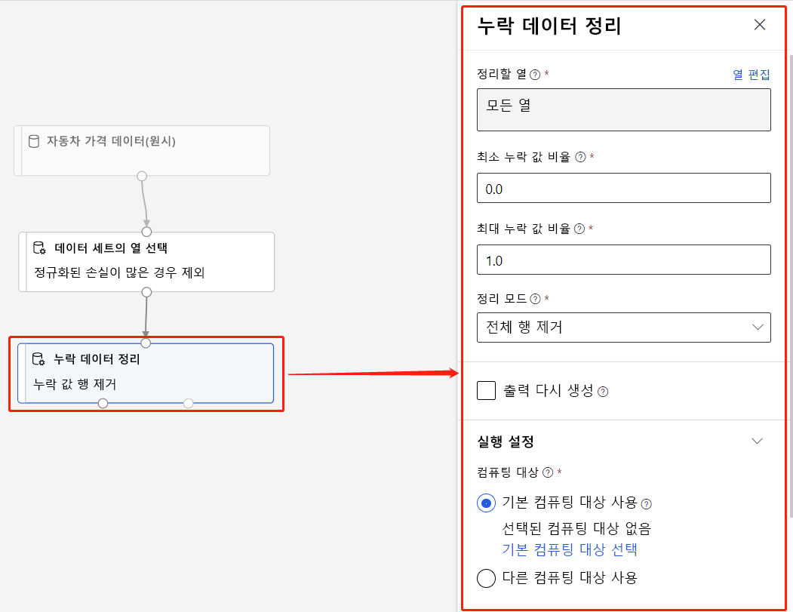

# Azure Machine Learning 디자이너(미리 보기)란 무엇인가요? 
[!INCLUDE [applies-to-skus](../../includes/aml-applies-to-enterprise-sku.md)]

Azure Machine Learning 디자이너를 사용하면 대화형 캔버스의 [데이터 집합](#datasets) 및 [모듈을](#module) 시각적으로 연결하여 기계 학습 모델을 만들 수 있습니다. 디자이너를 시작하는 방법을 알아보려면 [자습서: 디자이너와 함께 자동차 가격 예측](tutorial-designer-automobile-price-train-score.md) 을 참조하세요.

디자이너는 Azure 기계 학습 [작업 영역을](concept-workspace.md) 사용하여 다음과 같은 공유 리소스를 구성합니다.

+ [파이프라인](#pipeline)
+ [데이터 세트](#datasets)
+ [Compute 리소스](#compute)
+ [등록된 모델](concept-azure-machine-learning-architecture.md#models)
+ [게시된 파이프라인](#publish)
+ [실시간 엔드포인트](#deploy)

## 모델 교육 및 배포

디자이너는 기계 학습 모델을 빌드, 테스트 및 배포할 수 있는 시각적 캔버스를 제공합니다. 디자이너를 사용하면 다음을 수행할 수 있습니다.

+ [데이터 집합](#datasets) 및 [모듈을](#module) 캔버스에 끌어놓습니다.
+ 모듈을 함께 연결하여 [파이프라인 초안을](#pipeline-draft)작성합니다.
+ Azure 기계 학습 작업 영역에서 계산 리소스를 사용하여 [파이프라인 실행을](#pipeline-run) 제출합니다.
+ 교육 **파이프라인을** **추론 파이프라인으로 변환합니다.**
+ 파이프라인을 REST 파이프라인 **끝점에** [게시하여](#publish) 다른 매개 변수 및 데이터 집합을 사용하여 새 파이프라인 실행을 제출합니다.
    + 매개 변수 및 데이터 집합을 변경하는 동안 단일 파이프라인을 재사용하여 여러 모델을 학습하는 **교육 파이프라인을** 게시합니다.
    + 일괄 **처리 추론 파이프라인을** 게시하여 이전에 학습된 모델을 사용하여 새 데이터를 예측합니다.
+ 실시간 **추론 파이프라인을** 실시간 엔드포인트에 [배포하여](#deploy) 새로운 데이터에 대한 예측을 실시간으로 할 수 있습니다.

## 파이프라인

[파이프라인은](concept-azure-machine-learning-architecture.md#ml-pipelines) 데이터 집합과 분석 모듈로 구성되며, 이 모듈은 함께 연결합니다. 파이프라인에는 여러 가지 용도가 있습니다: 단일 모델을 학습하는 파이프라인또는 여러 모델을 학습하는 파이프라인을 만들 수 있습니다. 예측을 실시간으로 또는 일괄처리하는 파이프라인을 만들거나 데이터만 정리하는 파이프라인을 만들 수 있습니다. 파이프라인을 사용하면 작업을 재사용하고 프로젝트를 구성할 수 있습니다.

### 파이프라인 초안

디자이너에서 파이프라인을 편집하면 진행률이 **파이프라인 초안으로**저장됩니다. 모듈 추가 또는 제거, 계산 대상 구성, 매개 변수 작성 등을 통해 언제든지 파이프라인 초안을 편집할 수 있습니다.

유효한 파이프라인에는 다음과 같은 특성이 있습니다.

* 데이터 집합은 모듈에만 연결할 수 있습니다.
* 모듈은 데이터 집합 또는 다른 모듈에만 연결할 수 있습니다.
* 모듈의 모든 입력 포트는 데이터 흐름에 일부 연결이 있어야 합니다.
* 각 모듈에 필요한 모든 매개 변수를 설정해야 합니다.

파이프라인 초안을 실행할 준비가 되면 파이프라인 실행을 제출합니다.

### 파이프라인 실행

파이프라인을 실행할 때마다 파이프라인의 구성과 그 결과는 **파이프라인 실행으로**작업 영역에 저장됩니다. 파이프라인 실행으로 돌아가 문제 해결 또는 감사 목적으로 검사할 수 있습니다. 파이프라인 실행을 **복제하여** 편집할 새 파이프라인 초안을 만듭니다.

파이프라인 실행은 실행 기록을 구성하기 위한 [실험으로](concept-azure-machine-learning-architecture.md#experiments) 그룹화됩니다. 모든 파이프라인 실행에 대한 실험을 설정할 수 있습니다. 

## 데이터 세트

기계 학습 데이터 집합을 사용하면 데이터에 쉽게 액세스하고 작업할 수 있습니다. 여러 샘플 데이터 집합을 디자이너에 포함하여 실험해 볼 수 있습니다. 필요에 따라 더 많은 데이터 집합을 [등록할](how-to-create-register-datasets.md) 수 있습니다.

## Module

모듈은 데이터에 대해 수행할 수 있는 알고리즘입니다. 디자이너는 데이터 수집 함수에서 교육, 채점 및 유효성 검사 프로세스에 이르는 다양한 모듈을 보유하고 있습니다.

모듈에는 모듈 내부 알고리즘을 구성하는 데 사용할 수 있는 매개 변수 집합이 포함될 수 있습니다. 캔버스에서 모듈을 선택할 때 모듈 매개 변수가 캔버스 오른쪽의 속성 창에 표시됩니다. 해당 창에서 매개 변수를 수정하여 모델을 튜닝할 수 있습니다. 디자이너의 개별 모듈에 대한 계산 리소스를 설정할 수 있습니다. 

사용 가능한 기계 학습 알고리즘 라이브러리를 탐색하는 데 도움이 되는 몇 가지 도움말은 [알고리즘 & 모듈 참조 개요를](algorithm-module-reference/module-reference.md) 참조하십시오.

## 리소스 계산

작업 영역에서 계산 리소스를 사용하여 파이프라인을 실행하고 배포된 모델을 실시간 끝점 또는 파이프라인 끝점(일괄 처리 추론)으로 호스트합니다. 지원되는 컴퓨팅 대상은 다음과 같습니다.

| 컴퓨팅 대상 | 학습 | 배포 |
| ---- |:----:|:----:|
| Azure Machine Learning 컴퓨팅 | ✓ | |
| Azure Kubernetes Service | | ✓ |

계산 대상은 Azure [기계 학습 작업 영역에](concept-workspace.md)연결됩니다. [Azure 기계 학습 스튜디오(클래식)의](https://ml.azure.com)작업 영역에서 계산 대상을 관리합니다.

## 배포

실시간 추론을 수행하려면 파이프라인을 **실시간 끝점으로**배포해야 합니다. 실시간 끝점은 외부 응용 프로그램과 점수 매기기 모델 간의 인터페이스를 만듭니다. 실시간 끝점에 대한 호출은 예측 결과를 실시간으로 응용 프로그램에 반환합니다. 실시간 끝점을 호출하려면 끝점을 배포할 때 생성된 API 키를 전달합니다. 끝점은 웹 프로그래밍 프로젝트에서 널리 사용되는 아키텍처 인 REST를 기반으로합니다.

실시간 엔드포인트는 Azure Kubernetes 서비스 클러스터에 배포해야 합니다.

모델을 배포하는 방법에 대해 알아보려면 [자습서: 디자이너와 함께 기계 학습 모델 배포](tutorial-designer-automobile-price-deploy.md)를 참조하십시오.

## 게시

파이프라인을 **파이프라인 끝점에**게시할 수도 있습니다. 실시간 엔드포인트와 마찬가지로 파이프라인 끝점을 사용하면 REST 호출을 사용하여 외부 응용 프로그램에서 새 파이프라인 실행을 제출할 수 있습니다. 그러나 파이프라인 끝점을 사용하여 실시간으로 데이터를 보내거나 받을 수는 없습니다.

게시된 파이프라인은 유연하며 모델을 교육 또는 재교육하고, [일괄 처리 추론을 수행하고,](how-to-run-batch-predictions-designer.md)새 데이터를 처리하는 등의 데 사용할 수 있습니다. 여러 파이프라인을 단일 파이프라인 끝점에 게시하고 실행할 파이프라인 버전을 지정할 수 있습니다.

게시된 파이프라인은 각 모듈의 파이프라인 초안에서 정의한 계산 리소스에서 실행됩니다.

디자이너는 SDK와 동일한 [게시파이프라인](https://docs.microsoft.com/python/api/azureml-pipeline-core/azureml.pipeline.core.graph.publishedpipeline?view=azure-ml-py) 개체를 만듭니다.

## 시각적 인터페이스에서 디자이너로 이동

시각적 인터페이스(미리 보기)가 업데이트되었으며 이제 Azure 기계 학습 디자이너(미리 보기)가 되었습니다. 디자이너는 Azure 기계 학습의 다른 기능과 완전히 통합되는 파이프라인 기반 백 엔드를 사용하도록 다시 설계되었습니다. 

이러한 업데이트의 결과로 시각적 인터페이스에 대한 몇 가지 개념과 용어가 변경되거나 이름이 변경되었습니다. 가장 중요한 개념적 변경 사항은 아래 표를 참조하십시오. 

| 디자이너의 개념 | 이전에는 시각적 인터페이스에서 |
| ---- |:----:|
| 파이프라인 초안 | 실험 |
| 실시간 엔드포인트 | 웹 서비스 |

### 디자이너로 마이그레이션

기존 시각적 인터페이스 실험 및 웹 서비스를 디자이너의 파이프라인 및 실시간 끝점으로 변환할 수 있습니다. 다음 단계를 사용하여 시각적 인터페이스 자산을 마이그레이션합니다.

[!INCLUDE [migrate from the visual interface](../../includes/aml-vi-designer-migration.md)]

## 다음 단계

* [튜토리얼: 설계자와 함께 자동차 가격 예측](tutorial-designer-automobile-price-train-score.md)
* 기존 [디자이너 샘플을](samples-designer.md) 수정하여 필요에 맞게 조정하는 방법을 알아봅니다.

