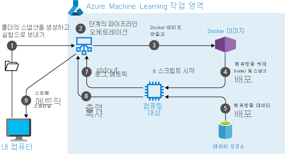

# <a name="what-are-azure-machine-learning-pipelines"></a>Azure Machine Learning 파이프라인 이란?

Azure Machine Learning 파이프라인을 사용 하 여 Machine Learning 프로젝트에서 워크플로를 만들 수 있습니다. 이러한 워크플로에는 다음과 같은 다양 한 이점이 있습니다. 

+ 단순성
+ 속도
+ 반복성
+ 유연성
+ 버전 관리 및 추적
+ 성과 
+ 품질 보증
+ 비용 제어

이러한 이점은 machine learning 프로젝트가 순수한 탐색을 벗어나 반복으로 이동 하는 즉시 중요 합니다. 간단한 1 단계 파이프라인도 중요할 수 있습니다. 기계 학습 프로젝트는 종종 복잡 한 상태 이며 단일 워크플로의 정확한 이룰 있었습니다을 간단 하 게 처리할 수 있도록 하는 릴리프 일 수 있습니다.

[첫 번째 파이프라인을 만드는](how-to-create-your-first-pipeline.md) 방법을 알아봅니다.


<a name="compare"></a>
### <a name="which-azure-pipeline-technology-should-i-use"></a>어떤 Azure 파이프라인 기술을 사용 해야 하나요?

Azure 클라우드는 각각 다른 용도로 여러 다른 파이프라인을 제공 합니다. 다음 표에서는 다양 한 파이프라인 및 사용 되는 방법을 보여 줍니다.

| 파이프라인 | 수행하는 작업 | 정식 파이프 |
| ---- | ---- | ---- |
| 파이프라인 Azure Machine Learning | 기계 학습 시나리오에 대 한 템플릿으로 사용할 수 있는 재사용 가능한 기계 학습 워크플로를 정의 합니다. | 데이터 > 모델 |
| [Azure Data Factory 파이프라인](https://docs.microsoft.com/azure/data-factory/concepts-pipelines-activities) | 작업을 수행 하는 데 필요한 데이터 이동, 변환 및 제어 작업을 그룹화 합니다.  | 데이터 > 데이터 |
| [Azure Pipelines](https://azure.microsoft.com/services/devops/pipelines/) | 모든 플랫폼/모든 클라우드에 응용 프로그램의 지속적인 통합 및 전달  | 코드 > 앱/서비스 |

## <a name="what-can-azure-ml-pipelines-do"></a>Azure ML 파이프라인에서 수행할 수 있는 작업은 무엇 인가요?

Azure Machine Learning 파이프라인은 전체 기계 학습 작업에 대해 독립적으로 실행 되는 워크플로입니다. 하위 작업은 파이프라인 내에서 일련의 단계로 캡슐화됩니다. Azure Machine Learning 파이프라인은 Python 스크립트를 호출 하는 것 처럼 간단할 수 있으므로 어떤 것 _이라도 수행할 수 있습니다._ 파이프라인은 다음과 같은 기계 학습 작업에 집중 _해야 합니다_ .

+ 데이터 준비(가져오기, 유효성 검사 및 정리, 마이닝/변환, 정규화 및 준비 포함)
+ 학습 구성(인수 매개 변수화, 파일 경로 및 구성 로깅/보고 포함)
+ 효율적이 고 반복적으로 학습 및 유효성 검사, 특정 데이터 하위 집합 지정, 다양 한 하드웨어 계산 리소스, 분산 처리 및 진행률 모니터링이 포함 될 수 있습니다.
+ 배포(버전 관리, 크기 조정, 프로비저닝 및 액세스 제어 포함) 

독립적인 단계를 통해 여러 데이터 과학자가 과도 한 처리 시간이 소모 계산 리소스 없이 동시에 동일한 파이프라인에서 작업할 수 있습니다. 또한 별도의 단계를 통해 각 단계에 서로 다른 계산 형식/크기를 쉽게 사용할 수 있습니다.

파이프라인 설계 후에는 종종 파이프라인의 학습 루프를 미세 조정합니다. 파이프라인을 다시 실행 하면 실행이 업데이트 된 학습 스크립트와 같이 다시 실행 해야 하는 단계로 이동 합니다. 다시 실행할 필요가 없는 단계는 건너뜁니다. 단계의 이룰 있었습니다에 사용 되는 변경 되지 않은 스크립트에도 동일한 분석이 적용 됩니다. 이러한 재사용 기능을 사용 하면 기본 데이터가 변경 되지 않은 경우 데이터 수집 및 변환과 같은 비용이 많이 들고 시간이 많이 걸리는 단계를 실행 하지 않아도 됩니다.

Azure Machine Learning를 사용 하 여 파이프라인의 각 단계에 대 한 다양 한 도구 키트와 프레임 워크 (예: PyTorch 또는 TensorFlow)를 사용할 수 있습니다. Azure는 사용 하는 다양 한 [계산 대상을](service/concept-azure-machine-learning-architecture.md) 조정 하므로 다운스트림 계산 대상과 중간 데이터를 공유할 수 있습니다.

Azure Portal 또는 [작업 영역 방문 페이지 (미리 보기)](https://ml.azure.com)에서 직접 [파이프라인 실험의 메트릭을 추적할](https://docs.microsoft.com/azure/machine-learning/service/how-to-track-experiments) 수 있습니다. 파이프라인이 게시 된 후에는 모든 플랫폼 또는 스택에서 파이프라인을 다시 실행할 수 있는 REST 끝점을 구성할 수 있습니다.

간단히 말해서, 기계 학습 수명 주기의 모든 복잡 한 작업은 파이프라인에 도움이 될 수 있습니다. 다른 Azure 파이프라인 기술에는 데이터 작업을 위한 [파이프라인 Azure Data Factory](https://docs.microsoft.com/azure/data-factory/concepts-pipelines-activities) , 연속 통합 및 배포를 위한 [Azure Pipelines](https://azure.microsoft.com/services/devops/pipelines/) 등의 고유한 강도가 있습니다. 그러나 사용자의 포커스가 machine learning 인 경우 Azure Machine Learning 파이프라인이 워크플로 요구에 가장 적합 한 선택이 될 수 있습니다. 

## <a name="what-are-azure-ml-pipelines"></a>Azure ML 파이프라인 이란?

Azure ML 파이프라인은 순서가 지정 된 일련의 단계를 통해 완전 한 논리적 워크플로를 수행 합니다. 각 단계는 불연속 처리 작업입니다. 파이프라인은 Azure Machine Learning [실험](https://docs.microsoft.com/python/api/azureml-core/azureml.core.experiment.experiment?view=azure-ml-py)의 컨텍스트에서 실행 됩니다.

ML 프로젝트의 초기 단계에서는 Azure 작업 영역 및 리소스 구성의 모든 작업을 수행 하는 단일 Jupyter 노트북 또는 Python 스크립트, 데이터 준비, 실행 구성, 학습 및 유효성 검사를 사용할 수 있습니다. 그러나 함수 및 클래스가 단일 명령적 코드 블록에 신속 하 게 선호 되는 것 처럼 ML 워크플로는 모놀리식 노트북 또는 스크립트에 빠르게 활용 됩니다. 

모듈화 ML 작업을 통해 파이프라인은 구성 요소가 "한 가지 작업을 수행 해야 합니다."를 수행 해야 하는 컴퓨터 과학을 지원 합니다. 모듈화는 팀에서 프로그래밍 하는 경우 프로젝트 성공을 명확 하 게 하는 데 매우 중요 하지만, 단독으로 작업 하는 경우에도 작은 ML 프로젝트에는 별도의 작업이 포함 되지만 각각의 복잡성이 적절 합니다. 작업에는 작업 영역 구성 및 데이터 액세스, 데이터 준비, 모델 정의 및 구성, 배포 등이 있습니다. 하나 이상의 작업에 대 한 출력은 다른 작업에 대 한 입력을 구성 하지만, 한 작업에 대 한 정확한 구현 세부 정보는 다음에는 관련성이 없는 것이 가장 좋습니다. 최악의 경우 한 작업의 계산 상태에서 다른 작업의 버그를 발생 시킬 수 있습니다. 

### <a name="analyzing-dependencies"></a>종속성 분석

많은 프로그래밍 에코 시스템 리소스, 라이브러리 또는 컴파일 종속성을 오케스트레이션 하는 도구를 포함 합니다. 일반적으로 이러한 도구는 파일 타임 스탬프를 사용 하 여 종속성을 계산 합니다. 파일이 변경 되 면 해당 파일 및 해당 종속 파일만 업데이트 (다운로드, 다시 컴파일 또는 패키지) 됩니다. Azure ML 파이프라인은이 개념을 크게 확장 합니다. 기존 빌드 도구와 마찬가지로 파이프라인은 단계 간의 종속성을 계산 하 고 필요한 재계산만 수행 합니다. 

Azure ML 파이프라인에서 종속성 분석은 단순한 타임 스탬프 보다 더 정교 합니다. 모든 단계는 다른 하드웨어 및 소프트웨어 환경에서 실행 될 수 있습니다. 데이터 준비는 시간이 많이 소요 될 수 있지만, 강력한 Gpu를 사용 하는 하드웨어에서 실행할 필요가 없습니다. 특정 단계에는 OS 관련 소프트웨어가 필요할 수 있으며, 분산 교육 등을 사용 하는 등의 작업을 할 수 있습니다. 리소스를 최적화 하는 비용을 절감할 수 있지만 하드웨어 및 소프트웨어 리소스의 다양 한 변화를 수동으로 따를 하는 것은 어려울 수 있습니다. 단계 사이에서 전송 하는 데이터에는 실수를 하지 않고 모든 작업을 수행 하는 것이 더 어렵습니다. 

파이프라인은이 문제를 해결 합니다. Azure Machine Learning은 파이프라인 단계 간의 모든 종속성을 자동으로 오케스트레이션 합니다. 이 오케스트레이션에는 Docker 이미지 회전, 계산 리소스 연결 및 분리, 단계 간 데이터 이동이 일관 되 고 자동으로 포함 될 수 있습니다.

### <a name="reusing-results"></a>결과 다시 사용

또한 단계 출력을 선택 하는 경우 다시 사용 해야 할 수도 있습니다. 다시 사용을 지정 하는 경우 다시 계산을 트리거하는 업스트림 종속성이 없는 경우 파이프라인 서비스는 단계의 결과에 대 한 캐시 된 버전을 사용 합니다. 이러한 재사용은 개발 시간을 크게 줄일 수 있습니다. 복잡 한 데이터 준비 작업이 있는 경우에는 반드시 필요한 것 보다 더 자주 다시 실행할 수 있습니다. 파이프라인은이에 대 한 걱정을 완화 합니다. 필요한 경우 단계가 실행 됩니다 (그렇지 않은 경우).

이 모든 종속성 분석, 오케스트레이션 및 활성화는 [파이프라인](https://docs.microsoft.com/python/api/azureml-pipeline-core/azureml.pipeline.core.pipeline(class)?view=azure-ml-py) 개체를 인스턴스화하고 `Experiment`에 전달 하 고 `submit()`를 호출 하는 경우 Azure Machine Learning에 의해 처리 됩니다. 

### <a name="coordinating-the-steps-involved"></a>관련 단계 조정

`Pipeline` 개체를 만들고 실행 하는 경우 다음과 같은 개략적인 단계가 발생 합니다.

+ 각 단계에서 서비스는 다음에 대 한 요구 사항을 계산 합니다.
    + 하드웨어 계산 리소스
    + OS 리소스 (Docker 이미지)
    + 소프트웨어 리소스 (Conda/virtualenv 종속성)
    + 데이터 입력 
+ 서비스는 단계 간 종속성을 확인 하 여 동적 실행 그래프를 생성 합니다.
+ 실행 그래프의 각 노드가 실행 될 때:
    + 이 서비스는 필요한 하드웨어 및 소프트웨어 환경을 구성 합니다 (기존 리소스를 다시 사용 하는 경우).
    + 포함 하는 `Experiment` 개체에 로깅 및 모니터링 정보를 제공 하는 단계가 실행 됩니다.
    + 단계가 완료 되 면 해당 출력은 다음 단계에 대 한 입력으로 준비 되 고 저장소에 기록 됩니다.
    + 더 이상 필요 하지 않은 리소스는 종료 및 분리 됨



## <a name="building-pipelines-with-the-python-sdk"></a>Python SDK를 사용 하 여 파이프라인 빌드

[Azure Machine Learning PYTHON SDK](https://docs.microsoft.com/python/api/overview/azure/ml/install?view=azure-ml-py)에서 파이프라인은 `azureml.pipeline.core` 모듈에 정의 된 python 개체입니다. [파이프라인](https://docs.microsoft.com/python/api/azureml-pipeline-core/azureml.pipeline.core.pipeline%28class%29?view=azure-ml-py) 개체는 하나 이상의 [PipelineStep](https://docs.microsoft.com/python/api/azureml-pipeline-core/azureml.pipeline.core.builder.pipelinestep?view=azure-ml-py) 개체의 순서가 지정 된 시퀀스를 포함 합니다. `PipelineStep` 클래스는 추상적 이며 실제 단계는 [EstimatorStep](https://docs.microsoft.com/python/api/azureml-pipeline-steps/azureml.pipeline.steps.estimatorstep?view=azure-ml-py), [PythonScriptStep](https://docs.microsoft.com/python/api/azureml-pipeline-steps/azureml.pipeline.steps.pythonscriptstep?view=azure-ml-py)또는 [DataTransferStep](https://docs.microsoft.com/python/api/azureml-pipeline-steps/azureml.pipeline.steps.datatransferstep?view=azure-ml-py)와 같은 서브 클래스입니다. [Modulestep](https://docs.microsoft.com/python/api/azureml-pipeline-steps/azureml.pipeline.steps.modulestep?view=azure-ml-py) 클래스는 파이프라인 간에 공유할 수 있는 재사용 가능한 단계 시퀀스를 포함 합니다. `Pipeline` `Experiment`의 일부로 실행 됩니다.

Azure ML 파이프라인은 Azure Machine Learning 작업 영역에 연결 되 고 파이프라인 단계는 해당 작업 영역 내에서 사용할 수 있는 계산 대상과 연결 됩니다. 자세한 내용은 [Azure Portal에서 Azure Machine Learning 작업 영역 만들기 및 관리](https://docs.microsoft.com/azure/machine-learning/service/how-to-manage-workspace) 또는 [Azure Machine Learning에서 계산 대상 이란?](https://docs.microsoft.com/azure/machine-learning/service/concept-compute-target)를 참조 하세요.

Azure Machine Learning에서 계산 대상은 ML 단계가 수행 되는 환경입니다. 소프트웨어 환경은 원격 VM, Azure Machine Learning 계산, Azure Databricks, Azure Batch 등이 될 수 있습니다. 또한 하드웨어 환경은 GPU 지원, 메모리, 저장소 등에 따라 크게 달라질 수 있습니다. 각 단계에 대 한 계산 대상을 지정 하 여 비용을 세밀 하 게 제어할 수 있습니다. 프로젝트의 특정 작업, 데이터 볼륨 및 성능 요구 사항에 대해 보다 강력 하거나 더 강력 하지 않은 리소스를 사용할 수 있습니다. 

## <a name="building-pipelines-with-the-designer"></a>디자이너를 사용 하 여 파이프라인 빌드

시각적 디자인 화면을 선호 하는 개발자는 Azure Machine Learning 디자이너를 사용 하 여 파이프라인을 만들 수 있습니다. 작업 영역 홈페이지의 **디자이너** 선택 영역에서이 도구에 액세스할 수 있습니다.  디자이너를 사용 하 여 디자인 화면으로 단계를 끌어서 놓을 수 있습니다. 신속한 개발을 위해 ML 작업의 스펙트럼에서 기존 모듈을 사용할 수 있습니다. 기존 모듈은 배포에 대 한 학습에 대 한 데이터 변환에서 알고리즘 선택에 이르기까지 모든 것을 다룹니다. 또는 Python 스크립트에 정의 된 고유한 단계를 결합 하 여 완전 한 사용자 지정 파이프라인을 만들 수 있습니다.

파이프라인을 시각적으로 디자인 하는 경우 단계의 입력 및 출력이 눈에 띄게 표시 됩니다. 데이터 연결을 끌어서 놓을 수 있으므로 파이프라인의 데이터 흐름을 빠르게 이해 하 고 수정할 수 있습니다.
 


### <a name="understanding-the-execution-graph"></a>실행 그래프 이해

파이프라인 내의 단계에는 다른 단계에 대 한 종속성이 있을 수 있습니다. Azure ML 파이프라인 서비스는 이러한 종속성을 분석 하 고 오케스트레이션 하는 작업을 수행 합니다. 결과 "실행 그래프"의 노드는 처리 단계입니다. 각 단계에는 하드웨어 및 소프트웨어의 특정 조합을 만들거나 재사용 하 고, 캐시 된 결과를 다시 사용 하는 등의 작업이 포함 될 수 있습니다. 서비스의 오케스트레이션 및이 실행 그래프의 최적화는 ML 단계를 크게 단축 하 고 비용을 절감할 수 있습니다. 

단계는 독립적으로 실행 되기 때문에 단계 간에 흐르는 입력 및 출력 데이터를 포함 하는 개체는 외부에서 정의 해야 합니다. 이는 [Datareference](https://docs.microsoft.com/python/api/azureml-core/azureml.data.data_reference.datareference?view=azure-ml-py), [PipelineData](https://docs.microsoft.com/python/api/azureml-pipeline-core/azureml.pipeline.core.pipelinedata?view=azure-ml-py)및 연결 된 클래스의 역할입니다. 이러한 데이터 개체는 저장소 구성을 캡슐화 하는 데이터 [저장소](https://docs.microsoft.com/python/api/azureml-core/azureml.core.datastore%28class%29?view=azure-ml-py) 개체와 연결 됩니다. `PipelineStep` 기본 클래스는 항상 `name` 문자열, `inputs`목록 및 `outputs`목록으로 만들어집니다. 일반적으로 `arguments` 목록이 있으며 `resource_inputs`목록이 포함 될 수도 있습니다. 서브 클래스에는 일반적으로 추가 인수도 있습니다. 예를 들어 `PythonScriptStep`에는 실행할 스크립트의 파일 이름과 경로가 필요 합니다. 

실행 그래프는 비순환 이지만 파이프라인은 되풀이 일정으로 실행 될 수 있으며 상태 정보를 파일 시스템에 쓸 수 있는 Python 스크립트를 실행 하 여 복잡 한 프로필을 만들 수 있습니다. 특정 단계가 병렬로 또는 비동기적으로 실행 될 수 있도록 파이프라인을 디자인 하는 경우 Azure Machine Learning는 종속성 분석과 팬 아웃 및 팬의 조정을 투명 하 게 처리 합니다. 일반적으로 실행 그래프의 세부 정보를 고려 하지 않아도 되지만 [파이프라인. graph](https://docs.microsoft.com/python/api/azureml-pipeline-core/azureml.pipeline.core.pipeline.pipeline?view=azure-ml-py#attributes) 특성을 통해 사용할 수 있습니다. 


### <a name="a-simple-python-pipeline"></a>간단한 Python 파이프라인

이 코드 조각은 기본 `Pipeline`를 만들고 실행 하는 데 필요한 개체 및 호출을 보여 줍니다.

```python
ws = Workspace.from_config() 
blob_store = Datastore(ws, "workspaceblobstore")
compute_target = ws.compute_targets["STANDARD_NC6"]
experiment = Experiment(ws, 'MyExperiment') 

input_data = DataReference(
    datastore=Datastore(ws, blob_store),
    data_reference_name="test_data",
    path_on_datastore="20newsgroups/20news.pkl")

output_data = PipelineData(
    "output_data",
    datastore=blob_store,
    output_name="output_data1")

steps = [ PythonScriptStep(
    script_name="train.py",
    arguments=["--input", input_data, "--output", output_data],
    inputs=[input_data],
    outputs=[output_data],
    compute_target=compute_target,
    source_directory="myfolder"
) ]

pipeline = Pipeline(workspace=ws, steps=steps)

pipeline_run = experiment.submit(pipeline)
pipeline_run.wait_for_completion()
```

코드 조각은 일반적인 Azure Machine Learning 개체, `Workspace`, `Datastore`, [ComputeTarget](https://docs.microsoft.com/python/api/azureml-core/azureml.core.computetarget?view=azure-ml-py)및 `Experiment`로 시작 합니다. 그런 다음 코드는 `input_data` 및 `output_data`를 유지 하기 위해 개체를 만듭니다. 배열 `steps`에는 데이터 개체를 사용 하 고 `compute_target`에서 실행할 `PythonScriptStep` 단일 요소가 포함 됩니다. 그런 다음 코드는 작업 영역 및 단계 배열을 전달 하 여 `Pipeline` 개체 자체를 인스턴스화합니다. `experiment.submit(pipeline)`에 대 한 호출은 Azure ML 파이프라인 실행을 시작 합니다. `wait_for_completion()` 호출은 파이프라인이 완료 될 때까지 차단 됩니다. 

파이프라인을 데이터에 연결 하는 방법에 대 한 자세한 내용은 [데이터에 액세스 하는 방법](how-to-access-data.md) 및 데이터 [집합을 등록](how-to-create-register-datasets.md)하는 방법 문서를 참조 하세요. 

## <a name="best-practices-when-using-pipelines"></a>파이프라인 사용에 대 한 모범 사례

여기에서 볼 수 있듯이 Azure ML 파이프라인 만들기는 스크립트를 시작 하는 것 보다 약간 더 복잡 합니다. 파이프라인을 구성 하 고 만들려면 몇 가지 Python 개체를 구성 해야 합니다. 

파이프라인 사용을 제안 하는 경우는 다음과 같습니다.

* 팀 환경에서: 개발자가 프로그램을 독립적으로 작동 하 고 진화 시킬 수 있도록 ML 작업을 여러 독립적인 단계로 나눕니다. 

* 또는 거의 배포 하는 경우: 구성을 손톱 하 고 예약 된 작업 및 이벤트 기반 작업을 사용 하 여 변경 된 데이터를 유지 합니다.

* ML 프로젝트의 초기 단계에서 또는 작업 단독으로 사용: 파이프라인을 사용 하 여 빌드를 자동화 합니다. 새 아이디어를 구현 하기 전에 구성 및 계산 상태를 다시 만드는 것에 대 한 걱정을 시작한 경우에는 파이프라인을 사용 하 여 워크플로를 자동화 하는 것을 고려할 수 있습니다. 

캐시 된 결과 다시 사용, 계산 비용에 대 한 세분화 된 제어 및 프로세스 격리를 열정적 수 있을 뿐만 아니라 파이프라인에는 비용이 듭니다. 일부 앤티앨리어싱 패턴은 다음과 같습니다.

* 파이프라인을 유일한 수단으로 사용 하 여 문제를 구분 합니다. Python의 기본 제공 함수, 개체 및 모듈은 혼란 스 러 울 수 있는 긴 방법으로 진행 됩니다. 파이프라인 단계는 함수 호출 보다 훨씬 더 비쌉니다.

* 파이프라인 단계 간 과도 결합. 종속 단계를 리팩터링 하는 경우가 자주 이전 단계의 출력을 수정 해야 하는 경우에는 별도의 단계가 현재 혜택 보다 비용이 더 많이 들 수 있습니다. 단계가 과도 하 게 결합 됨을 나타내는 또 다른 단서는 데이터가 아닌 단계에 대 한 인수 이지만 처리를 제어 하는 플래그입니다. 

* 계산 리소스를 조기에 최적화 합니다. 예를 들어 데이터를 준비 하는 데 몇 가지 단계를 수행 하는 경우가 종종 있습니다. 여기에는 병렬 프로그래밍을 위해 `MpiStep`를 사용할 수 있지만, 여기서는 강력 하지 않은 계산 대상이 포함 된 `PythonScriptStep`를 사용할 수 있는 위치가 있습니다. 그리고 장기 실행에서는 특히를 다시 계산 하는 대신 캐시 된 결과를 사용할 가능성이 있는 경우, 특히이 처럼 세분화 된 단계를 만들 수 있습니다. 그러나 파이프라인은 `multiprocessing` 모듈을 대체 하기 위한 것이 아닙니다. 

프로젝트가 크거나 같은 배포를 받을 때까지 파이프라인은 세분화 된 것이 아니라 성긴 이어야 합니다. ML 프로젝트에서 _단계_ 를 포함 하 고 파이프라인을 통해 특정 단계를 통해 이동 하는 전체 워크플로를 제공 하는 경우 올바른 경로를 사용할 수 있습니다. 

## <a name="key-advantages"></a>주요 장점

기계 학습 워크플로에 파이프라인을 사용 하는 경우의 주요 이점은 다음과 같습니다.

|주요 장점|Description|
|:-------:|-----------|
|**무인&nbsp;실행**|안정적이 고 무인 방식으로 병렬로 실행 하거나 순서 대로 실행 하는 단계를 예약 합니다. 데이터 준비 및 모델링은 마지막 일 또는 몇 주, 그리고 파이프라인을 사용 하 여 프로세스가 실행 되는 동안 다른 작업에 집중할 수 있습니다. |
|**다른 유형의 계산**|다른 유형의 확장 가능한 계산 리소스 및 저장소 위치에서 안정적으로 조정 된 여러 파이프라인을 사용 합니다. HDInsight, GPU 데이터 과학 Vm 및 Databricks 같은 다양 한 계산 대상에서 개별 파이프라인 단계를 실행 하 여 사용 가능한 계산 리소스를 효율적으로 사용 합니다.|
|**재사용 가능**|재 학습 및 일괄 처리 점수 매기기와 같은 특정 시나리오에 대 한 파이프라인 템플릿을 만듭니다. 간단한 REST 호출을 통해 외부 시스템에서 게시 된 파이프라인을 트리거합니다.|
|**추적 및 버전 관리**|반복하면서 데이터 및 결과 경로를 수동으로 추적하는 대신, Pipelines SDK를 사용하여 데이터 원본, 입력 및 출력의 이름과 버전을 명시적으로 지정합니다. 생산성 향상을 위해 스크립트와 데이터를 별도로 관리할 수도 있습니다.|
| **성과** | 중요 한 영역을 분리 하 고 변경 내용을 격리 하면 소프트웨어 품질이 높은 속도로 향상 됩니다. | 
|**협업**|파이프라인을 통해 데이터 과학자는 기계 학습 디자인 프로세스의 모든 영역에서 공동 작업을 수행할 수 있으며 파이프라인 단계에서 동시에 작업할 수 있습니다.|

## <a name="next-steps"></a>다음 단계

Azure ML 파이프라인은 초기 개발 단계에서 가치를 제공 하기 시작 하는 강력한 기능입니다. 이 값은 팀과 프로젝트가 증가 함에 따라 증가 합니다. 이 문서에서는 Azure에서 Azure Machine Learning Python SDK 및 오케스트레이션를 사용 하 여 파이프라인을 지정 하는 방법에 대해 설명 했습니다. 몇 가지 기본 소스 코드를 확인 하 고 사용 가능한 몇 가지 `PipelineStep` 클래스에 도입 했습니다. Azure ML 파이프라인을 사용 하는 경우와 Azure가이를 실행 하는 방법을 이해 해야 합니다. 


+ [첫 번째 파이프라인을 만드는](how-to-create-your-first-pipeline.md) 방법을 알아봅니다.

+ [대량 데이터에서 일괄 처리 예측을 실행](tutorial-pipeline-batch-scoring-classification.md )하는 방법에 대해 알아봅니다.

+ [파이프라인 코어](https://docs.microsoft.com/python/api/azureml-pipeline-core/?view=azure-ml-py) 및 [파이프라인 단계](https://docs.microsoft.com/python/api/azureml-pipeline-steps/?view=azure-ml-py)는 SDK 참조 문서를 참조 하세요.

+ 예제 Jupyter 노트북 보여주는 [Azure Machine Learning 파이프라인](https://github.com/Azure/MachineLearningNotebooks/blob/master/how-to-use-azureml/machine-learning-pipelines)을 사용해 보세요. 노트북을 실행 하 여 [이 서비스를 탐색](samples-notebooks.md)하는 방법을 알아봅니다.
