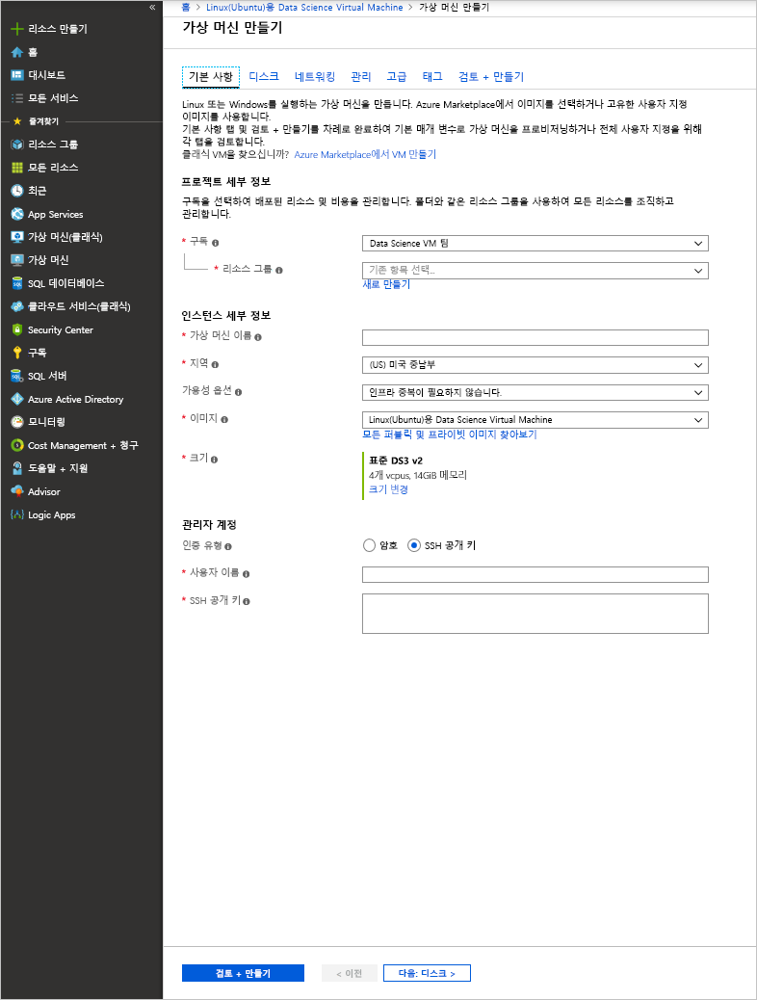

# <a name="provision-the-data-science-virtual-machine-for-linux-ubuntu"></a>Azure에서 Linux(Ubuntu)용 데이터 과학 Virtual Machine 프로비전

Linux용 DSVM(Data Science Virtual Machine)은 Azure에서 딥 러닝을 포함하여 기계 학습을 쉽게 시작할 수 있는 Ubuntu 기반 가상 머신 이미지입니다. 심층 학습 도구에는 다음이 포함됩니다.

* [Caffe](https://caffe.berkeleyvision.org/): 속도, 표현성 및 모듈화를 위해 구축된 딥 러닝 프레임워크
* [Caffe2](https://github.com/caffe2/caffe2): Caffe의 플랫폼 간 버전
* [Microsoft Cognitive Toolkit](https://github.com/Microsoft/CNTK): Microsoft Research의 딥러닝 소프트웨어 도구 키트
* [H2O](https://www.h2o.ai/): 오픈 소스 빅 데이터 플랫폼 및 그래픽 사용자 인터페이스
* [Keras](https://keras.io/): Python의 TensorFlow, Microsoft Cognitive Toolkit 및 Theano용 고급 신경망 API
* [MXNet](https://mxnet.io/): 언어 바인딩이 많은 유연하고 효율적인 딥 러닝 라이브러리
* [NVIDIA DIGITS](https://developer.nvidia.com/digits): 일반적인 딥 러닝 작업을 간소화하는 그래픽 시스템
* [PyTorch](https://pytorch.org/): 동적 네트워크를 지원하는 고급 Python 라이브러리
* [TensorFlow](https://www.tensorflow.org/): Google의 머신 인텔리전스용 오픈 소스 라이브러리
* [Theano](http://deeplearning.net/software/theano/): 다차원 배열이 포함된 수학 식을 정의하고, 최적화하고, 효율적으로 계산하기 위한 Python 라이브러리
* [Torch](http://torch.ch/): 기계 학습 알고리즘을 광범위하게 지원하는 과학적 컴퓨팅 프레임워크
* CUDA, cuDNN 및 NVIDIA 드라이버
* 많은 Jupyter Notebook 샘플

모든 라이브러리는 GPU 버전이지만 CPU에서도 실행됩니다.

Linux용 데이터 과학 Virtual Machine에는 다음을 포함하여 데이터 과학 및 개발 활동을 위한 인기 있는 도구도 포함되어 있습니다.

* Microsoft Machine Learning Server - Microsoft R Open 포함
* Anaconda Python 배포(2.7 및 3.5 버전) - 인기 있는 데이터 분석 라이브러리 포함
* JuliaPro - 큐레이팅된 Julia 언어 배포(인기 있는 과학 및 데이터 분석 라이브러리 포함)
* 독립 실행형 Spark 인스턴스 및 단일 노드 Hadoop(HDFS, Yarn)
* JupyterHub - R, Python, PySpark 및 Julia 커널을 지원하는 다중 사용자 Jupyter Notebook 서버
* Azure Storage Explorer.
* Azure 리소스 관리용 Azure CLI
* 기계 학습 도구:
  * [Vowpal Wabbit](https://github.com/JohnLangford/vowpal_wabbit): 온라인, 해시, allreduce, 감소, learning2search, 활성 및 대화형 학습과 같은 기술을 지원하는 고속 기계 학습 시스템
  * [XGBoost](https://xgboost.readthedocs.org/en/latest/): 빠르고 정확하게 부스트되는 트리 구현을 제공하는 도구입니다.
  * [Rattle](https://togaware.com/rattle/): R에서 데이터 분석 및 기계 학습을 쉽게 시작할 수 있게 하는 그래픽 도구
  * [LightGBM](https://github.com/Microsoft/LightGBM): 빠른 분산형 고성능 그래디언트 부스팅 프레임워크
* Java, Python, Node.js, Ruby 및 PHP의 Azure SDK
* Azure Machine Learning 및 기타 Azure 서비스에서 사용하기 위한 R 및 Python의 라이브러리
* 개발 도구 및 편집기(RStudio, PyCharm, IntelliJ, Emacs, vim)

데이터 과학을 수행하려면 일련의 작업에 대해 다음 작업을 반복합니다.

1. 데이터 찾기, 로드 및 전처리
1. 모델 빌드 및 테스트
1. 지능형 애플리케이션에서 사용하기 위해 모델 배포

데이터 과학자는 다양한 도구를 사용하여 이러한 태스크를 완료합니다. 올바른 버전의 소프트웨어를 찾은 다음, 해당 버전을 다운로드, 컴파일 및 설치하는 데 시간이 오래 걸릴 수 있습니다.

Linux용 데이터 과학 Virtual Machine을 사용하면 이러한 부담을 상당히 줄일 수 있습니다. Linux 데이터 과학 가상 컴퓨터를 사용하여 분석 프로젝트를 바로 시작합니다. R, Python, SQL, Java 및 C++ 등의 다양한 언어로 작업을 수행할 수 있습니다. VM에 포함된 Azure SDK를 통해 Linux의 다양한 서비스를 사용하여 Microsoft 클라우드 플랫폼용으로 애플리케이션을 빌드할 수 있습니다. 또한 Ruby, Perl, PHP 및 Node.js와 같이 미리 설치된 다른 언어에도 액세스할 수 있습니다.

이 DSVM 이미지에는 소프트웨어 요금이 부과되지 않습니다. 프로비전하는 가상 머신의 크기를 기반으로 평가되는 Azure 하드웨어 사용 요금만 지불합니다. 컴퓨팅 요금에 대한 자세한 내용은 [Azure Marketplace의 VM 목록 페이지](https://azure.microsoft.com/marketplace/partners/microsoft-ads/linux-data-science-vm/)를 참조하세요.

## <a name="other-versions-of-the-data-science-virtual-machine"></a>다른 버전의 Data Science Virtual Machine

[CentOS](linux-dsvm-intro.md) 이미지도 Ubuntu 이미지와 같은 많은 도구와 함께 사용할 수 있습니다. [Windows](provision-vm.md) 이미지도 사용할 수 있습니다.

## <a name="prerequisites"></a>필수 조건

Linux용 데이터 과학 Virtual Machine을 만들려면 먼저 Azure 구독이 있어야 합니다. [Azure 평가판을 얻을 수 있습니다](https://azure.microsoft.com/free/).

## <a name="create-your-data-science-virtual-machine-for-linux"></a>Linux용 데이터 과학 Virtual Machine 만들기

Linux용 데이터 과학 Virtual Machine의 인스턴스를 만드는 단계는 다음과 같습니다.

1. [Azure Portal](https://portal.azure.com/#create/microsoft-dsvm.linux-data-science-vm-ubuntulinuxdsvmubuntu)에서 가상 머신 목록으로 이동합니다. 아직 로그인하지 않은 경우 Azure 계정에 로그인하라는 메시지가 표시될 수 있습니다. 
1. **만들기**를 선택하여 마법사를 엽니다.
    
1. 다음 정보를 입력하여 마법사의 각 단계를 구성합니다.

    1. **기본 사항**:
    
       * **구독**: 둘 이상의 구독이 있으면 머신을 만들고 요금을 청구할 구독을 선택합니다. 이 구독에 대한 리소스 만들기 권한이 있어야 합니다.
       * **리소스 그룹**: 새 그룹을 만들거나 기존 그룹을 사용할 수 있습니다.
       * **가상 머신 이름**: 만들려는 데이터 과학 서버 이름을 입력합니다.
       * **지역**: 가장 적합한 데이터 센터를 선택합니다. 일반적으로 대부분의 데이터가 있거나 네트워크에 가장 빠르게 액세스할 수 있도록 실제 위치와 가장 가까운 데이터 센터입니다.
       * **가용성 옵션**: 가용성 집합 또는 영역에서 이 VM을 사용하려면 이 옵션을 설정하고, 그렇지 않으면 기본값을 그대로 둡니다.
       * **이미지**: 기본값을 그대로 둡니다.
       * **크기**: 기능 요구 사항과 비용 제약 조건에 맞는 서버 유형을 선택합니다. GPU 기반 VM 인스턴스에 대해 NC 또는 ND 시리즈 VM을 선택합니다. 
       * **사용자 이름**: 관리자 사용자 이름을 입력합니다.
       * **SSH 공개 키**: RSA 퍼블릭 키를 한 줄 형식으로 입력합니다. (SSH 키 대신 암호를 사용할 수 있습니다.)
    
    1. **디스크**:
    
       * **OS 디스크 유형**: SSD(반도체 드라이브)를 선호하는 경우 **프리미엄 SSD**를 선택합니다. 그렇지 않은 경우에는 **표준 HDD**를 선택합니다.
    
    1. 나머지 설정에는 기본값을 사용할 수 있습니다. 기본값이 아닌 값을 사용하려면 마우스로 정보 링크 위를 가리켜 도움말을 참조합니다. 완료되면 **검토 + 만들기**를 선택합니다.
    
    1. VM에서 유효성 검사를 통과하면 입력한 모든 정보가 올바른지 확인합니다. 링크는 사용 약관으로 안내합니다. VM에는 **크기** 입력에서 선택한 서버 크기에 대한 컴퓨팅 이외의 추가 요금이 부과되지 않습니다. 프로비저닝을 시작하려면 **만들기**를 선택합니다.
    
    프로비전에는 약 5분이 걸립니다. 상태가 Azure Portal에 표시됩니다.

## <a name="how-to-access-the-data-science-virtual-machine-for-linux"></a>Linux용 데이터 과학 Virtual Machine에 액세스하는 방법

Ubuntu DSVM에는 다음 세 가지 방법을 사용하여 액세스할 수 있습니다.

- 터미널 세션에 대한 SSH
- 그래픽 세션에 대한 X2Go
- Jupyter 노트북에 대한 JupyterHub 및 JupyterLab

또한 Data Science Virtual Machine을 Azure Notebooks에 연결하여 VM에서 Jupyter Notebook을 실행하고 체험 서비스 계층의 제한을 무시할 수 있습니다. 자세한 내용은 [Azure Notebooks 프로젝트 관리 및 구성](../../notebooks/configure-manage-azure-notebooks-projects.md#compute-tier)을 참조하세요.

### <a name="ssh"></a>SSH

VM을 만든 후 SSH를 사용하여 해당 VM에 로그인할 수 있습니다. 3단계의 **기본 사항** 섹션에서 만든 계정 자격 증명을 텍스트 셸 인터페이스용으로 사용합니다. Windows에서는 [PuTTY](https://www.putty.org)와 같은 SSH 클라이언트 도구를 다운로드할 수 있습니다. 그래픽 데스크톱(X Windows 시스템)을 선호하는 경우 PuTTY에서 X11 전달을 사용하거나 X2Go 클라이언트를 설치할 수 있습니다.

> [!NOTE]
> 테스트 결과 X2Go 클라이언트의 성능이 X11 전달보다 더 우수했습니다. 그래픽 데스크톱 인터페이스에서는 X2Go 클라이언트를 사용하는 것이 좋습니다.

### <a name="x2go"></a>X2Go

Linux VM은 이미 X2Go 서버와 함께 프로비저닝되었고 클라이언트 연결을 허용할 준비가 되었습니다. Linux VM 그래픽 데스크톱에 연결하려면 클라이언트에서 다음 절차를 완료합니다.

1. 사용 중인 클라이언트 플랫폼용 X2Go 클라이언트를 [X2Go](https://wiki.x2go.org/doku.php/doc:installation:x2goclient)에서 다운로드하여 설치합니다.
1. X2Go 클라이언트를 실행하고 **새 세션**을 선택합니다. 여러 탭이 있는 구성 창이 열립니다. 다음 구성 매개 변수를 입력합니다.
   * **세션 탭**:
     * **호스트**: Linux Data Science Virtual Machine의 호스트 이름 또는 IP 주소를 입력합니다.
     * **로그인**: Linux VM에서 사용자 이름을 입력합니다.
     * **SSH 포트**: 기본값 22를 그대로 사용합니다.
     * **세션 유형**: 값을 **XFCE**로 변경합니다. 현재 Linux VM은 XFCE 데스크톱만 지원합니다.
   * **미디어 탭**: 사운드 지원 및 클라이언트 인쇄를 사용하지 않으려면 해제할 수 있습니다.
   * **공유 폴더**: 클라이언트 머신의 디렉터리를 Linux VM에 탑재하려면 이 탭에서 VM과 공유하려는 클라이언트 머신 디렉터리를 추가합니다.

SSH 클라이언트를 사용하거나 X2Go 클라이언트를 통해 XFCE 그래픽 데스크톱을 사용하여 VM에 로그인하면 VM에 설치되고 구성된 도구를 사용할 준비가 됩니다. XFCE에는 대부분의 도구에 대한 애플리케이션 메뉴 바로 가기와 데스크톱 아이콘이 표시됩니다.

### <a name="jupyterhub-and-jupyterlab"></a>JupyterHub 및 JupyterLab

Ubuntu DSVM은 다중 사용자 Jupyter 서버인 [JupyterHub](https://github.com/jupyterhub/jupyterhub)를 실행합니다. 연결하려면 랩톱 또는 데스크톱에서 https:\//your-vm-ip:8000으로 이동합니다. VM을 만드는 데 사용한 사용자 이름과 암호를 입력하여 로그인합니다. 다양한 샘플 노트북을 사용하여 찾아보고 체험할 수 있습니다.

Jupyter 노트북의 차세대 JupyterLab 및 JupyterHub도 제공됩니다. 액세스하려면 JupyterHub에 로그인한 다음, https:\//your-vm-ip:8000/user/your-username/lab URL로 이동합니다. 다음 줄을 `/etc/jupyterhub/jupyterhub_config.py`에 추가하여 JupyterLab을 기본 Notebook 서버로 설정할 수 있습니다.

```python
c.Spawner.default_url = '/lab'
```

## <a name="tools-installed-on-the-data-science-virtual-machine-for-linux"></a>Linux용 데이터 과학 Virtual Machine에 설치된 도구

### <a name="deep-learning-libraries"></a>딥 러닝 라이브러리

#### <a name="cntk"></a>CNTK

Microsoft Cognitive Toolkit는 오픈 소스 딥 러닝 도구 키트입니다. Python 바인딩은 루트 및 py35 Conda 환경에서 사용할 수 있습니다. 또한 이미 경로에 있는 명령줄 도구(CNTK)도 있습니다.

샘플 Python 노트북은 JupyterHub에서 사용할 수 있습니다. 명령줄에서 기본 샘플을 실행하려면 셸에서 다음 명령을 실행합니다.

```bash
cd /home/[USERNAME]/notebooks/CNTK/HelloWorld-LogisticRegression
cntk configFile=lr_bs.cntk makeMode=false command=Train
```

자세한 내용은 [GitHub](https://github.com/Microsoft/CNTK)의 CNTK 섹션과 [CNTK wiki](https://github.com/Microsoft/CNTK/wiki)를 참조하세요.

#### <a name="caffe"></a>Caffe

Caffe는 Berkeley Vision and Learning Center의 심층 학습 프레임워크입니다. 이는 /opt/caffe에서 사용할 수 있습니다. 예제는 /opt/caffe/examples에서 찾을 수 있습니다.

#### <a name="caffe2"></a>Caffe2

Caffe2는 Caffe를 기반으로 제작된 Facebook의 심층 학습 프레임워크입니다. 이는 Python 2.7의 Conda root 환경에서 사용할 수 있습니다. 이를 활성화하려면 셸에서 다음 명령을 실행합니다.

```bash
source /anaconda/bin/activate root
```

JupyterHub에서 몇 가지 예제 Notebook이 제공됩니다.

#### <a name="h2o"></a>H2O

H2O는 빠른 메모리 내 분산형 기계 학습 및 예측 분석 플랫폼입니다. Python 패키지는 루트 및 py35 Anaconda 환경 둘 다에 설치됩니다. R 패키지도 설치됩니다. 

명령줄에서 H2O를 열려면 `java -jar /dsvm/tools/h2o/current/h2o.jar`을 실행합니다. 구성해야 할 수도 있는 다양한 [명령줄 옵션](http://docs.h2o.ai/h2o/latest-stable/h2o-docs/starting-h2o.html#from-the-command-line)이 있습니다. 시작하려면 http://localhost:54321 로 이동하여 Flow 웹 UI에 액세스할 수 있습니다. 샘플 노트북은 JupyterHub에서도 사용할 수 있습니다.

#### <a name="keras"></a>Keras

Keras는 Python의 고급 신경망 API입니다. TensorFlow, Microsoft Cognitive Toolkit 또는 Theano를 기반으로 하여 실행할 수 있습니다. root 및 py35 Python 환경에서 사용할 수 있습니다.

#### <a name="mxnet"></a>MXNet

MXNet은 효율성과 유연성을 위해 디자인된 심층 학습 프레임워크입니다. DSVM에 R 및 Python 바인딩이 포함되어 있습니다. 샘플 노트북은 JupyterHub에 포함되어 있고 샘플 코드는 /dsvm/samples/mxnet에서 사용할 수 있습니다.

#### <a name="nvidia-digits"></a>NVIDIA DIGITS

DIGITS라고 하는 NVIDIA Deep Learning GPU 학습 시스템은 일반적인 딥 러닝 작업을 간소화하는 시스템입니다. 이러한 작업에는 데이터 관리, GPU 시스템의 신경망 설계 및 학습, 고급 시각화를 통한 실시간 성능 모니터링이 포함됩니다.

DIGITS는 *digits*라는 서비스로 사용할 수 있습니다. 이 서비스를 시작하고 http://localhost:5000 으로 이동하여 시작합니다.

DIGITS는 Conda 루트 환경에서 Python 모듈로도 설치됩니다.

#### <a name="tensorflow"></a>TensorFlow

TensorFlow는 Google의 심층 학습 라이브러리입니다. 이는 데이터 흐름 그래프를 사용한 수치 계산용 오픈 소스 소프트웨어 라이브러리입니다. TensorFlow는 py35 Python 환경에서 사용할 수 있고, 일부 샘플 노트북이 JupyterHub에 포함되어 있습니다.

#### <a name="theano"></a>Theano

Theano는 효율적인 숫자 계산을 위한 Python 라이브러리입니다. root 및 py35 Python 환경에서 사용할 수 있습니다. 

#### <a name="torch"></a>Torch

Torch는 기계 학습 알고리즘을 광범위하게 지원하는 공학용 계산 프레임워크입니다. /dsvm/tools/torch에서 사용할 수 있으며, 명령줄에서 **th** 대화형 세션 및 LuaRocks 패키지 관리자를 사용할 수 있습니다. 예제는 /dsvm/samples/torch에서 사용할 수 있습니다.

PyTorch는 루트 Anaconda 환경에서도 사용할 수 있습니다. 예제는 /dsvm/samples/pytorch에 있습니다.

### <a name="microsoft-machine-learning-server"></a>Microsoft Machine Learning 서버

R은 가장 많이 사용되는 데이터 분석 및 Machine Learning 언어 중 하나입니다. R을 분석에 사용하려는 경우 VM에서 Microsoft R Open 및 Math Kernel Library가 있는 Microsoft Machine Learning Server를 사용합니다. Math Kernel Library는 분석 알고리즘에서 일반적인 수학 연산을 최적화합니다. Microsoft R Open은 CRAN-R과 완벽하게 호환되며, CRAN에 게시된 모든 R 라이브러리는 Microsoft R Open에 설치할 수 있습니다. 

Machine Learning Server를 사용하면 R 모델을 웹 서비스로 확장하고 운영할 수 있습니다. RStudio, vi 또는 Emacs 등의 기본 편집기 중 하나에서 R 프로그램을 편집할 수 있습니다. Emacs 편집기를 사용하려는 사전 설치되어 있으므로 사용할 수 있습니다. Emacs ESS(Emacs Speaks Statistics) 패키지는 Emacs 편집기 내에서 R 파일 작업을 간소화합니다.

R 콘솔을 열려면 셸에서 **R**을 입력합니다. 이 명령을 사용하면 대화형 환경으로 이동합니다. R 프로그램을 개발하려면 일반적으로 Emacs 또는 vi와 같은 편집기를 사용한 다음, R 내에서 스크립트를 실행합니다. RStudio를 사용하면 R 프로그램을 개발할 수 있는 완벽한 그래픽 IDE를 사용할 수 있습니다.

또한 원하는 경우 [상위 20개 R 패키지](https://www.kdnuggets.com/2015/06/top-20-r-packages.html)를 설치하는 R 스크립트를 사용할 수 있습니다. R 대화형 인터페이스에 있으면 이 스크립트를 실행할 수 있습니다. 앞에서 설명한 대로 해당 인터페이스는 셸에서 **R**을 입력하여 열 수 있습니다.  

### <a name="python"></a>Python

Anaconda Python은 Python 2.7 및 3.5 환경과 함께 설치됩니다. 2\.7 환경을 _루트_라고 하며, 3.5 환경을 _py35_라고 합니다. 이 배포 버전에는 약 300개의 가장 인기 있는 수학, 엔지니어링 및 데이터 분석 패키지와 함께 기본 Python이 포함되어 있습니다.

py35 환경은 기본값입니다. root(2.7) 환경을 활성화하려면 다음 명령을 사용합니다.

```bash
source activate root
```

py35 환경을 다시 활성화하려면 다음 명령을 사용합니다.

```bash
source activate py35
```

Python 대화형 세션을 호출하려면 셸에서 **python**을 입력합니다. 

Conda 또는 pip를 사용하여 추가 Python 라이브러리를 설치합니다. pip의 경우 기본값을 원하지 않는 경우 올바른 환경을 먼저 활성화합니다.

```bash
source activate root
pip install <package>
```

또는 전체 경로를 pip로 지정합니다.

```bash
/anaconda/bin/pip install <package>
```

Conda의 경우 항상 환경 이름(py35 또는 root)을 지정해야 합니다.

```bash
conda install <package> -n py35
```

그래픽 인터페이스를 사용하거나 X11 전달을 설정한 경우 **pycharm**을 입력하여 PyCharm Python IDE를 열 수 있습니다. 기본 텍스트 편집기를 사용할 수 있습니다. 또한 Anaconda Python 배포에 번들로 포함된 Python IDE인 Spyder를 사용할 수도 있습니다. Spyder를 사용하려면 그래픽 데스크톱 또는 X11 전달이 필요합니다. 그래픽 데스크톱에는 Spyder 바로 가기가 있습니다.

### <a name="jupyter-notebook"></a>Jupyter Notebook

Anaconda 배포는 코드 및 분석을 공유하는 환경인 Jupyter Notebook도 제공됩니다. JupyterHub을 통해 Jupyter Notebook에 액세스합니다. 로컬 Linux 사용자 이름과 암호를 사용하여 로그인합니다.

Jupyter Notebook 서버는 Python 2, Python 3 및 R 커널을 사용하여 미리 구성되어 있습니다. **Jupyter Notebook** 데스크톱 아이콘을 사용하여 브라우저를 열고 Notebook 서버에 액세스합니다. SSH 또는 X2Go 클라이언트를 통해 VM을 사용하는 경우 [https://localhost:8000/](https://localhost:8000/)에서 Jupyter Notebook 서버에 액세스할 수도 있습니다.

> [!NOTE]
> 인증서 경고가 나타나는 경우 계속 진행하세요.

모든 호스트에서 Jupyter Notebook 서버에 액세스할 수 있습니다. **https://\<VM DNS 이름 또는 IP 주소\>:8000/** 을 입력합니다.

> [!NOTE]
> VM이 프로비전될 때 포트 8000이 방화벽에 기본적으로 열립니다. 

Notebook 샘플은 Python과 R에서 각각 하나씩 패키지했습니다. 로컬 Linux 사용자 이름과 암호를 사용하여 Jupyter Notebook에 인증하면 샘플에 대한 링크가 Notebook 홈페이지에 표시됩니다. **새로 만들기**, 적절한 언어 커널을 차례로 선택하여 새 Notebook을 만들 수 있습니다. **새로 만들기** 단추가 표시되지 않으면 왼쪽 위에서 **Jupyter** 아이콘을 선택하여 Notebook 서버의 홈페이지로 이동합니다.

### <a name="apache-spark-standalone"></a>Apache Spark 독립 실행형

Apache Spark의 독립 실행형 인스턴스는 Linux DSVM에 미리 설치되어 Spark 애플리케이션을 먼저 로컬로 개발한 후에 대형 클러스터에서 테스트 및 배포하는 데 도움이 됩니다. 

Jupyter 커널을 통해 PySpark 프로그램을 실행할 수 있습니다. Jupyter를 열어 **새로 만들기** 단추를 선택하면 사용 가능한 커널의 목록이 표시됩니다. **Spark - Python**은 Python 언어를 사용하여 Spark 애플리케이션을 빌드할 수 있는 PySpark 커널입니다. 또한 PyCharm 또는 Spyder와 같은 Python IDE를 사용하여 Spark 프로그램을 빌드할 수도 있습니다. 

이 독립 실행형 인스턴스에서 Spark 스택은 호출 클라이언트 프로그램 내에서 실행됩니다. 이 기능을 사용하면 Spark 클러스터에서 개발하는 것에 비해 문제를 더 빠르고 쉽게 해결할 수 있습니다.

Jupyter는 PySpark Notebook 샘플을 제공합니다. 이 샘플은 Jupyter의 홈 디렉터리($HOME/notebooks/SparkML/pySpark) 아래에 있는 SparkML 디렉터리에서 찾을 수 있습니다. 

Spark용 R에서 프로그래밍하는 경우 Microsoft Machine Learning Server, SparkR 또는 sparklyr을 사용할 수 있습니다. 

Microsoft Machine Learning Server의 Spark 컨텍스트에서 실행하기 전에 일회성 설정 단계를 수행하여 로컬 단일 노드 Hadoop HDFS 및 Yarn 인스턴스를 사용하도록 설정해야 합니다. 기본적으로 Hadoop 서비스는 설치되지만 DSVM에서 사용하지 않도록 설정됩니다. 이를 사용하도록 설정하려면 다음 명령을 루트로 처음 실행해야 합니다.

```bash
echo -e 'y\n' | ssh-keygen -t rsa -P '' -f ~hadoop/.ssh/id_rsa
cat ~hadoop/.ssh/id_rsa.pub >> ~hadoop/.ssh/authorized_keys
chmod 0600 ~hadoop/.ssh/authorized_keys
chown hadoop:hadoop ~hadoop/.ssh/id_rsa
chown hadoop:hadoop ~hadoop/.ssh/id_rsa.pub
chown hadoop:hadoop ~hadoop/.ssh/authorized_keys
systemctl start hadoop-namenode hadoop-datanode hadoop-yarn
```

Hadoop 관련 서비스가 필요하지 않은 경우 ```systemctl stop hadoop-namenode hadoop-datanode hadoop-yarn```을 실행하여 이를 중지할 수 있습니다.

/dsvm/samples/MRS 디렉터리는 원격 Spark 컨텍스트(DSVM의 독립 실행형 Spark 인스턴스)에서 Microsoft Machine Learning Server를 개발하고 테스트하는 방법을 보여 주는 샘플을 제공합니다.

### <a name="ides-and-editors"></a>IDE 및 편집기

vi/Vim, Emacs, PyCharm, RStudio 및 IntelliJ를 포함한 몇 가지 코드 편집기 중에서 선택할 수 있습니다. 

PyCharm, RStudio 및 IntelliJ는 그래픽 편집기입니다. 이를 사용하려면 그래픽 데스크톱에 로그인해야 합니다. 데스크톱 및 애플리케이션 메뉴 바로 가기를 사용하여 엽니다.

Vim 및 Emacs는 텍스트 기반 편집기입니다. Emacs의 경우 ESS 추가 기능 패키지를 통해 Emacs 편집기 내에서 R을 더 쉽게 사용할 수 있습니다. 자세한 내용은 [ESS 웹 사이트](https://ess.r-project.org/)에서 확인할 수 있습니다.

LaTex는 texlive 패키지를 통해 [AUCTeX](https://www.gnu.org/software/auctex/manual/auctex/auctex.html)라는 Emacs 추가 기능 패키지와 함께 설치됩니다. 이 패키지는 Emacs 내에서 LaTex 문서 작성을 간소화합니다.  

### <a name="databases"></a>데이터베이스

#### <a name="graphical-sql-client"></a>그래픽 SQL 클라이언트

그래픽 SQL 클라이언트인 SQuirrel SQL은 다양한 데이터베이스(예: Microsoft SQL Server 및 MySQL)에 연결하고 SQL 쿼리를 실행할 수 있습니다. 예를 들어 데스크톱 아이콘을 사용하여 그래픽 데스크톱 세션에서(예: X2Go 클라이언트를 통해) SQuirrel SQL을 실행할 수 있습니다. 또는 셸에서 다음 명령을 사용하여 클라이언트를 실행할 수 있습니다.

```bash
/usr/local/squirrel-sql-3.7/squirrel-sql.sh
```

SQuirrel SQL을 처음 사용하기 전에 드라이버 및 데이터베이스 별칭을 설정합니다. JDBC 드라이버는 /usr/share/java/jdbcdrivers에 있습니다.

자세한 내용은 [SQuirrel SQL](http://squirrel-sql.sourceforge.net/index.php?page=screenshots)을 참조하세요.

#### <a name="command-line-tools-for-accessing-microsoft-sql-server"></a>Microsoft SQL Server에 액세스하기 위한 명령줄 도구

SQL Server용 ODBC 드라이버 패키지에서는 다음의 두 가지 명령줄 도구도 제공됩니다.

- **bcp**: bcp 도구는 Microsoft SQL Server 인스턴스와 사용자 지정 형식의 데이터 파일 간에 데이터를 대량 복사합니다. bcp 도구를 사용하여 많은 수의 새 행을 SQL Server 테이블로 가져오거나 데이터를 테이블에서 데이터 파일로 내보낼 수 있습니다. 데이터를 테이블로 가져오려면 해당 테이블에 대해 만든 서식 파일을 사용해야 합니다. 또는 테이블의 구조와 해당 열에 유효한 데이터 형식을 이해해야 합니다.

  자세한 내용은 [bcp를 사용하여 연결](https://msdn.microsoft.com/library/hh568446.aspx)을 참조하세요.

- **sqlcmd**: sqlcmd 도구를 사용하여 Transact-SQL 문을 입력할 수 있습니다. 또한 명령 프롬프트에서 시스템 프로시저 및 스크립트 파일을 입력할 수 있습니다. 이 도구는 ODBC를 사용하여 Transact-SQL 일괄 처리를 실행합니다.

  자세한 내용은 [sqlcmd를 사용하여 연결](https://msdn.microsoft.com/library/hh568447.aspx)을 참조하세요.

  > [!NOTE]
  > 이 도구는 Linux 및 Windows 플랫폼 간에 약간의 차이가 있습니다. 자세한 내용은 (영문) 설명서를 참조하세요.

#### <a name="database-access-libraries"></a>데이터베이스 액세스 라이브러리

데이터베이스 액세스용 라이브러리는 R 및 Python에서 사용할 수 있습니다.

* R에서는 RODBC 패키지 또는 dplyr 패키지를 사용하여 데이터베이스 서버에서 SQL 문을 쿼리하거나 실행할 수 있습니다.
* Python에서 pyodbc 라이브러리는 ODBC를 기본 계층으로 사용하여 데이터베이스 액세스를 제공합니다.  

### <a name="azure-tools"></a>Azure 도구

다음 Azure 도구가 VM에 설치됩니다.

* **Azure CLI**: Azure에서 명령줄 인터페이스를 사용하여 셸 명령을 통해 Azure 리소스를 만들고 관리할 수 있습니다. Azure 도구를 열려면 **azure help**를 입력합니다. 자세한 내용은 [Azure CLI 설명서 페이지](https://docs.microsoft.com/cli/azure/get-started-with-az-cli2)를 참조하세요.
* **Azure Storage Explorer**: Azure Storage Explorer는 Azure 스토리지 계정에 저장한 개체를 검색하고 Azure Blob 간에 데이터를 업로드 및 다운로드하는 데 사용할 수 있는 그래픽 도구입니다. 바탕 화면 바로 가기 아이콘을 사용하여 Storage Explorer에 액세스할 수 있습니다. 셸 프롬프트에서 **StorageExplorer**를 입력하여 열 수도 있습니다. X2Go 클라이언트에서 로그인하거나 X11 전달이 설정되어 있어야 합니다.
* **Azure 라이브러리**: 아래에는 사전 설치된 라이브러리 중 몇 가지가 나와 있습니다.
  
  * **Python**: Python의 Azure 관련 라이브러리는 *azure*, *azureml*, *pydocumentdb* 및 *pyodbc*입니다. 처음 세 개의 라이브러리를 사용하면 Azure Storage 서비스, Azure Machine Learning 및 Azure Cosmos DB(Azure의 NoSQL 데이터베이스)에 액세스할 수 있습니다. 네 번째 라이브러리인 pyodbc를 SQL Serve용 Microsoft ODBC 드라이버와 함께 사용하면 ODBC 인터페이스를 사용하여 Python에서 SQL Server, Azure SQL Database 및 Azure SQL Data Warehouse에 액세스할 수 있습니다. **pip list** 를 입력하면 나열된 라이브러리를 모두 확인할 수 있습니다. Python 2.7 및 3.5 환경 모두에서 이 명령을 실행해야 합니다.
  * **R**: R의 Azure 관련 라이브러리는 AzureML 및 RODBC입니다.
  * **Java**: Azure Java 라이브러리 목록은 VM의 /dsvm/sdk/AzureSDKJava 디렉터리에서 찾을 수 있습니다. 핵심 라이브러리는 Azure Storage 및 관리 API, Azure Cosmos DB, SQL Server용 JDBC 드라이버입니다.  

미리 설치된 Firefox 브라우저에서 [Azure 포털](https://portal.azure.com) 에 액세스할 수 있습니다. Azure 포털에서 Azure 리소스를 작성, 관리 및 모니터링할 수 있습니다.

### <a name="azure-machine-learning"></a>Azure Machine Learning

Azure Machine Learning은 예측 분석 솔루션을 빌드, 배포 및 공유할 수 있는 완전 관리형 클라우드 서비스입니다. Azure Machine Learning Studio에서 실험 및 모델을 빌드합니다. [Microsoft Azure Machine Learning](https://studio.azureml.net)을 방문하여 Data Science Virtual Machine의 웹 브라우저에서 액세스할 수도 있습니다.

Azure Machine Learning Studio에 로그인하면 실험 캔버스를 사용하여 기계 학습 알고리즘에 대한 논리적 흐름을 작성할 수 있습니다. 또한 Azure Machine Learning에서 호스팅되고 Machine Learning Studio의 실험에서 원활하게 작동할 수 있는 Jupyter Notebook에도 액세스할 수 있습니다. 

빌드한 기계 학습 모델은 웹 서비스 인터페이스에 래핑하여 운용 가능하도록 설정합니다. 기계 학습 모델을 운용하면 모든 언어로 작성된 클라이언트가 해당 모델에서 예측을 호출할 수 있습니다. 자세한 내용은 [Machine Learning 설명서](https://azure.microsoft.com/documentation/services/machine-learning/)를 참조하세요.

VM에서 모델을 R 또는 Python으로 빌드한 다음, Azure Machine Learning에서 프로덕션 환경에 배포할 수도 있습니다. R 및 Python에는 이 기능을 사용하는 데 필요한 라이브러리(각각 **AzureML**과 **azureml**)가 설치되어 있습니다.

R 및 Python의 모델을 Azure Machine Learning에 배포하는 방법에 대한 자세한 내용은 [Data Science Virtual Machine에서 수행할 수 있는 10가지 작업](vm-do-ten-things.md)을 참조하세요.

> [!NOTE]
> 이러한 지침은 Windows 버전의 Data Science Virtual Machine용으로 작성되었습니다. 하지만 Azure Machine Learning에 모델을 배포하는 방법에 대해 제공되는 정보는 Linux VM에도 적용할 수 있습니다.

### <a name="machine-learning-tools"></a>기계 학습 도구

VM에는 로컬로 미리 컴파일되고 미리 설치된 기계 학습 도구 및 알고리즘이 제공됩니다. 내용은 다음과 같습니다.

* **Vowpal Wabbit**: 속성 온라인 학습 알고리즘
* **xgboost**: 최적화되고 향상된 트리 알고리즘을 제공하는 도구입니다.
* **Rattle**: 쉬운 데이터 탐색 및 모델링을 위한 R 기반 그래픽 도구입니다.
* **Python**: Anaconda Python에서는 Scikit-learn 등의 라이브러리가 포함된 기계 학습 알고리즘이 번들로 제공됩니다. `pip install` 하여 다른 라이브러리를 설치할 수 있습니다.
* **LightGBM**: 의사 결정 트리 알고리즘을 기준으로 하는 빠른 분산형 고성능 그래디언트 부스팅 프레임워크입니다.
* **R**: R에서는 다양한 기계 학습 기능 라이브러리를 사용할 수 있습니다. 미리 설치된 라이브러리에는 lm, glm, randomForest 및 rpart가 포함됩니다. 다른 라이브러리는 다음 명령을 실행하여 설치할 수 있습니다.
  
        install.packages(<lib name>)

아래에서는 목록의 처음 3개 기계 학습 도구에 대해 추가로 설명합니다.

#### <a name="vowpal-wabbit"></a>Vowpal Wabbit

Vowpal Wabbit은 온라인, 해시, allreduce, 축소, learning2search, 활성 및 대화형 학습 등의 기술을 사용하는 기계 학습 시스템입니다.

기본 예제에서 도구를 실행하려면 다음 명령을 사용합니다.

```bash
cp -r /dsvm/tools/VowpalWabbit/demo vwdemo
cd vwdemo
vw house_dataset
```

해당 디렉터리에는 더 큰 다른 데모도 있습니다. Vowpal Wabbit에 대한 자세한 내용은 [이 GitHub 섹션](https://github.com/JohnLangford/vowpal_wabbit) 및 [Vowpal Wabbit wiki](https://github.com/JohnLangford/vowpal_wabbit/wiki)를 참조하세요.

#### <a name="xgboost"></a>XGBoost

xgboost 라이브러리는 향상된(트리) 알고리즘에 맞게 설계 및 최적화되었습니다. 이 라이브러리는 확장, 이동성 및 정확도가 높은 대규모 트리 향상 기능을 제공하는 데 필요한 최대 한계까지 기계의 계산 제한을 높이는 데 사용되며

명령줄 및 R 라이브러리로 제공됩니다. R에서 이 라이브러리를 사용하려면 대화형 R 세션을 시작하고(셸에서 **R** 입력) 라이브러리를 로드할 수 있습니다.

R 프롬프트에서 실행할 수 있는 간단한 예제는 다음과 같습니다.

```R
library(xgboost)

data(agaricus.train, package='xgboost')
data(agaricus.test, package='xgboost')
train <- agaricus.train
test <- agaricus.test
bst <- xgboost(data = train$data, label = train$label, max.depth = 2,
                eta = 1, nthread = 2, nround = 2, objective = "binary:logistic")
pred <- predict(bst, test$data)
```

xgboost 명령줄을 실행하려면 셸에서 다음 명령을 실행합니다.

```bash
cp -r /dsvm/tools/xgboost/demo/binary_classification/ xgboostdemo
cd xgboostdemo
xgboost mushroom.conf
```

.model 파일이 지정된 디렉터리에 기록됩니다. 이 데모 예제에 대한 정보는 [GitHub](https://github.com/dmlc/xgboost/tree/master/demo/binary_classification)에서 찾을 수 있습니다.

xgboost에 대한 자세한 내용은 [xgboost 설명서 페이지](https://xgboost.readthedocs.org/en/latest/) 및 해당 [GitHub 리포지토리](https://github.com/dmlc/xgboost)를 참조하세요.

#### <a name="rattle"></a>Rattle

Rattle(**R** **A**nalytical **T**ool **T**o **L**earn **E**asily)은 GUI 기반 데이터 탐색 및 모델링 기능을 사용합니다. Rattle은 통계 및 시각적 데이터 요약을 표시하고, 즉시 모델링할 수 있도록 데이터를 변환하고, 해당 데이터에서 감독되거나 감독되지 않는 모델을 빌드하고, 모델의 성능을 그래픽으로 표시하고, 새 데이터 집합의 점수를 매깁니다. 또한 UI에서 작업을 복제하여 R에서 직접 실행하거나 추가 분석을 위한 시작점으로 사용할 수 있는 R 코드를 생성할 수도 있습니다.

Rattle을 실행하려면 그래픽 데스크톱 로그인 세션을 사용 중이어야 합니다. 터미널에서 **R**을 입력하여 R 환경을 엽니다. R 프롬프트에서 다음 명령을 입력합니다.

```R
library(rattle)
rattle()
```

이제 탭 세트가 있는 그래픽 인터페이스가 열립니다. Rattle에서 다음 빠른 시작 단계를 사용하여 날씨 데이터 세트 샘플을 사용하고 모델을 빌드합니다. 일부 단계에서는 아직 시스템에 없는 몇 가지 필수 R 패키지를 자동으로 설치하고 로드하라는 메시지가 표시됩니다.

> [!NOTE]
> 패키지를 시스템 디렉터리(기본값)에 설치할 수 있는 액세스 권한이 없는 경우 R 콘솔 창에 패키지를 개인 라이브러리에 설치하라는 메시지가 표시될 수 있습니다. 이러한 메시지가 표시되면 **y** 로 응답합니다.

1. **실행**을 선택합니다.
1. 날씨 데이터 세트 예제를 사용할지 여부를 묻는 대화 상자가 표시됩니다. **예**를 선택하여 예제를 로드합니다.
1. **모델** 탭을 선택합니다.
1. **실행**을 선택하여 의사 결정 트리를 작성합니다.
1. **그리기**를 선택하여 의사 결정 트리를 표시합니다.
1. **포리스트** 옵션을 선택하고, **실행**을 선택하여 임의 포리스트를 작성합니다.
1. **평가** 탭을 선택합니다.
1. **위험** 옵션을 선택하고, **실행**을 선택하여 두 개의 **위험(누적)** 성능 도표를 표시합니다.
1. **로그** 탭을 선택하여 이전 작업에서 생성된 R 코드를 표시합니다.
   (현재 Rattle 릴리스의 버그로 인해 로그 텍스트의 **Export this log**(이 로그 내보내기) 앞에 **#** 문자를 삽입해야 합니다.)
1. **내보내기** 단추를 선택하여 *weather_script.R*이라는 R 스크립트 파일을 홈 폴더에 저장합니다.

Rattle 및 R을 종료할 수 있습니다. 이제 생성된 R 스크립트를 수정할 수 있습니다. 또는 스크립트를 있는 그대로 사용하고, 언제든지 이를 실행하여 Rattle UI 내에서 수행된 모든 작업을 반복합니다. 특히 이는 R 초보자를 위해 간단한 그래픽 인터페이스에서 분석 및 기계 학습을 빠르게 수행하는 동시에 R에서 코드를 자동으로 생성하여 수정하거나 학습할 수 있는 방법입니다.

## <a name="next-steps"></a>다음 단계

학습과 탐색을 계속하는 방법은 다음과 같습니다.

* [Linux용 Data Science Virtual Machine의 데이터 과학](linux-dsvm-walkthrough.md) 연습에서는 여기서 프로비저닝된 Linux DSVM을 사용하여 몇 가지 일반적인 데이터 과학 작업을 수행하는 방법을 보여 줍니다. 
* 이 문서에서 설명하는 도구를 사용하여 DSVM에서 다양한 데이터 과학 도구를 살펴봅니다. 가상 머신 내의 셸에서 `dsvm-more-info`를 실행하여 VM에 설치된 도구에 대한 기본 소개 및 자세한 정보에 대한 포인터를 확인할 수도 있습니다.  
* [팀 데이터 과학 프로세스](https://aka.ms/tdsp)를 사용하여 엔드투엔드 분석 솔루션을 체계적으로 빌드하는 방법을 알아봅니다.
* Azure AI 서비스를 사용하는 기계 학습 및 데이터 분석 샘플을 보려면 [Azure AI Gallery](https://gallery.azure.ai/)를 방문합니다.
