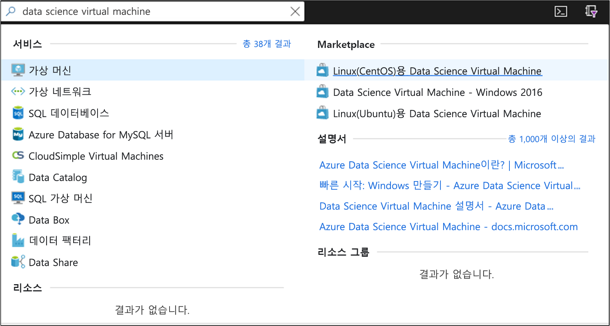
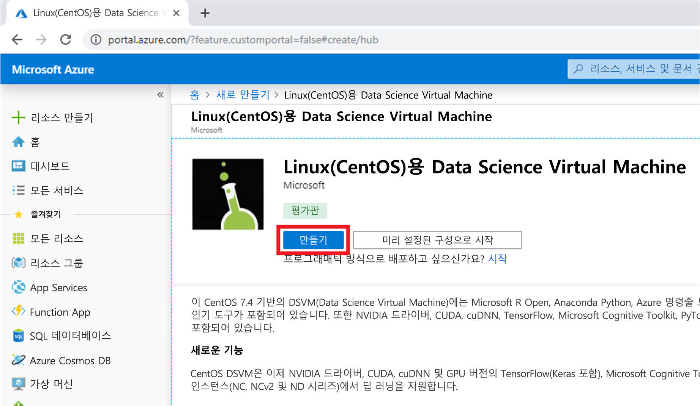
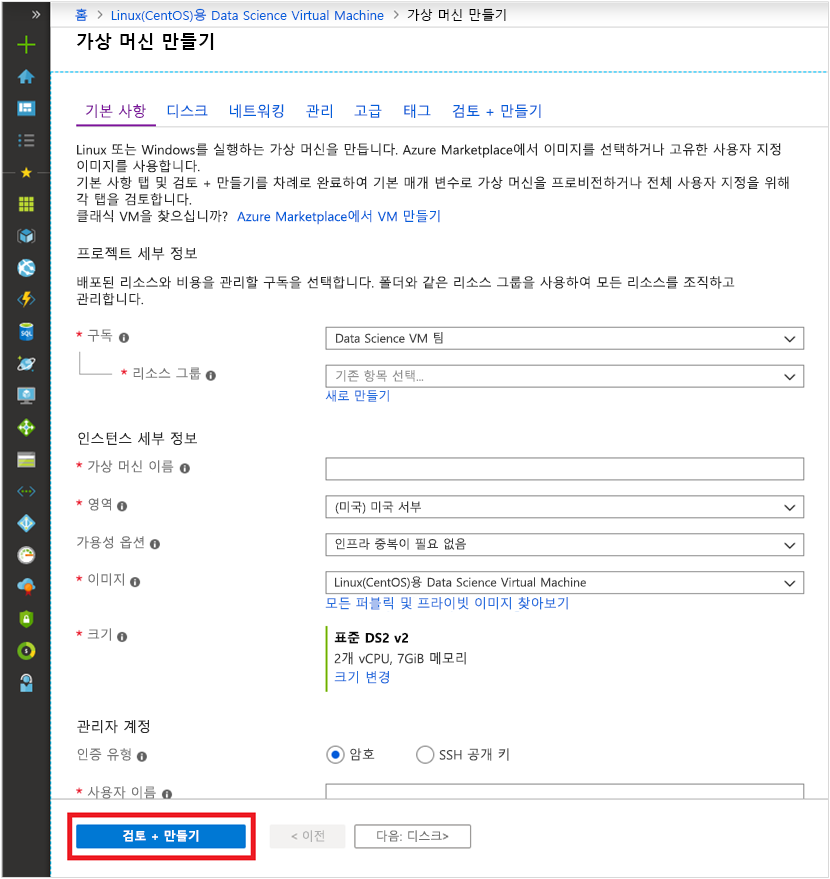
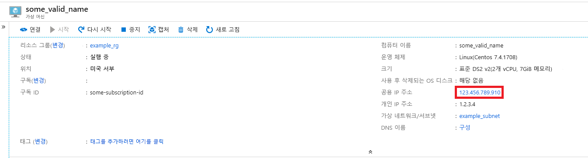
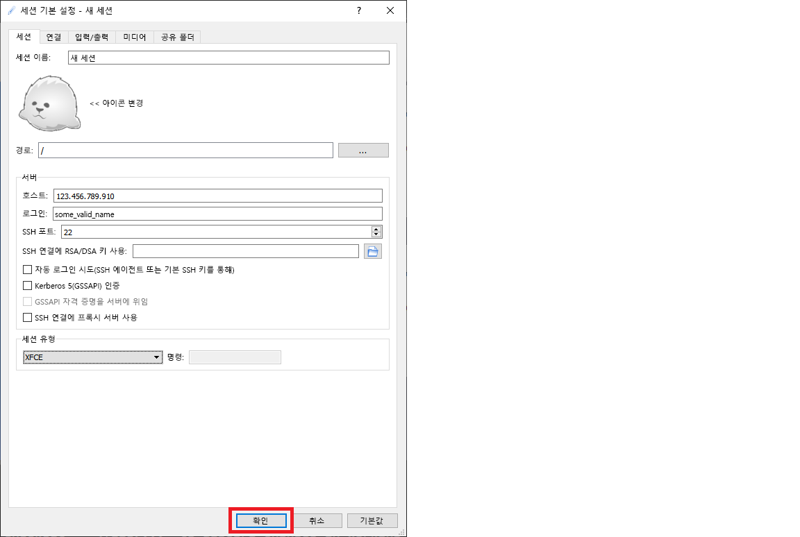

# <a name="quickstart-set-up-a-centos-linux-data-science-virtual-machine-in-azure"></a>빠른 시작: Azure에서 CentOS(Linux) Data Science Virtual Machine 설정

CentOS 기반 Data Science Virtual Machine을 준비하고 실행합니다.

## <a name="prerequisites"></a>사전 요구 사항

CentOS Data Science Virtual Machine을 만들려면 **Azure 구독**이 있어야 합니다. [무료 구독을 만듭니다](https://azure.com/free).

## <a name="create-your-centos-data-science-virtual-machine"></a>CentOS Data Science Virtual Machine 만들기

CentOS Data Science Virtual Machine의 인스턴스를 만드는 단계는 다음과 같습니다.

1. [Azure 포털](https://portal.azure.com)로 이동합니다. 아직 로그인하지 않은 경우 Azure 계정에 로그인하라는 메시지가 표시될 수 있습니다. 
1. 검색 창에 "데이터 과학 가상 머신"을 입력하고 CentOS DSVM을 선택합니다.

    

1. 후속 창에서 **만들기**를 선택합니다.

    [](media/linux-dsvm-intro/create-centos-expanded.png#lightbox)

1. "가상 머신 만들기" 블레이드로 리디렉션됩니다.
   
   

1. 다음 정보를 입력하여 마법사의 각 단계를 구성합니다.

    1. **기본 사항**:
    
       * **구독**: 둘 이상의 구독이 있으면 머신을 만들고 요금을 청구할 구독을 선택합니다. 이 구독에 대한 리소스 만들기 권한이 있어야 합니다.
       * **리소스 그룹**: 새 그룹을 만들거나 기존 그룹을 사용합니다.
       * **가상 머신 이름**: 가상 머신의 이름을 입력합니다. 입력한 대로 Azure Portal에 표시됩니다.
       * **지역**: 가장 적합한 데이터 센터를 선택합니다. 가장 빠른 네트워크 액세스를 위해 대부분의 데이터가 있거나 물리적 위치에 가장 가까운 데이터 센터입니다. [Azure 지역](https://azure.microsoft.com/global-infrastructure/regions/)에 대해 자세히 알아보세요.
       * **이미지**: 기본값을 그대로 둡니다.
       * **Size**: 일반 워크로드에 적합한 크기가 자동으로 채워집니다. [Azure의 Linux VM 크기](../../virtual-machines/linux/sizes.md)에 대해 자세히 읽어보세요.
       * **인증 형식**: 더 빨리 설치하려면 "암호"를 선택합니다. 
         
         > [!NOTE]
         > JupyterHub를 사용하려면 "암호"를 선택해야 합니다. JupyterHub는 SSH 공개 키를 사용하도록 구성되지 *않기* 때문입니다.

       * **사용자 이름**: 관리자 사용자 이름을 입력합니다. 가상 머신에 로그인할 때 사용할 사용자 이름이며 Azure 사용자 이름과 같지 않아도 됩니다. 대문자는 사용하지 *마십시오*.
         
         > [!NOTE]
         > 사용자 이름에 대문자를 사용하면 JupyterHub가 작동하지 않으며 500 내부 서버 오류가 발생합니다.

       * **암호**: 가상 머신에 로그인하는 데 사용할 암호를 입력합니다.    
    
   1. **검토 + 만들기**를 선택합니다.
   1. **검토+만들기**
      * 입력한 모든 정보가 올바른지 확인합니다. 
      * **만들기**를 선택합니다.
    
    프로비전에는 약 5분이 걸립니다. 상태가 Azure Portal에 표시됩니다.

## <a name="how-to-access-the-centos-data-science-virtual-machine"></a>CentOS Data Science Virtual Machine에 액세스하는 방법

CentOS DSVM에는 다음 세 가지 방법 중 하나를 사용하여 액세스할 수 있습니다.

  * 터미널 세션에 대한 SSH
  * 그래픽 세션에 대한 X2Go
  * Jupyter 노트북에 대한 JupyterHub 및 JupyterLab

또한 Data Science Virtual Machine을 Azure Notebooks에 연결하여 VM에서 Jupyter Notebook을 실행하고 체험 서비스 계층의 제한을 무시할 수 있습니다. 자세한 내용은 [Azure Notebooks 프로젝트 관리 및 구성](../../notebooks/configure-manage-azure-notebooks-projects.md#compute-tier)을 참조하세요.

### <a name="ssh"></a>SSH

VM을 만든 후 SSH 액세스를 통해 구성한 경우 SSH를 사용하여 해당 VM에 로그인할 수 있습니다. 3단계의 **기본 사항** 섹션에서 만든 계정 자격 증명을 텍스트 셸 인터페이스용으로 사용합니다. Windows에서는 [PuTTY](https://www.putty.org)와 같은 SSH 클라이언트 도구를 다운로드할 수 있습니다. 그래픽 데스크톱(X Windows 시스템)을 선호하는 경우 PuTTY에서 X11 전달을 사용할 수 있습니다.

> [!NOTE]
> 테스트 결과 X2Go 클라이언트의 성능이 X11 전달보다 더 우수했습니다. 그래픽 데스크톱 인터페이스에서는 X2Go 클라이언트를 사용하는 것이 좋습니다.

### <a name="x2go"></a>X2Go

Linux VM은 이미 X2Go 서버와 함께 프로비저닝되었고 클라이언트 연결을 허용할 준비가 되었습니다. Linux VM 그래픽 데스크톱에 연결하려면 클라이언트에서 다음 절차를 완료합니다.

1. 사용 중인 클라이언트 플랫폼용 X2Go 클라이언트를 [X2Go](https://wiki.x2go.org/doku.php/doc:installation:x2goclient)에서 다운로드하여 설치합니다.
1. 가상 머신의 공용 IP 주소를 기록해 둡니다. 이 주소는 방금 만든 가상 머신을 열어서 Azure Portal에서 찾을 수 있습니다.

   

1. X2Go 클라이언트를 실행합니다. "새 세션" 창이 자동으로 팝업되지 않으면 세션-> 새 세션으로 이동합니다.

1. 구성 창이 열리면 다음과 같은 구성 매개 변수를 입력합니다.
   * **세션 탭**:
     * **호스트**: 앞서 기록해 둔 VM의 IP 주소를 입력합니다.
     * **로그인**: Linux VM에서 사용자 이름을 입력합니다.
     * **SSH 포트**: 기본값 22를 그대로 사용합니다.
     * **세션 유형**: 값을 **XFCE**로 변경합니다. 현재 Linux VM은 XFCE 데스크톱만 지원합니다.
   * **미디어 탭**: 사운드 지원 및 클라이언트 인쇄를 사용하지 않으려면 해제할 수 있습니다.
   * **공유 폴더**: 클라이언트 머신의 디렉터리를 Linux VM에 탑재하려면 이 탭에서 VM과 공유하려는 클라이언트 머신 디렉터리를 추가합니다.

   
1. **확인**을 선택합니다.
1. X2Go 창의 오른쪽 창에 있는 상자를 클릭하여 VM의 로그인 화면을 표시합니다.
1. VM의 암호를 입력합니다.
1. **확인**을 선택합니다.
1. 연결을 마치려면 방화벽을 우회할 수 있는 X2Go 권한을 부여해야 할 수도 있습니다.
1. 이제 CentOS DSVM의 그래픽 인터페이스가 표시됩니다. 


### <a name="jupyterhub-and-jupyterlab"></a>JupyterHub 및 JupyterLab

CentOS DSVM은 다중 사용자 Jupyter 서버인 [JupyterHub](https://github.com/jupyterhub/jupyterhub)를 실행합니다. 연결하려면 다음 단계를 수행합니다.

   1. Azure Portal에서 VM을 검색하고 선택하여 VM에 대한 공용 IP 주소를 기록해 둡니다.

       

   1. 로컬 머신에서 웹 브라우저를 열고 https:\//your-vm-ip:8000으로 이동합니다. "your-vm-ip"는 앞에서 기록해 둔 IP 주소로 대체해야 합니다.
   1. VM을 만드는 데 사용한 사용자 이름과 암호를 입력하여 로그인합니다. 

      

   1. 사용 가능한 다양한 샘플 노트북을 찾아봅니다.

Jupyter 노트북의 차세대 JupyterLab 및 JupyterHub도 제공됩니다. 액세스하려면 JupyterHub에 로그인한 다음, URL https:\//your-vm-ip:8000/user/your-username/lab으로 이동합니다. "your-username"은 VM을 구성할 때 선택한 사용자 이름으로 대체해야 합니다.

다음 줄을 `/etc/jupyterhub/jupyterhub_config.py`에 추가하여 JupyterLab을 기본 Notebook 서버로 설정할 수 있습니다.

```python
c.Spawner.default_url = '/lab'
```

## <a name="next-steps"></a>다음 단계

학습과 탐색을 계속하는 방법은 다음과 같습니다.

* [Linux용 Data Science Virtual Machine의 데이터 과학](linux-dsvm-walkthrough.md) 연습에서는 여기서 프로비저닝된 Linux DSVM을 사용하여 몇 가지 일반적인 데이터 과학 작업을 수행하는 방법을 보여 줍니다. 
* 이 문서에서 설명하는 도구를 사용하여 DSVM에서 다양한 데이터 과학 도구를 살펴봅니다. 가상 머신 내의 셸에서 `dsvm-more-info`를 실행하여 DSVM에 설치된 도구에 대한 기본 소개 및 자세한 정보에 대한 포인터를 확인할 수도 있습니다.  
* [팀 데이터 과학 프로세스](https://aka.ms/tdsp)를 사용하여 엔드투엔드 분석 솔루션을 체계적으로 빌드하는 방법을 알아봅니다.
* Azure AI 서비스를 사용하는 기계 학습 및 데이터 분석 샘플을 보려면 [Azure AI Gallery](https://gallery.azure.ai/)를 방문합니다.
* 이 가상 머신에 적합한 [참조 설명서](./reference-centos-vm.md)를 참조합니다.