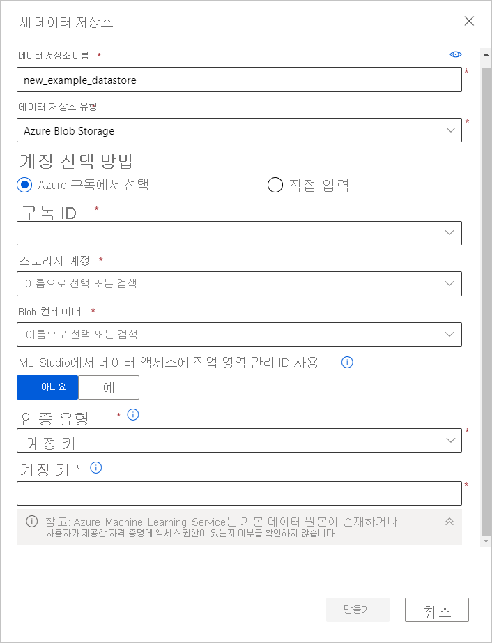

# <a name="connect-to-azure-storage-services"></a>Azure 스토리지 서비스에 연결
[!INCLUDE [aml-applies-to-basic-enterprise-sku](../../includes/aml-applies-to-basic-enterprise-sku.md)]

이 문서에서는 **Azure Machine Learning 데이터 저장소를 통해 Azure storage 서비스에 연결**하는 방법을 알아봅니다. 데이터 저장소는 작업 영역과 연결된 [Key Vault](https://azure.microsoft.com/services/key-vault/)의 구독 ID 및 토큰 권한 부여 같은 연결 정보를 저장하므로, 스크립트에서 이러한 정보를 하드 코딩할 필요 없이 스토리지에 안전하게 액세스할 수 있습니다. 

**지원 되지 않는 저장소 솔루션의**경우, ML 실험 중에 데이터 송신 비용을 절약 하려면 지원 되는 Azure storage 솔루션으로 [데이터를 이동](#move) 합니다.  [이 Azure 스토리지 솔루션](#matrix)에서 데이터 저장소를 만들 수 있습니다. 

Azure Machine Learning의 데이터 액세스 워크플로 전체에서 데이터 저장소가 적합한 위치를 이해하려면 [안전하게 데이터 액세스](concept-data.md#data-workflow) 문서를 참조하세요.

## <a name="prerequisites"></a>사전 요구 사항

필요한 사항:
- Azure 구독 Azure 구독이 없는 경우 시작하기 전에 체험 계정을 만듭니다. [Azure Machine Learning 평가판 또는 유료 버전](https://aka.ms/AMLFree)을 사용해 보세요.

- [Azure BLOB 컨테이너](https://docs.microsoft.com/azure/storage/blobs/storage-blobs-overview) 또는 [Azure 파일 공유](https://docs.microsoft.com/azure/storage/files/storage-files-introduction)를 사용하는 Azure 스토리지 계정

- [Python용 Azure Machine Learning SDK](https://docs.microsoft.com/python/api/overview/azure/ml/intro?view=azure-ml-py) 또는 [Azure Machine Learning 스튜디오](https://ml.azure.com/)에 대한 액세스 권한

- Azure Machine Learning 작업 영역
  
  [Azure Machine Learning 작업 영역](how-to-manage-workspace.md)을 만들거나 Python SDK를 통해 기존 작업 영역을 사용합니다. `Workspace` 및 `Datastore` 클래스를 가져오고, `from_config()` 함수를 사용하여 `config.json` 파일의 구독 정보를 로드합니다. 이 작업은 기본적으로 현재 디렉터리에서 JSON 파일을 찾지만, `from_config(path="your/file/path")`를 사용하여 해당 파일을 가리키도록 경로 매개 변수를 지정할 수도 있습니다.

   ```Python
   import azureml.core
   from azureml.core import Workspace, Datastore
        
   ws = Workspace.from_config()
   ```
<a name="matrix"></a>

## <a name="supported-data-storage-service-types"></a>지원되는 데이터 스토리지 서비스 유형

현재 데이터 저장소는 다음 표에 나열된 스토리지 서비스에 연결 정보를 저장할 수 있습니다.

| 스토리지&nbsp;유형 | 인증&nbsp;유형 | [Azure&nbsp;Machine&nbsp;Learning 스튜디오](https://ml.azure.com/) | [Azure&nbsp;Machine&nbsp;Learning&nbsp; Python SDK](https://docs.microsoft.com/python/api/overview/azure/ml/intro?view=azure-ml-py) |  [Azure&nbsp;Machine&nbsp;Learning CLI](reference-azure-machine-learning-cli.md) | [Azure&nbsp;Machine&nbsp;Learning&nbsp; Rest API](https://docs.microsoft.com/rest/api/azureml/) | VS 코드
---|---|---|---|---|---|---
[Azure&nbsp;Blob&nbsp;Storage](https://docs.microsoft.com/azure/storage/blobs/storage-blobs-overview)| 계정 키 <br> SAS 토큰 | ✓ | ✓ | ✓ |✓ |✓
[Azure&nbsp;파일&nbsp;공유](https://docs.microsoft.com/azure/storage/files/storage-files-introduction)| 계정 키 <br> SAS 토큰 | ✓ | ✓ | ✓ |✓|✓
[Azure&nbsp;Data Lake&nbsp;Storage Gen&nbsp;1](https://docs.microsoft.com/azure/data-lake-store/)| 서비스 주체| ✓ | ✓ | ✓ |✓|
[Azure&nbsp;Data Lake&nbsp;Storage Gen&nbsp;2](https://docs.microsoft.com/azure/storage/blobs/data-lake-storage-introduction)| 서비스 주체| ✓ | ✓ | ✓ |✓|
[Azure&nbsp;SQL&nbsp;Database](https://docs.microsoft.com/azure/sql-database/sql-database-technical-overview)| SQL 인증 <br>서비스 주체| ✓ | ✓ | ✓ |✓|
[Azure&nbsp;PostgreSQL](https://docs.microsoft.com/azure/postgresql/overview) | SQL 인증| ✓ | ✓ | ✓ |✓|
[Azure&nbsp;Database&nbsp;for&nbsp;MySQL](https://docs.microsoft.com/azure/mysql/overview) | SQL 인증|  | ✓* | ✓* |✓*|
[Databricks&nbsp;파일&nbsp;시스템](https://docs.microsoft.com/azure/databricks/data/databricks-file-system)| 인증 없음 | | ✓** | ✓ ** |✓** |

\* MySQL은 [DataTransferStep](https://docs.microsoft.com/python/api/azureml-pipeline-steps/azureml.pipeline.steps.datatransferstep?view=azure-ml-py) 파이프라인에만 지원됩니다. <br>
**Databricks는 [DatabricksStep](https://docs.microsoft.com/python/api/azureml-pipeline-steps/azureml.pipeline.steps.databricks_step.databricksstep?view=azure-ml-py) 파이프라인에만 지원됩니다.

### <a name="storage-guidance"></a>스토리지 지침

[Azure Blob 컨테이너](https://docs.microsoft.com/azure/storage/blobs/storage-blobs-introduction)에 대한 데이터 저장소를 만드는 것이 좋습니다. BLOB에 표준 스토리지와 프리미엄 스토리지 둘 다 제공됩니다. 프리미엄 스토리지는 더 비싸지만 처리 속도가 빨라서 학습 실행 속도를 높일 수 있으며, 특히 대량의 데이터 세트를 학습시킬 때 유용합니다. 스토리지 계정 비용에 대한 내용은 [Azure 가격 계산기](https://azure.microsoft.com/pricing/calculator/?service=machine-learning-service)를 참조하세요.

[Azure Data Lake Storage Gen2](https://docs.microsoft.com/azure/storage/blobs/data-lake-storage-introduction?toc=/azure/storage/blobs/toc.json)는 Azure Blob Storage를 기반으로 하며 엔터프라이즈 빅 데이터 분석용으로 설계되었습니다. Data Lake Storage Gen2의 기본적인 부분은 [계층 구조 네임스페이스](https://docs.microsoft.com/azure/storage/blobs/data-lake-storage-namespace)를 Blob 스토리지에 추가하는 것입니다. 계층 구조 네임스페이스는 효율적인 데이터 액세스를 위해 개체/파일을 디렉터리 계층 구조로 구성합니다.

작업 영역을 만들면 Azure BLOB 컨테이너와 Azure 파일 공유가 자동으로 작업 영역에 등록됩니다. 각각 이름이 `workspaceblobstore` 및 `workspacefilestore`로 지정됩니다. `workspaceblobstore`는 작업 영역 아티팩트와 기계 학습 실험 로그를 저장하는 데 사용됩니다. `workspacefilestore`는 [컴퓨팅 인스턴스](https://docs.microsoft.com/azure/machine-learning/concept-compute-instance#accessing-files)를 통해 권한이 부여된 Notebook 및 R 스크립트를 저장하는 데 사용됩니다. `workspaceblobstore`컨테이너는 기본 데이터 저장소로 설정 되며 작업 영역에서 삭제할 수 없습니다.

> [!IMPORTANT]
> 디자이너 홈페이지에서 샘플을 열면 Azure Machine Learning 디자이너(미리 보기)가 **azureml_globaldatasets**라는 데이터 저장소를 자동으로 만듭니다. 이 데이터 저장소는 샘플 데이터 세트만 포함합니다. 기밀 데이터 액세스에는 이 데이터 저장소를 사용하지 **마세요**.
> 

<a name="access"></a>

## <a name="create-and-register-datastores"></a>데이터 저장소 만들기 및 등록

Azure 스토리지 솔루션을 데이터 저장소로 등록하면 해당 데이터 저장소가 자동으로 생성되어 특정 작업 영역에 등록됩니다. [Python SDK](#python-sdk) 또는 [Azure Machine Learning 스튜디오](#azure-machine-learning-studio)를 사용하여 데이터 저장소를 만들고 작업 영역에 등록할 수 있습니다.

>[!IMPORTANT]
> 데이터 저장소를 만들고 등록하는 초기 프로세스에서 Azure Machine Learning은 기본 스토리지 서비스가 있는지, 사용자가 제공한 보안 주체(사용자 이름, 서비스 주체 또는 SAS 토큰)가 해당 스토리지에 액세스할 수 있는지 확인합니다. 그러나 Azure Data Lake Storage Gen 1 및 2 데이터 저장소의 경우 나중에 [`from_files()`](https://docs.microsoft.com/python/api/azureml-core/azureml.data.dataset_factory.filedatasetfactory?view=azure-ml-py) 또는 [`from_delimited_files()`](https://docs.microsoft.com/python/api/azureml-core/azureml.data.dataset_factory.tabulardatasetfactory?view=azure-ml-py#from-parquet-files-path--validate-true--include-path-false--set-column-types-none--partition-format-none-) 같은 데이터 액세스 메서드가 호출될 때 이 유효성 검사가 수행됩니다. 
<br><br>
데이터 저장소가 생성된 후에는 기본 스토리지 컨테이너에 액세스해야 하는 메서드에 대해서만 이 유효성 검사가 수행되고, 데이터 저장소 개체가 검색될 때마다 수행되지는 **않습니다**. 예를 들어 데이터 저장소에서 파일을 다운로드하려는 경우에는 유효성 검사가 수행되지만, 기본 데이터 저장소만 변경하려는 경우에는 유효성 검사가 수행되지 않습니다.

### <a name="python-sdk"></a>Python SDK

모든 등록 메서드는 [`Datastore`](https://docs.microsoft.com/python/api/azureml-core/azureml.core.datastore(class)?view=azure-ml-py) 클래스에 있으며 `register_azure_*` 형식입니다.

> [!IMPORTANT]
> 가상 네트워크에 있는 저장소 계정에 대 한 데이터 저장소를 만들려는 경우 [가상 네트워크의 데이터 액세스](#access-data-in-a-virtual-network) 섹션을 참조 하세요.

`register_azure_*()` 메서드를 채우는 데 필요한 정보는 [Azure Portal](https://portal.azure.com)에서 찾을 수 있습니다.

* 데이터 저장소 이름은 소문자, 숫자 및 밑줄로만 구성 되어야 합니다. 

* 계정 키 또는 SAS 토큰을 인증에 사용할 계획이면 왼쪽 창에서 **스토리지 계정**을 선택하고, 등록하려는 스토리지 계정을 선택합니다. 
  * **개요** 페이지에서는 계정 이름, 컨테이너, 파일 공유 이름 등의 정보를 제공합니다. 
      1. 계정 키의 경우 **설정** 창에서 **액세스 키**로 이동합니다. 
      1. SAS 토큰의 경우 **설정** 창에서 **공유 액세스 서명**으로 이동합니다.

* 인증을 위해 서비스 주체를 사용 하려는 경우 **앱 등록** 으로 이동 하 여 사용 하려는 앱을 선택 합니다. 
    * 해당 **개요** 페이지에는 테 넌 트 id 및 클라이언트 ID와 같은 필수 정보가 포함 됩니다.

> [!IMPORTANT]
> 보안상의 이유로 Azure Storage 계정 (계정 키 또는 SAS 토큰)에 대 한 액세스 키를 변경 해야 할 수 있습니다. 이렇게 하면 작업 영역 및 연결 된 데이터 저장소와 새 자격 증명을 동기화 해야 합니다. 업데이트 된 자격 증명을 [이러한 단계](how-to-change-storage-access-key.md)와 동기화 하는 방법을 알아봅니다. 

다음 예제에서는 Azure BLOB 컨테이너, Azure 파일 공유 및 Azure Data Lake Storage Generation 2를 데이터 저장소로 등록하는 방법을 보여줍니다. 이 예제에 제공된 매개 변수는 데이터 저장소를 만들고 등록하는 데 필요한 **필수 매개 변수**입니다. 

다른 스토리지 서비스에 대한 데이터 저장소를 만들고 이러한 메서드의 선택적 매개 변수를 보려면 [해당하는 `register_azure_*` 메서드의 참조 설명서](https://docs.microsoft.com/python/api/azureml-core/azureml.core.datastore.datastore?view=azure-ml-py#methods)를 확인하세요.

#### <a name="blob-container"></a>Blob 컨테이너

Azure BLOB 컨테이너를 데이터 저장소로 등록하려면 [`register_azure_blob_container()`](https://docs.microsoft.com/python/api/azureml-core/azureml.core.datastore(class)?view=azure-ml-py#register-azure-blob-container-workspace--datastore-name--container-name--account-name--sas-token-none--account-key-none--protocol-none--endpoint-none--overwrite-false--create-if-not-exists-false--skip-validation-false--blob-cache-timeout-none--grant-workspace-access-false--subscription-id-none--resource-group-none-)를 사용합니다.

다음 코드는 `blob_datastore_name` 데이터 저장소를 만들어 `ws` 작업 영역에 등록합니다. 이 데이터 저장소는 제공된 계정 액세스 키를 사용하여 `my-account-name` 스토리지 계정의 `my-container-name` BLOB 컨테이너에 액세스합니다.

```Python
blob_datastore_name='azblobsdk' # Name of the datastore to workspace
container_name=os.getenv("BLOB_CONTAINER", "<my-container-name>") # Name of Azure blob container
account_name=os.getenv("BLOB_ACCOUNTNAME", "<my-account-name>") # Storage account name
account_key=os.getenv("BLOB_ACCOUNT_KEY", "<my-account-key>") # Storage account access key

blob_datastore = Datastore.register_azure_blob_container(workspace=ws, 
                                                         datastore_name=blob_datastore_name, 
                                                         container_name=container_name, 
                                                         account_name=account_name,
                                                         account_key=account_key)
```
BLOB 컨테이너가 가상 네트워크에 있는 경우 `skip_validation=True` 매개 변수를 [`register_azure_blob_container()`](https://docs.microsoft.com/python/api/azureml-core/azureml.core.datastore(class)?view=azure-ml-py#register-azure-blob-container-workspace--datastore-name--container-name--account-name--sas-token-none--account-key-none--protocol-none--endpoint-none--overwrite-false--create-if-not-exists-false--skip-validation-false--blob-cache-timeout-none--grant-workspace-access-false--subscription-id-none--resource-group-none-) 메서드에 포함시킵니다. 

#### <a name="file-share"></a>파일 공유

Azure 파일 공유를 데이터 저장소로 등록하려면 [`register_azure_file_share()`](https://docs.microsoft.com/python/api/azureml-core/azureml.core.datastore(class)?view=azure-ml-py#register-azure-file-share-workspace--datastore-name--file-share-name--account-name--sas-token-none--account-key-none--protocol-none--endpoint-none--overwrite-false--create-if-not-exists-false--skip-validation-false-)를 사용합니다. 

다음 코드는 `file_datastore_name` 데이터 저장소를 만들어 `ws` 작업 영역에 등록합니다. 이 데이터 저장소는 제공된 계정 액세스 키를 사용하여 `my-account-name` 스토리지 계정의 `my-fileshare-name` 파일 공유에 액세스합니다.

```Python
file_datastore_name='azfilesharesdk' # Name of the datastore to workspace
file_share_name=os.getenv("FILE_SHARE_CONTAINER", "<my-fileshare-name>") # Name of Azure file share container
account_name=os.getenv("FILE_SHARE_ACCOUNTNAME", "<my-account-name>") # Storage account name
account_key=os.getenv("FILE_SHARE_ACCOUNT_KEY", "<my-account-key>") # Storage account access key

file_datastore = Datastore.register_azure_file_share(workspace=ws,
                                                     datastore_name=file_datastore_name, 
                                                     file_share_name=file_share_name, 
                                                     account_name=account_name,
                                                     account_key=account_key)
```
파일 공유가 가상 네트워크에 있는 경우 `skip_validation=True` 매개 변수를 [`register_azure_file_share()`](https://docs.microsoft.com/python/api/azureml-core/azureml.core.datastore(class)?view=azure-ml-py#register-azure-file-share-workspace--datastore-name--file-share-name--account-name--sas-token-none--account-key-none--protocol-none--endpoint-none--overwrite-false--create-if-not-exists-false--skip-validation-false-) 메서드에 포함시킵니다. 

#### <a name="azure-data-lake-storage-generation-2"></a>Azure Data Lake Storage Generation 2

Azure Data Lake Storage Generation 2(ADLS Gen 2) 데이터 저장소의 경우 [register_azure_data_lake_gen2()](https://docs.microsoft.com/python/api/azureml-core/azureml.core.datastore.datastore?view=azure-ml-py#register-azure-data-lake-gen2-workspace--datastore-name--filesystem--account-name--tenant-id--client-id--client-secret--resource-url-none--authority-url-none--protocol-none--endpoint-none--overwrite-false-)를 사용하여 Azure DataLake Gen 2 스토리지에 연결된 자격 증명 데이터 저장소를 [서비스 주체 권한](https://docs.microsoft.com/azure/active-directory/develop/howto-create-service-principal-portal)에 등록합니다. 서비스 주체를 활용하려면 [애플리케이션을 등록](https://docs.microsoft.com/azure/active-directory/develop/app-objects-and-service-principals)하고 서비스 주체에 *Storage Blob 데이터 읽기 권한자* 액세스 권한을 부여해야 합니다. [ADLS Gen 2의 액세스 제어 설정](https://docs.microsoft.com/azure/storage/blobs/data-lake-storage-access-control)에 대해 자세히 알아보세요. 

다음 코드는 `adlsgen2_datastore_name` 데이터 저장소를 만들어 `ws` 작업 영역에 등록합니다. 이 데이터 저장소는 제공된 서비스 주체 자격 증명을 사용하여 `account_name` 스토리지 계정의 `test` 파일 시스템에 액세스합니다.

```python 
adlsgen2_datastore_name = 'adlsgen2datastore'

subscription_id=os.getenv("ADL_SUBSCRIPTION", "<my_subscription_id>") # subscription id of ADLS account
resource_group=os.getenv("ADL_RESOURCE_GROUP", "<my_resource_group>") # resource group of ADLS account

account_name=os.getenv("ADLSGEN2_ACCOUNTNAME", "<my_account_name>") # ADLS Gen2 account name
tenant_id=os.getenv("ADLSGEN2_TENANT", "<my_tenant_id>") # tenant id of service principal
client_id=os.getenv("ADLSGEN2_CLIENTID", "<my_client_id>") # client id of service principal
client_secret=os.getenv("ADLSGEN2_CLIENT_SECRET", "<my_client_secret>") # the secret of service principal

adlsgen2_datastore = Datastore.register_azure_data_lake_gen2(workspace=ws,
                                                             datastore_name=adlsgen2_datastore_name,
                                                             account_name=account_name, # ADLS Gen2 account name
                                                             filesystem='test', # ADLS Gen2 filesystem
                                                             tenant_id=tenant_id, # tenant id of service principal
                                                             client_id=client_id, # client id of service principal
                                                             client_secret=client_secret) # the secret of service principal
```

### <a name="azure-machine-learning-studio"></a>Azure Machine Learning Studio 

Azure Machine Learning 스튜디오에서 다음 단계를 수행하여 새 데이터 저장소를 만듭니다.

> [!IMPORTANT]
> 데이터 저장소 계정이 가상 네트워크에 있는 경우 스튜디오에서 데이터에 액세스할 수 있도록 하려면 추가 구성 단계가 필요 합니다. 적절 한 구성 단계가 적용 되도록 하려면 [네트워크 격리 & 개인 정보](how-to-enable-virtual-network.md#machine-learning-studio) 를 참조 하세요. 

1. [Azure Machine Learning Studio](https://ml.azure.com/)에 로그인합니다.
1. 왼쪽 창의 **관리**에서 **데이터 저장소**를 선택합니다.
1. **+ 새 데이터 저장소**를 선택합니다.
1. 새 데이터 저장소에 대한 양식을 작성합니다. 이 양식은 사용자가 선택하는 Azure 스토리지 유형 및 인증 형식에 따라 지능적으로 업데이트됩니다.
  
양식을 채우는 데 필요한 정보는 [Azure Portal](https://portal.azure.com)에서 찾을 수 있습니다. 왼쪽 창에서 **스토리지 계정**을 선택하고, 등록하려는 스토리지 계정을 선택합니다. **개요** 페이지에서 계정 이름, 컨테이너 및 파일 공유 이름과 같은 정보를 제공 합니다. 

* 계정 키나 SAS 토큰과 같은 인증 항목인 경우 **설정** 창에서 **액세스 키**로 이동합니다. 

* 테넌트 ID나 클라이언트 ID 같은 서비스 주체 항목인 경우 **앱 등록**으로 이동하여 사용하려는 앱을 선택합니다. 해당하는 **개요** 페이지는 이러한 항목이 포함됩니다. 

> [!IMPORTANT]
> 보안상의 이유로 Azure Storage 계정 (계정 키 또는 SAS 토큰)에 대 한 액세스 키를 변경 해야 할 수 있습니다. 이렇게 하면 작업 영역 및 연결 된 데이터 저장소와 새 자격 증명을 동기화 해야 합니다. 업데이트 된 자격 증명을 [이러한 단계](how-to-change-storage-access-key.md)와 동기화 하는 방법을 알아봅니다. 

다음 예제에서는 **Azure blob 데이터 저장소**를 만들 때 양식이 표시 되는 모양을 보여 줍니다. 
    


### <a name="vs-code"></a>VS 코드

Azure Machine Learning VS Code 확장을 사용 하 여 데이터 저장소를 만들고 관리할 수 있습니다. 자세한 내용은 [리소스 관리 방법 가이드 VS Code](how-to-manage-resources-vscode.md#datastores) 를 참조 하세요.

<a name="get"></a>

## <a name="get-datastores-from-your-workspace"></a>작업 영역에서 데이터 저장소 가져오기

현재 작업 영역에 등록된 특정 데이터 저장소를 가져오려면 `Datastore` 클래스에서 [`get()`](https://docs.microsoft.com/python/api/azureml-core/azureml.core.datastore(class)?view=azure-ml-py#get-workspace--datastore-name-) 정적 메서드를 사용합니다.

```Python
# Get a named datastore from the current workspace
datastore = Datastore.get(ws, datastore_name='your datastore name')
```
특정 작업 영역에 등록된 데이터 저장소 목록을 가져오려면 다음과 같이 작업 영역 개체에 대한 [`datastores`](https://docs.microsoft.com/python/api/azureml-core/azureml.core.workspace%28class%29?view=azure-ml-py#datastores) 속성을 사용합니다.

```Python
# List all datastores registered in the current workspace
datastores = ws.datastores
for name, datastore in datastores.items():
    print(name, datastore.datastore_type)
```

작업 영역의 기본 데이터 저장소를 가져오려면 다음 줄을 사용합니다.

```Python
datastore = ws.get_default_datastore()
```
다음 코드를 사용하여 기본 데이터 저장소를 변경할 수도 있습니다. 이 기능은 SDK를 통해서만 지원됩니다. 

```Python
 ws.set_default_datastore(new_default_datastore)
```

<a name="up-and-down"></a>
## <a name="upload-and-download-data"></a>데이터 업로드 및 다운로드

다음 예제에서 설명하는 [`upload()`](https://docs.microsoft.com/python/api/azureml-core/azureml.data.azure_storage_datastore.azureblobdatastore?view=azure-ml-py#upload-src-dir--target-path-none--overwrite-false--show-progress-true-) 및 [`download()`](https://docs.microsoft.com/python/api/azureml-core/azureml.data.azure_storage_datastore.azureblobdatastore?view=azure-ml-py#download-target-path--prefix-none--overwrite-false--show-progress-true-) 메서드는 [AzureBlobDatastore](https://docs.microsoft.com/python/api/azureml-core/azureml.data.azure_storage_datastore.azureblobdatastore?view=azure-ml-py) 및 [AzureFileDatastore](https://docs.microsoft.com/python/api/azureml-core/azureml.data.azure_storage_datastore.azurefiledatastore?view=azure-ml-py) 클래스와 관련이 있으며 두 클래스에서 동일한 방식으로 작동합니다.

> [!NOTE]
> AzureDataLakeGen2 데이터 저장소에 업로드하는 기능은 아직 지원되지 않습니다.

### <a name="upload"></a>업로드

다음과 같이 Python SDK를 사용하여 데이터 저장소에 디렉터리 또는 개별 파일을 업로드합니다.

```Python
datastore.upload(src_dir='your source directory',
                 target_path='your target path',
                 overwrite=True,
                 show_progress=True)
```

`target_path` 매개 변수는 업로드할 파일 공유(또는 BLOB 컨테이너)의 위치를 지정합니다. 기본값은 데이터가 루트에 업로드되는 `None`입니다. `overwrite=True`이면 `target_path`에 있는 모든 기존 데이터를 덮어씁니다.

`upload_files()` 메서드를 통해 개별 파일 목록을 데이터 저장소에 업로드할 수도 있습니다.

### <a name="download"></a>다운로드

다음과 같이 데이터 저장소의 데이터를 로컬 파일 시스템에 다운로드합니다.

```Python
datastore.download(target_path='your target path',
                   prefix='your prefix',
                   show_progress=True)
```

`target_path` 매개 변수는 데이터를 다운로드할 로컬 디렉터리의 위치입니다. 다운로드할 파일 공유 또는 blob 컨테이너의 폴더 경로를 지정하려면 `prefix`에 해당 경로를 입력합니다. `prefix`가 `None`이면 파일 공유(또는 BLOB 컨테이너)의 모든 콘텐츠가 다운로드됩니다.

<a name="train"></a>

## <a name="access-your-data-during-training"></a>학습 중에 데이터 액세스

데이터 저장소의 데이터를 조작하거나 기계 학습 작업(예: 학습)에 사용 가능한 개체에 데이터를 패키징하려면 [Azure Machine Learning 데이터 세트를 만듭니다](how-to-create-register-datasets.md). 데이터 세트는 테이블 형식 데이터를 pandas 또는 Spark 데이터 프레임에 로드하는 기능을 제공합니다. 또한 데이터 세트는 Azure Blob Storage, Azure Files, Azure Data Lake Storage Gen1, Azure Data Lake Storage Gen2, Azure SQL Database 및 Azure Database for PostgreSQL에 있는 모든 형식의 파일을 다운로드하거나 탑재하는 기능을 제공합니다. [데이터 세트를 사용하여 학습시키는 방법을 알아보세요](how-to-train-with-datasets.md).

### <a name="accessing-source-code-during-training"></a>학습 도중에 소스 코드 액세스

Azure Blob Storage는 Azure 파일 공유보다 처리 속도가 빠르며 동시에 시작되는 여러 작업으로 스케일링됩니다. 이러한 이유로 소스 코드 파일을 전송할 때 Blob Storage를 사용하도록 실행을 구성하는 것이 좋습니다.

다음 코드 예제는 실행 구성에서 소스 코드 전송에 사용할 BLOB 데이터 저장소를 지정합니다.

```python 
# workspaceblobstore is the default blob storage
run_config.source_directory_data_store = "workspaceblobstore" 
```

## <a name="access-data-during-scoring"></a>채점 중에 데이터 액세스

Azure Machine Learning은 모델을 채점에 사용할 수 있는 여러 가지 방법을 제공합니다. 이러한 방법 중 일부는 데이터 저장소에 대한 액세스를 제공하지 않습니다. 다음 표를 사용하여 채점 중에 데이터 저장소에 액세스할 수 있는 방법을 알아보세요.

| 방법 | 데이터 저장소 액세스 | Description |
| ----- | :-----: | ----- |
| [일괄 처리 예측](how-to-use-parallel-run-step.md) | ✔ | 대량의 데이터에 대해 비동기적으로 예측합니다. |
| [웹 서비스](how-to-deploy-and-where.md) | &nbsp; | 모델을 웹 서비스로 배포합니다. |
| [Azure IoT Edge 모듈](how-to-deploy-and-where.md) | &nbsp; | IoT Edge 디바이스에 모델을 배포합니다. |

SDK가 데이터 저장소에 대한 액세스를 제공하지 않는 경우에는 관련 Azure SDK를 사용하여 데이터에 액세스하는 사용자 지정 코드를 만들 수 있습니다. 예를 들어 [Python용 Azure Storage SDK](https://github.com/Azure/azure-storage-python)는 BLOB 또는 파일에 저장된 데이터에 액세스하는 데 사용할 수 있는 클라이언트 라이브러리입니다.


## <a name="access-data-in-a-virtual-network"></a>가상 네트워크의 데이터에 액세스

저장소가 가상 네트워크 뒤에 있는 경우 작업 영역 및 데이터 저장소에 대 한 추가 구성 단계를 수행 하 여 데이터에 액세스 해야 합니다. 가상 네트워크에서 데이터 저장소 및 데이터 집합을 사용 하는 방법에 대 한 자세한 내용은 [개인 가상 네트워크를 사용 하 여 &를 학습 하는 동안 네트워크 격리](how-to-enable-virtual-network.md#use-datastores-and-datasets)를 참조 하세요.

<a name="move"></a>

## <a name="move-data-to-supported-azure-storage-solutions"></a>지원되는 Azure 스토리지 솔루션으로 데이터 이동

Azure Machine Learning은 Azure Blob Storage, Azure Files, Azure Data Lake Storage Gen1, Azure Data Lake Storage Gen2, Azure SQL Database 및 Azure Database for PostgreSQL에서 데이터에 액세스하는 기능을 지원합니다. 지원되지 않는 스토리지를 사용하는 경우 [Azure Data Factory 및 다음 단계](https://docs.microsoft.com/azure/data-factory/quickstart-create-data-factory-copy-data-tool)를 사용하여 지원되는 Azure 스토리지 솔루션으로 데이터를 이동하는 것이 좋습니다. 지원되는 스토리지로 데이터를 이동하면 기계 학습 실험 중에 발생하는 데이터 송신 비용을 절감할 수 있습니다. 

Azure Data Factory는 80개 이상의 미리 작성된 커넥터를 추가 비용 없이 제공하므로 효율적이 고 복원력 있는 데이터 전송이 가능합니다. 이러한 커넥터로는 Azure 데이터 서비스, 온-프레미스 데이터 원본, Amazon S3 및 Redshift, Google BigQuery가 있습니다.

## <a name="next-steps"></a>다음 단계

* [Azure 기계 학습 데이터 세트 만들기](how-to-create-register-datasets.md)
* [모델 학습](how-to-train-ml-models.md)
* [모델 배포](how-to-deploy-and-where.md)
