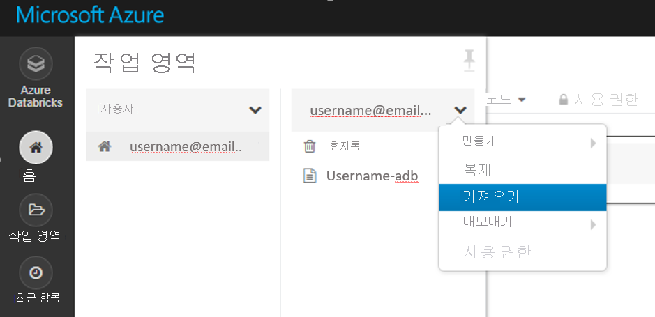
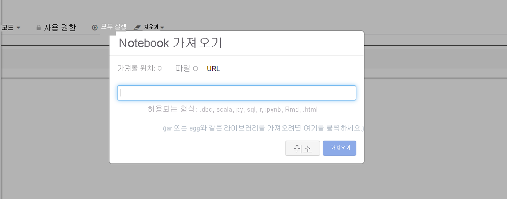
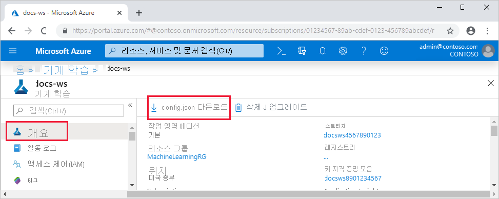

# <a name="configure-a-development-environment-for-azure-machine-learning"></a>Azure Machine Learning용 개발 환경 구성
[!INCLUDE [applies-to-skus](../../includes/aml-applies-to-basic-enterprise-sku.md)]

이 문서에서는 Azure Machine Learning을 사용 하도록 개발 환경을 구성 하는 방법에 대해 알아봅니다. Azure Machine Learning는 플랫폼에 독립적입니다. 개발 환경에 대 한 유일한 하드 요구 사항은 Python 3입니다. Anaconda 또는 Virtualenv와 같은 격리 된 환경도 권장 됩니다.

다음 표에서는 이 문서에서 다루는 각 개발 환경을 장단점과 함께 보여 줍니다.

| 환경 | 장점 | 단점 |
| --- | --- | --- |
| [클라우드 기반 Azure Machine Learning 계산 인스턴스](#compute-instance) | 시작 하는 가장 쉬운 방법입니다. 전체 SDK는 작업 영역 VM에 이미 설치 되어 있으며, 노트북 자습서는 미리 복제 되어 실행할 준비가 되었습니다. | 개발 환경 및 종속성에 대 한 제어가 부족 합니다. Linux VM에 대해 발생 하는 추가 비용입니다 (요금을 방지 하기 위해 사용 하지 않을 때 VM을 중지할 수 있음). [가격 책정 세부 정보](https://azure.microsoft.com/pricing/details/virtual-machines/linux/)를 참조하세요. |
| [로컬 환경](#local) | 개발 환경 및 종속성에 대 한 모든 권한 원하는 빌드 도구, 환경 또는 IDE를 사용 하 여를 실행 합니다. | 시작 하는 데 시간이 더 오래 걸립니다. 필요한 SDK 패키지를 설치 해야 하 고, 아직 설치 되어 있지 않은 경우에도 환경을 설치 해야 합니다. |
| [Azure Databricks](#aml-databricks) | 확장 가능한 Apache Spark 플랫폼에서 대규모의 집약적 기계 학습 워크플로를 실행하는 데 적합합니다. | 실험적 기계 학습 또는 작은 규모의 실험 및 워크플로를 위한 과잉. Azure Databricks에 대해 발생 하는 추가 비용입니다. [가격 책정 세부 정보](https://azure.microsoft.com/pricing/details/databricks/)를 참조하세요. |
| [Data Science Virtual Machine (DSVM)](#dsvm) | 클라우드 기반 계산 인스턴스 (Python 및 SDK는 사전 설치 됨)와 비슷하지만 널리 사용 되는 추가 데이터 과학 및 기계 학습 도구가 미리 설치 되어 있습니다. 쉽게 확장 하 고 다른 사용자 지정 도구 및 워크플로와 결합할 수 있습니다. | 클라우드 기반 계산 인스턴스와 비교 하 여 더 느린 시작 환경을 제공 합니다. |

또한이 문서에서는 다음 도구에 대 한 추가 사용 팁을 제공 합니다.

* [Jupyter 노트북](#jupyter): 이미 Jupyter Notebook를 사용 하 고 있는 경우 SDK에는 몇 가지 추가 기능을 설치 해야 합니다.

* [Visual Studio Code](#vscode): Visual Studio Code를 사용 하는 경우 [Azure Machine Learning 확장](https://marketplace.visualstudio.com/items?itemName=ms-toolsai.vscode-ai) 에는 Python에 대 한 광범위 한 언어 지원 뿐만 아니라 Azure Machine Learning 훨씬 더 편리 하 고 생산적으로 작업할 수 있는 기능이 포함 되어 있습니다.

## <a name="prerequisites"></a>사전 요구 사항

Azure Machine Learning 작업 영역 작업 영역을 만들려면 [Azure Machine Learning 작업 영역 만들기](how-to-manage-workspace.md)를 참조하세요. 작업 영역은 사용자 고유의 [클라우드 기반 노트북 서버](#compute-instance), [dsvm](#dsvm)또는 [Azure Databricks](#aml-databricks)를 시작 하는 데 필요 합니다.

[로컬 컴퓨터](#local)에 대 한 SDK 환경을 설치 하려면 [Jupyter Notebook 서버](#jupyter) 또는 [Visual Studio Code](#vscode) 도 필요 합니다.

- [Anaconda](https://www.anaconda.com/download/) 또는 [miniconda](https://conda.io/miniconda.html) 패키지 관리자 중 하나입니다.

- Linux 또는 Mac OS에서는 bash 셸이 필요합니다.

    > [!TIP]
    > Linux 또는 Mac OS에서 bash가 아닌 셸을 사용하는 경우(예: zsh) 일부 명령을 실행할 때 오류가 발생할 수 있습니다. 이 문제를 해결하려면 `bash` 명령을 사용하여 새 bash 셸을 시작하고 거기서 명령을 실행하세요.

- Windows에서는 명령 프롬프트 또는 Anaconda 프롬프트(Anaconda 및 Miniconda를 통해 설치한)가 필요합니다.

## <a name="your-own-cloud-based-compute-instance"></a><a id="compute-instance"></a>사용자 고유의 클라우드 기반 계산 인스턴스

Azure Machine Learning [계산 인스턴스](concept-compute-instance.md) 는 Jupyter 노트북 서버, JupyterLab 및 완전히 준비 된 ML 환경을 사용 하 여 데이터 과학자을 제공 하는 안전한 클라우드 기반 Azure 워크스테이션입니다.

계산 인스턴스를 설치 하거나 구성할 수 없습니다.  Azure Machine Learning 작업 영역 내에서 언제 든 지 하나를 만듭니다. 이름을 입력 하 고 Azure VM 유형을 지정 합니다. [설정 환경 및 작업 영역](tutorial-1st-experiment-sdk-setup.md)을 사용 하 여 지금 사용해 보세요.

패키지를 설치 하는 방법을 비롯 하 여 계산 인스턴스에 대해 자세히 알아보려면 [계산 인스턴스](concept-compute-instance.md)를 참조 하세요.

계산 요금이 발생 하지 않도록 하려면 [계산 인스턴스를 중지](tutorial-1st-experiment-sdk-train.md#clean-up-resources)합니다.

## <a name="data-science-virtual-machine"></a><a id="dsvm"></a>Data Science Virtual Machine

DSVM는 사용자 지정된 VM(가상 머신) 이미지입니다. 데이터 과학 작업을 위해 설계되었으며 다음 요소가 미리 구성되어 있습니다.

  - TensorFlow, PyTorch, Scikit-learn, XGBoost 및 Azure Machine Learning SDK 같은 패키지
  - Spark Standalone 및 Drill 같은 인기 있는 데이터 과학 도구
  - Azure CLI, AzCopy 및 Storage Explorer 같은 Azure 도구
  - Visual Studio Code 및 PyCharm 같은 IDE(통합 개발 환경)
  - Jupyter Notebook 서버

Azure Machine Learning SDK는 DSVM의 Ubuntu 또는 Windows 버전에서 작동합니다. 하지만 컴퓨팅 대상으로 DSVM도 사용할 계획인 경우 Ubuntu만 지원됩니다.

DSVM을 개발 환경으로 사용 하려면 다음을 수행 합니다.

1. 다음 환경 중 하나에서 DSVM을 만듭니다.

    * Azure Portal:

        * [Ubuntu Data Science Virtual Machine 만들기](https://docs.microsoft.com/azure/machine-learning/data-science-virtual-machine/dsvm-ubuntu-intro)

        * [Windows Data Science Virtual Machine 만들기](https://docs.microsoft.com/azure/machine-learning/data-science-virtual-machine/provision-vm)

    * Azure CLI:

        > [!IMPORTANT]
        > * Azure CLI를 사용하는 경우 먼저 `az login` 명령을 사용하여 Azure 구독에 로그인해야 합니다.
        >
        > * 이 단계의 명령을 사용하는 경우 리소스 그룹 이름, VM 이름, 사용자 이름 및 암호를 제공해야 합니다.

        * Ubuntu Data Science Virtual Machine을 만들려면 다음 명령을 사용합니다.

            ```azurecli-interactive
            # create a Ubuntu DSVM in your resource group
            # note you need to be at least a contributor to the resource group in order to execute this command successfully
            # If you need to create a new resource group use: "az group create --name YOUR-RESOURCE-GROUP-NAME --location YOUR-REGION (For example: westus2)"
            az vm create --resource-group YOUR-RESOURCE-GROUP-NAME --name YOUR-VM-NAME --image microsoft-dsvm:linux-data-science-vm-ubuntu:linuxdsvmubuntu:latest --admin-username YOUR-USERNAME --admin-password YOUR-PASSWORD --generate-ssh-keys --authentication-type password
            ```

        * Windows Data Science Virtual Machine을 만들려면 다음 명령을 사용합니다.

            ```azurecli-interactive
            # create a Windows Server 2016 DSVM in your resource group
            # note you need to be at least a contributor to the resource group in order to execute this command successfully
            az vm create --resource-group YOUR-RESOURCE-GROUP-NAME --name YOUR-VM-NAME --image microsoft-dsvm:dsvm-windows:server-2016:latest --admin-username YOUR-USERNAME --admin-password YOUR-PASSWORD --authentication-type password
            ```

2. Azure Machine Learning SDK가 DSVM에 이미 설치되어 있습니다. SDK가 포함된 Conda 환경을 사용하려면 다음 명령 중 하나를 사용합니다.

    * Ubuntu DSVM:

        ```bash
        conda activate py36
        ```

    * Windows DSVM:

        ```bash
        conda activate AzureML
        ```

1. SDK에 액세스할 수 있는지 확인하고 버전을 검사하려면 다음 Python 코드를 사용합니다.

    ```python
    import azureml.core
    print(azureml.core.VERSION)
    ```

1. Azure Machine Learning 작업 영역을 사용 하도록 DSVM을 구성 하려면 [작업 영역 구성 파일 만들기](#workspace) 섹션을 참조 하세요.

자세한 내용은 [Data Science Virtual Machine](https://azure.microsoft.com/services/virtual-machines/data-science-virtual-machines/)를 참조하세요.

## <a name="local-computer"></a><a id="local"></a>로컬 컴퓨터

로컬 컴퓨터 (원격 가상 컴퓨터 일 수도 있음)를 사용 하는 경우 Anaconda 환경을 만들고 SDK를 설치 합니다. 예를 들면 다음과 같습니다.

1. 아직 없는 경우 [Anaconda](https://www.anaconda.com/distribution/#download-section) (Python 3.7 버전)을 다운로드 하 여 설치 합니다.

1. Anaconda 프롬프트를 열고 다음 명령을 사용 하 여 환경을 만듭니다.

    다음 명령을 실행 하 여 환경을 만듭니다.

    ```bash
    conda create -n myenv python=3.7.7
    ```

    그런 다음 환경을 활성화 합니다.

    ```bash
    conda activate myenv
    ```

    이 예제에서는 python 3.7.7를 사용 하 여 환경을 만들지만 특정 subversions을 선택할 수 있습니다. SDK 호환성은 특정 주 버전에서 보장 되지 않을 수 있습니다 (3.5 + 권장). 오류가 발생 하는 경우 Anaconda 환경에서 다른 버전/subversion을 사용해 보는 것이 좋습니다. 구성 요소 및 패키지를 다운로드하는 동안에 환경을 만드는 데 몇 분 정도 걸립니다.

1. 새 환경에서 다음 명령을 실행 하 여 환경 고유의 Python 커널을 사용 하도록 설정 합니다. 이렇게 하면 Anaconda 환경 내에서 Jupyter 노트북을 사용할 때 예상 되는 커널 및 패키지 가져오기 동작이 보장 됩니다.

    ```bash
    conda install notebook ipykernel
    ```

    그런 후 다음 명령을 실행 하 여 커널을 만듭니다.

    ```bash
    ipython kernel install --user --name myenv --display-name "Python (myenv)"
    ```

1. 다음 명령을 사용 하 여 패키지를 설치 합니다.

    이 명령은 노트북 및 기타 기능을 사용 하 여 기본 Azure Machine Learning SDK를 설치 `automl` 합니다. `automl`추가는 대형 설치 이며 자동화 된 기계 학습 실험을 실행 하지 않으려는 경우 괄호에서 제거할 수 있습니다. `automl`또한 추가에는 기본적으로 Azure Machine Learning 데이터 준비 SDK가 종속성으로 포함 됩니다.

    ```bash
    pip install azureml-sdk[notebooks,automl]
    ```

   > [!NOTE]
   > * PyYAML을 제거할 수 없다는 메시지가 표시되면 다음 명령을 대신 사용합니다.
   >
   >   `pip install --upgrade azureml-sdk[notebooks,automl] --ignore-installed PyYAML`
   >
   > * macOS Catalina부터 zsh(Z 셸)는 기본 로그인 셸 및 대화형 셸입니다. zsh에서 "\\"(백슬래시)로 대괄호를 이스케이프하는 다음 명령을 사용합니다.
   >
   >   `pip install --upgrade azureml-sdk\[notebooks,automl\]`

   SDK를 설치 하는 데 몇 분 정도 걸립니다. 설치 옵션에 대 한 자세한 내용은 [설치 가이드](https://docs.microsoft.com/python/api/overview/azure/ml/install?view=azure-ml-py)를 참조 하세요.

1. Machine learning 실험을 위한 다른 패키지를 설치 합니다.

    다음 명령 중 하나를 사용 하 여를 *\<new package>* 설치 하려는 패키지로 바꿉니다. 를 통해 패키지를 설치 `conda install` 하려면 패키지가 현재 채널의 일부 여야 합니다. 새 채널은 Anaconda 클라우드에 추가할 수 있습니다.

    ```bash
    conda install <new package>
    ```

    또는를 통해 패키지를 설치할 수 있습니다 `pip` .

    ```bash
    pip install <new package>
    ```

### <a name="jupyter-notebooks"></a><a id="jupyter"></a>Jupyter Notebook

Jupyter Notebook은 [Jupyter 프로젝트](https://jupyter.org/)의 일부입니다. 라이브 코드를 설명 테스트 및 그래픽과 혼합하는 문서를 만드는 대화형 코딩 환경을 제공합니다. Jupyter Notebook은 코드 섹션의 출력을 문서에 저장할 수 있으므로 다른 사람과 결과를 공유하는 좋은 방법이기도 합니다. Jupyter Notebook은 다양한 플랫폼에 설치할 수 있습니다.

[로컬 컴퓨터](#local) 섹션의 절차에서는 Anaconda 환경에서 Jupyter 노트북을 실행 하기 위한 필수 구성 요소를 설치 합니다.

Jupyter Notebook 환경에서 이러한 구성 요소를 사용 하도록 설정 하려면 다음을 수행 합니다.

1. Anaconda 프롬프트를 열고 환경을 활성화 합니다.

    ```bash
    conda activate myenv
    ```

1. 샘플 노트북 집합에 대 한 [GitHub 리포지토리](https://github.com/Azure/MachineLearningNotebooks) 를 복제 합니다.

    ```bash
    git clone https://github.com/Azure/MachineLearningNotebooks.git
    ```

1. 다음 명령을 사용 하 여 Jupyter Notebook 서버를 시작 합니다.

    ```bash
    jupyter notebook
    ```

1. Jupyter Notebook SDK를 사용할 수 있는지 확인 하려면 **새** 노트북을 만들고, 커널로 **Python 3** 을 선택 하 고 나 서, 노트북 셀에서 다음 명령을 실행 합니다.

    ```python
    import azureml.core
    azureml.core.VERSION
    ```

1. 모듈을 가져오는 데 문제가 발생 하 여를 수신 하는 데 문제가 발생 하는 경우 `ModuleNotFoundError` 노트북 셀에서 다음 코드를 실행 하 여 Jupyter 커널이 사용자 환경에 맞는 올바른 경로에 연결 되어 있는지 확인 합니다.

    ```python
    import sys
    sys.path
    ```

1. Azure Machine Learning 작업 영역을 사용 하도록 Jupyter Notebook를 구성 하려면 [작업 영역 구성 파일 만들기](#workspace) 섹션으로 이동 합니다.

### <a name="visual-studio-code"></a><a id="vscode"></a>Visual Studio Code

Visual Studio Code는 [Visual Studio marketplace](https://marketplace.visualstudio.com/vscode)에서 제공 하는 확장을 통해 다양 한 프로그래밍 언어 및 도구 집합을 지 원하는 인기 있는 플랫폼 간 코드 편집기입니다. [Azure Machine Learning 확장](https://marketplace.visualstudio.com/items?itemName=ms-toolsai.vscode-ai) 은 모든 유형의 python 환경 (Virtual, Anaconda 등)에서 코딩을 위해 [python 확장](https://marketplace.visualstudio.com/items?itemName=ms-python.python) 을 설치 합니다. 또한 Azure Machine Learning 리소스를 사용 하 고 Azure Machine Learning 실험을 실행 하는 데 필요한 편리한 기능을 제공 하 여 Visual Studio Code 하지 않습니다.

개발에 Visual Studio Code를 사용 하려면 다음을 수행 합니다.

1. Visual Studio Code에 대 한 Azure Machine Learning 확장을 설치 [Azure Machine Learning](https://marketplace.visualstudio.com/items?itemName=ms-toolsai.vscode-ai)를 참조 하세요.

    자세한 내용은 [Visual Studio Code용 Azure Machine Learning 사용](tutorial-setup-vscode-extension.md)을 참조하세요.

1. 모든 유형의 Python 개발에 Visual Studio Code를 사용 하는 방법에 대 한 자세한 내용은 [VSCode에서 Python 시작](https://code.visualstudio.com/docs/python/python-tutorial)을 참조 하세요.

    - SDK를 포함 하는 SDK Python 환경을 선택 하려면 VS Code를 연 다음 Ctrl + Shift + P (Linux 및 Windows) 또는 명령 + Shift + P (Mac)를 선택 합니다.
        - __명령 팔레트가__ 열립니다.

    - __Python 입력: 인터프리터를 선택__하 고 적절 한 환경을 선택 합니다.

1. SDK를 사용할 수 있는지 확인 하려면 다음 코드를 포함 하는 새 Python 파일 (. py)을 만듭니다.

    ```python
    #%%
    import azureml.core
    azureml.core.VERSION
    ```
    "셀 실행" CodeLens를 클릭 하 여이 코드를 실행 하거나 단순히 shift + enter를 누릅니다.
<a name="aml-databricks"></a>

## <a name="azure-databricks"></a>Azure Databricks
Azure Databricks는 Azure 클라우드의 Apache Spark 기반 환경입니다. CPU 또는 GPU 기반 계산 클러스터가 포함 된 공동 노트북 기반 환경을 제공 합니다.

Azure Machine Learning에서 Azure Databricks 작동 방법:
+ Spark MLlib를 사용 하 여 모델을 학습 하 고 Azure Databricks 내에서 ACI/AKS에 모델을 배포할 수 있습니다.
+ Azure Databricks로 특수 한 Azure ML SDK에서 [자동화 된 기계 학습](concept-automated-ml.md) 기능을 사용할 수도 있습니다.
+ [Azure Machine Learning 파이프라인](concept-ml-pipelines.md)에서 계산 대상으로 Azure Databricks를 사용할 수 있습니다.

### <a name="set-up-your-databricks-cluster"></a>Databricks 클러스터 설정

[Databricks 클러스터](https://docs.microsoft.com/azure/azure-databricks/quickstart-create-databricks-workspace-portal)를 만듭니다. 일부 설정은 Databricks에서 자동화 된 기계 학습을 위해 SDK를 설치 하는 경우에만 적용 됩니다.
**클러스터를 만드는 데 몇 분이 걸립니다.**

다음 설정을 사용합니다.

| 설정 |적용 대상| 값 |
|----|---|---|
| 클러스터 이름 |always| yourclustername |
| Databricks Runtime |always|비 ML 런타임 6.5 (scala 2.11, spark 2.4.3) |
| Python 버전 |always| 3 |
| 작업자 |always| 2 이상 |
| 작업자 노드 VM 유형 <br>(최대 동시 반복 횟수를 결정 합니다.) |자동화된 ML<br>전용| 메모리 최적화 VM 기본 설정 |
| 자동 크기 조정 사용 |자동화된 ML<br>전용| 선택 취소 |

계속 진행하기 전에 클러스터가 실행될 때까지 기다립니다.

### <a name="install-the-correct-sdk-into-a-databricks-library"></a>Databricks 라이브러리에 올바른 SDK 설치
클러스터가 실행 되 면 [라이브러리를 만들어](https://docs.databricks.com/user-guide/libraries.html#create-a-library) 적절 한 Azure Machine Learning SDK 패키지를 클러스터에 연결 합니다.

1. 라이브러리를 저장 하려는 현재 작업 영역 폴더를 마우스 오른쪽 단추로 클릭 합니다. 라이브러리 **만들기**  >  **Library**를 선택 합니다.

1. 옵션을 **하나만** 선택 하십시오. 다른 SDK 설치는 지원 되지 않습니다.

   |SDK &nbsp; 패키지 추가 기능 &nbsp;|원본|PyPi &nbsp; 이름&nbsp;&nbsp;&nbsp;&nbsp;&nbsp;&nbsp;|
   |----|---|---|
   |Databricks의 경우| Python 업로드 Egg 또는 PyPI | azureml-sdk[databricks]|
   |Databricks-<br> 자동화 된 ML 기능| Python 업로드 Egg 또는 PyPI | `azureml-sdk[automl]`|

   > [!Warning]
   > 다른 SDK 추가 기능을 설치할 수 없습니다. 위의 [ `databricks` ] 또는 [] 옵션 중 하나만 선택 `automl` 하십시오.

   * **모든 클러스터에 자동으로 연결을**선택 하지 않습니다.
   * 클러스터 이름 옆에 있는  **연결** 을 선택 합니다.

1. 상태가 **연결**됨으로 변경 될 때까지 오류를 모니터링 합니다 .이는 몇 분 정도 걸릴 수 있습니다.  이 단계가 실패 하는 경우:

   다음을 수행 하 여 클러스터를 다시 시작 합니다.
   1. 왼쪽 창에서 **클러스터**를 선택합니다.
   1. 테이블에서 클러스터 이름을 선택합니다.
   1. **라이브러리** 탭에서 **다시 시작**을 선택합니다.

   다음 사항도 고려해 야 합니다.
   + AutoML config에서 Azure Databricks 사용 하는 경우 다음 매개 변수를 추가 합니다.
       1. ```max_concurrent_iterations``` 는 클러스터의 작업자 노드 수를 기반으로 합니다.
        2. ```spark_context=sc``` 는 기본 spark 컨텍스트를 기반으로 합니다.
   + 또는 이전 SDK 버전이 있는 경우 클러스터의 설치 된 라이브러리에서 선택을 취소 하 고 휴지통으로 이동 합니다. 새 SDK 버전을 설치하고 클러스터를 다시 시작합니다. 다시 시작한 후 문제가 발생 하면 클러스터를 분리 하 고 다시 연결 합니다.

설치에 성공 하면 가져온 라이브러리는 다음 중 하 나와 같아야 합니다.

Databricks 용 자동화 된 machine learning Azure Machine Learning SDK를 사용 **_하지 않는_** DATABRICKS 용 sdk 

Databricks에 자동화 된 machine learning이 설치 된 자동화 된 machine learning sdk를 **사용 하** 는 DATABRICKS 용 sdk 

### <a name="start-exploring"></a>다양한 콘텐츠 살펴보기

사용해보기:
+ 많은 샘플 노트북을 사용할 수 있지만 ** [이러한 샘플 노트북](https://github.com/Azure/MachineLearningNotebooks/blob/master/how-to-use-azureml/azure-databricks) 만 Azure Databricks 작업을 수행 합니다.**

+ 작업 영역에서 직접 이러한 샘플을 가져옵니다. 다음을 참조 하세요. 
 

+ [Databricks를 학습 계산으로 사용 하 여 파이프라인을 만드는](how-to-create-your-first-pipeline.md)방법에 대해 알아봅니다.

## <a name="create-a-workspace-configuration-file"></a><a id="workspace"></a>작업 영역 구성 파일 만들기

작업 영역 구성 파일은 SDK에서 Azure Machine Learning 작업 영역과 통신 하는 방법을 알려 주는 JSON 파일입니다. 파일 이름은 *config.json*이고 형식은 다음과 같습니다.

```json
{
    "subscription_id": "<subscription-id>",
    "resource_group": "<resource-group>",
    "workspace_name": "<workspace-name>"
}
```

이 JSON 파일은 Python 스크립트 또는 Jupyter Notebook을 포함하는 디렉터리 구조 내에 있어야 합니다. 동일한 디렉터리, *.azureml*이라는 하위 디렉터리 또는 부모 디렉터리에 있을 수 있습니다.

코드에서 이 파일을 사용하려면 `ws=Workspace.from_config()`를 사용합니다. 이 코드는 파일의 정보를 로드하고 작업 영역에 연결합니다.

다음과 같은 세 가지 방법으로 구성 파일을 만들 수 있습니다.

* **  [Ws. write_config](https://docs.microsoft.com/python/api/overview/azure/ml/intro?view=azure-ml-py)**:를 사용 하 여 파일 * 에config.js* 를 작성 합니다. 이 파일은 작업 영역에 대한 구성 정보를 포함합니다. *config.json* 파일을 다른 개발 환경으로 다운로드 또는 복사할 수 있습니다.

* **파일 다운로드**: [Azure Portal](https://ms.portal.azure.com)의 작업 영역 **개요** 섹션에서 **config.js켜기** 를 선택 합니다.

     

* **프로그래밍 방식으로 파일 만들기**: 다음 코드 조각에서 구독 ID, 리소스 그룹 및 작업 영역 이름을 제공 하 여 작업 영역에 연결 합니다. 그런 다음, 작업 영역 구성을 파일에 저장합니다.

    ```python
    from azureml.core import Workspace

    subscription_id = '<subscription-id>'
    resource_group  = '<resource-group>'
    workspace_name  = '<workspace-name>'

    try:
        ws = Workspace(subscription_id = subscription_id, resource_group = resource_group, workspace_name = workspace_name)
        ws.write_config()
        print('Library configuration succeeded')
    except:
        print('Workspace not found')
    ```

    이 코드는 파일 *의 azureml/config.js* 에 구성 파일을 씁니다.

## <a name="next-steps"></a>다음 단계

- MNIST 데이터 집합을 사용 하 여 Azure Machine Learning에 대 한 [모델 학습](tutorial-train-models-with-aml.md)
- [Python용 Azure Machine Learning SDK](https://docs.microsoft.com/python/api/overview/azure/ml/intro?view=azure-ml-py) 참조 보기
