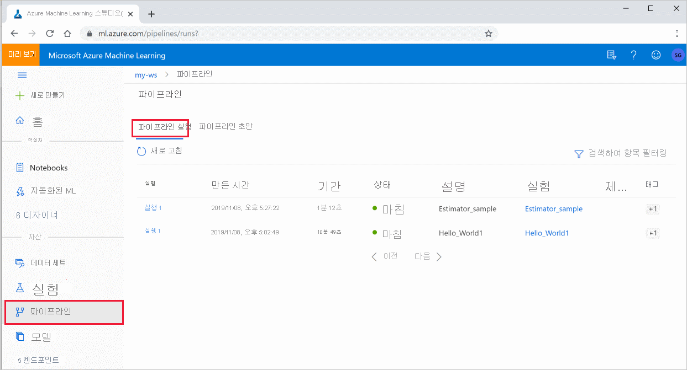
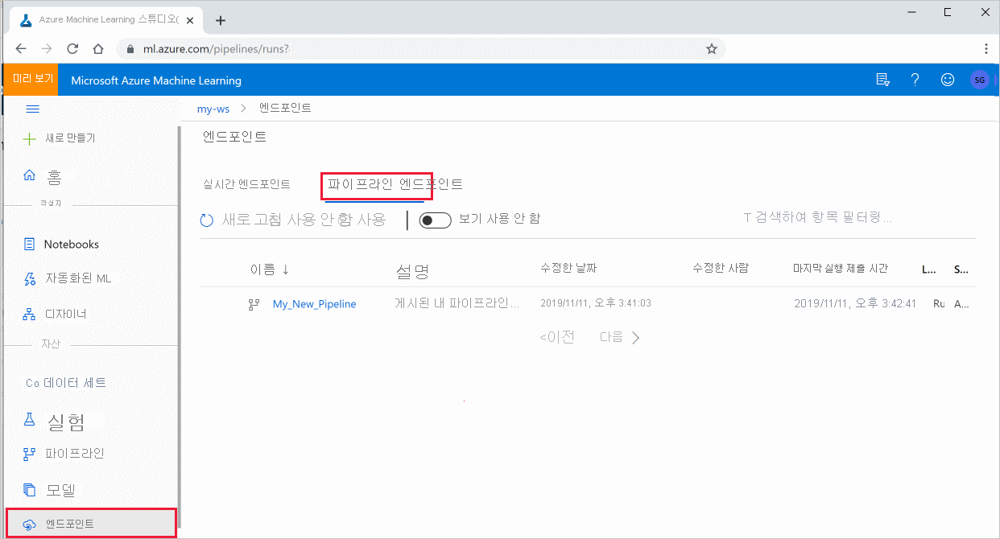

# <a name="create-and-run-machine-learning-pipelines-with-azure-machine-learning-sdk"></a>Azure Machine Learning SDK를 사용하여 기계 학습 파이프라인 만들기 및 실행

[!INCLUDE [applies-to-skus](../../includes/aml-applies-to-basic-enterprise-sku.md)]

이 문서에서는 [Azure Machine Learning SDK](https://docs.microsoft.com/python/api/overview/azure/ml/intro?view=azure-ml-py)를 사용하여 [기계 학습 파이프라인](concept-ml-pipelines.md)을 만들고 게시, 실행 및 추적하는 방법을 알아봅니다.  **Ml 파이프라인** 을 사용 하 여 다양 한 ml 단계를 함께 연결 하는 워크플로를 만든 후 나중에 액세스 하거나 다른 사용자와 공유 하기 위해 해당 파이프라인을 Azure Machine Learning 작업 영역에 게시 합니다.  ML 파이프라인은 다양 한 계산을 사용 하 여 일괄 처리를 다시 실행 하는 대신 단계를 다시 사용 하 고 ML 워크플로를 다른 사람들과 공유 하는 일괄 처리 점수 매기기 시나리오에 적합 합니다.

ML 작업의 CI/CD 자동화를 위해 [Azure 파이프라인](https://docs.microsoft.com/azure/devops/pipelines/targets/azure-machine-learning?context=azure%2Fmachine-learning%2Fservice%2Fcontext%2Fml-context&view=azure-devops&tabs=yaml) 이라는 다른 종류의 파이프라인을 사용할 수 있지만 해당 유형의 파이프라인은 작업 영역 내에 저장 되지 않습니다. [이러한 서로 다른 파이프라인을 비교](concept-ml-pipelines.md#which-azure-pipeline-technology-should-i-use)합니다.

데이터 준비 및 모델 교육과 같은 ML 파이프라인의 각 단계에는 하나 이상의 단계가 포함 될 수 있습니다.

만든 ML 파이프라인은 Azure Machine Learning [작업 영역의](how-to-manage-workspace.md)구성원에 게 표시 됩니다. 

ML 파이프라인은 계산에 원격 계산 대상을 사용 하 고 해당 파이프라인과 연결 된 중간 및 최종 데이터의 저장소를 사용 합니다. 지원 되는 [Azure Storage](https://docs.microsoft.com/azure/storage/) 위치에서 데이터를 읽고 쓸 수 있습니다.

Azure 구독이 없는 경우 시작하기 전에 체험 계정을 만듭니다. [Azure Machine Learning 평가판 또는 유료 버전](https://aka.ms/AMLFree)을 사용해 보세요.

## <a name="prerequisites"></a>사전 요구 사항

* 모든 파이프라인 리소스를 수용하는 [Azure Machine Learning 작업 영역](how-to-manage-workspace.md)을 만듭니다.

* Azure Machine Learning SDK를 설치 하거나 SDK가 이미 설치 된 [Azure Machine Learning 계산 인스턴스](concept-compute-instance.md) 를 사용 하도록 [개발 환경을 구성](how-to-configure-environment.md) 합니다.

작업 영역을 연결 하 여 시작 합니다.

```Python
import azureml.core
from azureml.core import Workspace, Datastore

ws = Workspace.from_config()
```

## <a name="set-up-machine-learning-resources"></a>기계 학습 리소스 설정

ML 파이프라인을 실행 하는 데 필요한 리소스를 만듭니다.

* 파이프라인 단계에서 필요한 데이터에 액세스하는 데 사용되는 데이터 저장소를 설정합니다.

* `Dataset`데이터 저장소에 상주 하거나 데이터 저장소에 액세스할 수 있는 영구 데이터를 가리키도록 개체를 구성 합니다. `PipelineData`파이프라인 단계 간에 전달 되는 임시 데이터에 대 한 개체를 구성 합니다. 

* 파이프라인 단계가 실행될 [컴퓨팅 대상](concept-azure-machine-learning-architecture.md#compute-targets)을 설정합니다.

### <a name="set-up-a-datastore"></a>데이터 저장소 설정

데이터 저장소는 파이프라인에서 액세스할 데이터를 저장합니다. 각 작업 영역마다 기본 데이터 저장소가 있습니다. 추가 데이터 저장소를 등록할 수 있습니다. 

작업 영역을 만들 때 [Azure Files](https://docs.microsoft.com/azure/storage/files/storage-files-introduction) 및 [Azure Blob 저장소가](https://docs.microsoft.com/azure/storage/blobs/storage-blobs-introduction) 작업 영역에 연결 됩니다. 기본 데이터 저장소는 Azure Blob storage에 연결 하기 위해 등록 됩니다. 자세한 내용은 [Azure Files, Azure Blob 또는 Azure Disk를 사용할지 여부 결정](https://docs.microsoft.com/azure/storage/common/storage-decide-blobs-files-disks)을 참조하세요. 

```python
# Default datastore 
def_data_store = ws.get_default_datastore()

# Get the blob storage associated with the workspace
def_blob_store = Datastore(ws, "workspaceblobstore")

# Get file storage associated with the workspace
def_file_store = Datastore(ws, "workspacefilestore")

```

파이프라인에서 액세스할 수 있도록 데이터 파일 또는 디렉터리를 해당 데이터 저장소에 업로드합니다. 이 예제에서는 Blob 저장소를 데이터 저장소로 사용 합니다.

```python
def_blob_store.upload_files(
    ["iris.csv"],
    target_path="train-dataset",
    overwrite=True)
```

파이프라인은 하나 이상의 단계로 구성됩니다. 단계는 컴퓨팅 대상에서 실행되는 단위입니다. 단계는 데이터 원본을 사용 하 고 "중간" 데이터를 생성할 수 있습니다. 단계는 모델, 모델과 종속 파일이 있는 디렉터리 또는 임시 데이터와 같은 데이터를 만들 수 있습니다. 그런 다음, 파이프라인의 다른 후속 단계에서 이 데이터를 사용할 수 있습니다.

파이프라인을 데이터에 연결 하는 방법에 대 한 자세한 내용은 [데이터에 액세스 하는 방법](how-to-access-data.md) 및 데이터 [집합을 등록](how-to-create-register-datasets.md)하는 방법 문서를 참조 하세요. 

### <a name="configure-data-using-dataset-and-pipelinedata-objects"></a>`Dataset`및 개체를 사용 하 여 데이터 구성 `PipelineData`

파이프라인에서 단계의 입력으로 참조할 수 있는 데이터 원본을 방금 만들었습니다. 파이프라인에 데이터를 제공 하는 기본 방법은 [Dataset](https://docs.microsoft.com/python/api/azureml-core/azureml.core.dataset.Dataset) 개체입니다. `Dataset`개체는 데이터 저장소 또는 웹 URL에서 액세스할 수 있거나 액세스할 수 있는 데이터를 가리킵니다. `Dataset`클래스는 추상 클래스 이므로 하나 이상의 파일 `FileDataset` 을 참조 하는 (하나 이상의 파일 참조) 또는 `TabularDataset` 구분 기호로 분리 된 열이 있는 하나 이상의 파일에서 만든의 인스턴스를 만듭니다.

`Dataset`개체는 버전 관리, 차이 및 요약 통계를 지원 합니다. `Dataset`은 (는) 지연 평가 (예: Python 생성기) 되며 분할 또는 필터링을 통해 하위 집합을 효율적으로 사용할 수 있습니다. 

`Dataset` [From_file](https://docs.microsoft.com/python/api/azureml-core/azureml.data.dataset_factory.filedatasetfactory?view=azure-ml-py#from-files-path--validate-true-) 또는 [from_delimited_files](https://docs.microsoft.com/python/api/azureml-core/azureml.data.dataset_factory.tabulardatasetfactory?view=azure-ml-py#from-delimited-files-path--validate-true--include-path-false--infer-column-types-true--set-column-types-none--separator------header-true--partition-format-none--support-multi-line-false-)와 같은 메서드를 사용 하 여를 만듭니다.

```python
from azureml.core import Dataset

iris_tabular_dataset = Dataset.Tabular.from_delimited_files([(def_blob_store, 'train-dataset/iris.csv')])
```

중간 데이터(또는 단계의 출력)는 [PipelineData](https://docs.microsoft.com/python/api/azureml-pipeline-core/azureml.pipeline.core.pipelinedata?view=azure-ml-py) 개체로 표시됩니다. `output_data1`은 단계의 출력으로 생성되며 하나 이상 후속 단계의 입력으로 사용됩니다. `PipelineData`는 단계 간에 데이터 종속성을 도입하고 파이프라인에 암시적 실행 순서를 만듭니다. 이 개체는 나중에 파이프라인 단계를 만들 때 사용 됩니다.

```python
from azureml.pipeline.core import PipelineData

output_data1 = PipelineData(
    "output_data1",
    datastore=def_blob_store,
    output_name="output_data1")
```

데이터 집합 및 파이프라인 데이터를 사용 하는 방법에 대 한 자세한 내용 및 샘플 코드는 [ML 파이프라인 단계 (Python) 간에 데이터 이동](how-to-move-data-in-out-of-pipelines.md)에서 찾을 수 있습니다.

## <a name="set-up-a-compute-target"></a>컴퓨팅 대상 설정

Azure Machine Learning에서 ‘__컴퓨팅__’(또는 ‘__컴퓨팅 대상__’) 용어는 기계 학습 파이프라인에서 계산 단계를 수행하는 머신 또는 클러스터를 가리킵니다.   컴퓨팅 대상의 전체 목록 및 컴퓨팅 대상을 만들고 작업 영역에 연결하는 방법에 대해서는 [모델 학습을 위한 컴퓨팅 대상](how-to-set-up-training-targets.md)을 참조하세요.  모델을 학습하든 파이프라인 단계를 실행하든 상관 없이 컴퓨팅 모델을 만들고 연결하는 프로세스는 동일합니다. 컴퓨팅 대상을 만들고 연결한 후 [파이프라인 단계](#steps)에서 `ComputeTarget` 개체를 사용합니다.

> [!IMPORTANT]
> 컴퓨팅 대상에 대한 관리 작업 수행은 원격 작업 내에서 지원되지 않습니다. 기계 학습 파이프라인은 원격 작업으로 제출되므로 파이프라인 내부에서 컴퓨팅 대상에 관리 작업을 사용하지 마십시오.

다음에 대한 컴퓨팅 대상을 만들고 연결하는 예가 아래에 나와 있습니다.

* Azure Machine Learning 컴퓨팅
* Azure Databricks 
* Azure 데이터 레이크 분석

[!INCLUDE [low-pri-note](../../includes/machine-learning-low-pri-vm.md)]

### <a name="azure-machine-learning-compute"></a>Azure Machine Learning 컴퓨팅

단계를 실행하기 위한 Azure Machine Learning 컴퓨팅을 만들 수 있습니다.

```python
from azureml.core.compute import ComputeTarget, AmlCompute

compute_name = "aml-compute"
vm_size = "STANDARD_NC6"
if compute_name in ws.compute_targets:
    compute_target = ws.compute_targets[compute_name]
    if compute_target and type(compute_target) is AmlCompute:
        print('Found compute target: ' + compute_name)
else:
    print('Creating a new compute target...')
    provisioning_config = AmlCompute.provisioning_configuration(vm_size=vm_size,  # STANDARD_NC6 is GPU-enabled
                                                                min_nodes=0,
                                                                max_nodes=4)
    # create the compute target
    compute_target = ComputeTarget.create(
        ws, compute_name, provisioning_config)

    # Can poll for a minimum number of nodes and for a specific timeout.
    # If no min node count is provided it will use the scale settings for the cluster
    compute_target.wait_for_completion(
        show_output=True, min_node_count=None, timeout_in_minutes=20)

    # For a more detailed view of current cluster status, use the 'status' property
    print(compute_target.status.serialize())
```

### <a name="azure-databricks"></a><a id="databricks"></a>Azure Databricks

Azure Databricks는 Azure 클라우드의 Apache Spark 기반 환경입니다. 이 환경은 Azure Machine Learning 파이프라인 사용 시 컴퓨팅 대상으로 사용할 수 있습니다.

사용하기 전에 Azure Databricks 작업 영역을 만듭니다. 작업 영역 리소스를 만들려면 [Azure Databricks에서 Spark 작업 실행](https://docs.microsoft.com/azure/azure-databricks/quickstart-create-databricks-workspace-portal) 문서를 참조 하세요.

Azure Databricks를 컴퓨팅 대상으로 연결하려면 다음 정보를 제공합니다.

* __Databricks compute name__:이 계산 리소스에 할당할 이름입니다.
* __Databricks 작업 영역 이름__: Azure Databricks 작업 영역의 이름입니다.
* __Databricks access token__: Azure Databricks을 인증 하는 데 사용 되는 액세스 토큰입니다. 액세스 토큰을 생성하려면 [인증](https://docs.azuredatabricks.net/dev-tools/api/latest/authentication.html) 문서를 참조하세요.

다음 코드는 Azure Machine Learning SDK를 사용 하 여 Azure Databricks를 계산 대상으로 연결 하는 방법을 보여 줍니다.__Databricks 작업 영역은 AML 작업 영역과 동일한 구독에 있어야 합니다__.

```python
import os
from azureml.core.compute import ComputeTarget, DatabricksCompute
from azureml.exceptions import ComputeTargetException

databricks_compute_name = os.environ.get(
    "AML_DATABRICKS_COMPUTE_NAME", "<databricks_compute_name>")
databricks_workspace_name = os.environ.get(
    "AML_DATABRICKS_WORKSPACE", "<databricks_workspace_name>")
databricks_resource_group = os.environ.get(
    "AML_DATABRICKS_RESOURCE_GROUP", "<databricks_resource_group>")
databricks_access_token = os.environ.get(
    "AML_DATABRICKS_ACCESS_TOKEN", "<databricks_access_token>")

try:
    databricks_compute = ComputeTarget(
        workspace=ws, name=databricks_compute_name)
    print('Compute target already exists')
except ComputeTargetException:
    print('compute not found')
    print('databricks_compute_name {}'.format(databricks_compute_name))
    print('databricks_workspace_name {}'.format(databricks_workspace_name))
    print('databricks_access_token {}'.format(databricks_access_token))

    # Create attach config
    attach_config = DatabricksCompute.attach_configuration(resource_group=databricks_resource_group,
                                                           workspace_name=databricks_workspace_name,
                                                           access_token=databricks_access_token)
    databricks_compute = ComputeTarget.attach(
        ws,
        databricks_compute_name,
        attach_config
    )

    databricks_compute.wait_for_completion(True)
```

자세한 예제는 GitHub의 [예제 노트북](https://aka.ms/pl-databricks) 을 참조 하세요.

### <a name="azure-data-lake-analytics"></a><a id="adla"></a>Azure 데이터 레이크 분석

Azure Data Lake Analytics는 Azure 클라우드의 빅 데이터 분석 플랫폼입니다. 이 환경은 Azure Machine Learning 파이프라인 사용 시 컴퓨팅 대상으로 사용할 수 있습니다.

사용하기 전에 Azure Data Lake Analytics 계정을 만듭니다. 이 리소스를 만들려면 [Azure Data Lake Analytics 시작](https://docs.microsoft.com/azure/data-lake-analytics/data-lake-analytics-get-started-portal) 문서를 참조하세요.

Data Lake Analytics를 컴퓨팅 대상으로 연결하려면 Azure Machine Learning SDK를 사용하고 다음 정보를 제공해야 합니다.

* __컴퓨팅 이름__: 이 컴퓨팅 리소스에 할당하려는 이름입니다.
* __리소스 그룹__: Data Lake Analytics 계정이 포함 된 리소스 그룹입니다.
* __계정 이름__: Data Lake Analytics 계정 이름입니다.

다음 코드는 컴퓨팅 대상으로 Data Lake Analytics에 연결하는 방법을 보여 줍니다.

```python
import os
from azureml.core.compute import ComputeTarget, AdlaCompute
from azureml.exceptions import ComputeTargetException


adla_compute_name = os.environ.get(
    "AML_ADLA_COMPUTE_NAME", "<adla_compute_name>")
adla_resource_group = os.environ.get(
    "AML_ADLA_RESOURCE_GROUP", "<adla_resource_group>")
adla_account_name = os.environ.get(
    "AML_ADLA_ACCOUNT_NAME", "<adla_account_name>")

try:
    adla_compute = ComputeTarget(workspace=ws, name=adla_compute_name)
    print('Compute target already exists')
except ComputeTargetException:
    print('compute not found')
    print('adla_compute_name {}'.format(adla_compute_name))
    print('adla_resource_id {}'.format(adla_resource_group))
    print('adla_account_name {}'.format(adla_account_name))
    # create attach config
    attach_config = AdlaCompute.attach_configuration(resource_group=adla_resource_group,
                                                     account_name=adla_account_name)
    # Attach ADLA
    adla_compute = ComputeTarget.attach(
        ws,
        adla_compute_name,
        attach_config
    )

    adla_compute.wait_for_completion(True)
```

자세한 예제는 GitHub의 [예제 노트북](https://aka.ms/pl-adla) 을 참조 하세요.

> [!TIP]
> Azure Machine Learning 파이프라인은 Data Lake Analytics 계정의 기본 데이터 저장소에 저장된 데이터에만 작동할 수 있습니다. 작업 해야 하는 데이터가 기본이 아닌 저장소에 있는 경우를 사용 [`DataTransferStep`](https://docs.microsoft.com/python/api/azureml-pipeline-steps/azureml.pipeline.steps.data_transfer_step.datatransferstep?view=azure-ml-py) 하 여 학습 전에 데이터를 복사할 수 있습니다.

## <a name="construct-your-pipeline-steps"></a><a id="steps"></a>파이프라인 단계 구성

컴퓨팅 대상을 만들고 작업 영역에 연결하면 파이프라인 단계를 정의할 준비가 된 것입니다. Azure Machine Learning SDK를 통해 사용할 수 있는 여러 가지 기본 제공 단계가 있습니다. 이러한 단계의 가장 기본적인 방법은 지정 된 계산 대상에서 Python 스크립트를 실행 하는 [PythonScriptStep](https://docs.microsoft.com/python/api/azureml-pipeline-steps/azureml.pipeline.steps.python_script_step.pythonscriptstep?view=azure-ml-py)입니다.

```python
from azureml.pipeline.steps import PythonScriptStep

ds_input = my_dataset.as_named_input('input1')

trainStep = PythonScriptStep(
    script_name="train.py",
    arguments=["--input", ds_input.as_download(), "--output", output_data1],
    inputs=[ds_input],
    outputs=[output_data1],
    compute_target=compute_target,
    source_directory=project_folder,
    allow_reuse=True
)
```

이전 결과 ()를 다시 사용 `allow_reuse` 하는 것은 불필요 한 다시 정렬을 제거 하면 민첩성을 제공 하므로 공동 작업 환경에서 파이프라인을 사용할 때 키입니다. 다시 사용은 script_name, 입력 및 단계의 매개 변수가 동일 하 게 유지 되는 경우의 기본 동작입니다. 단계의 출력이 다시 사용 되는 경우 작업은 계산에 전송 되지 않고 이전 실행의 결과를 다음 단계의 실행에 즉시 사용할 수 있습니다. `allow_reuse`가 false로 설정 된 경우 파이프라인 실행 중에이 단계에 대 한 새 실행이 항상 생성 됩니다. 

단계를 정의한 후 일부 또는 모든 단계를 사용하여 파이프라인을 빌드합니다.

> [!NOTE]
> 단계를 정의 하거나 파이프라인을 빌드할 때 파일 또는 데이터가 Azure Machine Learning 업로드 되지 않습니다.

```python
# list of steps to run
compareModels = [trainStep, extractStep, compareStep]

from azureml.pipeline.core import Pipeline

# Build the pipeline
pipeline1 = Pipeline(workspace=ws, steps=[compareModels])
```

다음 예제에서는 앞서 만든 Azure Databricks 컴퓨팅 대상을 사용합니다. 

```python
from azureml.pipeline.steps import DatabricksStep

dbStep = DatabricksStep(
    name="databricksmodule",
    inputs=[step_1_input],
    outputs=[step_1_output],
    num_workers=1,
    notebook_path=notebook_path,
    notebook_params={'myparam': 'testparam'},
    run_name='demo run name',
    compute_target=databricks_compute,
    allow_reuse=False
)
# List of steps to run
steps = [dbStep]

# Build the pipeline
pipeline1 = Pipeline(workspace=ws, steps=steps)
```

### <a name="use-a-dataset"></a>데이터 세트 사용 

Azure Blob storage, Azure Files, Azure Data Lake Storage Gen1, Azure Data Lake Storage Gen2, Azure SQL Database 및 Azure Database for PostgreSQL에서 만든 데이터 집합은 모든 파이프라인 단계에 대 한 입력으로 사용할 수 있습니다. [DataTransferStep](https://docs.microsoft.com/python/api/azureml-pipeline-steps/azureml.pipeline.steps.datatransferstep?view=azure-ml-py), [DatabricksStep](https://docs.microsoft.com/python/api/azureml-pipeline-steps/azureml.pipeline.steps.databricks_step.databricksstep?view=azure-ml-py)에 대 한 출력을 작성 하거나 특정 데이터 저장소에 데이터를 쓰려면 [PipelineData](https://docs.microsoft.com/python/api/azureml-pipeline-core/azureml.pipeline.core.pipelinedata?view=azure-ml-py)를 사용 합니다. 

> [!IMPORTANT]
> PipelineData를 사용 하 여 데이터 저장소에 출력 데이터를 다시 쓰는 것은 Azure Blob 및 Azure 파일 공유 데이터 저장소에 대해서만 지원 됩니다. 이 기능은 현재 [ADLS Gen 2 데이터 저장소](https://docs.microsoft.com/python/api/azureml-core/azureml.data.azure_data_lake_datastore.azuredatalakegen2datastore?view=azure-ml-py) 에 대해 지원 되지 않습니다.

```python
dataset_consuming_step = PythonScriptStep(
    script_name="iris_train.py",
    inputs=[iris_tabular_dataset.as_named_input("iris_data")],
    compute_target=compute_target,
    source_directory=project_folder
)
```

그런 다음 [input_datasets](https://docs.microsoft.com/python/api/azureml-core/azureml.core.run.run?view=azure-ml-py#input-datasets) 사전을 사용 하 여 파이프라인에서 데이터 집합을 검색 합니다.

```python
# iris_train.py
from azureml.core import Run, Dataset

run_context = Run.get_context()
iris_dataset = run_context.input_datasets['iris_data']
dataframe = iris_dataset.to_pandas_dataframe()
```

줄 `Run.get_context()` 이 강조 표시 됩니다. 이 함수는 `Run` 현재 실험적 실행을 나타내는를 검색 합니다. 위의 샘플에서는이를 사용 하 여 등록 된 데이터 집합을 검색 합니다. 개체의 또 다른 일반적인 용도는 실험 `Run` 자체와 실험이 있는 작업 영역을 모두 검색 하는 것입니다. 

```python
# Within a PythonScriptStep

ws = Run.get_context().experiment.workspace
```

데이터를 전달 하 고 액세스 하는 다른 방법을 비롯 한 자세한 내용은 [ML 파이프라인 단계 간 데이터 이동 (Python)](how-to-move-data-in-out-of-pipelines.md)을 참조 하세요.

## <a name="submit-the-pipeline"></a>파이프라인 제출

파이프라인을 제출할 때 Azure Machine Learning는 각 단계에 대 한 종속성을 확인 하 고 지정한 원본 디렉터리의 스냅숏을 업로드 합니다. 소스 디렉터리를 지정하지 않으면 현재 로컬 디렉터리가 업로드됩니다. 또한 스냅숏은 작업 영역에 실험의 일부로 저장 됩니다.

> [!IMPORTANT]
> [!INCLUDE [amlinclude-info](../../includes/machine-learning-amlignore-gitignore.md)]
>
> 자세한 내용은 [스냅샷](concept-azure-machine-learning-architecture.md#snapshots)을 참조하세요.

```python
from azureml.core import Experiment

# Submit the pipeline to be run
pipeline_run1 = Experiment(ws, 'Compare_Models_Exp').submit(pipeline1)
pipeline_run1.wait_for_completion()
```

파이프라인을 처음 실행하는 경우 Azure Machine Learning은 다음을 수행합니다.

* 작업 영역과 연결된 Blob Storage에서 컴퓨팅 대상으로 프로젝트 스냅샷을 다운로드합니다.
* 파이프라인의 각 단계에 해당하는 Docker 이미지를 빌드합니다.
* 각 단계에 대 한 Docker 이미지를 컨테이너 레지스트리에서 계산 대상으로 다운로드 합니다.
* 및 개체에 대 한 액세스를 구성 `Dataset` `PipelineData` 합니다. `as_mount()`액세스 모드의 경우 퓨즈를 사용 하 여 가상 액세스를 제공 합니다. 마운트가 지원 되지 않거나 사용자가로 액세스를 지정 하는 경우 `as_download()` 데이터는 대신 계산 대상으로 복사 됩니다.
* 단계 정의에 지정된 컴퓨팅 대상에서 단계를 실행합니다. 
* 단계에서 지정한 로그, stdout, stderr, 메트릭, 출력 등의 아티팩트를 만듭니다. 이러한 아티팩트는 업로드 되어 사용자의 기본 데이터 저장소에 보관 됩니다.


자세한 내용은 [실험 클래스](https://docs.microsoft.com/python/api/azureml-core/azureml.core.experiment.experiment?view=azure-ml-py) 참조를 참조 하세요.

### <a name="view-results-of-a-pipeline"></a>파이프라인 결과 보기

모든 파이프라인 목록과 스튜디오에서 실행 세부 정보를 확인 합니다.

1. [Azure Machine Learning Studio](https://ml.azure.com)에 로그인합니다.

1. [작업 영역을 봅니다](how-to-manage-workspace.md#view).

1. 왼쪽 **에서 파이프라인을 선택 하** 여 모든 파이프라인 실행을 확인 합니다.
 
 
1. 특정 파이프라인을 선택하여 실행 결과를 확인합니다.

## <a name="git-tracking-and-integration"></a>Git 추적 및 통합

원본 디렉터리가 로컬 Git 리포지토리인 학습 실행을 시작하면 리포지토리에 대한 정보가 실행 기록에 저장됩니다. 자세한 내용은 [Azure Machine Learning에 대한 Git 통합](concept-train-model-git-integration.md)을 참조하세요.

## <a name="publish-a-pipeline"></a>파이프라인 게시

파이프라인을 게시하여 나중에 다른 입력을 사용하여 실행할 수 있습니다. 이미 게시된 파이프라인의 REST 엔드포인트가 매개 변수를 허용하려면 파이프라인을 게시하기 전에 매개 변수화해야 합니다.

1. 파이프라인 매개 변수를 만들려면 기본값으로 [PipelineParameter](https://docs.microsoft.com/python/api/azureml-pipeline-core/azureml.pipeline.core.graph.pipelineparameter?view=azure-ml-py) 개체를 사용합니다.

   ```python
   from azureml.pipeline.core.graph import PipelineParameter
   
   pipeline_param = PipelineParameter(
     name="pipeline_arg",
     default_value=10)
   ```

2. 다음과 같이 이 `PipelineParameter` 개체를 파이프라인의 단계에 대한 매개 변수로 추가합니다.

   ```python
   compareStep = PythonScriptStep(
     script_name="compare.py",
     arguments=["--comp_data1", comp_data1, "--comp_data2", comp_data2, "--output_data", out_data3, "--param1", pipeline_param],
     inputs=[ comp_data1, comp_data2],
     outputs=[out_data3],
     compute_target=compute_target,
     source_directory=project_folder)
   ```

3. 이 파이프라인을 게시하면 호출 시 매개 변수를 허용합니다.

   ```python
   published_pipeline1 = pipeline_run1.publish_pipeline(
        name="My_Published_Pipeline",
        description="My Published Pipeline Description",
        version="1.0")
   ```

### <a name="run-a-published-pipeline"></a>게시된 파이프라인 실행

게시된 모든 파이프라인에는 REST 엔드포인트가 있습니다. 파이프라인 끝점을 사용 하 여 Python이 아닌 클라이언트를 비롯 한 모든 외부 시스템에서 파이프라인 실행을 트리거할 수 있습니다. 이 엔드포인트는 일괄 처리 채점 및 다시 학습 시나리오에서 “관리되는 반복 가능성”을 지원합니다.

이전 파이프라인의 실행을 호출 하려면 [Azurecliauthentication 클래스](https://docs.microsoft.com/python/api/azureml-core/azureml.core.authentication.azurecliauthentication?view=azure-ml-py) 참조에 설명 된 대로 Azure Active Directory 인증 헤더 토큰이 필요 하거나 [Azure Machine Learning 노트북의 인증](https://aka.ms/pl-restep-auth) 에 대 한 자세한 내용을 확인 하세요.

```python
from azureml.pipeline.core import PublishedPipeline
import requests

response = requests.post(published_pipeline1.endpoint,
                         headers=aad_token,
                         json={"ExperimentName": "My_Pipeline",
                               "ParameterAssignments": {"pipeline_arg": 20}})
```

## <a name="create-a-versioned-pipeline-endpoint"></a>버전 지정 파이프라인 끝점 만들기

게시 된 여러 파이프라인이 있는 파이프라인 끝점을 만들 수 있습니다. 이는 게시 된 파이프라인 처럼 사용할 수 있지만 ML 파이프라인을 반복 하 고 업데이트할 때 고정 REST 끝점을 제공 합니다.

```python
from azureml.pipeline.core import PipelineEndpoint

published_pipeline = PublishedPipeline.get(workspace="ws", name="My_Published_Pipeline")
pipeline_endpoint = PipelineEndpoint.publish(workspace=ws, name="PipelineEndpointTest",
                                            pipeline=published_pipeline, description="Test description Notebook")
```

### <a name="submit-a-job-to-a-pipeline-endpoint"></a>파이프라인 끝점에 작업 제출

파이프라인 끝점의 기본 버전에 작업을 제출할 수 있습니다.

```python
pipeline_endpoint_by_name = PipelineEndpoint.get(workspace=ws, name="PipelineEndpointTest")
run_id = pipeline_endpoint_by_name.submit("PipelineEndpointExperiment")
print(run_id)
```

특정 버전으로 작업을 제출할 수도 있습니다.

```python
run_id = pipeline_endpoint_by_name.submit("PipelineEndpointExperiment", pipeline_version="0")
print(run_id)
```

REST API를 사용 하 여 동일한 작업을 수행할 수 있습니다.

```python
rest_endpoint = pipeline_endpoint_by_name.endpoint
response = requests.post(rest_endpoint, 
                         headers=aad_token, 
                         json={"ExperimentName": "PipelineEndpointExperiment",
                               "RunSource": "API",
                               "ParameterAssignments": {"1": "united", "2":"city"}})
```

### <a name="use-published-pipelines-in-the-studio"></a>스튜디오에서 게시 된 파이프라인 사용

또한 스튜디오에서 게시 된 파이프라인을 실행할 수 있습니다.

1. [Azure Machine Learning Studio](https://ml.azure.com)에 로그인합니다.

1. [작업 영역을 봅니다](how-to-manage-workspace.md#view).

1. 왼쪽에서 **끝점**을 선택 합니다.

1. 위쪽에서 **파이프라인 끝점**을 선택 합니다.
 

1. 파이프라인 끝점의 이전 실행 결과를 실행, 사용 또는 검토 하려면 특정 파이프라인을 선택 합니다.

### <a name="disable-a-published-pipeline"></a>게시 된 파이프라인 사용 안 함

게시 된 파이프라인 목록에서 파이프라인을 숨기려면 스튜디오 또는 SDK에서 파이프라인을 사용 하지 않도록 설정 합니다.

```python
# Get the pipeline by using its ID from Azure Machine Learning studio
p = PublishedPipeline.get(ws, id="068f4885-7088-424b-8ce2-eeb9ba5381a6")
p.disable()
```

에서 다시 사용 하도록 설정할 수 있습니다 `p.enable()` . 자세한 내용은 [PublishedPipeline 클래스](https://docs.microsoft.com/python/api/azureml-pipeline-core/azureml.pipeline.core.publishedpipeline?view=azure-ml-py) 참조를 참조 하세요.

## <a name="caching--reuse"></a>캐싱 & 재사용  

파이프라인의 동작을 최적화 하 고 사용자 지정 하기 위해 캐싱 및 다시 사용에 대 한 몇 가지 작업을 수행할 수 있습니다. 예를 들어 다음을 선택할 수 있습니다.
+ 단계 정의 중에를 설정 하 여 **단계의 기본 재사용을 해제** 합니다 `allow_reuse=False` [step definition](https://docs.microsoft.com/python/api/azureml-pipeline-steps/?view=azure-ml-py). 불필요 한 실행을 제거 하면 민첩성을 제공 하므로 공동 작업 환경에서 파이프라인을 사용할 때 재사용할 수 있습니다. 그러나 재사용을 옵트아웃 (opt out) 할 수 있습니다.
+ 를 사용 하 여 **실행의 모든 단계에 대해 출력 다시 생성**`pipeline_run = exp.submit(pipeline, regenerate_outputs=False)`

기본적으로 `allow_reuse` 단계를 사용 하 고 `source_directory` 단계 정의에 지정 된를 해시 합니다. 따라서 지정 된 단계에 대 한 스크립트는 동일 하 게 유지 `script_name` 되 고, 입력 및 매개 변수를 그대로 유지 하 고,의 다른 모든 항목이 변경 되지 않은 경우에는 ` source_directory` 이전 단계 실행의 출력이 다시 사용 되 고, 작업이 계산에 전송 되지 않고, 이전 실행의 결과를 다음 단계에서 즉시 사용할 수 있습니다.

```python
step = PythonScriptStep(name="Hello World",
                        script_name="hello_world.py",
                        compute_target=aml_compute,
                        source_directory=source_directory,
                        allow_reuse=False,
                        hash_paths=['hello_world.ipynb'])
```

## <a name="next-steps"></a>다음 단계

- [GitHub의 Jupyter 노트북](https://aka.ms/aml-pipeline-readme)을 사용하여 기계 학습 파이프라인을 추가로 살펴봅니다.
- [Azureml-파이프라인-코어](https://docs.microsoft.com/python/api/azureml-pipeline-core/?view=azure-ml-py) 패키지 및 azureml- [파이프라인 단계](https://docs.microsoft.com/python/api/azureml-pipeline-steps/?view=azure-ml-py) 패키지에 대 한 SDK 참조 도움말을 참조 하세요.
- 파이프라인 디버깅 및 문제 해결에 대 한 팁은 [방법을](how-to-debug-pipelines.md) 참조 하세요.

[!INCLUDE [aml-clone-in-azure-notebook](../../includes/aml-clone-for-examples.md)]
