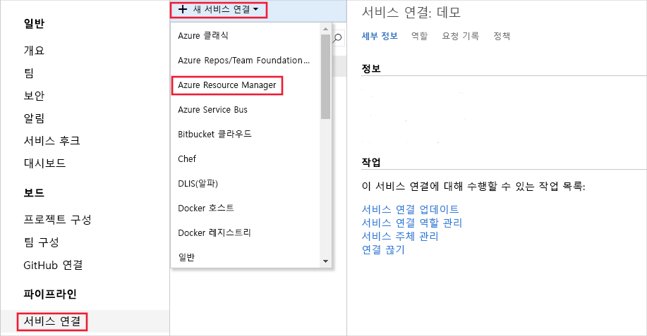
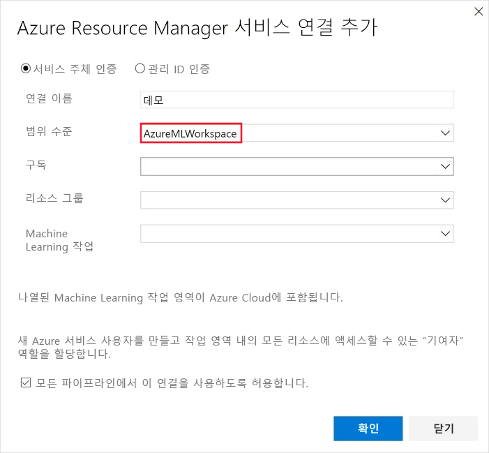
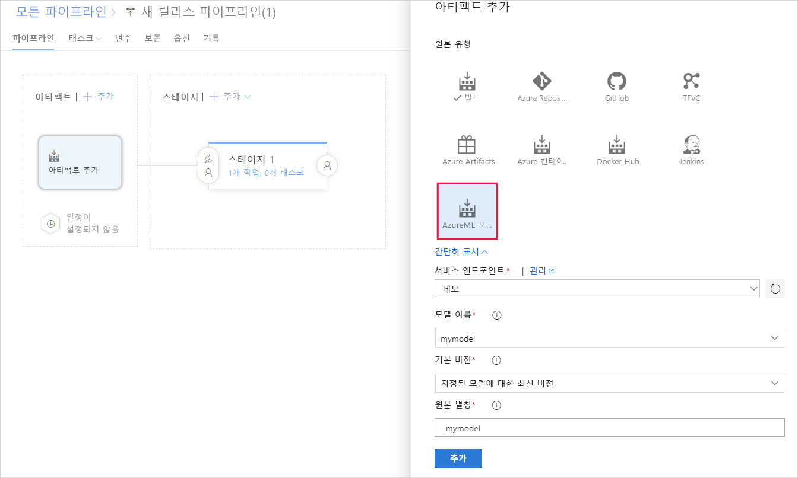
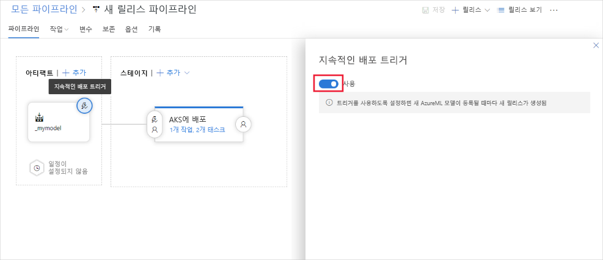

# <a name="deploy-models-with-azure-machine-learning"></a>Azure Machine Learning를 사용 하 여 모델 배포
[!INCLUDE [applies-to-skus](../../includes/aml-applies-to-basic-enterprise-sku.md)]

Azure 클라우드의 웹 서비스로 machine learning 모델을 배포 하거나 장치를 Azure IoT Edge 하는 방법에 대해 알아봅니다.

모델을 [배포 하는 위치](#target) 와 관계 없이 워크플로는 다음과 유사 합니다.

1. 모델을 등록합니다.
1. 배포를 준비합니다. (자산, 사용량, 컴퓨팅 대상을 지정합니다.)
1. 컴퓨팅 대상에 모델을 배포합니다.
1. 웹 서비스 라고도 하는 배포 된 모델을 테스트 합니다.

배포 워크플로와 관련 된 개념에 대 한 자세한 내용은 [Azure Machine Learning를 사용 하 여 모델 관리, 배포 및 모니터링](concept-model-management-and-deployment.md)을 참조 하세요.

## <a name="prerequisites"></a>필수 조건

- Azure Machine Learning 작업 영역 자세한 내용은 [Azure Machine Learning 작업 영역 만들기](how-to-manage-workspace.md)를 참조 하세요.

- 모델. 학습 된 모델이 없는 경우 [이 자습서](https://aka.ms/azml-deploy-cloud)에 제공 된 모델 및 종속성 파일을 사용할 수 있습니다.

- [Machine Learning 서비스에 대 한 Azure CLI 확장](reference-azure-machine-learning-cli.md), [PYTHON 용 Azure Machine Learning SDK](https://docs.microsoft.com/python/api/overview/azure/ml/intro?view=azure-ml-py)또는 [Azure Machine Learning Visual Studio Code 확장](how-to-vscode-tools.md)입니다.

## <a name="connect-to-your-workspace"></a>작업 영역에 연결

다음 코드에서는 로컬 개발 환경에 캐시 된 정보를 사용 하 여 Azure Machine Learning 작업 영역에 연결 하는 방법을 보여 줍니다.

+ **SDK 사용**

   ```python
   from azureml.core import Workspace
   ws = Workspace.from_config(path=".file-path/ws_config.json")
   ```

  SDK를 사용 하 여 작업 영역에 연결 하는 방법에 대 한 자세한 내용은 [Python 용 AZURE MACHINE LEARNING sdk](https://docs.microsoft.com/python/api/overview/azure/ml/intro?view=azure-ml-py#workspace) 설명서를 참조 하세요.

+ **CLI 사용**

   CLI를 사용 하는 경우 `-w` 또는 `--workspace-name` 매개 변수를 사용 하 여 명령에 대 한 작업 영역을 지정 합니다.

+ **VS Code 사용**

   VS Code 사용 하는 경우 그래픽 인터페이스를 사용 하 여 작업 영역을 선택 합니다. 자세한 내용은 VS Code 확장 설명서에서 [모델 배포 및 관리](how-to-vscode-tools.md#deploy-and-manage-models) 를 참조 하세요.

## <a id="registermodel"></a>모델 등록

등록 된 모델은 모델을 구성 하는 하나 이상의 파일에 대 한 논리적 컨테이너입니다. 예를 들어 여러 파일에 저장 된 모델의 경우 작업 영역에서 단일 모델로 등록할 수 있습니다. 파일을 등록 한 후 등록 된 모델을 다운로드 하거나 배포 하 고 등록 한 모든 파일을 받을 수 있습니다.

> [!TIP]
> 모델을 등록할 때 학습 실행의 클라우드 위치 또는 로컬 디렉터리의 경로를 제공 합니다. 이 경로는 등록 프로세스의 일부로 업로드할 파일을 찾는 것입니다. 항목 스크립트에 사용 된 경로와 일치 하지 않아도 됩니다. 자세한 내용은 [항목 스크립트에서 모델 파일 찾기](#locate-model-files-in-your-entry-script)를 참조 하세요.

기계 학습 모델은 Azure Machine Learning 작업 영역에 등록 됩니다. 모델은 Azure Machine Learning 또는 다른 위치에서 가져올 수 있습니다. 다음 예에서는 모델을 등록 하는 방법을 보여 줍니다.

### <a name="register-a-model-from-an-experiment-run"></a>실험 실행에서 모델 등록

이 섹션의 코드 조각은 학습 실행에서 모델을 등록 하는 방법을 보여 줍니다.

> [!IMPORTANT]
> 이러한 코드 조각을 사용 하려면 이전에 학습 실행을 수행 하 고 `Run` 개체 (SDK 예) 또는 실행 ID 값 (CLI 예)에 대 한 액세스 권한이 있어야 합니다. 학습 모델에 대 한 자세한 내용은 [모델 학습을 위한 계산 대상 설정](how-to-set-up-training-targets.md)을 참조 하세요.

+ **SDK 사용**

  SDK를 사용 하 여 모델을 학습 하는 경우 모델 학습 방법에 따라 [Run](https://docs.microsoft.com/python/api/azureml-core/azureml.core.run.run?view=azure-ml-py) 개체나 [AutoMLRun](/python/api/azureml-train-automl-client/azureml.train.automl.run.automlrun) 개체를 받을 수 있습니다. 각 개체를 사용 하 여 실험 실행에서 만든 모델을 등록할 수 있습니다.

  + `azureml.core.Run` 개체에서 모델을 등록 합니다.
 
    ```python
    model = run.register_model(model_name='sklearn_mnist', model_path='outputs/sklearn_mnist_model.pkl')
    print(model.name, model.id, model.version, sep='\t')
    ```

    `model_path` 매개 변수는 모델의 클라우드 위치를 참조 합니다. 이 예제에서는 단일 파일의 경로를 사용 합니다. 모델 등록에 여러 파일을 포함 하려면 `model_path` 파일을 포함 하는 폴더의 경로로 설정 합니다. 자세한 내용은 [register_model](https://docs.microsoft.com/python/api/azureml-core/azureml.core.run.run?view=azure-ml-py#register-model-model-name--model-path-none--tags-none--properties-none--model-framework-none--model-framework-version-none--description-none--datasets-none--sample-input-dataset-none--sample-output-dataset-none--resource-configuration-none----kwargs-) 설명서를 참조 하세요.

  + `azureml.train.automl.run.AutoMLRun` 개체에서 모델을 등록 합니다.

    ```python
        description = 'My AutoML Model'
        model = run.register_model(description = description)

        print(run.model_id)
    ```

    이 예에서는 `metric` 및 `iteration` 매개 변수가 지정 되지 않으므로 가장 적합 한 기본 메트릭이 포함 된 반복이 등록 됩니다. Run에서 반환 된 `model_id` 값은 모델 이름 대신 사용 됩니다.

    자세한 내용은 [Register_model AutoMLRun](/python/api/azureml-train-automl-client/azureml.train.automl.run.automlrun#register-model-model-name-none--description-none--tags-none--iteration-none--metric-none-) 설명서를 참조 하세요.

+ **CLI 사용**

  ```azurecli-interactive
  az ml model register -n sklearn_mnist  --asset-path outputs/sklearn_mnist_model.pkl  --experiment-name myexperiment --run-id myrunid
  ```

  [!INCLUDE [install extension](../../includes/machine-learning-service-install-extension.md)]

  `--asset-path` 매개 변수는 모델의 클라우드 위치를 참조 합니다. 이 예제에서는 단일 파일의 경로를 사용 합니다. 모델 등록에 여러 파일을 포함 하려면 `--asset-path` 파일을 포함 하는 폴더의 경로로 설정 합니다.

+ **VS Code 사용**

  [VS Code](how-to-vscode-tools.md#deploy-and-manage-models) 확장을 사용 하 여 모델 파일이 나 폴더를 사용 하 여 모델을 등록 합니다.

### <a name="register-a-model-from-a-local-file"></a>로컬 파일에서 모델 등록

모델의 로컬 경로를 제공 하 여 모델을 등록할 수 있습니다. 폴더 또는 단일 파일의 경로를 제공할 수 있습니다. 이 메서드를 사용 하 여 Azure Machine Learning으로 학습 된 모델을 등록 한 다음 다운로드할 수 있습니다. 이 메서드를 사용 하 여 Azure Machine Learning 외부에서 학습 된 모델을 등록할 수도 있습니다.

[!INCLUDE [trusted models](../../includes/machine-learning-service-trusted-model.md)]

+ **SDK 및 ONNX 사용**

    ```python
    import os
    import urllib.request
    from azureml.core.model import Model
    # Download model
    onnx_model_url = "https://www.cntk.ai/OnnxModels/mnist/opset_7/mnist.tar.gz"
    urllib.request.urlretrieve(onnx_model_url, filename="mnist.tar.gz")
    os.system('tar xvzf mnist.tar.gz')
    # Register model
    model = Model.register(workspace = ws,
                            model_path ="mnist/model.onnx",
                            model_name = "onnx_mnist",
                            tags = {"onnx": "demo"},
                            description = "MNIST image classification CNN from ONNX Model Zoo",)
    ```

  모델 등록에 여러 파일을 포함 하려면 `model_path` 파일을 포함 하는 폴더의 경로로 설정 합니다.

+ **CLI 사용**

  ```azurecli-interactive
  az ml model register -n onnx_mnist -p mnist/model.onnx
  ```

  모델 등록에 여러 파일을 포함 하려면 `-p` 파일을 포함 하는 폴더의 경로로 설정 합니다.

**예상 시간**: 약 10 초

자세한 내용은 [모델 클래스](https://docs.microsoft.com/python/api/azureml-core/azureml.core.model.model?view=azure-ml-py)에 대 한 설명서를 참조 하세요.

Azure Machine Learning 외부에서 학습 한 모델을 사용 하는 방법에 대 한 자세한 내용은 [기존 모델을 배포 하는 방법](how-to-deploy-existing-model.md)을 참조 하세요.

<a name="target"></a>

## <a name="choose-a-compute-target"></a>계산 대상 선택

다음 계산 대상 또는 계산 리소스를 사용 하 여 웹 서비스 배포를 호스트할 수 있습니다.

[!INCLUDE [aml-compute-target-deploy](../../includes/aml-compute-target-deploy.md)]

## <a name="single-versus-multi-model-endpoints"></a>단일 및 다중 모델 끝점
Azure ML은 단일 끝점 뒤에 단일 또는 여러 모델을 배포 하도록 지원 합니다.

다중 모델 끝점은 공유 컨테이너를 사용 하 여 여러 모델을 호스팅합니다. 이를 통해 오버 헤드 비용을 줄이고 사용률을 높이고 모듈을 앙상블로 함께 연결할 수 있습니다. 배포 스크립트에서 지정 하는 모델은 서비스 컨테이너의 디스크에서 탑재 되 고 사용할 수 있습니다 .이 모델은 요청 시 메모리에 로드 하 고 점수 매기기 시간에 요청 되는 특정 모델을 기준으로 점수를 매길 수 있습니다.

단일 컨테이너 화 된 끝점 뒤에 여러 모델을 사용 하는 방법을 보여 주는 E2E 예제는 [다음 예제](https://github.com/Azure/MachineLearningNotebooks/tree/master/how-to-use-azureml/deployment/deploy-multi-model) 를 참조 하세요.

## <a name="prepare-to-deploy"></a>배포 준비

모델을 배포하려면 다음 항목이 필요합니다.

* **항목 스크립트**. 이 스크립트는 요청을 수락 하 고, 모델을 사용 하 여 요청 점수를 받은 후 결과를 반환 합니다.

    > [!IMPORTANT]
    > * 항목 스크립트는 모델에 따라 다릅니다. 들어오는 요청 데이터의 형식, 모델에 필요한 데이터의 형식 및 클라이언트에 반환 되는 데이터 형식을 이해 해야 합니다.
    >
    >   요청 데이터가 모델에서 사용할 수 없는 형식인 경우 스크립트는이를 허용 되는 형식으로 변환할 수 있습니다. 응답을 클라이언트에 반환 하기 전에 변환할 수도 있습니다.
    >
    > * Azure Machine Learning SDK는 웹 서비스 또는 IoT Edge 배포에서 데이터 저장소 또는 데이터 집합에 액세스 하는 방법을 제공 하지 않습니다. 배포 된 모델에서 Azure storage 계정의 데이터와 같이 배포 외부에 저장 된 데이터에 액세스 해야 하는 경우 관련 SDK를 사용 하 여 사용자 지정 코드 솔루션을 개발 해야 합니다. 예를 들어 [Python 용 AZURE STORAGE SDK](https://github.com/Azure/azure-storage-python)가 있습니다.
    >
    >   시나리오에 사용할 수 있는 대안은 [일괄 처리 예측](how-to-run-batch-predictions.md)으로, 점수 매기기 중 데이터 저장소에 대 한 액세스를 제공 합니다.

* 항목 스크립트나 모델을 실행하는 데 필요한 도우미 스크립트 또는 Python/Conda 패키지 같은 **종속성**.

* 배포된 모델을 호스트하는 컴퓨팅 대상에 대한 **배포 구성**. 이 구성에서는 모델을 실행하는 데 필요한 메모리 및 CPU 요구 사항 등을 설명합니다.

이러한 항목은 *추론 구성* 및 *배포 구성*에 캡슐화됩니다. 추론 구성은 항목 스크립트 및 기타 종속성을 참조합니다. SDK를 사용하여 배포를 수행하는 경우 이러한 구성을 프로그래밍 방식으로 정의합니다. CLI를 사용하는 경우 JSON 파일에서 정의합니다.

### <a id="script"></a>1. 항목 스크립트 및 종속성 정의

항목 스크립트는 배포된 웹 서비스에 전송된 데이터를 받아서 모델에 전달합니다. 그런 후 모델이 반환한 응답을 수락한 후 클라이언트에 반환합니다. *이 스크립트는 모델에 따라 다릅니다*. 모델에 필요한 데이터를 이해 하 고 반환 해야 합니다.

이 스크립트는 모델을 로드하고 실행하는 2가지 함수를 포함합니다.

* `init()`: 일반적으로이 함수는 전역 개체에 모델을 로드 합니다. 이 함수는 웹 서비스의 Docker 컨테이너가 시작 될 때 한 번만 실행 됩니다.

* `run(input_data)`:이 함수는 모델을 사용 하 여 입력 데이터를 기반으로 값을 예측 합니다. 실행에 대한 입력 및 출력은 일반적으로 직렬화 및 역직렬화에 JSON을 사용합니다. 원시 이진 데이터를 사용할 수도 있습니다. 모델에 보내기 전에 또는 클라이언트에 반환하기 전에 데이터를 변환할 수 있습니다.

#### <a name="locate-model-files-in-your-entry-script"></a>항목 스크립트에서 모델 파일 찾기

다음 두 가지 방법으로 입력 스크립트에서 모델을 찾을 수 있습니다.
* `AZUREML_MODEL_DIR`: 모델 위치의 경로를 포함 하는 환경 변수입니다.
* `Model.get_model_path`: 등록 된 모델 이름을 사용 하 여 모델 파일에 대 한 경로를 반환 하는 API입니다.

##### <a name="azureml_model_dir"></a>AZUREML_MODEL_DIR

AZUREML_MODEL_DIR은 서비스 배포 중에 생성 되는 환경 변수입니다. 이 환경 변수를 사용 하 여 배포 된 모델의 위치를 찾을 수 있습니다.

다음 표에서는 배포 된 모델의 수에 따라 AZUREML_MODEL_DIR 값에 대해 설명 합니다.

| 배포 | 환경 변수 값 |
| ----- | ----- |
| 단일 모델 | 모델을 포함 하는 폴더의 경로입니다. |
| 여러 모델 | 모든 모델을 포함 하는 폴더의 경로입니다. 모델은이 폴더의 이름 및 버전으로 위치 합니다 (`$MODEL_NAME/$VERSION`). |

모델의 파일에 대 한 경로를 가져오려면 환경 변수를 원하는 파일 이름과 결합 합니다.
모델 파일의 파일 이름은 등록 및 배포 중에 보존 됩니다. 

**단일 모델 예제**
```python
model_path = os.path.join(os.getenv('AZUREML_MODEL_DIR'), 'sklearn_regression_model.pkl')
```

**여러 모델 예제**
```python
model_path = os.path.join(os.getenv('AZUREML_MODEL_DIR'), 'sklearn_model/1/sklearn_regression_model.pkl')
```

##### <a name="get_model_path"></a>get_model_path

모델을 등록할 때 레지스트리에서 모델을 관리 하는 데 사용 되는 모델 이름을 제공 합니다. 이 이름을 [model. get_model_path ()](https://docs.microsoft.com/python/api/azureml-core/azureml.core.model.model?view=azure-ml-py#get-model-path-model-name--version-none---workspace-none-) 메서드와 함께 사용 하 여 로컬 파일 시스템에서 모델 파일의 경로를 검색할 수 있습니다. 폴더 또는 파일 컬렉션을 등록 하는 경우이 API는 해당 파일이 포함 된 디렉터리의 경로를 반환 합니다.

모델을 등록할 때 이름을 지정 합니다. 이름은 모델을 로컬 또는 서비스 배포 중에 배치 하는 위치에 해당 합니다.

> [!IMPORTANT]
> 자동화 된 machine learning을 사용 하 여 모델을 학습 하는 경우 `model_id` 값이 모델 이름으로 사용 됩니다. 자동화 된 machine learning으로 학습 된 모델을 등록 하 고 배포 하는 예는 GitHub의 [Azure/MachineLearningNotebooks](https://github.com/Azure/MachineLearningNotebooks/tree/master/how-to-use-azureml/automated-machine-learning/classification-bank-marketing-all-features) 를 참조 하세요.

다음 예에서는 `sklearn_mnist`이름으로 등록 된 `sklearn_mnist_model.pkl` 라는 단일 파일에 대 한 경로를 반환 합니다.

```python
model_path = Model.get_model_path('sklearn_mnist')
```

<a id="schema"></a>

#### <a name="optional-automatic-schema-generation"></a>필드 자동 스키마 생성

웹 서비스에 대 한 스키마를 자동으로 생성 하려면 정의 된 형식 개체 중 하나에 대 한 생성자에서 입력 및/또는 출력의 샘플을 제공 합니다. 유형 및 샘플은 스키마를 자동으로 만드는 데 사용 됩니다. 그런 다음 Azure Machine Learning는 배포 중에 웹 서비스에 대 한 [Openapi](https://swagger.io/docs/specification/about/) (Swagger) 사양을 만듭니다.

현재 지원 되는 형식은 다음과 같습니다.

* `pandas`
* `numpy`
* `pyspark`
* 표준 Python 개체

스키마 생성을 사용 하려면 Conda 환경 파일에 `inference-schema` 패키지를 포함 합니다. 이 패키지에 대 한 자세한 내용은 [https://github.com/Azure/InferenceSchema](https://github.com/Azure/InferenceSchema)를 참조 하세요.

##### <a name="example-dependencies-file"></a>예제 종속성 파일

다음 YAML은 유추를 위한 Conda 종속성 파일의 예입니다. 버전 > = 1.0.45를 pip 종속성으로 지정 해야 합니다. 여기에는 모델을 웹 서비스로 호스트 하는 데 필요한 기능이 포함 되어 있기 때문입니다.

```YAML
name: project_environment
dependencies:
  - python=3.6.2
  - scikit-learn=0.20.0
  - pip:
      # You must list azureml-defaults as a pip dependency
    - azureml-defaults>=1.0.45
    - inference-schema[numpy-support]
```

> [!IMPORTANT]
> Conda와 pip (PyPi)를 통해 종속성을 사용할 수 있는 경우 일반적으로 Conda 패키지는 더 안정적으로 설치 하는 미리 빌드된 이진 파일과 함께 제공 되므로 Conda 버전을 사용 하는 것이 좋습니다.
>
> 자세한 내용은 [Conda 및 Pip 이해](https://www.anaconda.com/understanding-conda-and-pip/)를 참조 하세요.
>
> Conda를 통해 종속성을 사용할 수 있는지 확인 하려면 `conda search <package-name>` 명령을 사용 하거나 [https://anaconda.org/anaconda/repo](https://anaconda.org/anaconda/repo) 에서 패키지 인덱스를 사용 하 고 [https://anaconda.org/conda-forge/repo](https://anaconda.org/conda-forge/repo)합니다.

자동 스키마 생성을 사용 하려면 입력 스크립트가 `inference-schema` 패키지를 가져와야 합니다.

`input_sample`에서 입력 및 출력 샘플 형식을 정의 하 고 웹 서비스에 대 한 요청 및 응답 형식을 나타내는 `output_sample` 변수를 정의 합니다. `run()` 함수에 대 한 입력 및 출력 함수 데코레이터에서 이러한 샘플을 사용 합니다. 다음 scikit 예제에서는 스키마 생성을 사용 합니다.

##### <a name="example-entry-script"></a>예제 항목 스크립트

다음 예제에서는 JSON 데이터를 수락 하 고 반환 하는 방법을 보여 줍니다.

```python
#Example: scikit-learn and Swagger
import json
import numpy as np
import os
from sklearn.externals import joblib
from sklearn.linear_model import Ridge

from inference_schema.schema_decorators import input_schema, output_schema
from inference_schema.parameter_types.numpy_parameter_type import NumpyParameterType


def init():
    global model
    # AZUREML_MODEL_DIR is an environment variable created during deployment. Join this path with the filename of the model file.
    # It holds the path to the directory that contains the deployed model (./azureml-models/$MODEL_NAME/$VERSION).
    # If there are multiple models, this value is the path to the directory containing all deployed models (./azureml-models).
    # Alternatively: model_path = Model.get_model_path('sklearn_mnist')
    model_path = os.path.join(os.getenv('AZUREML_MODEL_DIR'), 'sklearn_mnist_model.pkl')
    # Deserialize the model file back into a sklearn model
    model = joblib.load(model_path)


input_sample = np.array([[10, 9, 8, 7, 6, 5, 4, 3, 2, 1]])
output_sample = np.array([3726.995])


@input_schema('data', NumpyParameterType(input_sample))
@output_schema(NumpyParameterType(output_sample))
def run(data):
    try:
        result = model.predict(data)
        # You can return any data type, as long as it is JSON serializable.
        return result.tolist()
    except Exception as e:
        error = str(e)
        return error
```

다음 예제에서는 데이터 프레임를 사용 하 여 입력 데이터를 `<key: value>` 사전으로 정의 하는 방법을 보여 줍니다. 이 메서드는 Power BI에서 배포 된 웹 서비스를 사용 하는 데 지원 됩니다. [Power BI에서 웹 서비스를 사용 하는 방법에 대해 자세히 알아보세요](https://docs.microsoft.com/power-bi/service-machine-learning-integration).

```python
import json
import pickle
import numpy as np
import pandas as pd
import azureml.train.automl
from sklearn.externals import joblib
from azureml.core.model import Model

from inference_schema.schema_decorators import input_schema, output_schema
from inference_schema.parameter_types.numpy_parameter_type import NumpyParameterType
from inference_schema.parameter_types.pandas_parameter_type import PandasParameterType


def init():
    global model
    # Replace filename if needed.
    model_path = os.path.join(os.getenv('AZUREML_MODEL_DIR'), 'model_file.pkl')
    # Deserialize the model file back into a sklearn model.
    model = joblib.load(model_path)


input_sample = pd.DataFrame(data=[{
    # This is a decimal type sample. Use the data type that reflects this column in your data.
    "input_name_1": 5.1,
    # This is a string type sample. Use the data type that reflects this column in your data.
    "input_name_2": "value2",
    # This is an integer type sample. Use the data type that reflects this column in your data.
    "input_name_3": 3
}])

# This is an integer type sample. Use the data type that reflects the expected result.
output_sample = np.array([0])


@input_schema('data', PandasParameterType(input_sample))
@output_schema(NumpyParameterType(output_sample))
def run(data):
    try:
        result = model.predict(data)
        # You can return any data type, as long as it is JSON serializable.
        return result.tolist()
    except Exception as e:
        error = str(e)
        return error
```

더 많은 예제를 보려면 다음 스크립트를 참조 하십시오.

* [PyTorch](https://github.com/Azure/MachineLearningNotebooks/tree/master/how-to-use-azureml/ml-frameworks/pytorch)
* [Tensorflow](https://github.com/Azure/MachineLearningNotebooks/tree/master/how-to-use-azureml/ml-frameworks/tensorflow)
* [Keras](https://github.com/Azure/MachineLearningNotebooks/tree/master/how-to-use-azureml/training-with-deep-learning/train-hyperparameter-tune-deploy-with-keras)
* [ONNX](https://github.com/Azure/MachineLearningNotebooks/blob/master/how-to-use-azureml/deployment/onnx/)

<a id="binary"></a>

#### <a name="binary-data"></a>이진 데이터

모델에서 이미지와 같은 이진 데이터를 허용 하는 경우 원시 HTTP 요청을 수락 하도록 배포에 사용 되는 `score.py` 파일을 수정 해야 합니다. 원시 데이터를 수락 하려면 항목 스크립트에서 `AMLRequest` 클래스를 사용 하 고 `@rawhttp` 데코레이터를 `run()` 함수에 추가 합니다.

이진 데이터를 허용 하는 `score.py` 예제는 다음과 같습니다.

```python
from azureml.contrib.services.aml_request import AMLRequest, rawhttp
from azureml.contrib.services.aml_response import AMLResponse


def init():
    print("This is init()")


@rawhttp
def run(request):
    print("This is run()")
    print("Request: [{0}]".format(request))
    if request.method == 'GET':
        # For this example, just return the URL for GETs.
        respBody = str.encode(request.full_path)
        return AMLResponse(respBody, 200)
    elif request.method == 'POST':
        reqBody = request.get_data(False)
        # For a real-world solution, you would load the data from reqBody
        # and send it to the model. Then return the response.

        # For demonstration purposes, this example just returns the posted data as the response.
        return AMLResponse(reqBody, 200)
    else:
        return AMLResponse("bad request", 500)
```

> [!IMPORTANT]
> `AMLRequest` 클래스가 `azureml.contrib` 네임스페이스에 있습니다. 이 네임 스페이스의 엔터티는 서비스를 개선 하기 위해 작업할 때 자주 변경 됩니다. 이 네임 스페이스의 모든 항목을 Microsoft에서 완벽 하 게 지원 하지 않는 미리 보기로 간주 해야 합니다.
>
> 로컬 개발 환경에서 테스트를 수행 해야 하는 경우 다음 명령을 사용 하 여 구성 요소를 설치할 수 있습니다.
>
> ```shell
> pip install azureml-contrib-services
> ```

<a id="cors"></a>

#### <a name="cross-origin-resource-sharing-cors"></a>CORS (원본 간 리소스 공유)

크로스-원본 자원 공유는 다른 도메인에서 웹 페이지의 리소스를 요청할 수 있도록 하는 방법입니다. CORS는 클라이언트 요청과 함께 전송 되 고 서비스 응답과 함께 반환 된 HTTP 헤더를 통해 작동 합니다. CORS 및 유효한 헤더에 대 한 자세한 내용은 위키백과의 [원본 간 리소스 공유](https://en.wikipedia.org/wiki/Cross-origin_resource_sharing) 를 참조 하세요.

CORS를 지원 하도록 모델 배포를 구성 하려면 항목 스크립트에서 `AMLResponse` 클래스를 사용 합니다. 이 클래스를 사용 하 여 응답 개체의 헤더를 설정할 수 있습니다.

다음 예에서는 entry 스크립트의 응답에 대 한 `Access-Control-Allow-Origin` 헤더를 설정 합니다.

```python
from azureml.contrib.services.aml_response import AMLResponse

def init():
    print("This is init()")

def run(request):
    print("This is run()")
    print("Request: [{0}]".format(request))
    if request.method == 'GET':
        # For this example, just return the URL for GETs.
        respBody = str.encode(request.full_path)
        return AMLResponse(respBody, 200)
    elif request.method == 'POST':
        reqBody = request.get_data(False)
        # For a real-world solution, you would load the data from reqBody
        # and send it to the model. Then return the response.

        # For demonstration purposes, this example
        # adds a header and returns the request body.
        resp = AMLResponse(reqBody, 200)
        resp.headers['Access-Control-Allow-Origin'] = "http://www.example.com"
        return resp
    else:
        return AMLResponse("bad request", 500)
```

> [!IMPORTANT]
> `AMLResponse` 클래스가 `azureml.contrib` 네임스페이스에 있습니다. 이 네임 스페이스의 엔터티는 서비스를 개선 하기 위해 작업할 때 자주 변경 됩니다. 이 네임 스페이스의 모든 항목을 Microsoft에서 완벽 하 게 지원 하지 않는 미리 보기로 간주 해야 합니다.
>
> 로컬 개발 환경에서 테스트를 수행 해야 하는 경우 다음 명령을 사용 하 여 구성 요소를 설치할 수 있습니다.
>
> ```shell
> pip install azureml-contrib-services
> ```

### <a name="2-define-your-inferenceconfig"></a>2. InferenceConfig를 정의 합니다.

유추 구성에서는 예측을 만들도록 모델을 구성 하는 방법을 설명 합니다. 이 구성은 입력 스크립트의 일부가 아닙니다. 항목 스크립트를 참조 하 고 배포에 필요한 모든 리소스를 찾는 데 사용 됩니다. 나중에 모델을 배포할 때 사용 됩니다.

유추 구성은 Azure Machine Learning 환경을 사용 하 여 배포에 필요한 소프트웨어 종속성을 정의 합니다. 환경을 사용 하 여 교육 및 배포에 필요한 소프트웨어 종속성을 만들고, 관리 하 고, 재사용할 수 있습니다. 다음 예제에서는 작업 영역에서 환경을 로드 한 다음이를 유추 구성과 함께 사용 하는 방법을 보여 줍니다.

```python
from azureml.core.environment import Environment
from azureml.core.model import InferenceConfig

myenv = Environment.get(workspace=ws, name="myenv", version="1")
inference_config = InferenceConfig(entry_script="x/y/score.py",
                                   environment=myenv)
```

환경에 대 한 자세한 내용은 [교육 및 배포를 위한 환경 만들기 및 관리](how-to-use-environments.md)를 참조 하세요.

환경을 사용 하지 않고 종속성을 직접 지정할 수도 있습니다. 다음 예제에서는 Conda 파일에서 소프트웨어 종속성을 로드 하는 유추 구성을 만드는 방법을 보여 줍니다.

환경에 대 한 자세한 내용은 [교육 및 배포를 위한 환경 만들기 및 관리](how-to-use-environments.md)를 참조 하세요.

유추 구성에 대 한 자세한 내용은 [InferenceConfig](https://docs.microsoft.com/python/api/azureml-core/azureml.core.model.inferenceconfig?view=azure-ml-py) 클래스 설명서를 참조 하세요.

유추 구성과 함께 사용자 지정 Docker 이미지를 사용 하는 방법에 대 한 자세한 내용은 [사용자 지정 docker 이미지를 사용 하 여 모델을 배포 하는 방법](how-to-deploy-custom-docker-image.md)을 참조 하세요.

### <a name="cli-example-of-inferenceconfig"></a>InferenceConfig의 CLI 예제

[!INCLUDE [inference config](../../includes/machine-learning-service-inference-config.md)]

다음 명령은 CLI를 사용 하 여 모델을 배포 하는 방법을 보여 줍니다.

```azurecli-interactive
az ml model deploy -n myservice -m mymodel:1 --ic inferenceconfig.json
```

이 예에서는 구성에서 다음 설정을 지정 합니다.

* 모델에 Python이 필요 합니다.
* [항목 스크립트](#script)는 배포 된 서비스로 전송 되는 웹 요청을 처리 하는 데 사용 됩니다.
* 유추에 필요한 Python 패키지를 설명 하는 Conda 파일입니다.

유추 구성과 함께 사용자 지정 Docker 이미지를 사용 하는 방법에 대 한 자세한 내용은 [사용자 지정 docker 이미지를 사용 하 여 모델을 배포 하는 방법](how-to-deploy-custom-docker-image.md)을 참조 하세요.

### <a name="3-define-your-deployment-configuration"></a>3. 배포 구성을 정의 합니다.

모델을 배포 하기 전에 배포 구성을 정의 해야 합니다. *배포 구성은 웹 서비스를 호스팅하는 계산 대상에만 적용 됩니다.* 예를 들어 모델을 로컬로 배포 하는 경우 서비스에서 요청을 수락 하는 포트를 지정 해야 합니다. 배포 구성은 입력 스크립트의 일부가 아닙니다. 모델 및 항목 스크립트를 호스팅할 계산 대상의 특성을 정의 하는 데 사용 됩니다.

예를 들어, 작업 영역과 연결 된 AKS (Azure Kubernetes Service) 인스턴스가 아직 없는 경우 계산 리소스를 만들어야 할 수도 있습니다.

다음 표에서는 각 계산 대상에 대 한 배포 구성을 만드는 예를 제공 합니다.

| 컴퓨팅 대상 | 배포 구성 예 |
| ----- | ----- |
| 지방 | `deployment_config = LocalWebservice.deploy_configuration(port=8890)` |
| Azure Container Instances | `deployment_config = AciWebservice.deploy_configuration(cpu_cores = 1, memory_gb = 1)` |
| Azure Kubernetes Service | `deployment_config = AksWebservice.deploy_configuration(cpu_cores = 1, memory_gb = 1)` |

로컬, Azure Container Instances 및 AKS 웹 서비스에 대 한 클래스는 `azureml.core.webservice`에서 가져올 수 있습니다.

```python
from azureml.core.webservice import AciWebservice, AksWebservice, LocalWebservice
```

#### <a name="profiling"></a>프로파일링

모델을 서비스로 배포 하기 전에이를 프로 파일링 하 여 최적의 CPU 및 메모리 요구 사항을 확인 하는 것이 좋습니다. SDK 또는 CLI를 사용 하 여 모델을 프로 파일링 할 수 있습니다. 다음 예에서는 SDK를 사용 하 여 모델을 프로 파일링 하는 방법을 보여 줍니다.

> [!IMPORTANT]
> 프로 파일링을 사용 하는 경우 사용자가 제공 하는 유추 구성은 Azure Machine Learning 환경을 참조할 수 없습니다. 대신 `InferenceConfig` 개체의 `conda_file` 매개 변수를 사용 하 여 소프트웨어 종속성을 정의 합니다.

```python
import json
test_sample = json.dumps({'data': [
    [1,2,3,4,5,6,7,8,9,10]
]})

profile = Model.profile(ws, "profilemymodel", [model], inference_config, test_data)
profile.wait_for_profiling(True)
profiling_results = profile.get_results()
print(profiling_results)
```

이 코드는 다음 출력과 유사한 결과를 표시 합니다.

```python
{'cpu': 1.0, 'memoryInGB': 0.5}
```

모델 프로 파일링 결과를 `Run` 개체로 내보냅니다.

CLI에서 프로 파일링을 사용 하는 방법에 대 한 자세한 내용은 [az ml model profile](https://docs.microsoft.com/cli/azure/ext/azure-cli-ml/ml/model?view=azure-cli-latest#ext-azure-cli-ml-az-ml-model-profile)을 참조 하세요.

자세한 내용은 다음 문서를 참조 하세요.

* [ModelProfile](https://docs.microsoft.com/python/api/azureml-core/azureml.core.profile.modelprofile?view=azure-ml-py)
* [profile ()](https://docs.microsoft.com/python/api/azureml-core/azureml.core.model.model?view=azure-ml-py#profile-workspace--profile-name--models--inference-config--input-data-)
* [유추 구성 파일 스키마](reference-azure-machine-learning-cli.md#inference-configuration-schema)

## <a name="deploy-to-target"></a>대상에 배포

배포에서는 유추 구성 배포 구성을 사용 하 여 모델을 배포 합니다. 배포 프로세스는 계산 대상에 관계 없이 유사 합니다. AKS 클러스터에 대 한 참조를 제공 해야 하기 때문에 AKS에 대 한 배포는 약간 다릅니다.

### <a name="securing-deployments-with-ssl"></a>SSL을 사용 하 여 배포 보안

웹 서비스 배포를 보호 하는 방법에 대 한 자세한 내용은 [SSL을 사용 하 여 웹 서비스 보호](how-to-secure-web-service.md#enable)를 참조 하세요.

### <a id="local"></a>로컬 배포

모델을 로컬로 배포 하려면 로컬 컴퓨터에 Docker가 설치 되어 있어야 합니다.

#### <a name="using-the-sdk"></a>SDK 사용

```python
from azureml.core.webservice import LocalWebservice, Webservice

deployment_config = LocalWebservice.deploy_configuration(port=8890)
service = Model.deploy(ws, "myservice", [model], inference_config, deployment_config)
service.wait_for_deployment(show_output = True)
print(service.state)
```

자세한 내용은 [Localwebservice](https://docs.microsoft.com/python/api/azureml-core/azureml.core.webservice.local.localwebservice?view=azure-ml-py), [Model. deploy ()](https://docs.microsoft.com/python/api/azureml-core/azureml.core.model.model?view=azure-ml-py#deploy-workspace--name--models--inference-config-none--deployment-config-none--deployment-target-none--overwrite-false-)및 [Webservice](https://docs.microsoft.com/python/api/azureml-core/azureml.core.webservice.webservice?view=azure-ml-py)에 대 한 설명서를 참조 하세요.

#### <a name="using-the-cli"></a>CLI 사용

CLI를 사용 하 여 모델을 배포 하려면 다음 명령을 사용 합니다. `mymodel:1`를 등록 된 모델의 이름 및 버전으로 바꿉니다.

```azurecli-interactive
az ml model deploy -m mymodel:1 --ic inferenceconfig.json --dc deploymentconfig.json
```

[!INCLUDE [aml-local-deploy-config](../../includes/machine-learning-service-local-deploy-config.md)]

자세한 내용은 [az ml model deploy](https://docs.microsoft.com/cli/azure/ext/azure-cli-ml/ml/model?view=azure-cli-latest#ext-azure-cli-ml-az-ml-model-deploy) 설명서를 참조 하세요.

### <a id="notebookvm"></a>계산 인스턴스 웹 서비스 (개발/테스트)

[Azure Machine Learning 계산 인스턴스에 모델 배포를](how-to-deploy-local-container-notebook-vm.md)참조 하세요.

### <a id="aci"></a>Azure Container Instances (개발/테스트)

[Azure Container Instances에 배포를](how-to-deploy-azure-container-instance.md)참조 하세요.

### <a id="aks"></a>Azure Kubernetes Service (개발/테스트 및 프로덕션)

[Azure Kubernetes Service에 배포를](how-to-deploy-azure-kubernetes-service.md)참조 하세요.

### <a name="ab-testing-controlled-rollout"></a>A/B 테스트 (제어 된 롤아웃)
자세한 내용은 [ML 모델의 제어 된 롤아웃](how-to-deploy-azure-kubernetes-service.md#deploy-models-to-aks-using-controlled-rollout-preview) 을 참조 하세요.

## <a name="consume-web-services"></a>웹 서비스 사용

모든 배포 된 웹 서비스는 REST 끝점을 제공 하므로 모든 프로그래밍 언어로 클라이언트 응용 프로그램을 만들 수 있습니다.
서비스에 대 한 키 기반 인증을 사용 하도록 설정한 경우 서비스 키를 요청 헤더에 토큰으로 제공 해야 합니다.
서비스에 대 한 토큰 기반 인증을 사용 하도록 설정한 경우 요청 헤더에서 전달자 토큰으로 JWT (Azure Machine Learning JSON Web Token)를 제공 해야 합니다. 

주요 차이점은 키가 **정적 이며 수동으로 다시 생성할 수**있으며 **만료 시 토큰을 새로 고쳐야**한다는 것입니다. 키 기반 인증은 azure Container Instance 및 Azure Kubernetes 서비스 배포 웹 서비스에 대해 지원 되며, 토큰 기반 인증은 Azure Kubernetes Service 배포에 **만** 사용할 수 있습니다. 자세한 내용은 인증 [방법](how-to-setup-authentication.md#web-service-authentication) 에 대 한 자세한 내용 및 특정 코드 샘플을 참조 하세요.

> [!TIP]
> 서비스를 배포한 후 스키마 JSON 문서를 검색할 수 있습니다. 배포 된 웹 서비스 (예: `service.swagger_uri`)의 [swagger_uri 속성](https://docs.microsoft.com/python/api/azureml-core/azureml.core.webservice.local.localwebservice?view=azure-ml-py#swagger-uri) 을 사용 하 여 로컬 웹 서비스의 swagger 파일에 대 한 uri를 가져옵니다.

### <a name="request-response-consumption"></a>요청-응답 소비

Python에서 서비스를 호출 하는 방법에 대 한 예제는 다음과 같습니다.
```python
import requests
import json

headers = {'Content-Type': 'application/json'}

if service.auth_enabled:
    headers['Authorization'] = 'Bearer '+service.get_keys()[0]
elif service.token_auth_enabled:
    headers['Authorization'] = 'Bearer '+service.get_token()[0]

print(headers)

test_sample = json.dumps({'data': [
    [1, 2, 3, 4, 5, 6, 7, 8, 9, 10],
    [10, 9, 8, 7, 6, 5, 4, 3, 2, 1]
]})

response = requests.post(
    service.scoring_uri, data=test_sample, headers=headers)
print(response.status_code)
print(response.elapsed)
print(response.json())
```

자세한 내용은 [웹 서비스를 사용 하는 클라이언트 응용 프로그램 만들기](how-to-consume-web-service.md)를 참조 하세요.

### <a name="web-service-schema-openapi-specification"></a>웹 서비스 스키마 (OpenAPI 사양)

배포에서 자동 스키마 생성을 사용 하는 경우 [swagger_uri 속성](https://docs.microsoft.com/python/api/azureml-core/azureml.core.webservice.local.localwebservice?view=azure-ml-py#swagger-uri)을 사용 하 여 서비스에 대 한 openapi 사양의 주소를 가져올 수 있습니다. (예: `print(service.swagger_uri)`) GET 요청을 사용 하거나 브라우저에서 URI를 열어 사양을 검색 합니다.

다음 JSON 문서는 배포에 대해 생성 된 스키마 (OpenAPI 사양)의 예입니다.

```json
{
    "swagger": "2.0",
    "info": {
        "title": "myservice",
        "description": "API specification for Azure Machine Learning myservice",
        "version": "1.0"
    },
    "schemes": [
        "https"
    ],
    "consumes": [
        "application/json"
    ],
    "produces": [
        "application/json"
    ],
    "securityDefinitions": {
        "Bearer": {
            "type": "apiKey",
            "name": "Authorization",
            "in": "header",
            "description": "For example: Bearer abc123"
        }
    },
    "paths": {
        "/": {
            "get": {
                "operationId": "ServiceHealthCheck",
                "description": "Simple health check endpoint to ensure the service is up at any given point.",
                "responses": {
                    "200": {
                        "description": "If service is up and running, this response will be returned with the content 'Healthy'",
                        "schema": {
                            "type": "string"
                        },
                        "examples": {
                            "application/json": "Healthy"
                        }
                    },
                    "default": {
                        "description": "The service failed to execute due to an error.",
                        "schema": {
                            "$ref": "#/definitions/ErrorResponse"
                        }
                    }
                }
            }
        },
        "/score": {
            "post": {
                "operationId": "RunMLService",
                "description": "Run web service's model and get the prediction output",
                "security": [
                    {
                        "Bearer": []
                    }
                ],
                "parameters": [
                    {
                        "name": "serviceInputPayload",
                        "in": "body",
                        "description": "The input payload for executing the real-time machine learning service.",
                        "schema": {
                            "$ref": "#/definitions/ServiceInput"
                        }
                    }
                ],
                "responses": {
                    "200": {
                        "description": "The service processed the input correctly and provided a result prediction, if applicable.",
                        "schema": {
                            "$ref": "#/definitions/ServiceOutput"
                        }
                    },
                    "default": {
                        "description": "The service failed to execute due to an error.",
                        "schema": {
                            "$ref": "#/definitions/ErrorResponse"
                        }
                    }
                }
            }
        }
    },
    "definitions": {
        "ServiceInput": {
            "type": "object",
            "properties": {
                "data": {
                    "type": "array",
                    "items": {
                        "type": "array",
                        "items": {
                            "type": "integer",
                            "format": "int64"
                        }
                    }
                }
            },
            "example": {
                "data": [
                    [ 10, 9, 8, 7, 6, 5, 4, 3, 2, 1 ]
                ]
            }
        },
        "ServiceOutput": {
            "type": "array",
            "items": {
                "type": "number",
                "format": "double"
            },
            "example": [
                3726.995
            ]
        },
        "ErrorResponse": {
            "type": "object",
            "properties": {
                "status_code": {
                    "type": "integer",
                    "format": "int32"
                },
                "message": {
                    "type": "string"
                }
            }
        }
    }
}
```

자세한 내용은 [Openapi 사양](https://swagger.io/specification/)을 참조 하세요.

사양에서 클라이언트 라이브러리를 만들 수 있는 유틸리티는 [swagger-codegen](https://github.com/swagger-api/swagger-codegen)를 참조 하세요.

### <a id="azuremlcompute"></a>일괄 처리 유추
Azure Machine Learning Azure Machine Learning 계산 대상이 만들어지고 관리 됩니다. Azure Machine Learning 파이프라인에서 일괄 처리 예측에 사용할 수 있습니다.

Azure Machine Learning 계산을 사용한 일괄 처리 유추 연습은 [일괄 처리를 실행 하는 방법](tutorial-pipeline-batch-scoring-classification.md)을 참조 하세요.

### <a id="iotedge"></a>IoT Edge 유추
에 지에 배포 하는 기능은 미리 보기 상태입니다. 자세한 내용은 [Azure Machine Learning를 IoT Edge 모듈로 배포](https://docs.microsoft.com/azure/iot-edge/tutorial-deploy-machine-learning)를 참조 하세요.


## <a id="update"></a>웹 서비스 업데이트

[!INCLUDE [aml-update-web-service](../../includes/machine-learning-update-web-service.md)]

## <a name="continuously-deploy-models"></a>지속적으로 모델 배포

[Azure DevOps](https://azure.microsoft.com/services/devops/)에 대 한 Machine Learning 확장을 사용 하 여 모델을 지속적으로 배포할 수 있습니다. 새 Machine Learning 모델이 Azure Machine Learning 작업 영역에 등록 된 경우 Azure DevOps 용 Machine Learning 확장을 사용 하 여 배포 파이프라인을 트리거할 수 있습니다.

1. 응용 프로그램을 사용 가능한 플랫폼 또는 클라우드에 지속적으로 통합 하 고 제공 하는 [Azure Pipelines](https://docs.microsoft.com/azure/devops/pipelines/get-started/pipelines-sign-up?view=azure-devops)에 등록 하세요. Azure Pipelines은 [Machine Learning 파이프라인과](concept-ml-pipelines.md#compare)동일 하지 않습니다.

1. [Azure DevOps 프로젝트를 만듭니다.](https://docs.microsoft.com/azure/devops/organizations/projects/create-project?view=azure-devops)

1. [Azure Pipelines에 대 한 Machine Learning 확장](https://marketplace.visualstudio.com/items?itemName=ms-air-aiagility.vss-services-azureml&targetId=6756afbe-7032-4a36-9cb6-2771710cadc2&utm_source=vstsproduct&utm_medium=ExtHubManageList)을 설치 합니다.

1. 서비스 연결을 사용 하 여 아티팩트에 액세스할 수 있도록 Azure Machine Learning 작업 영역에 대 한 서비스 사용자 연결을 설정 합니다. 프로젝트 설정으로 이동 하 여 **서비스 연결**을 선택 하 고 **Azure Resource Manager**를 선택 합니다.

    [](media/how-to-deploy-and-where/view-service-connection-expanded.png)

1. **범위 수준** 목록에서 **AzureMLWorkspace**를 선택 하 고 나머지 값을 입력 합니다.

    

1. Azure Pipelines를 사용 하 여 기계 학습 모델을 지속적으로 배포 하려면 파이프라인에서 **릴리스**를 선택 합니다. 새 아티팩트를 추가한 다음 이전에 만든 **AzureML 모델** 아티팩트 및 서비스 연결을 선택 합니다. 배포를 트리거할 모델 및 버전을 선택 합니다.

    [AzureML 모델 ](media/how-to-deploy-and-where/enable-modeltrigger-artifact-expanded.png)

1. 모델 아티팩트에 대해 모델 트리거를 사용 하도록 설정 합니다. 트리거를 켜면 해당 모델의 지정 된 버전 (최신 버전)이 작업 영역에 등록 될 때마다 Azure DevOps 릴리스 파이프라인이 트리거됩니다.

    [모델 트리거를 사용 하도록 설정 ](media/how-to-deploy-and-where/set-modeltrigger-expanded.png)

더 많은 샘플 프로젝트 및 예제는 GitHub의 다음 샘플 리포지토리를 참조 하세요.

* [Microsoft/MLOps](https://github.com/Microsoft/MLOps)
* [Microsoft/MLOpsPython](https://github.com/microsoft/MLOpsPython)

## <a name="download-a-model"></a>모델 다운로드
사용자 고유의 실행 환경에서 사용 하기 위해 모델을 다운로드 하려는 경우 다음 SDK/CLI 명령을 사용 하 여이 작업을 수행할 수 있습니다.

SDK:
```python
model_path = Model(ws,'mymodel').download()
```

CLI:
```azurecli-interactive
az ml model download --model-id mymodel:1 --target-dir model_folder
```

## <a name="preview-no-code-model-deployment"></a>모드 코드 없는 모델 배포

코드 없는 모델 배포는 현재 미리 보기로 제공 되며 다음과 같은 기계 학습 프레임 워크를 지원 합니다.

### <a name="tensorflow-savedmodel-format"></a>Tensorflow SavedModel 형식
코드 없는 모델 배포를 사용 하려면 Tensorflow 모델을 **SavedModel 형식** 으로 등록 해야 합니다.

SavedModel를 만드는 방법에 대 한 자세한 내용은 [이 링크](https://www.tensorflow.org/guide/saved_model) 를 참조 하세요.

```python
from azureml.core import Model

model = Model.register(workspace=ws,
                       model_name='flowers',                        # Name of the registered model in your workspace.
                       model_path='./flowers_model',                # Local Tensorflow SavedModel folder to upload and register as a model.
                       model_framework=Model.Framework.TENSORFLOW,  # Framework used to create the model.
                       model_framework_version='1.14.0',            # Version of Tensorflow used to create the model.
                       description='Flowers model')

service_name = 'tensorflow-flower-service'
service = Model.deploy(ws, service_name, [model])
```

### <a name="onnx-models"></a>ONNX 모델

ONNX 모델 등록 및 배포는 모든 ONNX 유추 그래프에 대해 지원 됩니다. 전처리 및 postprocess 단계는 현재 지원 되지 않습니다.

MNIST ONNX 모델을 등록 하 고 배포 하는 방법의 예는 다음과 같습니다.

```python
from azureml.core import Model

model = Model.register(workspace=ws,
                       model_name='mnist-sample',                  # Name of the registered model in your workspace.
                       model_path='mnist-model.onnx',              # Local ONNX model to upload and register as a model.
                       model_framework=Model.Framework.ONNX ,      # Framework used to create the model.
                       model_framework_version='1.3',              # Version of ONNX used to create the model.
                       description='Onnx MNIST model')

service_name = 'onnx-mnist-service'
service = Model.deploy(ws, service_name, [model])
```

### <a name="scikit-learn-models"></a>Scikit-learn 모델

모든 기본 제공 scikit 모델 유형에 대해서는 코드 모델 배포가 지원 되지 않습니다.

추가 코드 없이 추가 코드 없이 등록 하 고 배포 하는 방법의 예는 다음과 같습니다.

```python
from azureml.core import Model
from azureml.core.resource_configuration import ResourceConfiguration

model = Model.register(workspace=ws,
                       model_name='my-sklearn-model',                # Name of the registered model in your workspace.
                       model_path='./sklearn_regression_model.pkl',  # Local file to upload and register as a model.
                       model_framework=Model.Framework.SCIKITLEARN,  # Framework used to create the model.
                       model_framework_version='0.19.1',             # Version of scikit-learn used to create the model.
                       resource_configuration=ResourceConfiguration(cpu=1, memory_in_gb=0.5),
                       description='Ridge regression model to predict diabetes progression.',
                       tags={'area': 'diabetes', 'type': 'regression'})
                       
service_name = 'my-sklearn-service'
service = Model.deploy(ws, service_name, [model])
```

참고: 이러한 종속성은 미리 작성 된 다음에 포함 되어 있습니다.

```yaml
    - azureml-defaults
    - inference-schema[numpy-support]
    - scikit-learn
    - numpy
```

## <a name="package-models"></a>패키지 모델

경우에 따라 모델을 배포 하지 않고 Docker 이미지를 만들 수 있습니다 (예: [Azure App Service에 배포](how-to-deploy-app-service.md)하려는 경우). 또는 이미지를 다운로드 하 고 로컬 Docker 설치에서 실행할 수 있습니다. 이미지를 빌드하고 검사 하 고 수정 하 고 이미지를 수동으로 빌드하는 데 사용 되는 파일을 다운로드할 수도 있습니다.

모델 패키징을 사용 하면 이러한 작업을 수행할 수 있습니다. 모델을 웹 서비스로 호스트 하는 데 필요한 모든 자산을 패키지 하 고 완전히 빌드된 Docker 이미지 또는 하나를 빌드하는 데 필요한 파일을 다운로드할 수 있습니다. 모델 패키징을 사용 하는 방법에는 다음 두 가지가 있습니다.

**패키지 된 모델 다운로드:** 웹 서비스로 호스트 하는 데 필요한 모델 및 기타 파일을 포함 하는 Docker 이미지를 다운로드 합니다.

**Dockerfile을 생성 합니다.** Docker 이미지를 작성 하는 데 필요한 Dockerfile, model, entry script 및 기타 자산을 다운로드 합니다. 그런 다음 이미지를 로컬로 빌드하기 전에 파일을 검사 하거나 변경할 수 있습니다.

두 패키지 모두 로컬 Docker 이미지를 가져오는 데 사용할 수 있습니다.

> [!TIP]
> 패키지를 만드는 것은 모델을 배포 하는 것과 비슷합니다. 등록 된 모델 및 유추 구성을 사용 합니다.

> [!IMPORTANT]
> 완전히 빌드된 이미지를 다운로드 하거나 로컬로 이미지를 빌드하려면 개발 환경에 [Docker](https://www.docker.com) 가 설치 되어 있어야 합니다.

### <a name="download-a-packaged-model"></a>패키지 된 모델 다운로드

다음 예제에서는 작업 영역에 대 한 Azure container registry에 등록 된 이미지를 빌드합니다.

```python
package = Model.package(ws, [model], inference_config)
package.wait_for_creation(show_output=True)
```

패키지를 만든 후 `package.pull()`를 사용 하 여 이미지를 로컬 Docker 환경으로 끌어올 수 있습니다. 이 명령의 출력에 이미지 이름이 표시 됩니다. 예: 

`Status: Downloaded newer image for myworkspacef78fd10.azurecr.io/package:20190822181338`에 대한 답변에 설명되어 있는 단계를 성공적으로 완료하면 활성화됩니다. 

모델을 다운로드 한 후 `docker images` 명령을 사용 하 여 로컬 이미지를 나열 합니다.

```text
REPOSITORY                               TAG                 IMAGE ID            CREATED             SIZE
myworkspacef78fd10.azurecr.io/package    20190822181338      7ff48015d5bd        4 minutes ago       1.43GB
```

이 이미지를 기반으로 로컬 컨테이너를 시작 하려면 다음 명령을 사용 하 여 셸 또는 명령줄에서 명명 된 컨테이너를 시작 합니다. `<imageid>` 값을 `docker images` 명령에서 반환 된 이미지 ID로 바꿉니다.

```bash
docker run -p 6789:5001 --name mycontainer <imageid>
```

이 명령은 `myimage`라는 최신 버전의 이미지를 시작 합니다. 웹 서비스가 수신 대기 하는 컨테이너의 포트에 로컬 포트 6789을 매핑합니다 (5001). 컨테이너에 `mycontainer` 이름을 할당 하 여 컨테이너를 더 쉽게 중지할 수 있습니다. 컨테이너가 시작 되 면 `http://localhost:6789/score`에 요청을 제출할 수 있습니다.

### <a name="generate-a-dockerfile-and-dependencies"></a>Dockerfile 및 종속성 생성

다음 예에서는 로컬에서 이미지를 빌드하는 데 필요한 Dockerfile, model 및 기타 자산을 다운로드 하는 방법을 보여 줍니다. `generate_dockerfile=True` 매개 변수는 완전히 빌드된 이미지가 아니라 파일을 원하는 것으로 표시 합니다.

```python
package = Model.package(ws, [model], inference_config, generate_dockerfile=True)
package.wait_for_creation(show_output=True)
# Download the package.
package.save("./imagefiles")
# Get the Azure container registry that the model/Dockerfile uses.
acr=package.get_container_registry()
print("Address:", acr.address)
print("Username:", acr.username)
print("Password:", acr.password)
```

이 코드는 이미지를 `imagefiles` 디렉터리에 빌드하는 데 필요한 파일을 다운로드 합니다. 저장 된 파일에 포함 된 Dockerfile은 Azure container registry에 저장 된 기본 이미지를 참조 합니다. 로컬 Docker 설치에서 이미지를 작성 하는 경우 주소, 사용자 이름 및 암호를 사용 하 여 레지스트리에 인증 해야 합니다. 로컬 Docker 설치를 사용 하 여 이미지를 빌드하려면 다음 단계를 사용 합니다.

1. 셸 또는 명령줄 세션에서 다음 명령을 사용 하 여 Azure container registry에서 Docker를 인증 합니다. `<address>`, `<username>`및 `<password>`를 `package.get_container_registry()`에서 검색 된 값으로 바꿉니다.

    ```bash
    docker login <address> -u <username> -p <password>
    ```

2. 이미지를 빌드하려면 다음 명령을 사용 합니다. `<imagefiles>`을 `package.save()` 파일을 저장 한 디렉터리의 경로로 바꿉니다.

    ```bash
    docker build --tag myimage <imagefiles>
    ```

    이 명령은 `myimage`이미지 이름을 설정 합니다.

이미지가 작성 되었는지 확인 하려면 `docker images` 명령을 사용 합니다. 목록에 `myimage` 이미지가 표시 됩니다.

```text
REPOSITORY      TAG                 IMAGE ID            CREATED             SIZE
<none>          <none>              2d5ee0bf3b3b        49 seconds ago      1.43GB
myimage         latest              739f22498d64        3 minutes ago       1.43GB
```

이 이미지를 기반으로 새 컨테이너를 시작 하려면 다음 명령을 사용 합니다.

```bash
docker run -p 6789:5001 --name mycontainer myimage:latest
```

이 명령은 `myimage`라는 최신 버전의 이미지를 시작 합니다. 웹 서비스가 수신 대기 하는 컨테이너의 포트에 로컬 포트 6789을 매핑합니다 (5001). 컨테이너에 `mycontainer` 이름을 할당 하 여 컨테이너를 더 쉽게 중지할 수 있습니다. 컨테이너가 시작 되 면 `http://localhost:6789/score`에 요청을 제출할 수 있습니다.

### <a name="example-client-to-test-the-local-container"></a>로컬 컨테이너를 테스트 하는 예제 클라이언트

다음 코드는 컨테이너에서 사용할 수 있는 Python 클라이언트의 예입니다.

```python
import requests
import json

# URL for the web service.
scoring_uri = 'http://localhost:6789/score'

# Two sets of data to score, so we get two results back.
data = {"data":
        [
            [ 1,2,3,4,5,6,7,8,9,10 ],
            [ 10,9,8,7,6,5,4,3,2,1 ]
        ]
        }
# Convert to JSON string.
input_data = json.dumps(data)

# Set the content type.
headers = {'Content-Type': 'application/json'}

# Make the request and display the response.
resp = requests.post(scoring_uri, input_data, headers=headers)
print(resp.text)
```

다른 프로그래밍 언어의 클라이언트 예는 [웹 서비스로 배포 된 모델 사용](how-to-consume-web-service.md)을 참조 하세요.

### <a name="stop-the-docker-container"></a>Docker 컨테이너를 중지 합니다.

컨테이너를 중지 하려면 다른 셸 또는 명령줄에서 다음 명령을 사용 합니다.

```bash
docker kill mycontainer
```

## <a name="clean-up-resources"></a>리소스 정리

배포된 웹 서비스를 삭제하려면 `service.delete()`를 사용합니다.
등록된 모델을 삭제하려면 `model.delete()`를 사용합니다.

자세한 내용은 [WebService. delete ()](https://docs.microsoft.com/python/api/azureml-core/azureml.core.webservice(class)?view=azure-ml-py#delete--) 및 [Model. delete ()](https://docs.microsoft.com/python/api/azureml-core/azureml.core.model.model?view=azure-ml-py#delete--)설명서를 참조 하십시오.

## <a name="next-steps"></a>다음 단계

* [사용자 지정 Docker 이미지를 사용 하 여 모델을 배포 하는 방법](how-to-deploy-custom-docker-image.md)
* [배포 문제 해결](how-to-troubleshoot-deployment.md)
* [SSL을 사용하여 Azure Machine Learning 웹 서비스 보호](how-to-secure-web-service.md)
* [웹 서비스로 배포 된 Azure Machine Learning 모델 사용](how-to-consume-web-service.md)
* [Application Insights를 사용하여 Azure Machine Learning 모델 모니터링](how-to-enable-app-insights.md)
* [프로덕션 환경에서 모델용 데이터 수집](how-to-enable-data-collection.md)

