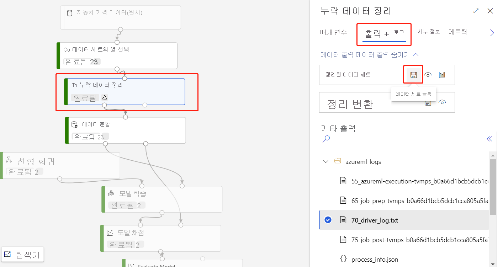
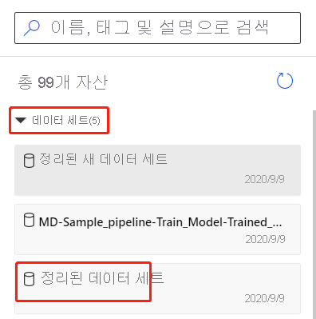

# Azure Machine Learning designer로 데이터 가져오기 (미리 보기)

이 문서에서는 사용자 고유의 데이터를 디자이너에 가져와서 사용자 지정 솔루션을 만드는 방법을 알아봅니다. 데이터를 디자이너로 가져오는 두 가지 방법은 다음과 같습니다. 

* **Azure Machine Learning 데이터 세트** - Azure Machine Learning에 [데이터 세트](concept-data.md#datasets)를 등록하여 데이터를 관리하는 데 도움이 되는 고급 기능을 사용합니다.
* **데이터 가져오기 모듈** - [데이터 가져오기](algorithm-module-reference/import-data.md) 모듈을 사용하여 온라인 데이터 원본에서 데이터에 직접 액세스합니다.

## Azure Machine Learning 데이터 세트 사용

[데이터 세트](concept-data.md#datasets)를 사용하여 디자이너로 데이터를 가져오는 것이 좋습니다. 데이터 세트를 등록할 때 [버전 관리 및 추적](how-to-version-track-datasets.md)과 [데이터 모니터링](how-to-monitor-datasets.md) 같은 고급 데이터 기능을 최대한 활용할 수 있습니다.

### 데이터 세트 등록

[SDK를 사용하여 프로그래밍 방식으로](how-to-create-register-datasets.md#use-the-sdk) 또는 [Azure Machine Learning 스튜디오에서 시각적으로](how-to-create-register-datasets.md#use-the-ui) 기존 데이터 세트를 등록할 수 있습니다.

모든 디자이너 모듈의 출력을 데이터 세트로 등록할 수도 있습니다.

1. 등록하려는 데이터를 출력하는 모듈을 선택합니다.

1. 속성 창에서 **출력** > **데이터 세트 등록**을 차례로 선택합니다.

    

### 데이터 세트 사용

등록된 데이터 세트는 **데이터 세트** > **내 데이터 세트**에 있는 모듈 색상표에서 찾을 수 있습니다. 데이터 세트를 사용하려면 파이프라인 캔버스로 끌어서 놓습니다. 그런 다음, 데이터 세트의 출력 포트를 색상표의 다른 모듈에 연결합니다.

> [!NOTE]
> 현재 디자이너는 [테이블 형식 데이터 세트](how-to-create-register-datasets.md#dataset-types) 처리만 지원합니다. [파일 데이터 세트](how-to-create-register-datasets.md#dataset-types)를 사용하려면 Python 및 R에 사용할 수 있는 Azure Machine Learning SDK를 사용합니다.

## 데이터 가져오기 모듈을 사용하여 데이터 가져오기

데이터 세트를 사용하여 데이터를 가져오는 것이 좋지만 [데이터 가져오기](algorithm-module-reference/import-data.md) 모듈을 사용할 수도 있습니다. 데이터 가져오기 모듈은 Azure Machine Learning에 데이터 세트를 등록하는 과정을 건너뛰고 [데이터 저장소](concept-data.md#datastores) 또는 HTTP URL에서 직접 데이터를 가져옵니다.

데이터 가져오기 모듈을 사용하는 방법에 대한 자세한 내용은 [데이터 가져오기 참조 페이지](algorithm-module-reference/import-data.md)를 확인하세요.

> [!NOTE]
> 데이터 세트에 너무 많은 열이 있는 경우 다음과 같은 오류가 발생할 수 있습니다. "크기 제한으로 인해 유효성 검사에 실패했습니다." 이 문제를 방지하려면 [데이터 세트 인터페이스에 데이터 세트를 등록](how-to-create-register-datasets.md#use-the-ui)합니다.

## 지원되는 원본

이 섹션에서는 디자이너가 지원하는 데이터 원본을 나열합니다. 데이터 저장소 또는 [테이블 형식 데이터 세트](how-to-create-register-datasets.md#dataset-types)의 데이터를 디자이너로 가져올 수 있습니다.

### 데이터 저장소 원본
지원되는 데이터 저장소 원본 목록은 [Azure Storage 서비스에서 데이터 액세스](how-to-access-data.md#supported-data-storage-service-types)를 참조하세요.

### 테이블 형식 데이터 세트 원본

디자이너는 다음 원본으로 생성된 테이블 형식 데이터 세트를 지원합니다.
 * 구분 기호로 분리된 파일
 * JSON 파일
 * Parquet 파일
 * SQL 쿼리

## 데이터 형식

디자이너는 내부적으로 다음 데이터 형식을 인식합니다.

* String
* 정수
* Decimal
* 부울
* Date

이 디자이너에서는 내부 데이터 형식을 사용하여 모듈 간에 데이터를 전달합니다. [데이터 세트로 변환](algorithm-module-reference/convert-to-dataset.md) 모듈을 사용하여 명시적으로 데이터를 데이터 테이블 형식으로 변환할 수 있습니다. 내부 형식 이외의 형식을 허용하는 모든 모듈에서는 다음 모듈에 데이터를 전달하기 전에 데이터를 자동으로 변환합니다.

## 데이터 제약 조건

디자이너의 모듈은 컴퓨팅 대상의 크기로 제한됩니다. 큰 데이터 세트의 경우 더 큰 Azure Machine Learning 컴퓨팅 리소스를 사용해야 합니다. Azure Machine Learning 컴퓨팅에 대한 자세한 내용은 [Azure Machine Learning의 컴퓨팅 대상이란?](concept-compute-target.md#azure-machine-learning-compute-managed)을 참조하세요.

## 가상 네트워크의 데이터에 액세스

작업 영역이 가상 네트워크에 있는 경우에는 디자이너에서 데이터를 시각화 하기 위해 추가 구성 단계를 수행 해야 합니다. 가상 네트워크에서 데이터 저장소 및 데이터 집합을 사용 하는 방법에 대 한 자세한 내용은 [개인 가상 네트워크를 사용 하 여 &를 학습 하는 동안 네트워크 격리](how-to-enable-virtual-network.md#machine-learning-studio)를 참조 하세요.

## 다음 단계

[자습서: 디자이너를 사용하여 자동차 가격 예측](tutorial-designer-automobile-price-train-score.md)을 통해 디자이너의 기본 사항을 알아봅니다.
