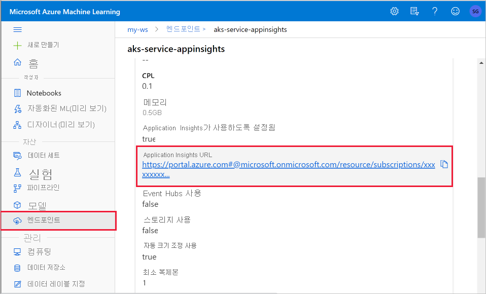

# <a name="monitor-and-collect-data-from-ml-web-service-endpoints"></a>ML 웹 서비스 엔드포인트에서 데이터 모니터링 및 수집


이 문서에서는 AKS (Azure Kubernetes Service) 또는 ACI (Azure Container Instances)에서 웹 서비스 끝점에 배포 된 모델에서 데이터를 수집 하는 방법에 대해 알아봅니다. [Azure 애플리케이션 Insights](../azure-monitor/app/app-insights-overview.md) 를 사용 하 여 끝점에서 다음 데이터를 수집 합니다.
* 출력 데이터
* 응답
* 요청 속도, 응답 시간 및 실패율
* 종속성 비율, 응답 시간 및 실패율
* 예외

[앱 기반-bbb노트북](https://github.com/Azure/MachineLearningNotebooks/blob/master/how-to-use-azureml/deployment/enable-app-insights-in-production-service/enable-app-insights-in-production-service.ipynb) 은이 문서의 개념을 보여 줍니다.
 
[!INCLUDE [aml-clone-in-azure-notebook](../../includes/aml-clone-for-examples.md)]
 
## <a name="prerequisites"></a>사전 요구 사항

* Azure 구독- [무료 또는 유료 버전의 Azure Machine Learning](https://aka.ms/AMLFree)을 사용해 보세요.

* Azure Machine Learning 작업 영역, 스크립트가 포함된 로컬 디렉터리 및 Python용 Azure Machine Learning SDK가 설치되어 있어야 합니다. 자세히 알아보려면 [개발 환경을 구성 하는 방법](how-to-configure-environment.md)을 참조 하세요.

* 학습된 Machine Learning 모델. 자세히 알아보려면 [이미지 분류 모델 학습](tutorial-train-models-with-aml.md) 자습서를 참조 하세요.

<a name="python"></a>

## <a name="configure-logging-with-the-python-sdk"></a>Python SDK를 사용 하 여 로깅 구성

이 섹션에서는 Python SDK를 사용 하 여 응용 프로그램 정보 로깅을 사용 하도록 설정 하는 방법에 대해 알아봅니다. 

### <a name="update-a-deployed-service"></a>배포된 서비스 업데이트

다음 단계를 사용 하 여 기존 웹 서비스를 업데이트 합니다.

1. 작업 영역에서 서비스를 식별합니다. 값은 `ws` 작업 영역의 이름입니다.

    ```python
    from azureml.core.webservice import Webservice
    aks_service= Webservice(ws, "my-service-name")
    ```
2. 서비스 업데이트 및 Azure 애플리케이션 Insights 사용

    ```python
    aks_service.update(enable_app_insights=True)
    ```

### <a name="log-custom-traces-in-your-service"></a>서비스에서 사용자 지정 추적 로그

> [!IMPORTANT]
> Azure 애플리케이션 Insights는 최대 64kb의 페이로드를 기록 합니다. 이 제한에 도달 하면 메모리 부족 등의 오류가 표시 되거나 정보가 기록 되지 않을 수 있습니다. 로그 하려는 데이터가 64kb 보다 큰 경우 [프로덕션 환경에서 모델에 대 한 데이터 수집](how-to-enable-data-collection.md)의 정보를 사용 하 여 blob 저장소에 저장 해야 합니다.
>
> AKS 배포 내에서의 모델 추적과 같은 보다 복잡 한 상황을 위해 [OpenCensus](https://opencensus.io)와 같은 타사 라이브러리를 사용 하는 것이 좋습니다.

사용자 지정 추적을 기록 하려면 [배포 방법 및 where](how-to-deploy-and-where.md) 문서에서 AKS 또는 ACI의 표준 배포 프로세스를 따르세요. 그런 다음, 다음 단계를 사용 합니다.

1. 유추 하는 동안 Application Insights으로 데이터를 보내기 위해 print 문을 추가 하 여 점수 매기기 파일을 업데이트 합니다. 요청 데이터 및 응답과 같은 보다 복잡 한 정보를 보려면 JSON 구조를 사용 합니다. 

    다음 예에서는 `score.py` 모델을 초기화할 때 파일을 기록 하 고, 유추 중에 입력 및 출력을 기록 하 고, 오류가 발생 하는 시간을 기록 합니다.

    
    ```python
    import pickle
    import json
    import numpy 
    from sklearn.externals import joblib
    from sklearn.linear_model import Ridge
    from azureml.core.model import Model
    import time

    def init():
        global model
        #Print statement for appinsights custom traces:
        print ("model initialized" + time.strftime("%H:%M:%S"))
        
        # note here "sklearn_regression_model.pkl" is the name of the model registered under the workspace
        # this call should return the path to the model.pkl file on the local disk.
        model_path = Model.get_model_path(model_name = 'sklearn_regression_model.pkl')
        
        # deserialize the model file back into a sklearn model
        model = joblib.load(model_path)
    

    # note you can pass in multiple rows for scoring
    def run(raw_data):
        try:
            data = json.loads(raw_data)['data']
            data = numpy.array(data)
            result = model.predict(data)
            # Log the input and output data to appinsights:
            info = {
                "input": raw_data,
                "output": result.tolist()
                }
            print(json.dumps(info))
            # you can return any datatype as long as it is JSON-serializable
            return result.tolist()
        except Exception as e:
            error = str(e)
            print (error + time.strftime("%H:%M:%S"))
            return error
    ```

2. 서비스 구성을 업데이트 하 고 Application Insights를 사용 하도록 설정 해야 합니다.
    
    ```python
    config = Webservice.deploy_configuration(enable_app_insights=True)
    ```

3. 이미지를 빌드하고 AKS 또는 ACI에 배포합니다. 자세한 내용은 [배포 방법 및 위치](how-to-deploy-and-where.md)를 참조 하세요.


### <a name="disable-tracking-in-python"></a>Python에서 추적을 사용하지 않도록 설정

Azure 애플리케이션 Insights를 사용 하지 않도록 설정 하려면 다음 코드를 사용 합니다.

```python 
## replace <service_name> with the name of the web service
<service_name>.update(enable_app_insights=False)
```

<a name="studio"></a>

## <a name="configure-logging-with-azure-machine-learning-studio"></a>Azure Machine Learning studio를 사용 하 여 로깅 구성

Azure Machine Learning studio에서 Azure 애플리케이션 Insights를 사용 하도록 설정할 수도 있습니다. 모델을 웹 서비스로 배포할 준비가 되 면 다음 단계를 사용 하 여 Application Insights를 사용 하도록 설정 합니다.

1. 에서 studio에 로그인 https://ml.azure.com 합니다.
1. **모델** 로 이동 하 여 배포 하려는 모델을 선택 합니다.
1. **+ 배포**를 선택 합니다.
1. **모델 배포** 폼을 채웁니다.
1. **고급** 메뉴를 확장 합니다.

    
1. **Application Insights 진단 및 데이터 수집 사용을**선택 합니다.

    

## <a name="view-metrics-and-logs"></a>메트릭 및 로그 보기

### <a name="query-logs-for-deployed-models"></a>배포 된 모델에 대 한 로그 쿼리

함수를 사용 하 여 `get_logs()` 이전에 배포 된 웹 서비스에서 로그를 검색할 수 있습니다. 로그에는 배포 중에 발생한 오류에 대한 자세한 정보가 포함되어 있을 수 있습니다.

```python
from azureml.core.webservice import Webservice

# load existing web service
service = Webservice(name="service-name", workspace=ws)
logs = service.get_logs()
```

### <a name="view-logs-in-the-studio"></a>스튜디오에서 로그 보기

Azure 애플리케이션 Insights는 서비스 로그를 Azure Machine Learning 작업 영역과 동일한 리소스 그룹에 저장 합니다. Studio를 사용 하 여 데이터를 보려면 다음 단계를 수행 합니다.

1. [스튜디오](https://ml.azure.com/)에서 Azure Machine Learning 작업 영역으로 이동 합니다.
1. **엔드포인트**를 선택합니다.
1. 배포 된 서비스를 선택 합니다.
1. **Application Insights url** 링크를 선택 합니다.

    [](././media/how-to-enable-app-insights/appinsightsloc.png#lightbox)

1. Application Insights의 **개요** 탭 또는 __모니터링__ 섹션에서 __로그__를 선택 합니다.

    [](./media/how-to-enable-app-insights/overview.png#lightbox)

1. Score.py 파일에서 기록 된 정보를 보려면 __추적__ 테이블을 확인 합니다. 다음 쿼리는 __입력__ 값이 기록 된 로그를 검색 합니다.

    ```kusto
    traces
    | where customDimensions contains "input"
    | limit 10
    ```

   [](././media/how-to-enable-app-insights/model-data-trace.png#lightbox)

Azure 애플리케이션 Insights를 사용 하는 방법에 대 한 자세한 내용은 [Application Insights 무엇입니까?](../azure-monitor/app/app-insights-overview.md)를 참조 하세요.

## <a name="web-service-metadata-and-response-data"></a>웹 서비스 메타 데이터 및 응답 데이터

> [!IMPORTANT]
> Azure 애플리케이션 Insights는 최대 64kb의 페이로드를 기록 합니다. 이 제한에 도달 하면 메모리 부족 등의 오류가 표시 되거나 정보가 기록 되지 않을 수 있습니다.

웹 서비스 요청 정보를 기록 하려면 `print` score.py 파일에 문을 추가 합니다. 각 `print` 문은 Application Insights 추적 테이블의 메시지 아래에 한 항목을 반환 `STDOUT` 합니다. Application Insights는 `print`  `customDimensions` 추적 테이블에 및에 문 출력을 저장 합니다 `Contents` . JSON 문자열 인쇄는의 추적 출력에서 계층적 데이터 구조를 생성 `Contents` 합니다.

## <a name="export-data-for-retention-and-processing"></a>보존 및 처리를 위해 데이터 내보내기

>[!Important]
> Azure 애플리케이션 Insights는 blob 저장소에 대 한 내보내기만 지원 합니다. 이 구현의 제한 사항에 대 한 자세한 내용은 [Application Insights에서 원격 분석 내보내기](https://docs.microsoft.com/azure/azure-monitor/app/export-telemetry#continuous-export-advanced-storage-configuration)를 참조 하세요.

Application Insights ' [연속 내보내기](https://docs.microsoft.com/azure/azure-monitor/app/export-telemetry) 를 사용 하 여 보존 설정을 정의할 수 있는 blob storage 계정으로 데이터를 내보낼 수 있습니다. Application Insights JSON 형식으로 데이터를 내보냅니다. 

:::image type="content" source="media/how-to-enable-app-insights/continuous-export-setup.png" alt-text="연속 내보내기":::

## <a name="next-steps"></a>다음 단계

이 문서에서는 웹 서비스 끝점에 대 한 로깅 및 보기 로그를 사용 하도록 설정 하는 방법을 알아보았습니다. 다음 단계에 대 한 다음 문서를 사용해 보세요.


* [AKS 클러스터에 모델을 배포 하는 방법](https://docs.microsoft.com/azure/machine-learning/how-to-deploy-azure-kubernetes-service)

* [모델을 Azure Container Instances에 배포 하는 방법](https://docs.microsoft.com/azure/machine-learning/how-to-deploy-azure-container-instance)

* Mlops: 프로덕션 환경에서 모델에서 수집한 데이터를 활용 하는 방법에 대 한 자세한 내용을 보려면 [Azure Machine Learning를 사용 하 여 모델을 관리, 배포 및 모니터링](https://docs.microsoft.com/azure/machine-learning/concept-model-management-and-deployment) 하세요. 이러한 데이터는 기계 학습 프로세스를 지속적으로 개선 하는 데 도움이 될 수 있습니다.
