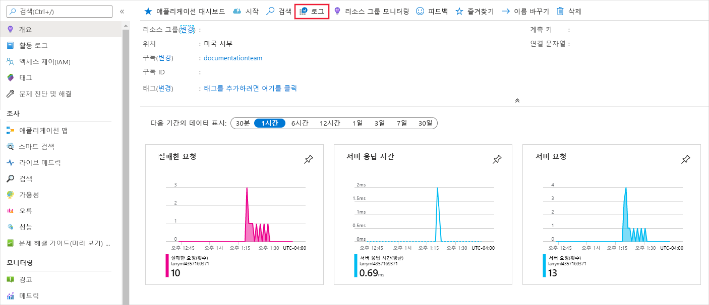
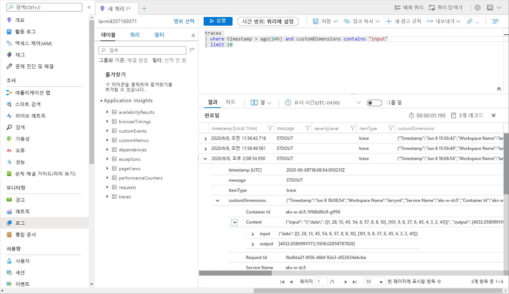

# <a name="monitor-and-collect-data-from-ml-web-service-endpoints"></a>ML 웹 서비스 끝점에서 데이터 모니터링 및 수집
[!INCLUDE [applies-to-skus](../../includes/aml-applies-to-basic-enterprise-sku.md)]

이 문서에서는 Azure 애플리케이션 Insights를 사용 하 여 Azure Kubernetes Service Azure Container Instances (ACI)에서 웹 서비스 끝점에 배포 된 모델에서 데이터를 수집 하 고 모니터링 하는 방법에 대해 알아봅니다. 끝점의 입력 데이터 및 응답을 수집 하는 것 외에도 다음을 모니터링할 수 있습니다.

* 요청 속도, 응답 시간 및 실패율
* 종속성 비율, 응답 시간 및 실패율
* 예외

[Azure 애플리케이션 Insights에 대해 자세히 알아보세요](../azure-monitor/app/app-insights-overview.md). 


## <a name="prerequisites"></a>사전 요구 사항

* Azure 구독이 없는 경우 시작하기 전에 체험 계정을 만듭니다. 지금 [Azure Machine Learning 평가판 또는 유료 버전](https://aka.ms/AMLFree)을 사용해 보세요.

* Azure Machine Learning 작업 영역, 스크립트가 포함된 로컬 디렉터리 및 Python용 Azure Machine Learning SDK가 설치되어 있어야 합니다. 이러한 필수 구성 요소를 가져오는 방법을 알아보려면 [개발 환경을 구성](how-to-configure-environment.md) 하는 방법을 참조 하세요.
* AKS(Azure Kubernetes Service) 또는 ACI(Azure Container Instances)에 배포할 학습된 Machine Learning 모델. 없는 경우 [학습 이미지 분류 모델](tutorial-train-models-with-aml.md) 자습서를 참조 하세요.

## <a name="web-service-metadata-and-response-data"></a>웹 서비스 메타 데이터 및 응답 데이터

>[!Important]
> Azure 애플리케이션 Insights는 최대 64kb의 페이로드를 기록 합니다. 이 제한에 도달 하면 모델의 가장 최근 출력만 기록 됩니다. 

웹 서비스 메타 데이터 및 모델의 예측에 해당 하는 서비스에 대 한 메타 데이터 및 응답은 메시지 `"model_data_collection"`의 Azure 애플리케이션 Insights 추적에 기록 됩니다. 이 데이터에 액세스 하거나 더 긴 보존 또는 추가 처리를 위해 저장소 계정에 대 한 [연속 내보내기를](https://docs.microsoft.com/azure/azure-monitor/app/export-telemetry) 설정 하기 위해 Azure 애플리케이션 Insights를 직접 쿼리할 수 있습니다. 모델 데이터는 Azure Machine Learning에서 레이블 지정, 재 학습, explainability, 데이터 분석 또는 기타 사용을 설정 하는 데 사용할 수 있습니다. 

## <a name="use-the-azure-portal-to-configure"></a>Azure Portal를 사용 하 여 구성

Azure Portal에서 Azure 애플리케이션 Insights를 사용 하거나 사용 하지 않도록 설정할 수 있습니다. 

1. [Azure Portal](https://portal.azure.com)에서 작업 영역을 엽니다.

1. **배포** 탭에서 Azure 애플리케이션 Insights를 사용 하도록 설정 하려는 서비스를 선택 합니다.

   [](././media/how-to-enable-app-insights/Deployments.PNG#lightbox)

3. **편집** 선택

   [](./././media/how-to-enable-app-insights/Edit.PNG#lightbox)

4. **고급 설정**에서 **Appinsights 진단 사용** 확인란을 선택 합니다.

   [](././media/how-to-enable-app-insights/AdvancedSettings.png#lightbox)

1. 화면 맨 아래에 있는 **업데이트** 를 선택 하 여 변경 내용을 적용 합니다.

### <a name="disable"></a>사용 안 함

1. [Azure Portal](https://portal.azure.com)에서 작업 영역을 엽니다.
1. **배포**를 선택 하 고 서비스를 선택한 다음 **편집** 을 선택 합니다.

   [](./././media/how-to-enable-app-insights/Edit.PNG#lightbox)

1. **고급 설정**에서 **Appinsights 진단 사용** 확인란의 선택을 취소 합니다.

   [](././media/how-to-enable-app-insights/uncheck.png#lightbox)

1. 화면 맨 아래에 있는 **업데이트** 를 선택 하 여 변경 내용을 적용 합니다.
 
## <a name="use-python-sdk-to-configure"></a>Python SDK를 사용 하 여 구성 

### <a name="update-a-deployed-service"></a>배포된 서비스 업데이트

1. 작업 영역에서 서비스를 식별합니다. `ws`의 값은 작업 영역의 이름입니다.

    ```python
    from azureml.core.webservice import Webservice
    aks_service= Webservice(ws, "my-service-name")
    ```
2. 서비스 업데이트 및 Azure 애플리케이션 Insights 사용

    ```python
    aks_service.update(enable_app_insights=True)
    ```

### <a name="log-custom-traces-in-your-service"></a>서비스에서 사용자 지정 추적 로그

사용자 지정 추적을 기록하려는 경우 [배포 방법 및 위치](how-to-deploy-and-where.md) 문서에서 AKS 또는 ACI에 대한 표준 배포 프로세스를 수행합니다. 그런 후 다음 단계를 사용하세요.

1. Print 문을 추가 하 여 점수 매기기 파일 업데이트
    
    ```python
    print ("model initialized" + time.strftime("%H:%M:%S"))
    ```

2. 서비스 구성 업데이트
    
    ```python
    config = Webservice.deploy_configuration(enable_app_insights=True)
    ```

3. 이미지를 빌드하고 [AKS 또는 ACI](how-to-deploy-and-where.md)에 배포 합니다.

### <a name="disable-tracking-in-python"></a>Python에서 추적을 사용하지 않도록 설정

Azure 애플리케이션 Insights를 사용 하지 않도록 설정 하려면 다음 코드를 사용 합니다.

```python 
## replace <service_name> with the name of the web service
<service_name>.update(enable_app_insights=False)
```

## <a name="evaluate-data"></a>데이터 평가
서비스의 데이터는 Azure Machine Learning와 동일한 리소스 그룹 내에 Azure 애플리케이션 Insights 계정에 저장 됩니다.
이 데이터를 보려면:

1. [Azure Machine Learning studio](https://ml.azure.com) 에서 Azure Machine Learning 작업 영역으로 이동 하 여 Application Insights 링크를 클릭 합니다.

    [](././media/how-to-enable-app-insights/AppInsightsLoc.png#lightbox)

1. **개요** 탭을 선택 하 여 서비스에 대 한 기본 메트릭 집합을 표시 합니다.

   [](././media/how-to-enable-app-insights/overview.png#lightbox)

1. 웹 서비스 요청 메타 데이터 및 응답을 확인 하려면 **로그 (분석)** 섹션에서 **요청** 테이블을 선택 하 고 **실행** 을 선택 하 여 요청을 확인 합니다.

   [](././media/how-to-enable-app-insights/model-data-trace.png#lightbox)


3. 사용자 지정 추적을 확인 하려면 **분석** 을 선택 합니다.
4. 스키마 섹션에서 **추적**을 선택합니다. 그런 후 **실행**을 선택하여 쿼리를 실행합니다. 데이터는 테이블 형식으로 표시 되 고 점수 매기기 파일의 사용자 지정 호출에 매핑되어야 합니다.

   [](././media/how-to-enable-app-insights/logs.png#lightbox)

Azure 애플리케이션 Insights를 사용 하는 방법에 대 한 자세한 내용은 [Application Insights 무엇입니까?](../azure-monitor/app/app-insights-overview.md)를 참조 하세요.

## <a name="export-data-for-further-processing-and-longer-retention"></a>추가 처리 및 더 긴 보존을 위해 데이터 내보내기

>[!Important]
> Azure 애플리케이션 Insights는 blob 저장소에 대 한 내보내기만 지원 합니다. 이 내보내기 기능의 추가 제한은 [App Insights에서 원격 분석 내보내기](https://docs.microsoft.com/azure/azure-monitor/app/export-telemetry#continuous-export-advanced-storage-configuration)에 나열 되어 있습니다.

Azure 애플리케이션 Insights의 [연속 내보내기를](https://docs.microsoft.com/azure/azure-monitor/app/export-telemetry) 사용 하 여 지원 되는 저장소 계정으로 메시지를 보낼 수 있으며,이 경우 더 긴 보존을 설정할 수 있습니다. `"model_data_collection"` 메시지는 JSON 형식으로 저장 되며 모델 데이터를 추출 하기 위해 쉽게 구문 분석할 수 있습니다. 

Azure Data Factory, Azure ML 파이프라인 또는 다른 데이터 처리 도구를 사용 하 여 필요에 따라 데이터를 변환할 수 있습니다. 데이터를 변환한 후에는 데이터 집합으로 Azure Machine Learning 작업 영역에 데이터를 등록할 수 있습니다. 이렇게 하려면 [데이터 집합을 만들고 등록 하는 방법](how-to-create-register-datasets.md)을 참조 하세요.

   [](././media/how-to-enable-app-insights/continuous-export-setup.png)


## <a name="example-notebook"></a>예제 Notebook

[앱 기반-bbb노트북](https://github.com/Azure/MachineLearningNotebooks/blob/master/how-to-use-azureml/deployment/enable-app-insights-in-production-service/enable-app-insights-in-production-service.ipynb) 은이 문서의 개념을 보여 줍니다. 
 
[!INCLUDE [aml-clone-in-azure-notebook](../../includes/aml-clone-for-examples.md)]

## <a name="next-steps"></a>다음 단계

* [Azure Kubernetes Service 클러스터에 모델](https://docs.microsoft.com/azure/machine-learning/how-to-deploy-azure-kubernetes-service) 을 배포 하는 방법 또는 [Azure Container Instances에 모델](https://docs.microsoft.com/azure/machine-learning/how-to-deploy-azure-container-instance) 을 배포 하 여 웹 서비스 끝점에 모델을 배포 하는 방법 및 Azure 애플리케이션 Insights를 사용 하 여 데이터 수집 및 끝점 모니터링 활용
* 프로덕션 환경에서 수집한 데이터를 활용 하는 방법에 대 한 자세한 내용은 [Mlops: Azure Machine Learning를 사용 하 여 모델 관리, 배포 및 모니터링](https://docs.microsoft.com/azure/machine-learning/concept-model-management-and-deployment) 을 참조 하세요. 이러한 데이터는 기계 학습 프로세스를 지속적으로 개선 하는 데 도움이 될 수 있습니다.
