# <a name="secure-azure-ml-experimentation-and-inference-jobs-within-an-azure-virtual-network"></a>Azure Virtual Network 내에서 Azure ML 실험 및 유추 작업 보호
[!INCLUDE [applies-to-skus](../../includes/aml-applies-to-basic-enterprise-sku.md)]

이 문서에서는 Azure Virtual Network (vnet) 내에서 Azure Machine Learning의 실험/교육 작업 및 유추/점수 매기기 작업을 보호 하는 방법을 알아봅니다.

**가상 네트워크** 는 보안 경계 역할을 하 여 공용 인터넷에서 Azure 리소스를 격리 합니다. Azure 가상 네트워크를 온-프레미스 네트워크에 연결할 수도 있습니다. 네트워크를 조인 하면 모델을 안전 하 게 학습 하 고 유추를 위해 배포 된 모델에 액세스할 수 있습니다.

Azure Machine Learning는 계산 리소스에 대 한 다른 Azure 서비스에 의존 합니다. 계산 리소스 또는 [계산 대상은](concept-compute-target.md)모델을 학습 하 고 배포 하는 데 사용 됩니다. 대상은 가상 네트워크 내에서 만들 수 있습니다. 예를 들어 Microsoft Data Science Virtual Machine를 사용 하 여 모델을 학습 한 다음 AKS (Azure Kubernetes Service)에 모델을 배포할 수 있습니다. 가상 네트워크에 대 한 자세한 내용은 [Azure Virtual Network 개요](https://docs.microsoft.com/azure/virtual-network/virtual-networks-overview)를 참조 하세요.

또한이 문서에서는 *고급 보안 설정*, 기본 또는 실험적 사용 사례에 필요 하지 않은 정보에 대 한 자세한 정보를 제공 합니다. 이 문서의 특정 섹션에서는 다양 한 시나리오에 대 한 구성 정보를 제공 합니다. 지침을 순서 대로 또는 전체적으로 완료할 필요가 없습니다.

> [!TIP]
> 특별히 호출 하지 않는 한, 가상 네트워크 내에서 저장소 계정 또는 계산 대상과 같은 리소스를 사용 하면 기계 학습 파이프라인과 스크립트 실행과 같은 비 파이프라인 워크플로 모두에서 작동 합니다.

> [!WARNING]
> Microsoft는 가상 네트워크 내의 리소스에 Azure Machine Learning 디자이너 또는 자동화 된 Machine Learning (스튜디오에서)을 사용 하는 것을 지원 하지 않습니다.

## <a name="prerequisites"></a>사전 요구 사항

+ Azure Machine Learning [작업 영역](how-to-manage-workspace.md)입니다.

+ [Azure Virtual Network 서비스](https://docs.microsoft.com/azure/virtual-network/virtual-networks-overview) 와 [IP 네트워킹](https://docs.microsoft.com/azure/virtual-network/virtual-network-ip-addresses-overview-arm)에 대 한 일반적인 작업 정보입니다.

+ 계산 리소스에 사용할 기존 가상 네트워크 및 서브넷

## <a name="use-a-storage-account-for-your-workspace"></a>작업 영역에 대 한 저장소 계정 사용

가상 네트워크의 작업 영역에 대 한 Azure storage 계정을 사용 하려면 다음 단계를 사용 합니다.

1. 가상 네트워크 뒤에 계산 리소스 (예: Machine Learning 계산 인스턴스 또는 클러스터)를 만들거나 작업 영역 (예: HDInsight 클러스터, 가상 머신 또는 Azure Kubernetes Service 클러스터)에 계산 리소스를 연결 합니다. 실험 또는 모델 배포의 경우 계산 리소스를 사용할 수 있습니다.

   자세한 내용은이 문서에서 [a Machine Learning Compute 사용](#amlcompute), [가상 머신 또는 HDInsight 클러스터 사용](#vmorhdi)및 [Azure Kubernetes Service](#aksvnet) 사용 섹션을 참조 하세요.

1. Azure Portal에서 작업 영역에 연결 된 저장소로 이동 합니다.

   [Azure Machine Learning 작업 영역에 연결 된 저장소 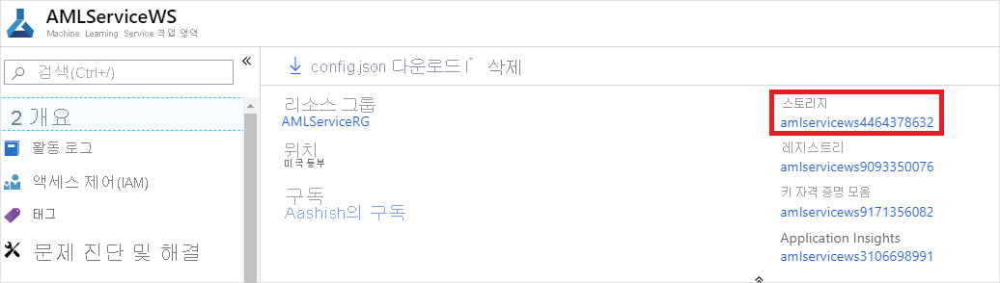](./media/how-to-enable-virtual-network/workspace-storage.png#lightbox)

1. **Azure Storage** 페이지에서 __방화벽 및 가상 네트워크__를 선택 합니다.

   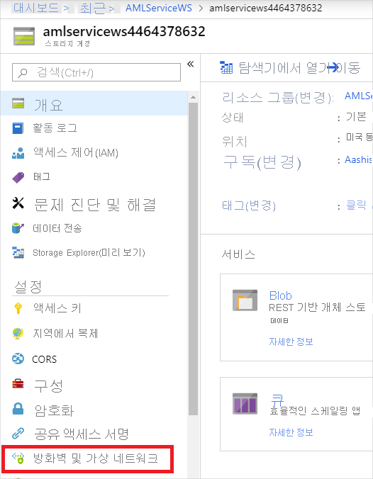

1. __방화벽 및 가상 네트워크__ 페이지에서 다음 작업을 수행 합니다.
    - __선택한 네트워크__를 선택합니다.
    - __가상 네트워크__에서 __기존 가상 네트워크 추가__ 링크를 선택 합니다. 이 작업을 수행 하면 계산이 있는 가상 네트워크가 추가 됩니다 (1 단계 참조).

        > [!IMPORTANT]
        > 저장소 계정은 학습 또는 유추에 사용 되는 계산 인스턴스 또는 클러스터와 동일한 가상 네트워크에 있어야 합니다.

    - __신뢰할 수 있는 Microsoft 서비스에서이 저장소 계정에 액세스 하도록 허용__ 확인란을 선택 합니다.

    > [!IMPORTANT]
    > Azure Machine Learning SDK를 사용 하는 경우 개발 환경에서 Azure Storage 계정에 연결할 수 있어야 합니다. 저장소 계정이 가상 네트워크 내에 있는 경우 방화벽에서 개발 환경의 IP 주소에 대 한 액세스를 허용 해야 합니다.
    >
    > 저장소 계정에 대 한 액세스를 사용 하도록 설정 하려면 *개발 클라이언트의 웹 브라우저에서*저장소 계정에 대 한 __방화벽 및 가상 네트워크__ 를 방문 하세요. 그런 다음 __클라이언트 ip 주소 추가__ 확인란을 사용 하 여 클라이언트의 ip 주소를 __주소 범위__에 추가 합니다. __주소 범위__ 필드를 사용 하 여 개발 환경의 IP 주소를 수동으로 입력할 수도 있습니다. 클라이언트의 IP 주소가 추가 되 면 SDK를 사용 하 여 저장소 계정에 액세스할 수 있습니다.

   [Azure Portal에서 "방화벽 및 가상 네트워크" 창을 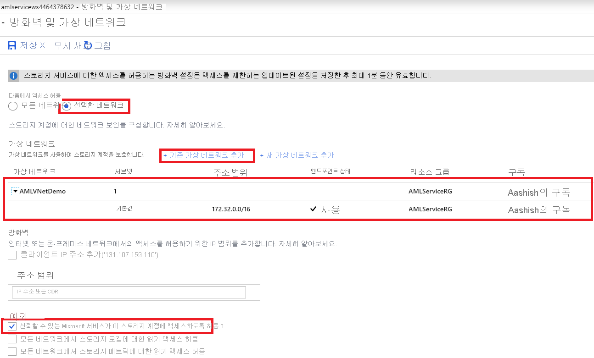](./media/how-to-enable-virtual-network/storage-firewalls-and-virtual-networks-page.png#lightbox)

> [!IMPORTANT]
> Azure Machine Learning에 대 한 _기본 저장소 계정_ 또는 가상 네트워크에 기본이 _아닌 저장소 계정을_ 둘 다 지정할 수 있습니다.
>
> 기본 저장소 계정은 작업 영역을 만들 때 자동으로 프로 비전 됩니다.
>
> 기본이 아닌 저장소 계정의 경우 [`Workspace.create()` 함수의](https://docs.microsoft.com/python/api/azureml-core/azureml.core.workspace(class)?view=azure-ml-py#create-name--auth-none--subscription-id-none--resource-group-none--location-none--create-resource-group-true--sku--basic---friendly-name-none--storage-account-none--key-vault-none--app-insights-none--container-registry-none--cmk-keyvault-none--resource-cmk-uri-none--hbi-workspace-false--default-cpu-compute-target-none--default-gpu-compute-target-none--exist-ok-false--show-output-true-) `storage_account` 매개 변수를 사용 하 여 AZURE 리소스 ID로 사용자 지정 저장소 계정을 지정할 수 있습니다.

## <a name="use-azure-data-lake-storage-gen-2"></a>Azure Data Lake Storage Gen 2 사용

Azure Data Lake Storage Gen 2는 Azure Blob Storage를 기반으로 하는 빅 데이터 분석을 위한 기능 집합입니다. Azure Machine Learning로 모델을 학습 하는 데 사용 되는 데이터를 저장 하는 데 사용할 수 있습니다. 

Azure Machine Learning 작업 영역의 가상 네트워크 내에서 Data Lake Storage Gen 2를 사용 하려면 다음 단계를 사용 합니다.

1. Azure Data Lake Storage gen 2 계정을 만듭니다. 자세한 내용은 [Azure Data Lake Storage Gen2 저장소 계정 만들기](../storage/blobs/data-lake-storage-quickstart-create-account.md)를 참조 하세요.

1. 이전 섹션의 2-4 단계를 사용 하 여 [작업 영역에 대 한 저장소 계정을 사용](#use-a-storage-account-for-your-workspace)하 여 가상 네트워크에 계정을 저장 합니다.

가상 네트워크 내에서 Data Lake Storage Gen 2와 Azure Machine Learning를 사용 하는 경우 다음 지침을 따르십시오.

* SDK를 사용 __하 여 데이터 집합을 만들고__코드를 실행 하는 시스템이 __가상 네트워크에 있지 않은__경우 `validate=False` 매개 변수를 사용 합니다. 이 매개 변수는 시스템이 저장소 계정과 동일한 가상 네트워크에 있지 않은 경우 실패 하는 유효성 검사를 건너뜁니다. 자세한 내용은 [from_files ()](https://docs.microsoft.com/python/api/azureml-core/azureml.data.dataset_factory.filedatasetfactory?view=azure-ml-py#from-files-path--validate-true-) 메서드를 참조 하세요.

* 계산 인스턴스 또는 계산 클러스터 Azure Machine Learning 사용 하 여 데이터 집합을 사용 하 여 모델을 학습 하는 경우 저장소 계정과 동일한 가상 네트워크에 있어야 합니다.

## <a name="use-a-key-vault-instance-with-your-workspace"></a>작업 영역에서 key vault 인스턴스 사용

작업 영역과 연결 된 key vault 인스턴스는 Azure Machine Learning에서 다음 자격 증명을 저장 하는 데 사용 됩니다.
* 연결 된 저장소 계정 연결 문자열
* Azure 컨테이너 리포지토리 인스턴스에 대 한 암호
* 데이터 저장소에 대 한 연결 문자열

가상 네트워크 뒤 Azure Key Vault에서 Azure Machine Learning 실험 기능을 사용 하려면 다음 단계를 사용 합니다.

1. 작업 영역과 연결 된 주요 자격 증명 모음으로 이동 합니다.

   [Azure Machine Learning 작업 영역에 연결 된 키 자격 증명 모음 ](./media/how-to-enable-virtual-network/workspace-key-vault.png#lightbox)

1. **Key Vault** 페이지의 왼쪽 창에서 __방화벽 및 가상 네트워크__를 선택 합니다.

   

1. __방화벽 및 가상 네트워크__ 페이지에서 다음 작업을 수행 합니다.
    - __다음에서 액세스 허용__에서 __선택한 네트워크__를 선택합니다.
    - __가상 네트워크__에서 __기존 가상 네트워크 추가__ 를 선택 하 여 실험 계산이 있는 가상 네트워크를 추가 합니다.
    - __신뢰할 수 있는 Microsoft 서비스에서이 방화벽을 무시 하도록 허용__에서 __예__를 선택 합니다.

   [Key Vault 창에서 "방화벽 및 가상 네트워크" 섹션을 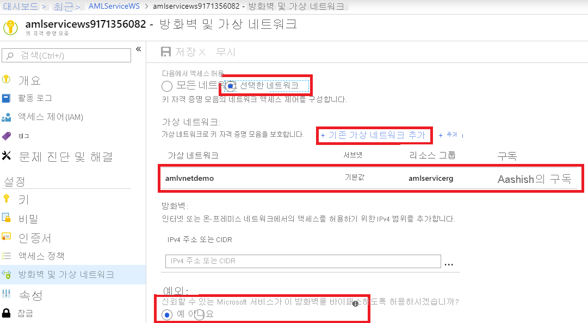](./media/how-to-enable-virtual-network/key-vault-firewalls-and-virtual-networks-page.png#lightbox)

<a id="amlcompute"></a>

## <a name="compute-instance"></a>Machine Learning 컴퓨팅 사용

가상 네트워크에서 Azure Machine Learning 계산 인스턴스 또는 계산 클러스터를 사용 하려면 다음 네트워크 요구 사항을 충족 해야 합니다.

> [!div class="checklist"]
> * 가상 네트워크는 Azure Machine Learning 작업 영역과 동일한 구독 및 지역에 있어야 합니다.
> * 계산 인스턴스 또는 클러스터에 대해 지정 된 서브넷에는 대상으로 지정 된 Vm 수를 수용 하기에 충분 한 할당 되지 않은 IP 주소가 있어야 합니다. 서브넷에 할당 되지 않은 IP 주소가 충분 하지 않으면 계산 클러스터가 부분적으로 할당 됩니다.
> * 가상 네트워크의 구독 또는 리소스 그룹에 대 한 보안 정책 또는 잠금이 가상 네트워크를 관리할 수 있는 권한을 제한 하는지 확인 하십시오. 트래픽을 제한 하 여 가상 네트워크를 보호 하려는 경우 계산 서비스에 대해 일부 포트를 열어 둡니다. 자세한 내용은 [필수 포트](#mlcports) 섹션을 참조하세요.
> * 단일 가상 네트워크에 여러 계산 인스턴스 또는 클러스터를 배치 하려는 경우 하나 이상의 리소스에 대해 할당량 증가를 요청 해야 할 수 있습니다.
> * 작업 영역에 대 한 Azure Storage 계정도 가상 네트워크에서 보호 되는 경우 Azure Machine Learning 계산 인스턴스 또는 클러스터와 동일한 가상 네트워크에 있어야 합니다. 

> [!TIP]
> Machine Learning 계산 인스턴스 또는 클러스터는 가상 네트워크를 포함 하는 리소스 그룹에 추가 네트워킹 리소스를 자동으로 할당 합니다. 각 계산 인스턴스 또는 클러스터에 대해 서비스는 다음 리소스를 할당 합니다.
> 
> * 네트워크 보안 그룹 1개
> * 공용 IP 주소 1개
> * 부하 분산 장치 1개
> 
> 이러한 리소스는 구독의 [리소스 할당량](https://docs.microsoft.com/azure/azure-resource-manager/management/azure-subscription-service-limits)으로 제한됩니다.


### <a id="mlcports"></a> 필수 포트

Machine Learning 컴퓨팅은 현재 Azure Batch 서비스를 사용하여 지정된 가상 네트워크에 VM을 프로비전합니다. 서브넷은 Batch 서비스에서의 인바운드 통신을 허용해야 합니다. 이 통신을 사용 하 여 Machine Learning 컴퓨팅 노드에서 실행을 예약 하 고 Azure Storage 및 기타 리소스와 통신할 수 있습니다. Batch 서비스는 Vm에 연결 된 Nic (네트워크 인터페이스) 수준에서 NSGs (네트워크 보안 그룹)를 추가 합니다. 이러한 NSG는 다음 트래픽을 허용하도록 인바운드 및 아웃바운드 규칙을 자동으로 구성합니다.

- __Batchnodemanagement__의 __서비스 태그__ 에서 포트 29876 및 29877에 대 한 인바운드 TCP 트래픽

    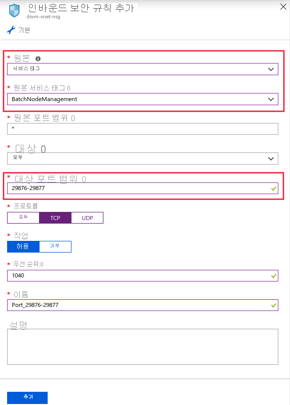

- 필드 포트 22에서 원격 액세스를 허용 하는 인바운드 TCP 트래픽 공용 IP에서 SSH를 사용 하 여 연결 하려는 경우에만이 포트를 사용 합니다.

- 가상 네트워크에 대한 모든 포트의 아웃바운드 트래픽

- 인터넷에 대한 모든 포트의 아웃바운드 트래픽

- __AzureMachineLearning__의 __서비스 태그__ 에서 포트 44224에 대 한 계산 인스턴스 인바운드 TCP 트래픽

Batch 구성 NSG에서 인바운드 또는 아웃바운드 규칙을 수정하거나 추가할 경우 주의가 필요합니다. NSG가 계산 노드에 대 한 통신을 차단 하는 경우 계산 서비스는 계산 노드의 상태를 사용할 수 없음으로 설정 합니다.

Azure Batch 서비스가 자체 NSGs를 구성 하기 때문에 서브넷 수준에서 NSGs를 지정할 필요가 없습니다. 그러나 지정 된 서브넷에 연결 된 NSGs 또는 방화벽이 있는 경우 앞에서 설명한 대로 인바운드 및 아웃 바운드 보안 규칙을 구성 합니다.

Azure Portal의 NSG 규칙 구성은 다음 이미지에 나와 있습니다.

[Machine Learning 컴퓨팅에 대 한 인바운드 NSG 규칙을 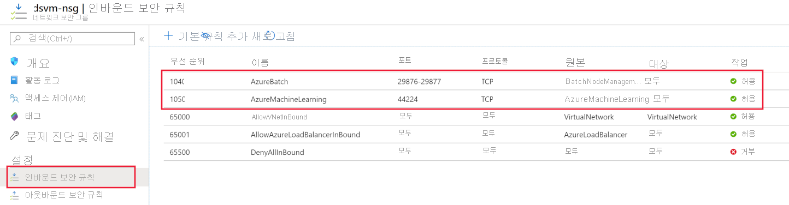](./media/how-to-enable-virtual-network/amlcompute-virtual-network-inbound.png#lightbox)

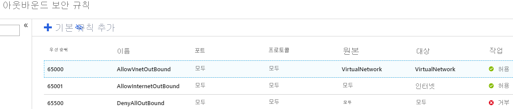

### <a id="limiting-outbound-from-vnet"></a>가상 네트워크에서 아웃 바운드 연결 제한

기본 아웃 바운드 규칙을 사용 하지 않고 가상 네트워크에 대 한 아웃 바운드 액세스를 제한 하려는 경우 다음 단계를 사용 합니다.

- NSG 규칙을 사용 하 여 아웃 바운드 인터넷 연결을 거부 합니다.

- __계산 인스턴스__ 또는 __계산 클러스터__의 경우 다음 항목에 대 한 아웃 바운드 트래픽을 제한 합니다.
   - __저장소.__ 지역 이름의 __서비스 태그__ 를 사용 하 여 Azure Storage 합니다. 여기서 `{RegionName}`은 Azure 지역의 이름입니다.
   - __AzureContainerRegistry 이름__의 __서비스 태그__ 를 사용 하 여 Azure Container Registry 합니다. 여기서 `{RegionName}`은 Azure 지역의 이름입니다.
   - __AzureMachineLearning__ 의 __서비스 태그__ 를 사용 하 여 Azure Machine Learning
   
- __계산 인스턴스의__경우 다음 항목도 추가 합니다.
   - __AzureResourceManager__ 의 __서비스 태그__ 를 사용 하 여 Azure Resource Manager
   - __AzureActiveDirectory__ 의 __서비스 태그__ 를 사용 하 여 Azure Active Directory

Azure Portal의 NSG 규칙 구성은 다음 이미지에 나와 있습니다.

[아웃 바운드 NSG 규칙을 ](./media/how-to-enable-virtual-network/limited-outbound-nsg-exp.png#lightbox)

> [!NOTE]
> Microsoft에서 제공 하는 기본 Docker 이미지를 사용 하 고 사용자 관리 종속성을 사용 하도록 설정 하는 경우 __Region_Name MicrosoftContainerRegistry__ 의 __서비스 태그__ (예: MicrosoftContainerRegistry)도 사용 해야 합니다.
>
> 이 구성은 학습 스크립트의 일부로 다음 코드 조각과 비슷한 코드를 사용할 경우에 필요 합니다.
>
> __.Runconfig 교육__
> ```python
> # create a new runconfig object
> run_config = RunConfiguration()
> 
> # configure Docker 
> run_config.environment.docker.enabled = True
> # For GPU, use DEFAULT_GPU_IMAGE
> run_config.environment.docker.base_image = DEFAULT_CPU_IMAGE 
> run_config.environment.python.user_managed_dependencies = True
> ```
>
> __평가기 교육__
> ```python
> est = Estimator(source_directory='.',
>                 script_params=script_params,
>                 compute_target='local',
>                 entry_script='dummy_train.py',
>                 user_managed=True)
> run = exp.submit(est)
> ```

### <a name="user-defined-routes-for-forced-tunneling"></a>강제 터널링을 위한 사용자 정의 경로

Machine Learning 컴퓨팅를 사용 하 여 강제 터널링을 사용 하는 경우 계산 리소스를 포함 하는 서브넷에 [UDRs (사용자 정의 경로)](https://docs.microsoft.com/azure/virtual-network/virtual-networks-udr-overview) 를 추가 합니다.

* 리소스가 있는 지역의 Azure Batch 서비스에서 사용 하는 각 IP 주소에 대해 UDR을 설정 합니다. 이러한 UDRs를 통해 Batch 서비스는 작업 예약을 위해 계산 노드와 통신할 수 있습니다. Batch 서비스의 IP 주소 목록을 가져오려면 다음 방법 중 하나를 사용 합니다.

    * [AZURE IP 범위 및 서비스 태그](https://www.microsoft.com/download/details.aspx?id=56519) 를 다운로드 하 고 파일에서 `BatchNodeManagement.<region>`를 검색 합니다. 여기서 `<region>`은 azure 지역입니다.

    * [Azure CLI](https://docs.microsoft.com/cli/azure/install-azure-cli?view=azure-cli-latest) 를 사용 하 여 정보를 다운로드 합니다. 다음 예에서는 IP 주소 정보를 다운로드 하 고 미국 동부 2 지역에 대 한 정보를 필터링 합니다.

        ```azurecli-interactive
        az network list-service-tags -l "East US 2" --query "values[?starts_with(id, 'Batch')] | [?properties.region=='eastus2']"
        ```

* Azure Storage에 대 한 아웃 바운드 트래픽은 온-프레미스 네트워크 어플라이언스에서 차단 되지 않아야 합니다. 특히 Url은 `<account>.table.core.windows.net`, `<account>.queue.core.windows.net`및 `<account>.blob.core.windows.net`형식입니다.

UDRs를 추가 하는 경우 관련 된 각 Batch IP 주소 접두사에 대 한 경로를 정의 하 고 __다음 홉 유형__ 을 __인터넷__으로 설정 합니다. 다음 이미지는 Azure Portal의이 UDR의 예를 보여 줍니다.

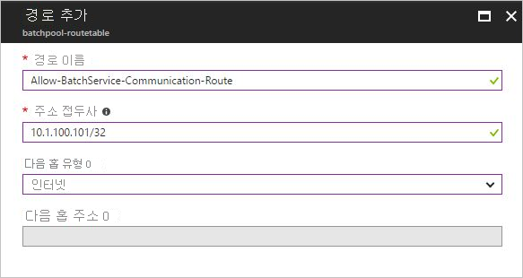

자세한 내용은 [가상 네트워크에서 Azure Batch 풀 만들기](../batch/batch-virtual-network.md#user-defined-routes-for-forced-tunneling)를 참조 하세요.

### <a name="create-a-compute-cluster-in-a-virtual-network"></a>가상 네트워크에서 계산 클러스터 만들기

Machine Learning 컴퓨팅 클러스터를 만들려면 다음 단계를 사용 합니다.

1. [Azure Portal](https://portal.azure.com)에서 Azure Machine Learning 작업 영역을 선택 합니다.

1. __응용 프로그램__ 섹션에서 __compute__를 선택 하 고 __계산 추가__를 선택 합니다.

1. 이 계산 리소스에서 가상 네트워크를 사용 하도록 구성 하려면 다음 작업을 수행 합니다.

    a. __네트워크 구성__의 경우 __고급__을 선택 합니다.

    b. __리소스 그룹__ 드롭다운 목록에서 가상 네트워크가 포함 된 리소스 그룹을 선택 합니다.

    다. __가상 네트워크__ 드롭다운 목록에서 서브넷이 포함 된 가상 네트워크를 선택 합니다.

    d. __서브넷__ 드롭다운 목록에서 사용할 서브넷을 선택 합니다.

   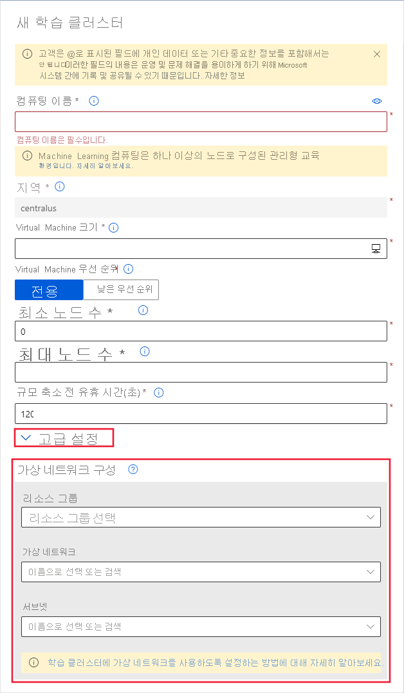

Azure Machine Learning SDK를 사용하여 Machine Learning 컴퓨팅 클러스터를 만들 수도 있습니다. 다음 코드에서는 `default`라는 가상 네트워크의 `mynetwork` 서브넷에 새 Machine Learning 컴퓨팅 클러스터를 만듭니다.

```python
from azureml.core.compute import ComputeTarget, AmlCompute
from azureml.core.compute_target import ComputeTargetException

# The Azure virtual network name, subnet, and resource group
vnet_name = 'mynetwork'
subnet_name = 'default'
vnet_resourcegroup_name = 'mygroup'

# Choose a name for your CPU cluster
cpu_cluster_name = "cpucluster"

# Verify that cluster does not exist already
try:
    cpu_cluster = ComputeTarget(workspace=ws, name=cpu_cluster_name)
    print("Found existing cpucluster")
except ComputeTargetException:
    print("Creating new cpucluster")

    # Specify the configuration for the new cluster
    compute_config = AmlCompute.provisioning_configuration(vm_size="STANDARD_D2_V2",
                                                           min_nodes=0,
                                                           max_nodes=4,
                                                           vnet_resourcegroup_name=vnet_resourcegroup_name,
                                                           vnet_name=vnet_name,
                                                           subnet_name=subnet_name)

    # Create the cluster with the specified name and configuration
    cpu_cluster = ComputeTarget.create(ws, cpu_cluster_name, compute_config)

    # Wait for the cluster to be completed, show the output log
    cpu_cluster.wait_for_completion(show_output=True)
```

만들기 프로세스가 완료 되 면 실험에서 클러스터를 사용 하 여 모델을 학습 합니다. 자세한 내용은 [학습의 컴퓨팅 대상 선택 및 사용](how-to-set-up-training-targets.md)을 참조하세요.

## <a name="use-azure-databricks"></a>Azure Databricks 사용

작업 영역을 사용 하 여 가상 네트워크에서 Azure Databricks를 사용 하려면 다음 요구 사항을 충족 해야 합니다.

> [!div class="checklist"]
> * 가상 네트워크는 Azure Machine Learning 작업 영역과 동일한 구독 및 지역에 있어야 합니다.
> * 작업 영역에 대 한 Azure Storage 계정도 가상 네트워크에서 보호 되는 경우 Azure Databricks 클러스터와 동일한 가상 네트워크에 있어야 합니다.
> * Azure Databricks에서 사용 하는 __databricks__ 및 __databricks-공용__ 서브넷 외에도 가상 네트워크에 대해 만들어진 __기본__ 서브넷이 필요 합니다.

가상 네트워크에서 Azure Databricks를 사용 하는 방법에 대 한 자세한 내용은 [Azure Virtual Network에서 Azure Databricks 배포](https://docs.azuredatabricks.net/administration-guide/cloud-configurations/azure/vnet-inject.html)를 참조 하세요.

<a id="vmorhdi"></a>

## <a name="use-a-virtual-machine-or-hdinsight-cluster"></a>가상 머신 또는 HDInsight 클러스터 사용

> [!IMPORTANT]
> Azure Machine Learning는 Ubuntu를 실행 하는 가상 컴퓨터만 지원 합니다.

작업 영역을 사용 하 여 가상 네트워크에서 가상 컴퓨터 또는 Azure HDInsight 클러스터를 사용 하려면 다음 단계를 사용 합니다.

1. Azure Portal 또는 Azure CLI를 사용 하 여 VM 또는 HDInsight 클러스터를 만들고, 클러스터를 Azure virtual network에 배치 합니다. 자세한 내용은 다음 문서를 참조하세요.
    * [Linux VM용 Azure 가상 네트워크 만들기 및 관리](https://docs.microsoft.com/azure/virtual-machines/linux/tutorial-virtual-network)

    * [Azure 가상 네트워크를 사용하여 HDInsight 확장](https://docs.microsoft.com/azure/hdinsight/hdinsight-extend-hadoop-virtual-network)

1. Azure Machine Learning VM 또는 클러스터의 SSH 포트와 통신할 수 있도록 하려면 네트워크 보안 그룹에 대 한 원본 항목을 구성 합니다. SSH 포트는 일반적으로 포트 22입니다. 이 원본의 트래픽을 허용 하려면 다음 작업을 수행 합니다.

    * __원본__ 드롭다운 목록에서 __서비스 태그__를 선택 합니다.

    * __원본 서비스 태그__ 드롭다운 목록에서 __AzureMachineLearning__를 선택 합니다.

    * __원본 포트 범위__ 드롭다운 목록에서 __*__ 을 선택 합니다.

    * __대상__ 드롭다운 목록에서 __Any__를 선택 합니다.

    * __대상 포트 범위__ 드롭다운 목록에서 __22__를 선택 합니다.

    * __프로토콜__에서 __Any__를 선택 합니다.

    * __작업__아래에서 __허용__을 선택 합니다.

   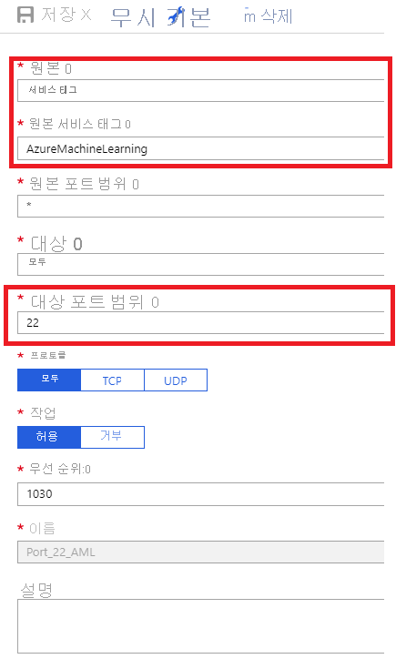

    네트워크 보안 그룹에 대 한 기본 아웃 바운드 규칙을 유지 합니다. 자세한 내용은 [보안 그룹](https://docs.microsoft.com/azure/virtual-network/security-overview#default-security-rules)의 기본 보안 규칙을 참조하세요.

    기본 아웃 바운드 규칙을 사용 하지 않고 가상 네트워크의 아웃 바운드 액세스를 제한 하려는 경우 [가상 네트워크에서 아웃 바운드 연결 제한](#limiting-outbound-from-vnet) 섹션을 참조 하세요.

1. VM 또는 HDInsight 클러스터를 Azure Machine Learning 작업 영역에 연결 합니다. 자세한 내용은 [모델 학습의 컴퓨팅 대상 설정](how-to-set-up-training-targets.md)을 참조하세요.

<a id="aksvnet"></a>

## <a name="use-azure-kubernetes-service-aks"></a>AKS(Azure Kubernetes Service) 사용

가상 네트워크의 AKS를 작업 영역에 추가 하려면 다음 단계를 사용 합니다.

> [!IMPORTANT]
> 다음 절차를 시작 하기 전에 [Azure Kubernetes 서비스에서 고급 네트워킹 구성 (AKS)](https://docs.microsoft.com/azure/aks/configure-advanced-networking#prerequisites) 의 필수 구성 요소에 따라 클러스터에 대 한 IP 주소 지정을 계획 합니다.
>
> AKS 인스턴스와 Azure virtual network는 동일한 지역에 있어야 합니다. 가상 네트워크의 작업 영역에서 사용 하는 Azure Storage 계정의 보안을 유지 하는 경우 AKS 인스턴스와 동일한 가상 네트워크에 있어야 합니다.

1. [Azure Portal](https://portal.azure.com)에서 가상 네트워크를 제어 하는 Nsg에 __AzureMachineLearning__ 를 **원본**으로 사용 하 여 Azure Machine Learning에 대해 사용 하도록 설정 된 인바운드 규칙이 있는지 확인 합니다.

    [계산 창 추가 Azure Machine Learning ](./media/how-to-enable-virtual-network/aks-vnet-inbound-nsg-aml.png#lightbox)

1. Azure Machine Learning 작업 영역을 선택 합니다.

1. __응용 프로그램__ 섹션에서 __compute__를 선택 하 고 __계산 추가__를 선택 합니다.

1. 이 계산 리소스에서 가상 네트워크를 사용 하도록 구성 하려면 다음 작업을 수행 합니다.

    - __네트워크 구성__의 경우 __고급__을 선택 합니다.

    - __리소스 그룹__ 드롭다운 목록에서 가상 네트워크가 포함 된 리소스 그룹을 선택 합니다.

    - __가상 네트워크__ 드롭다운 목록에서 서브넷이 포함 된 가상 네트워크를 선택 합니다.

    - __서브넷__ 드롭다운 목록에서 서브넷을 선택 합니다.

    - __Kubernetes service 주소 범위__ 상자에 Kubernetes 서비스 주소 범위를 입력 합니다. 이 주소 범위는 클래스 없는 CIDR (도메인 간 라우팅) 표기법 IP 범위를 사용 하 여 클러스터에 사용할 수 있는 IP 주소를 정의 합니다. 서브넷 IP 범위 (예: 10.0.0.0/16)와 겹치면 안 됩니다.

    - __KUBERNETES dns 서비스 ip 주소__ 상자에 Kubernetes DNS 서비스 ip 주소를 입력 합니다. 이 IP 주소는 Kubernetes DNS 서비스에 할당됩니다. Kubernetes 서비스 주소 범위 (예: 10.0.0.10) 안에 있어야 합니다.

    - __Docker 브리지 주소__ 상자에 docker 브리지 주소를 입력 합니다. 이 IP 주소는 Docker 브리지에 할당됩니다. 서브넷 IP 범위 또는 Kubernetes 서비스 주소 범위 (예: 172.17.0.1/16)에 있지 않아야 합니다.

   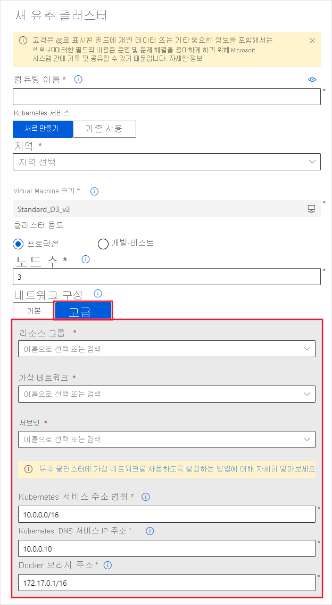

1. 가상 네트워크 외부에서 호출할 수 있도록 가상 네트워크를 제어 하는 NSG 그룹에 점수 매기기 끝점에 대 한 인바운드 보안 규칙이 설정 되어 있는지 확인 합니다.
   > [!IMPORTANT]
   > NSG에 대한 기본 아웃바운드 규칙을 유지합니다. 자세한 내용은 [보안 그룹](https://docs.microsoft.com/azure/virtual-network/security-overview#default-security-rules)의 기본 보안 규칙을 참조하세요.

   [인바운드 보안 규칙 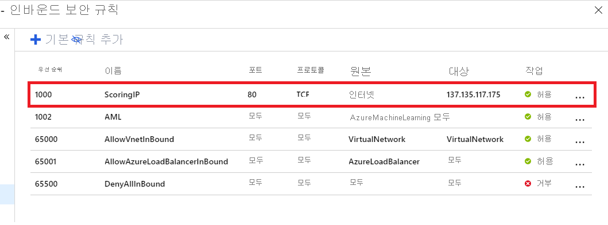](./media/how-to-enable-virtual-network/aks-vnet-inbound-nsg-scoring.png#lightbox)

Azure Machine Learning SDK를 사용 하 여 가상 네트워크에 Azure Kubernetes 서비스를 추가할 수도 있습니다. 가상 네트워크에 AKS 클러스터가 이미 있는 경우 [AKS에 배포 하는 방법](how-to-deploy-and-where.md)에 설명 된 대로 작업 영역에 연결 합니다. 다음 코드는 `mynetwork`이라는 가상 네트워크의 `default` 서브넷에 새 AKS 인스턴스를 만듭니다.

```python
from azureml.core.compute import ComputeTarget, AksCompute

# Create the compute configuration and set virtual network information
config = AksCompute.provisioning_configuration(location="eastus2")
config.vnet_resourcegroup_name = "mygroup"
config.vnet_name = "mynetwork"
config.subnet_name = "default"
config.service_cidr = "10.0.0.0/16"
config.dns_service_ip = "10.0.0.10"
config.docker_bridge_cidr = "172.17.0.1/16"

# Create the compute target
aks_target = ComputeTarget.create(workspace=ws,
                                  name="myaks",
                                  provisioning_configuration=config)
```

만들기 프로세스가 완료 되 면 가상 네트워크 뒤의 AKS 클러스터에서 유추 또는 모델 점수 매기기를 실행할 수 있습니다. 자세한 내용은 [AKS에 배포하는 방법](how-to-deploy-and-where.md)을 참조하세요.

### <a name="use-private-ips-with-azure-kubernetes-service"></a>Azure Kubernetes Service에서 개인 Ip 사용

기본적으로 공용 IP 주소는 AKS 배포에 할당 됩니다. 가상 네트워크 내에서 AKS를 사용 하는 경우 개인 IP 주소를 대신 사용할 수 있습니다. 개인 IP 주소는 가상 네트워크 또는 연결 된 네트워크 내 에서만 액세스할 수 있습니다.

_내부 부하 분산 장치_를 사용 하도록 AKS를 구성 하 여 개인 IP 주소를 사용 하도록 설정 합니다. 

> [!IMPORTANT]
> Azure Kubernetes 서비스 클러스터를 만들 때 개인 IP를 사용 하도록 설정할 수 없습니다. 기존 클러스터에 대 한 업데이트로 사용 하도록 설정 되어야 합니다.

다음 코드 조각에서는 **새 AKS 클러스터를 만든**다음 개인 IP/내부 부하 분산 장치를 사용 하도록 업데이트 하는 방법을 보여 줍니다.

```python
import azureml.core
from azureml.core.compute.aks import AksUpdateConfiguration
from azureml.core.compute import AksCompute, ComputeTarget

# Verify that cluster does not exist already
try:
    aks_target = AksCompute(workspace=ws, name=aks_cluster_name)
    print("Found existing aks cluster")

except:
    print("Creating new aks cluster")

    # Create AKS configuration
    prov_config = AksCompute.provisioning_configuration(location = "eastus2")
    # Set info for existing virtual network to create the cluster in
    prov_config.vnet_resourcegroup_name = "myvnetresourcegroup"
    prov_config.vnet_name = "myvnetname"
    prov_config.service_cidr = "10.0.0.0/16"
    prov_config.dns_service_ip = "10.0.0.10"
    prov_config.subnet_name = "default"
    prov_config.docker_bridge_cidr = "172.17.0.1/16"

    # Create compute target
    aks_target = ComputeTarget.create(workspace = ws, name = “myaks”, provisioning_configuration = prov_config)
    # Wait for the operation to complete
    aks_target.wait_for_completion(show_output = True)
    
    # Update AKS configuration to use an internal load balancer
    update_config = AksUpdateConfiguration(None, "InternalLoadBalancer", "default")
    aks_target.update(update_config)
    # Wait for the operation to complete
    aks_target.wait_for_completion(show_output = True)
```

__Azure CLI__

```azurecli-interactive
az rest --method put --uri https://management.azure.com"/subscriptions/<subscription-id>/resourcegroups/<resource-group>/providers/Microsoft.ContainerService/managedClusters/<aks-resource-id>?api-version=2018-11-19 --body @body.json
```

명령에서 참조 하는 `body.json` 파일의 내용은 다음 JSON 문서와 유사 합니다.

```json
{ 
    "location": “<region>”, 
    "properties": { 
        "resourceId": "/subscriptions/<subscription-id>/resourcegroups/<resource-group>/providers/Microsoft.ContainerService/managedClusters/<aks-resource-id>", 
        "computeType": "AKS", 
        "provisioningState": "Succeeded", 
        "properties": { 
            "loadBalancerType": "InternalLoadBalancer", 
            "agentCount": <agent-count>, 
            "agentVmSize": "vm-size", 
            "clusterFqdn": "<cluster-fqdn>" 
        } 
    } 
} 
```

> [!NOTE]
> 현재는 기존 클러스터에서 __연결__ 작업을 수행할 때 부하 분산 장치를 구성할 수 없습니다. 먼저 클러스터를 연결 하 고 업데이트 작업을 수행 하 여 부하 분산 장치를 변경 해야 합니다.

AKS에서 내부 부하 분산 장치를 사용 하는 방법에 대 한 자세한 내용은 [Azure Kubernetes Service에서 내부 부하 분산 장치 사용](/azure/aks/internal-lb)을 참조 하세요.

## <a name="use-azure-firewall"></a>Azure 방화벽 사용

Azure 방화벽을 사용 하는 경우 다음 주소와의 트래픽을 허용 하도록 네트워크 규칙을 구성 해야 합니다.

- `*.batchai.core.windows.net`
- `ml.azure.com`
- `*.azureml.ms`
- `*.experiments.azureml.net`
- `*.modelmanagement.azureml.net`
- `mlworkspace.azure.ai`
- `*.aether.ms`

규칙을 추가 하는 경우 __프로토콜__ 을 any로 설정 하 고 포트를 `*`설정 합니다.

네트워크 규칙을 구성 하는 방법에 대 한 자세한 내용은 [Azure 방화벽 배포 및 구성](/azure/firewall/tutorial-firewall-deploy-portal#configure-a-network-rule)을 참조 하세요.

## <a name="use-azure-container-registry"></a>Azure Container Registry 사용

Azure Machine Learning에서 가상 네트워크를 사용 하는 경우 가상 네트워크에 작업 영역에 대 한 Azure Container Registry를 두지 __마십시오__ . 이 구성은 지원되지 않습니다.

## <a name="next-steps"></a>다음 단계

* [학습 환경 설정](how-to-set-up-training-targets.md)
* [모델 배포 위치](how-to-deploy-and-where.md)
* [SSL을 사용하여 안전하게 모델 배포](how-to-secure-web-service.md)
