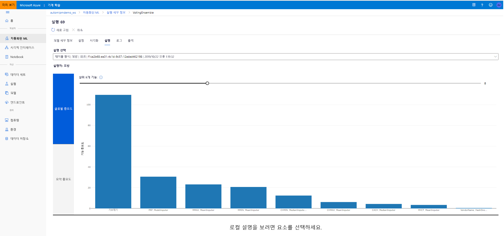

# <a name="interpretability-model-explanations-in-automated-machine-learning-preview"></a>Interpretability: 자동화 된 machine learning (미리 보기)의 모델 설명


이 문서에서는 Azure Machine Learning의 ML (자동화 된 기계 학습)에 대 한 설명을 가져오는 방법에 대해 알아봅니다. 자동화 된 ML은 엔지니어링 된 기능 중요도를 이해 하는 데 도움이 됩니다. 

1.0.85 이후의 모든 SDK 버전 `model_explainability=True` 은 기본적으로 설정 되어 있습니다. SDK 버전 1.0.85 및 이전 버전에서는 사용자가 `model_explainability=True` `AutoMLConfig` 모델 interpretability을 사용 하기 위해 개체에서를 설정 해야 합니다. 

이 문서에서는 다음 방법을 설명합니다.

- 모범 모델 또는 모델에 대 한 학습 중에 interpretability을 수행 합니다.
- 시각화를 사용 하 여 데이터 및 설명의 패턴을 쉽게 확인할 수 있습니다.
- 유추 또는 점수 매기기 중 interpretability을 구현 합니다.

## <a name="prerequisites"></a>필수 구성 요소

- Interpretability 기능. `pip install azureml-interpret`을 실행 하 여 필요한 패키지를 가져옵니다.
- 자동화 된 ML 실험 빌드에 대 한 지식. Azure Machine Learning SDK를 사용 하는 방법에 대 한 자세한 내용은이 [회귀 모델 자습서](tutorial-auto-train-models.md) 를 완료 하거나 [자동화 된 ML 실험을 구성](how-to-configure-auto-train.md)하는 방법을 참조 하세요.

## <a name="interpretability-during-training-for-the-best-model"></a>최상의 모델을 위한 학습 중에 Interpretability

에서 설명 하는 설명을 검색 합니다 `best_run` . 여기에는 엔지니어링 된 기능에 대 한 설명이 포함 됩니다.

> [!Warning]
> Interpretability, 최상의 모델 설명은 자동 ML 예측 실험에서 사용할 수 없습니다. 
> * ForecastTCN
> * 평균 
> * Naive
> * 계절 평균 
> * 계절 Naive

### <a name="download-engineered-feature-importance-from-artifact-store"></a>아티팩트 저장소에서 엔지니어링 된 기능 중요도 다운로드

를 사용 `ExplanationClient` 하 여의 아티팩트 저장소에서 엔지니어링 된 기능 설명을 다운로드할 수 있습니다 `best_run` . 

```python
from azureml.interpret import ExplanationClient

client = ExplanationClient.from_run(best_run)
engineered_explanations = client.download_model_explanation(raw=False)
print(engineered_explanations.get_feature_importance_dict())
```

## <a name="interpretability-during-training-for-any-model"></a>모델에 대해 학습 하는 동안 Interpretability 

모델 설명을 계산 하 고 시각화 하는 경우 자동화 된 ML 모델에 대 한 기존 모델 설명으로 제한 되지 않습니다. 다른 테스트 데이터를 사용 하 여 모델에 대 한 설명을 볼 수도 있습니다. 이 단원의 단계에서는 테스트 데이터를 기반으로 엔지니어링 된 기능 중요도를 계산 하 고 시각화 하는 방법을 보여 줍니다.

### <a name="retrieve-any-other-automl-model-from-training"></a>학습에서 다른 AutoML 모델 검색

```python
automl_run, fitted_model = local_run.get_output(metric='accuracy')
```

### <a name="set-up-the-model-explanations"></a>모델 설명 설정

`automl_setup_model_explanations`를 사용 하 여 엔지니어링 된 설명을 가져옵니다. 에서 `fitted_model` 다음 항목을 생성할 수 있습니다.

- 학습 된 또는 테스트 샘플의 주요 데이터
- 엔지니어링 된 기능 이름 목록
- 분류 시나리오에서 레이블이 지정 된 열의 findable 클래스

는 `automl_explainer_setup_obj` 위의 목록에 있는 모든 구조를 포함 합니다.

```python
from azureml.train.automl.runtime.automl_explain_utilities import automl_setup_model_explanations

automl_explainer_setup_obj = automl_setup_model_explanations(fitted_model, X=X_train, 
                                                             X_test=X_test, y=y_train, 
                                                             task='classification')
```

### <a name="initialize-the-mimic-explainer-for-feature-importance"></a>기능 중요도에 대 한 모방 설명 초기화

AutoML 모델에 대 한 설명을 생성 하려면 클래스를 사용 `MimicWrapper` 합니다. 다음 매개 변수를 사용 하 여 MimicWrapper를 초기화할 수 있습니다.

- 설명 설정 개체
- 작업 영역
- 자동화 된 ML 모델을 설명 하는 서로게이트 모델 `fitted_model`

또한 MimicWrapper는 `automl_run` 엔지니어링 된 설명이 업로드 될 개체를 사용 합니다.

```python
from azureml.interpret import MimicWrapper

# Initialize the Mimic Explainer
explainer = MimicWrapper(ws, automl_explainer_setup_obj.automl_estimator,
                         explainable_model=automl_explainer_setup_obj.surrogate_model, 
                         init_dataset=automl_explainer_setup_obj.X_transform, run=automl_run,
                         features=automl_explainer_setup_obj.engineered_feature_names, 
                         feature_maps=[automl_explainer_setup_obj.feature_map],
                         classes=automl_explainer_setup_obj.classes,
                         explainer_kwargs=automl_explainer_setup_obj.surrogate_model_params)
```

### <a name="use-mimicexplainer-for-computing-and-visualizing-engineered-feature-importance"></a>엔지니어링 된 기능 중요도를 계산 하 고 시각화 하는 데 MimicExplainer 사용

`explain()`변환 된 테스트 샘플을 사용 하 여 MimicWrapper에서 메서드를 호출 하 여 생성 된 엔지니어링 된 기능에 대 한 기능 중요도를 가져올 수 있습니다. 을 사용 하 여 `ExplanationDashboard` 자동화 된 ML featurizers 생성 된 엔지니어링 기능의 기능 중요도 값의 대시보드 시각화를 볼 수도 있습니다.

```python
engineered_explanations = explainer.explain(['local', 'global'], eval_dataset=automl_explainer_setup_obj.X_test_transform)
print(engineered_explanations.get_feature_importance_dict())
```

## <a name="interpretability-during-inference"></a>유추 중 Interpretability

이 섹션에서는 이전 섹션에서 설명을 계산 하는 데 사용 된 설명으로 자동화 된 ML 모델을 운영 하는 방법에 대해 알아봅니다.

### <a name="register-the-model-and-the-scoring-explainer"></a>모델 및 점수 매기기 설명을 등록 합니다.

를 사용 `TreeScoringExplainer` 하 여 유추 시간에 엔지니어링 된 기능 중요도 값을 계산 하는 점수 매기기 설명을 만듭니다. 이전에 계산 된를 사용 하 여 점수 매기기 설명를 초기화 합니다 `feature_map` . 

점수 매기기 설명을 저장 한 다음 모델 및 점수 매기기 설명를 모델 관리 서비스에 등록 합니다. 다음 코드를 실행하세요.

```python
from azureml.interpret.scoring.scoring_explainer import TreeScoringExplainer, save

# Initialize the ScoringExplainer
scoring_explainer = TreeScoringExplainer(explainer.explainer, feature_maps=[automl_explainer_setup_obj.feature_map])

# Pickle scoring explainer locally
save(scoring_explainer, exist_ok=True)

# Register trained automl model present in the 'outputs' folder in the artifacts
original_model = automl_run.register_model(model_name='automl_model', 
                                           model_path='outputs/model.pkl')

# Register scoring explainer
automl_run.upload_file('scoring_explainer.pkl', 'scoring_explainer.pkl')
scoring_explainer_model = automl_run.register_model(model_name='scoring_explainer', model_path='scoring_explainer.pkl')
```

### <a name="create-the-conda-dependencies-for-setting-up-the-service"></a>서비스를 설정 하기 위한 conda 종속성 만들기

그런 다음 배포 된 모델에 대 한 컨테이너에서 필요한 환경 종속성을 만듭니다. >= 1.0.45 버전의 azureml 기본값은 모델을 웹 서비스로 호스트 하는 데 필요한 기능을 포함 하므로 pip 종속성으로 나열 되어야 합니다.

```python
from azureml.core.conda_dependencies import CondaDependencies

azureml_pip_packages = [
    'azureml-interpret', 'azureml-train-automl', 'azureml-defaults'
]

myenv = CondaDependencies.create(conda_packages=['scikit-learn', 'pandas', 'numpy', 'py-xgboost<=0.80'],
                                 pip_packages=azureml_pip_packages,
                                 pin_sdk_version=True)

with open("myenv.yml","w") as f:
    f.write(myenv.serialize_to_string())

with open("myenv.yml","r") as f:
    print(f.read())

```

### <a name="deploy-the-service"></a>서비스 배포

이전 단계의 conda 파일 및 점수 매기기 파일을 사용 하 여 서비스를 배포 합니다.

```python
from azureml.core.webservice import Webservice
from azureml.core.webservice import AciWebservice
from azureml.core.model import Model, InferenceConfig
from azureml.core.environment import Environment

aciconfig = AciWebservice.deploy_configuration(cpu_cores=1,
                                               memory_gb=1,
                                               tags={"data": "Bank Marketing",  
                                                     "method" : "local_explanation"},
                                               description='Get local explanations for Bank marketing test data')
myenv = Environment.from_conda_specification(name="myenv", file_path="myenv.yml")
inference_config = InferenceConfig(entry_script="score_local_explain.py", environment=myenv)

# Use configs and models generated above
service = Model.deploy(ws,
                       'model-scoring',
                       [scoring_explainer_model, original_model],
                       inference_config,
                       aciconfig)
service.wait_for_deployment(show_output=True)
```

### <a name="inference-with-test-data"></a>테스트 데이터를 사용한 유추

자동화 된 ML 모델의 예측 값을 보기 위해 일부 테스트 데이터를 사용 하는 유추 예측 값에 대 한 엔지니어링 된 기능 중요도를 확인 합니다.

```python
if service.state == 'Healthy':
    # Serialize the first row of the test data into json
    X_test_json = X_test[:1].to_json(orient='records')
    print(X_test_json)
    # Call the service to get the predictions and the engineered explanations
    output = service.run(X_test_json)
    # Print the predicted value
    print(output['predictions'])
    # Print the engineered feature importances for the predicted value
    print(output['engineered_local_importance_values'])
```

### <a name="visualize-to-discover-patterns-in-data-and-explanations-at-training-time"></a>학습 시간에 데이터 및 설명의 패턴을 검색 하는 시각화

[Azure Machine Learning studio](https://ml.azure.com)에서 작업 영역에 있는 기능 중요도 차트를 시각화할 수 있습니다. 자동화 된 ML 실행이 완료 되 면 **모델 세부 정보 보기** 를 선택 하 여 특정 실행을 볼 수 있습니다. 설명 탭 **을 선택 하 여 설명** 시각화 대시보드를 표시 합니다.

[](./media/how-to-machine-learning-interpretability-automl/automl-explainability.png#lightbox)

## <a name="next-steps"></a>다음 단계

자동화 된 Machine Learning 외에 Azure Machine Learning SDK의 영역에서 모델 설명과 기능 중요도를 사용 하도록 설정 하는 방법에 대 한 자세한 내용은 [interpretability의 개념 문서](how-to-machine-learning-interpretability.md)를 참조 하세요.
