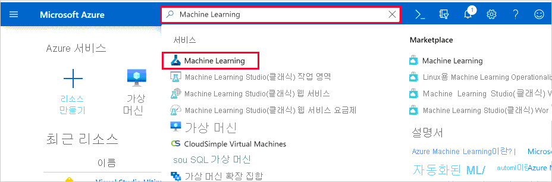

# Azure Portal에서 Azure Machine Learning 작업 영역 만들기 및 관리

이 문서에서는 [Azure Machine Learning](overview-what-is-azure-ml.md)에 대 한 Azure Portal에서 [**Azure Machine Learning 작업 영역**](concept-workspace.md) 을 만들고, 확인 하 고, 삭제 합니다.  포털은 작업 영역을 시작 하는 가장 쉬운 방법 이지만 변경 내용 또는 automation 증가 요구 사항에 따라 [CLI를 사용 하 여](reference-azure-machine-learning-cli.md)작업 영역을 만들고 삭제할 수도 있습니다 (예를 들어, [Python 코드를](https://docs.microsoft.com/python/api/overview/azure/ml/intro?view=azure-ml-py&preserve-view=true) 사용 하거나 [VS Code 확장을 통해](tutorial-setup-vscode-extension.md)).

## 작업 영역 만들기

작업 영역을 만들려면 Azure 구독이 필요합니다. Azure 구독이 없는 경우 시작하기 전에 체험 계정을 만듭니다. 지금 [Azure Machine Learning 평가판 또는 유료 버전](https://aka.ms/AMLFree)을 사용해 보세요.

1. Azure 구독에 대한 자격 증명을 사용하여 [Azure Portal](https://portal.azure.com/)에 로그인합니다. 

1. Azure Portal의 왼쪽 위 모서리에서 **+ 리소스 만들기**를 선택합니다.

      

1. 검색 창을 사용하여 **Machine Learning**을 찾습니다.

1. **Machine Learning**을 선택합니다.

1. **Machine Learning** 창에서 **만들기**를 선택하여 시작합니다.

1. 새 작업 영역을 구성하려면 다음 정보를 제공하세요.

   필드|설명 
   ---|---
   작업 영역 이름 |작업 영역을 식별하는 고유한 이름을 입력합니다. 이 예제에서는 **docs-ws**를 사용합니다. 이름은 리소스 그룹 전체에서 고유해야 합니다. 다른 사용자가 만든 작업 영역과 구별되고 기억하기 쉬운 이름을 사용하세요. 작업 영역 이름은 대/소문자를 구분하지 않습니다.
   구독 |사용할 Azure 구독을 선택합니다.
   리소스 그룹 | 구독의 기존 리소스 그룹을 사용하거나 이름을 입력하여 새 리소스 그룹을 만듭니다. 리소스 그룹은 Azure 솔루션에 관련된 리소스를 보유합니다. 이 예에서는 **docs-aml**을 사용합니다. 기존 리소스 그룹을 사용 하려면 *참가자* 또는 *소유자* 역할이 필요 합니다.  액세스에 대 한 자세한 내용은 [Azure Machine Learning 작업 영역에 대 한 액세스 관리](how-to-assign-roles.md)를 참조 하세요.
   지역 | 사용자의 작업 영역을 만들 사용자 및 데이터 리소스에 가장 가까운 Azure 지역을 선택 합니다.
   Workspace Edition | **기본** 또는 **엔터프라이즈**를 선택 합니다.  이 작업 영역 버전은 액세스 및 가격 책정을 사용할 수 있는 기능을 결정 합니다. [Azure Machine Learning](overview-what-is-azure-ml.md)에 대해 자세히 알아보세요. 

    

1. 작업 영역 구성을 마쳤으면 **검토 + 만들기**를 선택 합니다. 필요에 따라 [네트워킹](#networking) 및 [고급](#advanced) 섹션을 사용 하 여 작업 영역에 대 한 추가 설정을 구성 합니다.

1. 설정을 검토 하 고 추가 변경 또는 수정 작업을 수행 합니다. 설정에 만족 하는 경우 **만들기**를 선택 합니다.

   > [!Warning] 
   > 클라우드에서 작업 영역을 만드는 데 몇 분 정도 걸릴 수 있습니다.

   프로세스가 완료되면 배포 성공 메시지가 표시됩니다. 
 
 1. 새 작업 영역을 보려면 **리소스로 이동**을 선택합니다.

### 네트워킹  

> [!IMPORTANT]  
> 작업 영역에서 개인 끝점 및 가상 네트워크를 사용 하는 방법에 대 한 자세한 내용은 [네트워크 격리 및 개인 정보](how-to-enable-virtual-network.md)를 참조 하세요.  
1. 기본 네트워크 구성은 공용 인터넷에서 액세스할 수 있는 __공용 끝점__을 사용 하는 것입니다. 만든 Azure Virtual Network 작업 영역에 대 한 액세스를 제한 하려면 __연결 방법__으로 __개인 끝점__ (미리 보기)을 선택 하 고 __+ 추가__ 를 사용 하 여 끝점을 구성 하면 됩니다.   

   > [!IMPORTANT]   
   > Azure Machine Learning 작업 영역에서 개인 끝점을 사용 하는 것은 현재 공개 미리 보기 상태입니다. 이 미리 보기는 서비스 수준 계약 없이 제공 되며 프로덕션 워크 로드에는 권장 되지 않습니다. 특정 기능이 지원되지 않거나 기능이 제한될 수 있습니다.  
   > 자세한 내용은 [Microsoft Azure Preview에 대한 추가 사용 약관](https://azure.microsoft.com/support/legal/preview-supplemental-terms/)을 참조하세요. 
   :::image type="content" source="media/how-to-manage-workspace/select-private-endpoint.png" alt-text="개인 끝점 선택":::  

1. __개인 끝점 만들기__ 양식에서 사용할 위치, 이름 및 가상 네트워크를 설정 합니다. 사설 DNS 영역에서 끝점을 사용 하려면 __개인 DNS 영역과 통합__ 을 선택 하 고 __사설 DNS 영역__ 필드를 사용 하 여 영역을 선택 합니다. __확인__ 을 선택 하 여 끝점을 만듭니다.   

   :::image type="content" source="media/how-to-manage-workspace/create-private-endpoint.png" alt-text="개인 끝점 만들기":::   

1. 네트워킹 구성을 완료 한 후 __검토 + 만들기__를 선택 하거나 __고급__ 구성 (선택 사항)으로 이동할 수 있습니다. 

    > [!WARNING]    
    > 개인 끝점을 만들 때 __privatelink.api.azureml.ms__ 이라는 새 사설 DNS 영역이 만들어집니다. 여기에는 가상 네트워크에 대 한 링크가 포함 됩니다. 동일한 리소스 그룹에서 개인 끝점을 사용 하 여 여러 작업 영역을 만드는 경우 첫 번째 개인 끝점에 대 한 가상 네트워크만 DNS 영역에 추가할 수 있습니다. 추가 작업 영역/개인 끝점에서 사용 하는 가상 네트워크에 대 한 항목을 추가 하려면 다음 단계를 사용 합니다. 
    >   
    > 1. [Azure Portal](https://portal.azure.com)에서 작업 영역을 포함 하는 리소스 그룹을 선택 합니다. 그런 다음 __privatelink.api.azureml.ms__이라는 사설 DNS 영역 리소스를 선택 합니다.    
    > 2. __설정__에서 __가상 네트워크 링크__를 선택 합니다. 
    > 3. __추가__를 선택합니다. __가상 네트워크 링크 추가__ 페이지에서 고유한 __링크 이름을__제공한 다음 추가할 __가상 네트워크__ 를 선택 합니다. __확인__ 을 선택 하 여 네트워크 링크를 추가 합니다.    
    >   
    > 자세한 내용은 [Azure 개인 끝점 DNS 구성](/azure/private-link/private-endpoint-dns)을 참조 하세요.   

### 취약성 검색

Azure Security Center는 하이브리드 클라우드 워크로드에 통합 보안 관리 및 고급 위협 방지를 제공합니다. Azure Security Center에서 리소스를 검색 하 고 권장 사항을 따를 수 있도록 해야 합니다. 자세한 내용은  [Azure Container Registry 이미지 검색 Security Center](https://docs.microsoft.com/azure/security-center/azure-container-registry-integration) 및 [Security Center와 Azure Kubernetes Services 통합](https://docs.microsoft.com/azure/security-center/azure-kubernetes-service-integration)을 참조 하세요.

### 고급    

기본적으로 작업 영역에 대 한 메트릭 및 메타 데이터는 Microsoft에서 유지 관리 하는 Azure Cosmos DB 인스턴스에 저장 됩니다. 이 데이터는 Microsoft에서 관리 하는 키를 사용 하 여 암호화 됩니다.  

Microsoft에서 작업 영역에 대해 수집 하는 데이터를 제한 하려면 __높은 비즈니스 영향 작업 영역__을 선택 합니다. 이 설정에 대 한 자세한 내용은 [미사용 암호화](concept-enterprise-security.md#encryption-at-rest)를 참조 하세요.

> [!IMPORTANT]  
> 높은 비즈니스 영향을 선택 하는 작업은 작업 영역을 만들 때만 수행할 수 있습니다. 작업 영역을 만든 후에는이 설정을 변경할 수 없습니다.   
__엔터프라이즈__ 버전의 Azure Machine Learning을 사용 하는 경우 대신 사용자 고유의 키를 제공할 수 있습니다. 이렇게 하면 Azure 구독에 메트릭 및 메타 데이터를 저장 하는 Azure Cosmos DB 인스턴스가 만들어집니다. 사용자 고유의 키를 사용 하려면 다음 단계를 사용 합니다.    

> [!IMPORTANT]  
> 이러한 단계를 수행 하기 전에 먼저 다음 작업을 수행 해야 합니다.   
>   
> 1. 구독에 대 한 참가자 권한으로 Id 및 액세스 관리에서 __Machine Learning 앱__ 에 권한을 부여 합니다.  
> 1. [고객 관리 키 구성](/azure/cosmos-db/how-to-setup-cmk) 의 단계에 따라 다음을 수행 합니다.   
>     * Azure Cosmos DB 공급자 등록   
>     * Azure Key Vault 만들기 및 구성 
>     * 키 생성  
>   
>     Azure Cosmos DB 인스턴스를 수동으로 만들 필요는 없으며 작업 영역을 만드는 동안 생성 됩니다. 이 Azure Cosmos DB 인스턴스는이 패턴을 기반으로 하는 이름을 사용 하 여 별도의 리소스 그룹에 만들어집니다 `<your-workspace-resource-name>_<GUID>` .   
>   
> 작업 영역을 만든 후에는이 설정을 변경할 수 없습니다. 작업 영역에서 사용 하는 Azure Cosmos DB를 삭제 하는 경우 해당 작업 영역을 사용 하는 작업 영역도 삭제 해야 합니다.   
1. __고객 관리 키__를 선택 하 고 __키를 선택 하려면 클릭__하십시오 .를 선택 합니다.   

    :::image type="content" source="media/how-to-manage-workspace/advanced-workspace.png" alt-text="고객 관리형 키":::   

1. __Azure Key Vault에서 키 선택__ 양식에서 기존 Azure Key Vault, 포함 된 키 및 키의 버전을 선택 합니다. 이 키는 Azure Cosmos DB에 저장 된 데이터를 암호화 하는 데 사용 됩니다. 마지막으로, __선택__ 단추를 사용 하 여이 키를 사용 합니다. 

   :::image type="content" source="media/how-to-manage-workspace/select-key-vault.png" alt-text="키 선택":::

### 구성 파일 다운로드

1. [계산 인스턴스](tutorial-1st-experiment-sdk-setup.md#azure)를 만들려는 경우에는이 단계를 건너뜁니다.

1. 로컬 환경에서 이 작업 영역을 참조하는 코드를 사용하려면 작업 영역의 **개요** 섹션에서 **config.json 다운로드**를 선택합니다.  

   
   
   Python 스크립트 또는 Jupyter Notebook을 사용하여 파일을 디렉터리 구조에 배치합니다. 동일한 디렉터리, *.azureml*이라는 하위 디렉터리 또는 부모 디렉터리에 있을 수 있습니다. 계산 인스턴스를 만들 때이 파일은 VM의 올바른 디렉터리에 추가 됩니다.
## 작업 영역 찾기

1. [Azure Portal](https://portal.azure.com/)에 로그인합니다.

1. 위쪽 검색 필드에 **Machine Learning**을 입력 합니다.  

1. **Machine Learning**을 선택합니다.

   

1. 검색된 작업 영역 목록을 살펴봅니다. 구독, 리소스 그룹 및 위치를 기준으로 필터링 할 수 있습니다.  

1. 해당 속성을 표시할 작업 영역을 선택 합니다.

## 작업 영역 삭제

[Azure Portal](https://portal.azure.com/)에서 삭제 하려는 작업 영역의 맨 위에 있는 **삭제** 를 선택 합니다.

:::image type="content" source="./media/how-to-manage-workspace/delete-workspace.png" alt-text="작업 영역 삭제":::

## 리소스 정리

[!INCLUDE [aml-delete-resource-group](../../includes/aml-delete-resource-group.md)]

## 문제 해결

### 리소스 공급자 오류

[!INCLUDE [machine-learning-resource-provider](../../includes/machine-learning-resource-provider.md)]

### 작업 영역 이동

> [!WARNING]
> Azure Machine Learning 작업 영역을 다른 구독으로 이동하거나 소유하는 구독을 새 테넌트로 이동하는 것은 지원되지 않습니다. 이렇게 하면 오류가 발생할 수 있습니다.

### Azure Container Registry 삭제

Azure Machine Learning 작업 영역에서는 일부 작업에 ACR(Azure Container Registry)을 사용합니다. 먼저 필요한 경우 ACR 인스턴스를 자동으로 만듭니다.

[!INCLUDE [machine-learning-delete-acr](../../includes/machine-learning-delete-acr.md)]

## 다음 단계

전체 길이 자습서에 따라 작업 영역을 사용 하 여 Azure Machine Learning으로 모델을 작성, 학습 및 배포 하는 방법을 알아봅니다.

> [!div class="nextstepaction"]
> [자습서: 모델 교육](tutorial-train-models-with-aml.md)
