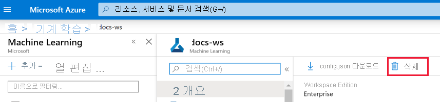

# Azure 포털에서 Azure 기계 학습 작업 영역 만들기 및 관리
[!INCLUDE [applies-to-skus](../../includes/aml-applies-to-basic-enterprise-sku.md)]

이 문서에서는 [Azure](overview-what-is-azure-ml.md)기계 학습에 대한 [**Azure 포털에서 Azure 기계 학습 작업 영역을**](concept-workspace.md) 만들고 보고 삭제합니다.  포털은 작업 영역을 시작하는 가장 쉬운 방법이지만 필요에 따라 변경되거나 자동화 요구 사항이 증가함에 따라 [Python 코드](https://docs.microsoft.com/python/api/overview/azure/ml/intro?view=azure-ml-py) 또는 [VS Code 확장을 사용하여](tutorial-setup-vscode-extension.md) [CLI를 사용하여](reference-azure-machine-learning-cli.md)작업 영역을 만들고 삭제할 수도 있습니다.

## 작업 영역 만들기

작업 영역을 만들려면 Azure 구독이 필요합니다. Azure 구독이 없는 경우 시작하기 전에 체험 계정을 만듭니다. 지금 [Azure Machine Learning 평가판 또는 유료 버전](https://aka.ms/AMLFree)을 사용해 보세요.

1. Azure 구독에 대한 자격 증명을 사용하여 [Azure Portal](https://portal.azure.com/)에 로그인합니다. 

1. Azure Portal의 왼쪽 위 모서리에서 **+ 리소스 만들기**를 선택합니다.

      

1. 검색 창을 사용하여 **Machine Learning**을 찾습니다.

1. **Machine Learning**을 선택합니다.

1. **Machine Learning** 창에서 **만들기**를 선택하여 시작합니다.

1. 새 작업 영역을 구성하려면 다음 정보를 제공하세요.

   필드|설명 
   ---|---
   작업 영역 이름 |작업 영역을 식별하는 고유한 이름을 입력합니다. 이 예제에서는 **docs-ws**를 사용합니다. 이름은 리소스 그룹 전체에서 고유해야 합니다. 다른 사용자가 만든 작업 영역과 구별되고 기억하기 쉬운 이름을 사용하세요. 작업 영역 이름은 대/소문자를 구분하지 않습니다.
   Subscription |사용할 Azure 구독을 선택합니다.
   Resource group | 구독의 기존 리소스 그룹을 사용하거나 이름을 입력하여 새 리소스 그룹을 만듭니다. 리소스 그룹은 Azure 솔루션에 관련된 리소스를 보유합니다. 이 예에서는 **docs-aml**을 사용합니다. 
   위치 | 사용자 및 데이터 리소스와 가장 가까운 위치를 선택하여 작업 영역을 만듭니다.
   Workspace Edition | **기본** 또는 **엔터프라이즈**를 선택합니다.  이 작업 영역 버전에서는 액세스 및 가격 책정을 사용할 기능을 결정합니다. [기본 및 엔터프라이즈 버전 제품에](overview-what-is-azure-ml.md#sku)대해 자세히 알아보십시오. 

    

1. 작업 영역 구성이 완료되면 검토 + **만들기를**선택합니다.
2. 설정을 검토하고 추가 변경 또는 수정을 합니다. 설정이 완료되면 에서 **만들기를**선택합니다.

   > [!Warning] 
   > 클라우드에서 작업 영역을 만드는 데 몇 분 정도 걸릴 수 있습니다.

   프로세스가 완료되면 배포 성공 메시지가 표시됩니다. 
 
 1. 새 작업 영역을 보려면 **리소스로 이동**을 선택합니다.

### 구성 파일 다운로드

1. [계산 인스턴스를](tutorial-1st-experiment-sdk-setup.md#azure)만들 려면 이 단계를 건너뜁니다.

1. 로컬 환경에서 이 작업 영역을 참조하는 코드를 사용하려면 작업 영역의 **개요** 섹션에서 **config.json 다운로드**를 선택합니다.  

   
   
   Python 스크립트 또는 Jupyter Notebook을 사용하여 파일을 디렉터리 구조에 배치합니다. 동일한 디렉터리, *.azureml*이라는 하위 디렉터리 또는 부모 디렉터리에 있을 수 있습니다. 계산 인스턴스를 만들면 이 파일이 VM의 올바른 디렉터리에 추가됩니다.

## 엔터프라이즈 버전으로 업그레이드

작업 영역을 기본 버전에서 엔터프라이즈 버전으로 업그레이드하여 저코드 환경 및 향상된 보안 기능과 같은 향상된 기능을 활용할 수 있습니다.

1. [Azure Machine Learning Studio](https://ml.azure.com)에 로그인합니다.

1. 업그레이드할 작업 영역을 선택합니다.

1. 페이지 오른쪽 상단에서 **자세히 알아보기를** 선택합니다.

   [ 업그레이드](./media/how-to-manage-workspace/upgrade.png#lightbox)

1. 표시되는 창에서 **업그레이드를** 선택합니다.

> [!IMPORTANT]
> 엔터프라이즈 에디션 작업 영역을 기본 에디션 작업 영역으로 다운그레이드할 수 없습니다. 

## 작업 영역 찾기

1. 상단 검색 필드에 **기계 학습을**입력합니다.  

1. **Machine Learning**을 선택합니다.

   

1. 검색된 작업 영역 목록을 살펴봅니다. 구독, 리소스 그룹 및 위치를 기준으로 필터링 할 수 있습니다.  

1. 해당 속성을 표시할 작업 영역을 선택합니다.

## 작업 영역 삭제

삭제하려는 작업 영역 맨 위에 있는 [삭제] 단추를 사용합니다.

  

## 리소스 정리

[!INCLUDE [aml-delete-resource-group](../../includes/aml-delete-resource-group.md)]

## 문제 해결

### 리소스 공급자 오류

[!INCLUDE [machine-learning-resource-provider](../../includes/machine-learning-resource-provider.md)]

### 작업 영역 이동

> [!WARNING]
> Azure Machine Learning 작업 영역을 다른 구독으로 이동하거나 소유 구독을 새 테넌트로 이동하는 것은 지원되지 않습니다. 이렇게 하면 오류가 발생할 수 있습니다.

### Azure 컨테이너 레지스트리 삭제

Azure 기계 학습 작업 영역은 일부 작업에 Azure 컨테이너 레지스트리(ACR)를 사용합니다. ACR 인스턴스가 처음 필요할 때 자동으로 ACR 인스턴스가 생성됩니다.

[!INCLUDE [machine-learning-delete-acr](../../includes/machine-learning-delete-acr.md)]

## 다음 단계

전체 길이 자습서를 따라 Azure 기계 학습을 사용하여 모델을 빌드, 학습 및 배포하는 데 작업 영역을 사용하는 방법을 알아봅니다.

> [!div class="nextstepaction"]
> [자습서: 모델 교육](tutorial-train-models-with-aml.md)
