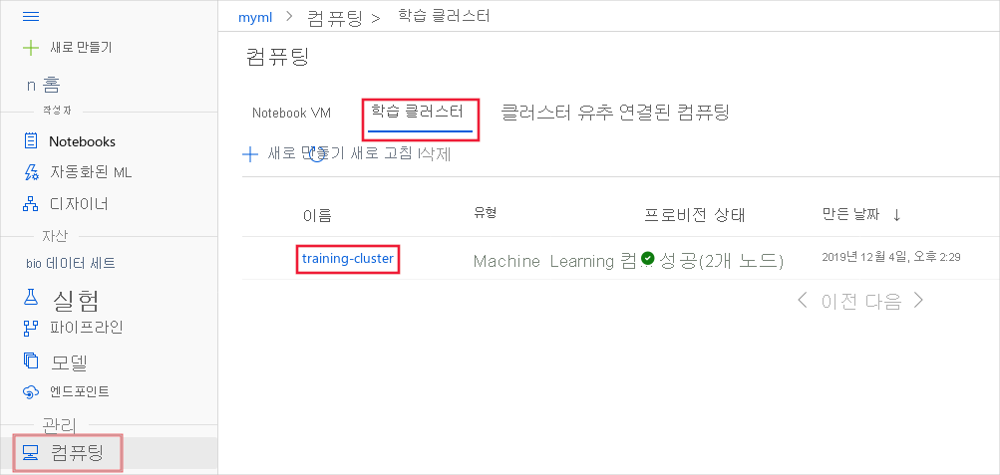
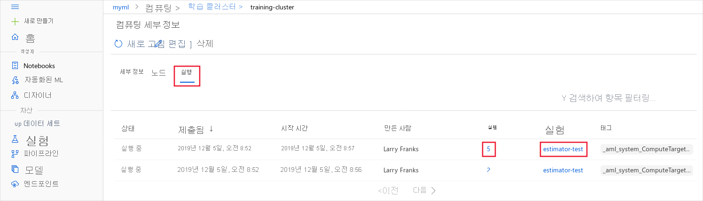

# <a name="monitor-and-view-ml-run-logs-and-metrics"></a>ML 실행 로그 및 메트릭 모니터링 및 보기


이 문서에서는 Azure Machine Learning 실행을 모니터링 하 고 로그를 보는 방법에 대해 알아봅니다. 로그를 보려면 먼저 해당 로그를 사용 하도록 설정 해야 합니다. 자세한 내용은 [AZURE ML 학습 실행에서 로깅 사용](how-to-track-experiments.md)을 참조 하세요.

로그를 통해 오류 및 경고를 진단 하거나 매개 변수 및 모델 정확도와 같은 성능 메트릭을 추적할 수 있습니다. 이 문서에서는 다음 방법을 사용 하 여 로그를 보는 방법에 대해 알아봅니다.

> [!div class="checklist"]
> * 스튜디오에서 모니터 실행
> * Jupyter Notebook 위젯을 사용 하 여 모니터 실행
> * 자동화 된 machine learning 실행 모니터링
> * 완료 시 출력 로그 보기
> * 스튜디오에서 출력 로그 보기

실험을 관리 하는 방법에 대 한 일반적인 정보는 [학습 실행 시작, 모니터링 및 취소](how-to-manage-runs.md)를 참조 하세요.

## <a name="monitor-runs-in-the-studio"></a>스튜디오에서 모니터 실행

브라우저에서 특정 계산 대상에 대 한 실행을 모니터링 하려면 다음 단계를 사용 합니다.

1. [Azure Machine Learning studio](https://ml.azure.com/)에서 작업 영역을 선택 하 고 페이지의 왼쪽에서 __계산__ 을 선택 합니다.

1. 학습에 사용되는 컴퓨팅 대상 목록을 표시하려면 __학습 클러스터__를 선택합니다. 그런 다음 클러스터를 선택합니다.

    

1. __실행__을 선택합니다. 이 클러스터를 사용하는 실행 목록이 표시됩니다. 특정 실행에 대한 세부 정보를 보려면 __실행__ 열의 링크를 사용합니다. 실험에 대한 세부 정보를 보려면 __실험__ 열의 링크를 사용합니다.

    
    
    > [!TIP]
    > 학습 계산 대상은 공유 리소스 이므로 지정 된 시간에 큐에 대기 중이거나 활성 상태가 여러 개 있을 수 있습니다.
    > 
    > 실행에는 자식 실행이 포함될 수 있으므로 하나의 학습 작업으로 여러 항목이 생성될 수 있습니다.

실행이 완료되면 이 페이지에 더 이상 표시되지 않습니다. 완료된 실행에 대한 정보를 보려면 스튜디오의 __실험__ 섹션을 방문하여 실험 및 실행을 선택합니다. 자세한 내용은 [완료 된 실행에 대 한 메트릭 보기](#view-the-experiment-in-the-web-portal)섹션을 참조 하세요.

## <a name="monitor-runs-using-the-jupyter-notebook-widget"></a>Jupyter 노트북 위젯을 사용 하 여 실행 모니터링

**ScriptRunConfig** 메서드를 사용 하 여 실행을 제출 하는 경우 [Jupyter 위젯을](https://docs.microsoft.com/python/api/azureml-widgets/azureml.widgets?view=azure-ml-py&preserve-view=true)사용 하 여 실행 진행률을 볼 수 있습니다. 실행 제출과 마찬가지로, 위젯은 비동기적이며 작업이 완료될 때까지 10~15초 간격으로 라이브 업데이트를 제공합니다.

실행이 완료될 때까지 기다리는 동안 Jupyter 위젯을 봅니다.
    
```python
from azureml.widgets import RunDetails
RunDetails(run).show()
```


작업 영역에서 동일한 표시에 대한 링크를 가져올 수도 있습니다.

```python
print(run.get_portal_url())
```

## <a name="monitor-automated-machine-learning-runs"></a>자동화 된 machine learning 실행 모니터링

자동화 된 기계 학습 실행의 경우 이전 실행에서 차트에 액세스 하려면를 `<<experiment_name>>` 적절 한 실험 이름으로 바꿉니다.

```python
from azureml.widgets import RunDetails
from azureml.core.run import Run

experiment = Experiment (workspace, <<experiment_name>>)
run_id = 'autoML_my_runID' #replace with run_ID
run = Run(experiment, run_id)
RunDetails(run).show()
```


## <a name="show-output-upon-completion"></a>완료 시 출력 표시

**ScriptRunConfig**를 사용하면 ```run.wait_for_completion(show_output = True)```를 사용하여 모델 학습이 완료된 시점을 표시할 수 있습니다. ```show_output``` 플래그는 자세한 정보를 출력합니다. 자세한 내용은 [로깅 사용 방법](how-to-track-experiments.md#scriptrunconfig-logs)의 ScriptRunConfig 섹션을 참조 하세요.

<a id="queryrunmetrics"></a>
## <a name="query-run-metrics"></a>실행 메트릭 쿼리

```run.get_metrics()```를 사용하여 학습된 모델의 메트릭을 볼 수 있습니다. 예를 들어 위의 예제와 함께이를 사용 하 여 가장 낮은 mse (제곱 오류) 값을 가진 모델을 찾아 최상의 모델을 결정할 수 있습니다.

<a name="view-the-experiment-in-the-web-portal"></a>
## <a name="view-run-records-in-the-studio"></a>스튜디오에서 실행 레코드 보기

[Azure Machine Learning studio](https://ml.azure.com)에서 기록 된 메트릭을 포함 하 여 완료 된 실행 레코드를 찾아볼 수 있습니다.

**실험** 탭으로 이동 하 여 실험을 선택 합니다. 실험 실행 대시보드에서 각 실행에 대 한 추적 된 메트릭과 로그를 볼 수 있습니다. 

특정 실행으로 드릴 다운 하 여 해당 출력 또는 로그를 보거나 실험의 스냅숏을 다운로드 하 여 다른 사람과 실험 폴더를 공유할 수 있습니다.

실행 목록 테이블을 편집 하 여 여러 실행을 선택 하 고 실행에 대 한 마지막, 최소 또는 최대 로그 값을 표시할 수도 있습니다. 여러 실행에서 기록 된 메트릭 값과 집계를 비교 하려면 차트를 사용자 지정 합니다.


### <a name="format-charts-in-the-studio"></a>스튜디오에서 차트 서식 지정

로깅 Api에서 다음 메서드를 사용 하 여 studio 시각화 메트릭에 영향을 줍니다.

|기록된 값|예제 코드| 포털의 형식|
|----|----|----|
|숫자 값의 배열 기록| `run.log_list(name='Fibonacci', value=[0, 1, 1, 2, 3, 5, 8, 13, 21, 34, 55, 89])`|단일 변수 꺾은선형 차트|
|반복적으로 사용되는 동일한 메트릭 이름(for 루프 내에서와 같이)을 사용하여 단일 숫자 값 기록| `for i in tqdm(range(-10, 10)):    run.log(name='Sigmoid', value=1 / (1 + np.exp(-i))) angle = i / 2.0`| 단일 변수 꺾은선형 차트|
|2개의 숫자 열을 반복적으로 사용하여 행 기록|`run.log_row(name='Cosine Wave', angle=angle, cos=np.cos(angle))   sines['angle'].append(angle)      sines['sine'].append(np.sin(angle))`|두 개의 변수 꺽은선형 차트|
|두 개의 숫자 열을 사용하여 테이블 기록|`run.log_table(name='Sine Wave', value=sines)`|두 개의 변수 꺽은선형 차트|


## <a name="next-steps"></a>다음 단계

Azure Machine Learning를 사용 하는 방법을 알아보려면 다음 단계를 수행 하세요.

* [Azure Machine Learning 디자이너에서 실험을 추적 하 고 로그를 사용 하도록 설정](how-to-track-designer-experiments.md)하는 방법을 알아봅니다.

* 최상의 모델을 등록하고 배포하는 방법에 대한 예제는 [Azure Machine Learning으로 이미지 분류 모델 학습](tutorial-train-models-with-aml.md) 자습서를 참조하세요.

