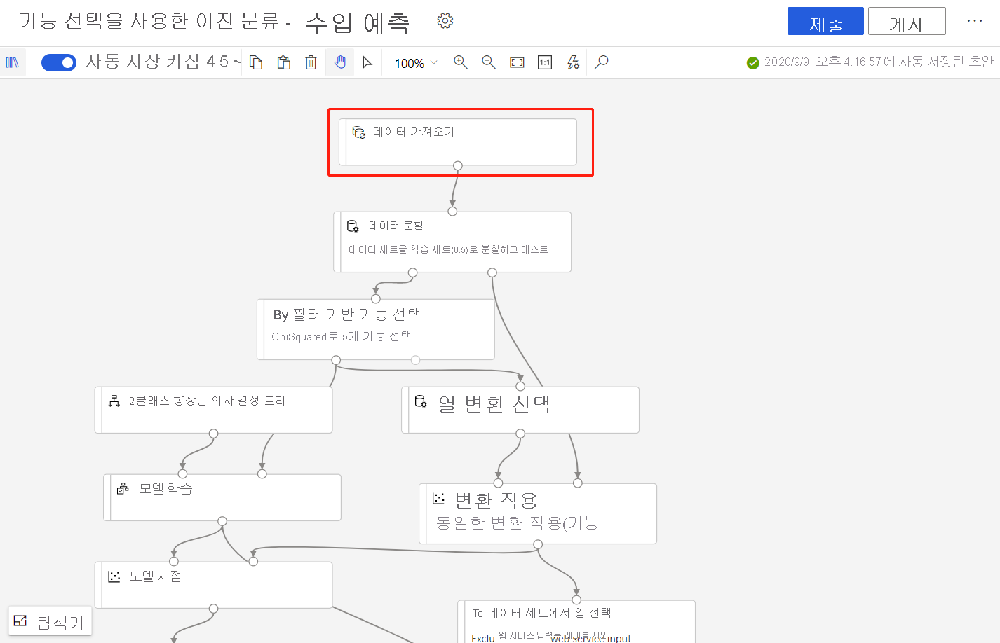
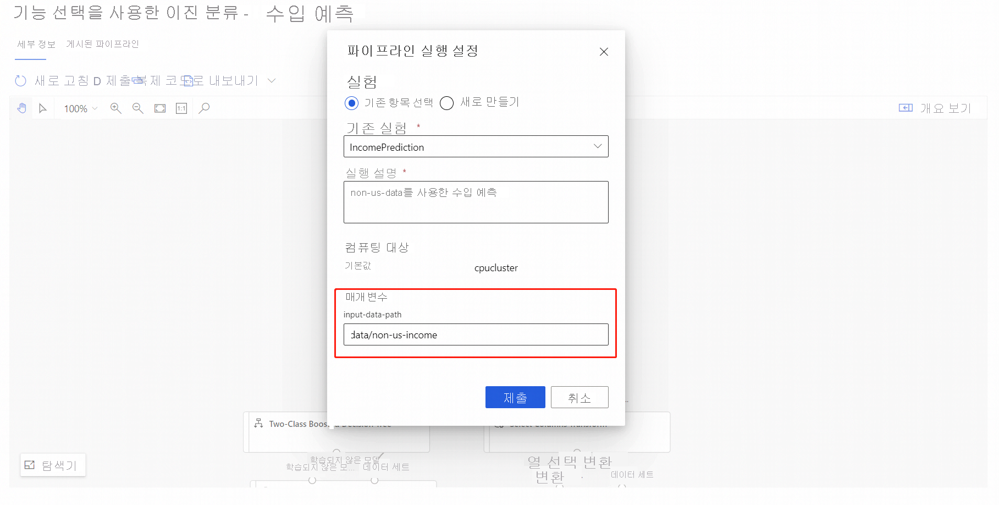

# Azure Machine Learning 디자이너(미리 보기)를 사용하여 모델 다시 학습
[!INCLUDE [applies-to-skus](../../includes/aml-applies-to-enterprise-sku.md)]

이 방법 문서에서는 Azure 기계 학습 디자이너를 사용하여 기계 학습 모델을 다시 학습하는 방법을 알아봅니다. 게시된 파이프라인을 사용하여 재교육을 위한 기계 학습 워크플로우를 자동화하는 방법을 알아보십시오.

이 문서에서는 다음 방법을 설명합니다.

> [!div class="checklist"]
> * 기계 학습 모델 학습
> * 파이프라인 매개 변수를 만듭니다.
> * 교육 파이프라인을 게시합니다.
> * 모델을 다시 학습합니다.

## 사전 요구 사항

* Azure 구독 Azure 구독이 없는 경우 [무료 계정을](https://aka.ms/AMLFree)만듭니다.
* 엔터프라이즈 SKU를 갖춘 Azure 기계 학습 작업 영역입니다.

이 문서에서는 디자이너에서 파이프라인을 빌드하는 데 대한 기본 지식이 있다고 가정합니다. 디자이너에 대한 단계별 소개를 보려면 [자습서](tutorial-designer-automobile-price-train-score.md)를 완료하세요. 

### 샘플 파이프라인

이 문서에서 사용되는 파이프라인은 [샘플 3: 소득 예측에](how-to-designer-sample-classification-predict-income.md)있는 파이프라인의 변경된 버전입니다. 샘플 데이터 집합 대신 [데이터 가져오기](algorithm-module-reference/import-data.md) 모듈을 사용하여 사용자 고유의 데이터를 사용하여 모델을 학습하는 방법을 보여 줍니다.

## 기계 학습 모델 학습

모델을 다시 학습하려면 초기 모델이 필요합니다. 이 섹션에서는 디자이너를 사용하여 모델을 학습하고 저장된 모델에 액세스하는 방법을 배웁니다.

1. 데이터 가져오기 모듈을 **선택합니다.**
1. 속성 창에서 데이터 원본을 지정합니다.

   

   이 예제에서는 데이터가 [Azure 데이터 스토어에](how-to-access-data.md)저장됩니다. 아직 데이터스토어가 없는 경우 **새 데이터스토어를**선택하여 지금 만들 수 있습니다.

1. 데이터에 대한 경로를 지정합니다. **찾아보기 경로를** 선택하여 데이터스토어로 찾아볼 수도 있습니다. 
1. 캔버스 상단에서 **실행을** 선택합니다.
    
   > [!NOTE]
   > 이 파이프라인 초안에 대한 기본 계산을 이미 설정한 경우 파이프라인이 자동으로 실행됩니다. 그렇지 않으면 설정 창의 프롬프트를 따라 지금 설정할 수 있습니다.

### 학습된 모델 찾기

디자이너는 학습된 모델을 포함한 모든 파이프라인 출력을 기본 저장소 계정에 저장합니다. 디자이너에서 직접 학습된 모델에 액세스할 수도 있습니다.

1. 파이프라인실행이 완료될 때까지 기다립니다.
1. **모델 학습** 모듈을 선택합니다.
1. 설정 창에서 **출력+로그를 선택합니다.**
1. 출력 **보기** 아이콘을 선택하고 팝업 창의 지시에 따라 학습된 모델을 찾습니다.

## 파이프라인 매개 변수 만들기

파이프라인 매개 변수를 추가하여 런타임시 동적으로 변수를 설정합니다. 이 파이프라인의 경우 새 데이터 집합에서 모델을 다시 학습할 수 있도록 학습 데이터 경로에 대한 매개 변수를 추가합니다.

1. 데이터 가져오기 모듈을 **선택합니다.**
1. 설정 창에서 **패스** 필드 위의 타원을 선택합니다.
1. **파이프라인 매개 변수에 추가를**선택합니다.
1. 매개 변수 이름과 기본값을 제공합니다.

   > [!NOTE]
   > 파이프라인 초안 제목 옆에 있는 **설정** 기어 아이콘을 선택하여 파이프라인 매개변수를 검사하고 편집할 수 있습니다. 

## 교육 파이프라인 게시

파이프라인을 게시하면 파이프라인 끝점이 만들어집니다. 파이프라인 끝점을 사용하면 반복성 및 자동화를 위해 파이프라인을 재사용하고 관리할 수 있습니다. 이 예제에서는 재교육을 위해 파이프라인을 설정했습니다.

1. 디자이너 캔버스 위에 **게시를** 선택합니다.
1. 파이프라인 끝점을 선택하거나 작성합니다.

   > [!NOTE]
   > 여러 파이프라인을 단일 끝점에 게시할 수 있습니다. 끝점의 각 파이프라인에는 파이프라인 끝점을 호출할 때 지정할 수 있는 버전 번호가 지정됩니다.

1. **게시**를 선택합니다.

## 모델 다시 학습시키기

게시된 교육 파이프라인이 있으므로 새 데이터를 사용하여 모델을 다시 학습하는 데 사용할 수 있습니다. Azure 포털에서 파이프라인 끝점에서 실행을 제출하거나 프로그래밍 방식으로 제출할 수 있습니다.

### 디자이너를 사용하여 실행 을 제출

다음 단계를 사용하여 디자이너에서 파이프라인 끝점 실행을 제출합니다.

1. 끝점 페이지로 **이동합니다.**
1. 파이프라인 **끝점** 탭을 선택합니다.
1. 파이프라인 끝점을 선택합니다.
1. 게시된 **파이프라인 탭을 선택합니다.**
1. 실행할 파이프라인을 선택합니다.
1. **제출**을 선택합니다.
1. 설정 대화 상자에서 입력 데이터 경로 값에 대한 새 값을 지정할 수 있습니다. 이 값은 새 데이터 집합을 가리킵니다.

### 코드를 사용하여 실행 제출

게시된 파이프라인의 REST 끝점은 개요 패널에서 찾을 수 있습니다. 끝점을 호출하여 게시된 파이프라인을 다시 학습할 수 있습니다.

REST 호출하려면 OAuth 2.0 베어러 유형 인증 헤더가 필요합니다. 작업 영역에 대한 인증을 설정하고 매개 변수가 설정된 REST 호출을 만드는 자세한 내용은 [일괄 처리 점수를 위한 Azure 기계 학습 파이프라인 빌드를](tutorial-pipeline-batch-scoring-classification.md#publish-and-run-from-a-rest-endpoint)참조하십시오.

## 다음 단계

디자이너 [자습서를](tutorial-designer-automobile-price-train-score.md) 따라 회귀 모델을 학습하고 배포합니다.
