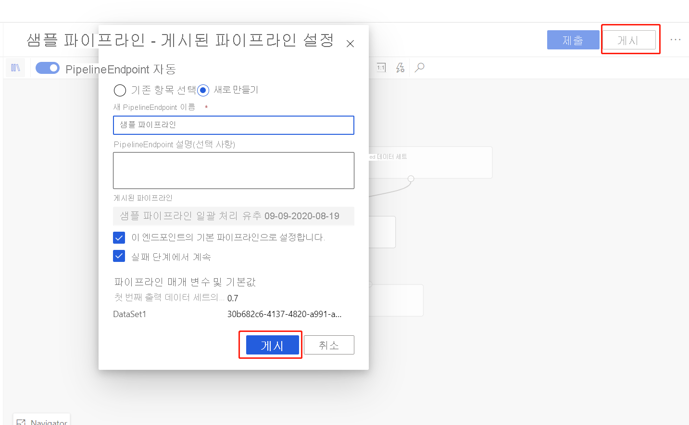
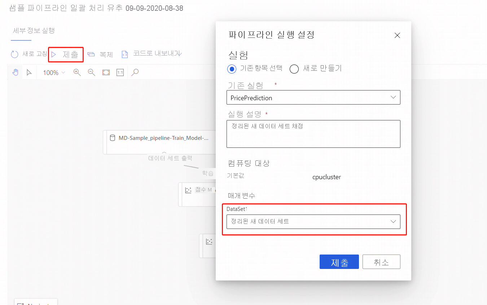

# Azure Machine Learning 디자이너를 사용하여 일괄 처리 예측 실행(미리 보기)
[!INCLUDE [applies-to-skus](../../includes/aml-applies-to-enterprise-sku.md)]

이 문서에서는 디자이너를 사용하여 일괄 처리 예측 파이프라인을 만드는 방법에 대해 알아봅니다. 일괄 처리 예측을 사용하면 모든 HTTP 라이브러리에서 트리거할 수 있는 웹 서비스를 사용하여 요청 시 대량 데이터 세트를 지속적으로 채점할 수 있습니다.

이 방법 문서에서는 다음 작업을 수행하는 방법을 알아봅니다.

> [!div class="checklist"]
> * 일괄 처리 유추 파이프라인 만들기 및 게시
> * 파이프라인 엔드포인트 사용
> * 엔드포인트 버전 관리

SDK를 사용하여 일괄 처리 채점 서비스를 설정하는 방법에 대해 알아보려면 함께 제공되는 [방법](how-to-run-batch-predictions.md)을 참조하세요.

## 사전 요구 사항

이 방법에서는 학습 파이프라인이 이미 있다고 가정합니다. 디자이너를 소개하는 방법에 대한 자세한 내용을 확인하려면 [디자이너 자습서의 1부](tutorial-designer-automobile-price-train-score.md)를 완료하세요. 

## 일괄 처리 유추 파이프라인 만들기

유추 파이프라인을 만들려면 학습 파이프라인을 한 번 이상 실행해야 합니다.

1. 작업 영역의 **디자이너** 탭으로 이동합니다.

1. 예측을 만드는 데 사용하려는 모델을 학습시키는 학습 파이프라인을 선택합니다.

1. 파이프라인을 **제출합니다**.

    

이제 학습 파이프라인이 실행되었으므로 일괄 처리 유추 파이프라인을 만들 수 있습니다.

1. **제출** 옆에 있는 새 드롭다운 **유추 파이프라인 만들기**를 선택합니다.

1. **일괄 처리 유추 파이프라인**을 선택합니다.

    
    
그러면 기본 일괄 처리 유추 파이프라인이 생성됩니다. 

### 파이프라인 매개 변수 추가

새 데이터에 대한 예측을 만들려면 이 파이프라인 초안 보기에서 다른 데이터 세트를 수동으로 연결하거나 데이터 세트에 대한 매개 변수를 만들 수 있습니다. 매개 변수를 사용하면 런타임에 일괄 처리 유추 프로세스의 동작을 변경할 수 있습니다.

이 섹션에서는 데이터 세트 매개 변수를 만들어서 예측을 할 다른 데이터 세트를 지정합니다.

1. 데이터 세트 모듈을 선택합니다.

1. 캔버스 오른쪽에 창이 표시됩니다. 창 아래쪽에서 **파이프라인 매개 변수 설정**을 선택합니다.
   
    매개 변수에 대한 이름을 입력하거나 기본값을 수락합니다.

## 일괄 처리 유추 파이프라인 게시

이제 유추 파이프라인을 배포할 준비가 되었습니다. 이로써 파이프라인을 배포하고 다른 사용자가 사용할 수 있도록 합니다.

1. **게시** 단추를 선택합니다.

1. 표시되는 대화 상자에서 **PipelineEndpoint**에 대한 드롭다운을 확장하고 **New PipelineEndpoint**를 선택합니다.

1. 엔드포인트 이름과 설명(선택 사항)을 제공합니다.

    대화 상자 아래쪽에서 학습 중에 사용된 데이터 세트 ID의 기본값을 사용하여 구성된 매개 변수를 볼 수 있습니다.

1. **게시**를 선택합니다.

## 엔드포인트 사용

이제 데이터 세트 매개 변수를 사용하는 게시된 파이프라인이 생겼습니다. 파이프라인은 학습 파이프라인에서 만든 학습된 모델을 사용하여 매개 변수로 제공하는 데이터 세트를 채점합니다.

### 파이프라인 실행 제출 

이 섹션에서는 수동 파이프라인 실행을 설정하고 파이프라인 매개 변수를 변경하여 새 데이터를 채점합니다. 

1. 배포가 완료되고 나면 **엔드포인트** 섹션으로 이동합니다.

1. **파이프라인 엔드포인트**를 선택합니다.

1. 만든 엔드포인트의 이름을 선택합니다.

1. **게시된 파이프라인**을 선택합니다.

    이 화면에는 이 엔드포인트 아래 게시된 모든 파이프라인이 표시됩니다.

1. 게시한 파이프라인을 선택합니다.

    파이프라인 세부 정보 페이지에 파이프라인에 대한 자세한 실행 기록 및 연결 문자열 정보가 표시됩니다. 
    
1. **제출** 단추를 선택하여 파이프라인의 수동 실행을 만듭니다.

    
    
1. 다른 데이터 세트를 사용하도록 매개 변수를 변경합니다.
    
1. **제출**을 선택하여 파이프라인을 실행합니다.

### REST 엔드포인트 사용

**엔드포인트** 섹션에서 파이프라인 엔드포인트 및 게시된 파이프라인을 사용하는 방법에 대한 정보를 찾을 수 있습니다.

파이프라인 엔드포인트의 REST 엔드포인트는 실행 개요 패널에서 찾을 수 있습니다. 엔드포인트를 호출하여 기본 게시된 파이프라인을 사용 중입니다.

**게시된 파이프라인** 페이지에서 게시된 파이프라인을 사용할 수도 있습니다. 게시된 파이프라인을 선택하고 REST 엔드포인트를 찾습니다. 

REST 호출을 수행하려면 OAuth 2.0 전달자 유형 인증 헤더가 필요합니다. 작업 영역에 대한 인증을 설정하고 매개 변수가 있는 REST 호출을 수행하는 방법에 대한 자세한 내용은 다음 [자습서 섹션](tutorial-pipeline-batch-scoring-classification.md#publish-and-run-from-a-rest-endpoint)을 참조하세요.

## 엔드포인트 버전 관리

디자이너는 엔드포인트에 게시하는 각 후속 파이프라인에 버전을 할당합니다. REST 호출에서 매개 변수로 실행하려는 파이프라인 버전을 지정할 수 있습니다. 버전 번호를 지정하지 않으면 디자이너에서 기본 파이프라인을 사용합니다.

파이프라인을 게시할 때 이를 해당 엔드포인트에 대한 새 기본 파이프라인으로 만들도록 선택할 수 있습니다.

엔드포인트의 **게시된 파이프라인** 탭에서 새 기본 파이프라인을 설정할 수도 있습니다.

## 다음 단계

디자이너 [자습서](tutorial-designer-automobile-price-train-score.md)에 따라 회귀 모델을 학습하고 배포합니다.
''