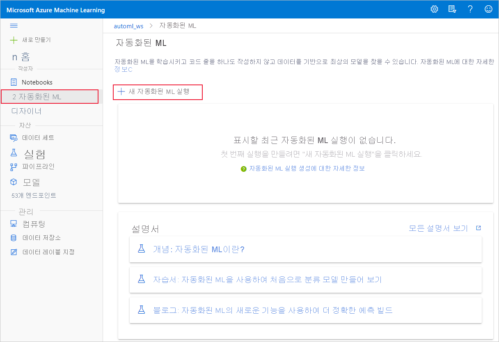
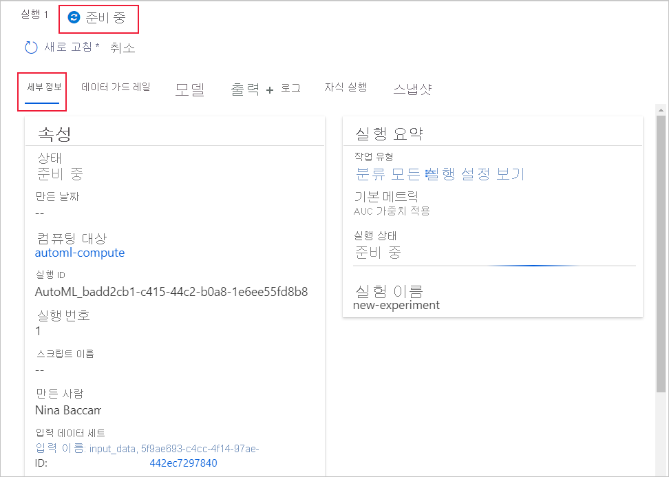
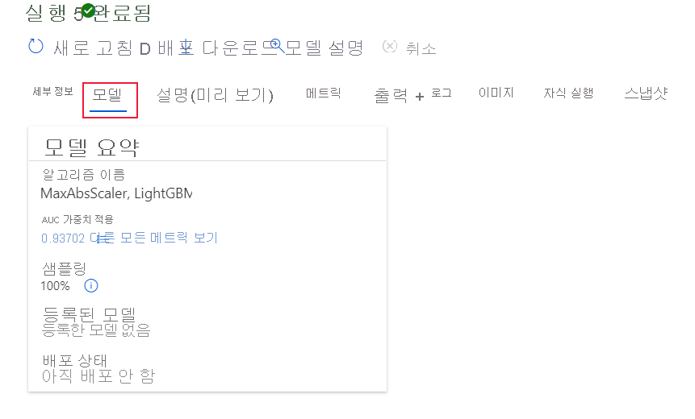

# <a name="create-review-and-deploy-automated-machine-learning-models-with-azure-machine-learning"></a>Azure 기계 학습을 사용하여 자동화된 기계 학습 모델을 생성, 검토 및 배포
[!INCLUDE [applies-to-skus](../../includes/aml-applies-to-enterprise-sku.md)]

이 문서에서는 Azure Machine Learning의 스튜디오 인터페이스에서 한 줄의 코드 없이 자동화된 기계 학습 모델을 만들고 탐색하고 배포하는 방법을 배웁니다. 자동화된 기계 학습은 특정 데이터에 사용할 수 있는 최상의 기계 학습 알고리즘을 선택한 프로세스입니다. 이 프로세스를 통해 기계 학습 모델을 신속하게 생성할 수 있습니다. [자동화된 기계 학습에 대해 자세히 알아보십시오.](concept-automated-ml.md)
 
종단 간 예제에서는 [Azure Machine Learning의 자동화된 ML 인터페이스를 사용하여 분류 모델을 만드는 자습서를](tutorial-first-experiment-automated-ml.md)사용해 보십시오. 

Python 코드 기반 환경의 경우 Azure 기계 학습 SDK를 통해 [자동화된 기계 학습 실험을 구성합니다.](how-to-configure-auto-train.md)

## <a name="prerequisites"></a>사전 요구 사항

* Azure 구독 Azure 구독이 없는 경우 시작하기 전에 체험 계정을 만듭니다. 지금 [Azure Machine Learning 평가판 또는 유료 버전](https://aka.ms/AMLFree)을 사용해 보세요.

* **엔터프라이즈 버전**유형이 있는 Azure 기계 학습 작업 영역입니다. [Azure Machine Learning 작업 영역 만들기](how-to-manage-workspace.md)를 참조하세요.  기존 작업 영역을 엔터프라이즈 버전으로 업그레이드하려면 [엔터프라이즈 버전으로 업그레이드 를](how-to-manage-workspace.md#upgrade)참조하십시오.

## <a name="get-started"></a>시작

1. 에서 Azure 기계 학습에 로그인합니다. https://ml.azure.com 

1. 구독 및 작업 영역을 선택합니다. 

1. 왼쪽 창으로 이동합니다. **작성자** 섹션에서 **자동화된 ML을** 선택합니다.

[](media/how-to-use-automated-ml-for-ml-models/nav-pane-expanded.png)

 실험을 처음 수행하는 경우 빈 목록과 설명서 링크가 표시됩니다. 

그렇지 않으면 SDK로 만든 실험을 포함하여 최근 자동화된 기계 학습 실험 목록이 표시됩니다. 

## <a name="create-and-run-experiment"></a>실험 만들기 및 실행

1. **+ 새 자동 ML 실행을** 선택하고 양식을 채웁니다.

1. 저장소 컨테이너에서 데이터 집합을 선택하거나 새 데이터 집합을 만듭니다. 데이터 집합은 로컬 파일, 웹 URL, 데이터 스토어 또는 Azure 오픈 데이터 집합에서 만들 수 있습니다. 

    >[!Important]
    > 교육 데이터에 대한 요구 사항:
    >* 데이터는 테이블 형식이어야 합니다.
    >* 예측하려는 값(대상 열)이 데이터에 있어야 합니다.

    1. 로컬 컴퓨터의 파일에서 새 데이터 집합을 만들려면 **찾아보기를** 선택한 다음 파일을 선택합니다. 

    1. 데이터 세트에 고유 이름을 지정하고 선택적 설명을 입력합니다. 

    1. **데이터스토어 및 파일 선택 양식을**열려면 **다음을** 선택합니다. 이 양식에서 데이터 집합을 업로드할 위치를 선택합니다. 작업 영역으로 자동으로 생성되는 기본 저장소 컨테이너또는 실험에 사용할 저장소 컨테이너를 선택합니다. 

    1. 설정 **및 미리 보기** 양식을 검토하여 정확성을 얻습니다. 양식은 파일 형식에 따라 지능적으로 채워집니다. 

        필드| Description
        ----|----
        파일 형식| 파일에 저장된 데이터의 레이아웃 및 유형을 정의합니다.
        구분 기호| 일반 텍스트 또는 기타 데이터 스트림에서 개별의 독립된 지역 간의 경계를 지정하는 데 사용하는 하나 이상의 문자입니다.
        Encoding| 데이터 세트를 읽는 데 사용할 문자 스키마 테이블을 식별합니다.
        열 머리글| 데이터 세트의 헤더(있는 경우)가 처리되는 방법을 나타냅니다.
        행 건너뛰기 | 데이터 세트에서 건너뛴 행(있는 경우)의 수를 나타냅니다.
    
        **다음**을 선택합니다.

    1. **스키마** 양식은 **설정 및 미리 보기** 양식의 선택 항목에 따라 지능적으로 채워집니다. 여기에서 각 열에 대한 데이터 형식을 구성하고, 열 이름을 검토하고, 실험에 **포함되지 않을** 열을 선택합니다. 
            
        **다음을 선택합니다.**

    1. **세부 정보 확인** 양식은 기본 **정보** 및 설정 및 미리 보기 양식에 이전에 채워진 정보의 **요약입니다.** 프로파일링 사용 계산을 사용하여 데이터 집합에 대한 데이터 프로필을 만들 수도 있습니다. [데이터 프로파일링](#profile)에 대한 자세한 정보

        **다음**을 선택합니다.
1. 새로 생성된 데이터 집합이 나타나면 선택합니다. 또한 데이터 집합 및 샘플 통계의 미리 보기를 볼 수 있습니다. 

1. 구성 **실행** 양식에서 고유한 실험 이름을 입력합니다.

1. 대상 열을 선택합니다. 예측을 수행하려는 열입니다.

1. 데이터 프로파일링 및 교육 작업에 대한 계산을 선택합니다. 드롭다운에서 기존 계산 목록을 사용할 수 있습니다. 새 계산을 만들려면 7단계의 지침을 따르십시오.

1. 이 실험에 대한 계산 컨텍스트를 구성하려면 **새 계산 만들기를** 선택합니다.

    필드|Description
    ---|---
    컴퓨팅 이름| 컴퓨팅 컨텍스트를 식별하는 고유한 이름을 입력합니다.
    가상 머신 크기| 컴퓨팅에 사용할 가상 머신 크기를 선택합니다.
    최소/최대 노드(고급 설정)| 데이터를 프로파일링하려면 하나 이상의 노드를 지정해야 합니다. 계산에 대한 최대 노드 수를 입력합니다. 기본값은 AML 계산의 6개 노드입니다.
    
    **만들기**를 선택합니다. 새 계산을 만드는 데 몇 분 정도 걸릴 수 있습니다.

    >[!NOTE]
    > 계산 이름은 선택한/만드는 계산이 *프로파일링을 사용하도록 설정되어*있는지 를 나타냅니다. 자세한 내용은 섹션 [데이터 프로파일링을](#profile) 참조하십시오.

    **다음**을 선택합니다.

1. 작업 **유형 및 설정** 양식에서 분류, 회귀 또는 예측과 같은 작업 유형을 선택합니다. 자세한 [내용은 작업 유형을 정의하는 방법을](how-to-define-task-type.md) 참조하세요.

    1. 분류의 경우 텍스트 위화에 사용되는 딥 러닝을 활성화할 수도 있습니다.

    1. 예측의 경우:
        1. 시간 열 선택: 이 열에는 사용할 시간 데이터가 포함됩니다.

        1. 예측 지평선 선택: 모델이 미래에 예측할 수 있는 시간 단위(분/시간/시간/일/주/월/년)를 나타냅니다. 모델이 미래를 예측하는 데 더 많은 요구가 있을수록 정확도가 떨어집니다. [예측 및 예측 수평선에 대해 자세히 알아보십시오.](how-to-auto-train-forecast.md)

1. (선택 사항) 추가 구성 설정 보기: 교육 작업을 더 잘 제어하는 데 사용할 수 있는 추가 설정입니다. 그렇지 않으면 실험 선택 및 데이터를 기반으로 기본값이 적용됩니다. 

    추가 구성|Description
    ------|------
    기본 메트릭| 모델 채점에 사용되는 주요 메트릭입니다. [모델 메트릭에 대해 자세히 알아보세요.](how-to-configure-auto-train.md#explore-model-metrics)
    자동 기능화| 자동화된 기계 학습에 의해 수행된 전처리를 사용 하거나 사용하지 않도록 설정하려면 선택합니다. 전처리에는 가상 기능을 생성하기 위한 자동 데이터 정리, 준비 및 변환이 포함됩니다. 열계 예측 작업 유형에는 지원되지 않습니다. [전처리 에 대해 자세히 알아봅니다.](#featurization) 
    최고의 모델 설명 | 권장되는 최상의 모델의 설명 가능성을 표시하려면 사용 또는 비활성화를 선택합니다.
    차단된 알고리즘| 교육 작업에서 제외할 알고리즘을 선택합니다.
    종료 기준| 이러한 기준중 어느 한 가지가 충족되면 교육 작업이 중지됩니다. <br> *교육 작업 시간 (시간)*: 교육 작업이 실행될 수 있도록 하는 기간입니다. <br> *메트릭 점수 임계값*: 모든 파이프라인에 대한 최소 메트릭 점수입니다. 이렇게 하면 도달하려는 정의된 대상 메트릭이 있는 경우 필요한 것보다 교육 작업에 더 많은 시간을 할애하지 않습니다.
    유효성 검사| 교육 작업에 사용할 교차 유효성 검사 옵션 중 하나를 선택합니다. [교차 유효성 검사에 대해 자세히 알아봅니다.](how-to-configure-auto-train.md)
    동시성| *최대 동시 반복*: 학습 작업에서 테스트할 최대 파이프라인 수(반복)입니다. 작업이 지정된 반복 횟수보다 많이 실행되지 않습니다.

1. (선택 사항) 위화 설정 보기: **추가 구성 설정** 양식에서 자동 **위화** 를 사용하도록 선택한 경우 이 양식은 해당 위업을 수행할 열을 지정하고 누락된 값 대평가에 사용할 통계 값을 선택하는 위치입니다.

<a name="profile"></a>

## <a name="data-profiling--summary-stats"></a>데이터 프로파일링 & 요약 통계

데이터 집합에 걸쳐 방대한 요약 통계를 수집하여 데이터 집합이 ML 준비되었는지 확인할 수 있습니다. 숫자가 아닌 열의 경우 최소, 최대 및 오류 수와 같은 기본 통계만 포함됩니다. 숫자 열의 경우 통계 적 모멘트와 예상 분수도를 검토할 수도 있습니다. 특히 당사의 데이터 프로필에는 다음이 포함됩니다.

>[!NOTE]
> 관련없는 형식의 피처에 대해 빈 항목이 나타납니다.

통계|Description
------|------
기능| 요약되는 열의 이름입니다.
프로필| 유추된 형식에 기반한 인라인 시각화입니다. 예를 들어 문자열, 부울 및 날짜에는 값 수가 있고 소수점(숫자)은 근사히 히스토그램을 갖습니다. 이렇게 하면 데이터 분포를 빠르게 이해할 수 있습니다.
형식 분포| 열 내의 형식의 인라인 값 수입니다. Null은 고유한 형식이므로 이 시각화는 홀수 또는 누락된 값을 검색하는 데 유용합니다.
Type|열의 유추 형식입니다. 가능한 값은 문자열, 부울, 날짜 및 소수를 포함합니다.
최소값| 열의 최소값입니다. 형식에 고유한 순서(예: 부울)가 없는 피처에 대해 빈 항목이 나타납니다.
최대값| 열의 최대값입니다. 
개수| 열에서 누락된 항목과 누락되지 않은 항목의 총 수입니다.
누락되지 않은 수| 누락되지 않은 열의 항목 수입니다. 빈 문자열과 오류는 값으로 처리되므로 "누락되지 않음 개수"에 기여하지 않습니다.
변위치| 각 분위수에서 근사값을 사용하여 데이터 분포에 대한 감각을 제공합니다.
평균| 열의 산술 평균 또는 평균입니다.
표준 편차| 이 열 데이터의 분산 량 또는 변형을 측정합니다.
Variance| 이 열의 데이터가 평균값에서 얼마나 멀리 분산되는지 측정합니다. 
왜곡도| 이 열의 데이터가 정규 분포와 얼마나 다른지 측정합니다.
첨도| 이 열의 데이터가 얼마나 무겁게 꼬리를 꼬리에 꼬리를 두었는지 측정하면 정규 분포와 비교됩니다.

<a name="featurization"></a>

## <a name="advanced-featurization-options"></a>고급 위화 옵션

자동화된 기계 학습은 전처리 및 데이터 가드레일을 자동으로 제공하여 데이터문제를 식별하고 관리할 수 있도록 도와줍니다. 

### <a name="preprocessing"></a>전처리

> [!NOTE]
> 자동 ML 생성 모델을 [ONNX 모델로](concept-onnx.md)내보내려는 경우 *로 표시된 위화 옵션만 ONNX 형식으로 지원됩니다. [모델을 ONNX로 변환하는](concept-automated-ml.md#use-with-onnx)방법에 대해 자세히 알아보십시오. 

|전처리&nbsp;단계| Description |
| ------------- | ------------- |
|높은 카디널리티 또는 분산 피쳐 없음 삭제* |모든 값이 누락되었거나 모든 행에서 동일한 값또는 카디널리티(예: 해시, 아이디 또는 GUID)가 있는 피처를 포함하여 학습 및 유효성 검사 집합에서 이러한 값을 삭제합니다.|
|누락된 값 내림급수* |숫자 피쳐의 경우 열에 평균 값과 함께 합니다.<br/><br/>범주형 피처의 경우 가장 빈번한 값을 제공합니다.|
|추가 피처 생성* |DateTime 기능: 연도, 월, 일, 요일, 연도일, 분기, 연도의 주, 시간, 분, 초.<br/><br/>텍스트 기능의 경우: 단면, 이중 그램 및 삼자 그램을 기반으로 하는 용어 빈도입니다.|
|변환 및 인코딩 *|고유 값이 적은 숫자 피쳐가 범주형 피쳐로 변환됩니다.<br/><br/>한 핫 인코딩은 낮은 카디널리티 범주에 대해 수행됩니다. 높은 카디널리티, 하나의 핫 해시 인코딩을 위해.|
|워드 포함|미리 학습된 모델을 사용하여 텍스트 토큰의 벡터를 문장 벡터로 변환하는 텍스트 위화기. 문서에 각 단어의 포함 벡터가 함께 집계되어 문서 특징 벡터를 생성합니다.|
|대상 인코딩|범주형 피처의 경우 회귀 문제에 대한 평균 대상 값과 분류 문제에 대한 각 클래스의 클래스 확률로 각 범주를 매핑합니다. 주파수 기반 가중치 및 k-fold 교차 유효성 검사가 적용되어 희소 데이터 범주로 인한 매핑 및 노이즈의 피팅을 초과하여 줄일 수 있습니다.|
|텍스트 대상 인코딩|텍스트 입력의 경우 단어 백이 있는 누적 선형 모델을 사용하여 각 클래스의 확률을 생성합니다.|
|증거의 무게 (화)|대상 컬럼에 대한 범주형 열의 상관 관계를 측정한 값으로 WoE를 계산합니다. 클래스 내 및 클래스 외 확률의 비율로 계산됩니다. 이 단계는 클래스당 하나의 숫자 피쳐 열을 출력하고 누락된 값과 이상값을 명시적으로 제거할 필요가 없습니다.|
|클러스터 거리|모든 숫자 열에서 k-평균 클러스터링 모델을 훈련합니다.  각 샘플에서 각 클러스터의 중심까지의 거리를 포함하는 클러스터당 하나의 새로운 수치 피쳐인 k 새 기능을 출력합니다.|

### <a name="data-guardrails"></a>데이터 가드레일

데이터 가드레일은 자동 위화가 활성화되거나 유효성 검사가 자동으로 설정된 경우 적용됩니다. 데이터 가드레일은 데이터(예: 누락된 값, 클래스 불균형)와 관련된 잠재적인 문제를 식별하고 개선된 결과를 위해 수정 조치를 취하는 데 도움이 됩니다. 

사용자는 자동화된 ML 실행의 Data **가드레일** 탭 내에서 또는 Python SDK를 사용하여 실험을 제출할 때 설정하여 ```show_output=True``` 스튜디오의 데이터 가드레일을 검토할 수 있습니다. 

#### <a name="data-guardrail-states"></a>데이터 가드레일 상태

데이터 가드레일은 **전달,** **완료**또는 경고의 세 가지 상태 중 하나를 **표시합니다.**

시스템 상태| Description
----|----
통과| 데이터 문제가 검색되지 않았으며 사용자 작업이 필요하지 않습니다. 
완료된| 변경 사항이 데이터에 적용되었습니다. 사용자가 자동 ML이 수행한 수정 작업을 검토하여 변경 사항이 예상 결과와 일치하는지 확인하는 것이 좋습니다. 
경고| 해결할 수 없는 데이터 문제가 발견되었습니다. 사용자가 문제를 수정하고 수정하는 것이 좋습니다. 

>[!NOTE]
> 자동화된 ML 실험의 이전 버전에는 **Fixed**네 번째 상태가 표시되었습니다. 최신 실험은 이 상태를 표시하지 않으며 **고정** 상태를 표시한 모든 난간이 **완료됨으로**표시됩니다.   

다음 표에서는 현재 지원되는 데이터 가드레일과 실험을 제출할 때 사용자가 접할 수 있는 관련 상태에 대해 설명합니다.

가드 레일|상태|트리거&nbsp;&nbsp;조건
---|---|---
누락된 피쳐 값 대평가 |**통과** <br><br><br> **완료**| 학습 데이터에서 누락된 기능 값이 발견되지 않았습니다. [누락된 값 대평가에](https://docs.microsoft.com/azure/machine-learning/how-to-use-automated-ml-for-ml-models#advanced-featurization-options) 대해 자세히 알아보세요. <br><br> 학습 데이터에서 누락된 기능 값이 검색되어 대평가되었습니다.
높은 카디널리티 기능 처리 |**통과** <br><br><br> **완료**| 입력이 분석되었고 높은 카디널리티 기능이 검색되지 않았습니다. [높은 카디널리티 기능 검색에](https://docs.microsoft.com/azure/machine-learning/how-to-use-automated-ml-for-ml-models#advanced-featurization-options) 대해 자세히 알아보세요. <br><br> 높은 카디널리티 기능이 입력에서 감지되어 처리되었습니다.
유효성 검사 분할 처리 |**완료**| *유효성 검사 구성이 '자동'으로 설정되었으며 학습 데이터에 20,000개 **미만의** 행이 포함되어 있습니다.* <br> 학습된 모델의 각 반복은 교차 유효성 검사를 통해 유효성을 검사했습니다. [유효성 검사 데이터에](https://docs.microsoft.com/azure/machine-learning/how-to-configure-auto-train#train-and-validation-data) 대해 자세히 알아보세요. <br><br> *유효성 검사 구성이 '자동'으로 설정되었으며 학습 데이터에는 20,000개 **이상의** 행이 포함되어 있습니다.* <br> 입력 데이터는 학습 데이터 집합과 모델 유효성 검사를 위한 유효성 검사 데이터 집합으로 분할되었습니다.
클래스 밸런싱 감지 |**통과** <br><br><br><br> **경고** | 입력이 분석되었으며 모든 클래스가 학습 데이터에서 균형을 이룹니다. 각 클래스가 샘플의 수와 비율로 측정된 데이터 집합에서 양호한 표현을 하는 경우 데이터 집합이 균형잡힌 것으로 간주됩니다. <br><br><br> 입력에서 불균형 클래스가 검색되었습니다. 모델 바이어스를 수정하려면 균형 문제를 해결합니다. 불균형 데이터에 대해 자세히 [알아보세요.](https://docs.microsoft.com/azure/machine-learning/concept-manage-ml-pitfalls#identify-models-with-imbalanced-data)
메모리 문제 감지 |**통과** <br><br><br><br> **완료** |<br> 선택한 {수평선, 지연, 롤링 창} 값을 분석했으며 메모리 부족 문제가 발견되지 않았습니다. 열렬 예측 구성에 대해 자세히 [알아보세요.](https://docs.microsoft.com/azure/machine-learning/how-to-auto-train-forecast#configure-and-run-experiment) <br><br><br>선택한 {수평선, 지연, 롤링 창} 값이 분석되어 실험에 메모리가 부족할 수 있습니다. 지연 또는 롤링 창 구성이 꺼졌습니다.
주파수 감지 |**통과** <br><br><br><br> **완료** |<br> 타임시리즈를 분석하고 모든 데이터 요소가 감지된 주파수에 맞춰 정렬됩니다. <br> <br> 타임시리즈를 분석하고 감지된 주파수와 일치하지 않는 데이터 요소가 검출되었습니다. 이러한 데이터 요소가 데이터 집합에서 제거되었습니다. [시간계 예측을 위한 데이터 준비에](https://docs.microsoft.com/azure/machine-learning/how-to-auto-train-forecast#preparing-data) 대해 자세히 알아보세요.

## <a name="run-experiment-and-view-results"></a>실험 실행 및 결과 보기

실험을 실행하려면 **완료를** 선택합니다. 실험 준비 프로세스는 최대 10분 정도 걸릴 수 있습니다. 각 파이프라인에서 실행을 완료하는 데 학습 작업에 2-3분 더 걸릴 수 있습니다.

### <a name="view-experiment-details"></a>실험 세부 정보 보기

**세부 정보 실행** 화면이 세부 **정보** 탭으로 열립니다. 이 화면에는 실행 번호 옆의 상단의 상태 표시줄을 포함하여 실험 실행 요약이 표시됩니다. 

**모델** 탭에는 메트릭 점수를 기준으로 정렬하여 만든 모델 목록이 있습니다. 기본적으로 선택한 메트릭에 따라 가장 높은 점수를 획득한 모델이 목록 맨 위에 표시됩니다. 학습 작업에서 더 많은 모델을 시도하면 모델이 목록에 추가됩니다. 이 방법을 사용하여 지금까지 생성된 모델에 대한 메트릭을 신속하게 비교할 수 있습니다.

[](media/how-to-use-automated-ml-for-ml-models/run-details-expanded.png#lightbox)

### <a name="view-training-run-details"></a>교육 실행 세부 정보 보기

완성된 모델을 드릴다운하여 **모델 세부** 정보 탭의 메트릭 실행 메트릭 또는 시각화 탭의 성능 [Learn more about charts](how-to-understand-automated-ml.md)차트와 같은 교육 실행 세부 정보를 볼 수 **있습니다.**

[](media/how-to-use-automated-ml-for-ml-models/iteration-details-expanded.png)

## <a name="deploy-your-model"></a>모델 배포

최상의 모델이 있으면 웹 서비스로 배포하여 새 데이터를 예측할 수 있습니다.

자동화된 ML을 사용하면 코드를 작성하지 않고 모델을 배포할 수 있습니다.

1. 배포에 대한 몇 가지 옵션이 있습니다. 

    + 옵션 1: 정의된 메트릭 기준에 따라 최상의 모델을 배포하려면 **세부 정보** 탭에서 **최상의 모델 배포** 단추를 선택합니다.

    + 옵션 2: 이 실험에서 특정 모델 반복을 배포하려면 모델을 드릴다운하여 **모델 세부 정보** 탭을 열고 모델 **배포를**선택합니다.

1. **배포 모델** 창을 채웁니다.

    필드| 값
    ----|----
    속성| 배포에 고유한 이름을 입력합니다.
    Description| 설명을 입력하여 이 배포의 용도를 더 잘 식별할 수 있습니다.
    컴퓨팅 형식| 배포할 끝점 *유형(AKS)* 또는 *Azure 컨테이너 인스턴스(ACI)를*선택합니다.
    컴퓨팅 이름| *AKS에만 적용됩니다.* 배포할 AKS 클러스터의 이름을 선택합니다.
    인증 사용 | 토큰 기반 또는 키 기반 인증을 허용하려면 선택합니다.
    사용자 지정 배포 자산 사용| 점수 매기기 스크립트 및 환경 파일을 직접 업로드하려는 경우 이 기능을 사용하도록 설정합니다. [스크립트 채점에 대해 자세히 알아보십시오.](how-to-deploy-and-where.md#script)

    >[!Important]
    > 파일 이름은 32자 미만이어야 하며 숫자로 시작하고 끝나야 합니다. 대시, 밑줄, 점 및 사이에 있는 숫자등이 포함될 수 있습니다. 공백은 허용되지 않습니다.

    *고급* 메뉴는 [데이터 수집](how-to-enable-app-insights.md) 및 리소스 사용률 설정과 같은 기본 배포 기능을 제공합니다. 이러한 기본값을 재정의하려면 이 메뉴에서 이렇게 합니다.

1. **배포**를 선택합니다. 배포를 완료하는 데 약 20분이 걸릴 수 있습니다.

이제 예측을 생성하는 운영 웹 서비스가 있습니다! [Azure 기계 학습 지원에 내장된 Power BI에서](how-to-consume-web-service.md#consume-the-service-from-power-bi)서비스를 쿼리하여 예측을 테스트할 수 있습니다.

## <a name="next-steps"></a>다음 단계

* [웹 서비스를 사용하는 방법에 대해 알아봅니다.](https://docs.microsoft.com/azure/machine-learning/how-to-consume-web-service)
* [자동화된 기계 학습 결과를 이해합니다.](how-to-understand-automated-ml.md)
* 자동화된 기계 학습 및 Azure 기계 [학습에 대해 자세히 알아보세요.](concept-automated-ml.md)
