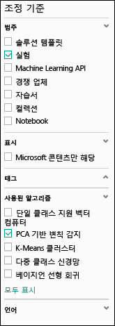
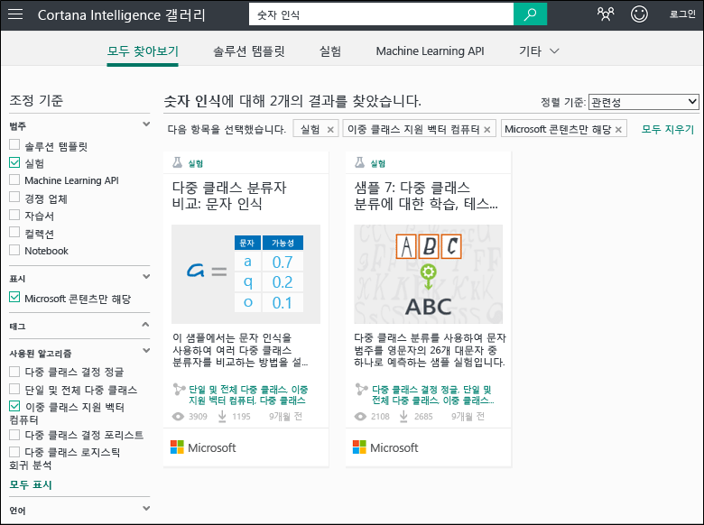
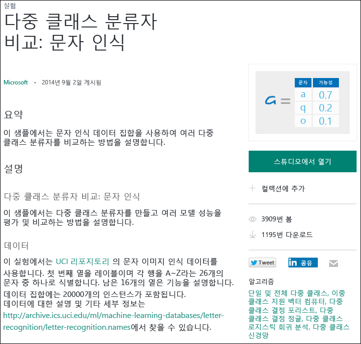

# 샘플 실험을 복사하여 새로운 기계 학습 실험 만들기
처음부터 기계 학습 실험을 새로 만드는 대신 [Cortana Intelligence Gallery](http://gallery.cortanaintelligence.com/)에서 샘플 실험을 시작하는 방법을 알아봅니다. 샘플을 사용하여 기계 학습 솔루션을 직접 빌드할 수 있습니다.

갤러리에는 기계 학습 커뮤니티에서 공유하는 샘플뿐만 아니라 Microsoft Azure 기계 학습 팀의 샘플 실험도 있습니다. 실험에 대한 질문을 하거나 의견을 게시할 수도 있습니다.

갤러리를 사용하는 방법에 대해 알아보려면 [초보자를 위한 데이터 과학](machine-learning-data-science-for-beginners-the-5-questions-data-science-answers.md) 시리즈의 3분짜리 비디오 [데이터 과학을 수행하기 위해 다른 사람의 작품 복사](machine-learning-data-science-for-beginners-copy-other-peoples-work-to-do-data-science.md)를 참조하세요.

[!INCLUDE [machine-learning-free-trial](../../includes/machine-learning-free-trial.md)]

## 실험을 찾아 Cortana Intelligence Gallery에 복사
사용할 수 있는 실험을 보려면 [갤러리](http://gallery.cortanaintelligence.com/)로 이동하여 페이지의 위쪽에 있는 **실험**을 클릭합니다.

### 최신 또는 가장 인기 있는 실험 찾기
이 페이지에서 **최근에 추가된** 실험을 확인하고 아래로 스크롤하여**인기 항목** 또는 최신 **인기 있는 Microsoft 실험**을 볼 수 있습니다.

### 특정 요구 사항을 충족하는 실험 찾기
모든 실험을 찾아보려면:

1. 페이지 위쪽에 있는 **모두 찾아보기**를 클릭합니다.
2. **구체화 기준**에서 **실험**을 선택하여 갤러리에 있는 모든 실험을 볼 수 있습니다.
3. 두 가지 방법으로 요구 사항을 충족하는 실험을 찾을 수 있습니다.
   * **왼쪽에 필터를 선택합니다.** 예를 들어 PCA 기반 이상 감지 알고리즘을 사용하는 실험을 찾아보려면 **범주**에서 **실험**을 선택하고 **사용된 알고리즘**에서 **PCA 기반 이상 감지**를 선택합니다. (해당 알고리즘이 보이지 않으면 목록 맨 아래에 있는 **모두 표시**를 클릭합니다).   
   * **검색 상자를 사용합니다.** 예를 들어 제공하는 두 개의 클래스 지원 벡터 컴퓨터 알고리즘을 사용하는 숫자 인식과 관련된 Microsoft의 실험을 찾으려면 검색 상자에 "숫자 인식"을 입력합니다. 그런 다음 **실험**, **Microsoft 콘텐츠만** 및 **2클래스 Support Vector Machine**을 선택합니다. 
4. 실험을 클릭하여 자세히 알아봅니다.
5. 실험을 실행 및/또는 수정하려면 실험 페이지에서 **Studio에서 열기**를 클릭합니다.
   
   > [!NOTE]
   > 기계 학습 스튜디오에서 실험을 열려면 Microsoft 계정 자격 증명을 사용하여 로그인해야 합니다. 아직 기계 학습 작업 영역이 없는 경우 무료 평가판 작업 영역이 만들어집니다. [기계 학습 무료 평가판에 포함된 항목 알아보기](https://azure.microsoft.com/pricing/details/machine-learning/)
   > 
   > 
   
    

## 기계 학습 스튜디오에서 템플릿 사용
갤러리의 샘플을 템플릿으로 사용하여 기계 학습 스튜디오에서 새 실험을 만들 수도 있습니다.

1. Microsoft 계정 자격 증명을 사용하여 [Studio](https://studio.azureml.net)에 로그인한 다음 **새로 만들기**를 클릭하여 새 실험을 만듭니다.
2. 샘플 콘텐츠를 열고 하나를 클릭합니다.

샘플 실험을 템플릿으로 사용하여 작업 영역에서 새 실험을 만듭니다.

## 다음 단계
* [데이터 준비](machine-learning-data-science-import-data.md)
* [실험에서 R 사용 시도](machine-learning-r-quickstart.md)
* [샘플 R 실험 검토](machine-learning-r-csharp-web-service-examples.md)
* [웹 서비스 API 만들기](machine-learning-publish-a-machine-learning-web-service.md)
* [바로 사용할 수 있는 응용 프로그램 찾아보기](https://datamarket.azure.com/browse?query=machine+learning)

<!---HONumber=AcomDC_0914_2016-->