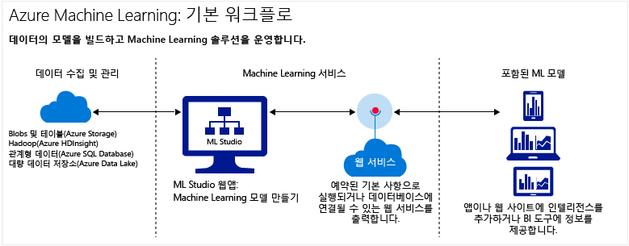

# 클라우드의 Azure Machine Learning 소개
## 기계 학습이란 무엇인가요?
기계 학습은 미래 동작, 결과 및 추세를 예측하기 위해 기존 데이터를 컴퓨터가 학습하도록 돕는 데이터 과학 기법입니다.  

이러한 기계 학습을 통한 예측은 좀 더 똑똑한 앱 및 장치를 만드는 데 도움이 됩니다. 온라인 쇼핑 시 기계 학습은 사용자가 구매한 제품에 따라 좋아할만한 다른 제품을 추천하는 데 도움이 됩니다. 신용 카드를 읽을 때 기계 학습은 해당 거래를 거래 데이터베이스와 비교하여 부정 행위를 검색하는 데 도움을 줍니다. 로봇 진공 청소기가 방을 청소할 때, 기계 학습은 작업이 완료되었는지 여부를 판단하도록 해줍니다.

간략한 개요는 비디오 시리즈 [초급자를 위한 데이터 과학](machine-learning-data-science-for-beginners-the-5-questions-data-science-answers.md)을 참조하세요. 초보자를 위한 데이터 과학은 전문 용어 또는 수치를 사용하지 않고 기계 학습을 소개하며 간단한 예측 모델 과정도 안내합니다.

## Microsoft Azure 클라우드의 기계 학습이란 무엇인가요?
Azure Machine Learning은 예측 모델을 신속하게 만들고 분석 솔루션으로 배포할 수 있게 해주는 클라우드 예측 분석 서비스입니다.

즉시 사용 가능한 알고리즘 라이브러리에서 작업을 시작하고 이를 통해 인터넷 연결 PC에서 모델을 만들어 예측 솔루션에 신속히 배포할 수 있습니다. [Cortana Intelligence Gallery](https://gallery.cortanaintelligence.com/)에서 즉시 사용 예제와 솔루션을 시작합니다.

Azure 기계 학습은 예측 분석을 모델링 하는 도구를 제공할 뿐 아니라 예측 모델을 사용할 준비가 된 웹 서비스로 배포하는 데 사용할 수 있는 완전한 관리 서비스도 제공합니다.

## 예측 분석이란?
예측 분석은 알고리즘이라는 수학 공식을 사용하여 패턴 또는 추세 파악을 통한 미래의 이벤트 예측을 위해 기록 또는 현재 데이터를 분석합니다.

## 클라우드에서 완전한 Machine Learning 솔루션 작성을 위한 도구
Azure Machine Learning에는 대규모 알고리즘 라이브러리부터 모델 작성을 위한 스튜디오, 모델을 웹 서비스로 배포하는 쉬운 방법에 이르기까지 클라우드에서 종합적인 예측 분석 솔루션을 만드는 데 필요한 모든 것이 있습니다. 예측 모델을 신속하게 만들고, 테스트하고, 운영하며, 관리합니다.

### 기계 학습 스튜디오: 예측 모델 만들기
[기계 학습 스튜디오](machine-learning-what-is-ml-studio.md)에서 모듈을 끌어다 놓아 연결함으로써 예측 모델을 신속하게 만들 수 있습니다. 여러 조합으로 실험할 수 있으며 [무료로 사용할 수 있습니다](https://studio.azureml.net/?selectAccess=true&o=2).

* [Cortana Intelligence Gallery](machine-learning-gallery-how-to-use-contribute-publish.md)에서 다른 사용자가 작성한 분석 솔루션을 사용해보거나 직접 해볼 수 있습니다. 커뮤니티에 실험에 대한 질문 또는 의견을 게시하거나 LinkedIn 및 Twitter와 같은 소셜 네트워크를 통해 실험 링크를 공유합니다.

  
* 기계 학습 스튜디오의 대규모 [기계 학습 알고리즘 및 모듈](https://msdn.microsoft.com/library/azure/f5c746fd-dcea-4929-ba50-2a79c4c067d7) 라이브러리를 사용하여 예측 모델을 빠르게 시작할 수 있습니다. 샘플 실험, R 및 Python 패키지 그리고 Xbox 및 Bing와 같은 Microsoft 비즈니스의 최상급 알고리즘 중에서 선택합니다. 사용자 고유의 사용자 지정 [R](machine-learning-extend-your-experiment-with-r.md) 및 [Python](machine-learning-execute-python-scripts.md) 스크립트를 사용하여 Studio 모듈을 확장합니다.

  

### 직접 게시하여 예측 분석 솔루션 운영
다음 자습서에서는 예측 분석 모델을 운영하는 방법을 보여 줍니다.

 * [웹 서비스 배포](machine-learning-publish-a-machine-learning-web-service.md)
 * [API를 통해 다시 학습](machine-learning-retrain-models-programmatically.md)
 * [웹 서비스 끝점 관리](machine-learning-create-endpoint.md)
 * [웹 서비스 크기 조정](machine-learning-scaling-webservice.md)
 * [웹 서비스 사용](machine-learning-consume-web-services.md)

## 주요 기계 학습 용어 및 개념
기계 학습 용어는 혼동될 수 있습니다. 주요 용어의 정의는 다음과 같습니다. 정의하려는 다른 용어에 대해 언급하려면 다음 설명을 사용합니다.

### 데이터 탐색, 설명이 포함된 분석 및 예측 분석

**데이터 탐색** 은 집중 분석을 위한 특성을 찾기 위해 규모가 크고 구조화되지 않은 데이터 집합에 대한 정보를 수집하는 프로세스입니다.

**데이터 마이닝** 은 자동화된 데이터 탐색을 나타냅니다.

**설명이 포함된 분석** 은 발생한 현상을 요약하기 위해 데이터 집합을 분석하는 프로세스입니다. 대부분의 비즈니스 분석(예: 판매 보고서, 웹 메트릭 및 소셜 네트워크 분석)은 설명을 포함합니다.

**예측 분석** 은 미래 결과를 예측하기 위해 기록 데이터 또는 현재 데이터에서 모델을 작성하는 프로세스입니다.

### 감독 학습 및 자율 학습
 **감독 학습** 알고리즘은 레이블이 지정된 데이터, 즉 원하는 응답 예제로 구성된 데이터로 학습됩니다. 예를 들어 사기성 신용 카드 사용을 식별하는 모델은 알려진 사기와 유효한 요금의 레이블된 데이터 요소가 있는 데이터 집합에서 학습됩니다. 대부분의 기계 학습은 감독 학습입니다.

 **자율 학습** 이 사용되며 그 목표는 데이터에서 관계를 찾아내는 것입니다. 예를 들어 비슷한 구매 습관을 갖는 고객 인구 통계 그룹을 찾으려고 할 수 있습니다.

### 모델 학습 및 평가
기계 학습 모델은 대답하려는 질문이나 예측하려는 결과를 추상화한 것입니다. 모델은 기존 데이터에서 학습되고 평가됩니다.

#### 학습 데이터
데이터에서 모델을 학습하는 경우 가장 정확한 답을 얻기 위해 알려진 데이터 집합을 사용하고 데이터 특성을 기반으로 한 모델에 맞게 조정합니다. Azure 기계 학습에서는 학습 데이터 및 기능 모듈(예: 점수 매기기 모듈)을 처리하는 알고리즘 모듈에서 모델이 작성됩니다.

감독 학습에서 부정 행위 감지 모델을 학습하는 경우 사기 또는 유효한 것으로 레이블이 지정된 트랜잭션 집합을 사용하게 됩니다. 데이터 집합을 임의로 분할한 후 일부를 사용하여 모델을 학습하고, 일부를 사용하여 모델을 테스트하거나 평가합니다.

#### 평가 데이터
학습된 모델이 있는 경우 나머지 테스트 데이터를 사용하여 모델을 평가합니다. 결과를 이미 알고 있는 데이터를 사용하여 모델이 정확하게 예측하는지 여부를 알 수 있습니다.

## 기타 일반적인 기계 학습 용어
* **알고리즘**: 데이터 처리, 계산 및 자동 추론을 통해 문제를 해결하는 데 사용되는 완전한 규칙 집합입니다.
* **이상 감지**: 비정상적인 이벤트 또는 값에 플래그를 지정하고 문제를 검색하도록 해주는 모델입니다. 예를 들어, 신용 카드 부정 행위 감지의 경우 비정상적인 구매를 찾습니다.
* **범주 데이터**: 범주별로 구성되고 그룹으로 나눌 수 있는 데이터입니다. 예를 들어 자동차에 대한 범주 데이터 집합은 연식, 제조업체, 모델 및 가격을 지정할 수 있습니다.
* **분류**: 범주 그룹화가 이미 알려진 데이터 집합을 기반으로 데이터 요소를 범주로 구성하는 모델입니다.
* **기능 엔지니어링**: 데이터 집합을 향상시키고 결과를 개선하기 위해 데이터 집합과 관련된 기능을 추출하거나 선택하는 프로세스입니다. 예를 들어 항공 요금 데이터를 요일 및 휴일에 따라 늘릴 수 있습니다. [Azure 기계 학습의 기능 선택 및 엔지니어링](machine-learning-feature-selection-and-engineering.md)을 참조하세요.
* **모듈**: 소규모 데이터 집합을 입력 및 편집할 수 있도록 하는 데이터 입력 모듈과 같은 기계 학습 스튜디오 모델의 기능 부분입니다. 알고리즘 또한 기계 학습 스튜디오의 모듈 유형에 해당합니다.
* **모델**: 감독 학습의 경우, 모델은 학습 데이터, 알고리즘 모듈 및 기능 모듈(예: 모델 점수 매기기 모듈)로 구성된 기계 학습 실험 제품입니다.
* **숫자 데이터**: 측정(연속 데이터) 또는 개수(불연속 데이터)의 의미를 갖는 데이터입니다. *양적 데이터*라고도 합니다.
* **파티션**: 데이터를 샘플로 구분하는 방법입니다. 자세한 내용은 [파티션 및 샘플](https://msdn.microsoft.com/library/azure/dn905960.aspx) 을 참조하세요.
* **예측**: 예측은 기계 학습 모델에서 값을 예측하는 것입니다. "예측된 점수" 용어도 볼 수 있습니다. 그러나 예측된 점수는 모델의 최종 출력이 아닙니다. 모델에 대한 평가 점수는 다음과 같습니다.
* **회귀**: 연식 및 제조업체에 따라 자동차 가격을 예측하는 것처럼 독립 변수를 기반으로 값을 예측하는 모델입니다.
* **점수**: 기계 학습 스튜디오의 [모델 점수 매기기 모듈](https://msdn.microsoft.com/library/azure/dn905995.aspx) 을 사용하여 학습된 분류 또는 회귀 모델에서 생성하는 예측된 값입니다. 또한 분류 모델은 예측된 값의 확률 점수도 반환합니다. 모델에서 점수를 생성한 후 [모델 평가 모듈](https://msdn.microsoft.com/library/azure/dn905915.aspx)을 사용하여 모델의 정확도를 평가할 수 있습니다.
* **샘플**: 전체를 대표하는 데이터 집합의 부분입니다. 샘플을 임의로 선택하거나 데이터 집합의 특정 기능에 따라 선택할 수 있습니다.

## 다음 단계
[단계별 자습서](machine-learning-create-experiment.md) 및 [샘플을 기반으로 빌드](machine-learning-sample-experiments.md)하여 예측 분석 및 기계 학습의 기본 사항을 알아볼 수 있습니다.  

<!-- Module References -->
[learning-with-counts]: https://msdn.microsoft.com/library/azure/81c457af-f5c0-4b2d-922c-fdef2274413c/

