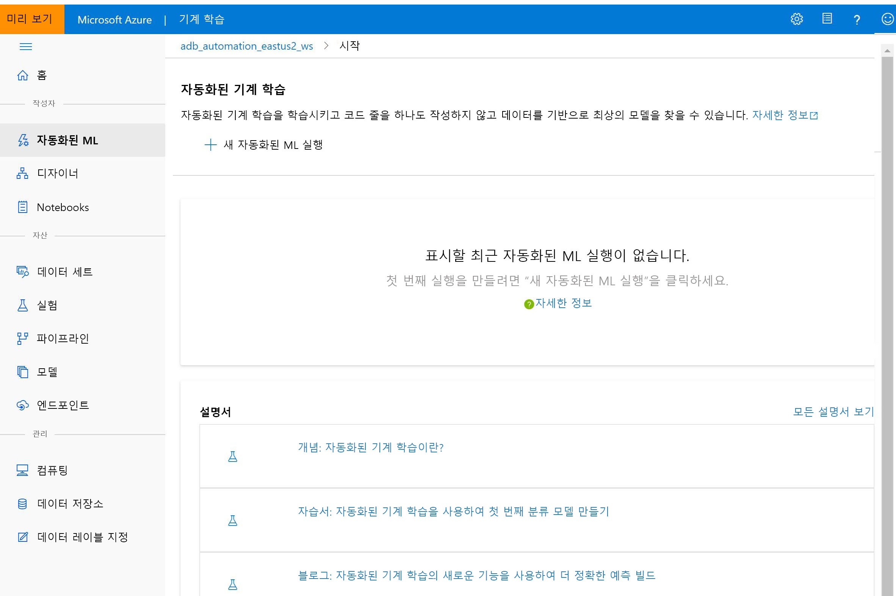

# Azure Machine Learning이란?

이 문서에서는 ML 모델의 학습, 배포, 자동화, 관리 및 추적에 사용할 수 있는 클라우드 기반 환경인 Azure Machine Learning에 대해 알아봅니다. 

Azure Machine Learning은 전통적인 기계 학습부터 딥 러닝, 감독 학습 및 자율 학습에 이르는 모든 종류의 기계 학습에 사용할 수 있습니다. Python 또는 R 코드를 작성하려 하든, 아니면 [디자이너](tutorial-designer-automobile-price-train-score.md)와 같은 코드를 사용하지 않거나 최소한의 코드만 사용하는 옵션을 사용하든, Azure Machine Learning 작업 영역에서 매우 정확한 기계 학습 및 딥 러닝 모델의 빌드, 학습 및 추적을 수행할 수 있습니다. 

로컬 머신에서 학습을 시작한 다음, 클라우드로 확장할 수 있습니다. 

또한 이 서비스는 PyTorch, TensorFlow, scikit-learn 등과 같은 유명한 오픈 소스 도구와 상호 운용됩니다.

> [!VIDEO https://channel9.msdn.com/Events/Connect/Microsoft-Connect--2018/D240/player]

> [!Tip]
> **평가판!**  Azure 구독이 없는 경우 시작하기 전에 체험 계정을 만듭니다. 지금 [Azure Machine Learning 평가판 또는 유료 버전](https://aka.ms/AMLFree)을 사용해 보세요. Azure 서비스에서 사용 가능한 크레딧을 제공합니다. 크레딧이 소진되더라도 계정이 유지되므로 [무료 Azure 서비스](https://azure.microsoft.com/free/)를 계속 사용할 수 있습니다. 설정을 명시적으로 변경하여 결제를 요청하지 않는 한 신용 카드로 결제되지 않습니다.

## 머신 러닝이란 무엇인가요?

머신 러닝은 컴퓨터에서 기존 데이터를 사용하여 미래 동작, 결과 및 추세를 예측하는 데이터 과학 기술입니다. 머신 러닝을 사용하면 컴퓨터에서 명시적으로 프로그래밍하지 않고 학습합니다.

Machine Learning을 통한 예측은 좀 더 똑똑한 앱 및 디바이스를 만드는 데 도움이 됩니다. 온라인 쇼핑을 예로 들면, 머신 러닝은 사용자가 구매한 제품에 따라 좋아할 만한 다른 제품을 추천하는 데 도움이 됩니다. 또는 신용 카드를 읽을 때 머신 러닝은 해당 거래를 거래 데이터베이스와 비교하여 부정 행위를 검색하는 데 도움을 줍니다. 또한 로봇 진공 청소기가 방을 청소할 때, 머신 러닝은 작업이 완료되었는지 여부를 판단하도록 해줍니다.

## 각 작업에 적합한 기계 학습 도구 

Azure Machine Learning은 개발자와 데이터 과학자에게 다음을 비롯한 기계 학습 워크플로에 필요한 모든 도구를 제공합니다.
+ [Azure Machine Learning 디자이너](tutorial-designer-automobile-price-train-score.md)(미리 보기): 끌어서 놓기로 실험을 빌드하고 파이프라인을 배포할 수 있는 모듈입니다.

+ Jupyter Notebook: [예제 Notebook](https://aka.ms/aml-notebooks)을 사용하거나 고유한 Notebook을 만들어 기계 학습에서 <a href="https://docs.microsoft.com/python/api/overview/azure/ml/intro?view=azure-ml-py" target="_blank">Python용 Azure SDK</a> 샘플을 활용할 수 있습니다. 

+ <a href="https://azure.github.io/azureml-sdk-for-r/reference/index.html" target="_blank">R용 SDK</a>를 사용하여 고유한 코드를 작성하는 R 스크립트 또는 Notebook이나 디자이너에서 사용하는 R 모듈

+ [Visual Studio Code 확장](how-to-vscode-tools.md)

+ [기계 학습 CLI](reference-azure-machine-learning-cli.md)

+ PyTorch, TensorFlow, scikit-learn 등과 같은 많은 오픈 소스 프레임워크

[MLflow를 사용하여 메트릭을 추적](how-to-use-mlflow.md)하거나 Kubeflow를 사용하여 [엔드투엔드 워크플로 파이프라인을 빌드](https://www.kubeflow.org/docs/azure/)할 수도 있습니다.

## Python 또는 R에서 ML 모델 빌드

Azure Machine Learning <a href="https://docs.microsoft.com/python/api/overview/azure/ml/intro?view=azure-ml-py" target="_blank">Python SDK</a> 또는 <a href="https://azure.github.io/azureml-sdk-for-r/reference/index.html" target="_blank">R SDK</a>를 사용하여 로컬 머신에서 학습을 시작한 다음, 클라우드로 확장할 수 있습니다. 

Azure Machine Learning 컴퓨팅 및 [Azure Databricks](/azure/azure-databricks/what-is-azure-databricks)와 같이 사용할 수 있는 여러 [컴퓨팅 대상](how-to-set-up-training-targets.md)과 [고급 하이퍼 매개 변수 튜닝 서비스](how-to-tune-hyperparameters.md)를 통해 클라우드의 강력한 기능을 사용하여 더 나은 모델을 더 빠르게 빌드할 수 있습니다.

SDK를 사용하여 [모델 학습 및 튜닝을 자동화](tutorial-auto-train-models.md)할 수도 있습니다.

## 코드를 작성할 필요가 없는 도구를 사용하여 ML 모델 빌드

코드를 작성할 필요가 전혀 또는 거의 없는 학습 및 배포를 위해 다음 도구를 사용해 보세요.

+ **Azure Machine Learning 디자이너(미리 보기)**

  이 디자이너를 사용하면 코드를 전혀 작성하지 않고도 기계 학습 모델의 데이터 준비, 교육, 테스트, 배포, 관리 및 추적을 수행할 수 있습니다. 프로그래밍이 필요하지 않으며, 데이터 세트와 모듈을 시각적으로 연결하여 모델을 구성할 수 있습니다. [디자이너 자습서](tutorial-designer-automobile-price-train-score.md)를 사용해 보세요.

  [Azure Machine Learning 디자이너 개요 문서](concept-designer.md)에서 자세히 알아보세요. 

  

+ **자동화된 기계 학습 UI**

  사용하기 쉬운 인터페이스에서 [자동화된 ML 실험](tutorial-first-experiment-automated-ml.md)을 만드는 방법을 알아보세요. 

  

## MLOps: 배포 및 수명 주기 관리
적합한 모델이 있는 경우 웹 서비스, IoT 디바이스 또는 Power BI에서 해당 모델을 쉽게 사용할 수 있습니다. 자세한 내용은 [배포 방법 및 위치](how-to-deploy-and-where.md) 문서를 참조하세요.

그런 다음, [Python용 Azure Machine Learning SDK](https://aka.ms/aml-sdk), [Azure Machine Learning Studio](https://ml.azure.com) 또는 [기계 학습 CLI](reference-azure-machine-learning-cli.md)를 사용하여 배포된 모델을 관리할 수 있습니다.

이러한 모델은 사용 가능하며 대량의 데이터에 대한 예측을 [실시간으로](how-to-consume-web-service.md) 또는 [비동기적으로](how-to-run-batch-predictions.md) 반환할 수 있습니다.

또한 고급 [기계 학습 파이프라인](concept-ml-pipelines.md)을 사용하여 데이터 준비부터 모델 학습, 평가 및 배포까지 각 단계에서 공동 작업을 수행할 수 있습니다. 파이프라인을 통해 다음을 수행할 수 있습니다.

* 클라우드에서 엔드투엔드 기계 학습 프로세스 자동화
* 구성 요소를 다시 사용하고 필요한 경우에만 단계를 다시 실행
* 각 단계에서 다른 컴퓨팅 리소스 사용
* 일괄 처리 점수 매기기 작업 실행

스크립트를 사용하여 기계 학습 워크플로를 자동화하려는 경우 [기계 학습 CLI](reference-azure-machine-learning-cli.md)가 제공하는 명령줄 도구를 사용하여 학습 실행 제출이나 모델 배포와 같은 일반적인 작업을 수행할 수 있습니다.

Azure Machine Learning을 시작하려면 [다음 단계](#next-steps)를 참조하세요.

## 다른 서비스와 통합

Azure Machine Learning은 Azure 플랫폼의 다른 서비스와 함께 작동하며, Git 및 MLFlow 같은 오픈 소스 도구와 통합됩니다.

+ __Azure Kubernetes Service__, __Azure Container Instances__, __Azure Databricks__, __Azure Data Lake Analytics__, __Azure HDInsight__ 등의 컴퓨팅 대상. 컴퓨팅 대상에 대한 자세한 내용은 [컴퓨팅 대상이란?](concept-compute-target.md)을 참조하세요.
+ __Azure Event Grid__. 자세한 내용은 [Azure Machine Learning 이벤트 사용](concept-event-grid-integration.md)을 참조하세요.
+ __Azure Monitor__ 자세한 내용은 [Azure Machine Learning 모니터링](monitor-azure-machine-learning.md)을 참조하세요.
+ __Azure Storage 계정__, __Azure Data Lake Storage__, __Azure SQL Database__, __Azure Database for PostgreSQL__, __Azure Open Datasets__ 등의 데이터 저장소. 자세한 내용은 [Azure 스토리지 서비스에서 데이터 액세스](how-to-access-data.md) 및 [Azure Open Datasets로 데이터 세트 만들기](how-to-create-register-datasets.md#create-datasets-with-azure-open-datasets)를 참조하세요.
+ __Azure Virtual Network__. 자세한 내용은 [가상 네트워크에서 실험 및 유추 보호](how-to-enable-virtual-network.md)를 참조하세요.
+ __Azure Pipelines__. 자세한 내용은 [기계 학습 모델의 학습 및 배포](/azure/devops/pipelines/targets/azure-machine-learning)를 참조하세요.
+ __Git 리포지토리 로그__. 자세한 내용은 [Git 통합](concept-train-model-git-integration.md)을 참조하세요.
+ __MLFlow__. 자세한 내용은 [MLflow를 사용하여 메트릭을 추적하고 모델 배포](how-to-use-mlflow.md)를 참조하세요. 
+ __Kubeflow__. 자세한 내용은 [엔드투엔드 워크플로 파이프라인 빌드](https://www.kubeflow.org/docs/azure/)를 참조하세요.

### 통신 보안

Azure Storage 계정, 컴퓨팅 대상 및 기타 리소스를 가상 네트워크 내에서 안전하게 사용하여 모델을 학습시키고 유추를 수행할 수 있습니다. 자세한 내용은 [가상 네트워크에서 실험 및 유추 보호](how-to-enable-virtual-network.md)를 참조하세요.

## Basic Edition 및 Enterprise Edition

Azure Machine Learning은 고객의 기계 학습 요구 사항에 맞게 조정된 두 가지 버전을 제공합니다.
+ Basic(일반 공급)
+ Enterprise(미리 보기)

버전에 따라 개발자 및 데이터 과학자가 작업 영역에서 사용할 수 있는 기계 학습 도구가 달라집니다.   

Basic 작업 영역에서는 Azure Machine Learning을 계속 사용할 수 있으며 기계 학습 프로세스 중에 사용된 Azure 리소스에 대한 요금만 지불하면 됩니다. Enterprise Edition은 아직 미리 보기 상태이기 때문에 해당 작업 영역에는 Azure 사용량에 대한 요금만 청구됩니다. Azure Machine Learning [Edition 개요 및 가격 책정 페이지](https://azure.microsoft.com/pricing/details/machine-learning/)에서 사용할 수 있는 기능에 대해 자세히 알아보세요. 

Edition은 작업 영역을 만들 때마다 할당합니다. 또한 기존 작업 영역은 자동으로 Basic Edition으로 변환되었습니다. Basic Edition에는 2019년 10월 기준으로 이미 일반 공급된 모든 기능이 포함됩니다. Enterprise Edition 기능을 사용하여 빌드된 작업 영역의 모든 실험은 Enterprise Edition으로 업그레이드할 때까지 읽기 전용 상태로 계속 공급됩니다. [Basic 작업 영역을 Enterprise Edition으로 업그레이드](how-to-manage-workspace.md#upgrade)하는 방법에 대해 알아보세요. 

고객은 이 기간 동안 컴퓨팅 및 기타 Azure 리소스에서 발생하는 비용을 지불해야 합니다.

## 다음 단계

- 선호하는 방법으로 첫 번째 실험을 만드세요.
  + [Python Notebook을 사용하여 ML 모델 학습 및 배포](tutorial-1st-experiment-sdk-setup.md)
  + [R Markdown을 사용하여 ML 모델을 학습 및 배포](tutorial-1st-r-experiment.md) 
  + [자동화된 기계 학습을 사용하여 ML 모델 학습 및 배포](tutorial-first-experiment-automated-ml.md) 
  + [디자이너의 끌어서 놓기 기능을 사용하여 학습 및 배포](tutorial-designer-automobile-price-train-score.md) 
  + [기계 학습 CLI를 사용하여 모델 학습 및 배포](tutorial-train-deploy-model-cli.md)

- 머신 러닝 시나리오를 작성, 최적화 및 관리하는 [머신 러닝 파이프라인](concept-ml-pipelines.md)에 대해 알아보세요.

- 심층적인 [Azure Machine Learning 아키텍처 및 개념](concept-azure-machine-learning-architecture.md) 문서를 참조하세요.
