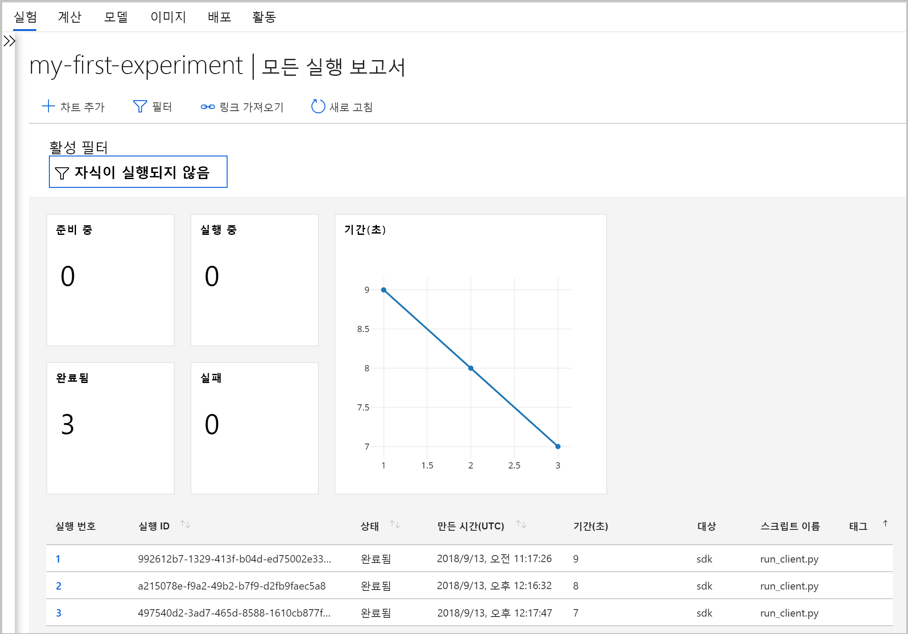
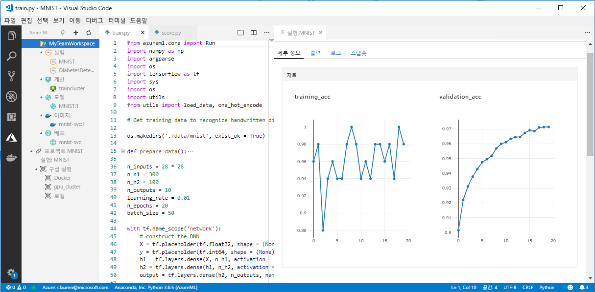

# <a name="what-happened-to-azure-machine-learning-workbench"></a>Azure Machine Learning Workbench는 어떻게 되었나요?

Azure Machine Learning Workbench 애플리케이션과 일부 초기 기능은 [아키텍처](concept-azure-machine-learning-architecture.md) 향상을 위해 2018년 9월 릴리스부터 더 이상 사용되지 않고 다른 기능으로 대체되었습니다. 

환경을 향상시키기 위해 릴리스에는 고객 피드백을 반영한 중요 업데이트가 포함되어 있습니다. 실험 실행에서 모델 배포에 이르기까지 핵심 기능은 변경되지 않았습니다. 그러나 이제 강력한 <a href="https://aka.ms/aml-sdk" target="_blank">SDK</a> 및 [Azure CLI](reference-azure-machine-learning-cli.md)를 사용하여 시스템 학습 작업과 파이프라인을 수행할 수 있습니다.  

이전 버전의 Azure Machine Learning Service에서 만든 대부분의 아티팩트는 사용자 고유의 로컬 또는 클라우드 스토리지에 저장됩니다. 이러한 아티팩트는 그대로 유지됩니다.

이 문서에서는 Azure Machine Learning Workbench 및 해당 API의 변경 내용과 기존 작업에 미친 영향에 대해 알아보겠습니다.

>[!Warning]
>Azure Machine Learning Studio 사용자는 이 문서의 정보를 참조하면 안 됩니다. 이 문서에서는 Workbench(미리 보기) 애플리케이션을 설치했거나 실험 및 모델 관리 미리 보기 계정이 있는 Azure Machine Learning 서비스 고객을 위한 정보를 제공합니다.


## <a name="what-changed"></a>변경 내용

Azure Machine Learning Service의 최신 릴리스에 포함된 기능은 다음과 같습니다.
+ [간소화된 Azure 리소스 모델](concept-azure-machine-learning-architecture.md)
+ 실험 및 컴퓨팅 대상을 관리할 수 있는 [새 포털 UI](how-to-track-experiments.md)
+ 더 포괄적인 새 Python <a href="https://aka.ms/aml-sdk" target="_blank">SDK</a>
+ 확장된 새 기계 학습용 [Azure CLI 확장](reference-azure-machine-learning-cli.md)

[아키텍처](concept-azure-machine-learning-architecture.md)는 사용 편의성을 고려하여 다시 설계되었습니다. 여러 Azure 리소스 및 계정 대신 [Azure Machine Learning Service 작업 영역](concept-azure-machine-learning-architecture.md#workspace)만 있으면 됩니다. [Azure Portal]에서 신속하게 작업 영역을 만들 수 있습니다(setup-create-workspace.md#portal). 작업 영역을 사용하면 여러 사용자가 학습 및 배포 컴퓨팅 대상, 모델 실험, Docker 이미지, 배포된 모델 등을 저장할 수 있습니다.

최신 릴리스에는 향상된 새 CLI와 SDK 클라이언트가 포함되어 있지만, 데스크톱 Workbench 애플리케이션 자체는 더 이상 사용되지 않습니다. 실험은 [Azure Portal의 작업 영역 대시보드](how-to-track-experiments.md#view-the-experiment-in-the-azure-portal)에서 관리할 수 있습니다. 대시보드를 사용하여 실험 기록을 가져오고, 작업 영역에 연결된 계산 대상을 관리하고, 모델 및 Docker 이미지를 관리하고, 심지어 웹 서비스를 배포할 수 있습니다.

<a name="timeline"></a>

## <a name="support-timeline"></a>지원 타임라인

2019년 1월 9일자로 Machine Learning Workbench, Azure Machine Learning 실험 및 모델 관리 계정, 연결된 SDK 및 CLI에 대한 지원이 종료됩니다. 

모든 최신 기능은 이 <a href="https://aka.ms/aml-sdk" target="_blank">SDK</a>, [CLI](reference-azure-machine-learning-cli.md) 및 [포털](setup-create-workspace.md#portal)을 통해 사용할 수 있습니다.

## <a name="what-about-run-histories"></a>실행 기록은 어떻게 되나요?

이전 실행 기록에 더 이상 액세스할 수 없지만, 여전히 최신 버전에서 실행을 볼 수 있습니다. 

이제는 실행 기록을 **실험**이라고 부릅니다. SDK, CLI 또는 Azure Portal을 사용하여 모델의 실험을 수집하고 검색할 수 있습니다.

포털의 작업 영역 대시보드는 Microsoft Edge, Chrome 및 Firefox 브라우저에서만 지원됩니다.

[](./media/overview-what-happened-to-workbench/image001.png#lightbox)

새 CLI 및 SDK를 사용하여 모델 학습 및 실행 기록 추적을 시작하세요. 해당 방법은 [자습서: Azure Machine Learning 서비스를 사용하여 모델 학습시키기](tutorial-train-models-with-aml.md)에서 확인할 수 있습니다.

## <a name="can-i-still-prep-data"></a>여전히 데이터를 준비할 수 있나요?

더 이상 Machine Learning Workbench를 사용할 수 없으므로 기존의 데이터 준비 파일은 최신 릴리스로 이식할 수 없습니다. 하지만 여전히 모델링할 데이터 세트를 원하는 크기로 준비할 수 있습니다.   

모든 크기의 데이터 세트에서 Python 코드를 작성하여 모델링하기 전에 빠르게 데이터를 준비하기 위해 [Azure Machine Learning Data Prep SDK](https://aka.ms/data-prep-sdk)를 사용할 수 있습니다. 

Azure Machine Learning 데이터 준비 SDK를 사용하는 방법에 대한 자세한 내용은 [이 자습서](tutorial-data-prep.md)를 참조하세요.

## <a name="will-projects-persist"></a>프로젝트는 유지되나요?

코드 또는 작업은 사라지지 않습니다. 이전 버전에서는 프로젝트가 로컬 디렉터리를 사용하는 클라우드 엔터티입니다. 최신 버전에서는 로컬 구성 파일을 사용하여 Azure Machine Learning Service 작업 영역에 로컬 디렉터리를 연결합니다. [최신 아키텍처의 다이어그램](concept-azure-machine-learning-architecture.md)을 참조하세요.

대부분의 프로젝트 콘텐츠는 이미 로컬 머신에에 있습니다. 따라서 해당 디렉터리에 구성 파일을 만들고 코드에서 참조하여 작업 영역에 연결하기만 하면 됩니다. 파일과 스크립트가 포함된 로컬 디렉터리를 계속 사용하려면 ['experiment.submit'](https://docs.microsoft.com/python/api/azureml-core/azureml.core.experiment.experiment?view=azure-ml-py) Python 명령에서 디렉터리 이름을 지정하거나 `az ml project attach` CLI 명령을 사용합니다.  예: 
```python
run = exp.submit(source_directory = script_folder, script = 'train.py', run_config = run_config_system_managed)
```

시작하려면 [작업 영역을 만듭니다](setup-create-workspace.md#portal).

## <a name="what-about-my-registered-models-and-images"></a>등록된 모델과 이미지는 어떻게 되나요?

이전 모델 레지스트리에 등록된 모델을 계속 사용하려면 새 작업 영역으로 마이그레이션해야 합니다. 모델을 마이그레이션하려면 모델을 다운로드하여 새 작업 영역에 다시 등록합니다. 

이전 이미지 레지스트리에 만든 이미지를 계속 사용하려면 새 작업 영역에서 다시 만들어야 합니다. 이러한 이미지는 [이미지 구성 및 만들기](how-to-deploy-and-where.md#configureimage) 섹션에 따라 다시 만들 수 있습니다. 

## <a name="what-about-deployed-web-services"></a>배포된 웹 서비스는 어떻게 되나요?

기존 CLI에 대한 지원이 종료되어 모델을 다시 배포하거나 모델 관리 계정을 사용하여 처음에 배포한 웹 서비스를 관리할 수 없습니다. 그러나 ACS(Azure Container Service)가 계속 지원된다면 이러한 웹 서비스는 계속 작동합니다.

최신 버전에서 모델은 ACI(Azure Container Instances) 또는 AKS(Azure Kubernetes Service) 클러스터에 웹 서비스로 배포됩니다. FPGA 및 Azure IoT Edge에 배포할 수도 있습니다. 

다음 문서에서 자세한 내용을 알아보세요.
+ [모델을 배포하는 위치 및 방법](how-to-deploy-and-where.md)
+ [자습서: Azure Machine Learning Service를 사용하여 모델 배포](tutorial-deploy-models-with-aml.md)

## <a name="what-about-the-old-sdk-and-cli"></a>이전 SDK 및 CLI는 어떻게 되나요?

예, 1월까지는 계속 작동합니다. 앞의 [타임라인](#timeline)을 참조하세요. 최신 SDK 또는 CLI를 사용하여 새 실험 및 모델을 만드는 것이 좋습니다.

최신 릴리스에서 새 Python SDK를 사용하면 모든 Python 환경에서 Azure Machine Learning Service와 상호 작용할 수 있습니다. 최신 <a href="https://aka.ms/aml-sdk" target="_blank">SDK</a>를 설치하는 방법을 알아보세요. 다양한 `az ml` 명령 세트로 업데이트된 [Azure Machine Learning CLI 확장](reference-azure-machine-learning-cli.md)을 사용하여 Azure Cloud Shell을 포함한 모든 명령줄 환경에서 서비스와 상호 작용할 수도 있습니다.

## <a name="what-about-visual-studio-code-tools-for-ai"></a>Visual Studio Code Tools for AI란?

이 최신 릴리스에서는 확장 이름이 Visual Studio Code용 Azure Machine Learning으로 변경되었으며 앞의 새 기능을 사용할 수 있도록 확장 및 개선되었습니다.

[](./media/overview-what-happened-to-workbench/vscode-big.png#lightbox)

## <a name="what-about-domain-packages"></a>도메인 패키지는 어떻게 되나요?

Computer Vision, Text Analytics 및 예측용 도메인 패키지는 최신 버전의 Azure Machine Learning에서 사용할 수 없습니다. 그러나 여전히 최신 Azure Machine Learning Python <a href="https://aka.ms/aml-sdk" target="_blank">SDK</a>를 사용하여 컴퓨터 비전, 텍스트 및 예측 모델을 빌드하고 학습할 수 있습니다. Computer Vision, Text Analytics 및 예측 패키지를 사용하여 빌드된 기존 모델을 마이그레이션하는 방법을 알아보려면 [AML-Packages@microsoft.com](mailto:AML-Packages@microsoft.com)에 문의하세요.

## <a name="next-steps"></a>다음 단계

[Azure Machine Learning Service에 대한 최신 아키텍처](concept-azure-machine-learning-architecture.md)에 대해 알아봅니다. 

서비스 개요는 [Azure Machine Learning 서비스란?](overview-what-is-azure-ml.md)을 읽어보세요.

스크립트를 실행하고 최신 버전의 Azure Machine Learning Service를 사용하여 스크립트 실행 기록을 살펴보는 방법을 보여주는 빠른 시작은 [Azure Machine Learning Service로 시작하기](quickstart-run-cloud-notebook.md)를 사용해보세요.

이 워크플로에 대해 더 자세히 알아보려면 Azure Machine Learning 서비스를 사용하여 모델을 학습시키고 배포하는 자세한 단계가 포함된 [전체 자습서](tutorial-train-models-with-aml.md)의 과정을 진행하세요. 
