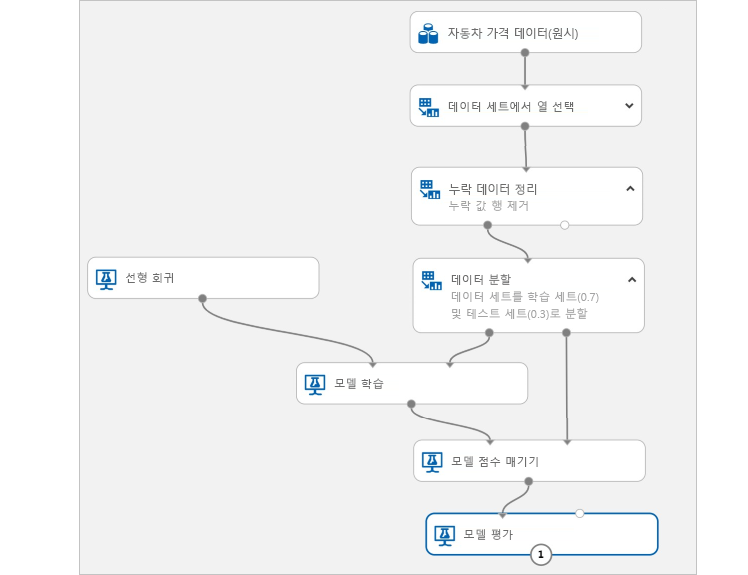

# Azure Machine Learning 서비스란?

Azure Machine Learning Service는 클라우드에서 제공하는 광범위한 모든 규모에서 머신 러닝(Machine Learning) 모델을 학습, 배포, 자동화 및 관리하는 데 사용할 수 있는 클라우드 서비스입니다.

## 머신 러닝이란 무엇인가요?

머신 러닝은 컴퓨터에서 기존 데이터를 사용하여 미래 동작, 결과 및 추세를 예측하는 데이터 과학 기술입니다. 머신 러닝을 사용하면 컴퓨터에서 명시적으로 프로그래밍하지 않고 학습합니다.

머신 러닝을 통한 예측은 좀 더 똑똑한 앱 및 디바이스를 만드는 데 도움이 됩니다. 온라인 쇼핑을 예로 들면, 머신 러닝은 사용자가 구매한 제품에 따라 좋아할 만한 다른 제품을 추천하는 데 도움이 됩니다. 또는 신용 카드를 읽을 때 머신 러닝은 해당 거래를 거래 데이터베이스와 비교하여 부정 행위를 검색하는 데 도움을 줍니다. 또한 로봇 진공 청소기가 방을 청소할 때, 머신 러닝은 작업이 완료되었는지 여부를 판단하도록 해줍니다.

## Azure Machine Learning 서비스란?

Azure Machine Learning Service는 머신 러닝 모델의 데이터 준비, 교육, 테스트, 배포, 관리 및 추적에 사용할 수 있는 클라우드 기반 환경을 제공합니다. 로컬 머신에서 학습을 시작한 다음, 클라우드로 확장할 수 있습니다. 이 서비스는 PyTorch, TensorFlow, scikit-learn 같은 오픈 소스 기술을 완벽하게 지원하며 클래식 ML부터 딥 러닝 및 자율 학습까지 모든 종류의 기계 학습에 사용할 수 있습니다. 

다음과 같은 다양한 도구를 사용하여 데이터를 탐색 및 준비하고, 모델을 학습 및 테스트하고, 모델을 배포하세요.
+ 모듈을 끌어서 놓아 실험을 빌드하고 모델을 배포할 수 있는 [시각적 인터페이스](ui-quickstart-run-experiment.md)
+ [SDK](https://docs.microsoft.com/azure/machine-learning/service/#reference)를 사용하여 [샘플 Notebook](https://aka.ms/aml-notebooks) 같은 사용자 고유의 코드를 작성할 수 있는 [Jupyter Notebook](https://jupyter.org)
+ [Visual Studio Code 확장](how-to-vscode-tools.md)

## Azure Machine Learning 서비스로 무엇을 할 수 있나요?

<a href="https://aka.ms/aml-sdk" target="_blank">Azure Machine Learning Python SDK</a>를 오픈 소스 Python 패키지에 사용하거나 [그래픽 인터페이스(미리 보기)](ui-quickstart-run-experiment.md)를 사용하여 Azure Machine Learning Service 작업 영역에서 매우 정확한 기계 학습 및 딥 러닝 모델을 직접 빌드하고 학습시킬 수 있습니다.

오픈 소스 Python 패키지에 제공되는 <a href="https://scikit-learn.org/stable/" target="_blank">Scikit-learn</a>, <a href="https://www.tensorflow.org" target="_blank">Tensorflow</a>, <a href="https://pytorch.org" target="_blank">PyTorch</a>, <a href="https://mxnet.io" target="_blank">MXNet</a> 등의 여러 기계 학습 구성 요소 중에 선택할 수 있습니다.

코드를 작성하든 또는 시각적 인터페이스를 사용하든, 최상의 솔루션을 찾기 위해 실험을 하고 배포된 모델을 관리할 때 여러 실행을 추적할 수 있습니다.

### 코드 중심 환경

<a href="https://aka.ms/aml-sdk" target="_blank">Azure Machine Learning Python SDK</a>를 사용하여 로컬 머신에서 학습을 시작한 다음, 클라우드로 확장할 수 있습니다. Azure Machine Learning 컴퓨팅 및 [Azure Databricks](/azure/azure-databricks/what-is-azure-databricks)와 같이 사용할 수 있는 여러 [컴퓨팅 대상](how-to-set-up-training-targets.md)과 [고급 하이퍼 매개 변수 튜닝 서비스](how-to-tune-hyperparameters.md)를 통해 클라우드의 강력한 기능을 사용하여 더 나은 모델을 더 빠르게 빌드할 수 있습니다.

SDK를 사용하여 [모델 학습 및 튜닝을 자동화](tutorial-auto-train-models.md)할 수도 있습니다.

### 코드가 없는/적은 환경

코드 없는 학습을 원하신다면 다음 방법을 시도해보세요.

+ 끌어서 놓기 실험 및 배포가 가능한 시각적 인터페이스
    
    

+ 자동화된 ML 실험을 위한 Azure Portal 옵션

### 운영화(MLOps)

적합한 모델이 있는 경우 웹 서비스, IoT 디바이스 또는 Power BI에서 해당 모델을 쉽게 사용할 수 있습니다. 자세한 내용은 [배포 방법 및 위치](how-to-deploy-and-where.md) 문서를 참조하세요. 

그런 다음, [Python용 Azure Machine Learning SDK](https://aka.ms/aml-sdk) 또는 [Azure Portal](https://portal.azure.com/)을 사용하여 배포된 모델을 관리할 수 있습니다. 

이러한 모델은 사용 가능하며 대량의 데이터에 대한 예측을 [실시간으로](how-to-consume-web-service.md) 또는 [비동기적으로](how-to-run-batch-predictions.md) 반환할 수 있습니다.

또한 고급 [기계 학습 파이프라인](concept-ml-pipelines.md)을 사용하여 데이터 준비부터 모델 학습, 평가 및 배포까지 각 단계에서 공동 작업을 수행할 수 있습니다.

Azure Machine Learning Service를 사용하기 시작하려면 [다음 단계](#next-steps)를 참조하세요.

## Azure Machine Learning Service는 Studio와 어떤 차이가 있나요?

[Machine Learning Studio](../studio/what-is-ml-studio.md)는 코드 작성 없이 기계 학습 솔루션을 빌드, 테스트, 배포할 수 있는 끌어서 놓기 방식의 시각적 공동 작업 영역입니다. 미리 빌드되고 미리 구성된 기계 학습 알고리즘과 데이터 처리 모듈 그리고 전용 컴퓨팅 플랫폼을 사용합니다.

Azure Machine Learning Service는 신속하게 데이터를 준비하고 기계 학습 모델을 학습 및 배포할 수 있도록 SDK **및** 시각적 인터페이스(미리 보기)를 모두 제공합니다. 이 시각적 인터페이스(미리 보기)는 Studio와 유사한 끌어서 놓기 환경을 제공합니다. 그러나 Studio 전용 컴퓨팅 플랫폼과는 달리, 시각적 인터페이스는 사용자 고유의 컴퓨팅 리소스를 사용하며 Azure Machine Learning Service에 완전히 통합됩니다.

다음은 간략하게 비교한 내용입니다.

|| Machine Learning Studio | Azure Machine Learning 서비스: 시각적 인터페이스|
|---| --- | --- |
|| GA(일반 공급) | 미리 보기|
|인터페이스용 모듈| 다수 | 인기 있는 초기 모듈 세트|
|컴퓨팅 대상 학습| 전용 컴퓨팅 대상, CPU만 지원| Azure Machine Learning 컴퓨팅, GPU 또는 CPU 지원 (다른 컴퓨팅은 SDK에서 지원)|
|컴퓨팅 대상 배포| 전용 웹 서비스 형식, 사용자 지정 불가능 | 엔터프라이즈 보안 옵션 및 Azure Kubernetes Service  ([다른 컴퓨팅](how-to-deploy-and-where.md)은 SDK에서 지원) |
|자동화된 모델 학습 및 하이퍼 매개변수 튜닝 | 아니요 | 시각적 인터페이스에서는 아직 미지원   (SDK 및 Azure Portal에서는 지원) | 

[빠른 시작: 코드를 작성하지 않고 데이터 준비 및 시각화](ui-quickstart-run-experiment.md)를 통해 시각적 인터페이스(미리 보기)를 사용해보세요.

> [!NOTE]
> Studio에서 만든 모델은 Azure Machine Learning Service로 배포하거나 관리할 수 없습니다. 하지만 서비스 시각적 인터페이스에서 만든 모델은 Azure Machine Learning Service 작업 영역을 통해 관리할 수 있습니다.

## 평가판

Azure 구독이 아직 없는 경우 시작하기 전에 체험 계정을 만듭니다. 지금 바로 [Azure Machine Learning Service의 무료 또는 유료 버전](https://aka.ms/AMLFree)을 사용해 보세요.

Azure 서비스에서 사용 가능한 크레딧을 제공합니다. 크레딧이 소진되더라도 계정이 유지되므로 [무료 Azure 서비스](https://azure.microsoft.com/free/)를 계속 사용할 수 있습니다. 설정을 명시적으로 변경하여 결제를 요청하지 않는 한 신용 카드로 결제되지 않습니다. 또는 [MSDN 구독자 혜택을 활성화](https://azure.microsoft.com/pricing/member-offers/msdn-benefits-details/?WT.mc_id=A261C142F)합니다. MSDN 구독은 유료 Azure 서비스에 사용할 수 있는 크레딧을 매달 제공합니다.

## 다음 단계

- 시작하려면 [Machine Learning 서비스 작업 영역을 만듭니다](setup-create-workspace.md).

- 다음 전체 자습서를 따릅니다. 
  + [Azure Machine Learning Service를 사용하여 이미지 분류 모델 학습](tutorial-train-models-with-aml.md) 
  + [데이터를 준비하고 자동화된 머신 러닝을 사용하여 회귀 모델 자동 학습](tutorial-data-prep.md)

- 머신 러닝 시나리오를 작성, 최적화 및 관리하는 [머신 러닝 파이프라인](/azure/machine-learning/service/concept-ml-pipelines)에 대해 알아보세요.

- 심층적인 [Azure Machine Learning 서비스 아키텍처 및 개념](concept-azure-machine-learning-architecture.md) 문서를 참조하세요.

- 자세한 내용은 [Microsoft의 다른 Machine Learning 제품](/azure/architecture/data-guide/technology-choices/data-science-and-machine-learning)을 참조하세요.
