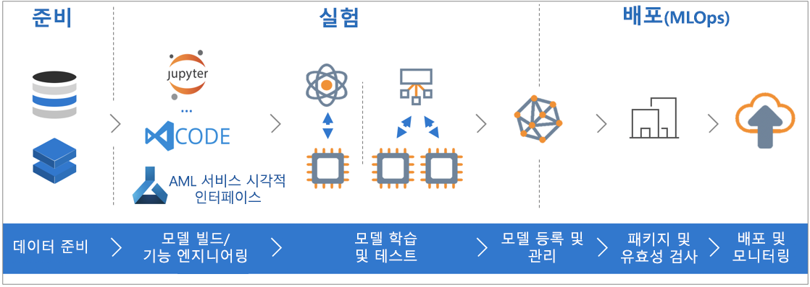

# Azure Machine Learning 서비스(미리 보기)란?

Azure Machine Learning 서비스(미리 보기)는 기계 학습 모델을 개발하고 배포하는 데 사용할 수 있는 클라우드 서비스입니다. Azure Machine Learning 서비스를 사용하면 모델을 클라우드가 제공하는 광범위한 규모에서 모델을 빌드, 교육, 배포 및 관리하는 과정을 추적할 수 있습니다.

## 기계 학습이란 무엇인가요?

Machine Learning은 컴퓨터에서 기존 데이터를 사용하여 미래 동작, 결과 및 추세를 예측하는 데이터 과학 기술입니다. Machine Learning을 사용하면 컴퓨터에서 명시적으로 프로그래밍하지 않고 학습합니다.

Machine Learning을 통한 예측은 좀 더 똑똑한 앱 및 장치를 만드는 데 도움이 됩니다. 온라인 쇼핑을 예로 들면, 기계 학습은 사용자가 구매한 제품에 따라 좋아할만한 다른 제품을 추천하는 데 도움이 됩니다. 또는 신용 카드를 읽을 때 기계 학습은 해당 거래를 거래 데이터베이스와 비교하여 부정 행위를 검색하는 데 도움을 줍니다. 또한 로봇 진공 청소기가 방을 청소할 때, 기계 학습은 작업이 완료되었는지 여부를 판단하도록 해줍니다.

## Azure Machine Learning 서비스란?

Azure Machine Learning 서비스는 기계 학습 모델의 개발, 교육, 테스트, 배포, 관리 및 추적에 사용할 수 있는 클라우드 기반 환경을 제공합니다.

[  ] (./media/overview-what-is-azure-ml/aml.png#lightbox)

Azure Machine Learning 서비스는 오픈 소스 기술을 완벽히 지원하므로 TensorFlow 및 scikit-learn 등의 기계 학습 구성 요소에서 수많은 오픈 소스 Python 패키지를 사용할 수 있습니다.
[Jupyter notebooks](http://jupyter.org) 또는 [Visual Studio Code Tools for AI](https://visualstudio.microsoft.com/downloads/ai-tools-vscode/) 같은 기능이 풍부한 도구를 사용하면 데이터를 대화식으로 탐색 및 변형하여 모델을 개발 및 테스트할 수 있습니다.
Azure Machine Learning 서비스에는 간편하고 효율적이고 정확하게 모델을 만들 수 있는 [모델 생성 및 조정 자동화](tutorial-auto-train-models.md) 기능이 포함됩니다.

Azure Machine Learning 서비스를 사용하면 로컬 머신 학습을 시작한 다음, 클라우드로 확장할 수 있습니다. [Azure Batch AI](https://azure.microsoft.com/services/batch-ai/) 기본 지원과 [고급 하이퍼 매개 변수 조정 서비스](how-to-tune-hyperparameters.md)를 통해 강력한 클라우드를 바탕으로 더 신속하게 모델을 빌드할 수 있습니다. 

적합한 모델이 있다면 Docker 같은 컨테이너에 쉽게 배포할 수 있습니다. 즉 [Azure Container Instances](how-to-deploy-to-aci.md) 또는 [Azure Kubernetes Service](how-to-deploy-to-aks.md)에 간단히 배포하고, 온-프레미스나 클라우드에서 자체 배포에 컨테이너를 사용할 수 있습니다.
테스트 중에는 배포된 모델을 관리하고 여러 실행을 추적하여 최적의 솔루션을 찾을 수 있습니다.

[!INCLUDE [aml-preview-note](../../../includes/aml-preview-note.md)]

## Azure Machine Learning 서비스로 무엇을 할 수 있나요?

Azure Machine Learning 서비스는 모델을 자동으로 생성하여 사용자에 맞게 조정할 수 있습니다.
예제는 [자습서: Azure 자동화된 Machine Learning을 사용하여 자동으로 분류 모델 학습시키기](tutorial-auto-train-models.md)를 참조하세요.

또는 Python용 Azure Machine Learning <a href="https://aka.ms/aml-sdk" target="_blank">SDK</a>와 오픈 소스 Python 패키지를 함께 사용하여 Azure Machine Learning 서비스 작업 영역에서 매우 정확한 기계 학습 및 딥 러닝 모델을 직접 빌드 및 교육할 수 있습니다.
오픈 소스 Python 패키지에서 다음과 같이 다양한 기계 학습 구성 요소를 선택할 수 있습니다.

- <a href="http://scikit-learn.org/stable/" target="_blank">Scikit-learn</a>
- <a href="https://www.tensorflow.org" target="_blank">Tensorflow</a>
- <a href="https://pytorch.org" target="_blank">PyTorch</a>
- <a href="https://www.microsoft.com/en-us/cognitive-toolkit/" target="_blank">CNTK</a>
- <a href="http://mxnet.io" target="_blank">MXNet</a>

모델이 있으면 모델을 사용하여 테스트를 위해 로컬로 배포한 다음, [Azure Container Instances](how-to-deploy-to-aci.md) 또는 [Azure Kubernetes Service](how-to-deploy-to-aks.md)의 프로덕션 웹 서비스로 배포할 수 있는 할 수 있는 컨테이너(예: Docker)를 만듭니다.

그런 다음, [Azure Portal](https://portal.azure.com/) 또는 [Azure Machine Learning CLI 확장](reference-azure-machine-learning-cli.md)을 사용하여 배포된 모델을 관리할 수 있습니다.
모델 테스트를 추적하는 동안 모델 메트릭을 평가하고, 새 모델 버전을 다시 학습하고, 다시 배포할 수 있습니다.

Azure Machine Learning 서비스를 사용하기 시작하려면 아래 [다음 단계](#next-steps)를 참조하세요.

## Azure Machine Learning 서비스가 Studio와 어떻게 다른가요?

Azure Machine Learning Studio는 코드 작성 없이 기계 학습 솔루션을 빌드, 테스트, 배포할 수 있는 끌어서 놓기 방식의 공동 작업 영역입니다. 미리 작성 및 구성된 기계 학습 알고리즘과 데이터 처리 모듈을 사용합니다.

기계 학습 모델을 쉽고 빠르게 실험 하고 솔루션에 기본 제공 기계 학습 알고리즘으로 충분한 경우 Machine Learning Studio를 사용합니다.

Python 환경에서 작업하거나, 기계 학습 알고리즘에 대한 제어 수준을 높이려 하거나, 오픈 소스 기계 학습 라이브리러를 사용하려는 경우 Machine Learning 서비스를 사용합니다.

> [!NOTE]
> Azure Machine Learning Studio에서 만든 모델은 Azure Machine Learning 서비스로 배포하거나 관리할 수 없습니다.

## 평가판
구독자가 아닌 경우 [Azure 계정을 무료로 개설](https://azure.microsoft.com/pricing/free-trial/?WT.mc_id=A261C142F)할 수 있습니다. Azure 서비스에서 사용 가능한 크레딧을 제공합니다. 크레딧이 소진되더라도 계정이 유지되므로 [무료 Azure 서비스](https://azure.microsoft.com/free/)를 계속 사용할 수 있습니다. 설정을 명시적으로 변경하여 결제를 요청하지 않는 한 신용 카드로 결제되지 않습니다. 또는 [MSDN 구독자 혜택을 활성화](https://azure.microsoft.com/pricing/member-offers/msdn-benefits-details/?WT.mc_id=A261C142F)할 수 있음: MSDN 구독은 유료 Azure 서비스에 사용할 수 있는 크레딧을 매달 제공합니다.

## 다음 단계

- [Azure Portal을 사용하여 시작](quickstart-get-started.md) 문서를 사용하여 기계 학습 작업 영역을 만듭니다.
 
- 전체 자습서 [Azure Machine Learning으로 이미지 분류 모델 학습](tutorial-train-models-with-aml.md)의 단계에 따라 작업 영역을 사용하여 Azure Machine Learning 서비스로 모델을 빌드, 교육 및 배포하는 방법을 알아보세요.

- Azure Machine Learning의 모델 자동 생성 및 자동 조정 허용에 대한 자세한 내용은 [자습서: Azure 자동화된 Machine Learning을 사용하여 자동으로 분류 모델 학습시키기](tutorial-auto-train-models.md)를 참조하세요.

- 기계 학습 시나리오를 작성, 최적화 및 관리하는 [기계 학습 파이프라인](/azure/machine-learning/service/concept-ml-pipelines)에 대해 알아보세요.

- 서비스에 대한 상세 기술 정보는[Azure Machine Learning 서비스 아키텍처 및 개념](concept-azure-machine-learning-architecture.md)을 참조하세요.

- Microsoft의 다른 기계 학습 제품에 대한 자세한 내용은 [기타 Microsoft 기계 학습 제품](./overview-more-machine-learning.md)을 참조하세요.

<!-- 

An intro to AML or an end-to-end quickstart video could go here.

In this 9-minute video, learn how you can benefit your app. You'll learn about key features and what a typical workflow looks like. 

>[!VIDEO https://channel9.msdn.com/Events/Connect/2016/138/player]
 
+ 0-3 minutes covers key features and use-cases.
+ 3-4 minutes covers service provisioning. 
+ 4-6 minutes covers Import Data wizard used to create an index using the built-in real estate dataset.

-->
