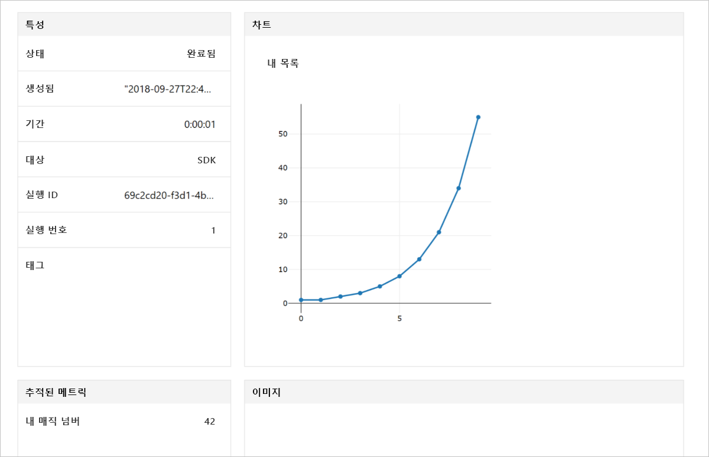

# <a name="quickstart-use-python-to-get-started-with-azure-machine-learning"></a>빠른 시작: Python을 사용하여 Azure Machine Learning 시작

이 빠른 시작에서는 Python용 Azure Machine Learning SDK를 사용하여 Machine Learning 서비스 [작업 영역](concept-azure-machine-learning-architecture.md)을 만들고 사용합니다. 이 작업 영역은 Machine Learning을 사용하여 기계 학습 모델을 실험하고, 교육하고, 배포하는 데 사용되는 클라우드의 기본 블록입니다. 이 빠른 시작에서는 먼저 자체 Python 환경과 Jupyter 노트북 서버를 구성합니다. 설치 과정 없이 실행하려면 [빠른 시작: Azure Portal을 사용하여 Azure Machine Learning 시작](quickstart-get-started.md)을 참조하세요.


> [!VIDEO https://www.microsoft.com/en-us/videoplayer/embed/RE2G9N6]

이 자습서에서는 Python SDK를 설치하고 다음을 수행합니다.

* Azure 구독에 작업 영역을 만듭니다.
* 나중에 다른 노트북 및 스크립트에서 사용할 작업 영역에 대한 구성 파일을 만듭니다.
* 작업 영역 내부에 값을 기록하는 코드를 작성합니다.
* 기록한 값을 작업 영역에서 봅니다.

이 빠른 시작에서는 작업 영역 및 구성 파일을 만듭니다. 다른 Machine Learning 자습서 및 방법 문서에서 필수 조건으로 사용할 수 있습니다. 다른 Azure 서비스와 마찬가지로, Machine Learning과 관련된 한도 및 할당량이 있습니다. [할당량 및 더 많은 요청 방법에 대해 알아보세요.](how-to-manage-quotas.md)

다음 Azure 리소스는 지역에서 사용할 수 있게 되면 작업 영역에 자동으로 추가됩니다.
 
- [Azure Container Registry](https://azure.microsoft.com/services/container-registry/)
- [Azure Storage](https://azure.microsoft.com/services/storage/)
- [Azure Application Insights](https://azure.microsoft.com/services/application-insights/) 
- [Azure Key Vault](https://azure.microsoft.com/services/key-vault/)

>[!NOTE]
> 이 문서의 코드는 Azure Machine Learning SDK 버전 0.1.74에서 테스트됨 

Azure 구독이 아직 없는 경우 시작하기 전에 [무료 계정](https://azure.microsoft.com/free/?WT.mc_id=A261C142F) 을 만듭니다.


## <a name="install-the-sdk"></a>SDK 설치

*2018년 9월 27일 이후에 만들어진 데이터 과학 가상 머신을 사용하는 경우 이 섹션을 건너뜁니다.* 이러한 데이터 과학 가상 머신은 Python SDK가 미리 설치된 상태로 제공됩니다.

SDK를 설치하기 전에, 격리된 Python 환경을 만드는 것이 좋습니다. 이 빠른 시작에서는 [Miniconda](https://conda.io/docs/user-guide/install/index.html)가 사용되지만, 설치된 전체 [Anaconda](https://www.anaconda.com/) 또는 [Python virtualenv](https://virtualenv.pypa.io/en/stable/)를 사용할 수도 있습니다.

### <a name="install-miniconda"></a>Miniconda 설치


Miniconda를 [다운로드](https://conda.io/miniconda.html)하여 설치합니다. Python 3.7 이상 버전을 선택합니다. Python 2.x 버전을 선택하지 마세요.

### <a name="create-an-isolated-python-environment"></a>격리된 Python 환경 만들기 

명령줄 창을 엽니다. Python 3.6을 사용하여 `myenv`라는 새로운 conda 환경을 만듭니다.

```shell
conda create -n myenv -y Python=3.6
```

환경을 활성화합니다.

  ```shell
  conda activate myenv
  ```

### <a name="install-the-sdk"></a>SDK 설치

활성화된 conda 환경에 SDK를 설치합니다. 아래 명령은 Machine Learning SDK의 핵심 구성 요소를 설치합니다. 또한 `myenv` conda 환경에 Jupyter Notebook 서버를 설치합니다. 머신 구성에 따라 설치를 완료하는 데 몇 분이 소요됩니다.

```shell
# install the base SDK and Jupyter Notebook
pip install azureml-sdk[notebooks]
```


## <a name="create-a-workspace"></a>작업 영역 만들기

Jupyter Notebook을 시작하려면 다음 명령을 입력합니다.
```shell
jupyter notebook
```

브라우저 창에서 기본 `Python 3` 커널을 사용하여 새 Notebook을 만듭니다. 

SDK 버전을 표시하려면 Notebook 셀에 다음 Python 코드를 입력하고 실행합니다.

[!code-python[](~/aml-sdk-samples/ignore/doc-qa/quickstart-create-workspace-with-python/quickstart.py?name=import)]

새 Azure 리소스 그룹과 새 작업 영역을 만듭니다.

[Azure Portal의 구독 목록](https://ms.portal.azure.com/#blade/Microsoft_Azure_Billing/SubscriptionsBlade)에서 `<azure-subscription-id>`에 대한 값을 찾습니다. 역할이 소유자 또는 기여자인 구독을 사용합니다.

```python
from azureml.core import Workspace
ws = Workspace.create(name='myworkspace',
                      subscription_id='<azure-subscription-id>',    
                      resource_group='myresourcegroup',
                      create_resource_group=True,
                      location='eastus2' # or other supported Azure region  
                     )
```

앞의 코드를 실행하면 Azure 계정에 로그인하는 새 브라우저 창이 트리거될 수 있습니다. 로그인하면 인증 토큰이 로컬로 캐시됩니다.

연결된 저장소, 컨테이너 레지스트리, 키 자격 증명 모음을 비롯한 작업 영역 세부 정보를 보려면 다음 코드를 입력합니다.

[!code-python[](~/aml-sdk-samples/ignore/doc-qa/quickstart-create-workspace-with-python/quickstart.py?name=getDetails)]


## <a name="write-a-configuration-file"></a>구성 파일 작성

구성 파일에 있는 작업 영역의 세부 정보를 현재 디렉터리에 저장합니다. 이 파일의 이름은 'aml_config\config.json'입니다.  

나중에 이 작업 영역 구성 파일을 사용하여 동일한 작업 영역을 간편하게 로드할 수 있습니다. 다른 노트북 및 스크립트를 사용하여 동일한 디렉터리 또는 하위 디렉터리에 로드할 수 있습니다. 

[!code-python[](~/aml-sdk-samples/ignore/doc-qa/quickstart-create-workspace-with-python/quickstart.py?name=writeConfig)]


`write_config()` API 호출은 현재 디렉터리에 구성 파일을 만듭니다. `config.json` 파일에는 다음 스크립트가 포함됩니다.

```json
{
    "subscription_id": "<azure-subscription-id>",
    "resource_group": "myresourcegroup",
    "workspace_name": "myworkspace"
}
```

## <a name="use-the-workspace"></a>작업 영역 사용

SDK의 기본 API를 사용하여 실험 실행을 추적하는 코드를 작성합니다.

[!code-python[](~/aml-sdk-samples/ignore/doc-qa/quickstart-create-workspace-with-python/quickstart.py?name=useWs)]


## <a name="view-logged-results"></a>기록된 결과 보기
실행이 완료되면 Azure Portal에서 실험 실행을 볼 수 있습니다. 다음 코드를 사용하면 마지막 실행 결과에 대한 URL을 인쇄할 수 있습니다.

```python
print(run.get_portal_url())
```

이 링크를 사용하여 브라우저의 Azure Portal에서 기록된 값을 볼 수 있습니다.



## <a name="clean-up-resources"></a>리소스 정리 
>[!IMPORTANT]
>다른 Machine Learning 자습서 및 방법 문서에 대한 필수 조건으로 만든 리소스를 사용할 수 있습니다.

여기서 만든 리소스를 사용하지 않으려는 경우 요금이 발생하지 않도록 삭제하세요.

[!code-python[](~/aml-sdk-samples/ignore/doc-qa/quickstart-create-workspace-with-python/quickstart.py?name=delete)]


## <a name="next-steps"></a>다음 단계

모델을 실험하고 배포하는 데 필요한 리소스를 만들었습니다. 또한 노트북에서 코드를 실행했습니다. 클라우드의 작업 영역에서 해당 코드의 실행 기록을 탐색했습니다.

현재 환경에서 Machine Learning 자습서에 사용할 패키지가 몇 개 더 필요합니다.

1. 브라우저에서 노트북을 닫습니다.
1. 명령줄 창에서 `Ctrl`+`C`를 사용하여 노트북 서버를 중지합니다.
1. 패키지를 추가로 설치합니다.

    ```shell
    conda install -y cython matplotlib scikit-learn pandas numpy
    pip install azureml-sdk[automl]

    # install run history widget
    jupyter nbextension install --py --user azureml.train.widgets

    # enable run history widget
    jupyter nbextension enable --py --user azureml.train.widgets
    ```

    또한 SDK의 추가 구성 요소를 설치하기 위해 다른 "추가" 키워드를 사용할 수도 있습니다.

    ```shell
    # install the base SDK and auto ml components
    pip install azureml-sdk[automl]

    # install the base SDK and model explainability component
    pip install azureml-sdk[explain]

    # install the base SDK and experimental components
    pip install azureml-sdk[contrib]

    # install the base SDK and automl components in Azure Databricks environment
    # read more at: https://github.com/Azure/MachineLearningNotebooks/tree/master/databricks
    pip install azureml-sdk[databricks]
    ```


이러한 패키지를 설치한 후에는 자습서에 따라 모델을 학습시키고 배포합니다. 

> [!div class="nextstepaction"]
> [자습서: 이미지 분류 모델 학습](tutorial-train-models-with-aml.md)

[GitHub에서 더 많은 고급 예제](https://aka.ms/aml-notebooks)를 탐색할 수도 있습니다.
