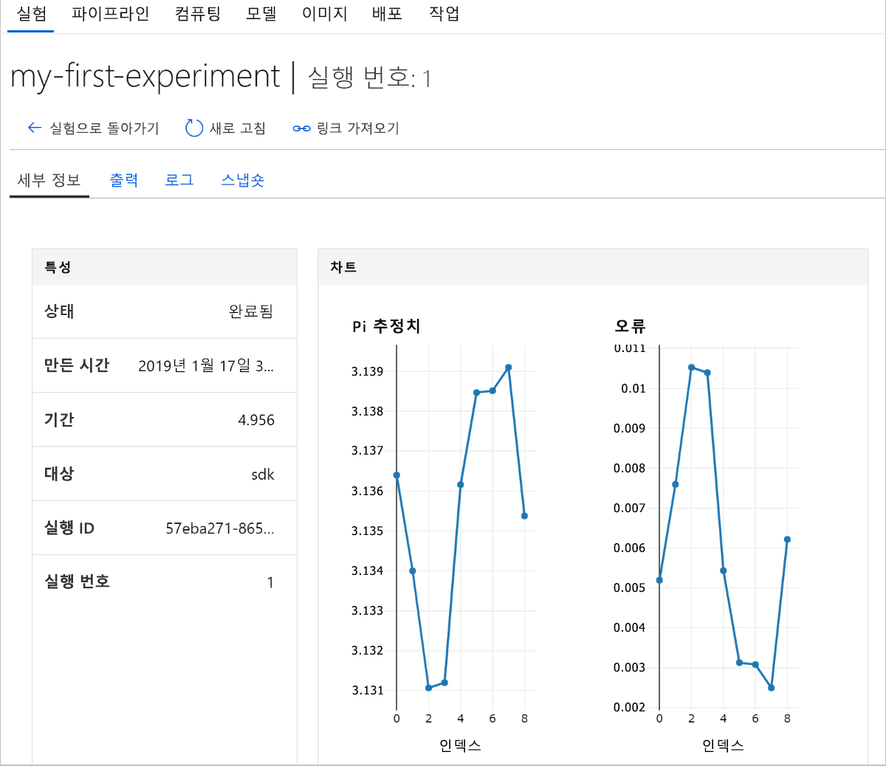

# <a name="quickstart-get-started-with-azure-machine-learning-using-the-cli-extension"></a>빠른 시작: CLI 확장을 사용하여 Azure Machine Learning 시작

이 빠른 시작에서는 Machine Learning CLI 확장을 사용하여 [Azure Machine Learning 서비스](overview-what-is-azure-ml.md)(미리 보기)를 시작합니다.

구체적으로는 CLI를 사용하여 다음 작업을 수행하는 방법을 배우게 됩니다.

1. Azure 구독에 작업 영역을 만듭니다. 작업 영역은 사용자 한 명 이상이 계산 리소스, 모델, 배포 및 실행 기록을 클라우드에 저장하는 데 사용됩니다.
1. 작업 영역에 프로젝트를 연결합니다.   프로젝트는 Machine Learning 문제를 해결하는 데 필요한 스크립트 및 구성 파일을 포함하는 로컬 폴더입니다.  
1. 여러 번 반복 실행되며 값을 몇 개 기록하는 Python 스크립트를 프로젝트에서 실행합니다.
1. 작업 영역의 실행 기록에서 기록된 값을 확인합니다.

> [!NOTE]
> 편의상 해당 지역에서 사용 가능한 경우 [Container Registry](https://azure.microsoft.com/services/container-registry/), [Storage](https://azure.microsoft.com/services/storage/), [Application Insights](https://azure.microsoft.com/services/application-insights/) 및 [Key Vault](https://azure.microsoft.com/services/key-vault/) Azure 리소스는 사용자 작업 영역에 자동으로 추가됩니다.

사용자가 만드는 리소스는 다른 Azure Machine Learning 자습서 및 방법 문서의 필수 구성 요소로 사용할 수 있습니다.

이 CLI는 Azure Machine Learning 서비스용 Python 기반 <a href="http://aka.ms/aml-sdk" target="_blank">SDK</a>를 토대로 작성된 것입니다.

## <a name="prerequisites"></a>필수 조건

빠른 시작의 단계를 시작하기 전에 다음 필수 구성 요소가 충족되었는지 확인합니다.

+ Azure 구독. Azure 구독이 아직 없는 경우 시작하기 전에 [체험 계정](https://azure.microsoft.com/free/?WT.mc_id=A261C142F)을 만듭니다.
+ [Python 3.5 이상](https://www.python.org/)이 설치되어 있음
+ [Azure CLI](https://docs.microsoft.com/cli/azure/install-azure-cli?view=azure-cli-latest)가 설치되어 있음

## <a name="install-the-cli-extension"></a>CLI 확장 설치

컴퓨터에서 명령줄 편집기를 열고 [Azure CLI용 Machine Learning 확장](reference-azure-machine-learning-cli.md)을 설치합니다.  설치가 완료되려면 몇 분 정도 걸릴 수 있습니다.

```azurecli
az extension add azureml-sdk
```

## <a name="install-the-sdk"></a>SDK 설치

[!INCLUDE [aml-install-sdk](../../../includes/aml-install-sdk.md)]

## <a name="create-a-resource-group"></a>리소스 그룹 만들기

리소스 그룹은 Azure 솔루션에 관련된 리소스를 보유하는 컨테이너입니다. Azure CLI를 사용하여 Azure에 로그인한 다음 구독을 지정하고 리소스 그룹을 만듭니다.

명령줄 창에서 Azure CLI 명령 `az login`을 사용하여 로그인합니다. 대화형 로그인의 경우 프롬프트를 따릅니다.
    
   ```azurecli
   az login
   ```

사용 가능한 Azure 구독을 나열하 고 사용하려는 구독을 지정합니다.
   ```azurecli
   az account list --output table
   az account set --subscription <your-subscription-id>
   az account show
   ```
   여기서 \<your-subscription-id\>는 사용하려는 구독의 ID 값입니다. 대괄호를 포함하지 마십시오.

작업 영역을 저장할 리소스 그룹을 만듭니다.
이 빠른 시작에서 관련 정보는 다음과 같습니다.
   + 리소스 그룹의 이름은 `docs-aml`입니다.
   + 지역은 `eastus2`입니다. 

   ```azurecli
   az group create -n docs-aml -l eastus2
   ```

## <a name="create-a-workspace-and-a-project-folder"></a>작업 영역 및 프로젝트 폴더 만들기

명령줄 창에서 리소스 그룹 아래에 Azure Machine Learning 작업 영역을 만듭니다.


   이 빠른 시작에서 관련 정보는 다음과 같습니다.
   + 작업 영역 이름은 `docs-ws`입니다.
   + 리소스 그룹 이름은 `docs-aml`입니다.

   ```azurecli
   az ml workspace create -n docs-ws -g docs-aml
   ```

명령줄 창에서 Azure Machine Learning 프로젝트용으로 로컬 컴퓨터에 폴더를 만듭니다.

   ```
   mkdir docs-prj
   cd docs-prj
   ```

## <a name="create-a-python-script"></a>Python 스크립트 만들기

[!INCLUDE [aml-create-script-pi](../../../includes/aml-create-script-pi.md)]

## <a name="run-the-script"></a>스크립트 실행

해당 폴더를 프로젝트로 작업 영역에 연결합니다. `--history` 인수는 각 실행의 메트릭을 캡처하는 실행 기록 파일의 이름을 지정합니다.

   ```azurecli
   az ml project attach --history my_history -w docs-ws -g docs-aml
   ```

로컬 컴퓨터에서 스크립트를 실행합니다.

   ```azurecli
   az ml run submit -c local pi.py
   ```

   이 명령은 코드를 실행하고 콘솔에 웹 링크를 출력합니다. 링크를 복사하여 웹 브라우저에 붙여넣습니다.

웹 브라우저에서 해당 URL을 방문합니다. 웹 포털이 표시되고 실행 결과가 나타납니다. 해당 실행이나 이전 실행(있는 경우)의 결과를 검사할 수 있습니다.

포털의 대시보드는 Edge, Chrome 및 Firefox 브라우저에서만 지원됩니다.

   

## <a name="clean-up-resources"></a>리소스 정리

[!INCLUDE [aml-delete-resource-group](../../../includes/aml-delete-resource-group.md)]

## <a name="next-steps"></a>다음 단계
이제 모델을 사용해 보고 배포하는 과정을 시작하는 데 필요한 리소스를 만들었습니다. 또한 프로젝트를 만들고, 스크립트를 실행하고, 스크립트의 실행 기록을 살펴보았습니다.

이 워크플로를 더 자세히 살펴보려면 모델 작성/학습/배포 관련 Azure Machine Learning 자습서를 진행하세요.

> [!div class="nextstepaction"]
> [자습서: 모델 작성, 학습 및 배포](tutorial-train-models-with-aml.md)