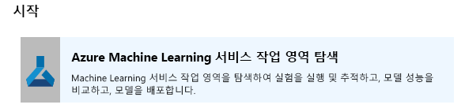
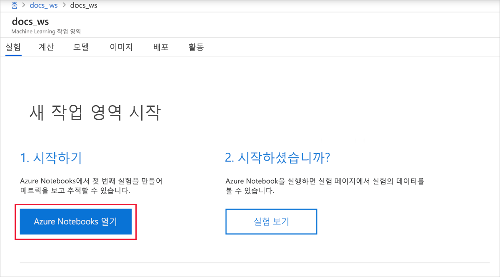
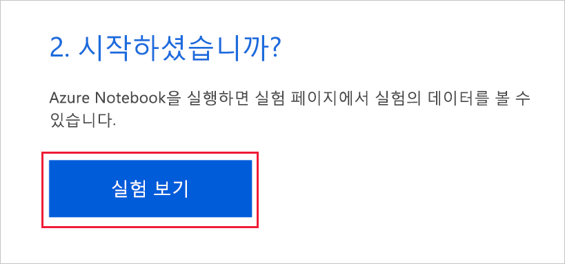
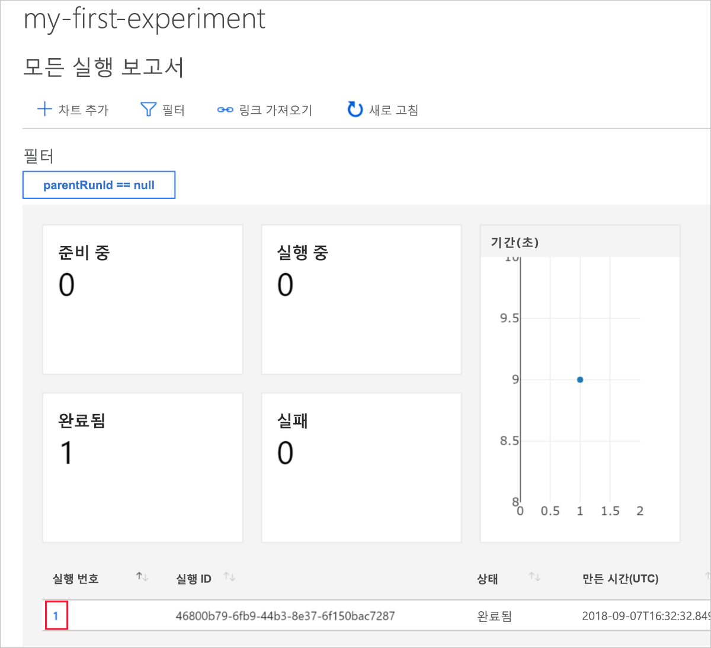
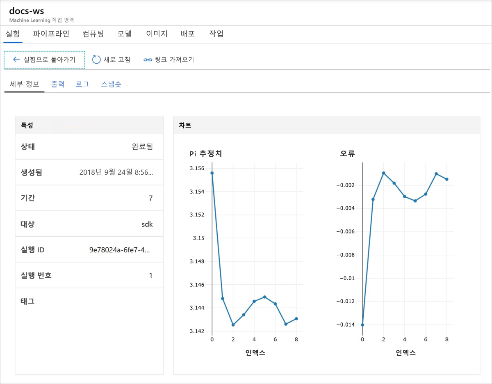

# 빠른 시작: Azure Portal을 사용하여 Azure Machine Learning 시작

이 빠른 시작에서는 Azure Portal을 사용하여 Azure Machine Learning 작업 영역을 만듭니다. 이 작업 영역은 Machine Learning을 사용하여 기계 학습 모델을 실험하고, 교육하고, 배포하는 데 사용되는 클라우드의 기본 블록입니다. 이 빠른 시작에서는 클라우드 리소스를 사용하며 설치 과정이 필요 없습니다. 자체 Jupyter 노트북 서버를 대신 구성하려면 [빠른 시작: Python을 사용하여 Azure Machine Learning 시작](quickstart-create-workspace-with-python.md)을 참조하세요.

> [!VIDEO https://www.microsoft.com/en-us/videoplayer/embed/RE2F9Ad]

이 빠른 시작에서 관련 정보는 다음과 같습니다.

* Azure 구독에 작업 영역을 만듭니다.
* Azure Notebook에서 Python을 사용해보고 여러 번 반복 후 값을 기록합니다.
* 기록한 값을 작업 영역에서 봅니다.

다음 Azure 리소스는 지역에서 사용할 수 있게 되면 작업 영역에 자동으로 추가됩니다.

  - [Azure Container Registry](https://azure.microsoft.com/services/container-registry/)
  - [Azure Storage](https://azure.microsoft.com/services/storage/)
  - [Azure Application Insights](https://azure.microsoft.com/services/application-insights/) 
  - [Azure Key Vault](https://azure.microsoft.com/services/key-vault/)

사용자가 만든 리소스는 다른 Machine Learning 서비스 자습서 및 방법 문서의 필수 구성 요소로 사용할 수 있습니다. 다른 Azure 서비스와 마찬가지로 Machine Learning과 관련하여 특정 리소스에 대한 제한이 있습니다. Azure Batch AI 클러스터 크기를 예로 들 수 있습니다. 기본 제한 및 할당량을 늘리는 방법은 [이 문서](how-to-manage-quotas.md)를 참조하세요.

Azure 구독이 아직 없는 경우 시작하기 전에 [무료 계정](https://azure.microsoft.com/free/?WT.mc_id=A261C142F) 을 만듭니다.

## 작업 영역 만들기 

[!INCLUDE [aml-create-portal](../../../includes/aml-create-in-portal.md)]

작업 영역 페이지에서 `Explore your Azure Machine Learning service workspace`를 선택합니다.

 

## 작업 영역 사용

이제 작업 영역으로 기계 학습 스크립트를 관리하는 방법을 알았습니다. 이 섹션에서는 다음을 수행합니다.

* Azure Notebooks에서 노트북을 엽니다.
* 기록된 값을 만드는 코드를 실행합니다.
* 기록한 값을 작업 영역에서 봅니다.

이 예제는 작업 영역으로 스크립트에서 생성된 정보를 추적하는 방법을 보여줍니다. 

### 노트북 열기 

Azure Notebooks는 Jupyter Notebooks를 위한 무료 클라우드 플랫폼을 제공하며, Machine Learning을 실행하는 데 필요한 모든 것이 미리 구성되어 있습니다.  

`Open Azure Notebooks`를 선택하여 첫 번째 실험을 시작하세요.

 

로그인하려면 [관리자 동의](https://notebooks.azure.com/help/signing-up/work-or-school-account/admin-consent)가 필요하도록 조직에서 요구할 수 있습니다.

로그인하면 새 탭이 열리고 `Clone Library` 프롬프트가 표시됩니다. `Clone`을(를) 선택합니다.

### 노트북 실행

두 노트북과 함께 `config.json` 파일이 표시됩니다. 이 구성 파일에는 앞에서 만든 작업 영역에 대한 정보가 포함되어 있습니다.  

`01.run-experiment.ipynb`를 선택하여 노트북을 엽니다.

`Shift`+`Enter`를 사용하여 셀을 한 번에 하나씩 실행할 수 있습니다. 또는 `Cells` > `Run All`을 선택하여 전체 노트북을 실행할 수 있습니다. 셀 옆에 별표 [*]가 보이면 실행 중이라는 의미입니다. 해당 셀에 대한 코드가 완료되면 숫자가 표시됩니다. 

노트북에서 실행 중인 모든 셀을 완료하면 작업 영역에서 기록된 값을 볼 수 있습니다.

## 기록된 값 보기

노트북의 모든 셀을 실행한 후 포털 페이지로 다시 이동합니다.  

`View Experiments`를 선택합니다.

`Reports` 팝업 항목을 닫습니다.

`my-first-experiment`를 선택합니다.

방금 수행한 실행에 대한 정보를 참조하세요. 페이지를 아래로 스크롤하여 실행 표를 찾습니다. 실행 번호 링크를 선택합니다.

 

자동으로 생성된 기록된 값에 대한 플롯이 표시됩니다. 동일한 이름 매개 변수를 사용하여 여러 값을 기록할 때마다 플롯이 자동으로 생성됩니다.

   

Pi를 추정하는 코드가 임의의 값을 사용하므로 플롯이 여러 값을 표시합니다.  

## 리소스 정리 

[!INCLUDE [aml-delete-resource-group](../../../includes/aml-delete-resource-group.md)]

또한 리소스 그룹을 유지하면서도 단일 작업 영역을 삭제할 수 있습니다. 작업 영역 속성을 표시하고 **삭제**를 선택합니다.

## 다음 단계

모델을 실험하고 배포하는 데 필요한 리소스를 만들었습니다. 또한 노트북에서 몇 가지 코드를 실행했습니다. 클라우드의 작업 영역에서 해당 코드의 실행 기록을 탐색했습니다.

워크플로 환경을 자세히 살펴보려면 모델을 교육하고 배포하는 방법과 관련된 Machine Learning 자습서를 진행하세요.  

> [!div class="nextstepaction"]
> [자습서: 이미지 분류 모델 학습](tutorial-train-models-with-aml.md)
