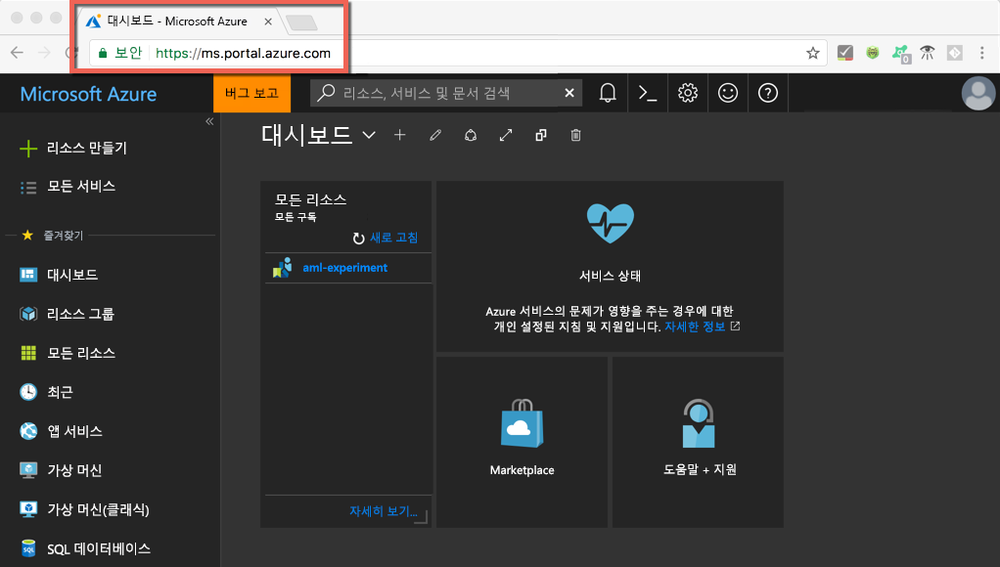
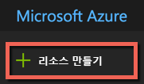
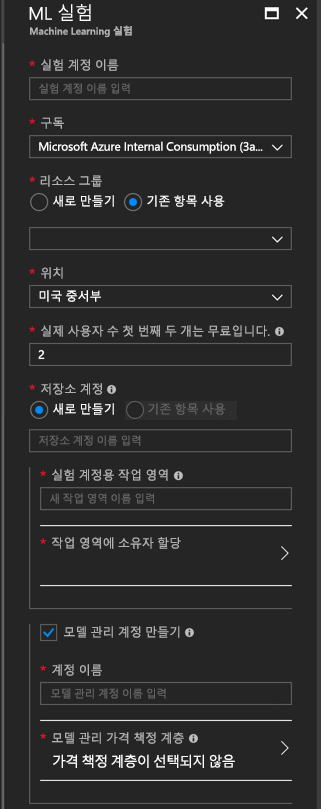
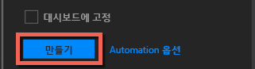
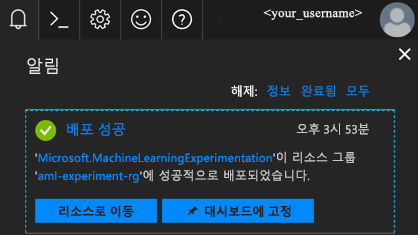
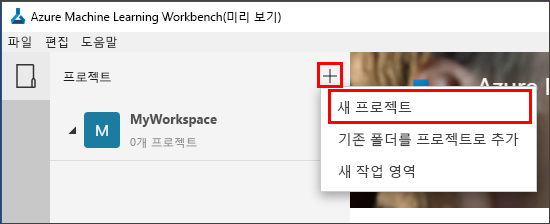
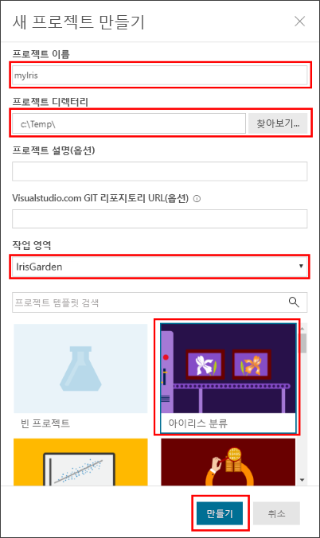
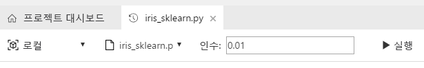
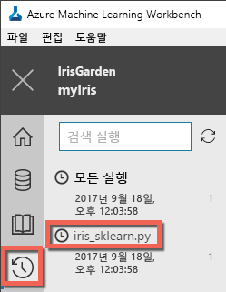

# <a name="quickstart-install-and-get-started-with-azure-machine-learning-services"></a>빠른 시작: Azure Machine Learning 서비스 설치 및 시작
Azure Machine Learning 서비스(미리 보기)는 통합된 종단 간 데이터 과학 및 고급 분석 솔루션입니다. 이를 통해 전문 데이터 과학자들은 클라우드 규모로 데이터를 준비하고, 실험을 개발하며, 모델을 배포할 수 있습니다.

이 빠른 시작에서는 다음을 수행하는 방법을 보여 줍니다.

* Azure Machine Learning 서비스에 대한 서비스 계정 만들기
* Azure Machine Learning Workbench를 설치하고 로그인합니다.
* Workbench에서 프로젝트 만들기
* 해당 프로젝트에서 스크립트 실행  
* CLI(명령줄 인터페이스)에 액세스


Microsoft Azure 포트폴리오의 일부인 Azure Machine Learning 서비스에는 Azure 구독이 필요합니다. Azure 구독이 아직 없는 경우 시작하기 전에 [체험 계정](https://azure.microsoft.com/free/?WT.mc_id=A261C142F)을 만듭니다.

또한 리소스 그룹, Virtual Machines 등의 자산을 만들 수 있는 적절한 권한이 있어야 합니다. 

<a name="prerequisites"></a>Azure Machine Learning Workbench 응용 프로그램은 다음 운영 체제에 설치할 수 있습니다.
- Windows 10 또는 Windows Server 2016
- macOS Sierra 또는 High Sierra

## <a name="create-azure-machine-learning-services-accounts"></a>Azure Machine Learning 서비스 계정 만들기
Azure Portal을 사용하여 Azure Machine Learning 계정을 프로비전합니다. 
1. 사용할 Azure 구독에 대한 자격 증명을 사용하여 [Azure Portal](https://portal.azure.com/)에 로그인합니다. Azure 구독이 없는 경우 [무료 계정](https://azure.microsoft.com/free/?WT.mc_id=A261C142F)을 지금 만드세요. 

   

1. 포털의 왼쪽 상단 모서리에서 **리소스 만들기** 단추(+)를 선택합니다.

   

1. 검색 창에 **Machine Learning**을 입력합니다. **Machine Learning 실험**이라는 검색 결과를 선택합니다. 

   

1. **Machine Learning 실험** 창에서 아래쪽으로 스크롤하여 **만들기**를 클릭하고 실험 계정을 정의하기 시작합니다.  

   

1. **ML 실험** 창에서 Machine Learning 실험 계정을 구성합니다. 

   설정|자습서에 제안된 값|설명
   ---|---|---
   실험 계정 이름 | _고유한 이름_ |계정을 식별하는 고유한 이름을 입력합니다. 본인의 이름 또는 실험을 가장 잘 식별하는 부서나 프로젝트 이름을 사용할 수 있습니다. 이름은 2~32자여야 합니다. 영숫자 문자 및 대시(-) 문자만 포함되어야 합니다. 
   구독 | _구독_ |실험에 사용하려는 Azure 구독을 선택합니다. 구독이 여러 개인 경우 리소스의 요금이 청구될 적절한 구독을 선택합니다.
   리소스 그룹 | _리소스 그룹_ | 구독에서 기존 리소스 그룹을 사용하거나 이름을 입력하여 실험 계정에 대한 새 리소스 그룹을 만듭니다. 
   위치 | _사용자와 가장 가까운 지역_ | 사용자 및 데이터 리소스에 가장 가까운 위치를 선택합니다.
   사용자 수 | 2 | 사용자 수를 입력합니다. [사용자 수가 가격에 미치는 영향](https://azure.microsoft.com/pricing/details/machine-learning/)을 알아 보세요.<br/><br/>이 빠른 시작에서는 두 사용자만 필요합니다. 사용자는 필요에 따라 Azure Portal에서 추가하거나 삭제할 수 있습니다.
   Storage 계정 | _고유한 이름_ | **새로 만들기**를 선택하고 이름을 입력하여 [Azure 저장소 계정](https://docs.microsoft.com/en-us/azure/storage/common/storage-quickstart-create-account?tabs=portal)을 만듭니다. 이름은 3~24자여야 하며, 영숫자만 포함해야 합니다. 또는 **기존 항목 사용**을 선택하고 드롭다운 목록에서 기존 저장소 계정을 선택합니다. 저장소 계정은 필수이며 프로젝트 아티팩트를 보유하고 기록 데이터를 실행하는 데 사용됩니다. 
   실험 계정에 대한 작업 영역 | IrisGarden<br/>(자습서에서 사용되는 이름) | 이 계정의 작업 영역에 대한 이름을 입력합니다. 이름은 2~32자여야 합니다. 영숫자 문자 및 대시(-) 문자만 포함되어야 합니다. 이 작업 영역에는 실험을 만들고 관리, 게시하는 데 필요한 도구가 들어 있습니다.
   작업 영역에 대한 소유자 할당 | _사용자 계정_ | 자신의 계정을 작업 영역 소유자로 선택합니다.
   모델 관리 계정 만들기 | **확인** |실시간 웹 서비스로 모델을 배포하고 관리해야 하는 경우 해당 리소스를 사용할 수 있도록 모델 관리 계정을 만듭니다. <br/><br/>선택 사항이지만, 모델 관리 계정을 실험 계정과 동시에 만드는 것이 좋습니다.
   계정 이름 | _고유한 이름_ | 모델 관리 계정을 식별하는 고유한 이름을 선택합니다. 본인의 이름 또는 실험을 가장 잘 식별하는 부서나 프로젝트 이름을 사용할 수 있습니다. 이름은 2~32자여야 합니다. 영숫자 문자 및 대시(-) 문자만 포함되어야 합니다. 
   모델 관리 가격 책정 계층 | **개발/테스트** | **선택한 가격 책정 계층 없음**을 선택하고 새 모델 관리 계정에 대한 가격 책정 계층을 지정합니다. 비용 절감을 위해 구독에서 사용할 수 있는 경우(제한된 가용성) **개발/테스트** 가격 책정 계층을 선택합니다. 그렇지 않으면 S1 가격 책정 계층을 선택합니다. **선택**을 클릭하여 가격 책정 계층 선택을 저장합니다. 
   대시보드에 고정 | _확인_ | **대시 보드에 고정** 옵션을 선택하여 Azure Portal의 전면 대시보드 페이지에서 Machine Learning 실험 계정을 간편하게 추적할 수 있습니다.

   

5. **만들기**를 클릭하여 모델 관리 계정과 함께 실험 계정을 만드는 프로세스를 시작합니다.

   

   계정을 만드는 데 몇 분 정도 걸릴 수 있습니다. Azure Portal 도구 모음에서 알림 아이콘(벨)을 클릭하여 배포 프로세스의 상태를 확인할 수 있습니다.
   
   


## <a name="install-and-log-in-to-workbench"></a>Workbench 설치 및 로그인

Azure Machine Learning Workbench를 이제 Windows나 macOS에서 사용할 수 있습니다. [지원되는 플랫폼](#prerequisites) 목록을 참조하세요.

>[!WARNING]
>설치를 완료하는 데 30분 정도가 걸릴 수 있습니다. 

1. 최신 Workbench 설치 관리자를 다운로드하여 시작합니다. 
   >[!IMPORTANT]
   >설치 관리자를 디스크에 완전히 다운로드한 다음, 거기에서 실행합니다. 브라우저의 다운로드 위젯에서 직접 실행하지 않습니다.

   **Windows에서:** 

   &nbsp;&nbsp;&nbsp;&nbsp;A. [AmlWorkbenchSetup.msi](https://aka.ms/azureml-wb-msi)를 다운로드합니다.  <br/>
   &nbsp;&nbsp;&nbsp;&nbsp;B. 다운로드한 설치 관리자를 파일 탐색기에서 두 번 클릭합니다.

   **macOS에서:** 

   &nbsp;&nbsp;&nbsp;&nbsp;A. [AmlWorkbench.dmg](https://aka.ms/azureml-wb-dmg)를 다운로드합니다. <br/>
   &nbsp;&nbsp;&nbsp;&nbsp;B. 다운로드한 설치 관리자를 Finder에서 두 번 클릭합니다.<br/><br/>

1. 화면의 설치 관리자 지침에 따라 완료합니다. 

   **설치를 완료하는 데 30분 정도가 걸릴 수 있습니다.**  
   
   | |Azure Machine Learning Workbench 설치 경로|
   |--------|------------------------------------------------|
   |Windows|C:\Users\\<user\>\AppData\Local\AmlWorkbench|
   |macOS|/Applications/Azure ML Workbench.app|

   설치 관리자에서 Python, Miniconda 및 기타 관련 라이브러리와 같은 필요한 모든 종속성을 다운로드하고 설치합니다. 이 설치에는 Azure 플랫폼 간 명령줄 도구 또는 Azure CLI도 포함됩니다.

1. 설치 관리자의 마지막 화면에서 **Launch Workbench**(Workbench 시작) 단추를 선택하여 Workbench를 시작합니다. 

   설치 관리자를 닫은 경우에는 다음을 수행합니다.
   + Windows에서는 **Machine Learning Workbench** 바탕 화면 바로 가기를 사용하여 시작합니다. 
   + macOS에서는 실행 패드에서 **Azure ML Workbench**를 선택합니다.

1. 첫 번째 화면에서 **Microsoft에 로그인**을 선택하여 Azure Machine Learning Workbench에서 인증받습니다. Azure Portal에서 사용한 자격 증명과 동일한 자격 증명을 사용하여 실험 및 모델 관리 계정을 만듭니다. 

   일단 로그인하면 Workbench에서는 Azure 구독에서 찾은 첫 번째 실험 계정을 사용하고 해당 계정과 연결된 모든 작업 영역 및 프로젝트를 표시합니다. 

   >[!TIP]
   > Workbench 응용 프로그램 창의 왼쪽 아래 모서리에 있는 아이콘을 사용하여 다른 실험 계정으로 전환할 수 있습니다.

## <a name="create-a-project-in-workbench"></a>Workbench에서 프로젝트 만들기

Azure Machine Learning에서 프로젝트는 문제를 해결하기 위해 수행되는 모든 작업에 대한 논리적 컨테이너입니다. 로컬 디스크의 단일 폴더에 매핑되며, 파일이나 하위 폴더를 추가할 수 있습니다. 

여기에서는 [아이리스 꽃 데이터 집합](https://en.wikipedia.org/wiki/Iris_flower_data_set)이 포함된 템플릿을 사용하여 새 Workbench 프로젝트를 만듭니다. 이 빠른 시작을 수행하는 자습서는 이 데이터에 따라 일부 물리적 특징을 기반으로 아이리스의 유형을 예측하는 모델을 구축합니다.  

1. Azure Machine Learning Workbench를 열고 **프로젝트** 창에서 더하기 기호(+)를 선택하고 **새 프로젝트**를 선택합니다.  

   

1. 양식 필드에 정보를 채우고 **만들기** 단추를 선택하여 Workbench에 새 프로젝트를 만듭니다.

   필드|자습서에 제안된 값|설명
   ---|---|---
   프로젝트 이름 | myIris |계정을 식별하는 고유한 이름을 입력합니다. 본인의 이름 또는 실험을 가장 잘 식별하는 부서나 프로젝트 이름을 사용할 수 있습니다. 이름은 2~32자여야 합니다. 영숫자 문자 및 대시(-) 문자만 포함되어야 합니다. 
   프로젝트 디렉터리 | c:\Temp\ | 프로젝트가 만들어지는 디렉터리를 지정합니다.
   프로젝트 설명 | _비워 둠_ | 프로젝트를 설명하기에 유용한 선택적 필드입니다.
   Visualstudio.com GIT 리포지토리 URL |_비워 둠_ | 선택적 필드입니다. 소스 제어 및 공동 작업을 위해 필요에 따라 Visual Studio Team Services의 Git 리포지토리와 프로젝트를 연결할 수 있습니다. [설정하는 방법을 알아보세요](/desktop-workbench/using-git-ml-project#step-3-set-up-a-machine-learning-project-and-git-repo). 
   선택한 작업 영역 | IrisGarden(있는 경우) | Azure Portal에서 실험 계정에 대해 만든 작업 영역을 선택합니다. <br/>빠른 시작을 수행한 경우 IrisGarden이라는 이름의 작업 영역이 있어야 합니다. 그렇지 않으면 실험 계정을 만들 때 생성한 항목을 선택하거나 원하는 다른 항목을 선택합니다.
   프로젝트 템플릿 | 아이리스 분류 | 템플릿에는 제품을 탐색하는 데 사용할 수 있는 스크립트와 데이터가 포함됩니다. 템플릿에는 이 설명서 사이트의 빠른 시작 및 기타 자습서에 필요한 스크립트와 데이터가 포함됩니다. 

   
 
 새 프로젝트가 만들어지고 프로젝트 대시보드에서 해당 프로젝트가 열립니다. 이 시점에서 프로젝트 홈페이지, 데이터 소스, 노트북 및 소스 코드 파일을 탐색할 수 있습니다. 

>[!TIP]
>원활한 데이터 과학 개발 환경을 위해 Python IDE와 작동하도록 Workbench를 구성할 수 있습니다. 그런 다음, IDE에서 프로젝트와 상호 작용할 수 있습니다. [방법을 알아보세요](../desktop-workbench/how-to-configure-your-ide.md). 

## <a name="run-a-python-script"></a>Python 스크립트 실행

이제 로컬 컴퓨터에서 **iris_sklearn.py** 스크립트를 실행할 수 있습니다. 이 스크립트는 **아이리스 분류** 프로젝트 템플릿에 기본적으로 포함되어 있습니다. 이 스크립트는 인기 있는 Python [scikit-learn](http://scikit-learn.org/stable/index.html) 라이브러리를 사용하여 [로지스틱 회귀](https://en.wikipedia.org/wiki/Logistic_regression) 모델을 작성합니다.

1. **프로젝트 대시보드** 페이지의 맨 위에 있는 명령 모음에서 **로컬**을 실행 대상으로 선택하고 **iris_sklearn.py**를 실행할 스크립트로 선택합니다. 이 값은 기본적으로 미리 선택되어 있습니다. 

   샘플에는 다른 파일도 포함되어 있어서 나중에 확인할 수 있으며 이 빠른 시작에서는 **iris_sklearn.py** 파일만 사용합니다. 

   

1. **인수** 텍스트 상자에 **0.01**을 입력합니다. 이 숫자는 정규화 속도에 해당하며, 스크립트에서 로지스틱 회귀 모델을 구성하는 데 사용됩니다. 

1. **실행**을 선택하여 컴퓨터에서 스크립트 실행을 시작합니다. **iris_sklearn.py** 작업이 오른쪽의 **작업** 패널에 즉시 표시되어 스크립트의 실행을 모니터링할 수 있습니다.

   축하합니다! Azure Machine Learning Workbench에서 Python 스크립트를 실행했습니다.

1. **0.001**~**10** 범위의 다른 인수값을 사용하여(예: 10제곱 사용) 2~3단계를 여러 번 반복합니다. 각 실행이 **작업** 창에 표시됩니다.

1. **실행** 보기를 선택한 다음, [실행] 목록에서 **iris_sklearn.py**를 선택하여 실행 기록을 검사합니다. 

   

   이 보기는 **iris_sklearn.py**에서 실행된 모든 실행을 보여 줍니다. 실행 기록 대시보드는 최상위 메트릭, 기본 그래프 집합 및 각 실행에 대한 메트릭 목록도 표시합니다. 

1. 기어 또는 필터 아이콘을 사용하여 구성을 정렬, 필터링 및 조정하여 이 보기를 사용자 지정할 수 있습니다.

   

3. 작업 창에서 완료된 실행을 선택하면 해당 특정 실행에 대한 자세한 보기를 확인할 수 있습니다. 세부 정보에는 추가 메트릭, 생성한 파일 및 잠재적으로 유용한 기타 로그가 포함됩니다.

## <a name="start-the-cli"></a>CLI 시작

Azure Machine Learning CLI(명령줄 인터페이스)도 설치됩니다. CLI 인터페이스를 사용하면 `az` 명령을 사용하여 Azure Machine Learning 서비스에 액세스하고 상호 작용하면서 종단간 데이터 과학 워크플로에 필요한 모든 작업을 수행할 수 있습니다. [자세한 정보](../desktop-workbench/tutorial-iris-azure-cli.md)

Workbench의 도구 모음에서 **파일 → 명령 프롬프트 열기**를 사용하여 Azure Machine Learning CLI를 시작할 수 있습니다.

--help 인수를 사용하면 Azure Machine Learning CLI 명령에 대한 도움말을 얻을 수 있습니다.

```az ml --help```

## <a name="clean-up-resources"></a>리소스 정리

[!INCLUDE [aml-delete-resource-group](../../../includes/aml-delete-resource-group.md)]

## <a name="next-steps"></a>다음 단계
이제 필요한 Azure Machine Learning 계정을 만들고, Azure Machine Learning Workbench 응용 프로그램을 설치했습니다. 또한 프로젝트를 만들고, 스크립트를 실행하고, 스크립트의 실행 기록을 살펴보았습니다.

아이리스 모델을 웹 서비스로 배포하는 방법을 포함하여 이 워크플로를 더 심층적으로 경험하려면 전체 *아이리스 분류* 자습서를 따르세요. 이 자습서에는 [데이터 준비](../desktop-workbench/tutorial-classifying-iris-part-1.md), [실험](../desktop-workbench/tutorial-classifying-iris-part-2.md) 및 [모델 관리](../desktop-workbench/tutorial-classifying-iris-part-3.md)에 대한 자세한 단계가 포함됩니다. 

> [!div class="nextstepaction"]
> [자습서: 아이리스 분류(1부)](../desktop-workbench/tutorial-classifying-iris-part-1.md)

>[!NOTE]
> 모델 관리 계정은 만들었지만, 웹 서비스를 배포하기 위한 환경은 아직 설정되지 않았습니다. [배포 환경](../desktop-workbench/deployment-setup-configuration.md)을 설정하는 방법을 알아보세요.
