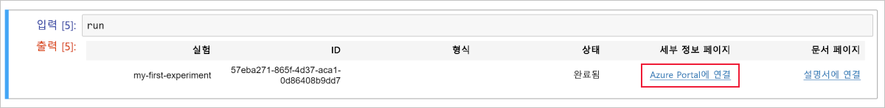
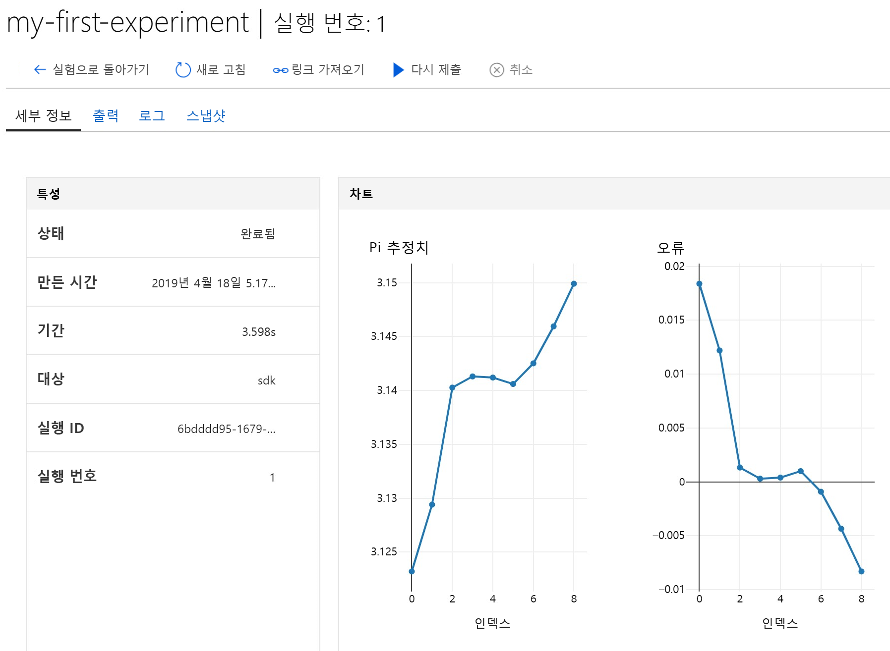

# 빠른 시작: 클라우드 기반 Notebook 서버를 사용하여 Azure Machine Learning 시작

이 문서에서는 Azure Notebooks를 사용하여 Azure Machine Learning Service [작업 영역](concept-azure-machine-learning-architecture.md)에 기록된 코드를 실행합니다. 작업 영역은 Machine Learning을 사용하여 기계 학습 모델을 실험하고, 교육하고, 배포하는 데 사용하는 클라우드의 기본 블록입니다. 

이 빠른 시작에서는 클라우드 리소스를 사용하며 설치 과정이 필요 없습니다. 대신 사용자 고유의 환경을 사용하려면 [빠른 시작: 사용자 고유의 Notebook 서버를 사용하여 Azure Machine Learning 시작](quickstart-run-local-notebook.md)을 참조하세요.  
 
이 빠른 시작에서 수행하는 작업은 다음과 같습니다.

* Jupyter Notebook에서 Python을 사용하여 작업 영역에 연결합니다. 이 노트는 각 반복의 pi 및 로그 오류를 예측하는 코드를 포함합니다. 
* 작업 영역의 기록된 오류 값을 확인합니다.

Azure 구독이 없는 경우 시작하기 전에 체험 계정을 만듭니다. [Azure Machine Learning Service의 평가판 또는 유료 버전](https://aka.ms/AMLFree)을 지금 사용해 보세요.

## 필수 요소

1. 아직 없는 경우 [Azure Machine Learning 작업 영역을 만듭니다](setup-create-workspace.md#portal).

1. [Azure Portal](https://portal.azure.com/)에서 작업 영역을 엽니다.  [작업 영역을 찾는](how-to-manage-workspace.md#view) 방법을 참조하세요.

## 작업 영역 사용

> [!VIDEO https://www.microsoft.com/en-us/videoplayer/embed/RE2F9Ad]

작업 영역으로 기계 학습 스크립트를 관리하는 방법을 알아봅니다. 이 섹션에서 수행하는 단계는 다음과 같습니다.

* Azure Notebooks에서 노트북을 엽니다.
* 기록된 값을 만드는 코드를 실행합니다.
* 기록한 값을 작업 영역에서 봅니다.

이 예제는 작업 영역으로 스크립트에서 생성된 정보를 추적하는 방법을 보여줍니다. 

### 노트북 열기 

[Azure Notebooks](https://notebooks.azure.com)는 Jupyter Notebook용 체험 클라우드 플랫폼을 제공하며, 여기에는 Machine Learning을 실행하는 데 필요한 모든 항목이 미리 구성되어 있습니다. 작업 영역에서 이 플랫폼을 시작하여 Azure Machine Learning Service 작업 영역 사용을 시작할 수 있습니다.

1. 작업 영역 개요 페이지에서 **Azure Notebooks 시작**을 선택하여 Azure Notebooks의 첫 번째 실험을 시도합니다.  Azure Notebooks는 클라우드에서 무료로 Jupyter Notebook을 실행할 수 있는 별도 서비스입니다.  서비스에 이 링크를 사용하면 작업 영역에 연결하는 방법에 대한 정보가 Azure Notebooks에서 만드는 라이브러리에 추가됩니다.

   

1. Azure Notebooks에 로그인합니다.  Azure Portal에 로그인하는 데 사용한 계정과 동일한 계정으로 로그인해야 합니다. 로그인하려면 [관리자 동의](https://notebooks.azure.com/help/signing-up/work-or-school-account/admin-consent)가 필요하도록 조직에서 요구할 수 있습니다.

1. 로그인하면 새 탭이 열리고 `Clone Library` 프롬프트가 표시됩니다. 이 라이브러리를 복제하면 Notebook 및 기타 파일의 세트가 Azure Notebooks 계정에 로드됩니다.  이러한 파일을 통해 Azure Machine Learning의 기능을 탐색할 수 있습니다.

1. 다른 사용자와 작업 영역 정보를 공유하지 않도록 **공용**을 선택 취소합니다.

1. **복제**를 선택합니다.

   

1. 프로젝트 상태가 중지되면 **무료 컴퓨터에서 실행**을 클릭하여 무료 Notebook 서버를 사용합니다.

    

### 노트북 실행

이 프로젝트에 대한 파일 목록에서 `config.json` 파일이 표시됩니다. 이 구성 파일에는 Azure Portal에서 만든 작업 영역에 대한 정보가 포함되어 있습니다.  이 파일을 통해 코드를 연결하고 작업 영역에 정보를 추가할 수 있습니다.

1. **01.run-experiment.ipynb**를 선택하여 Notebook을 엽니다.

1. 상태 영역에서 커널이 시작될 때까지 대기하도록 알려줍니다.  커널이 준비되면 메시지가 사라집니다.

    

1. 커널이 시작된 후 **Shift+Enter** 키를 사용하여 한 번에 하나씩 셀을 실행합니다. 또는 **셀** > **모두 실행**을 선택하여 전체 Notebook을 실행합니다. 셀 옆에 별표(__*__)가 표시되면 셀이 여전히 실행 중입니다. 해당 셀에 대한 코드가 완료되면 숫자가 표시됩니다. 

1. Notebook의 지침을 따라 Azure 구독을 인증합니다.

Notebook에서 모든 셀의 실행이 완료되면 작업 영역에서 기록된 값을 볼 수 있습니다.

## 기록된 값 보기

1. `run` 셀의 출력은 작업 영역에서 실험 결과를 보기 위해 Azure Portal로 다시 돌아가는 링크를 포함합니다. 

    

1. **Azure Portal에 연결**을 클릭하여 작업 영역에서 실행에 대한 정보를 봅니다.  이 링크는 Azure Portal에서 작업 영역을 엽니다.

1. 표시되는 기록 값의 플롯은 작업 영역에서 자동으로 생성되었습니다. 동일한 이름 매개 변수를 사용하여 여러 값을 기록할 때마다 플롯이 자동으로 생성됩니다.

   

Pi 근삿값을 계산하는 코드에서 임의 값을 사용하므로 도면에 여러 값이 표시됩니다.  

## 리소스 정리 

[!INCLUDE [aml-delete-resource-group](../../../includes/aml-delete-resource-group.md)]

또한 리소스 그룹을 유지하면서 단일 작업 영역을 삭제할 수도 있습니다. 작업 영역 속성을 표시하고 **삭제**를 선택합니다.

## 다음 단계

모델을 실험하고 배포하는 데 필요한 리소스를 만들었습니다. 또한 노트북에서 몇 가지 코드를 실행했습니다. 클라우드의 작업 영역에서 해당 코드의 실행 기록을 탐색했습니다.

워크플로 환경을 자세히 살펴보려면 다음 Machine Learning 자습서에 따라 모델을 학습하고 배포하세요.  

> [!div class="nextstepaction"]
> [자습서: 이미지 분류 모델 학습시키기](tutorial-train-models-with-aml.md)
