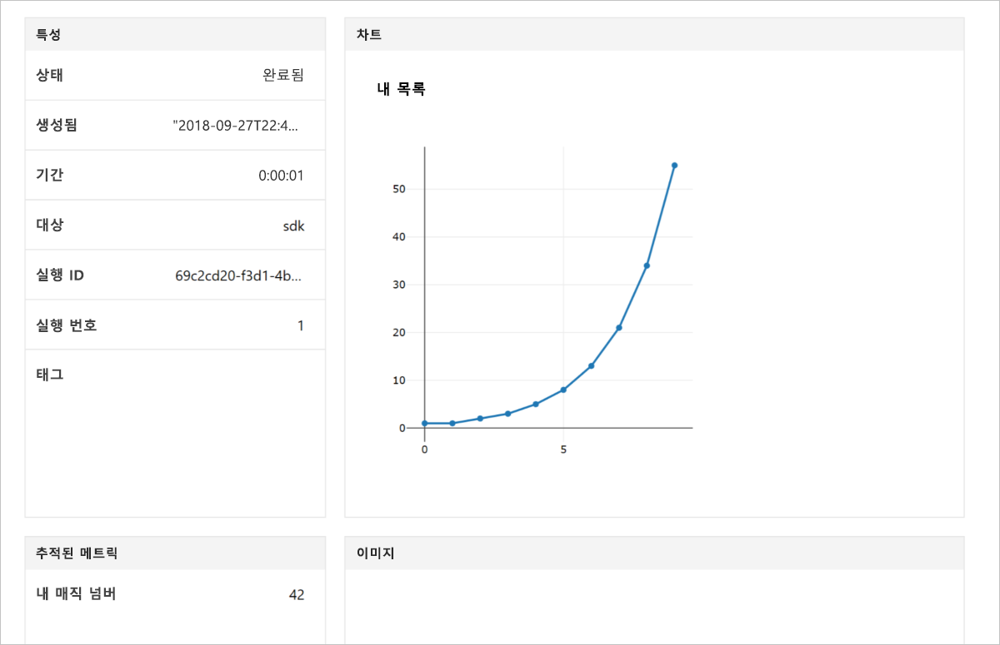

# <a name="quickstart-use-your-own-notebook-server-to-get-started-with-azure-machine-learning"></a>빠른 시작: 사용자 고유의 Notebook 서버를 사용하여 Azure Machine Learning 시작

고유의 Python 환경과 Jupyter Notebook 서버를 사용하여 Azure Machine Learning 서비스를 시작합니다.  SDK 설치 없이 실행하려면 [빠른 시작: 클라우드 기반 Notebook 서버를 사용하여 Azure Machine Learning 시작](quickstart-run-cloud-notebook.md)을 참조하세요.

이 빠른 시작은 [Azure Machine Learning 서비스 작업 영역](concept-azure-machine-learning-architecture.md)을 사용하여 기계 학습 실험을 추척하는 방법을 보여줍니다. 값을 작업 영역에 기록하는 Python 코드를 실행합니다.

이 빠른 시작의 비디오 버전을 보려면:

> [!VIDEO https://www.microsoft.com/en-us/videoplayer/embed/RE2G9N6]

Azure 구독이 없는 경우 시작하기 전에 체험 계정을 만듭니다. [Azure Machine Learning Service의 평가판 또는 유료 버전](https://aka.ms/AMLFree)을 지금 사용해 보세요.

## <a name="prerequisites"></a>필수 조건

* Azure Machine Learning SDK가 설치된 Python 3.6 Notebook 서버
* Azure Machine Learning Service 작업 영역
* 작업 영역 구성 파일( **.azureml/config.json**).

[Azure Machine Learning Service 작업 영역 만들기](setup-create-workspace.md#sdk)에서 이러한 모든 필수 구성 요소를 가져옵니다.


## <a name="use-the-workspace"></a>작업 영역 사용

스크립트를 만들거나 작업 영역 구성 파일( **.azureml/config.json**)과 동일한 디렉터리에서 Notebook을 시작합니다.

### <a name="attach-to-workspace"></a>작업 영역에 연결

이 코드는 구성 파일에서 정보를 읽어 작업 영역에 연결합니다.

```
from azureml.core import Workspace

ws = Workspace.from_config()
```

### <a name="log-values"></a>로그 값

SDK의 기본 API를 사용하여 실험 실행을 추적하는 이 코드를 실행합니다.

1. 작업 영역에서 실험을 만듭니다.
1. 단일 값을 실험에 기록합니다.
1. 값 목록을 실험에 기록합니다.

[!code-python[](~/aml-sdk-samples/ignore/doc-qa/quickstart-create-workspace-with-python/quickstart.py?name=useWs)]

## <a name="view-logged-results"></a>기록된 결과 보기

실행이 완료되면 Azure Portal에서 실험 실행을 볼 수 있습니다. 마지막 실행 결과로 이동하는 URL을 인쇄하려면 다음 코드를 사용합니다.

```python
print(run.get_portal_url())
```

이 코드는 브라우저의 Azure Portal에서 기록된 값을 보는 데 사용할 수 있는 링크를 반환합니다.



## <a name="clean-up-resources"></a>리소스 정리 

>[!IMPORTANT]
>다른 Machine Learning 자습서 및 방법 문서에 대한 필수 조건으로 여기서 만든 리소스를 사용할 수 있습니다.

이 문서에서 만든 리소스를 사용하지 않으려는 경우 요금이 발생하지 않도록 해당 리소스를 삭제합니다.

[!code-python[](~/aml-sdk-samples/ignore/doc-qa/quickstart-create-workspace-with-python/quickstart.py?name=delete)]

## <a name="next-steps"></a>다음 단계

이 문서에서는 모델을 실험하고 배포하는 데 필요한 리소스를 만들었습니다. 또한 노트북에서 코드를 실행하고 클라우드의 작업 영역에서 코드의 실행 기록을 살펴보았습니다.

> [!div class="nextstepaction"]
> [자습서: 이미지 분류 모델 학습시키기](tutorial-train-models-with-aml.md)

[GitHub에서 더 많은 고급 예제](https://aka.ms/aml-notebooks)를 살펴보거나 [SDK 사용자 가이드](https://docs.microsoft.com/python/api/overview/azure/ml/intro?view=azure-ml-py)를 볼 수도 있습니다.
