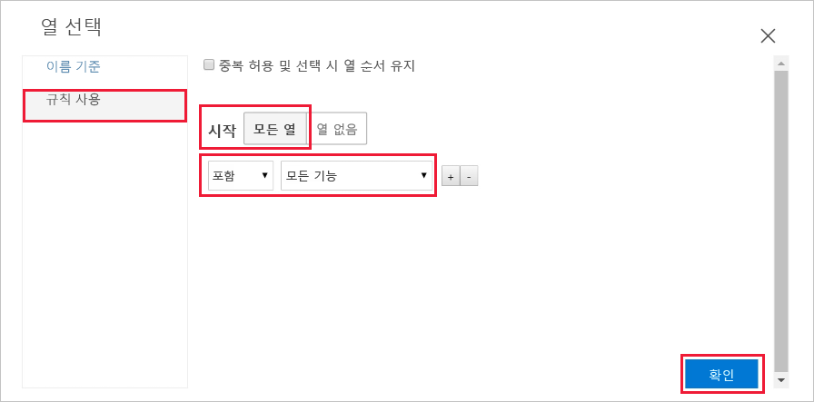
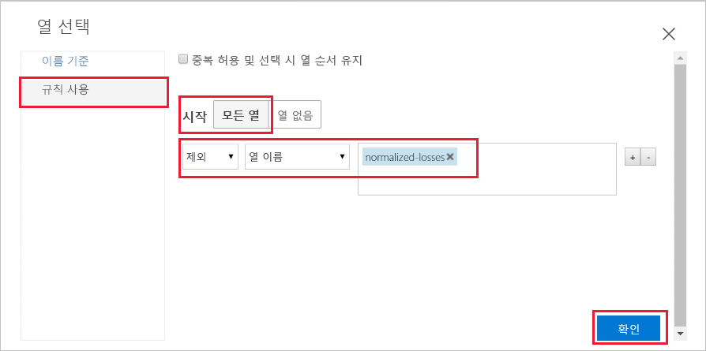
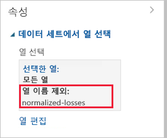
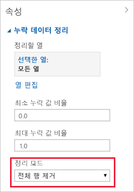

# 빠른 시작: Azure Machine Learning에서 코드를 작성하지 않고 데이터 준비 및 시각화

Azure Machine Learning을 위해 끌어서 놓기 그래픽 인터페이스(미리 보기)에서 데이터를 준비하고 시각화합니다. 사용할 데이터에는 제조업체, 모델, 기술 사양 및 가격과 같은 정보를 포함하여 다양한 개별 자동차에 대한 항목이 포함되어 있습니다.  

이 빠른 시작에서는 다음 작업을 수행하여 데이터를 검색하고 준비합니다.

- 첫 번째 실험을 만들어 데이터 추가 및 미리 보기
- 누락 값을 제거하여 데이터 준비
- 실험 실행
- 결과 데이터 시각화

기계 학습을 처음 사용하는 경우 [초급자를 위한 데이터 과학](https://docs.microsoft.com/azure/machine-learning/studio/data-science-for-beginners-the-5-questions-data-science-answers) 비디오 시리즈는 기계 학습에 대한 훌륭한 소개입니다.

## 필수 조건

Azure 구독이 없는 경우 시작하기 전에 체험 계정을 만듭니다. 지금 바로 [Azure Machine Learning Service의 무료 또는 유료 버전](https://aka.ms/AMLFree)을 사용해 보세요.

### 작업 영역 만들기

Azure Machine Learning Service 작업 영역이 있으면 [다음 섹션](#start)으로 건너뜁니다. 그렇지 않으면 지금 작업 영역을 새로 만듭니다.

[!INCLUDE [aml-create-portal](../../../includes/aml-create-in-portal.md)]

##  그래픽 인터페이스 웹 페이지 열기

1. [Azure Portal](https://portal.azure.com/)에서 작업 영역을 엽니다.  

1. 작업 영역에서 **그래픽 인터페이스**를 선택합니다.  그런 다음, **그래픽 인터페이스 시작**을 선택합니다.  
 
    

    새 브라우저 페이지에서 인터페이스 웹 페이지가 열립니다.  

## 첫 번째 실험 만들기

그래픽 인터페이스 도구는 예측 분석 모델을 쉽게 작성, 테스트 및 반복할 수 있는 대화형 그래픽 영역을 제공합니다. 데이터 세트와 분석 모듈을 대화형 캔버스에 끌어서 놓고 서로 연결하여 _실험_을 구성합니다.  이제 첫 번째 실험을 만듭니다.

1. 왼쪽 아래 모서리에서 **새로 추가**를 선택합니다.

1. **빈 실험**을 선택합니다.

1. 실험에 기본 이름이 지정됩니다. 이 텍스트를 선택하여 "빠른 시작-데이터 검색"이라는 이름으로 바꿉니다. 이 이름은 고유할 필요가 없습니다.

1. 화면의 아래쪽에 있는 **미니 맵**은 많은 실험을 보는 데 유용합니다.  이 빠른 시작에서는 필요하지 않으므로 위쪽에 있는 화살표를 클릭하여 최소화합니다.  

    

## 데이터 추가

기계 학습에 가장 먼저 필요한 것은 데이터입니다. 사용할 수 있는 몇 가지 데이터 세트 샘플이 이 인터페이스에 포함되어 있거나, 여러 원본에서 데이터를 가져올 수 있습니다. 다음 예에서는 **자동차 가격 데이터(원시)** 데이터 세트 샘플을 사용합니다. 

1. 실험 캔버스 왼쪽에는 데이터 세트와 모듈의 팔레트가 있습니다. **저장된 데이터 세트**를 선택한 다음, **샘플**을 선택하여 사용 가능한 샘플 데이터 세트를 봅니다.

1. **자동차 가격 데이터(원시)** 데이터 세트를 선택하고 캔버스로 끕니다.

   

## 열 선택

사용할 데이터 열을 선택합니다.  시작하기 전에 먼저 사용 가능한 모든 열을 표시하도록 모듈을 구성합니다.

> [!TIP]
> 원하는 데이터 또는 모듈의 이름을 알고 있으면 팔레트 위쪽에 있는 검색 창을 사용하여 빠르게 찾습니다.  빠른 시작의 나머지 부분에서는 이 바로 가기를 사용합니다.

1. 검색 창에서 **선택**을 입력하여 **데이터 세트에서 열 선택** 모듈을 찾습니다.

1. **데이터 세트에서 열 선택**을 클릭하고 캔버스로 끕니다. 이전에 추가한 데이터 세트 아래에 모듈을 놓습니다.

1. **데이터 세트에서 열 선택**에 데이터 세트 연결: 데이터 세트의 출력 포트를 클릭하고, **데이터 세트에서 열 선택**의 입력 포트로 끈 다음, 마우스 단추를 놓습니다. 데이터 세트와 모듈은 캔버스에서 이동해도 연결 상태를 유지합니다.

    > [!TIP]
    > 데이터 세트 및 모듈에는 쪽의 입력 포트, 아래쪽의 출력을 작은 원으로 나타내는 입력 및 출력 포트가 있습니다. 한 모듈의 출력 포트를 다른 모듈의 입력 포트에 연결할 때 실험을 통해 데이터 흐름이 만들어집니다.
    >
    > 모듈을 연결하는 데 문제가 있으면 연결하는 노드까지 완전히 끌어가 보세요.

     

    빨간색 느낌표는 모듈에 대한 속성을 아직 설정하지 않았음을 나타냅니다. 이 작업은 다음에 수행합니다.
   
1. **데이터 세트에서 열 선택** 모듈을 선택합니다.

1. 캔버스의 오른쪽에 있는 **속성** 창에서 **열 편집**을 선택합니다.

    **열 선택** 대화 상자에서 **모든 열**을 선택하고, **모든 기능**을 포함시킵니다. 대화 상자는 다음과 같습니다.

     

1. 오른쪽 하단에서 **확인**을 선택하여 열 선택기를 닫습니다.

## 실험 실행

데이터 흐름의 해당 지점에서 표시되는 데이터의 모양을 확인하려면 언제든지 데이터 세트 또는 모듈의 출력 포트를 클릭합니다.  **시각화** 옵션을 사용하지 않도록 설정된 경우 먼저 실험을 실행해야 합니다.  이 작업은 다음에 수행합니다.

[!INCLUDE [aml-ui-create-training-compute](../../../includes/aml-ui-create-training-compute.md)]

컴퓨팅 대상을 사용할 수 있게 되면 실험이 실행됩니다. 실행이 완료되면 각 모듈에 녹색 확인 표시가 나타납니다.

## 데이터 미리 보기

이제 초기 실험을 실행했으므로 데이터를 시각화하여 사용해야 하는 정보에 대해 더 자세히 이해할 수 있습니다.

1. **데이터 세트에서 열 선택**의 아래쪽에서 출력 포트를 선택한 다음, **시각화**를 선택합니다.

1. 데이터 창에서 다른 열을 클릭하여 해당 열에 대한 정보를 봅니다.  

    이 데이터 세트에서 각 행은 자동차를 나타내며, 각 자동차와 연결된 변수는 열로 표시됩니다.    이 데이터 세트에는 205개 행과 26개 열이 있습니다.

     데이터 열을 클릭할 때마다 해당 열의 **통계** 정보 및 **시각화** 이미지가 왼쪽에 표시됩니다.  예를 들어 **num-of-doors**를 클릭하면 고유 값과 누락 값이 각각 2로 표시됩니다.  아래로 스크롤하여 2 및 4의 도어 값을 확인합니다.

     

1. 각 열을 클릭하여 데이터 세트에 대해 자세히 파악합니다.

## 데이터 준비

데이터 세트는 일반적으로 전처리를 거쳐야 분석할 수 있습니다. 여러 행의 열에 누락된 값이 있는 것을 볼 수 있습니다. 모델에서 데이터를 올바르게 분석할 수 있도록 이러한 누락된 값을 정리해야 합니다. 누락 값이 있는 모든 행을 제거합니다. 또한 **normalized-losses** 열에서 누락 값의 비율이 크므로 해당 열도 모델에서 제외합니다.

> [!TIP]
> 입력 데이터에서 누락 값을 정리하는 것은 대부분의 모듈을 사용하기 위한 필수 조건입니다.  

### 열 제거

먼저 **normalized-losses** 열을 완전히 제거합니다.

1. **데이터 세트에서 열 선택** 모듈을 선택합니다.

1. 캔버스의 오른쪽에 있는 **속성** 창에서 **열 편집**을 선택합니다.

    * **규칙 사용** 및 **모든 열**을 선택한 상태로 둡니다.

    * 다음 드롭다운에서 **제외** 및 **열 이름**을 선택한 후 텍스트 상자 내부를 클릭합니다. **normalized-losses**를 입력합니다.

    * 오른쪽 하단에서 **확인**을 선택하여 열 선택기를 닫습니다.

    
        
    이제 [데이터 세트에서 열 선택]에 대한 속성 창에서 **normalized-losses**를 제외한 데이터 세트의 모든 열을 통과함을 나타냅니다.
        
    속성 창에서 **normalized-losses** 열이 제외되었음이 표시됩니다.
        
    
        
    모듈을 두 번 클릭하고 텍스트를 입력하여 모듈에 주석을 추가할 수 있습니다. 그러면 모듈이 실험에서 수행하는 내용을 한눈에 볼 수 있습니다. 

1. **데이터 세트에서 열 선택** 모듈을 두 번 클릭하고 "정규화된 손실 제외"라는 설명을 입력합니다. 
    
    설명을 입력한 후 모듈 외부를 클릭합니다.  모듈에 설명이 있음을 보여 주는 아래쪽 화살표가 표시됩니다.

1. 아래쪽 화살표를 클릭하여 설명을 표시합니다.

    이제 모듈에 설명을 숨기는 위쪽 화살표가 표시됩니다.
        
    

### 누락 데이터 정리

이제 데이터가 누락된 나머지 행을 모두 제거하는 다른 모듈을 추가합니다.

1. 검색 상자에서 **정리**를 입력하여 **누락 데이터 정리** 모듈을 찾습니다.

1. **누락 데이터 정리** 모듈을 실험 캔버스로 끌어서 **데이터 세트에서 열 선택** 모듈에 연결합니다. 

1. 속성 창의 **정리 모드** 아래에서 **전체 열 제거**를 선택합니다.

    이러한 옵션은 누락 값이 있는 행을 제거하여 데이터를 정리하도록 **누락 데이터 정리**에 지시합니다.

1. 모듈을 두 번 클릭하고 주석 "Remove missing value rows"를 입력합니다.
 
    

    이제 실험은 다음과 같습니다.
    
    

## 결과 시각화

실험에서 모듈을 변경한 후에 상태가 "초안"으로 변경되었습니다.  새로 정리된 데이터를 시각화하려면 먼저 실험을 다시 실행해야 합니다.

1. 아래쪽에서 **실행**을 선택하여 실험을 실행합니다.

    이번에는 이전에 만든 컴퓨팅 대상을 다시 사용할 수 있습니다.  

1. 대화 상자에서 **실행**을 선택합니다.

   

1. 실행이 완료되면 마우스 오른쪽 단추로 **누락 데이터 정리** 모듈을 클릭하여 새로 정리된 데이터를 시각화합니다.  

    

1. 정리된 데이터 창의 다른 열을 클릭하여 데이터가 어떻게 변경되었는지 확인합니다.  

    

    이제 193개 행과 25개 열이 있습니다.

    **num-of-doors**를 클릭하면 고유 값이 여전히 2이지만 누락 값은 이제 0입니다.  

## 리소스 정리

[!INCLUDE [aml-ui-cleanup](../../../includes/aml-ui-cleanup.md)]

## 다음 단계

이 빠른 시작에서는 다음을 수행하는 방법을 알아보았습니다.

- 첫 번째 실험을 만들어 데이터 추가 및 미리 보기
- 누락 값을 제거하여 데이터 준비
- 결과 데이터 시각화

이 데이터를 사용하여 자동차 가격을 예측하기 위해 다음 자습서로 계속 진행하세요.

> [!div class="nextstepaction"]
> [자습서: 그래픽 인터페이스를 사용하여 자동차 가격 예측](ui-tutorial-automobile-price-train-score.md)
