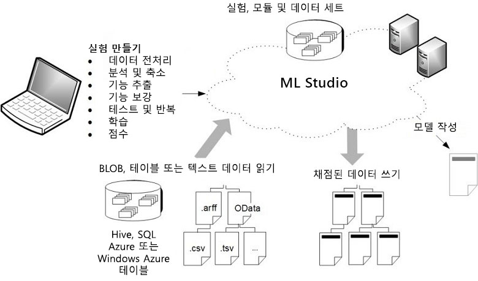

# Azure Machine Learning Studio란?
Microsoft Azure Machine Learning Studio는 데이터에 대한 예측 분석 솔루션을 빌드, 테스트, 배포할 수 있는 공동 끌어서 놓기 도구입니다. Machine Learning Studio는 Excel과 같은 BI 도구 또는 사용자 지정 앱에서 쉽게 사용할 수 있는 웹 서비스로 모델을 게시합니다.

Machine Learning Studio는 데이터 과학, 예측 분석, 클라우드 리소스 및 데이터가 만나는 장소입니다.

## Machine Learning Studio 대화형 작업 영역
예측 분석 모델을 개발하려면 일반적으로 원본 하나 이상의 데이터를 사용하고, 다양한 데이터 조작과 통계 함수를 통해 해당 데이터를 변환 및 분석하고, 결과 집합을 생성합니다. 이와 같은 모델을 개발하는 과정은 반복 프로세스이며, 다양한 함수와 해당 매개 변수를 수정할 때 학습된 효과적인 모델을 마련했다고 만족할 때까지 결과가 수렴됩니다.

**Azure Machine Learning Studio**에서는 예측 분석 모델을 간편하게 빌드, 테스트, 반복할 수 있는 대화형 시각적 작업 영역을 제공합니다. ***데이터 세트***와 분석 ***모듈***을 대화형 캔버스로 끌어서 놓고 함께 연결하여 ***실험***을 생성하고 Machine Learning 스튜디오에서 실행합니다. 모델 디자인을 반복하려면 실험을 편집하고 필요에 따라 복사본을 저장하고 실험을 다시 실행합니다. 준비가 되면 ***학습 실험***을 ***예측 실험***으로 변환한 다음 다른 사용자가 모델에 액세스할 수 있도록 ***웹 서비스***로 게시할 수 있습니다.

프로그래밍이 필요하지 않고 데이터 세트와 모듈을 시각적으로 연결하면 예측 분석 모델을 구성할 수 있습니다.

## Machine Learning Studio 개요 다이어그램 다운로드
**Microsoft Azure Machine Learning Studio 기능 개요** 다이어그램을 다운로드하여 Machine Learning Studio의 기능을 개략적으로 봅니다. 옆에 두고 보려면, tabloid 크기(11 x 17인치)로 다이어그램을 인쇄하면 됩니다.

**여기서 다이어그램 다운로드: [Microsoft Azure Machine Learning Studio 기능 개요](https://download.microsoft.com/download/C/4/6/C4606116-522F-428A-BE04-B6D3213E9E52/ml_studio_overview_v1.1.pdf)**

## Machine Learning Studio 시작
[Machine Learning Studio](https://studio.azureml.net)를 처음 시작하면 **홈** 페이지가 표시됩니다. 여기에서 설명서, 동영상, 웹 세미나를 보고 다른 유용한 리소스를 찾을 수 있습니다.

왼쪽 위 메뉴를 클릭합니다.  몇 가지 옵션이 표시됩니다.
### Azure Machine Learning Studio
여기에 시작한 페이지인 **홈**과 **Studio**, 두 가지 옵션이 있습니다.

**Studio**를 클릭하여 **Azure Machine Learning Studio**로 이동합니다. 먼저 Microsoft 계정이나 회사 또는 학교 계정을 사용하여 로그인하라는 메시지가 표시됩니다. 로그인하면 왼쪽에 다음과 같은 탭이 표시됩니다.

* **프로젝트** - 단일 프로젝트를 나타내는 실험, 데이터 세트, notebooks 및 기타 리소스의 컬렉션입니다.
* **실험** - 만들고 실행하거나 초안으로 저장한 실험입니다.
* **웹 서비스** - 실험에서 배포한 웹 서비스입니다.
* **노트북** - 사용자가 만든 Jupyter 노트북입니다.
* **데이터 세트** - 스튜디오로 업로드한 데이터 세트입니다.
* **학습된 모델** - 실험에서 학습하고 스튜디오에 저장한 모델입니다.
* **설정** - 계정과 리소스를 구성하는 데 사용할 수 있는 설정 모음입니다.

### 갤러리
**갤러리** 탭을 클릭하면 **[Azure AI Gallery](https://gallery.azure.ai/)** 로 이동합니다. 갤러리는 데이터 과학자 및 개발자 커뮤니티가 Cortana Intelligence Suite의 구성 요소를 사용하여 만든 솔루션을 공유하는 곳입니다.

갤러리에 대한 자세한 내용은 [Azure AI Gallery의 솔루션 공유 및 검색](gallery-how-to-use-contribute-publish.md)을 참조하세요.

## 실험 구성 요소
실험은 함께 연결하여 예측 분석 모델을 구성하는 분석 모듈에 데이터를 제공하는 데이터 세트로 구성됩니다. 특히 유효한 실험에는 다음 특성이 포함됩니다.

* 실험에는 하나 이상의 데이터 세트와 하나의 모듈이 있습니다.
* 데이터 세트는 모듈에만 연결될 수 있습니다.
* 모듈은 데이터 세트 또는 다른 모듈에 연결될 수 있습니다.
* 모듈에 대한 모든 입력 포트에는 데이터 흐름에 대한 연결이 포함되어야 합니다.
* 각 모듈에 대한 모든 필수 매개 변수를 설정해야 합니다.

실험을 처음부터 만들거나 기존 샘플 실험을 템플릿으로 사용할 수 있습니다. 자세한 내용은 [샘플 실험을 복사하여 새로운 기계 학습 실험 만들기](sample-experiments.md)를 참조하세요.

간단한 실험을 만드는 예는 [Azure Machine Learning Studio에서 간단한 실험 만들기](create-experiment.md)를 참조하세요.

예측 분석 솔루션을 만드는 자세한 연습 과정은 [Azure Machine Learning Studio를 사용한 예측 솔루션 개발](tutorial-part1-credit-risk.md)을 참조하세요.

### 데이터 세트
데이터 세트는 모델링 프로세스에서 사용할 수 있도록 Machine Learning Studio에 업로드된 데이터입니다. Machine Learning Studio에는 실험에 사용할 다양한 샘플 데이터 세트가 포함되고, 필요할 때 추가 데이터 세트를 업로드할 수 있습니다. 포함된 데이터 세트의 몇 가지 예제는 다음과 같습니다.

* **다양한 자동차에 대한 MPG 데이터** - 실린더 수, 마력 등으로 식별되는 자동차에 대한 MPG 값
* **유방암 데이터** - 유방암 진단 데이터
* **산불 데이터** - 포르투갈 북동부에서 발생한 산불 규모

실험을 빌드할 때 캔버스의 왼쪽에서 사용할 수 있는 데이터 세트의 목록에서 선택할 수 있습니다.

Machine Learning Studio에 포함된 샘플 데이터 세트의 목록은 [Azure Machine Learning Studio에서 예제 데이터 세트 사용](use-sample-datasets.md)을 참조하세요.

### 모듈
모듈은 데이터에 대해 수행할 수 있는 알고리즘입니다. Machine Learning Studio에는 데이터 가져오기 함수부터 학습, 점수 매기기 및 유효성 검사 프로세스에 이르는 다양한 모듈이 있습니다. 포함된 모듈의 몇 가지 예제는 다음과 같습니다.

* [ARFF로 변환][convert-to-arff] - .NET 직렬화된 데이터 세트를 ARFF(Attribute-Relation File Format) 형식으로 변환합니다.
* [기본 통계 계산][elementary-statistics] - 평균, 표준 편차 등의 기본 통계를 계산합니다.
* [선형 회귀][linear-regression] - 온라인 기울기 하강 기반 선형 회귀 모델을 만듭니다.
* [모델 점수 매기기][score-model] - 학습된 분류 또는 회귀 모델의 점수를 매깁니다.

실험을 빌드할 때 캔버스의 왼쪽에서 사용할 수 있는 모듈의 목록에서 선택할 수 있습니다.

모듈에는 모듈 내부 알고리즘을 구성하는 데 사용할 수 있는 매개 변수 집합이 포함될 수 있습니다. 캔버스에서 모듈을 선택할 때 모듈 매개 변수가 캔버스 오른쪽의 **속성** 창에 표시됩니다. 해당 창에서 매개 변수를 수정하여 모델을 튜닝할 수 있습니다.

사용 가능한 기계 학습 알고리즘의 대규모 라이브러리를 탐색하는 방법에 대한 도움말은 [Microsoft Azure Machine Learning Studio를 위한 알고리즘 선택 방법](algorithm-choice.md)을 참조하세요.

## 예측 분석 웹 서비스 배포
예측 분석 모델이 준비되면 Machine Learning Studio에서 곧바로 해당 모델을 웹 서비스로 배포할 수 있습니다. 이 프로세스에 대한 자세한 내용은 [Azure Machine Learning 웹 서비스 배포](publish-a-machine-learning-web-service.md)를 참조하세요.

## Azure Machine Learning Service는 Machine Learning Studio와 어떻게 다른가요?

[Azure Machine Learning Service](../service/overview-what-is-azure-ml.md)는 신속하게 데이터를 준비하고, 기계 학습 모델을 학습 및 배포할 수 있는 SDK 및 서비스를 제공합니다. 자동 크기 조정 컴퓨팅 및 파이프라인을 사용하여 생산성을 개선하고 비용을 줄이세요. PyTorch, TensorFlow 및 scikit-learn과 같은 오픈 소스 Python 프레임워크와 함께 이러한 기능을 사용하세요. 

머신 러닝 모델을 쉽고 빠르게 실험하고 솔루션에 기본 제공 머신 러닝 알고리즘으로 충분한 경우 Machine Learning Studio를 사용합니다.

Python 환경에서 작업하거나, 머신 러닝 알고리즘에 대한 제어 수준을 높이려 하거나, 오픈 소스 머신 러닝 라이브리러를 사용하려는 경우 머신 러닝 서비스를 사용합니다.

> [!NOTE]
> Azure Machine Learning Studio에서 만든 모델은 Azure Machine Learning Service로 배포하거나 관리할 수 없습니다.

## 평가판

[!INCLUDE [machine-learning-free-trial](../../../includes/machine-learning-free-trial.md)]

## 다음 단계
[단계별 빠른 시작](create-experiment.md)을 사용하거나 [샘플 기반 빌드](sample-experiments.md)를 통해 예측 분석 및 기계 학습에 대한 기본 사항을 알아볼 수 있습니다.

<!-- Module References -->
[convert-to-arff]: https://msdn.microsoft.com/library/azure/62d2cece-d832-4a7a-a0bd-f01f03af0960/
[elementary-statistics]: https://msdn.microsoft.com/library/azure/3086b8d4-c895-45ba-8aa9-34f0c944d4d3/
[linear-regression]: https://msdn.microsoft.com/library/azure/31960a6f-789b-4cf7-88d6-2e1152c0bd1a/
[score-model]: https://msdn.microsoft.com/library/azure/401b4f92-e724-4d5a-be81-d5b0ff9bdb33/
