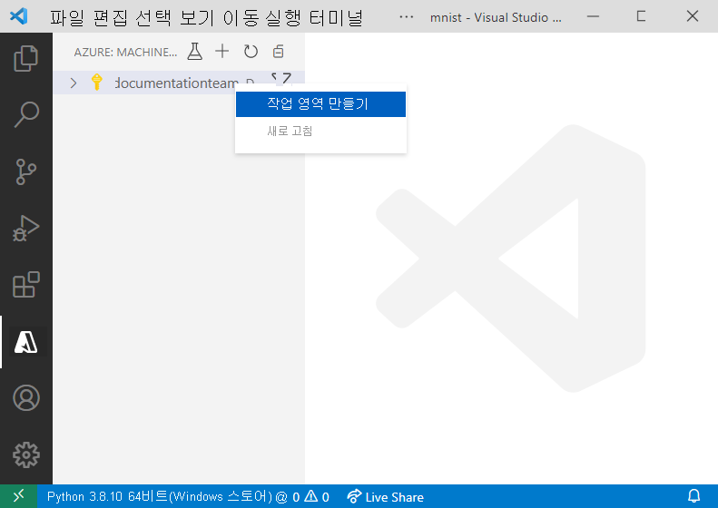
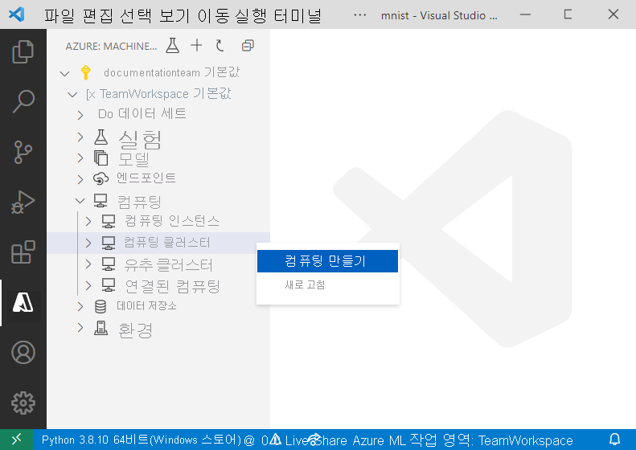

# <a name="train-and-deploy-an-image-classification-tensorflow-model-using-the-azure-machine-learning-visual-studio-code-extension"></a>Azure Machine Learning Visual Studio Code 확장을 사용하여 이미지 분류 TensorFlow 모델 학습 및 배포

TensorFlow 및 Azure Machine Learning Visual Studio Code 확장을 사용하여 필기 숫자를 인식하기 위해 이미지 분류 모델을 학습시키고 배포하는 방법에 대해 알아봅니다.

이 자습서에서는 다음 작업에 대해 알아봅니다.

> [!div class="checklist"]
> * 코드 이해
> * 작업 영역 만들기
> * 실험 만들기
> * 컴퓨터 대상 구성
> * 구성 파일 실행
> * 모델 학습
> * 모델 등록
> * 모델 배포

## <a name="prerequisites"></a>사전 요구 사항

- 동작합니다. 구독이 없는 경우 [Azure Machine Learning의 평가판 또는 유료 버전](https://aka.ms/AMLFree)에 가입하여 사용해 보세요.
- 간단한 플랫폼 간 코드 편집기인 [Visual Studio Code](https://code.visualstudio.com/docs/setup/setup-overview)를 설치합니다.
- Azure Machine Learning Visual Studio Code 확장. 설치 지침은 [Azure Machine Learning Visual Studio Code 확장 자습서 설정](./tutorial-setup-vscode-extension.md)을 참조하세요.

## <a name="understand-the-code"></a>코드 이해

이 자습서의 코드는 TensorFlow를 사용하여 0-9의 필기 숫자를 분류하는 이미지 분류 기계 학습 모델을 학습시킵니다. 이를 위해 입력으로 28px x 28px 이미지의 픽셀 값을 사용하고, 분류되는 각 숫자에 대해 하나씩 10개 확률의 목록을 출력하는 신경망을 만듭니다. 데이터의 모양을 보여 주는 샘플은 아래와 같습니다.  


이 자습서의 코드는 컴퓨터의 아무 곳에 [VS Code Tools for AI 리포지토리](https://github.com/microsoft/vscode-tools-for-ai/archive/master.zip)를 다운로드하고 압축을 풀어서 가져옵니다.

## <a name="create-a-workspace"></a>작업 영역 만들기

Azure Machine Learning에서 애플리케이션을 빌드하려면 가장 먼저 작업 영역을 만들어야 합니다. 작업 영역에는 학습된 모델 자체뿐만 아니라 모델을 학습시킬 수 있는 리소스도 포함됩니다. 자세한 내용은 [작업 영역이란?](./concept-workspace.md)을 참조하세요. 

1. Visual Studio Code 작업 막대에서 **Azure** 아이콘을 선택하여 Azure Machine Learning 보기를 엽니다.
1. Azure 구독을 마우스 오른쪽 단추로 클릭하고 **작업 영역 만들기**를 선택합니다. 
    
    > [!div class="mx-imgBorder"]
    > 

1. 기본적으로 만든 날짜와 시간이 포함된 이름이 생성됩니다. 텍스트 입력 상자에서 이름을 "TeamWorkspace"로 변경하고, **Enter** 키를 누릅니다.
1. **새 리소스 그룹 만들기**를 선택합니다. 
1. 리소스 그룹 이름을 "TeamWorkspace-rg"로 지정하고, **Enter** 키를 누릅니다. 
1. 작업 영역에 대한 위치를 선택합니다. 모델을 배포하려는 위치와 가장 가까운 위치를 선택하는 것이 좋습니다. 예를 들어 "미국 서부 2"입니다.
1. 작업 영역 형식을 선택하라는 메시지가 표시되면 **기본**을 선택하여 기본 작업 영역을 만듭니다. 다양한 작업 영역 제품에 대한 자세한 내용은 [Azure Machine Learning 개요](./overview-what-is-azure-ml.md#sku)를 참조하세요.

이 시점에서 새 작업 영역을 계정에 만들도록 요구하는 요청을 Azure에 보냅니다. 몇 분 후에 새 작업 영역이 구독 노드에 표시됩니다. 

## <a name="create-an-experiment"></a>실험 만들기

하나 이상의 실험을 작업 영역에 만들어 개별 모델 학습 실행을 추적하고 분석할 수 있습니다. 이 실행은 Azure 클라우드 또는 로컬 머신에서 수행할 수 있습니다.

1. Visual Studio Code 작업 막대에서 **Azure** 아이콘을 선택합니다. 그러면 Azure Machine Learning 보기가 표시됩니다.
1. 구독 노드를 펼칩니다.
1. **TeamWorkspace** 노드를 펼칩니다. 
1. 마우스 오른쪽 단추로 **실험** 노드를 클릭합니다.
1. 상황에 맞는 메뉴에서 **실험 만들기**를 선택합니다.

    > [!div class="mx-imgBorder"]
    > 

1. 실험 이름을 "MNIST"로 지정하고, **Enter** 키를 눌러 새 실험을 만듭니다. 

작업 영역과 마찬가지로, 제공된 구성을 사용하여 실험을 만들도록 요구하는 요청을 Azure에 보냅니다. 몇 분 후에 새 실험이 작업 영역의 *실험* 노드에 표시됩니다. 

## <a name="configure-compute-targets"></a>컴퓨팅 대상 구성

컴퓨팅 대상은 스크립트를 실행하고 학습된 모델을 배포하는 컴퓨팅 리소스 또는 환경입니다. 자세한 내용은 [Azure Machine Learning 컴퓨팅 대상 설명서](./concept-compute-target.md)를 참조하세요.

컴퓨팅 대상을 만들려면,

1. Visual Studio Code 작업 막대에서 **Azure** 아이콘을 선택합니다. 그러면 Azure Machine Learning 보기가 표시됩니다. 
1. 구독 노드를 펼칩니다. 
1. **TeamWorkspace** 노드를 펼칩니다. 
1. 작업 영역 노드에서 **컴퓨팅** 노드를 마우스 오른쪽 단추로 클릭하고 **컴퓨팅 만들기**를 선택합니다. 

    > [!div class="mx-imgBorder"]
    > 

1. **Azure Machine Learning 컴퓨팅(AmlCompute)** 을 선택합니다. Azure Machine Learning 컴퓨팅은 사용자가 작업 영역에서 다른 사용자와 함께 사용할 수 있는 단일 또는 다중 노드 컴퓨팅을 쉽게 만들 수 있는 관리형 컴퓨팅 인프라입니다.
1. VM 크기를 선택합니다. 옵션 목록에서 **Standard_F2s_v2**를 선택합니다. VM 크기는 모델을 학습시키는 데 걸리는 시간에 영향을 줍니다. VM 크기에 대한 자세한 내용은 [Azure에서 Linux 가상 머신에 대한 크기](https://docs.microsoft.com/azure/virtual-machines/linux/sizes)를 참조하세요.
1. 컴퓨팅 이름을 "TeamWkspc-com"으로 지정하고, **Enter** 키를 눌러 컴퓨팅을 만듭니다.

몇 분 후에 새 컴퓨팅 대상이 작업 영역의 *컴퓨팅* 노드에 표시됩니다.

## <a name="create-a-run-configuration"></a>실행 구성 만들기

학습 실행을 컴퓨팅 대상에 제출할 때 학습 작업을 실행하는 데 필요한 구성도 제출됩니다. 예를 들어 학습 코드와 이를 실행하는 데 필요한 Python 종속성이 포함된 스크립트가 있습니다.

실행 구성을 만들려면,

1. Visual Studio Code 작업 막대에서 **Azure** 아이콘을 선택합니다. 그러면 Azure Machine Learning 보기가 표시됩니다. 
1. 구독 노드를 펼칩니다. 
1. **TeamWorkspace** 노드를 펼칩니다. 
1. 작업 영역 노드 아래에서 마우스 오른쪽 단추로 **TeamWkspc-com** 컴퓨팅 노드를 클릭하고, **실행 구성 만들기**를 선택합니다.

    > [!div class="mx-imgBorder"]
    > 

1. 실행 구성 이름을 "MNIST-rc"로 지정하고, **Enter** 키를 눌러 실행 구성을 만듭니다.
1. 그런 다음, 학습 작업 형식으로 **TensorFlow 단일 노드 학습**을 선택합니다.
1. **Enter** 키를 눌러 컴퓨팅에서 실행할 스크립트 파일을 찾습니다. 이 경우 모델을 학습시키는 스크립트는 `vscode-tools-for-ai/mnist-vscode-docs-sample` 디렉터리 내의 `train.py` 파일입니다.
1. 입력 상자에서 다음을 입력하여 필요한 패키지를 지정합니다.
    
    ```text
    pip: azureml-defaults; conda: python=3.6.2, tensorflow=1.15.0
    ```
    
    `MNIST-rc.runconfig`라는 파일이 VS Code에서 다음과 비슷한 내용으로 표시됩니다.

    ```json
    {
        "script": "train.py",
        "framework": "Python",
        "communicator": "None",
        "target": "TeamWkspc-com",
        "environment": {
            "python": {
                "userManagedDependencies": false,
                "condaDependencies": {
                    "dependencies": [
                        "python=3.6.2",
                        "tensorflow=1.15.0",
                        {
                            "pip": [
                                "azureml-defaults"
                            ]
                        }
                    ]
                }
            },
            "docker": {
                "baseImage": "mcr.microsoft.com/azureml/base:0.2.4",
                "enabled": true,
                "baseImageRegistry": {
                    "address": null,
                    "username": null,
                    "password": null
                }
            }
        },
        "nodeCount": 1,
        "history": {
            "outputCollection": true,
            "snapshotProject": false,
            "directoriesToWatch": [
                "logs"
            ]
        }
    }
    ```

1. 구성에 만족하는 경우 **보기 > 명령 팔레트**를 차례로 선택하여 명령 팔레트를 엽니다.
1. 명령 팔레트에서 다음 명령을 입력하여 실행 구성 파일을 저장합니다.

    ```text
    Azure ML: Save and Continue
    ```

`MNIST-rc` 실행 구성이 *TeamWkspc-com* 컴퓨팅 노드 아래에 추가됩니다.

## <a name="train-the-model"></a>모델 학습

TensorFlow 모델은 학습 프로세스 중에 분류되는 각 숫자에 대한 학습 데이터와 이에 포함된 학습 패턴을 처리하여 만들어집니다. 

Azure Machine Learning 실험을 실행하려면 다음을 수행합니다.

1. Visual Studio Code 작업 막대에서 **Azure** 아이콘을 선택합니다. 그러면 Azure Machine Learning 보기가 표시됩니다. 
1. 구독 노드를 펼칩니다. 
1. **TeamWorkspace > 실험** 노드를 차례로 펼칩니다. 
1. 마우스 오른쪽 단추로 **MNIST** 실험을 클릭합니다.
1. **실험 실행**을 선택합니다.

    > [!div class="mx-imgBorder"]
    > 

1. 컴퓨팅 대상 옵션 목록에서 **TeamWkspc-com** 컴퓨팅 대상을 선택합니다.
1. 그런 다음, **MNIST-rc** 실행 구성을 선택합니다.
1. 이 시점에서 선택한 작업 영역의 컴퓨팅 대상에서 실험을 실행하도록 요구하는 요청을 Azure에 보냅니다. 이 프로세스는 몇 분 정도 걸립니다. 학습 작업을 실행하는 시간은 컴퓨팅 형식 및 학습 데이터 크기와 같은 몇 가지 요인의 영향을 받습니다. 실험 진행률을 추적하려면 마우스 오른쪽 단추로 현재 실행 노드를 클릭하고 **Azure Portal에서 실행 보기**를 선택합니다.
1. 외부 웹 사이트를 열도록 요청하는 대화 상자가 표시되면 **열기**를 선택합니다.

    > [!div class="mx-imgBorder"]
    > 

모델 학습이 완료되면 실행 노드 옆의 상태 레이블이 "완료됨"으로 업데이트됩니다.

## <a name="register-the-model"></a>모델 등록

이제 모델이 학습되었으므로 이를 작업 영역에 등록할 수 있습니다. 

모델을 등록하려면,

1. Visual Studio Code 작업 막대에서 **Azure** 아이콘을 선택합니다. 그러면 Azure Machine Learning 보기가 표시됩니다.
1. 구독 노드를 펼칩니다. 
1. **TeamWorkspace > 실험 > MNIST** 노드를 차례로 펼칩니다.
1. 모델 학습에서 생성된 모델 출력을 가져옵니다. 마우스 오른쪽 단추로 **실행 1** 실행 노드를 클릭하고, **출력 다운로드**를 선택합니다. 

    > [!div class="mx-imgBorder"]
    > 

1. 다운로드한 출력을 저장할 디렉터리를 선택합니다. 출력은 기본적으로 Visual Studio Code에서 현재 열려 있는 디렉터리에 배치됩니다.
1. 마우스 오른쪽 단추로 **모델** 노드를 클릭하고, **모델 등록**을 선택합니다.

    > [!div class="mx-imgBorder"]
    > 

1. 모델 이름을 "MNIST-TensorFlow-model"로 지정하고, **Enter** 키를 누릅니다.
1. TensorFlow 모델은 여러 개의 파일로 구성됩니다. 옵션 목록에서 모델 경로 형식으로 **모델 폴더**를 선택합니다. 
1. `azureml_outputs/Run_1/outputs/outputs/model` 디렉터리를 선택합니다.

    모델 구성이 포함된 파일은 Visual Studio Code에서 다음과 비슷한 내용으로 표시됩니다.

    ```json
    {
        "modelName": "MNIST-TensorFlow-model",
        "tags": {
            "": ""
        },
        "modelPath": "c:\\Dev\\vscode-tools-for-ai\\mnist-vscode-docs-sample\\azureml_outputs\\Run_1\\outputs\\outputs\\model",
        "description": ""
    }
    ```

1. 구성에 만족하면 명령 팔레트를 열고 다음 명령을 입력하여 이를 저장합니다.

    ```text
    Azure ML: Save and Continue
    ```

몇 분 후에 모델이 *모델* 노드 아래에 표시됩니다.

## <a name="deploy-the-model"></a>모델 배포

Visual Studio Code에서 모델을 웹 서비스로 다음 리소스에 배포할 수 있습니다.

+ ACI(Azure Container Instances)
+ AKS(Azure Kubernetes Service)

ACI 컨테이너는 필요에 따라 만들어지므로 미리 테스트할 ACI 컨테이너를 만들 필요가 없습니다. 그러나 AKS 클러스터는 미리 구성해야 합니다. 배포 옵션에 대한 자세한 내용은 [Azure Machine Learning을 사용하여 모델 배포](how-to-deploy-and-where.md)를 참조하세요.

웹 서비스를 ACI로 배포하려면,

1. Visual Studio Code 작업 막대에서 **Azure** 아이콘을 선택합니다. 그러면 Azure Machine Learning 보기가 표시됩니다.
1. 구독 노드를 펼칩니다. 
1. **TeamWorkspace > 모델** 노드를 차례로 펼칩니다. 
1. 마우스 오른쪽 단추로 **MNIST-TensorFlow-model**을 클릭하고, **등록된 모델에서 서비스 배포**를 선택합니다.

    > [!div class="mx-imgBorder"]
    > 

1. **Azure Container Instances**를 선택합니다.
1. 서비스 이름을 "mnist-tensorflow-svc"로 지정하고, **Enter** 키를 누릅니다.
1. 입력 상자에서 **Enter** 키를 누르고 `mnist-vscode-docs-sample` 디렉터리에서 `score.py` 파일을 찾아서 컨테이너에서 실행할 스크립트를 선택합니다.
1. 입력 상자에서 **Enter** 키를 누르고 `mnist-vscode-docs-sample` 디렉터리에서 `env.yml` 파일을 찾아서 스크립트를 실행하는 데 필요한 종속성을 제공합니다.

    모델 구성이 포함된 파일은 Visual Studio Code에서 다음과 비슷한 내용으로 표시됩니다.

    ```json
    {
        "name": "mnist-tensorflow-svc",
        "imageConfig": {
            "runtime": "python",
            "executionScript": "score.py",
            "dockerFile": null,
            "condaFile": "env.yml",
            "dependencies": [],
            "schemaFile": null,
            "enableGpu": false,
            "description": ""
        },
        "deploymentConfig": {
            "cpu_cores": 1,
            "memory_gb": 10,
            "tags": {
                "": ""
            },
            "description": ""
        },
        "deploymentType": "ACI",
        "modelIds": [
            "MNIST-TensorFlow-model:1"
        ]
    }
    ```
1. 구성에 만족하면 명령 팔레트를 열고 다음 명령을 입력하여 이를 저장합니다.

    ```text
    Azure ML: Save and Continue
    ```

이 시점에서 웹 서비스를 배포하도록 요구하는 요청을 Azure에 보냅니다. 이 프로세스는 몇 분 정도 걸립니다. 배포되면 새 서비스가 *엔드포인트* 노드 아래에 표시됩니다.

## <a name="next-steps"></a>다음 단계

* Visual Studio Code 외부에서 Azure Machine Learning을 사용하여 학습하는 방법을 연습하려면 [자습서: Azure Machine Learning을 사용하여 모델 학습](tutorial-train-models-with-aml.md)을 참조하세요.
* 코드를 로컬로 편집, 실행 및 디버그하는 방법을 연습하려면 [Python hello-world 자습서](https://code.visualstudio.com/docs/Python/Python-tutorial)를 참조하세요.

